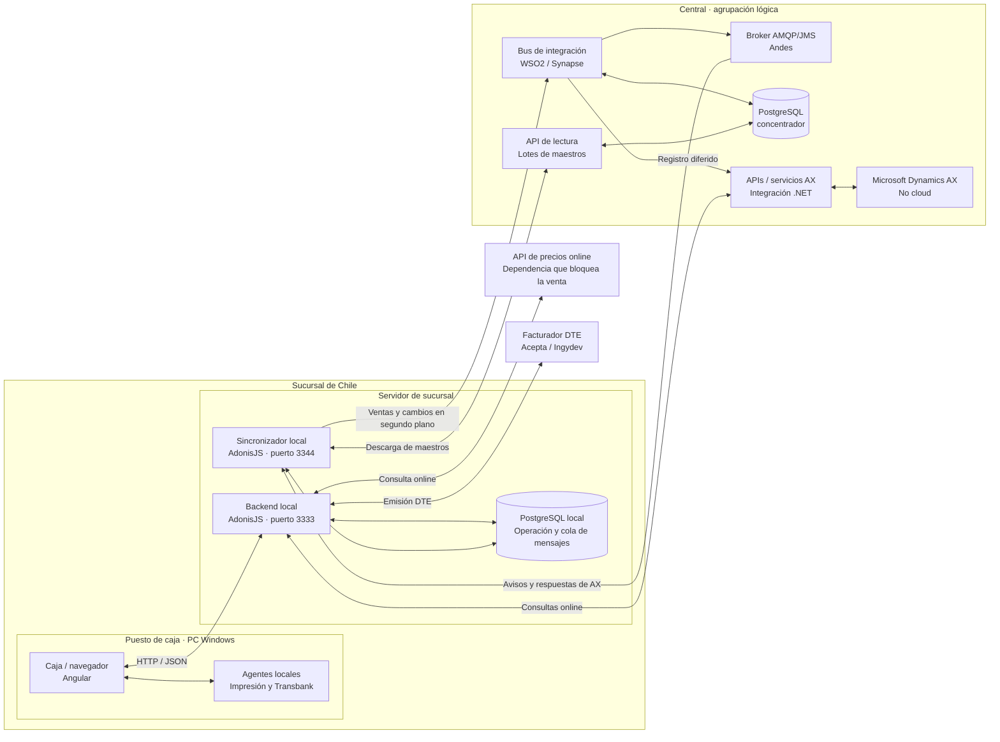
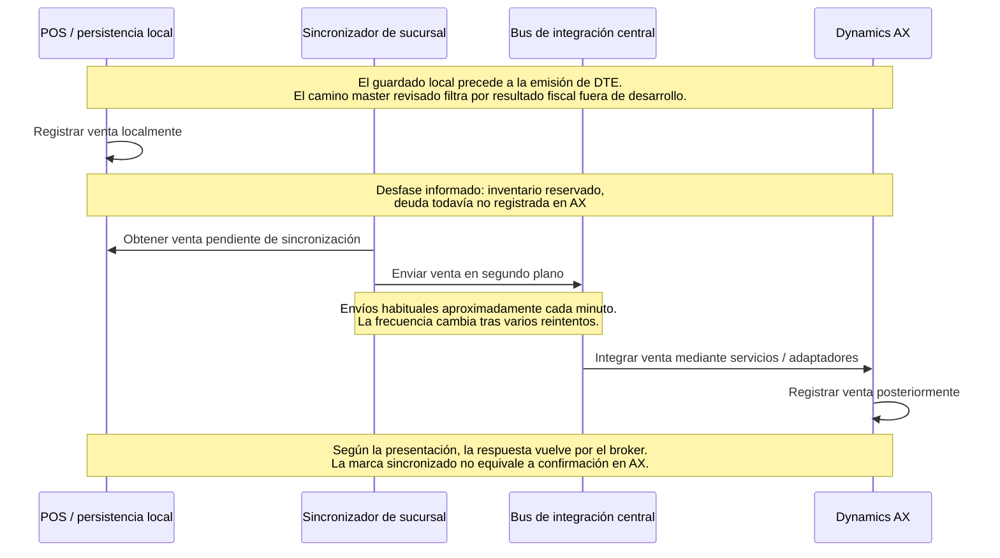

# POS enterprise para Chile, Perú y España

La **[presentación web POS Atlas](presentation/index.html)** reúne ocho capítulos sobre el sistema actual y la arquitectura propuesta. Ecosistema comienza con la vista general; Propuesta abre el modelo C4 y sus decisiones de backend, persistencia y sincronización; Datos comienza con los maestros. Los recorridos de interacciones se abren cuando se necesita profundizar.

La [colección C4 editable en Excalidraw](docs/diagramas-excalidraw/index.html) incluye contexto, contenedores, componentes, despliegue y flujos detallados de precios y venta, con archivos individuales y un atlas completo.

La **[presentación detallada de arquitectura](presentation/architecture.html)** conecta esos diagramas en 19 diapositivas, con cinco laboratorios sobre venta, entrega HTTPS, precios, BullMQ y RabbitMQ. Permite recorrer 15 casos con código resaltado, reproducir y pausar cada secuencia, consultar notas y descargar los diagramas editables. Comparte la publicación de Vercel de POS Atlas mediante `/arquitectura`; los laboratorios usan datos sintéticos y no conectan sistemas reales.

Para una consulta concreta: [venta actual](presentation/index.html#mapa?flujo=sale), [entrega ERP propuesta](presentation/index.html#propuesta?flujo=proposed-erp) o [maestros y tablas](presentation/index.html#datos?flujo=D03). La [guía breve de la presentación](presentation/README.md) explica cómo abrir y recorrer el material; la [guía canónica del visor](docs/visor-interacciones-componentes.md) concentra sus controles y convenciones.

La [propuesta y sus ADR](docs/propuesta-arquitectura.md) son la fuente de las recomendaciones vigentes, todavía por aprobar. Los [informes por repositorio](docs/analisis-repositorios/README.md) conservan la evidencia de código y la [matriz de cobertura](docs/cobertura-documentacion-presentacion.md) indica qué se resume, qué se explora y qué exige abrir un documento. El tutorial funciona localmente y no ejecuta operaciones del POS ni verifica producción.

## Estado del documento

Recopilación inicial de antecedentes para preparar una propuesta de arquitectura enterprise-grade de un sistema de punto de venta (POS) para Chile, Perú y España.

Este documento se ampliará a medida que se reciba más información. Describe el estado actual conocido, los requisitos declarados y las líneas de trabajo a evaluar. Existe un [borrador de propuesta de arquitectura](docs/propuesta-arquitectura.md) con [criterios de validación y decisiones pendientes](docs/validacion-y-decisiones.md); su aprobación y las decisiones tecnológicas siguen pendientes.

La [solicitud de información al equipo](docs/solicitud-informacion-equipo.md) reúne diez decisiones prioritarias, responsables sugeridos, evidencias técnicas y una plantilla para responder por país. También distingue arquitectura objetivo, estabilización del sistema vigente y transición.

Las alternativas posteriores planteadas por el usuario —**NestJS + Fastify, `nestjs-pino`, Sentry, Tauri, monorepo con Nx y monolito modular**— están registradas en [Opciones tecnológicas](docs/opciones-tecnologicas.md), con evaluación, límites y condiciones de validación. Continúan como candidatas para el nuevo POS; no se ha implementado el producto objetivo.

La segunda revisión incorpora **`core`, `devops-platform` e `integration-presentations`**. Verifica un precedente corporativo real para Nx, NestJS/Fastify, Pino/Sentry, módulos y workers, y distingue los componentes reutilizables de las capacidades offline pendientes. El [análisis de aportes corporativos](docs/analisis-repositorios/aportes-plataforma-corporativa.md) reúne la recomendación ajustada, riesgos, diagrama y preguntas nuevas al equipo.

### Mapa de la documentación

| Información recibida o elaborada | Ubicación |
| --- | --- |
| Países, ERPs informados, offline, arquitectura chilena, tecnologías, datos y ofertas | Este README, secciones 1–6. |
| Imagen y presentación originales | [Referencias](docs/referencias/) y [antecedentes de la presentación](docs/antecedentes-presentacion-chile.md). |
| Qué es un concentrador y cómo se distingue de su repositorio, base y aplicación de administración | [Definición de concentrador](docs/analisis-repositorios/mountain-concentrador.md#qué-significa-concentrador); también disponible en el glosario de la presentación con **G**. |
| Cobertura de la presentación respecto de fuentes, apuntes y documentos | [Matriz de cobertura](docs/cobertura-documentacion-presentacion.md): resumen visible, detalle exploratorio, enlaces y vacíos. |
| Endpoints actuales, repositorios y ubicación de componentes | [Catálogo de integraciones](docs/catalogo-integraciones-actuales.md): declaraciones y llamadas diferenciadas, contratos configurables, fuentes por SHA y despliegue por confirmar. |
| Quién llama a quién dentro de aplicaciones y bases | [Guía canónica del visor](docs/visor-interacciones-componentes.md): acceso a ocho recorridos, controles y significado de conexiones; implementación interna en las fichas. |
| Despliegue, secuencias, actividad y estados | [Vistas técnicas](docs/vistas-arquitectura-y-flujos.md): seis vistas con alcance, límite de evidencia, escenarios de fallo y recuperación. |
| Bases y tablas dentro de operaciones actuales | [Recorridos de datos](docs/recorridos-datos-tablas.md): cinco Mermaid con lecturas/escrituras, transacciones, endpoints y fuentes; explorables paso a paso en Datos. |
| Operación cotidiana y entrega de versiones | [Operación y evolución](docs/operacion-caja-y-evolucion.md): apertura/arqueo/cierre, precierre con efectos, contexto del precio, acuse de impresión, compatibilidad y permisos offline. Ocho diagramas comparan actual/propuesto. |
| Naming, ACL/fachadas y posible migración hacia ERP común | Sección 7 de este README y [propuesta de arquitectura](docs/propuesta-arquitectura.md). |
| Repositorios analizados y aclaración de rama `main` probable | [Análisis consolidado e informes por repositorio](docs/analisis-repositorios/README.md), con ramas y commits exactos. |
| Repositorios corporativos `core`, `devops-platform` e `integration-presentations` | [Aportes a la arquitectura POS](docs/analisis-repositorios/aportes-plataforma-corporativa.md) e informes individuales enlazados. |
| Apuntes posteriores: stock, MPOS SQL, actualización de cliente por RUT e Instacheck | [Contraste de apuntes de operación de Chile](docs/contraste-apuntes-operacion-chile.md), con hechos, hipótesis y evidencia de código. |
| Arquitectura enterprise, separación entre objetivo/estabilización/transición y límites de la propuesta | [Propuesta](docs/propuesta-arquitectura.md) y [solicitud al equipo](docs/solicitud-informacion-equipo.md). |
| Datos por pedir al equipo, responsables y plantilla | [Solicitud de información](docs/solicitud-informacion-equipo.md). |
| NestJS, Fastify, Pino, Sentry, Tauri, monorepo Nx y monolito modular | [Opciones tecnológicas](docs/opciones-tecnologicas.md). |
| C4: contexto, aplicaciones y bases, componentes y despliegue; PostgreSQL y espejo de precios/ofertas | [Arquitectura C4 detallada](docs/c4-arquitectura-propuesta.md) y [caso de precios y ofertas](docs/operacion-caja-y-evolucion.md#o02--precio-oferta-y-reglas-locales). |
| Pruebas futuras, objetivos preliminares, riesgos y decisiones pendientes | [Validación y decisiones](docs/validacion-y-decisiones.md). |
| Horario de sincronización, mantenimiento, WSO2/RabbitMQ/BullMQ, consolidación de bases y expansión | [Revisión corporativa](docs/revision-arquitectura-corporativa.md), [mensajería](docs/investigacion-mensajeria-pos.md) y [resiliencia](docs/revision-resiliencia-datos-pos.md). |
| Tiendas publicadas en Chile, Perú y España | [Inventario público y límites](docs/cobertura-publica-sucursales.md). |
| Variación de facturadores, aplicaciones de impresión, impresoras y terminales por país/sucursal | [Extensibilidad de proveedores y dispositivos](docs/extensibilidad-proveedores-dispositivos.md): contratos, perfiles, capacidades, adaptadores y sustitución controlada. |
| Propuestas de inteligencia artificial para el POS | [Servicios de IA](docs/servicios-ia-pos.md): casos priorizados, proveedores candidatos, alternativas offline, controles, métricas y pilotos. Son propuestas por validar, no funcionalidades implementadas. |
| Crecimiento hacia RFID, conteos rápidos y posibles cajas de autoservicio | [Evolución RFID y autoservicio](docs/evolucion-rfid-autoservicio.md): etiquetado, captura de productos, integración con el dueño de inventario, pruebas físicas y convivencia con códigos de barras. Oportunidad futura, no alcance aprobado. |

La documentación consolida los antecedentes y las propuestas; no es una transcripción literal del chat. Se preserva la diferencia entre lo informado por el usuario, evidencia de fuentes y recomendaciones aún por validar.

**Ampliación solicitada: IA en el POS.** Se evalúan asistentes de procedimientos, búsqueda de catálogo, extracción de pedidos, análisis de pendientes, recomendaciones y soporte operativo. La IA es una capacidad opcional y aislada: su fallo no bloquea las operaciones que el POS ya permita. Precios, pagos, fiscalidad, permisos y compatibilidad de productos mantienen sus autoridades y validaciones. El [documento de IA](docs/servicios-ia-pos.md) y el capítulo interactivo correspondiente distinguen los pilotos candidatos de las capacidades futuras.

**Posibilidad futura informada:** si la empresa crece, podría incorporar lectores RFID para una experiencia de caja inspirada en Decathlon y para acelerar conteos. Se registra como opción de evolución. No modifica el antecedente de que la caja actual no maneja stock ni selecciona todavía autoservicio, hardware o proveedores. El [diseño de RFID](docs/evolucion-rfid-autoservicio.md) mantiene separadas lectura, revisión de cesta, venta/pago y ajuste de inventario.

Se distinguen cinco tipos de información:

- **Informado:** antecedentes entregados directamente por el usuario.
- **Observado:** componentes y etiquetas visibles en la imagen de la arquitectura actual de Chile.
- **Documentado en la presentación:** contenido de las 15 diapositivas y sus notas del presentador. No equivale a una comprobación del código o del despliegue real.
- **Verificado en código:** comportamiento observado mediante revisión estática de los repositorios entregados, limitado a los commits registrados. No acredita qué está desplegado ni el resultado de una ejecución real. El material de `integration-presentations` se considera arquitectura declarada y ejemplos, no implementación productiva.
- **Por confirmar:** información aún no disponible o cuyo alcance requiere precisión.

La presentación original amplía el contexto chileno. El [detalle de los antecedentes de la presentación](docs/antecedentes-presentacion-chile.md) reúne módulos, versiones, integraciones, dependencias y discrepancias, con referencias por diapositiva.

El [análisis de repositorios](docs/analisis-repositorios/README.md) incorpora inventario, flujos, riesgos y evidencia por commit, además de sus consecuencias para offline, naming, ACL y migración ERP. El usuario considera `main` la rama más probable de producción; solo dos de los cinco repositorios iniciales tienen esa rama entre las referencias consultadas. Los tres repositorios corporativos añadidos sí tienen `main`. La tabla del análisis distingue `main`, `master` y `desarrollo` sin dar el despliegue por confirmado.

## 1. Objetivo y alcance

**Informado:** se debe entregar una propuesta de arquitectura enterprise-grade para un POS que opere en los tres países, tomando como punto de partida la arquitectura existente en Chile.

Requisitos iniciales:

| ID | Requisito | Alcance conocido |
| --- | --- | --- |
| REQ-01 | Operación en Chile, Perú y España | La propuesta debe contemplar los sistemas existentes de cada país. |
| REQ-02 | Funcionamiento offline | Es obligatorio. La presentación documenta que hoy la consulta de precios online bloquea continuar o finalizar la venta si no está disponible. El alcance objetivo y la duración de la desconexión están por definir. |
| REQ-03 | Módulo de ofertas local | Actualmente las ofertas son solo de lectura en caja y el módulo está centralizado. Se requiere un módulo local. |
| REQ-04 | Arquitectura enterprise-grade | Los criterios medibles de disponibilidad, seguridad, rendimiento, recuperación y operación están por definir. |
| REQ-05 | Un POS corporativo para distintos proveedores y dispositivos | Facturación, impresión y terminales de pago pueden variar por país, sucursal y caja. Reutilizar el núcleo; cambiar perfiles cuando exista soporte y desarrollar/homologar adaptadores cuando cambie el contrato o protocolo. Modelos y combinaciones reales pendientes de inventario. |

## 2. Sistemas informados por país

| País | Sistema informado como ERP | Condiciones conocidas | Información pendiente |
| --- | --- | --- | --- |
| Chile | Microsoft Dynamics AX | No cloud; recibe información del POS mediante un bus de integración central. | Versión, despliegue, interfaces y restricciones de integración. |
| Perú | Sistema custom | Desarrollo a medida. | Capacidades, interfaces, modelo de datos y despliegue. |
| España | Gira | Nombre confirmado por el usuario. | Versión, despliegue, capacidades, interfaces y responsables de integración. |

El detalle de la arquitectura disponible corresponde a **Chile**. Todavía no se ha descrito la topología actual de Perú ni de España.

**Aclaración del usuario:** el sistema de España es **Gira**. Queda corregida la denominación inicial y resuelta la discrepancia con las presentaciones corporativas. El código corporativo tiene capacidades por país, pero no demuestra un POS completo desplegado en Perú/España. [Contraste de fuentes](docs/analisis-repositorios/integration-presentations.md).

### Evolución prevista del ERP

**Informado por el usuario:** la empresa busca que los tres países utilicen el mismo ERP. Es posible que la migración comience el próximo año, empezando por Chile.

**Tentativo:** tomando 2026 como referencia de esta conversación, el horizonte mencionado sería 2027. No constituye una fecha comprometida. Están por confirmar el ERP destino, alcance funcional, calendario y orden posterior de Perú y España. Tampoco se ha definido si compartirán una instancia o tendrán instalaciones separadas del mismo producto.

La propuesta debe considerar los sistemas actuales, una posible etapa de coexistencia y el ERP común futuro. Las particularidades de cada país y el requisito offline se mantienen como aspectos a resolver, aun cuando converja el ERP.

## 3. Arquitectura actual de Chile

### 3.1. Distribución por sucursal

**Informado:** la solución funciona de forma distribuida. Cada sucursal tiene su propia base de datos, backend y sincronizador.

**Aclaración posterior del usuario:** la caja no maneja stock. Esto describe el alcance operativo informado; no se le atribuye autoridad sobre inventario ni la creación de la reserva mencionada en el flujo de venta. El repositorio contiene funciones relacionadas con stock cuya utilización productiva no está acreditada. El [contraste de apuntes](docs/contraste-apuntes-operacion-chile.md) distingue esas funciones del flujo de caja.

La sincronización con Dynamics AX ocurre en segundo plano a través de un bus de integración central. AX conoce la venta después de su registro local.

**Documentado en la presentación (diap. 6):** el puesto de caja es un PC Windows con la aplicación web y los agentes locales. El backend, el sincronizador y la base local corren en el servidor de la sucursal. La API de lectura, el bus, el broker, la administración del concentrador, las APIs de AX y la consulta de pagos están en central.

El siguiente diagrama resume las rutas principales del estado actual. Distingue las consultas online del registro diferido en AX. Los bloques centrales son una agrupación lógica, no un único servidor físico (nota de diap. 5).

**Documentado en la presentación (diap. 6, 13 y 14):** el diseño aspiraba a operar 100% offline, pero la consulta de precios depende de una API online. Sin conexión o si esa API falla, la caja no puede continuar ni finalizar la venta. Facturación y crédito también dependen de servicios externos. La presencia de servicios locales no demuestra autonomía offline completa.

**Por confirmar:** número de terminales por servidor, redundancia local y topología efectiva. La diapositiva 6 precisa el despliegue por sucursal, pero el segundo bloque «PostgreSQL de caja» de la imagen sigue sin estar explicado.

### 3.2. Venta, emisión de DTE y registro en AX

**Qué es un DTE en Chile:** un documento tributario electrónico. Es una categoría que incluye **factura electrónica** y **boleta electrónica de ventas y servicios**, además de notas de crédito, notas de débito y guías de despacho electrónicas, entre otros tipos. También existen variantes no afectas o exentas de factura y boleta. Por tanto, emitir una boleta o una factura electrónica es emitir un DTE. Aquí «boleta» se refiere a ventas y servicios. [Tipos de DTE publicados por el SII](https://www.sii.cl/preguntas_frecuentes/factura_electronica/001_003_6625.htm).

**Informado:**

- Emitir el documento tributario electrónico (DTE) y registrar la venta en AX son pasos separados.
- El registro en AX llega minutos después y depende del sincronizador.
- En condiciones habituales se envían ventas aproximadamente cada minuto.
- Cuando una venta acumula varios reintentos, la frecuencia deja de ser de aproximadamente un minuto. La política desplegada en producción no está confirmada; la identificada en los commits revisados se detalla en el [informe del sincronizador](docs/analisis-repositorios/mountain-sync-sucursal.md).
- Durante el desfase descrito, el inventario queda reservado, pero la deuda todavía no está registrada en AX.

**Documentado en la presentación:** la venta se guarda localmente **antes de emitir el DTE** (nota de diap. 10). Si falla el facturador, puede quedar una venta guardada sin DTE emitido (diap. 13).

**Verificado en código:** Mountain hace commit antes de facturar. El sincronizador `master` revisado, fuera de modo desarrollo, filtra ventas según documento vigente y DTE aprobado o aprobado con reparo, además de dependencias de cliente/dirección. Esto precisa la elegibilidad para subida en ese camino; la rama y configuración productivas siguen pendientes. [Flujo de Mountain](docs/analisis-repositorios/mountain-implementos.md), [condiciones del sincronizador](docs/analisis-repositorios/mountain-sync-sucursal.md).

El flujo es conceptual: no especifica contratos ni garantías de entrega. El intervalo aproximado de envío no constituye un compromiso de latencia de extremo a extremo. Las ventanas horarias documentadas también condicionan el desfase.

### 3.3. Sincronización y significado de los estados

**Documentado en la presentación (diap. 7, 11, 12 y 14):**

- La integración transporta mensajes; no es replicación de bases de datos entre la tienda y AX.
- El sincronizador sube transacciones al bus. Las respuestas de AX regresan a la sucursal por el broker.
- Para bajar maestros, el bus detecta cambios en AX, envía un aviso por cola y la sucursal descarga el lote desde la API de lectura y confirma. El aviso y los datos viajan por canales separados.
- Existen dependencias de orden: cliente antes de su dirección y venta registrada en AX antes de su pago.
- La administración del concentrador permite revisar mensajes y errores y reintentar envíos.
- La marca «sincronizado» indica preparación según las notas de la diapositiva 14; no acredita confirmación en AX.

La diapositiva 12 declara una ventana de lunes a viernes de 07:00 a 22:00 y sábado de 07:00 a 16:00, fuera de la cual no se sincroniza. **Existe una discrepancia:** las notas de esa misma diapositiva afirman que una venta del sábado a las 18:00 sube el domingo a las 07:00. El calendario real, el huso horario y su aplicación a subida y bajada quedan por confirmar.

**Verificado en código:** el `master` del sincronizador permite domingo de 07:00 a 22:00, y sábado de 07:00 a 16:00. No todos los caminos están sujetos a esa ventana. Los cron, límites de lote, esperas, reintentos y diferencias con `desarrollo` se detallan en el [informe del sincronizador](docs/analisis-repositorios/mountain-sync-sucursal.md). La zona horaria del proceso y el despliegue efectivo todavía requieren verificación.

La revisión también separa `documentos.sincronizado`, `comprobante_ventas.sincronizado` y sus respectivas confirmaciones AX: tienen ciclos distintos. Cruzar la marca de preparación del pago con el filtro de `/pagosSinSinc` revela una posible ventana de subestimación del consumo de NC en otra sucursal. No se ha demostrado doble utilización; se requiere validar los demás controles. El [análisis transversal](docs/analisis-repositorios/README.md#5-estados-y-riesgo-transversal-de-notas-de-crédito) reúne la evidencia y las condiciones.

Además de los lotes de maestros, el código confirma **refresco individual de cliente al cargarlo en caja**: consulta una API por RUT y guarda la respuesta localmente. Esto complementa la sincronización masiva. Si falla la consulta, el flujo principal puede limpiar la venta aunque tenga datos locales; no hay continuidad offline garantizada por esa copia. [Traza y límites](docs/contraste-apuntes-operacion-chile.md#5-qué-sucede-al-buscar-o-cargar-un-cliente-por-rut), [MI-09](docs/analisis-repositorios/mountain-implementos.md).

### 3.4. Componentes visibles en la imagen

**Observado:** la referencia se titula «Esquema visual de arquitectura: Sistema Caja Mountain / Implementos (v2.5.14)» y organiza el ecosistema en cuatro capas.

| Capa | Componentes observados | Responsabilidad o detalle visible |
| --- | --- | --- |
| Presentación | Navegador / Angular | POS, cobranzas, reportes y sincronizador, según la etiqueta de la imagen. |
| Presentación y dispositivos | API de impresión Windows, puerto 8181 | Integración con impresora / lector de cheques. |
| Presentación y dispositivos | Agente POS Transbank + terminal | Integración con el dispositivo de pago. |
| Negocio y persistencia de sucursal | Backend AdonisJS, puerto 3333 | Reglas de caja, ventas, pagos y DTE. |
| Negocio y persistencia de sucursal | Servicios de facturación | Acepta / Ingydev. |
| Negocio y persistencia de sucursal | Sincronizador AdonisJS, puerto 3344 | Sincronización de maestros y subida de cambios. |
| Negocio y persistencia de sucursal | PostgreSQL de caja | Esquemas o áreas rotuladas como `public`, `sincronizador` y `servicios`. |
| Integración de sucursal | APIs .NET y API de consulta de pagos | Comunicación con otros componentes de integración. |
| Integración central | Broker AMQP/JMS (Andes) | Mensajería y notificaciones AMQP. |
| Integración central | WSO2 / Synapse | DSS, CAR y mediadores Java. |
| Integración central | API de lectura, administración del concentrador y procesador de cola del bus | Componentes asociados al concentrador y al procesamiento de mensajes. |
| Integración central | PostgreSQL concentrador | Persistencia del concentrador. |
| Integración central | MongoDB (`estadoNC`) | Persistencia asociada a notas de crédito. |
| Integración central | API de consulta de pagos, puerto 3386, y otro bloque «PostgreSQL de caja» | Ubicación y relación con las bases locales por confirmar. |
| Integración / adaptación ERP | SQL Server AX / tablas de integración | Aparece en el entorno de integración y adaptación a AX. |
| Adaptación ERP | APIs .NET (`apiMountainPosCaja`, `ApiCliente`, etc.), servicios AX / adaptadores y `DATOSAXSQL` | Componentes de integración con Dynamics AX. |
| ERP | Dynamics AX (AOS) | Conexión representada mediante WCF / NET.TCP, puerto 8201. |
| Sistemas externos | Facturador DTE, Transbank Network, Orsan / Instacheck y QlikTail | Sistemas enumerados en la referencia. Sus contratos y flujos están pendientes de detallar. |

**Actualización del usuario:** Instacheck ya no funciona como integrador. Se conserva en esta tabla por fidelidad a la imagen histórica, pero no se considera una dependencia operativa vigente. Su código sigue presente en Mountain; eso no prueba que esté habilitado. No se ha informado el mismo cambio para Orsan. [Contraste y evidencia](docs/contraste-apuntes-operacion-chile.md).

La imagen también muestra HTTP/JSON, HTTPS/JSON/JWT, AMQP/JMS, JDBC y DSS/JDBC. Estas etiquetas se documentan como antecedentes del diseño actual; no implican que se hayan validado las conexiones o su configuración de seguridad.

## 4. Aplicaciones y tecnologías

**Informado:** existen **seis aplicaciones** y se utilizan estas tecnologías:

| Tecnología | Evidencia disponible |
| --- | --- |
| Angular | Interfaz de caja visible en la imagen. |
| Node.js | Tecnología informada; la imagen identifica backend y sincronizador AdonisJS. |
| .NET | APIs y componentes de integración visibles en la imagen. |
| Java | Mediadores de WSO2 / Synapse indicados en la imagen. |

**Documentado en la presentación (diap. 3):** la aplicación web tiene siete módulos: ofertas, punto de venta, cobranzas, devoluciones, reportes, configuraciones y sincronizador. Este último es un tablero de integración para soporte, distinto del proceso de sincronización de la sucursal.

La matriz de la diapositiva 9 identifica diez componentes tecnológicos e incluye Angular 8.2.14, AdonisJS 4.1, Express 4.17, WSO2 EI 6.6.0, .NET Framework 4.5 para APIs corporativas y .NET Framework 4.7.2 para impresión. Las versiones y dependencias se recopilan en el [anexo de la presentación](docs/antecedentes-presentacion-chile.md#4-matriz-tecnológica-documentada).

**Por confirmar:** cómo se agrupan esos componentes en las «seis aplicaciones» informadas, sus repositorios y unidades de despliegue. Las seis agrupaciones tecnológicas de la diapositiva 8, los seis servicios de la diapositiva 11 y los siete módulos funcionales no constituyen el mismo inventario.

**Verificado en código:** Mountain reúne frontend, backend y backend-concentrador. La solución .NET corporativa contiene nueve proyectos API y tres bibliotecas; impresión incorpora servicio Windows, biblioteca, proyecto web alternativo e instalador. Los otros repositorios cubren sincronizador y consulta de pagos. El [inventario reconstruido](docs/analisis-repositorios/README.md#3-inventario-reconstruido) distingue proyectos de despliegues. La ampliación de mountain-concentrador incorpora WSO2/DSS, mediadores Java, api-lectura y procesador-cola-bus; sus artefactos instalados siguen pendientes de identificar. El proyecto del agente Transbank no fue recibido.

## 5. Persistencia y datos

**Documentado en la presentación (diap. 2 y 7):** «tres bases de datos» corresponde a **tres motores**, con funciones distintas:

| Motor | Uso documentado |
| --- | --- |
| PostgreSQL | En sucursal: ventas, pagos, sesiones de caja, maestros locales y cola del sincronizador. En central: registro de mensajes del concentrador. |
| SQL Server | Base de Dynamics AX y tablas de intercambio que el bus revisa para detectar cambios de maestros. |
| MongoDB | Estado de notas de crédito, consultado por la API de pagos durante devoluciones. |

La presentación precisa que el elemento inicialmente denominado «AX» corresponde a SQL Server como motor. No afirma que existan solamente tres instancias. La tienda y AX mantienen persistencia separada y se comunican mediante mensajes.

**MPOS, precisión del 2 de octubre:** mountain-concentrador confirma lectores JDBC de SQL Server MPOS, CustTableSync y la llamada a sp_caja_custTable. El productor AX→MPOS, el horario diario y el servidor siguen pendientes. La generación central, la descarga por API y la aplicación local son etapas distintas. [Auditoría central](docs/analisis-repositorios/mountain-concentrador.md).

**Verificado en código:** MongoDB tiene más usos que NC: directorio de sucursales/conexiones en `api-pagos-caja` y datos para reglas de precios en `apis-implementos`. La API de pagos consulta directamente PostgreSQL de sucursales y `ApiCarro` lee información interna del concentrador. Esto amplía el catálogo de datos y los consumidores que deben considerarse al estandarizar schemas y tablas. [Pagos](docs/analisis-repositorios/api-pagos-caja.md), [APIs corporativas](docs/analisis-repositorios/apis-implementos.md).

**Por confirmar:** versiones de los motores, cantidad de instancias, redundancia, propiedad de los datos, detalle de las tablas de integración y fuente de verdad de ventas, inventario, deuda, pagos, ofertas y notas de crédito.

## 6. Ofertas: situación actual y requisito

| Aspecto | Situación actual informada | Necesidad declarada |
| --- | --- | --- |
| Módulo de ofertas | Centralizado. | Disponer de un módulo local. |
| Uso desde caja | Solo lectura. | Precisar qué capacidades debe incorporar el módulo local. |
| Operación sin conexión | No se ha detallado el comportamiento actual de las ofertas. | Definir su comportamiento dentro del requisito general de funcionamiento offline. |

**Por confirmar:** si el módulo local debe evaluar y aplicar ofertas, permitir crearlas o modificarlas, o cubrir ambas funciones; además de reglas de vigencia, prioridades, acumulación, actualización y resolución de discrepancias con el sistema central.

La presentación describe consulta de ofertas vigentes y su detalle (diap. 3), y enumera precios y descuentos entre los maestros descargados (diap. 12). Esto no demuestra que exista cálculo local de precios u ofertas: la misma fuente documenta la dependencia de la API de precios online.

**Verificado en código:** Mountain dispone de rutas y pantalla para alta, consulta y edición de ofertas. No se ha demostrado que esas funciones estén habilitadas en las cajas productivas, por lo que se conserva el uso de solo lectura informado por el usuario. La evaluación activa de precios/promociones sigue siendo remota; administración local y motor de evaluación offline son capacidades diferentes. [MI-01 y MI-06](docs/analisis-repositorios/mountain-implementos.md).

## 7. Estandarización y desacoplamiento a evaluar

**Sugerido por el usuario:** estandarizar nombres de schemas y tablas de bases de datos, estandarizar naming de código y considerar ACL (*Anti-Corruption Layer*) y fachadas. Se registran como líneas de trabajo candidatas; todavía no hay una convención de nombres ni una implementación aprobadas.

| Línea de trabajo | Resultado propuesto para evaluar |
| --- | --- |
| Vocabulario de negocio | Glosario compartido de venta, pago, deuda, reserva, devolución y documento fiscal, con equivalencias locales y responsables. |
| Naming de persistencia | Convenciones para schemas, tablas, columnas, claves, índices, colecciones y migraciones bajo control del POS, adaptadas a cada motor. |
| Naming de código | Convenciones para módulos, clases, funciones, DTOs, APIs y eventos, respetando los estilos de cada lenguaje. |
| Contratos independientes del ERP | Identificadores, estados y contratos del POS con significado propio y reglas de versionado. |
| ACL y fachadas | Evaluar límites de traducción por sistema y una interfaz estable para las capacidades de integración. |
| Proveedores y periféricos intercambiables | Contratos separados de facturación, pagos e impresión; perfiles por entidad/sucursal/caja y un catálogo de adaptadores homologados. No asumir compatibilidad universal ni repetir efectos inciertos tras cambiar el perfil. |
| Compatibilidad y transición | Plan de adopción gradual que contemple consumidores existentes, cajas desconectadas, versiones antiguas y mensajes pendientes. |

**Criterio propuesto:** comenzar por el vocabulario y los contratos que necesitan estabilidad antes de cambiar nombres físicos existentes. El alcance inicial son los componentes y datos controlados por el POS; no se presupone renombrar tablas internas de AX ni imponer una estructura idéntica a todos los motores.

La [propuesta](docs/propuesta-arquitectura.md#estandarización-y-evolución-hacia-un-erp-común) desarrolla estas responsabilidades y la posible coexistencia. Las [validaciones](docs/validacion-y-decisiones.md) incorporan cambios de ERP con ventas offline pendientes y compatibilidad de esquemas.

## 8. Información pendiente para la propuesta

Esta lista registra temas para incorporar conforme se reciban nuevos antecedentes; no representa decisiones de arquitectura ni requisitos adicionales aprobados.

| Tema | Información necesaria |
| --- | --- |
| Alcance offline | Resolver la dependencia online de precios documentada. Definir operaciones que deben continuar sin conexión: venta, cobro, devolución, nota de crédito, ofertas, apertura y cierre de caja; tipo y duración de la desconexión. |
| Despliegue local | Número de sucursales y cajas, capacidad y redundancia del servidor de sucursal y relación de las bases representadas en el diagrama. |
| Sistemas por país | Detalle del custom de Perú y de Gira en España: versiones, capacidades, interfaces y responsabilidades. |
| Fiscalidad por país | Procesos, proveedores y restricciones de emisión de documentos, especialmente durante una desconexión. |
| Venta e inventario | Momento y sistema donde se reserva inventario; registro de deuda; reglas ante cancelaciones o fallos parciales. |
| Sincronización | Confirmar despliegue y configuración frente a los calendarios y reintentos encontrados; probar durabilidad, duplicados y conciliación de los estados identificados. |
| Ofertas locales | Capacidades de consulta, cálculo, aplicación y administración; vigencia de reglas durante una desconexión. |
| Pagos y dispositivos | Medios de pago y periféricos por país; dependencias de conectividad de cada integración. |
| Aplicaciones y datos | Conciliar las seis aplicaciones con los diez componentes de la matriz. Validar versiones declaradas, interfaces, instancias de base de datos y responsables. |
| Escala y servicio | Volumen de ventas, concurrencia, tiempos de respuesta, disponibilidad y tiempos aceptables de sincronización y recuperación. |
| Seguridad y operación | Identidades, permisos, auditoría, monitoreo, soporte, respaldos, actualizaciones y recuperación de sucursales. |
| Estandarización | Glosario, idioma de identificadores, convenciones por lenguaje y motor, alcance de renombrados y compatibilidad con consumidores existentes. |
| Límites de integración | Responsabilidades de fachadas y ACL, contratos del POS, mapeos y capacidades disponibles por ERP. |
| Migración ERP | ERP común destino, horizonte tentativo 2027, comienzo por Chile, alcance por etapa, autoridades de datos y tratamiento de ventas offline pendientes durante el corte. |
| Migración del POS | Componentes que se conservarán o reemplazarán, convivencia con el sistema actual y coordinación con el programa ERP. |

La diapositiva 14 también reporta posibles pérdidas o mezcla de mensajes ante fallos, autenticación ausente en algunas rutas, credenciales en configuraciones y falsos positivos de impresión. El [anexo](docs/antecedentes-presentacion-chile.md#7-puntos-de-atención-reportados) conserva esas afirmaciones de la fuente. Los [informes de repositorios](docs/analisis-repositorios/README.md) las contrastan con caminos concretos de código y precisan sus condiciones; configuración, infraestructura y efectos productivos aún requieren validación.

## 9. Fuentes

- Antecedentes escritos entregados por el usuario en la conversación inicial.
- Antecedentes posteriores del usuario: estandarización de nombres, consideración de ACL y fachadas, y posible migración hacia un ERP común empezando por Chile el próximo año.
- Apuntes posteriores de operación de Chile sobre stock, MPOS SQL, refresco de cliente por RUT e Instacheck, registrados y contrastados en el [documento de apuntes](docs/contraste-apuntes-operacion-chile.md).
- [Imagen de la arquitectura actual de Chile — Sistema Caja Mountain / Implementos, v2.5.14](docs/referencias/arquitectura-actual-chile.png).
- [Presentación original: Ecosistema de Caja Mountain 4.pptx](<docs/referencias/Ecosistema de Caja Mountain 4.pptx>), 15 diapositivas, incluido el contenido de las notas del presentador.
- [Diagrama original extraído de la diapositiva 5](docs/referencias/arquitectura-original-chile.jpeg).
- [Antecedentes de la presentación organizados por tema y diapositiva](docs/antecedentes-presentacion-chile.md).
- [Revisión de cinco repositorios con inventario de ramas, commits y evidencias](docs/analisis-repositorios/README.md), realizada el 1 de octubre de 2026.
- [Revisión adicional de `core`, `devops-platform` e `integration-presentations`](docs/analisis-repositorios/aportes-plataforma-corporativa.md), realizada el 1 de octubre de 2026; distingue implementación, documentación y propuestas de reutilización.
- Aclaración del usuario sobre despliegues: «la main es lo mas probable», conservada como hipótesis por verificar.

La imagen y la presentación se conservan como fuentes del estado actual descrito. Las indicaciones dirigidas al presentador y las sugerencias de esos documentos se tratan como contenido de referencia, no como instrucciones del usuario ni como decisiones aprobadas para la arquitectura objetivo.

## 10. Mantener y verificar este material

Consultar primero el [mapa de fuentes canónicas](docs/cobertura-documentacion-presentacion.md#12-auditoría-editorial-y-fuentes-canónicas). Actualizar la fuente del hecho o decisión y sus síntesis afectadas; conservar las evidencias históricas identificadas. La [guía de mantenimiento de la presentación](presentation/README.md#editar-el-contenido) describe datos, generación y verificaciones.

En este checkout de análisis, `node tools/check-source-evidence.cjs` verifica los permalinks GitHub contra objetos Git disponibles en los clones: existencia del archivo y rango de líneas. No descarga código, ejecuta apps ni imprime el contenido de las fuentes. Requiere los clones de `repos/`, que no forman parte del ZIP de la presentación. La comprobación de enlace no valida por sí sola la interpretación: la revisión semántica sigue siendo necesaria.

`node presentation/tools/check-documents.cjs` verifica enlaces locales, anclas y sintaxis Mermaid. `node presentation/tools/check-presentation.cjs` comprueba las interacciones y tamaños de pantalla del material. El visor HTML/SVG añade `node presentation/tools/check-interactions.cjs`, cuyo resultado queda en `presentation/qa/interactions-report.json`; el comando documentado no implica que una ejecución pendiente haya pasado. Esas verificaciones corresponden a la documentación y al tutorial; no son pruebas de producción, carga, fiscalidad, radio RFID ni garantías del POS propuesto.

## Ampliación: repositorios y concentrador central

El [mapa de repositorios de software](docs/mapa-repositorios-y-conexiones.md) incorpora **mountain-concentrador** con nombre y unidades internas. La presentación permite inspeccionar cada repositorio y conexión; los recorridos de subida y maestros incluyen endpoints, tablas y fuentes centrales. [Auditoría y consecuencias para la arquitectura](docs/analisis-repositorios/mountain-concentrador.md).
