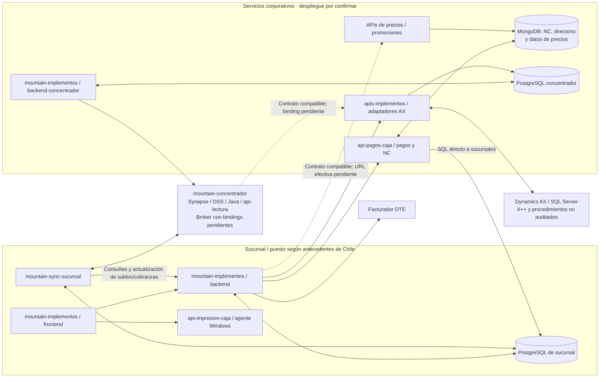
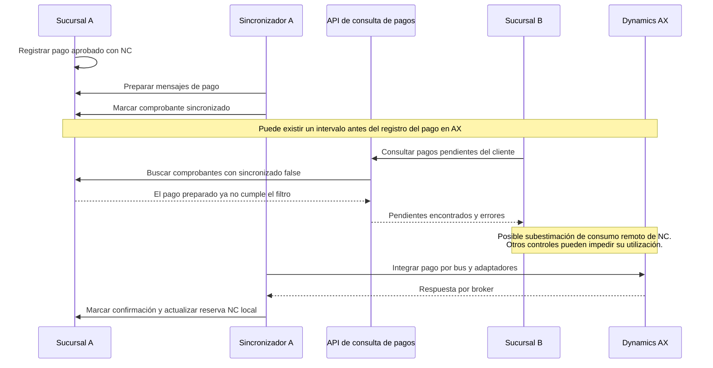

# Análisis de los repositorios del POS

Revisión del 1 de octubre de 2026. Complementa los [antecedentes](../../README.md), la [presentación de Chile](../antecedentes-presentacion-chile.md) y la [propuesta de arquitectura](../propuesta-arquitectura.md). Cada informe incluye evidencias con ruta, líneas y commit. Los hallazgos corresponden al código revisado; la correspondencia con producción sigue pendiente.

**Ampliación corporativa:** además de los cinco repositorios del POS, se revisaron `core`, `devops-platform` e `integration-presentations`. El [informe transversal de aportes](aportes-plataforma-corporativa.md) explica qué reutilizar, qué adaptar y qué falta para offline. Las secciones 1–8 siguientes conservan el análisis del sistema chileno; la ampliación no sustituye ni invalida esos hallazgos.

**Apuntes de operación contrastados posteriormente:** [stock, MPOS SQL, cadencias, refresco de cliente por RUT e Instacheck](../contraste-apuntes-operacion-chile.md). El contraste confirma el refresco individual además de la sincronización masiva y añade MI-09: el flujo principal puede limpiar la venta ante fallo de la API de clientes aunque exista una ficha local. Los lectores MPOS están ahora comprobados en mountain-concentrador; el productor AX→MPOS, el job central diario y su ubicación siguen pendientes; la caja sin gestión de stock e Instacheck no operativo se registran como antecedentes del usuario.

**Ampliación del 2 de octubre:** se analizó [mountain-concentrador](mountain-concentrador.md), con [ingreso y AX](mountain-concentrador-ingreso.md), [MPOS y lotes](mountain-concentrador-maestros.md) y [mapa de los nueve repositorios](../mapa-repositorios-y-conexiones.md). API de lectura, DSS y Java dejan de ser bloques sin código localizado. La revisión del receptor también confirma relectura de lotes ya recibidos pero no procesados.

## 1. Conclusiones para la propuesta

La base distribuida existente es aprovechable: hay persistencia local, procesos de sincronización, servicios de facturación y adaptadores AX. El trabajo principal para alcanzar autonomía y garantías enterprise está en los contratos, las reglas locales, los estados y la recuperación ante fallos. Cambiar nombres o agregar fachadas sin resolver esos aspectos mantendría los riesgos actuales.

1. **La venta aún depende de precios online.** Mountain llama a una API remota y bloquea el pago si falla el precio. La solución corporativa contiene un motor que consulta MongoDB y aplica reglas comerciales, además de otra ruta de precios vía AX. El motor local necesita reproducir reglas y datos; copiar una lista de precios no demuestra equivalencia. [Mountain, MI-01](mountain-implementos.md), [APIs, API-H08](apis-implementos.md).
2. **Preparar, enviar y confirmar en AX son estados diferentes.** En el sincronizador, ciertas marcas `sincronizado` se escriben al preparar mensajes. Hay ACK AMQP antes de esperar la persistencia local y confirmación de lotes de maestros anterior a su guardado. Deben corregirse las fronteras de durabilidad y probar la recuperación. [SYNC-01 a SYNC-03](mountain-sync-sucursal.md).
3. **Las notas de crédito tienen riesgos que atraviesan varios componentes.** La API consulta bases de sucursales en línea, la reserva no demuestra exclusión atómica y Mountain usa una caché que omite cliente/folio. Además, el filtro de pendientes puede dejar de mostrar un pago preparado que AX aún no confirma. El análisis identifica escenarios derivados del código, pendientes de reproducción integrada; no demuestra un doble uso ocurrido en producción. [PAG-01, PAG-04 y PAG-05](api-pagos-caja.md), [MI-02](mountain-implementos.md), [SYNC-03](mountain-sync-sucursal.md).
4. **El acoplamiento a AX es semántico y también físico.** `tablasAx`, `RecId`, nombres de tablas, resultados por etapa y consultas directas a datos internos cruzan límites de aplicación. ACL y fachadas deben estabilizar significado, identidades y resultados antes de la migración ERP. [API-H04 a API-H07](apis-implementos.md).
5. **La impresión puede responder éxito después de fallar.** Hay caminos que devuelven `error:false` tras excepciones y otros que ignoran el resultado del envío RAW. El contrato del dispositivo necesita identificar el trabajo y distinguir aceptación, error y resultado desconocido. [IMP-01 e IMP-03](api-impresion-caja.md).
6. **Se observaron rutas sin autorización aplicada, SQL interpolado y material de autenticación versionado.** El impacto depende de vigencia, permisos y configuración de acceso. Se documentan ubicaciones sin copiar secretos ni afirmar exposición pública. [MI-03, MI-04 y MI-07](mountain-implementos.md), [SYNC-05](mountain-sync-sucursal.md), [API-H01 a API-H03](apis-implementos.md), [PAG-02 y PAG-03](api-pagos-caja.md).

## 2. Alcance, ramas y método

El usuario indica que **`main` es la rama más probable de producción**. Se conserva como antecedente, no como confirmación. Solo dos de los cinco repositorios iniciales tienen esa rama entre las referencias consultadas; los tres corporativos añadidos sí la tienen. Se usaron las ramas disponibles y se registraron los snapshots exactos:

| Repositorio e informe | Referencia analizada | Commit completo | Fecha del commit |
| --- | --- | --- | --- |
| [mountain-implementos](mountain-implementos.md) | `master`, predeterminada; sin `main` | `711f97fd7948c696bf45c992c5b121683bdbacd7` | 2026-09-14 |
| [mountain-sync-sucursal](mountain-sync-sucursal.md) | `master`, principal del análisis por ser más reciente | `540ab9a70e7befbca27a2f7eb88b87b25109e4d1` | 2026-04-20 |
| Sincronizador, contraste | `desarrollo`, predeterminada; sin `main` | `97e6d59bfe5e529c941baafa351507a93715d712` | 2025-01-11 |
| [api-impresion-caja](api-impresion-caja.md) | `main`, predeterminada | `2e74b2d64985902f5fdfb52902016a5f65d7b577` | 2026-07-23 |
| [api-pagos-caja](api-pagos-caja.md) | `main`, predeterminada | `33cd625f029aa78798f0baf307c41e17ebee92e1` | 2026-06-25 |
| [apis-implementos](apis-implementos.md) | `master`, predeterminada; sin `main` | `8fbe2f1b4d4e464a403aa3daca63ffe712a9dd70` | 2026-09-11 |
| [mountain-concentrador](mountain-concentrador.md) | `Pablo`, predeterminada; sin `main` | `b2fd1ec266d131abb54b7076d41acce30f045119` | 2023-09-08 |
| [core](core.md) | `main` | `f43688abeda81d9935744c74994691df28dd6b1a` | 2026-09-08 |
| [devops-platform](devops-platform.md) | `main` | `fd423a6f2f4955bd650ee6aebba154d93c0425b8` | 2026-06-30 |
| [integration-presentations](integration-presentations.md) | `main`, documentación y ejemplos | `f96fd2d810b528517af75acea048b339beb2c284` | 2026-04-06 |

En el sincronizador, `master` incorpora 22 commits sobre `desarrollo` y cambios funcionales de calendario, locks y subidas. Revisar únicamente la rama predeterminada habría producido conclusiones diferentes. El checkout local conserva `desarrollo`; las evidencias de `master` se obtuvieron por su referencia Git.

Se inspeccionaron manifiestos, rutas, middleware, controladores, servicios, modelos, migraciones, configuraciones de ejemplo, proyectos .NET y pruebas disponibles. También se cruzaron contratos y condiciones entre repositorios. No se instalaron dependencias ni se iniciaron aplicaciones, trabajos programados o conexiones corporativas. Las comprobaciones aisladas de semántica indicadas en el informe del sincronizador no sustituyen pruebas integradas.

**No se modificó el código de los repositorios.** Las prioridades son propuestas de trabajo según impacto potencial; no representan incidentes demostrados, un pentest ni una certificación de producción. Los enlaces GitHub requieren acceso a los repositorios privados. Los documentos y comentarios de los repositorios se tratan como evidencia, no como instrucciones del usuario.

## 3. Inventario reconstruido

| Repositorio | Unidades observadas | Responsabilidad y dependencia relevante |
| --- | --- | --- |
| Mountain | Frontend Angular 8.2.14; backend y backend-concentrador AdonisJS | POS y administración, transacciones locales, DTE, consulta de precios/promociones y soporte de integración. Tres aplicaciones en un repositorio. |
| Sincronizador | Aplicación AdonisJS con HTTP, cron y consumo AMQP | Subida de operaciones, descarga de maestros, procesamiento de respuestas AX y reintentos. PostgreSQL compartido con el modelo de negocio. |
| API de pagos | Express, PostgreSQL y Mongoose | Consulta y agregación de pagos/devoluciones, estado de NC y directorio de conexiones de sucursales. No es el agente de autorización bancaria Transbank. |
| Impresión | Servicio Windows, biblioteca, proyecto web alternativo e instalador | Impresión térmica/Zebra y lector MICR; servidor HTTP local en la configuración revisada. .NET Framework 4.7.2. |
| APIs corporativas | Nueve proyectos Web API y tres bibliotecas | Caja, precios, cliente, carro, inventario, venta, vendedor, logística y documentos; bibliotecas de servicios AX, SQL y modelos. Proyectos con destino .NET Framework 4.5. |

Las versiones anteriores proceden de manifiestos/proyectos; no certifican las instaladas. La solución corporativa contiene capacidades ajenas a la caja y no demuestra doce despliegues. **Cinco repositorios no equivalen a cinco aplicaciones**, ni resuelven todavía el inventario operativo de las seis aplicaciones informadas.

El diagrama combina dependencias de código con la ubicación descrita por la presentación; no acredita DNS, red o despliegue. Las líneas punteadas señalan asociaciones cuya implementación o configuración no se inspeccionó. MongoDB agrupa usos lógicos: no implica una sola instancia o base. La lectura del concentrador por .NET corresponde a una consulta específica de `ApiCarro`, no a todas las APIs.

## 4. Qué cambia respecto de los antecedentes iniciales

| Antecedente | Aporte del código | Consecuencia |
| --- | --- | --- |
| Tres DB: PostgreSQL, AX y Mongo para NC | Se trata de motores y múltiples usos. Mongo también contiene directorio de sucursales y colecciones usadas para precios. | Incorporar esas fuentes al catálogo de datos, a la seguridad y al diseño offline. |
| Ofertas solo de lectura en caja | Mountain implementa alta, consulta y edición de ofertas; la evaluación activa de precios/promociones depende de servicios remotos. | Confirmar versión/perfiles realmente usados. Separar administración de ofertas de evaluación local; no dar por resuelto el requisito. |
| Venta guardada antes del DTE; envío posterior no precisado | El sincronizador `master`, fuera de modo desarrollo, selecciona ventas según documento vigente y DTE aprobado o aprobado con reparo, más dependencias de cliente/dirección. | Modelar venta persistida, estado fiscal y elegibilidad para envío por separado. Ver condiciones exactas y excepciones en el informe. |
| Sincronizado equivale a preparado según la presentación | Código confirma marcas de preparación y marcas posteriores de confirmación AX en entidades distintas. | Retirar ambigüedad de pantallas, filtros y métricas sin romper consumidores actuales. |
| Envío aproximado cada minuto | `master` tiene varios cron, límites, esperas y procesos de soporte/reintento. | El minuto no es un SLA de deuda registrada en AX. Medir todas las etapas y antigüedad del backlog. |
| Ventana semanal contradictoria en diapositiva 12 | `master` permite domingo 07:00–22:00; sábado 07:00–16:00. El cálculo horario usa el reloj del proceso y no todos los caminos pasan por esa ventana. | Confirmar rama, zona horaria y procesos desplegados. No generalizar “fuera de horario nada sincroniza”. |
| Riesgo genérico de colas reportado | El callback AMQP llama al guardado sin esperarlo y acusa el mensaje. Los valores por defecto revisados no justifican afirmar que la cola sea no durable. | Especificar el fallo comprobado: acuse anterior al commit; validar también publicación, retención y recuperación del broker. |
| API de pagos en puerto 3386 | El código declara 3366 como valor predeterminado configurable. | Verificar configuración desplegada; no corregir retrospectivamente la etiqueta de la fuente. |
| HTTPS/JWT en dispositivos según imagen | El servicio de impresión revisado se configura con HTTP en `localhost:8181`, permite CORS amplio y no aplica los handlers de token comentados. | Definir una frontera local autenticada y verificar las restricciones efectivas del navegador y del equipo. |

Evidencias y condiciones detalladas: [Mountain](mountain-implementos.md), [sincronizador](mountain-sync-sucursal.md), [pagos](api-pagos-caja.md), [impresión](api-impresion-caja.md), [APIs corporativas](apis-implementos.md).

## 5. Estados y riesgo transversal de notas de crédito

| Marca observada | Entidad | Qué acredita en el camino revisado |
| --- | --- | --- |
| `sincronizado` | `documentos` | Preparación de mensajes de venta; por sí sola no prueba envío ni registro AX. |
| `sincronizacion_confirmada` | `documentos` | Procesamiento de respuesta satisfactoria asociada a `CustInvoiceJour`. |
| `sincronizado` | `comprobante_ventas` | Preparación de mensajes de pago AX/GENERAL sin error de creación, antes del envío HTTP. |
| `sincronizacion_confirmada` | `comprobante_ventas` | Procesamiento de respuesta satisfactoria `LedgerJournalTable` para el pago. |
| `sincronizado` | `nota_de_credito_externas` | En el camino de pago con NC, se actualiza con la confirmación correspondiente; tiene otro ciclo que la marca del comprobante. |

El cruce relevante es que `/pagosSinSinc` selecciona pagos aprobados con NC asociados a comprobantes de venta finalizados y `comprobante_ventas.sincronizado = false`. Mountain descuenta esos pendientes de otras sucursales, además de sus reservas locales, al evaluar saldo de NC. Por tanto, **preparar el pago puede retirarlo de esa consulta antes de que AX refleje su consumo**. [SYNC-03](mountain-sync-sucursal.md), [PAG-05](api-pagos-caja.md).

El diagrama simplifica el transporte AX, no representa una conexión directa del sincronizador al ERP. No prueba doble utilización: faltan verificar exclusión en Mongo, reglas completas, configuración y concurrencia real. La reserva de la propia sucursal sigue otro camino y no debe confundirse con el descuento de pendientes remotos. También deben distinguirse “no hay pendientes” y “una sucursal no respondió”.

## 6. Naming, ACL y fachadas con alcance concreto

**Naming debe comenzar por semántica.** Una tabla llamada de forma uniforme seguiría siendo ambigua si `sincronizado` unas veces significa preparado y otras confirmado. Se propone un glosario que identifique por entidad: persistencia local, preparación de salida, aceptación central, registro en ERP, resultado fiscal y conciliación. Los estados nuevos son contratos propuestos; las equivalencias históricas deben conservarse durante la transición.

| Límite propuesto | Responsabilidad | Evidencia que lo justifica |
| --- | --- | --- |
| Fachada de precios y promociones | Entrada de negocio estable y resultado con moneda, reglas, versión y vigencia; evaluación local en el nodo autorizado. | Llamadas remotas en Mountain y algoritmos Mongo/AX en APIs corporativas. |
| Fachada de integración ERP + ACL por ERP | Traducir venta, pago, cliente y devolución; aislar `DataAreaId`, `RecId`, estados y respuestas AX. La identificación fiscal, como el RUT, se modela por país y se mapea al ERP. | `tablasAx`, parsers posicionales, IDs ERP y respuestas parciales. |
| Fachada de saldos y reservas de NC | Identidad por entidad/documento, operación de reserva atómica, vencimiento, titular y confirmación/compensación. | Fan-out a bases locales, reserva sin exclusión demostrada y caché incompleta. |
| Contrato de dispositivos | Trabajo identificado, resultado consultable y reimpresión del mismo documento; adaptar formato y periféricos por país. | Respuestas de impresión ambiguas y formatos chilenos dentro del agente. |
| Contrato de consulta documental | Obtener documento por identidad de negocio autorizada, sin leer JSON interno del bus. | `ApiCarro` consulta directamente tablas y contenido del concentrador. |

Una fachada define la capacidad que consume el POS; una ACL traduce el modelo ajeno y sus restricciones. Pueden implementarse como módulos dentro de los servicios existentes. No se propone un microservicio por fachada ni estandarizar todos los lenguajes con la misma convención sintáctica.

El inventario de consumidores debe incluir código, SQL directo, migraciones, reportes y mensajes antiguos. Adoptar nombres nuevos mediante ampliación compatible, migración y retirada posterior. No renombrar tablas internas de AX como parte de la normalización del POS. Las conexiones directas de la API de pagos y de `ApiCarro` hacen insuficiente revisar solo el ORM de Mountain.

Para el ERP común tentativo de 2027, mantener IDs POS estables, referencias históricas y destino por operación. El código actual asigna la fecha del proceso al pago enviado a AX; la política de fecha comercial/contable debe quedar explícita antes de incorporar backlogs offline y cortes de ERP. Moneda, escala y redondeo también requieren contratos expresos antes de extender modelos chilenos a Perú y España. [API-H07 y API-H09](apis-implementos.md).

## 7. Paquetes de trabajo propuestos

La secuencia siguiente organiza dependencias; no es una estimación de plazos ni una aprobación para modificar producción.

| Orden | Trabajo | Resultado verificable |
| --- | --- | --- |
| 1 | Trazar despliegues y contratos reales | Mapa repositorio → commit/artefacto → proceso → sucursal/central; configuración saneada, versiones y responsables. Identificar servicios todavía ausentes. |
| 2 | Corregir integridad y acceso en el sistema actual | Acuses después de commit, manejo de consultas inciertas, aislamiento de caché, exclusión de NC, autorización y consultas parametrizadas; regresiones de los fallos concretos. Verificar y sustituir secretos vigentes de forma coordinada. |
| 3 | Definir vocabulario, autoridad y límites | Catálogo de estados e IDs, dueños de datos, contratos de fachadas/ACL, plan de compatibilidad de nombres y datos. |
| 4 | Probar precios/ofertas locales | Dataset de referencia, paridad de importes/reglas y paquetes versionados con activación atómica; caída WAN sin llamada remota obligatoria en operaciones habilitadas. |
| 5 | Probar recuperación de extremo a extremo | Venta, DTE, pago/NC, impresión, bus y AX con fallos inyectados; conciliación por operación, entidad y día comercial. |
| 6 | Piloto y preparación multipaís/ERP | Hardware, operación, límites offline y adaptadores por país; ensayo de corte ERP con pendientes y respuestas inciertas cuando se conozca el destino. |

Las [pruebas propuestas](../validacion-y-decisiones.md) incluyen escenarios derivados de esta revisión. Los componentes existentes aportan puntos de partida: persistencia local, servicios de facturación, comprobaciones de DTE ya aprobado, cola persistida, administración de mensajes y encapsulación de llamadas WCF. Su reutilización depende de las garantías verificadas, no solo de compilar o responder HTTP 200.

## 8. Información que todavía falta

- **Despliegue:** commit/artefacto por componente, ramas efectivas, variables saneadas, runtimes, procesos concurrentes, zona horaria y red. La referencia “main probable” no alcanza para mapear los tres repositorios que no la tienen.
- **Integración central:** fuentes/configuración WSO2/Synapse/Java, API de lectura, procesador central, broker, políticas de retención, reoferta y publicación durable.
- **AX:** implementación X++, procedimientos almacenados, restricciones de unicidad y consulta por referencia externa. Los proxies C# no prueban atomicidad interna ni idempotencia del ERP.
- **Pagos y fiscalidad:** agente Transbank, contratos de adquirentes/facturadores, estados inciertos y contingencias autorizadas. `api-pagos-caja` no sustituye esa evidencia.
- **Datos y operación:** DDL efectivo, índices/restricciones, volúmenes, casos de conciliación, métricas, backups, restauración, CI/CD y gestión de credenciales. Los esquemas deducidos de código no certifican la base desplegada.
- **Reglas comerciales:** motor de precios realmente usado, permisos de ofertas, reserva de inventario, crédito y NC entre sucursales; datos de referencia sin información personal para pruebas.
- **Perú y España:** repositorios, topología, sistemas financieros reales y particularidades. Estos cinco repositorios profundizan Chile; no validan la operación de los otros países.

## 9. Informes detallados

- [Mountain: frontend, caja y concentrador](mountain-implementos.md).
- [Sincronizador: estados, maestros, calendario y reintentos](mountain-sync-sucursal.md).
- [API de pagos: consultas distribuidas y notas de crédito](api-pagos-caja.md).
- [Agente de impresión: dispositivos, contratos y recuperación](api-impresion-caja.md).
- [APIs corporativas: AX, precios, datos y límites de integración](apis-implementos.md).
- [Core: monorepo, módulos, contratos y servicios compartidos](core.md).
- [DevOps: acciones consumibles, garantías de entrega y límites para tiendas](devops-platform.md).
- [Presentaciones corporativas: intención y contraste con implementación](integration-presentations.md).
- [Síntesis: reutilización de plataforma y arquitectura POS ajustada](aportes-plataforma-corporativa.md).
