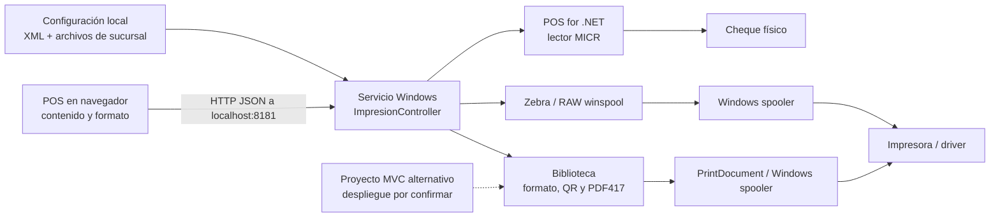

# Análisis de `api-impresion-caja`

## Alcance y trazabilidad

Revisión estática realizada el **1 de octubre de 2026** del repositorio privado `developer-implementos/api-impresion-caja`, rama **`main`**, commit **`2e74b2d64985902f5fdfb52902016a5f65d7b577`**, fechado **2026-07-23 12:25:23 -04:00**. El usuario considera `main` la rama productiva más probable; **no se confirmó el binario instalado ni su correspondencia con este commit**.

Se revisó el arranque del servicio Windows, controlador HTTP, helpers de impresión/spooler/MICR, modelos de mensajes, configuración, proyectos, manifiestos y el proyecto web alternativo. El repositorio también versiona dependencias, binarios, objetos de compilación y archivos de entorno de desarrollo; esos artefactos no equivalen a una distribución validada. No se ejecutaron instaladores, servicios, comandos del README ni acciones sobre impresoras o lectores. No se compiló ni se instalaron dependencias. No se reproducen direcciones internas o valores sensibles.

La prioridad de los hallazgos es orientativa y sus consecuencias se infieren del código. La configuración del equipo, políticas del navegador, HTTP.sys, drivers, spooler y hardware de producción no fueron inspeccionados. El contraste documental se basa en el [anexo de la presentación](../antecedentes-presentacion-chile.md).

## 1. Papel arquitectónico

Este repositorio implementa el **puente local entre el POS web y periféricos Windows**: impresión térmica, etiquetas Zebra, frente/reverso de cheques y lectura MICR. La ruta principal recibe instrucciones de presentación ya preparadas por el cliente; no emite el DTE, no registra ventas en AX y no administra pagos Transbank.

La separación de periféricos en un proceso local es una pieza aprovechable del diseño distribuido. El código inspeccionado no requiere llamadas a un ERP ni a una base central para entregar contenido al spooler, por lo que puede funcionar sin WAN cuando el POS ya dispone del contenido y la configuración. Eso **no demuestra** que el flujo completo de venta/DTE sea offline.

### Inventario técnico

| Elemento | Evidencia | Lectura arquitectónica |
| --- | --- | --- |
| Servicio Windows | `WindowsServiceImpresora`, `ServiceBase`, C#, `.NET Framework 4.7.2`. | Proceso ligado a Windows y sus periféricos. |
| HTTP local | ASP.NET Web API SelfHost `5.2.7`; configuración `http://localhost:8181`; ruta `{controller}/{action}`. | La configuración apunta a loopback; no hay evidencia de escucha intencional en todas las interfaces. La exposición efectiva se valida en el host. |
| Librería compartida | Proyecto `Biblioteca`, `.NET Framework 4.7.2`. | Formato de texto, cheques, QR/PDF417, impresión GDI y RAW. |
| Proyecto alternativo | `AplicacionWeb`, ASP.NET MVC sobre `.NET Framework 4.7.2`, comparte `Biblioteca`. | Hay dos fachadas HTTP en el repositorio; no se puede asumir que ambas estén desplegadas. |
| Drivers y spooler | `PrintDocument`, `winspool.Drv`, Microsoft POS for .NET/MICR. | Dependencias operacionales fuera del código fuente. |
| Dependencias declaradas | ESC/POS, ZXing `0.16.6`, iText7 `7.1.14`, log4net `2.0.12`; Newtonsoft.Json `6.0.4` en paquetes del servicio. | Inventario de manifiestos; no se verificó soporte actual, CVEs ni versiones instaladas. |
| Distribución | Proyectos WiX; instalador declara cuenta `LocalSystem`; instrucciones manuales de instalación. | Revisar privilegios, firma, actualización, rollback y correspondencia fuente/binario. |
| Persistencia | No se identificó DB propia, registro durable de trabajos ni cola de aplicación. | Sí usa cola de Windows; no debe confundirse ausencia de cola propia con ausencia de spooler. |

Fuentes: [I01], [I02], [I03], [I04], [I08], [I09], [I11].

## 2. Superficie HTTP y efectos

Las rutas principales se deducen de `{controller}/{action}` y `ImpresionController`, bajo `/Impresion`. El controlador tiene `[AllowAnonymous]` y CORS `*`. No hay versión de contrato ni identificador de trabajo en los DTOs observados.

| Método / acción | Comportamiento real | Efecto y resultado |
| --- | --- | --- |
| `GET /Index` | Devuelve texto «Servicio Activo». | Indica que el endpoint responde; no comprueba impresora, configuración ni papel. |
| `GET /Test` | Ejecuta `BOTicket.test()`. | **Imprime** contenido de prueba; no es una consulta inocua de salud. Devuelve 200 con `error:false` incluso tras una excepción capturada. |
| `POST /ImprimirDTE_Termica` | Deserializa `ComprobanteImpresion`, configura impresora y usa `dataTexto_columnas`. | Envía el trabajo mediante `PrintDocument.Print()`; captura error y aun así devuelve «imprimiendo», `error:false`. |
| `POST /ImprimirDTE_Pdf` | Asigna `dataTexto` y llama al mismo método `Imprimir()`. | El evento activo consume otra colección, `LineaTexto_columnas`, que esta acción no inicializa. No devuelve un PDF. |
| `POST /ImprimirZebra` | Recibe un string y lo envía como datos RAW a la impresora configurada. | Admite instrucciones Zebra sin modelo de trabajo; el retorno efectivo de envío no se propaga. |
| `POST /ImprimirChequeFrontal_Termica` | Recibe campos del frente y usa driver de cheque. | Siempre HTTP 200, pero sí marca `error:true` ante excepción capturada. |
| `POST /ImprimirChequeReverso_Termica` | Recibe campos del reverso/endoso. | Mismo manejo de error de aplicación que el frente. |
| `GET` o `POST /LecturaCheque_Termica` | Abre, reclama y habilita dispositivo MICR; realiza inserción/lectura y solicita expulsión. | Devuelve datos bancarios leídos; interacción física con el dispositivo incluso mediante GET. |

Fuentes: [I02: líneas 24–198], [I05], [I06], [I07], [I08]. La acción denominada «DTE» imprime; no valida ni acredita emisión fiscal. El proyecto MVC alternativo duplica varias acciones, incluyendo el patrón de falso éxito de la térmica [I11].

### Contrato de impresión y variación por país

`ComprobanteImpresion` contiene listas de nombre/valor, texto, tres columnas y campos para frente/reverso de cheques. `LineaTexto` mezcla contenido, alineación, fuente, QR, PDF417 y marcas de firmas. No contiene `jobId`, clave de idempotencia, estado durable, identidad de documento, país, moneda o versión de plantilla. Esto permite que el cliente controle el formato, pero dificulta validación, reproducción exacta y trazabilidad de reimpresiones [I04: líneas 9–40].

Hay especializaciones chilenas en DTOs/formato (`rut`, datos de factura, timbre, firmas y extracción de RUT/OV para QR), junto con disposición/medidas de impresoras y parsing MICR por posiciones fijas. El código de QR lee configuración del backend por una ruta local fija o archivos auxiliares; genera un QR localmente y **no implica una llamada HTTP al destino codificado** [I07: líneas 77–109], [I10], [I12].

## 3. Hallazgos con condiciones e impacto

### IMP-01 · Alta · El servicio puede declarar éxito aunque la impresión falle

**Evidencia:** Test, DTE térmico, DTE Pdf y Zebra capturan excepciones y luego construyen `ApiResponse(... false, ...)` con HTTP 200. La propiedad booleana se llama `error`, por lo que `false` expresa éxito. Además, `BOZebra.SendStringToPrinter` y `RawPrinterHelper.SendStringToPrinter` ignoran el resultado de `SendBytesToPrinter` y retornan `true`. El controlador Zebra tampoco usa ese retorno. [I02: líneas 30–116], [I04: ApiResponse, líneas 9–33], [I06: líneas 89–101], [I08: líneas 114–126].

**Condición e impacto:** una excepción de configuración, driver o impresión después de deserializar la petición puede terminar en «imprimiendo» sin señal de fallo. Un error de `WritePrinter/OpenPrinter` puede perderse antes de llegar al controlador. La caja no sabe si debe reintentar, si ya quedó en spooler o si hubo salida física; reintentos manuales pueden duplicar impresiones. No se reprodujo con hardware.

**Acción propuesta:** propagar errores tipados y distinguir validación, aceptación, envío al spooler y confirmación física cuando el dispositivo lo soporte. Registrar trabajo/intentona e informar estado incierto si la conexión se corta después de enviar. Evitar prometer «impreso» por el solo retorno de una API Windows.

### IMP-02 · Alta · La frontera local no autentica al llamador y permite cualquier origen CORS

**Evidencia:** la escucha se configura en **`localhost`**, los handlers de token aparecen comentados, CORS permite `*` y el controlador declara acceso anónimo. El instalador WiX propone `LocalSystem`. [I01: líneas 34–49], [I02: líneas 18–20], [I09: líneas 50–57].

**Condición e impacto:** procesos con acceso al endpoint local y páginas cuyo navegador permita la petición a loopback pueden solicitar impresiones, entregar RAW o leer un cheque sin identidad de usuario/caja en esta capa. La política del navegador y su protección de red local importan: CORS abierto por sí solo **no demuestra** que cualquier web pueda acceder en todos los navegadores. El binding no acredita exposición remota a Internet. `LocalSystem` amplía privilegios si ese instalador/configuración se usa realmente; no prueba ejecución arbitraria ni un exploit.

**Acción propuesta:** conservar un alcance local explícito, emparejar POS y agente, autenticar comandos y limitar orígenes permitidos/capacidades. Evaluar cuenta con privilegios mínimos compatibles con drivers; verificar ACL de URL, del directorio de configuración y de dispositivo. El control debe funcionar con identidad local válida durante una desconexión, según la política offline aprobada.

### IMP-03 · Alta · No hay identidad ni registro durable de trabajos de impresión en el agente

**Evidencia:** el controlador recibe contenido e imprime inmediatamente; DTOs sin identificador de operación; helper entrega a `PrintDocument`/RAW. No se encontró un repositorio de trabajos, deduplicación o consulta de estado propia en el código de aplicación. **El spooler de Windows sí existe y puede mantener su propia cola**. [I02], [I04], [I05: líneas 110–125], [I06].

**Condición e impacto:** tras reinicio, respuesta HTTP perdida o reintento, el servicio no ofrece una forma de correlacionar la petición con un trabajo ya enviado ni separar una reimpresión intencional de una repetición de red. El spooler puede haber recibido el trabajo aunque el cliente no lo sepa.

**Acción propuesta:** contrato con `jobId`, documento/versión, intento y motivo de copia; registro local durable, serialización por dispositivo y consulta de estado. Diferenciar duplicado técnico de nueva copia autorizada. La garantía posible depende del hardware: no asumir impresión física exactamente una vez.

### IMP-04 · Media · La ruta denominada PDF alimenta la colección equivocada

**Evidencia:** `ImprimirDTE_Pdf` llama `SetLineas(comprobante.dataTexto)`, pero `Imprimir()` engancha siempre `imprimirEvent_array`, que recorre `LineaTexto_columnas`. La acción no llama `LineaTexto_array`; la colección queda sin inicializar en el helper nuevo. [I02: líneas 74–93], [I05: líneas 91–99, 110–125 y 145–153].

**Condición e impacto:** cuando `PrintPage` se ejecute por esa ruta, el recorrido sobre la colección nula falla; si no llega al callback por un fallo previo de driver, falla antes. El catch igualmente declara éxito. No se confirmó que esa acción tenga consumidores productivos.

**Acción propuesta:** inventariar uso real y corregir o retirar la ruta con compatibilidad. Un contrato «generar PDF» debe producir un archivo o resultado inequívoco; el actual no lo hace.

### IMP-05 · Media · La lectura de cheques bloquea activamente y usa un parser específico

**Evidencia:** tras reclamar el MICR, `codigoCheque()` ejecuta un bucle sin espera hasta obtener `RawData` o contar más de 5.000 millones de iteraciones; hay handler de evento registrado, pero el camino de lectura mantiene esa espera activa. Extrae campos mediante offsets fijos y longitud mínima 33. [I07: líneas 31–113].

**Condición e impacto:** ausencia/demora de datos puede consumir CPU y bloquear el hilo de solicitud; el contador no expresa un timeout de reloj estable entre equipos. Peticiones concurrentes compiten por el dispositivo. El parsing no acredita compatibilidad con cheques de Perú o España.

**Acción propuesta:** interacción asíncrona con timeout/cancelación explícitos y exclusión por dispositivo; parser según formato/dispositivo validado. Mantener errores de lector, cancelación y dato inválido como estados distintos. Validar liberación de recursos en todos los caminos: el código dispone de `Release/Close`, pero no hay un ciclo único en `finally` alrededor de toda la operación HTTP.

### IMP-06 · Media · GET tiene efectos físicos y el endpoint de salud no valida capacidades

**Evidencia:** GET Test imprime y GET LecturaCheque reclama/usa el periférico; Index solamente devuelve texto. [I02: líneas 24–47 y 177–198], [I07: líneas 33–53].

**Condición e impacto:** una sonda o consumidor que asuma que GET es una consulta sin efectos podría accionar impresora o lector. Monitorear Index solo comprueba que responde el API, no capacidad operativa.

**Acción propuesta:** separar salud/capacidades de comandos POST; un diagnóstico que imprime debe ser explícito y autorizado. Reportar de forma independiente agente vivo, configuración válida y dispositivo disponible.

### IMP-07 · Media · La configuración y presentación local están acopladas al despliegue de Chile

**Evidencia:** helpers obtienen nombres de impresoras de XML al lado del ensamblado. QR depende de una ruta fija del `.env` de otro componente, de `slug.txt`/`url_sucursal.txt` y de parsing de texto con RUT/OV; la variante temporal codifica un destino en fuente. En `ObtenerURL`, se verifica longitud `>=2` y luego se lee posición `[2]`, por lo que una fila de dos columnas pasa la guardia y falla. [I10: líneas 13–49], [I12: líneas 12–77], [I13: líneas 392–455].

**Condición e impacto:** cambiar la distribución del POS, los archivos de configuración o el formato de contenido puede romper QR o impresión aunque el dispositivo esté sano. Estos detalles se filtran en el agente; no hay validación inicial visible que los detecte antes de imprimir. No se copiaron URLs internas.

**Acción propuesta:** configuración versionada/validada por terminal, plantillas por país y contrato de QR explícito. El agente debe recibir los datos necesarios mediante una interfaz estable, sin leer secretos/configuración privada del backend. El helper actualmente usa la línea del slug, no todos los secretos del archivo: el riesgo identificado es acoplamiento y permisos, no exfiltración demostrada.

### IMP-08 · Media · Operación y distribución requieren evidencia adicional

**Evidencia:** `OnStop` solo registra un mensaje y no cierra el `HttpSelfHostServer`, cuya referencia es local a `OnStart`. El proyecto web alternativo comparte lógica y repite el catch silencioso. Se versionan `bin/obj`, paquetes y un archivo comprimido de distribución; README es una sola línea. `Biblioteca/test.cs` es una clase vacía, no una prueba automatizada. [I01: líneas 48–60], [I11: líneas 24–51], [I14], [I15].

**Condición e impacto:** el ciclo explícito de apagado no drena solicitudes ni trabajos propios; que Windows termine el proceso no reemplaza una política de cierre. No es posible inferir desde el repo qué binario o superficie HTTP se instala, ni con qué rollback. No se encontró CI ni suite de pruebas propia en los archivos revisados.

**Acción propuesta:** elegir y documentar la unidad de despliegue, verificar fuente/binario, establecer compilación reproducible, firma y distribución gradual por terminal, rollback y telemetría de versión. Pruebas con dobles de spooler y un banco de hardware representativo antes de despliegue multinacional.

## 4. Contraste con la presentación

| Antecedente | Resultado |
| --- | --- |
| Servicio Windows .NET Framework 4.7.2, Web API SelfHost 5.2.7 | Confirmado por proyectos/manifiestos; no versión productiva comprobada. |
| Agente local puerto 8181 | Confirmado como configuración de fuente, con host `localhost`. |
| HTTPS/JSON/JWT en la arista del diagrama | **No confirmado para impresión**: este servidor usa HTTP, validación de token comentada y controlador anónimo. No se generaliza al agente Transbank. |
| Puede reportar éxito aunque falle | Confirmado directamente en controladores y en retornos ignorados del helper RAW. |
| Impresora / lector de cheques | Confirmado; se añaden Zebra, firmas, QR y parsing MICR. |
| Papel del agente en offline | El camino observado es local y no consulta ERP, pero depende de recibir contenido y configuración válidos. No acredita capacidad offline del flujo fiscal/comercial. |
| Una aplicación de impresión | Hay un servicio Windows y un proyecto MVC alternativo en el repo; determinar cuál se distribuye y si el otro se mantiene como herramienta de prueba. |

## 5. Consecuencias para la arquitectura objetivo

1. **Mantener una fachada de periféricos local.** Estabilizar contratos de impresión/lector y encapsular drivers por adaptador. Esta es una frontera distinta de la ACL del ERP: no es necesario que el agente sepa qué ERP registra la venta.
2. **Separar documento comercial/fiscal y representación física.** El dominio POS y los adaptadores fiscales producen documentos válidos; plantillas por país los representan. El agente imprime un trabajo identificable. No introducir IDs/tablas AX ni nombres de ERP en su contrato.
3. **Definir estados de trabajo y reimpresión.** Recibido, validado, enviado al spooler, fallido y resultado incierto son candidatos; «impreso» exige evidencia disponible. Guardar la referencia al contenido/versión y motivo de copia en el sistema responsable de auditoría.
4. **Estandarizar naming gradualmente.** Acciones como `ImprimirDTE_Pdf` prometen una salida distinta de su implementación; nombres de código/DTO mezclan PascalCase, camelCase y guiones bajos. Publicar un contrato versionado y adaptadores de compatibilidad antes de renombrar clientes existentes.
5. **Diseñar operación offline del agente.** Configuración y plantillas disponibles localmente, spool/registro recuperable, credenciales locales según política, límites de retención, cola por dispositivo y procedimiento de contingencia ante impresora caída. El ERP común futuro no reemplaza estas capacidades.
6. **Hacer explícita la matriz de dispositivos por país.** Identificar impresoras, drivers, formato de cheque, códigos fiscales, zonas horarias e idiomas requeridos. No extrapolar el formato chileno o las capacidades de un modelo Epson a todos los países.

## 6. Validaciones siguientes

- Dobles de impresora/spooler: error de configuración, cola ausente, WritePrinter false, excepción GDI, trabajo aceptado con respuesta HTTP perdida y repetición de `jobId`.
- Pruebas de contrato: contenido inválido, ruta Pdf, error HTTP/de aplicación, GET de salud sin efectos y cancelación de lectura.
- Banco de periféricos: sin papel, tapa abierta, corte USB, reinicio de agente/spooler, dos solicitudes simultáneas, MICR sin documento y documento malformado.
- Inventario productivo: servicio o MVC, identidad Windows, URL ACL, origen POS permitido, versión/hash del binario, driver, formato de configuración, proceso de instalación/actualización y consumidor de cada endpoint.

Estas validaciones se proponen para una fase controlada; **no se ejecutaron operaciones físicas ni se modificó el código auditado**.

## 7. Evidencia por commit

Todos los enlaces corresponden al SHA revisado y requieren acceso al repositorio privado.

- **[I01]** [WindowsServiceImpresora/ServiceImpresora.cs, líneas 30–60](https://github.com/developer-implementos/api-impresion-caja/blob/2e74b2d64985902f5fdfb52902016a5f65d7b577/WindowsServiceImpresora/ServiceImpresora.cs#L30-L60): binding, CORS y ciclo de servicio.
- **[I02]** [WindowsServiceImpresora/Controllers/ImpresionController.cs, líneas 18–198](https://github.com/developer-implementos/api-impresion-caja/blob/2e74b2d64985902f5fdfb52902016a5f65d7b577/WindowsServiceImpresora/Controllers/ImpresionController.cs#L18-L198): rutas, efectos y respuestas.
- **[I03]** [WindowsServiceImpresora/WindowsServiceImpresora.csproj, líneas 8–11](https://github.com/developer-implementos/api-impresion-caja/blob/2e74b2d64985902f5fdfb52902016a5f65d7b577/WindowsServiceImpresora/WindowsServiceImpresora.csproj#L8-L11) y [packages.config](https://github.com/developer-implementos/api-impresion-caja/blob/2e74b2d64985902f5fdfb52902016a5f65d7b577/WindowsServiceImpresora/packages.config): plataforma y dependencias.
- **[I04]** [Biblioteca/Entities/Documento.cs, líneas 9–105](https://github.com/developer-implementos/api-impresion-caja/blob/2e74b2d64985902f5fdfb52902016a5f65d7b577/Biblioteca/Entities/Documento.cs#L9-L105) y [ApiResponse.cs, líneas 9–33](https://github.com/developer-implementos/api-impresion-caja/blob/2e74b2d64985902f5fdfb52902016a5f65d7b577/Biblioteca/Entities/ApiResponse.cs#L9-L33): DTOs y significado de `error`.
- **[I05]** [Biblioteca/Helper/PrinterHelper.cs, líneas 39–221](https://github.com/developer-implementos/api-impresion-caja/blob/2e74b2d64985902f5fdfb52902016a5f65d7b577/Biblioteca/Helper/PrinterHelper.cs#L39-L221): configuración y entrega GDI.
- **[I06]** [Biblioteca/Helper/RawPrinterHelper.cs, líneas 51–101](https://github.com/developer-implementos/api-impresion-caja/blob/2e74b2d64985902f5fdfb52902016a5f65d7b577/Biblioteca/Helper/RawPrinterHelper.cs#L51-L101): spooler RAW y retorno ignorado.
- **[I07]** [Biblioteca/Helper/CheckScanner.cs, líneas 22–225](https://github.com/developer-implementos/api-impresion-caja/blob/2e74b2d64985902f5fdfb52902016a5f65d7b577/Biblioteca/Helper/CheckScanner.cs#L22-L225): apertura, espera activa, parseo y cierre MICR.
- **[I08]** [Biblioteca/BO/BOZebra.cs, líneas 52–126](https://github.com/developer-implementos/api-impresion-caja/blob/2e74b2d64985902f5fdfb52902016a5f65d7b577/Biblioteca/BO/BOZebra.cs#L52-L126) y [BOTicket.cs, líneas 90–150](https://github.com/developer-implementos/api-impresion-caja/blob/2e74b2d64985902f5fdfb52902016a5f65d7b577/Biblioteca/BO/BOTicket.cs#L90-L150): Zebra y efecto físico de Test.
- **[I09]** [Setup/Product.wxs, líneas 50–57](https://github.com/developer-implementos/api-impresion-caja/blob/2e74b2d64985902f5fdfb52902016a5f65d7b577/Setup/Product.wxs#L50-L57): instalación de servicio y cuenta.
- **[I10]** [Biblioteca/Utils/ConfiguracionesReader.cs, líneas 13–49](https://github.com/developer-implementos/api-impresion-caja/blob/2e74b2d64985902f5fdfb52902016a5f65d7b577/Biblioteca/Utils/ConfiguracionesReader.cs#L13-L49): configuración XML local.
- **[I11]** [AplicacionWeb/Controllers/HomeController.cs, líneas 13–51](https://github.com/developer-implementos/api-impresion-caja/blob/2e74b2d64985902f5fdfb52902016a5f65d7b577/AplicacionWeb/Controllers/HomeController.cs#L13-L51) y [AplicacionWeb.csproj, líneas 13–17](https://github.com/developer-implementos/api-impresion-caja/blob/2e74b2d64985902f5fdfb52902016a5f65d7b577/AplicacionWeb/AplicacionWeb.csproj#L13-L17): fachada MVC alternativa.
- **[I12]** [Biblioteca/Utils/GetSlugEnv.cs, líneas 12–77](https://github.com/developer-implementos/api-impresion-caja/blob/2e74b2d64985902f5fdfb52902016a5f65d7b577/Biblioteca/Utils/GetSlugEnv.cs#L12-L77): configuración dependiente de backend/sucursal.
- **[I13]** [Biblioteca/Helper/PrintFormatHelper.cs, líneas 314–455](https://github.com/developer-implementos/api-impresion-caja/blob/2e74b2d64985902f5fdfb52902016a5f65d7b577/Biblioteca/Helper/PrintFormatHelper.cs#L314-L455): selección de formato y QR. Se omiten los destinos codificados en el informe.
- **[I14]** [Biblioteca/test.cs, líneas 1–12](https://github.com/developer-implementos/api-impresion-caja/blob/2e74b2d64985902f5fdfb52902016a5f65d7b577/Biblioteca/test.cs#L1-L12): clase vacía, sin pruebas.
- **[I15]** [README.md](https://github.com/developer-implementos/api-impresion-caja/blob/2e74b2d64985902f5fdfb52902016a5f65d7b577/README.md) y [ejecutable/instrucciones.txt](https://github.com/developer-implementos/api-impresion-caja/blob/2e74b2d64985902f5fdfb52902016a5f65d7b577/ejecutable/instrucciones.txt): documentación disponible; los comandos se leyeron como evidencia y no se ejecutaron.

## Ampliación de los recorridos operativos

La [relectura de operación y evolución](../operacion-caja-y-evolucion.md) añade evidencia seleccionada de sesión/cierre, impresión, contexto de precios y entrega compatible a sucursales. Distingue código actual y contrato propuesto con pruebas pendientes; no reemplaza este informe ni acredita implementación productiva.
