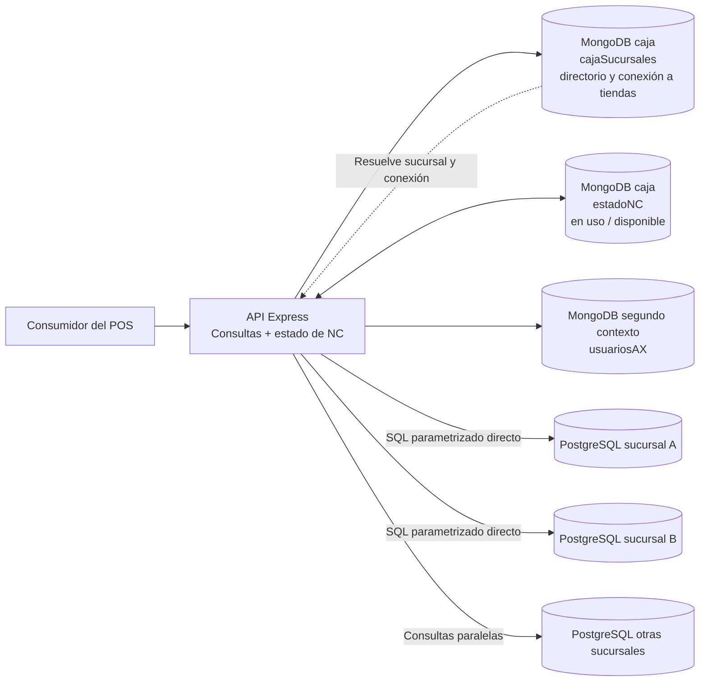

# Análisis de `api-pagos-caja`

## Alcance y trazabilidad

Revisión estática realizada el **1 de octubre de 2026** del repositorio privado `developer-implementos/api-pagos-caja`, rama **`main`**, commit **`33cd625f029aa78798f0baf307c41e17ebee92e1`**, fechado **2026-06-25 13:43:13 -04:00**. El usuario considera `main` la rama productiva más probable; **no se ha confirmado que este commit esté desplegado**.

Se revisaron los archivos propios de arranque, rutas, controladores, servicios, modelos, configuración y manifiestos. No se ejecutó la aplicación, no se instalaron dependencias ni se consultaron bases de datos o APIs reales. El repositorio tiene 13 archivos versionados; no contiene README ni una suite de pruebas identificable. Los valores sensibles se omiten deliberadamente: se registran ubicaciones y comportamiento, no credenciales ni direcciones internas.

Los hallazgos son observaciones del código, con impacto inferido y condiciones explícitas. No constituyen evidencia de incidentes, de exposición a Internet ni de configuración efectiva en producción. La presentación se contrasta con el [anexo de antecedentes](../antecedentes-presentacion-chile.md).

## 1. Qué componente es realmente

Es una API Node.js/Express que combina **consulta federada de datos de sucursales** y **administración de estados de notas de crédito (NC)**. No es el agente Transbank, no procesa autorizaciones bancarias y no se observa escritura a PostgreSQL ni integración directa con AX en este repositorio.

El alcance es mayor que «consulta de pagos»: expone devoluciones, mantiene estados de NC y recupera datos de usuarios relacionados con AX. Para consultar una sucursal, lee de MongoDB la dirección y las credenciales de PostgreSQL y abre una conexión directa a esa base. Para ciertas consultas, hace lo mismo con **todas las sucursales activas**. Esto aporta una arista arquitectónica no explicitada en la presentación: un servicio agregador accede a las bases operacionales de las tiendas. El código demuestra el acceso; la ubicación física central del servicio sigue siendo un antecedente de la presentación.

### Inventario técnico

| Elemento | Evidencia del snapshot | Implicación |
| --- | --- | --- |
| Aplicación | `package.json`: nombre `api-pagos`, versión `1.0.0`; `app.js`; archivo `apps.json` compatible con PM2. | Un proceso HTTP; no se identificó un worker de conciliación. |
| Dependencias declaradas | Express `^4.17.1`, pg `^8.7.3`, Mongoose `^5.13.15`, Helmet `^3.23.3`, cors `^2.8.5`, express-rate-limit `^5.5.1`. | Rangos de manifiesto, no versiones productivas. |
| Resoluciones del lockfile | Express `4.21.2`, pg `8.16.2`, Mongoose `5.13.15`, Helmet `3.23.3`; lockfile versión 1. | La matriz de la presentación no debe tratar los rangos como versiones instaladas. |
| Escucha | Puerto predeterminado **3366**, host `0.0.0.0`; coincide con las variables versionadas. | Discrepa del **3386** de la imagen; proxy y puerto productivo por confirmar. |
| MongoDB | Dos conexiones Mongoose separadas; modelos `estadoNC`, `cajaSucursales` y `usuariosAX`. | MongoDB cumple más funciones que solamente NC. |
| PostgreSQL | `new Client` por consulta y por sucursal; cierre en `finally`. | Acoplamiento al esquema físico de cada tienda y dependencia de conectividad hacia ella. |
| Protección HTTP | Helmet, CORS con lista configurable y 100 solicitudes/IP/15 minutos para `/api/`. | Son controles auxiliares; no implementan identidad ni permisos por operación. |
| Operación | Morgan, consola, `/health`, cierre del servidor en SIGTERM/SIGINT. | Health informa vida del proceso, no disponibilidad de MongoDB o sucursales. |

Fuentes: [P01], [P02], [P03], [P04], [P05]. No se evaluaron CVEs ni ciclos actuales de soporte.

## 2. Contratos y efectos

Todas las rutas siguientes usan el prefijo `/api/pagos`. No se observa versionado de API.

| Método y ruta | Comportamiento observado | Dependencia / efecto |
| --- | --- | --- |
| `POST /` | Recibe `puntoEmision` y `factura`; resuelve sucursal, busca `public.dtes`, `public.documentos` y pagos relacionados. | Lectura MongoDB + PostgreSQL de una tienda. Usa el primer DTE cuyo folio coincide, sin filtro de tipo documental en esa búsqueda. |
| `GET /pagosSinSinc` | Recibe `rut` y `dv`; consulta sucursales activas. | **Solo pagos con forma `nota-de-credito`**, aprobados, venta finalizada y `cv.sincronizado = false`; no todos los pagos pendientes. Devuelve `datos` y `errores`. |
| `GET /devoluciones` | Consulta devoluciones por fechas, luego filtra, ordena y pagina en memoria. | Fan-out a todas las tiendas activas, incluso si se filtra una sola sucursal. Rango máximo declarado 30 días; límite de página hasta 200. |
| `GET /devoluciones/distintos/:campo` | Autocompleta `sucursal`, `ov` o `folio`; controlador aplica lista permitida. | MongoDB para sucursales; PostgreSQL para los otros campos. Errores de tiendas se convierten en listas vacías. |
| `GET /estadoNC` | Consulta documentos por `folio`. | Lectura MongoDB; no filtra `origen`, empresa ni país. |
| `POST /estadoNC` | Busca por `folio` y `origen`, marca existente `en uso` o crea un registro. | **Escritura MongoDB**; presenta continuación no deseada tras responder si ya existe. |
| `PUT /estadoNC/:folio/:origen` | Cambia el primer registro encontrado a `disponible`. | Escritura MongoDB; no comprueba propietario de la reserva ni estado previo. |
| `GET /datosUsuario/:recid` | Busca `vendedorRecid` y proyecta códigos, RUT y nombre. | Lectura `usuariosAX`; no devuelve el campo `clave` del modelo. |

Fuentes: [P06], [P07], [P08], [P09]. `/health` y `/` son rutas adicionales de diagnóstico. «Disponible» y «en uso» son los únicos estados del modelo NC; no equivalen a un libro de saldos, a liquidación de pagos o a confirmación en AX.

### Datos y naming observados

- PostgreSQL: `dtes`, `documentos`, `pagos`, `comprobante_ventas`, `pago_comprobante_ventas`, `comprobante_venta_has_documentos`, `estado_pagos`, `caja_has_forma_pagos`, `forma_pagos`, `empresas`, `personas`, `tipo_documentos`, `nota_de_credito_externas`, `devoluciones` y `detalle_devoluciones`. Algunas referencias incluyen `public`; otras dependen del `search_path`.
- El vínculo `detalle_devoluciones.devolucione_id` y mezclas como `puntos_emision`, `puntoEmision`, `created_at`/`createdAt`, `folio_nc`/`folioNC`, `usuariosAX`, `vendedorRecid` y `forma_pago_externo` muestran convenciones distintas y traducciones hechas dentro del agregador.
- `estadoNC` guarda `folio: Number`, estado, origen (`caja`/`omni`), monto, punto de emisión y timestamps; no declara índices únicos, propiedad de reserva, caducidad, moneda, país o entidad legal. La existencia de índices administrados fuera del código está por verificar.
- `cajaSucursales` define campos para usuario y clave de PostgreSQL; `usuariosAX` también define un campo `clave`, sin que este repositorio revele qué formato tiene o quién lo mantiene. No se consultaron datos reales.

Fuentes: [P07]–[P10]. Estandarizar debe incluir significado, tipos y claves; renombrar tablas de forma inmediata rompería estas consultas directas.

## 3. Hallazgos y consecuencias

La prioridad indica orden recomendado de tratamiento, no una clasificación CVSS. **Alta** afecta integridad, control de acceso o capacidad de operación; **media** afecta exactitud de consultas, diagnóstico o evolución.

### PAG-01 · Alta · La reserva de una NC no ofrece exclusión ni idempotencia

**Evidencia:** `registrarEstadoNC` busca por `folio/origen`; si existe lo marca `en uso`, guarda y responde, pero no retorna. Luego crea otro documento y vuelve a responder. El schema no declara unicidad; tampoco hay actualización condicional atómica o comprobación del estado previo. [P07: líneas 34–58], [P10: líneas 4–23].

**Condición e impacto:** al repetir el POST para una NC existente, el código intenta crear un duplicado después de la primera respuesta. Sin un índice externo, puede persistirlo; con un índice externo, puede fallar después de haber respondido. Dos solicitudes concurrentes también pueden superar la búsqueda inicial. Que una NC ya esté `en uso` no produce rechazo. El mecanismo observado no basta para prevenir uso concurrente; el impacto financiero extremo depende de controles adicionales en los consumidores, que este repositorio no demuestra.

**Acción propuesta:** definir la operación de negocio —reservar, consumir, liberar—, identidad compuesta y propietario; realizar una transición condicional atómica, con clave de idempotencia y respuesta de conflicto. Verificar y sanear duplicados antes de imponer unicidad. Una liberación debe validar titular/versión. Esta corrección es previa a usar el servicio como control de crédito en varios países o durante coexistencia de ERPs.

### PAG-02 · Alta · NC y consultas carecen de autenticación y autorización dentro de la aplicación

**Evidencia:** el montaje de rutas y todos los handlers carecen de middleware de identidad/permisos; CORS permite solicitudes sin `Origin`. La escucha predeterminada es en todas las interfaces. [P01: líneas 14–58 y 108–116], [P06].

**Condición e impacto:** cualquier cliente con acceso de red al proceso podría consultar los datos expuestos o marcar/liberar NC. CORS limita ciertos usos desde navegador; no autentica llamadas de servidor. La exposición efectiva puede estar restringida por firewall, proxy o VPN, no incluidos aquí. No se comprobó acceso desde fuera de la red autorizada.

**Acción propuesta:** identidad de usuario y servicio, permisos diferenciados de lectura/reserva/liberación, alcance por empresa/sucursal, auditoría y política de acceso entre servicios. Revisar la red efectiva antes de estimar exposición.

### PAG-03 · Alta · Hay material de conexión sensible versionado

**Evidencia:** `.env` está en Git; contiene campos de credenciales PostgreSQL y dos URI MongoDB con usuario/contraseña. Se registra únicamente su ubicación: `.env`, líneas 7–14. `config/database.js` consume las URI; `cajaSucursales` proporciona credenciales de tiendas al servicio. [P04], [P09].

**Condición e impacto:** quienes acceden al snapshot o su historial pueden acceder al material allí registrado; vigencia y privilegios no se probaron. MongoDB concentra a su vez acceso potencial a varias tiendas. No se reproduce ningún valor sensible en este informe.

**Acción propuesta:** inventariar los consumidores, validar vigencia y rotar de forma coordinada; gestionar secretos fuera de Git, limitar privilegios y sustituir gradualmente la necesidad de almacenar credenciales de cada tienda en el agregador. Limpiar únicamente el archivo actual no revoca copias históricas.

### PAG-04 · Alta · El agregador depende en línea de las bases de todas las sucursales

**Evidencia:** las consultas de pendientes/devoluciones hacen un `map` de sucursales activas y esperan todas las promesas, sin límite de concurrencia; cada llamada abre un `Client`. Devoluciones filtra y pagina después de traer todos los resultados. Los límites SQL de consulta individual son 1,5 s para conectar y 20 s para consultar. La consulta de una factura no configura límites equivalentes. [P08: líneas 4–75, 111–140, 156–269 y 326–353].

**Condición e impacto:** sucursales desconectadas producen cobertura parcial; más tiendas y usuarios multiplican conexiones y carga en bases operacionales. La página de 50/200 registros no limita cuántas filas se recuperan. Filtrar una sucursal no reduce el fan-out. La latencia real y el volumen no se midieron.

**Acción propuesta:** a corto plazo, concurrencia acotada, tiempos máximos, filtrado en origen y estados explícitos de cobertura. Para la arquitectura objetivo, evaluar una proyección central alimentada por eventos y una vista local para operación offline. Esto requiere definir frescura y reconciliación; un cache central por sí solo no resuelve consumo concurrente de NC entre tiendas desconectadas.

### PAG-05 · Media · «Pendiente» expresa estado POS, no evidencia de deuda en AX

**Evidencia:** el filtro usa `comprobante_ventas.sincronizado = false`, `venta_finalizada = true`, pago aprobado y forma NC. No consulta una confirmación de AX. [P08: líneas 78–109].

**Condición e impacto:** consumidores que interpreten `/pagosSinSinc` como lista completa de pagos aún no registrados en el ERP obtendrían una conclusión incorrecta: excluye otros medios y depende del significado del booleano local. El repositorio no acredita cuándo cambia ese booleano.

**Acción propuesta:** un contrato con estados explícitos de registro local, envío, aceptación y contabilización; documentar el alcance NC actual sin romper clientes. Conservar identidad del ERP de destino y de origen durante la migración.

### PAG-06 · Media · Errores parciales y health pueden parecer ausencia de datos o éxito

**Evidencia:** pendientes/devoluciones devuelven `datos` y `errores`, incluso si todas las tiendas fallan. Los distintos de PostgreSQL capturan cualquier error y devuelven `[]`. `/health` informa `OK` sin comprobar MongoDB; conexiones MongoDB fallidas solo se registran y el servidor puede continuar. [P01: líneas 60–67], [P04], [P08: líneas 280–299 y 326–353].

**Condición e impacto:** un cliente que ignore `errores` puede confundir incompletitud con inexistencia de pagos. En autocompletado ni siquiera dispone de esa señal. Una sonda HTTP exitosa no garantiza capacidad de atender una consulta.

**Acción propuesta:** declarar `complete/partial/unavailable`, tiendas consultadas/fallidas y antigüedad de datos; separar liveness/readiness; estructurar métricas y logs sin IP ni detalles internos en respuestas públicas. Ya existe aislamiento de fallos entre promesas: aprovecharlo conservando explícitamente la incompletitud.

**Riesgo combinado con el consumidor:** la revisión de [mountain-implementos](mountain-implementos.md) identifica un cache de fallback indexado por endpoint, sin incorporar los parámetros `folio` o `rut/dv` de estas consultas. Bajo fallback/circuito abierto puede recuperarse una respuesta de otra consulta. Esa mezcla ocurre en el consumidor, no en el SQL de esta API; reforzar solo esta API no corrige el cache. Deben probarse conjuntamente aislamiento por cliente/documento, frescura e indisponibilidad antes de usar respuestas para autorizar NC.

### PAG-07 · Media · Faltan validaciones de dominio y salidas consistentes

**Evidencia:** al liberar una NC inexistente se responde «NC no existe» sin `return` y luego se intenta escribir en `null`. Los endpoints NC no validan explícitamente tipos, obligatoriedad, monto o contexto. La búsqueda inicial de factura usa solo folio y toma la primera fila. El control de fechas acepta rangos invertidos; las fechas predeterminadas usan zona horaria del proceso. [P07: líneas 23–78 y 96–113], [P08: líneas 25–35].

**Condición e impacto:** respuestas dobles/errores posteriores, entradas ambiguas y resultados incorrectos si el folio no es único entre tipos de DTE dentro de una tienda. La unicidad real y los índices de PostgreSQL no están disponibles aquí. Rango por país y cierre diario serían ambiguos si se reutiliza la zona del servidor.

**Acción propuesta:** validación de DTOs y escala monetaria, identidad documental completa, error de negocio tipado y fechas con zona explícita. Los SQL revisados usan parámetros; el único identificador interpolado se restringe a campos fijos mediante controlador/servicio. **No se encontró un caso demostrable de inyección SQL en los caminos examinados**; no debe afirmarse por el mero uso de SQL directo.

### PAG-08 · Media · Hay controles operacionales básicos, pero no pruebas ni trazabilidad de negocio

**Evidencia:** existen Helmet, límite de tasa, Morgan, cierre HTTP y `finally` de PostgreSQL. El manifiesto solo define `start/dev`; no se encontró CI, pruebas automatizadas, migraciones de MongoDB o contrato OpenAPI entre los 13 archivos. Se registran respuestas de pagos en consola y errores con direcciones internas. [P01], [P02], [P07: líneas 14–19], [P08: líneas 203–210 y 342–349].

**Condición e impacto:** la falta de pruebas visibles dificulta cambiar naming y estados con confianza. El límite global por IP puede agrupar usuarios tras un proxy y debe validarse con la topología; no se ha medido su efecto. Los logs podrían contener datos operativos/personales según las respuestas y configuración.

**Acción propuesta:** trazas con identificador de operación, métricas por sucursal/dependencia, redacción, pruebas de concurrencia/reserva y contratos. El health actual y los endpoints no se ejecutaron durante esta auditoría.

## 4. Contraste con la presentación

| Antecedente | Resultado de la lectura del código |
| --- | --- |
| API de consulta de pagos en central | Responsabilidad de consulta confirmada en código; ubicación central no se prueba desde el repositorio. |
| MongoDB guarda estado NC | Confirmado y ampliado: directorio de sucursales/conexiones y usuariosAX usan también MongoDB. |
| Solo consulta de NC | Incompleto: existen POST/PUT que mutan estado; el servicio participa en coordinación de uso. |
| Puerto 3386 de la imagen | Código y variables del snapshot usan 3366. Confirmar despliegue/proxy. |
| pg 8.7 y Express 4.17 | Coincide como rango de manifiesto; lockfile resuelve pg 8.16.2 y Express 4.21.2. |
| Caída MongoDB de impacto bajo | Requiere reevaluación: afecta reserva/liberación de NC, directorio para consultar PostgreSQL y datos de usuarios; impacto por operación depende del consumidor. |
| Segundo PostgreSQL de caja en el bloque central | El acceso federado a bases de sucursales es una explicación técnica posible de esa arista, **no prueba de que ese bloque represente esa topología**. |
| «Sincronizado» no significa confirmado en AX | Compatible con esta API: solo observa el booleano local. Confirmación ERP se debe rastrear en backend/sincronizador. |

## 5. Implicaciones para la propuesta enterprise y la migración ERP

1. **Separar lectura de pagos, reserva de crédito y consulta de devoluciones.** Pueden convivir inicialmente en el mismo despliegue, pero necesitan contratos y propietarios claros. El nombre actual oculta una responsabilidad de escritura relevante.
2. **Proteger la frontera de datos de sucursal.** Una fachada de consulta estable puede encapsular el SQL actual durante la transición. Cambiar una tabla requiere coordinar versiones mientras continúe el acceso directo; una API o proyección reduce ese acoplamiento.
3. **Ubicar la ACL en la traducción real.** `vendedorRecid`, `tipo_doc_externo` y `forma_pago_externo` son candidatos a mapeos del adaptador ERP. `folio`, moneda, entidad legal y país necesitan significado de negocio propio; `recid` de AX no debería convertirse en identificador universal del usuario POS.
4. **Tratar NC como crédito con concurrencia y política offline.** Definir quién puede reservar/consumir/liberar, cómo se detectan duplicados y qué se permite durante particiones. Si se permite uso entre sucursales sin comunicación, se necesita una política explícita de límites/riesgo o asignación previa; el estado central actual no garantiza exclusividad offline.
5. **Estandarizar naming mediante contratos versionados y migraciones compatibles.** Mantener alias o adaptadores mientras existan clientes antiguos. Añadir país/empresa/moneda al modelo solo tras definir claves y reglas, no mediante un renombrado puramente estético.
6. **Preservar histórico durante cambio de ERP.** NC emitidas antes del corte, pagos en tránsito y usuarios con ID AX deben conservar el origen y mapping. La adopción del ERP común no elimina la coordinación entre caja, crédito local y confirmación contable.

## 6. Validaciones siguientes sin producción

- Con dobles de MongoDB, probar POST repetido/concurrente, NC inexistente y liberación por actor incorrecto; comprobar una sola respuesta y transición consistente.
- Con PostgreSQL de prueba, comprobar folio repetido entre tipos DTE, tienda caída y todas caídas; ningún resultado parcial debe presentarse como exhaustivo.
- Con una carga sintética, medir conexiones máximas, volumen antes de paginar y efecto de filtros. No usar datos reales ni credenciales versionadas.
- Obtener configuración de despliegue, índices existentes, dueños de `estadoNC`/`usuariosAX`, definición productiva de `sincronizado`, inventario de consumidores y política de uso de NC offline.

No se añadieron ni ejecutaron pruebas en el repositorio auditado. Estas son validaciones propuestas para resolver incertidumbres que la lectura estática no cubre.

## 7. Evidencia por commit

Todos los enlaces apuntan al SHA revisado y requieren acceso al repositorio privado.

- **[P01]** [app.js, líneas 14–151](https://github.com/developer-implementos/api-pagos-caja/blob/33cd625f029aa78798f0baf307c41e17ebee92e1/app.js#L14-L151): seguridad HTTP, health, escucha y ciclo de proceso.
- **[P02]** [package.json, líneas 1–23](https://github.com/developer-implementos/api-pagos-caja/blob/33cd625f029aa78798f0baf307c41e17ebee92e1/package.json#L1-L23) y [package-lock.json](https://github.com/developer-implementos/api-pagos-caja/blob/33cd625f029aa78798f0baf307c41e17ebee92e1/package-lock.json): dependencias declaradas/resueltas.
- **[P03]** [apps.json, líneas 1–7](https://github.com/developer-implementos/api-pagos-caja/blob/33cd625f029aa78798f0baf307c41e17ebee92e1/apps.json#L1-L7): configuración de proceso.
- **[P04]** [config/database.js, líneas 1–33](https://github.com/developer-implementos/api-pagos-caja/blob/33cd625f029aa78798f0baf307c41e17ebee92e1/config/database.js#L1-L33): conexiones MongoDB separadas.
- **[P05]** `.env`, líneas 1–14: valores de arranque y material sensible; se referencia por ubicación, sin copiar valores ni enlazar directamente al secreto.
- **[P06]** [routes/pagos.js, líneas 1–16](https://github.com/developer-implementos/api-pagos-caja/blob/33cd625f029aa78798f0baf307c41e17ebee92e1/routes/pagos.js#L1-L16): ocho rutas.
- **[P07]** [controllers/pagosController.js, líneas 6–169](https://github.com/developer-implementos/api-pagos-caja/blob/33cd625f029aa78798f0baf307c41e17ebee92e1/controllers/pagosController.js#L6-L169): validación, NC, consultas y respuestas.
- **[P08]** [services/pagosService.js, líneas 4–353](https://github.com/developer-implementos/api-pagos-caja/blob/33cd625f029aa78798f0baf307c41e17ebee92e1/services/pagosService.js#L4-L353): SQL, fan-out, filtros y errores.
- **[P09]** [models/cajaSucursales.model.js, líneas 4–26](https://github.com/developer-implementos/api-pagos-caja/blob/33cd625f029aa78798f0baf307c41e17ebee92e1/models/cajaSucursales.model.js#L4-L26) y [models/usuariosAxModel.js, líneas 4–58](https://github.com/developer-implementos/api-pagos-caja/blob/33cd625f029aa78798f0baf307c41e17ebee92e1/models/usuariosAxModel.js#L4-L58): modelos de directorio y usuarios.
- **[P10]** [models/estadoNC.model.js, líneas 4–28](https://github.com/developer-implementos/api-pagos-caja/blob/33cd625f029aa78798f0baf307c41e17ebee92e1/models/estadoNC.model.js#L4-L28): modelo de estado NC.
