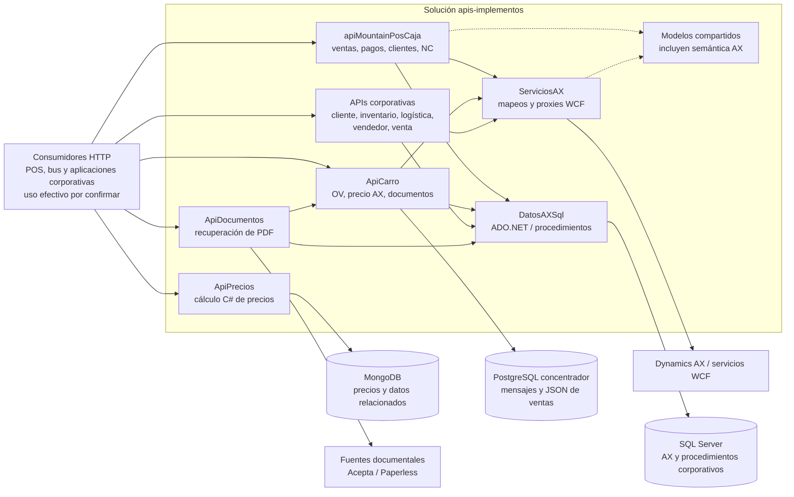
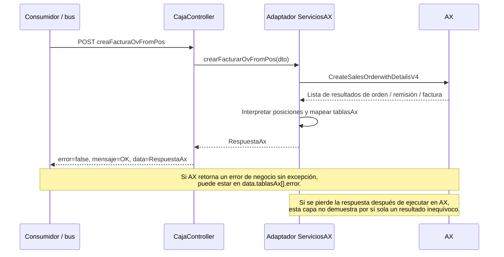

# Análisis de `apis-implementos`

## 1. Alcance, versión y límites

Análisis estático realizado el **1 de octubre de 2026** del repositorio privado [developer-implementos/apis-implementos](https://github.com/developer-implementos/apis-implementos). Se revisaron los proyectos, las rutas y modelos vinculados a caja, precios, clientes, pagos, notas de crédito, SQL y WCF; además de las dependencias corporativas que afectan la separación del POS y la futura migración de ERP.

| Dato | Evidencia de la revisión |
| --- | --- |
| Rama predeterminada y revisada | `master`. La consulta remota de `main` y `master` devolvió únicamente `master`; no se encontró `main`. |
| Commit | `8fbe2f1b4d4e464a403aa3daca63ffe712a9dd70`. |
| Fecha del commit | 2026-09-11 16:48:15, UTC−03:00. |
| Mensaje | `Merge branch 'dev'`. |
| Relación con producción | **Sin confirmar**. El usuario indicó que `main` es lo más probable para los repositorios; en este repositorio no se encontró esa rama. No se atribuye el commit analizado al despliegue real. |
| Obtención | Clonación superficial de solo lectura, con `--depth 1 --filter=blob:none`. No se examina todo el historial. |
| Ejecución | No se compilaron ni ejecutaron aplicaciones, no se instalaron dependencias ni se conectó el código a AX, bases o proveedores. |

Se distingue **observación de código**, **consecuencia inferida** y **propuesta a validar**. Los archivos de configuración demuestran contenido versionado, no vigencia de las credenciales ni accesibilidad de los servicios. Este documento no incluye credenciales, direcciones de servidores internos ni datos de clientes. Los enlaces de evidencia están fijados al commit y requieren acceso al repositorio.

No están disponibles aquí el código X++ del servidor AX, los cuerpos de sus procedimientos almacenados, la configuración efectiva de IIS/gateway/red, el inventario de despliegues ni la alimentación de las colecciones de precios. Por tanto, no se puede certificar el comportamiento transaccional dentro de AX, la seguridad de red o qué API de precios utiliza hoy cada consumidor.

## 2. Resultado para la propuesta de arquitectura

Este repositorio contiene **una solución corporativa de 12 proyectos: nueve APIs y tres bibliotecas compartidas**, no una sola aplicación de caja. Ya existe separación técnica entre HTTP, adaptación WCF y acceso SQL, pero **el contrato externo continúa expresando el modelo de AX**: `SalesId`, `RecId`, `CustAccount`, banderas `MountainPOS*` y nombres de tablas forman parte de solicitudes o respuestas. Es una base aprovechable para construir una ACL, aunque aún no constituye una frontera estable e independiente del ERP. [API-01], [API-04], [API-05], [API-06]

El principal antecedente nuevo para offline es que **`ApiPrecios` calcula precios mediante reglas C# y consultas MongoDB**. MongoDB tiene un papel más amplio que el estado de notas de crédito descrito en la presentación. Además, `ApiCarro` ofrece **otra ruta de precios que consulta AX por WCF**. Hay que identificar el flujo realmente consumido y la autoridad de cada regla antes de portar el cálculo a sucursales. [API-07], [API-08], [API-09]

Para la migración del ERP también importa una dependencia transversal: **`ApiCarro` lee directamente tablas y JSON de mensajes del concentrador PostgreSQL para recuperar la URL del DTE**. Cambiar nombres o estructura del concentrador puede afectar a consumidores corporativos ajenos al proceso sincronizador. [API-10], [API-11]

## 3. Inventario verificado

Todos los `.csproj` declaran **.NET Framework 4.5**. Esto identifica el destino de compilación versionado; no prueba la versión instalada en servidores. La revisión no convierte la antigüedad en un diagnóstico de vulnerabilidad específico. [API-01], [API-02]

| Proyecto | Tipo | Responsabilidad observada | Dependencias relevantes |
| --- | --- | --- | --- |
| `apiMountainPosCaja` | ASP.NET Web API | Crear/facturar OV, registrar pagos, arqueos, diferencias, reversas, NC, clientes y consultas de saldo/OV. | `ServiciosAX`, `DatosAXSql`, `Modelos`; WCF y SQL Server. |
| `ApiPrecios` | ASP.NET Web API | Precio individual y por lista; reglas por cliente, sucursal, cantidad, vendedor, acuerdos, segmentos, mínimos y liquidación. | MongoDB y modelos de precios; referencias de proyecto a `DatosAXSql` y `Modelos`. |
| `ApiCliente` | ASP.NET Web API | Saldos, facturas, clientes, direcciones, contactos, bloqueo, crédito, datos comerciales. | SQL y servicios AX. |
| `ApiCarro` | ASP.NET Web API | Carro/OV, precio en AX, documentos y consulta al concentrador. | WCF, SQL Server y PostgreSQL mediante Npgsql. |
| `ApiInventario` | ASP.NET Web API | Consultar stock y diarios; finalizar inventario mediante AX. | `DatosAXSql`, `ServiciosAX`, `Modelos`. |
| `ApiVenta` | ASP.NET Web API | Consulta de órdenes y generación de PDF. | `DatosAXSql`, `Modelos`. No equivale al backend de venta local. |
| `ApiVendedor` | ASP.NET Web API | Agenda, pedidos, comisiones, reportes y resumen comercial. | Bibliotecas compartidas SQL/modelos/AX. |
| `ApiLogistica` | ASP.NET Web API | Despacho, picking, recibo, transferencias, promesas, seguimiento, comex e inventarios relacionados. | Bibliotecas SQL/modelos/AX; paquetes MongoDB. |
| `ApiDocumentos` — carpeta `Documentos` | ASP.NET Web API | Recuperar PDF de documentos; resolver fuentes Acepta, Paperless y concentrador. | SQL, SOAP, HTTP hacia proveedores y `ApiCarro`. |
| `ServiciosAX` | Biblioteca C# | Proxies WCF generados y clases de adaptación por dominio. | `DatosAXSql`, `Modelos`; contratos AX generados. |
| `DatosAXSql` | Biblioteca C# | Consultas a SQL Server y procedimientos almacenados de múltiples áreas. | ADO.NET y `Modelos`. |
| `Modelos` | Biblioteca C# | DTO y entidades compartidos para APIs y adaptadores. | Incluye paquetes MongoDB. |

Evidencia del inventario: solución y referencias de proyectos [API-01], [API-02]; muestras funcionales [API-03], [API-07], [API-09], [API-10], [API-11], [API-12], [API-13]. No se asume que los nueve proyectos web estén desplegados ni que todos formen parte del POS.

Paquetes relevantes observados:

| Área | Manifiesto |
| --- | --- |
| API de caja | Web API Core/CORS **5.2.7** y Newtonsoft.Json **13.0.1** en `apiMountainPosCaja/packages.config`. |
| Precios | Web API **5.2.4**, MongoDB.Driver/Bson **2.7.0**, Newtonsoft.Json **11.0.1** en `ApiPrecios/packages.config`. |
| Consulta PostgreSQL | Npgsql **4.0.0** en `ApiCarro/packages.config`. |
| Datos SQL compartidos | Newtonsoft.Json **12.0.3** en `DatosAXSql/packages.config`. |

Estas son versiones fijadas en manifiestos, no comprobaciones del runtime, de binarios desplegados o del soporte vigente. [API-14]

## 4. Dependencias y flujos

El diagrama representa dependencias de código. No sitúa físicamente cada API ni certifica que el backend de caja y el bus consuman todas esas rutas.

### 4.1. Registro y consultas de caja

| Operación HTTP de caja | Implementación descendente | Interpretación arquitectónica |
| --- | --- | --- |
| `creaFacturaOvFromPos` | `NotaVenta.crearFacturarOvFromPos` → `CreateSalesOrderwithDetailsV4`. | Traduce DTO a contrato AX; representa resultados por orden, remisión y factura. |
| `pagoFactura` | `Pago.pagoFactura` → `createJournalPaymentPos`. | Registro de diario de pago en AX; no es autorización de tarjeta. |
| `arqueoCaja` | `createJournalConciliation`. | Conciliación contable de caja. |
| `faltanteSobrante` | `postDifferences`. | Registro de diferencias en AX. |
| `reversaPago` | `reversePayment`. | Reversa apoyada en diario y `RecId` de AX. |
| `buscarNotasCredito` | `searchCreditNotes`. | Consulta de NC de cliente en AX. |
| `listaDte` / `obtenerDte` | `getListDte` / `getDte`. | Consulta documental en AX. |
| `crearDte` | `Pago.crearNotaCredito` → `createCreditNote`. | En esta ruta el nombre HTTP «crear DTE» corresponde concretamente a crear NC en AX. No acredita la emisión fiscal completa. |
| `procesarOvDesdePos` | `updateSalesOrderPOSProcessing`. | Actualiza banderas de procesamiento de OV. |
| `buscar` OV / `saldo` cliente | `getSalesOrderwithDetailsMountainPOS` / `getCustBalance`. | Dependencias síncronas del ERP para esas consultas. |
| Lista OV / vendedores | `sp_caja_lista_ventas_abiertas` / `sp_caja_vendedores_ov`. | Dependencia adicional del modelo SQL y procedimientos. |
| Crear cliente | `CreaClienteV2` → dos `CreaDireccion` → `createOrupdateContactV2`. | Secuencia de varias operaciones remotas; se requiere tratar avances parciales. |

Evidencias: controlador [API-03], adaptadores [API-04], [API-15], [API-16], SQL [API-17]. Los nombres WCF no revelan por sí solos la implementación interna X++ ni sus transacciones.

### 4.2. Precios y ofertas

`ApiPrecios/Controllers/PreciosController.cs` contiene el cálculo, no solo el transporte. La entrada es cliente/RUT, sucursal, SKU, cantidad y vendedor. Lee grupos y descuentos de clientes, descuentos del vendedor, mínimos del artículo, históricos, precios por sucursal, liquidaciones y mínimos por segmento. Aplica comparaciones, escalas y redondeos a enteros. [API-07], [API-08]

Se observan estas particularidades que deben conservarse o revisarse explícitamente al diseñar el motor local:

- El histórico se consulta con una ventana relativa a `DateTime.Now`; un comentario dice que se quitó esa lógica, pero el cuerpo del método todavía contiene ramas que aplican `precioHistorico`. Debe prevalecer la ejecución verificada sobre el comentario al especificar las reglas. [API-07], [API-08]
- La ruta por lote invoca el cálculo por SKU con **cantidad 1 y vendedor 72**, en lugar de recibir esos valores por línea. No debe asumirse equivalencia general entre precio individual y precio de lote. [API-08]
- Cuando no se encuentra precio de mesón se asigna un **importe centinela** y se añade un comentario, en lugar de retornar un estado tipado de «precio no disponible». Las etapas posteriores pueden modificarlo; el consumidor necesita una regla explícita para rechazar un precio inválido. [API-07]
- La respuesta no lleva versión del conjunto de reglas/datos ni una identidad de instantánea. Las lecturas recorren varias colecciones sin una frontera de versión observable en el método. Esto dificulta reproducir exactamente el precio de una venta antigua. [API-07], [API-08]
- Existe otra ruta, `ApiCarro` → `PrecioService` → `getListPrice` en AX, que antes consulta en SQL el grupo de cliente y el usuario. **Ambos caminos existen en el código; no se ha establecido cuál usa hoy el POS en producción.** [API-09]

**Consecuencia para offline:** sincronizar solamente una lista `SKU → precio` sería insuficiente si deben respetarse acuerdos comerciales, segmentos, descuentos por vendedor, cantidad e históricos. Deben definirse datos mínimos por sucursal, vigencias, versiones de reglas, política de expiración y precedencia de ofertas. El artefacto local debería permitir explicar y reproducir el precio aplicado. Es una propuesta de diseño, no una capacidad existente comprobada.

### 4.3. Confirmación, reintentos e integridad

Las operaciones de escritura revisadas abren el cliente WCF, hacen una llamada y transforman su respuesta. No aparece un registro durable de comandos, bandeja de entrada o clave de idempotencia general en los DTO de venta/pago y estos métodos. **Esto solo delimita el adaptador .NET**: la prevención de duplicados puede residir en el bus o en X++, cuyos contratos completos no se han demostrado aquí. [API-04], [API-05], [API-15]

Hay una excepción importante: `crearFacturarOvFromPos` reconoce una respuesta `FACTURADA` de seis elementos y devuelve `FacturaExistente = true`. Es evidencia de tratamiento de factura previamente registrada, pero no demuestra deduplicación uniforme de venta, pago, NC, cliente y direcciones. [API-18]

El controlador establece `error=false` cuando la llamada retorna, aun si la respuesta contiene fallos de negocio en `tablasAx`. Por ello, HTTP satisfactorio o el `error` exterior **no bastan para acreditar contabilización**; los consumidores deben interpretar el detalle interno. No se afirma que actualmente lo ignoren. [API-03], [API-06], [API-15]

La creación de cliente comprende varias llamadas AX: si se crea el cliente y luego falla una dirección, el método lanza excepción después del primer efecto remoto. No se observa compensación o avance durable entre pasos en esta clase. Al reintentar todo, el resultado depende del comportamiento del servicio AX ante un cliente existente. [API-16]

## 5. Hallazgos priorizados

Las prioridades expresan relevancia para preparar la arquitectura y el saneamiento del código, **no severidad demostrada en producción**. **Alta**: resolver o delimitar antes de usar este diseño como base de expansión. **Media**: incorporar al plan técnico y pruebas de transición.

| ID / prioridad | Observación comprobable | Escenario e implicación | Acción propuesta |
| --- | --- | --- | --- |
| API-H01 · Alta | Credenciales WCF asignadas literalmente en `servicio.cs` y valores sensibles en configuración versionada; hay también credenciales de integración documental dentro de código. [API-19] | El acceso al código puede revelar material de autenticación. No se comprobó su validez ni permisos. | Inventariar consumidores, retirar valores de código/config versionada, usar aprovisionamiento seguro y evaluar rotación de los valores todavía vigentes. No rotar sin coordinar continuidad operativa. |
| API-H02 · Alta | No se identificó autorización local en las rutas POS/precios revisadas ni filtro global de autorización en el arranque de caja. Se declaran atributos CORS con comodines en varios controladores. [API-20] | Si la infraestructura permite llegar sin identidad, las rutas de mutación no muestran una segunda barrera dentro del código. CORS no acredita autenticación y su activación efectiva no se confirmó. | Confirmar IIS/gateway y autorización por operación/sucursal; establecer identidades de servicio y controles explícitos. No inferir exposición pública por ausencia de `[Authorize]`. |
| API-H03 · Alta | `listaOv` concatena valores de sucursal, OV y cliente en texto SQL; la consulta PostgreSQL de `ApiCarro.concentrador` interpola folio y tipo. [API-17], [API-10] | Entradas con caracteres especiales alteran la consulta; existe un punto de inyección SQL en el código, condicionado a accesibilidad y permisos para su impacto real. | Parametrizar ambos caminos, validar contrato y acotar permisos de lectura. Que se invoque un procedimiento almacenado no protege el `EXEC` construido por concatenación. |
| API-H04 · Alta | Entrada/salida filtrada por conceptos AX y `tablasAx` con nombres de tabla/`RecId`; también acceso directo al JSON interno del concentrador. [API-05], [API-06], [API-10] | Sustituir AX o renombrar mensajes puede romper POS y consumidores corporativos. | ACL con contratos propios del POS y mapas de identidad; fachada documental para desacoplar almacenamiento de mensajes. |
| API-H05 · Alta | Resultado exterior `error=false`/`OK` coexiste con posibles errores interiores por tabla/etapa. [API-03], [API-15] | Un consumidor que solo compruebe el sobre exterior podría dar por completada una integración parcial. | Contrato único de resultado con etapas y códigos estables; distinguir recepción, ejecución, rechazo de negocio, resultado parcial e indeterminado. Mantener compatibilidad al migrar. |
| API-H06 · Alta | El adaptador no demuestra idempotencia uniforme; sí tiene el caso `FACTURADA`. Alta de cliente realiza varios efectos remotos. [API-16], [API-18] | Timeout posterior al efecto o reintento de un alta parcial puede requerir consultar AX y reanudar pasos, no reenviar a ciegas. | Auditar X++/bus y definir identidad durable de operación, consulta de estado y reconciliación. Probar pagos/NC de forma independiente de ventas. |
| API-H07 · Alta | `Pago.pagoFactura` asigna `TransDate = DateTime.Now`, aunque el DTO contiene `fechaTrans`. [API-15], [API-21] | Un pago capturado offline y transmitido después cruza día/cierre contable con la fecha de procesamiento. No se conoce la regla de negocio que motivó este comportamiento. | Separar fecha/hora del hecho, fecha de transmisión y fecha contable; establecer política explícita para periodos cerrados, zona horaria y corte de migración. |
| API-H08 · Alta | Motor de precios depende de MongoDB y reglas centrales; existe además la variante que obtiene precio de AX. [API-07], [API-09] | Offline y migración ERP pueden producir discrepancias si solo se copian maestros o se implementa una versión incompleta del algoritmo. | Identificar camino efectivo, propietario de reglas y pruebas de paridad; extraer cálculo local versionado y catálogo coherente de datos. |
| API-H09 · Alta | Montos usan `int`/`long`, precios y cantidades usan `double`, después convertidos a `decimal`; pagos y saldos pueden convertirse a `Int64`. Los DTO revisados no incluyen moneda. [API-05], [API-15], [API-21] | Copiar el contrato a Perú/España sin especificar unidad/escala/redondeo puede perder fracciones o crear discrepancias. Un entero podría representar unidades menores, pero esa convención no está expresada. | Tipo monetario con moneda y escala definida, redondeo explícito por regla; fechas y países en contratos. Validar cambios contra consumidores existentes. |
| API-H10 · Media | Parser de respuestas AX usa posiciones de `List<string>` y conversiones; algunas ramas comprueban solo `Count > 4` antes de leer índices posteriores. [API-04], [API-15] | Una respuesta incompleta o cambio de contrato puede convertirse en excepción aun después de un efecto en AX. | DTO de resultado tipado en la frontera y validación de forma/longitud; preservar resultado desconocido y reconciliar antes de repetir. |
| API-H11 · Media | En los métodos WCF revisados se llama `Close()` dentro de `catch`; no se observa `finally`/`Abort()` para los canales fallidos. `getOv` tampoco cierra explícitamente el cliente en el método. [API-04], [API-16] | Fallos del canal pueden ocultar el error original o dejar recursos pendientes de liberar. No se midió una fuga real. | Encapsular el ciclo de vida WCF y probar fallos de comunicación, cierre y timeout; introducir límites de espera/aislamiento por operación. |
| API-H12 · Media | Controladores de caja devuelven `Exception.Message` al consumidor y no validan explícitamente `ModelState`; DTO principales no declaran validaciones de requerido/rango. [API-03], [API-05] | Solicitudes incompletas pueden llegar a `.Trim()`, iteraciones o WCF; los mensajes técnicos se propagan. La validación podría existir aguas arriba, pero no está demostrada aquí. | Contratos validados y códigos de error públicos; detalles técnicos con correlación en registros protegidos. |

### Precisión de los límites de seguridad

Se revisaron controladores, arranque, configuración de filtros y configuración versionada; no se autenticó ninguna llamada ni se intentó explotar hallazgos. Los controles de red, gateway e IIS pueden cambiar sustancialmente el riesgo efectivo. Los atributos CORS encontrados no implican por sí mismos que CORS esté habilitado globalmente ni que una API sea alcanzable desde Internet. Los secretos se documentan solo por ubicación y categoría.

## 6. Naming y frontera ACL/fachada

La estandarización debe abordar **semántica y propiedad del dato antes del nombre físico**. Los modelos mezclan español/inglés (`Bodega`, `Branch`, `CustAccount`, `SalesId`), convenciones de mayúsculas y campos que representan conceptos del ERP. `crearDte` designa una creación de NC en AX y `ApiVenta` no es la misma pieza que registra ventas de caja. Uniformar mayúsculas sin aclarar esos significados mantendría la ambigüedad. [API-03], [API-05], [API-13]

| Ámbito | Hallazgo | Convención candidata y compatibilidad necesaria |
| --- | --- | --- |
| Identidad | `RecId`, `SalesId`, direcciones y empleados usan identidad AX en los DTO. | `sale_id`, `customer_id`, `payment_id` propios del POS; tabla de equivalencias por sistema, empresa/país y tipo de entidad. Conservar referencias AX como externas. |
| Resultado de integración | `tablasAx`, `tabla`, `recId` expresan almacenamiento AX. | Resultado por operación/etapa de negocio, con `external_reference` aislada dentro del adaptador. Adaptación de respuestas para consumidores antiguos. |
| Dinero | Enteros/dobles y ausencia de moneda en contratos críticos. | Contrato monetario explícito con moneda, escala y reglas de redondeo. No cambiar unidad implícita en una API existente. |
| Fechas | `DateTime.Now`, `fechaTrans`, `FechaDocumento`, `FechaOC`. | Distinguir instante ocurrido, recibido y contabilizado; zona horaria y fecha de negocio definidas. |
| Ofertas/precios | Reglas y lecturas en controlador, colecciones como `preciosnew`. | Lenguaje de negocio estable para tarifa, acuerdo, promoción, descuento y mínimo; conjunto versionado de reglas y datos. |
| Esquemas/SQL | Procedimientos `dbo` externos y consumidores del schema de mensajes del concentrador. | Convenciones para los datos controlados por POS; vistas o contratos de compatibilidad al migrar. No renombrar tablas internas AX como primera etapa. |
| País/empresa | Normalización RUT y empresa fija en operaciones de conciliación/NC/reversa. | Contexto explícito país, entidad legal, moneda y sucursal; separar normalización tributaria por país. [API-15] |

**ACL candidata:** aprovechar el punto donde `ServiciosAX` ya transforma DTO a WCF, pero invertir la dirección del contrato: las capacidades del POS definen la interfaz; AX queda como una implementación. El backend no debería necesitar `RecId`, nombres de tabla ni una enumeración AX para completar la operación local. Los mapeos de identidad y la traducción de resultados forman parte del adaptador.

**Fachadas candidatas:** integración ERP para registrar y consultar el avance de ventas/pagos/NC/clientes; consulta documental para sustituir la lectura directa del concentrador; precios/ofertas para exponer una evaluación con versión y evidencia de reglas. Una fachada puede alojarse junto a una ACL; el repositorio no exige crear un microservicio separado por patrón.

## 7. Implicaciones de la migración de ERP

La posible migración que comenzaría por Chile debe preservar operaciones offline pendientes y referencias históricas. El código demuestra que el acoplamiento abarca **escrituras WCF, consultas SQL, precios, identificación de entidades y documentos**, por lo que reemplazar una URL de AX no bastaría.

1. **Inventariar por capacidad y consumidor.** Identificar cuáles de las nueve APIs son necesarias para caja y cuáles pertenecen a procesos corporativos. La migración del POS no debe asumir que puede reemplazar simultáneamente logística, vendedor y documentos.
2. **Fijar contratos canónicos antes de renombrar.** Venta, pago, NC, cliente y saldo necesitan identificadores y resultados propios. Usar adaptadores compatibles para las versiones de cajas ya instaladas.
3. **Definir destino por operación y cohorte de migración.** Conservar sistema de origen/destino, entidad legal y versión de contrato en operaciones pendientes. Una venta capturada antes del corte no debe cambiar de ERP por un simple cambio global de configuración.
4. **Resolver pagos y devoluciones históricas.** El pago referencia factura/OV y la reversa o NC usa `RecId`. Mantener consulta de históricos, equivalencias o una migración validada para operar sobre ventas previas al corte.
5. **Tratar el resultado indeterminado.** Si AX ejecutó antes del corte pero se perdió la confirmación, comprobar el registro antes de enviarlo al ERP nuevo. No introducir escritura simultánea en ambos ERP sin mecanismo explícito de reconciliación.
6. **Desacoplar precio y documento de la sincronización contable.** El motor local debe sostener la operación con datos conocidos; el documento debe recuperarse mediante una capacidad estable, aunque cambie el repositorio de mensajes o el ERP.

Son implicaciones propuestas a partir del código; no fijan ERP destino, calendario, tecnología de mensajería ni política fiscal.

## 8. Contraste con la presentación

| Antecedente de la presentación | Resultado de la revisión de código |
| --- | --- |
| APIs corporativas .NET Framework 4.5, WCF, ADO.NET y Npgsql. | **Corroborado en manifiestos y código.** Además hay nueve proyectos API y tres bibliotecas en esta solución; no equivale a doce despliegues. |
| MongoDB se usa para estado de NC. | **Se amplía.** `ApiPrecios` depende de MongoDB para grupos, descuentos, mínimos, históricos, tarifas y liquidaciones. Se deben distinguir bases/colecciones e instancias. |
| Precios online bloquean la venta. | **Se verifica la dependencia central de estos motores**, no el bloqueo de la interfaz, que se debe comprobar en `mountain-implementos`. Hay rutas Mongo y AX diferentes. |
| Cliente antes de dirección. | **Se encuentra la secuencia cliente → direcciones → contacto**, con posible avance parcial en el adaptador. No demuestra el orden de todos los mensajes del bus. |
| Emitir DTE y registrar en AX son pasos separados. | **El adaptador recibe datos fiscales**, como `InvoiceAcepta`, código y URL del documento, y ejecuta operaciones AX. No permite establecer por sí solo el momento de habilitar sincronización tras emitir DTE. |
| «Sincronizado» no equivale a confirmado en AX. | **Hay varios niveles de resultado y confirmaciones por entidad AX**; la marca local se debe contrastar en el backend/sincronizador. |
| Algunas APIs no exigen autenticación y hay credenciales en archivos. | **Se encuentran credenciales literales y ausencia de controles locales en rutas revisadas.** Exposición y protecciones de infraestructura siguen sin verificar. |
| Conteo de seis aplicaciones. | **Requiere reconciliación.** Un repositorio agrupa múltiples proyectos corporativos; app, proceso, API, biblioteca y repositorio no son unidades equivalentes. |
| DTE Acepta / Ingydev. | **Se amplía el inventario documental** con recuperación Paperless en `ApiDocumentos`. Esto no prueba que Paperless emita las ventas actuales de caja. |

## 9. Validaciones que habilitan decisiones

| Validación | Evidencia necesaria / resultado esperado |
| --- | --- |
| Rama y despliegue | Relacionar cada API desplegada con artefacto, commit, transformaciones de configuración y consumidores. |
| Camino de precios | Capturar trazas de una venta normal y sus llamadas; identificar API efectiva y fuente de datos. Comparar Mongo y AX con ejemplos de acuerdos, escalas, descuentos, segmentos y mínimos. |
| Paridad offline | Corpus de ventas anonimizadas con reglas/datos versionados; comparar resultados locales y actuales, incluidas fracciones monetarias y zona horaria. |
| Respuesta perdida | Simular en entorno de pruebas una caída tras el efecto AX y antes de recibir la respuesta; demostrar ausencia de duplicación para cada tipo de operación. |
| Error de negocio interior | Respuesta HTTP satisfactoria con `tablasAx[].error=true`; verificar que bus y sucursal no marquen como contabilizado el conjunto incompleto. |
| Alta de cliente parcial | Cliente creado y dirección fallida; reintentar y completar solo los pasos necesarios. |
| Backlog y fecha | Pago originado el día anterior, durante cambio de mes o periodo cerrado; validar fecha del hecho y fecha contable aceptada. |
| Contratos AX | Obtener WCF/X++ efectivo, convenciones de arrays, códigos, restricciones de unicidad y procedimientos almacenados. |
| Seguridad de servicio | Verificar acceso efectivo con/sin identidad en un entorno autorizado, permisos DB y custodia/rotación de secretos; no se realizó explotación. |
| Corte de ERP | Venta pendiente antes del corte, pago posterior y devolución de venta anterior; probar selección de adaptador, correspondencias y reconciliación. |

No se encontraron proyectos de pruebas automatizadas en la solución revisada ni archivos SQL con los procedimientos invocados. No se ejecutó compilación, por lo que esta revisión no certifica que la solución completa compile con el toolchain actual. Las verificaciones propuestas requieren entornos de prueba y contratos del ERP; no son resultados ya obtenidos.

## 10. Evidencias trazables

Los rangos siguientes corresponden al commit `8fbe2f1b4d4e464a403aa3daca63ffe712a9dd70`. Se evitan fragmentos que contengan secretos.

| Ref. | Archivo / líneas | Evidencia |
| --- | --- | --- |
| [API-01] | `ApisImplementos.sln`, líneas 6–29. | Doce proyectos y sus nombres. |
| [API-02] | `apiMountainPosCaja/apiMountainPosCaja.csproj`, 17 y 261–272; equivalentes en los otros once `.csproj`. | Target Framework y referencias entre proyectos. |
| [API-03] | `apiMountainPosCaja/Controllers/CajaController.cs`, 23–77, 164–304, 308–454. | Rutas, llamadas y sobre exterior de resultado. |
| [API-04] | `ServiciosAX/mountainPosCajaServices/NotaVenta.cs`, 46–272, 331–474. | Mapeo a WCF, parser de respuesta, consultas y gestión de canal. |
| [API-05] | `Modelos/MountainPos/Venta/OrdenVentaEntity.cs`, 13–50; `OrdenVentaDetalleEntity.cs`, 11–45. | Identificadores AX, referencias fiscales, estados y tipos de precios. |
| [API-06] | `ServiciosAX/mountainPosCajaServices/RespuestaAx.cs`, 9–50. | Resultado por tabla/RecId y montos. |
| [API-07] | `ApiPrecios/Controllers/PreciosController.cs`, 17–190. | MongoDB, parámetros de precio, datos base, histórico y centinela. |
| [API-08] | `ApiPrecios/Controllers/PreciosController.cs`, 228–589. | Segmentos, cálculo, redondeos, histórico y lote con cantidad/vendedor fijos. |
| [API-09] | `ApiCarro/Controllers/CarroController.cs`, 294–300; `ServiciosAX/carroServices/PrecioService.cs`, 13–43. | Camino alternativo SQL + precio AX WCF. |
| [API-10] | `ApiCarro/Controllers/CarroController.cs`, 331–355. | Consulta PostgreSQL del concentrador y JSON de venta por folio/tipo. |
| [API-11] | `Documentos/Servicios/ObtenerUrlDocumentoClientePDFServicio.cs`, 13–46; `DatosAXSql/documentoclientedb.cs`, 14–50. | Recuperación Acepta/Paperless/concentrador; ejemplo SQL parametrizado. |
| [API-12] | `ApiInventario/Controllers/InventarioController.cs`, 17–109. | Lectura de inventario/stock y finalización mediante AX. |
| [API-13] | `ApiVenta/Controllers/OrdenesController.cs`, 20–47. | API corporativa de órdenes/PDF, distinta del alta de venta de caja. |
| [API-14] | `apiMountainPosCaja/packages.config`, 14–27; `ApiPrecios/packages.config`, 14–29; `ApiCarro/packages.config`, 28; `DatosAXSql/packages.config`, 3. | Versiones de paquetes declaradas. |
| [API-15] | `ServiciosAX/mountainPosCajaServices/Pago.cs`, 20–132, 149–155, 311–356, 451–526. | Pago, fecha local del servidor, importes, compañía fija, reversa y NC. |
| [API-16] | `ServiciosAX/mountainPosCajaServices/Cliente.cs`, 137–260. | Secuencia cliente/direcciones/contacto y resultados parciales. |
| [API-17] | `DatosAXSql/ordenMountainPOSdb.cs`, 19–60. | Concatenación de SQL y lectura de totales a enteros. |
| [API-18] | `ServiciosAX/mountainPosCajaServices/NotaVenta.cs`, 232–263. | Reconocimiento de factura existente. |
| [API-19] | `ServiciosAX/mountainPosCajaServices/servicio.cs`, 39–64; `apiMountainPosCaja/Web.config`, 25–28; `Documentos/Servicios/ObtenerUrlDocumentoClientePDFServicio.cs`, 70–71. | Ubicaciones de material sensible; valores omitidos en este informe. |
| [API-20] | `apiMountainPosCaja/Controllers/CajaController.cs`, 14–26; `App_Start/WebApiConfig.cs`, 11–25; `App_Start/FilterConfig.cs`, 8–10; `Global.asax.cs`, 14–20. | CORS declarado y arranque sin registro local de autorización observado. |
| [API-21] | `Modelos/MountainPos/Pago/CabeceraEntity.cs`, 12–47; `Modelos/MountainPos/Pago/LineaEntity.cs`, 12–25; `CajaController.cs`, 400–427. | Fecha de origen, importes enteros, identificadores y conversión del saldo. |

[API-01]: https://github.com/developer-implementos/apis-implementos/blob/8fbe2f1b4d4e464a403aa3daca63ffe712a9dd70/ApisImplementos.sln#L6-L29
[API-02]: https://github.com/developer-implementos/apis-implementos/blob/8fbe2f1b4d4e464a403aa3daca63ffe712a9dd70/apiMountainPosCaja/apiMountainPosCaja.csproj#L261-L272
[API-03]: https://github.com/developer-implementos/apis-implementos/blob/8fbe2f1b4d4e464a403aa3daca63ffe712a9dd70/apiMountainPosCaja/Controllers/CajaController.cs#L23-L77
[API-04]: https://github.com/developer-implementos/apis-implementos/blob/8fbe2f1b4d4e464a403aa3daca63ffe712a9dd70/ServiciosAX/mountainPosCajaServices/NotaVenta.cs#L46-L272
[API-05]: https://github.com/developer-implementos/apis-implementos/blob/8fbe2f1b4d4e464a403aa3daca63ffe712a9dd70/Modelos/MountainPos/Venta/OrdenVentaEntity.cs#L13-L50
[API-06]: https://github.com/developer-implementos/apis-implementos/blob/8fbe2f1b4d4e464a403aa3daca63ffe712a9dd70/ServiciosAX/mountainPosCajaServices/RespuestaAx.cs#L9-L50
[API-07]: https://github.com/developer-implementos/apis-implementos/blob/8fbe2f1b4d4e464a403aa3daca63ffe712a9dd70/ApiPrecios/Controllers/PreciosController.cs#L17-L190
[API-08]: https://github.com/developer-implementos/apis-implementos/blob/8fbe2f1b4d4e464a403aa3daca63ffe712a9dd70/ApiPrecios/Controllers/PreciosController.cs#L228-L589
[API-09]: https://github.com/developer-implementos/apis-implementos/blob/8fbe2f1b4d4e464a403aa3daca63ffe712a9dd70/ServiciosAX/carroServices/PrecioService.cs#L13-L43
[API-10]: https://github.com/developer-implementos/apis-implementos/blob/8fbe2f1b4d4e464a403aa3daca63ffe712a9dd70/ApiCarro/Controllers/CarroController.cs#L331-L355
[API-11]: https://github.com/developer-implementos/apis-implementos/blob/8fbe2f1b4d4e464a403aa3daca63ffe712a9dd70/Documentos/Servicios/ObtenerUrlDocumentoClientePDFServicio.cs#L13-L46
[API-12]: https://github.com/developer-implementos/apis-implementos/blob/8fbe2f1b4d4e464a403aa3daca63ffe712a9dd70/ApiInventario/Controllers/InventarioController.cs#L17-L109
[API-13]: https://github.com/developer-implementos/apis-implementos/blob/8fbe2f1b4d4e464a403aa3daca63ffe712a9dd70/ApiVenta/Controllers/OrdenesController.cs#L20-L47
[API-14]: https://github.com/developer-implementos/apis-implementos/blob/8fbe2f1b4d4e464a403aa3daca63ffe712a9dd70/apiMountainPosCaja/packages.config#L14-L27
[API-15]: https://github.com/developer-implementos/apis-implementos/blob/8fbe2f1b4d4e464a403aa3daca63ffe712a9dd70/ServiciosAX/mountainPosCajaServices/Pago.cs#L20-L132
[API-16]: https://github.com/developer-implementos/apis-implementos/blob/8fbe2f1b4d4e464a403aa3daca63ffe712a9dd70/ServiciosAX/mountainPosCajaServices/Cliente.cs#L137-L260
[API-17]: https://github.com/developer-implementos/apis-implementos/blob/8fbe2f1b4d4e464a403aa3daca63ffe712a9dd70/DatosAXSql/ordenMountainPOSdb.cs#L19-L60
[API-18]: https://github.com/developer-implementos/apis-implementos/blob/8fbe2f1b4d4e464a403aa3daca63ffe712a9dd70/ServiciosAX/mountainPosCajaServices/NotaVenta.cs#L232-L263
[API-19]: https://github.com/developer-implementos/apis-implementos/blob/8fbe2f1b4d4e464a403aa3daca63ffe712a9dd70/ServiciosAX/mountainPosCajaServices/servicio.cs#L39-L64
[API-20]: https://github.com/developer-implementos/apis-implementos/blob/8fbe2f1b4d4e464a403aa3daca63ffe712a9dd70/apiMountainPosCaja/App_Start/WebApiConfig.cs#L11-L25
[API-21]: https://github.com/developer-implementos/apis-implementos/blob/8fbe2f1b4d4e464a403aa3daca63ffe712a9dd70/Modelos/MountainPos/Pago/CabeceraEntity.cs#L12-L47
