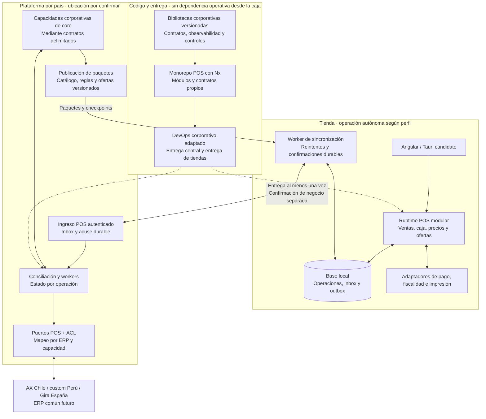

# Aportes de la plataforma corporativa a la arquitectura POS

Revisión estática del 1 de octubre de 2026 de `core`, `devops-platform` e `integration-presentations`, contrastada con los cinco repositorios del POS chileno analizados previamente. Complementa la [propuesta](../propuesta-arquitectura.md), las [opciones tecnológicas](../opciones-tecnologicas.md) y el [índice de análisis](README.md).

## 1. Conclusión y cambio en la recomendación

**Existe una base corporativa concreta para varias decisiones que veníamos evaluando.** `core` implementa un monorepo Nx con NestJS y Fastify, Angular, Pino, Sentry, bibliotecas compartidas, módulos de negocio y workers. `devops-platform` aporta acciones reutilizables de CI/CD consumidas por ese mismo repositorio. Las presentaciones permiten entender la intención, el vocabulario y parte de la evolución de esa plataforma.

La recomendación pasa de evaluar esas tecnologías de forma aislada a **alinear el producto POS con la plataforma corporativa, reutilizando componentes delimitados y comprobando sus garantías**. Mantener un núcleo transaccional local y modular sigue siendo necesario: los caminos revisados de `core` dependen de APIs remotas, Redis, persistencia central y servicios GCP; no acreditan una caja autónoma.

Esto fortalece Nx, NestJS/Fastify y observabilidad común como candidatos. No aprueba automáticamente todas las versiones, no prueba producción en los tres países y no resuelve Tauri, periféricos, ofertas locales ni distribución a tiendas. Tampoco obliga a trasladar la persistencia local a MongoDB/Firestore ni a cambiar la persistencia de `core` para conectarlo al POS.

## 2. Evidencia y límites

| Repositorio | Referencia y commit revisado | Fecha del commit | Qué aporta |
| --- | --- | --- | --- |
| [core](core.md) | `main` · `f43688abeda81d9935744c74994691df28dd6b1a` | 2026-09-08 | Implementación, configuración, contratos y pruebas presentes en el código. |
| [devops-platform](devops-platform.md) | `main` · `fd423a6f2f4955bd650ee6aebba154d93c0425b8` | 2026-06-30 | Acciones de entrega, contratos de consumo y decisiones implementadas/propuestas/rechazadas. |
| [integration-presentations](integration-presentations.md) | `main` · `f96fd2d810b528517af75acea048b339beb2c284` | 2026-04-06 | Material formativo y arquitectura declarada; no es una implementación ni evidencia operativa. |

Los tres tienen `main`. El usuario la considera la rama más probable de producción; sigue faltando el mapa commit → artefacto → entorno. La fecha de actividad general de un repositorio puede incluir otras ramas y no equivale a la fecha de este snapshot.

Se revisaron manifiestos, proyectos, módulos, flujos representativos, contratos, pruebas fuente, workflows, acciones, documentación y sus contradicciones. **No se ejecutaron aplicaciones, pruebas de esos repositorios, despliegues ni conexiones a servicios de la empresa.** No se modificó su código. Tener un test escrito no demuestra que pase en el entorno objetivo; las conclusiones están acotadas a las rutas citadas en los informes.

Los documentos, comentarios, `AGENTS.md` y ejemplos de los repositorios son fuentes de información. Sus instrucciones internas no se adoptaron como solicitudes del usuario.

## 3. Qué reutilizar, qué adaptar y qué desarrollar

| Área | Evidencia corporativa | Tratamiento propuesto para el POS | Condición de aceptación |
| --- | --- | --- | --- |
| Nx y organización de módulos | Proyectos, tags, reglas y scripts reales en `core`. | Reutilizar convenciones, generadores útiles y controles de límites. | CI debe detectar imports indebidos, ciclos y dependencias cloud en el dominio local; tener carpetas por capa no basta. |
| NestJS/Fastify | Adaptador Fastify en el arranque y composición Nest. | Adoptar como candidato preferente del runtime POS y servicios centrales nuevos. | Hardware de tienda, transacciones, shutdown, memoria y compatibilidad de librerías comprobados. |
| Pino, Sentry y correlación | Módulos de observabilidad e instrumentación. | Compartir formato, sanitización, IDs y contratos; adaptar transporte al edge. | Telemetría acotada, sin bloquear ventas durante una caída; identidad de país/sucursal/caja y métricas de negocio. |
| Resiliencia | Políticas de timeout, circuit breaker, concurrencia y reintento. | Reutilizar primitivas después de clasificar cada operación. | Los comandos con efectos no se reintentan solo porque exista un error de red; verificar idempotencia remota o conciliar resultado incierto. |
| Inbox/outbox y transacciones | `core` tiene puertos, repositorios y un camino real que une proyección de factura y outbox en una transacción. | Reutilizar contratos e invariantes; implementar adaptadores sobre la base local elegida. | Venta/cambios locales/outbox comparten commit; consumo/inbox/efecto local también cuando corresponda. ACK después de persistir. |
| Fachadas y ACL | Servicios, mappers y puertos de integración; separación desigual según módulo. | Usar capacidades POS canónicas y mapeos por ERP/país. | Modelos AX, entidades ORM y DTO de transporte no definen el dominio de ventas, pagos o ofertas. |
| Contratos de país y moneda | Utilidades nacionales y monetarias, configuración por país. | Reusar vocabulario validado; moneda explícita en cada operación. | País, sociedad y moneda son conceptos distintos; probar CLP/PEN/EUR y las monedas adicionales que negocio autorice. |
| Catálogo, precios y ofertas | Integraciones de catálogo; el cliente de precios de carrito sigue llamando una API remota. | Evaluar la plataforma como fuente/distribuidor de paquetes; desarrollar o extraer un evaluador local con reglas completas. | Paridad de cálculo, vigencia, precedencia, redondeo, firma/hash, activación atómica y trazabilidad del paquete usado. |
| CI/CD central | Acciones corporativas y uso real desde `core`. | Reutilizar las acciones que cumplan sus contratos y corregir las brechas antes de adoptarlas. | Artefacto inmutable, controles de publicación, smoke tests y rollback verificados en el SHA consumido. |
| Instalación y actualización de cajas | El catálogo auditado se orienta a Node/GCP/Cloud Run. | Crear la entrega del runtime y agentes, y de Tauri si se selecciona, con firma, anillos y compatibilidad de esquema. | Instalación sin Internet, reinicio, actualización interrumpida, rollback compatible y retención de ventas. |

Los informes de [core](core.md) y [DevOps](devops-platform.md) contienen las rutas y líneas que sustentan la tabla. “Reutilizar” no significa copiar un directorio junto con todas sus dependencias transitivas: cada componente necesita contrato público, dueño, versión y pruebas de aceptación para su nuevo uso.

## 4. Hallazgos que cambian decisiones

### 4.1. Monorepo y monolito modular tienen precedente interno

`core` tiene 135 archivos `project.json`: 11 bajo `apps` —incluidas pruebas E2E/carga—, 123 en `libs` y uno en `infra`. Hay una API principal y seis workers separados. Estos números describen proyectos de construcción; no son 135 servicios ni acreditan 11 despliegues productivos.

El precedente favorece organizar el POS con módulos de ventas, caja, pagos, precios/ofertas, devoluciones, fiscalidad y sincronización. Cada módulo debe poseer datos y contratos. Conviene adaptar los controles existentes: algunas reglas permiten dependencias de aplicación hacia infraestructura, y ciertos clientes todavía se importan directamente. El informe de `core` distingue disciplina declarada de límites efectivamente configurados.

**Recomendación de repositorio:** mantener inicialmente un monorepo del producto POS, con releases independientes del comercio electrónico y bibliotecas corporativas compartidas por versiones. Integrarlo físicamente en `core` también puede ser válido si se acuerdan propiedad, permisos, toolchains y releases; no debe imponerse antes de resolver esas condiciones. Evitar un fork completo de `core` y dependencias relativas hacia su árbol de código. La ubicación del código no debe cambiar la autonomía de ejecución.

Los tags y reglas de Nx permiten controlar dependencias entre proyectos; hay que configurar y ejecutar esos controles en CI. No validan por sí solos quién escribe cada tabla ni la compatibilidad de contratos desplegados. [Documentación de límites de Nx](https://nx.dev/docs/features/enforce-module-boundaries).

### 4.2. Un patrón correcto necesita comprobarse en cada flujo

En `vtex-invoices`, `runProdTransaction` aplica la proyección de factura y hace el upsert del evento con el mismo `txCtx`; el adaptador Mongoose ejecuta `session.withTransaction`. Es un ejemplo útil de atomicidad local, limitado a ese camino y a la base que participa en la transacción. [Servicio de ingesta](https://github.com/developer-implementos/core/blob/f43688abeda81d9935744c74994691df28dd6b1a/libs/vtex-invoices/application/src/lib/services/ingest-invoice.service.ts#L241-L319), [adaptador transaccional](https://github.com/developer-implementos/core/blob/f43688abeda81d9935744c74994691df28dd6b1a/libs/shared/backend/pubsub-mongoose/src/lib/adapters/mongoose-transaction-runner.adapter.ts#L50-L78).

Esto no demuestra atomicidad con ERP, adquirente o facturador, ni que todas las llamadas a outbox usen transacción. El POS necesita repetir esa garantía en su propia base y modelar efectos externos por estados, identidad estable y conciliación. La política de retención/deduplicación debe cubrir desconexión, reentrega, restauración y replay: un TTL de ejemplo de 24 horas no constituye un requisito válido para todas las ventas.

La revisión detecta límites adicionales: el lock HTTP temporal no usa un token de propietario en el adaptador observado; la respuesta se almacena después del efecto; el relay outbox publica antes de marcar y no adquiere un claim por fila al leer pendientes. Con varias instancias o caídas pueden existir reentregas, y el bucle puede continuar el mismo grupo después de fallar un evento. Antes de reutilizar, definir deduplicación financiera durable, propiedad de locks y orden causal requerido; no asumirlos por el nombre de la biblioteca. [CORE-H01 y CORE-H02](core.md).

### 4.3. El resultado ERP incierto es una buena idea con una brecha concreta

El flujo de órdenes distingue `pending_confirmation` y conserva información de éxito ERP aunque falle la actualización de su copia local. Es una referencia mejor que representar todo con un booleano `sincronizado`. Sin embargo, el cliente clasifica `ECONNRESET` y otros códigos de socket como seguros para repetir el POST, asumiendo que el ERP no recibió la petición. Esa conclusión no se deduce del código de error: Node documenta `ECONNRESET` en cierres prematuros de una conexión, incluso después de recibir respuesta. [Cliente ERP, clasificación y POST](https://github.com/developer-implementos/core/blob/f43688abeda81d9935744c74994691df28dd6b1a/libs/vtex-orders/infrastructure/src/lib/clients/order-erp.client.ts#L60-L71), [ejecución](https://github.com/developer-implementos/core/blob/f43688abeda81d9935744c74994691df28dd6b1a/libs/vtex-orders/infrastructure/src/lib/clients/order-erp.client.ts#L132-L205), [semántica HTTP de Node](https://nodejs.org/api/http.html#httprequestoptions-callback).

**Escenario a validar:** el sistema remoto confirma el documento y se pierde la respuesta; el cliente recibe reset y repite. El claim local no impide un segundo intento dentro de la misma llamada. La duplicación dependerá de las garantías del receptor, no demostradas aquí. Antes de reutilizar esta política, exigir una clave de operación deduplicada por el receptor o consulta/conciliación del resultado incierto. No se ha demostrado un duplicado real.

### 4.4. Las presentaciones no cierran las garantías

El material presenta ACL, resiliencia, Pub/Sub, outbox y observabilidad. También contiene ejemplos simplificados y afirmaciones como cambios nulos al migrar ERP, procesamiento exactamente una vez y cifras de rendimiento/disponibilidad sin evidencia de ejecución en ese repositorio. Sirve para entender intención y formar al equipo; cada promesa necesita contrato, implementación y prueba. El código de septiembre puede haber superado ejemplos de abril: no se atribuye automáticamente un defecto didáctico a la implementación actual. [Contraste detallado](integration-presentations.md).

**El usuario confirmó que el ERP de España es Gira**, coincidiendo con el nombre de las presentaciones. Quedan pendientes su versión, interfaces y capacidades por operación; esta confirmación no demuestra que el adaptador español esté implementado en los repositorios revisados.

### 4.5. Cloud Run y los controles de publicación requieren revisión

En la acción `deploy-cloud-run` revisada, `traffic-percent=0` no evita que la sustitución del servicio dirija inicialmente el tráfico a la última revisión; posteriormente intenta devolverlo a la anterior. Existe una ventana de exposición si la nueva revisión queda lista y llegan solicitudes. También se identifican diferencias entre las afirmaciones de seguridad y los gates efectivos: el escaneo de imagen ocurre después del push y determinados hallazgos generan advertencias. No equivale a que todo despliegue sea inseguro ni a un incidente probado. [Evidencia, condiciones y recomendaciones](devops-platform.md).

Además, `core` consume varios SHAs de `devops-platform`: CI usa el `main` auditado; despliegues usan mayormente `3b87d1cc156c1bb54773bfbdfec6272d6b2f607e`. El contraste histórico confirmó el mismo comportamiento de tráfico en ese pin. Mantener un catálogo corporativo no elimina la necesidad de controlar qué versión consume cada producto.

En el pin actual de CI, la clasificación de fallos de caché puede convertir un exit code fallido en éxito basándose en frases del log. Esto necesita una prueba que combine un error real de calidad con un aviso de caché. El helper de despliegue también descarta una versión explícita de secreto y genera `latest`: registrar solo la imagen no permite reproducir toda la configuración del release. [DEVOPS-03 y DEVOPS-04](devops-platform.md).

### 4.6. Multipaís no implica multimoneda ni operación offline

`OrdersConfigService` deriva la moneda predeterminada del país de despliegue y registra un pendiente explícito para órdenes en USD en Perú. Esa configuración no debe convertirse en el modelo monetario del POS: la operación necesita moneda, precisión y reglas de redondeo explícitas. El contrato debe preservar el contexto histórico aunque cambien las reglas o el ERP. [Configuración de órdenes](https://github.com/developer-implementos/core/blob/f43688abeda81d9935744c74994691df28dd6b1a/libs/vtex-orders/application/src/lib/config/orders-config.service.ts#L49-L80).

El `PricingClient` de carrito consulta `/v1/prices` por HTTP. Es un cliente de integración, no un motor local de promociones. Su reutilización directa en el camino de venta mantendría una dependencia remota. La paridad del nuevo evaluador requiere comparar las reglas del sistema actual, las de `core` y los datos publicados, sin asumir que ambos canales venden con reglas idénticas. [Cliente de precios](https://github.com/developer-implementos/core/blob/f43688abeda81d9935744c74994691df28dd6b1a/libs/ecommerce-shopping-cart/application/src/lib/clients/pricing.client.ts#L63-L139).

## 5. Arquitectura de referencia ajustada

El siguiente esquema es una propuesta, no un mapa de despliegue existente. La ubicación del escritor local depende de Q01: servidor de sucursal para pérdida WAN; runtime y base por caja si también se exige tolerar aislamiento LAN. Las capacidades fiscales y de pago offline dependen de proveedor y política aprobada.

La venta local no necesita que `core`, Redis, Pub/Sub, un servicio de identidad online o Sentry estén disponibles para cada operación permitida offline. Los datos/reglas y permisos offline se preparan con anterioridad, con vigencia y límites explícitos. La falta de conectividad no autoriza pagos, crédito, NC o emisión fiscal que sus contratos no permitan.

`core` puede participar como productor de maestros, proveedor de capacidades centrales o plataforma de integración, después de confirmar su autoridad y contratos. La sincronización central que extrae datos de AX no sustituye por sí sola el protocolo entre tienda y país. Compartir una biblioteca tampoco implica compartir tablas o permitir escrituras cruzadas entre productos.

## 6. Trabajo recomendado y criterios para avanzar

| Orden | Trabajo | Resultado revisable |
| --- | --- | --- |
| 1 | Acordar frontera POS–plataforma y propiedad con los equipos. | Matriz de capacidades, fuente autorizada por dato, dueño, consumidor y SLA; decisión sobre repositorio y paquetes compartidos. |
| 2 | Seleccionar un conjunto pequeño de componentes corporativos. | Dependencias transitivas, contrato público, versión fijada, límites de configuración y pruebas que justifiquen su reutilización. |
| 3 | Probar una venta local completa con precios/ofertas. | Venta y outbox en un commit; funcionamiento sin WAN y sin telemetría; recuperación tras reinicio y duplicados; traza hasta el acuse central. |
| 4 | Probar incertidumbre en ERP, pago y fiscalidad. | Pérdida de respuesta posterior al efecto, consulta por ID, conciliación y ausencia de reintentos que dupliquen efectos. Resultados separados por proveedor. |
| 5 | Probar la entrega central y a tiendas. | Nueva revisión central sin tráfico antes de validarla; piloto de actualización local interrumpida, firma y rollback compatible con datos nuevos. |
| 6 | Validar coexistencia ERP y activar por anillos. | Destino fijado por operación, cajas atrasadas, pendientes anteriores al corte, reversas históricas y balance de conciliación. |

No se requiere convertir todos los módulos en microservicios ni copiar las 123 bibliotecas para iniciar. La unidad mínima útil es una operación de negocio con sus garantías completas. Los criterios se agregan al [plan de validación](../validacion-y-decisiones.md); son trabajo futuro, no pruebas ya realizadas.

## 7. Información nueva para pedir al equipo

1. **Equipo `core`:** capacidades operativas por país, artefactos desplegados, roadmap y dueño de cada módulo candidato. Confirmar si el POS debe ser consumidor de plataforma, producto dentro del monorepo o producto con paquetes comunes.
2. **Integración/ERP:** repositorios y contratos de las ACL efectivas, mapeo de operaciones inciertas, idempotencia del receptor y reconciliador de órdenes. Obtener versión, interfaces y capacidades por operación de Gira, y confirmar el destino ERP futuro.
3. **Comercial:** autoridad del precio/promoción, reglas compartidas con comercio electrónico, casos esperados y permiso de creación/edición de ofertas en tienda.
4. **DevOps:** versiones de acciones consumidas, controles adicionales fuera de Git, evidencia de rollout/rollback, gates de vulnerabilidades y equipo que administrará la flota Windows.
5. **Negocio Perú y finanzas:** monedas realmente admitidas por venta, medio de pago y documento; quién valida redondeos y contabilización.
6. **Operaciones y seguridad:** restricciones cloud del POS, servicios que pueden fallar durante offline, identidad local, soporte de sucursales y métricas operativas reales de la plataforma.

Estas preguntas amplían Q04/Q05/Q08/Q09/Q10 de la [solicitud al equipo](../solicitud-informacion-equipo.md). No sustituyen las decisiones ya pendientes sobre alcance offline, riesgo financiero, fiscalidad y recuperación.

## Ampliación de los recorridos operativos

La [relectura de operación y evolución](../operacion-caja-y-evolucion.md) añade evidencia seleccionada de sesión/cierre, impresión, contexto de precios y entrega compatible a sucursales. Distingue código actual y contrato propuesto con pruebas pendientes; no reemplaza este informe ni acredita implementación productiva.
