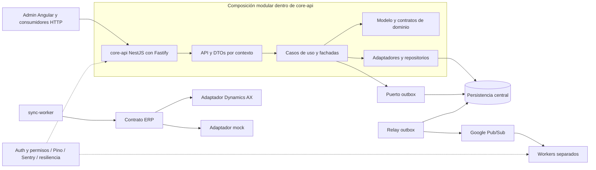

# Análisis de `core` como referencia para el POS

## 1. Alcance y conclusión

Revisión estática realizada el **1 de octubre de 2026** del repositorio privado [developer-implementos/core](https://github.com/developer-implementos/core), rama `main`, commit **`f43688abeda81d9935744c74994691df28dd6b1a`**, fechado el 8 de septiembre de 2026, 16:42:30 UTC−03:00. La rama y el código revisados **no se atribuyen a producción**. La indicación del usuario de que probablemente se utiliza `main` no sustituye el inventario de despliegues.

Se inspeccionaron manifiestos, proyectos Nx, composición de aplicaciones, librerías transversales, controles de dependencias, pruebas representativas y flujos concretos de integración. No se ejecutaron aplicaciones, scripts del repositorio, compilaciones ni pruebas; tampoco se instalaron dependencias ni consultaron bases, ERPs o proveedores. Los documentos, comentarios y etiquetas «enterprise», «BigTech» y «implemented» son afirmaciones de sus autores: la revisión contrasta algunas con el código. No es una certificación operativa ni un pentest.

**El repositorio es una referencia interna valiosa para Nx, NestJS con Fastify, módulos de negocio, workers, observabilidad y contratos de integración. No es un POS offline terminado ni una plantilla que convenga copiar íntegramente.** Su organización principal corresponde a ecommerce, OMS, integraciones VTEX y servicios centrales. Aprovecharla requiere seleccionar componentes, corregir o acotar garantías y diseñar explícitamente la autoridad y persistencia de sucursal.

La evidencia más útil no es el número de capas: existen un flujo real de proyección más outbox dentro de una transacción, separación entre autenticación y permisos, estados de resultado ERP incierto y controles automáticos de algunas reglas arquitectónicas. También hay límites relevantes: idempotencia HTTP temporal, publicación al menos una vez, cobertura desigual por país y dependencia de servicios centrales. [CORE-04], [CORE-09], [CORE-12], [CORE-14], [CORE-17]

## 2. Inventario real

El conteo de los `project.json` versionados arroja **135 proyectos: 11 bajo `apps`, 123 bajo `libs` y uno bajo `infra/management`**. Los once de `apps` incluyen pruebas E2E y k6; no equivalen a once servicios de producción. No se ejecutó el grafo Nx, por lo que este conteo describe archivos de configuración y no todas las tareas que los plugins podrían inferir.

| Aplicación/proyecto | Responsabilidad observada | Lectura para el POS |
| --- | --- | --- |
| `core-api` | Composición Nest de múltiples módulos y endpoints, Fastify, seguridad y servicios transversales. | Referencia de API modular central; no obliga a que el núcleo local importe todos esos módulos. |
| `admin` | Aplicación Angular de administración. | Reutilización de prácticas de frontend; no constituye la interfaz de caja. |
| `admin-e2e`, `core-api/k6` | Automatización de interfaz y escenarios de carga. | Infraestructura de validación, no resultados de rendimiento acreditados. |
| `db-migrations` | Aplicación dedicada a migraciones. | Separar despliegue de esquema y tráfico es aprovechable; la sucursal necesita además migración recuperable durante actualización offline. |
| `sync-worker` | Sincronización y adaptadores ERP. | Referencia de integración central; no equivale al protocolo de sincronización durable sucursal–central. |
| `notification-worker`, `notification-retry-worker`, `pickup-reminder-worker` | Procesamiento de notificaciones y recordatorios. | Demuestra que compartir monorepo no obliga a compartir proceso. |
| `report-worker`, `salesforce-mc-sync-worker` | Reportes e integración de marketing. | Procesos que no deben competir con el camino crítico de cobro local. |

Las carpetas de primer nivel de `libs` incluyen `core`; catorce contextos `ecommerce-*` —artículos, catálogo, CMS, cliente, ventas del cliente, documentos, inventario, logística, promesa logística, notificación, OMS, pagos, carro y almacenamiento, contando los nombres efectivamente presentes—; `notifications`, `salesforce-mc-reporting`; cinco contextos `vtex-*` —facturas, órdenes, productos, cotizaciones, tracking—; `webhooks`, `shared` e `infra-tools`. **El inventario de nombres debe leerse por capacidades y no como una propuesta de módulos POS uno a uno.**

En `shared/backend` se observaron veinte agrupaciones: `alerting`, `api-dtos`, `auth`, `authorization`, `cache`, `config`, `database`, `database-migrations`, `idempotency`, `kill-switch`, `migration-contributions`, `multipart`, `observability`, `pubsub`, `pubsub-mongoose`, `resilience`, `security`, `sre`, `types` y `validation`.

### Versiones declaradas y composición

| Elemento | Declaración en el commit | Límite de la lectura |
| --- | --- | --- |
| Entorno | Node `>=22.22.0`; `packageManager: pnpm@10.33.3`. | No demuestra versión instalada ni desplegada. |
| Monorepo | Nx `22.7.1`; caché de tareas, dependencias de build y targets affected. | El grafo debe expresar todas las entradas y dependencias para que el caché sea confiable. |
| Backend | Nest `^11.0.0`, adaptador Fastify `^11.1.9`; Fastify `^5.7.4` con override `5.8.5`. | Son declaraciones del manifiesto, no una recomendación de copiar esas versiones. |
| Frontend/lenguaje | Angular `~21.2.0`, TypeScript `~6.0.0`. | README conserva referencias a TypeScript 5 y carpetas anteriores. |
| Telemetría | `nestjs-pino ^4.5.0`, Pino `^10.1.0`, Sentry `^10.27.0`, OpenTelemetry. | Presencia y configuración no prueban retención, entrega, alertas ni ausencia de datos sensibles. |
| Persistencia/integración | Mongoose `^7.8.8`, `pg ^8.18.0`, `mssql ^12.2.0`, `ioredis ^5.8.2`, Google Pub/Sub `^5.2.0`. | No adoptar todos los motores en sucursal por simetría con la plataforma central. |
| Pruebas | Vitest `^4.0.15`, Playwright, k6 y dependencias Stryker. | No se ejecutaron; no se infiere cobertura ni éxito por estar presentes. |

Fuentes de versiones: [CORE-01]. El uso real de Fastify se comprobó en `createFastifyAdapter()` y en `NestFactory.create(..., fastifyAdapter, ...)`, no únicamente en las dependencias. El adaptador desactiva su logging para delegarlo a la integración Nest/Pino y configura `trustProxy: true`; este último ajuste requiere reevaluación según los proxies y enlaces locales del POS. [CORE-02]

## 3. Arquitectura observada y alcance de las capas

Es una vista simplificada de composición y dependencias observadas; no representa una topología de producción verificada. Las flechas `application → infrastructure` reflejan que la configuración Nx **permite** esa dependencia para composición, no que cada caso de uso deba conocer la base de datos.

### Nx y controles de arquitectura

La organización utiliza tags `scope:*` y `type:*`, con reglas `@nx/enforce-module-boundaries`, control de ciclos y reglas locales. Hay límites reales, pero **no equivalen a una comprobación universal de Clean Architecture**:

- `type:domain` puede depender de `domain`, `config`, `core` y `shared`; `application` puede depender también de `infrastructure`; `config` tiene permisos amplios. La pureza de negocio requiere verificar qué exportan esas bibliotecas. [CORE-03]
- La regla local que impide reexportar infraestructura desde módulos application comprueba un patrón concreto de nombres y AST; admite falsos negativos documentados, por ejemplo algunos spreads. Es una protección útil, no una prueba de encapsulación completa. También existen reglas para impedir `fetch` en application, exigir validaciones de importes y normalizar logging. [CORE-04]
- Hay exclusiones de ocho contextos en la inferencia del plugin ESLint. Por ejemplo, `ecommerce-payment/domain` declara `targets: {}`. Esto obliga a comprobar el grafo efectivo de targets antes de afirmar que `nx affected -t lint` revisa uniformemente todas las bibliotecas. No se ejecutó ese grafo y no se declara que todo el contexto carezca de lint. [CORE-05]
- Se observaron pruebas de aptitud arquitectónica: integridad del registro de migraciones, dependencias necesarias en artefactos y aplicación de enmascaramiento de tarjetas. El registro de migraciones sí tiene configuración de test en su proyecto. Los archivos `.spec.mjs` bajo `tools/eslint-rules` no deben contarse automáticamente como ejecutados por CI: se requiere demostrar su conexión al runner. [CORE-06]

En el árbol revisado se contaron **568 archivos `*.spec.ts` bajo `apps` y `libs`**. Es un inventario, no el número de pruebas ejecutadas ni una métrica de cobertura. CI declara ejecución de lint/test/typecheck affected; el paso de pruebas declara umbral global 40, mientras otros campos informativos contienen 70. Nx permite `passWithNoTests`; la fábrica compartida de Vitest tiene un esquema de adopción de cobertura por proyecto. La conclusión defendible es que existe automatización configurada, con alcance que debe acreditarse mediante ejecuciones y artefactos. [CORE-07]

### DDD, CQRS y contratos

`libs/core` aporta `Entity<TId>`, `AggregateRoot` con versión y eventos, `DomainEvent` con UUID, fecha, versión de contrato y correlación/causalidad, `Result` y interfaces de casos de uso. Son piezas aprovechables para explicitar invariantes. La versión en memoria de un agregado no acredita control de concurrencia en todas sus persistencias: el repositorio debe aplicar la condición correspondiente. [CORE-08]

Las interfaces `ICommandHandler` e `IQueryHandler` se expresan como casos de uso con `execute`. Esto facilita separar escrituras y lecturas, pero por sí solo no prueba un bus CQRS, event sourcing ni almacenes separados. `DomainError` incorpora un código y categoría, aunque también exige `suggestedHttpStatus`: para el POS conviene que la representación HTTP, los mensajes de caja y los errores del worker se mapeen desde errores de negocio sin imponer HTTP al núcleo compartido. [CORE-08]

## 4. Aprendizajes y límites prioritarios

Las prioridades siguientes indican **qué debe resolverse antes de trasladar un patrón al POS**, no incidentes ocurridos ni severidades de una auditoría de seguridad.

### CORE-H01 — Prioridad alta: separar idempotencia HTTP, negocio y consumo de eventos

El repositorio contiene mecanismos distintos que no deben presentarse como una única garantía:

| Mecanismo | Qué se observó | Garantía que falta para operaciones financieras offline |
| --- | --- | --- |
| HTTP `@Idempotent` | Clave UUID, huella del body, respuesta temporal en Redis o memoria; guard e interceptor. En invoices es `strict: false`, TTL 24 h. | No reemplaza una clave de operación persistida con la venta y validada por el receptor. Un cliente sin header puede pasar. |
| Outbox con clave de negocio | Upsert por cuatro campos e índice único; acepta contexto de transacción. | El índice debe existir y la clave debe distinguir correctamente operaciones/versiones; la entrega posterior puede repetirse. |
| `IdempotentHandlerService` | Reserva atómica Redis `setNx('processing')`, ejecuta efecto y marca `processed`; TTL predeterminado 24 h. | La marca no comparte transacción con un efecto externo. Un proceso que cae deja una reserva temporal; un fallo después del efecto puede permitir repetirlo. |
| Estado de orden ERP | Claim, huella, CAS, referencias y estado `pending_confirmation`. | Necesita consulta/conciliación y contrato de deduplicación remoto; no basta con la exclusión local. |

Fuentes: [CORE-09], [CORE-10], [CORE-11], [CORE-12], [CORE-14], [CORE-16].

En la capa HTTP, el guard construye `resource + UUID`; la huella se calcula sobre el body. El helper no incorpora por sí mismo identidad, país, empresa, sucursal, ruta ni parámetros de ruta. Para reutilizarlo se debe diseñar el ámbito de las claves y demostrar qué endpoints/identidades comparten almacenamiento. Esto es un límite del helper, no evidencia de un acceso cruzado ocurrido. [CORE-09]

El lock HTTP dura 30 segundos, usa un valor constante y se libera con `DEL`; no se observó en ese adaptador un token de propietario, renovación o fencing. **Escenario a probar:** A supera el TTL, B adquiere la misma clave y A termina liberando el lock de B. Además, la respuesta se guarda después de ejecutar el controller: una caída entre el efecto y la caché permite un reintento sin respuesta registrada. La selección de memoria en producción emite advertencia, sin impedir el arranque desde ese módulo. [CORE-10]

Matiz importante: el fallo de adquisición del lock se trata como no adquirido; el guard espera y devuelve conflicto si no aparece respuesta. No se debe describir esa rama como ejecución automática sin idempotencia. En cambio, la falta de header cuando `strict: false`, el vencimiento y la falta de persistencia posterior sí delimitan la garantía. [CORE-09], [CORE-10]

**Aplicación propuesta:** conservar la ergonomía del decorator como protección adicional; diseñar `saleId`, `paymentAttemptId`, `operationId` y `eventId` durables, con ámbito explícito, huella semántica y resultados recuperables durante toda la ventana de reenvío, respaldo y restauración. Esa ventana no se deduce del TTL de Redis.

### CORE-H02 — Prioridad alta: outbox real, sin promesa de exactly once

Existe una implementación concreta aprovechable: `IngestInvoiceService.runProdTransaction` llama a `TransactionRunner.withTransaction`, aplica la proyección y pasa el mismo `txCtx` al upsert de outbox. El repositorio Mongoose propaga la sesión al upsert. Esto demuestra intención transaccional en un flujo real, superior a tener solamente una clase llamada Outbox. La garantía efectiva sigue dependiendo del adaptador, base y topología utilizados; no se ejecutó aquí. [CORE-12]

El relay publica y después marca el mensaje como procesado. Si la publicación se confirma y el proceso cae antes de marcar, el mensaje puede publicarse otra vez: es una entrega **al menos una vez**. En el repositorio Mongoose inspeccionado `findPending` lee pendientes sin adquirir un claim por registro; el flag del procesador evita solapamiento dentro de su instancia. Por ello, si varias instancias procesaran el mismo outbox, podrían seleccionar las mismas filas. No se confirmó cuántas instancias se despliegan. [CORE-13]

Agrupar por `orderingKey` tampoco acredita orden causal estricto de extremo a extremo: el bucle continúa con el siguiente mensaje del grupo después de un fallo. El receptor debe manejar versiones/secuencias y dependencias, o el dispatcher debe detener el grupo hasta resolver el precedente cuando el negocio lo exija. [CORE-13]

El chequeo del índice único del outbox alerta si falta, pero no bloquea el arranque desde ese repositorio; su creación se delega a migraciones. Para el POS, la capacidad de aceptar ventas debe depender de que estén disponibles las invariantes necesarias de esquema y almacenamiento, con una política explícita para degradación. [CORE-11]

**Aplicación propuesta:** venta y outbox en una sola transacción local; inbox/registro de operación del receptor; reintentos acotados con backoff y cola de revisión; deduplicación de negocio; reconciliación; pruebas de caída en cada transición. Reutilizar puertos y modelos, implementando el repositorio en el motor local seleccionado. No desplegar Pub/Sub cloud, Redis y Mongo en cada caja por analogía.

### CORE-H03 — Prioridad alta: resultados ERP inciertos y reintentos de efectos

`OrderErpExecutor` reconoce un resultado incierto, lo lleva a `pending_confirmation` y evita equiparar un timeout con rechazo comercial. Después de recibir referencias ERP, trata de conservarlas aunque falle la escritura local de completado. El CAS limita cambios concurrentes. Son decisiones útiles para distinguir venta aceptada localmente, emisión fiscal, cobro y registro contable. [CORE-14]

Hay dos límites antes de adoptar ese patrón:

1. El mapper describe el reconciliador de `pending_confirmation` como trabajo futuro; **no debe darse por demostrada la recuperación automática** solo porque existe el estado. Hay que identificar implementación, ownership y ejecución de esa conciliación. [CORE-14]
2. `OrderErpClient` clasifica `ECONNRESET` y `EPIPE` entre errores supuestamente previos al envío; el callback de la política puede reintentar el POST. Esa inferencia no es válida como garantía general. En particular, Node documenta `ECONNRESET` también en cierres prematuros durante la respuesta. Si el upstream confirma y se pierde la respuesta, el claim local no evita un segundo intento dentro de la política. El POST inspeccionado no añade un header de idempotencia; puede existir deduplicación upstream por los campos del DTO, pero no quedó probada. No se afirma que se haya producido un duplicado. [CORE-15]; [documentación de Node HTTP](https://nodejs.org/api/http.html#httprequestoptions-callback).

**Aplicación propuesta:** clasificar por conocimiento del resultado y por contrato de operación. Frente a un resultado ambiguo, consultar por la clave durable o conciliar; reejecutar efectos solamente cuando el receptor garantice deduplicación o se haya probado que no los aplicó. Circuit breaker y backoff reducen presión; no otorgan idempotencia.

### CORE-H04 — Prioridad alta: auth y telemetría central no constituyen un modo offline

`UnifiedAuthModule` registra autenticación y autorización globales en orden; hay permisos declarativos, contextos de cliente y separación de rutas públicas. Las rutas públicas pueden enriquecer contexto de forma opcional, mientras la verificación de revocación de tokens en rutas protegidas utiliza servicios de identidad/blacklist. Esto es una referencia más sólida que repetir guards particulares por controller. [CORE-17]

El POS necesita otra decisión explícita: qué credencial y permisos pueden verificarse localmente, por cuánto tiempo, para qué sucursal/terminal y operaciones, y cómo se tratan revocación pendiente, cambio de cajero, supervisión y reloj incorrecto. No se debe convertir en público un endpoint de caja para sortear la falta de conectividad. La política de autorización offline exige un diseño de negocio y seguridad propio.

Pino dispone de serialización estructurada, correlación y redacción configurables; Sentry se inicializa antes del bootstrap y utiliza un filtro `beforeSend`; existe OpenTelemetry. Esto respalda la viabilidad del stack propuesto por el usuario. [CORE-18]

Para reutilizarlo en sucursal faltan presupuestos explícitos de disco/memoria, spool y rotación local, retención, descarte bajo presión, envío posterior y redacción consistente en todos los entornos. Un archivo de reglas de redacción no prueba por sí solo que ningún cuerpo, URL o mensaje libre pueda llevar datos sensibles. Los identificadores de negocio deben conservarse entre reintentos aunque cambie el trace ID; no usar el reloj local como prueba de orden causal.

### CORE-H05 — Prioridad alta: capacidad por país y moneda debe demostrarse por operación

El factory declara varios tipos de ERP, pero el módulo de `sync-worker` inspeccionado registra **Dynamics AX y mock**; los demás quedan como ampliaciones futuras. **El usuario confirmó Gira como ERP de España.** El enum `GIRA` no confirma que exista un adaptador español implementado; siguen pendientes la versión, las interfaces y las capacidades disponibles por operación. [CORE-19]

Existe selección de validación documental por país, pero eso no acredita emisión fiscal, pagos, devolución, cierre de caja o registro contable completos en los tres países. El mapper de tracking selecciona Chile y rechaza Perú/España por falta de implementación. Un país admitido en un tipo o variable de despliegue no equivale a capacidad funcional terminada. [CORE-20]

La biblioteca de billing sí define monedas CLP/USD/EUR/PEN, exponentes, helpers de redondeo y un validador que exige un número finito y decimales compatibles. No sería correcto afirmar que el repositorio carece de modelado de moneda. Aun así, trabaja con `number` y deja políticas de unidad menor a los contextos; el `Money` de `libs/core` aparece como ejemplo/test de `ValueObject`, no como tipo financiero general de producción. `OrdersConfigService` conserva un TODO para moneda explícita en órdenes USD de Perú. [CORE-21]

**Aplicación propuesta:** contrato de capacidades por país/proveedor, moneda explícita en cada operación y snapshot, representación decimal/unidades menores acordada, impuestos y redondeo versionados, y suites de contrato con casos de cada país. El cálculo local de ofertas debe consumir paquetes versionados y reglas deterministas; este repositorio no demuestra por sí solo esa autonomía de caja.

### CORE-H06 — Prioridad media: modularidad gobernada y contratos de entrada

Adoptar Nx tiene sentido si cada módulo tiene propietario, API pública, datos propios y reglas de dependencia verificables. No hace falta reproducir 123 bibliotecas ni una carpeta por cada capa en cada caso. Separar monorepo, módulo y despliegue evita dos extremos: que todo termine en `shared`, o que cada biblioteca se convierta en un microservicio.

El pipeline global de validación usa `whitelist: true`, `forbidNonWhitelisted: false` y conversión implícita. Así, descarta campos desconocidos en lugar de rechazarlos. Es una política válida para ciertos consumidores existentes, pero debe elegirse conscientemente para contratos financieros y dispositivos con versiones antiguas. Las reglas de consistencia —totales, moneda, referencias, estados y permisos— deben validarse además en el dominio, no únicamente mediante DTOs. [CORE-22]

El naming de código, schemas, tablas, eventos y errores debe estar ligado al glosario POS y su propietario. Una fachada expone operaciones de negocio; una ACL traduce identidad, moneda, estado, semántica y errores del sistema externo. Renombrar tablas AX o esconder una URL detrás de un servicio no basta para desacoplar el ERP.

## 5. Qué aprovechar y qué adaptar

| Elemento de `core` | Decisión sugerida | Adaptación necesaria |
| --- | --- | --- |
| Nx, tags, reglas locales, CI affected | Aprovechar la práctica y configuraciones seleccionadas. | Menor conjunto inicial de módulos; comprobar targets efectivos, dependencias implícitas y tests de arquitectura en CI. |
| NestJS + Fastify | Candidato respaldado por un uso interno real. | Perfil de recursos y arranque en hardware local, cierre seguro, proxies y compatibilidad con dispositivos. |
| Casos de uso, puertos y fachadas | Aprovechar el patrón. | Modelo POS propio: venta, turno, pago, devolución, impuestos, ofertas y conciliación. |
| Outbox transaccional e índice de negocio | Aprovechar el diseño y las pruebas como referencia. | Persistencia local elegida, inbox, recuperación, ventanas de replay y versiones antiguas de sucursal. |
| Estados de operación incierta | Aprovechar la distinción semántica. | Completar conciliación, contrato remoto e interpretación de errores de transporte. |
| Logging/errores/permisos/validación | Reutilizar componentes pequeños después de evaluar dependencias. | Separar política offline, datos permitidos, presentación HTTP y almacenamiento local de diagnósticos. |
| Redis HTTP cache y locks temporales | Protección complementaria. | No usarlos como único registro de deduplicación financiera ni como prueba de exactly once. |
| Mongo/GCP/PubSub y configuración de despliegue | Referencia del plano central. | No imponerlos al plano local; seleccionar por requisitos y operación demostrada. |
| Tauri y adaptadores .NET existentes | Decisión independiente del monorepo de `core`. | No se encontró una app Tauri en el inventario revisado. Nx puede coordinar tareas de Rust/.NET, pero la auditoría no prueba empaquetado, drivers ni soporte offline de esos runtimes. |

Para el POS objetivo se mantiene la recomendación de **núcleo transaccional local modular**, interfaz de caja separada de su ciclo de vida, worker durable y plataforma central con ACL de ERP. `core` aporta antecedentes para construirlo; no cambia por sí solo las decisiones de autoridad, contingencia fiscal, presupuesto offline o migración. La estabilización de las apps actuales, la construcción del producto objetivo y la migración del ERP deben tener entregables y criterios de aceptación distintos.

## 6. Evidencia a solicitar antes de declarar componentes reutilizables

| Responsable esperado | Evidencia concreta | Decisión que permite tomar |
| --- | --- | --- |
| Equipo propietario de `core` y plataforma | Release/commit desplegado por país, módulos activados, grafo Nx exportado, targets ejecutados y últimos artefactos CI. | Qué está implementado, probado y operado; qué es código candidato o documentación anterior. |
| Integración/ERP | Contrato de clave idempotente y consulta de resultado; trazas anonimizadas de timeout después de commit y de recuperación. | Reintentos permitidos y contrato ACL durante la migración. |
| Persistencia/SRE | Motor y topología efectivos, soporte transaccional, índices aplicados, réplicas del relay, DLQ/replay y prueba de caída. | Garantía real de outbox y deduplicación, y componentes portables al edge. |
| Identidad/seguridad y operación de tiendas | Política de sesión y permisos desconectados, revocación, supervisión, identidad de terminal y retención local. | Diseño offline autorizado, sin depender de la disponibilidad del servicio central. |
| Equipos de negocio Chile/Perú/España | Matriz por operación: ERP, pagos, emisión fiscal, monedas, redondeo y correcciones; paquetes de precios/ofertas y vigencias. | Funcionalidad común, variantes por país y autoridad de cada dato. |
| QA/equipo POS | Pruebas de cortes de energía/red, duplicados, respuestas perdidas, reconexión prolongada, rollback/restauración y compatibilidad entre releases. | Aceptar componentes por comportamiento, no por framework o cantidad de pruebas presentes. |

### Ampliación para evaluar IA y recomendaciones

La revisión focalizada posterior del mismo commit identifica `SuggestionService`: obtiene recomendaciones desde repositorios, usa SKU y referencias de cliente y ofrece un camino de relacionados/variantes. `getRelated` consulta la matriz y los productos visibles antes de enriquecer la respuesta. Es evidencia de un **consumidor de recomendaciones y relaciones ya existente**, no de cómo se calculan sus puntuaciones, de su despliegue ni de una integración generativa en el POS. [Consulta de sugerencias](https://github.com/developer-implementos/core/blob/f43688abeda81d9935744c74994691df28dd6b1a/libs/ecommerce-articles/application/src/lib/suggestion/services/suggestion.service.ts#L96-L144), [relacionados](https://github.com/developer-implementos/core/blob/f43688abeda81d9935744c74994691df28dd6b1a/libs/ecommerce-articles/application/src/lib/suggestion/services/suggestion.service.ts#L470-L517).

Para las [propuestas de IA](../servicios-ia-pos.md), revisar esa capacidad como fuente o alternativa inicial antes de construir otro recomendador. Un producto relacionado o miembro de una matriz no acredita por sí solo equivalencia técnica ni compatibilidad con un vehículo. Tampoco se traslada al POS la dependencia online de enriquecimiento: verificar contrato, autorización, frescura y distribución local de la información admisible. La búsqueda estática de proveedores/modelos fue acotada; no permite afirmar que toda la empresa carezca de IA.

## 7. Registro de evidencia fijada al commit

Todos los enlaces siguientes corresponden al SHA revisado. Los rangos son de código/configuración; su presencia no acredita ejecución o despliegue.

- **CORE-01 — Manifiesto:** [entorno y scripts](https://github.com/developer-implementos/core/blob/f43688abeda81d9935744c74994691df28dd6b1a/package.json#L1-L40), [dependencias runtime](https://github.com/developer-implementos/core/blob/f43688abeda81d9935744c74994691df28dd6b1a/package.json#L67-L149), [tooling y override](https://github.com/developer-implementos/core/blob/f43688abeda81d9935744c74994691df28dd6b1a/package.json#L167-L241); [README con inventario anterior](https://github.com/developer-implementos/core/blob/f43688abeda81d9935744c74994691df28dd6b1a/README.md#L73-L85).
- **CORE-02 — Fastify real:** [adapter](https://github.com/developer-implementos/core/blob/f43688abeda81d9935744c74994691df28dd6b1a/apps/core-api/src/bootstrap/factories/fastify-adapter.factory.ts#L27-L44), [NestFactory](https://github.com/developer-implementos/core/blob/f43688abeda81d9935744c74994691df28dd6b1a/apps/core-api/src/bootstrap/factories/nest-application.factory.ts#L25-L38).
- **CORE-03 — Límites Nx:** [dependencias de capas](https://github.com/developer-implementos/core/blob/f43688abeda81d9935744c74994691df28dd6b1a/eslint.config.mjs#L151-L215), [shared/core/composición](https://github.com/developer-implementos/core/blob/f43688abeda81d9935744c74994691df28dd6b1a/eslint.config.mjs#L384-L410).
- **CORE-04 — Reglas locales:** [regla de exportación de infraestructura y límites](https://github.com/developer-implementos/core/blob/f43688abeda81d9935744c74994691df28dd6b1a/tools/eslint-rules/no-infrastructure-reexport-from-application.mjs#L1-L42), [registro de reglas](https://github.com/developer-implementos/core/blob/f43688abeda81d9935744c74994691df28dd6b1a/tools/eslint-rules/index.mjs#L94-L133), [activación](https://github.com/developer-implementos/core/blob/f43688abeda81d9935744c74994691df28dd6b1a/eslint.config.mjs#L655-L750).
- **CORE-05 — Inferencia de lint:** [exclusiones](https://github.com/developer-implementos/core/blob/f43688abeda81d9935744c74994691df28dd6b1a/nx.json#L85-L105), [proyecto payment domain](https://github.com/developer-implementos/core/blob/f43688abeda81d9935744c74994691df28dd6b1a/libs/ecommerce-payment/domain/project.json#L1-L8).
- **CORE-06 — Pruebas de arquitectura específicas:** [registro de migraciones](https://github.com/developer-implementos/core/blob/f43688abeda81d9935744c74994691df28dd6b1a/libs/shared/backend/migration-contributions/src/lib/registry-graph-integrity.fitness.spec.ts#L48-L124), [target del proyecto](https://github.com/developer-implementos/core/blob/f43688abeda81d9935744c74994691df28dd6b1a/libs/shared/backend/migration-contributions/project.json#L1-L20), [enmascaramiento en schemas](https://github.com/developer-implementos/core/blob/f43688abeda81d9935744c74994691df28dd6b1a/tools/eslint-rules/pci-no-raw-pan.fitness.spec.mjs#L49-L118), [dependencias de distribución](https://github.com/developer-implementos/core/blob/f43688abeda81d9935744c74994691df28dd6b1a/tools/eslint-rules/dist-runtime-deps.fitness.spec.mjs#L82-L110).
- **CORE-07 — Configuración no equivale a resultados:** [test CI](https://github.com/developer-implementos/core/blob/f43688abeda81d9935744c74994691df28dd6b1a/.github/workflows/ci.yml#L730-L747), [campo informativo diferente](https://github.com/developer-implementos/core/blob/f43688abeda81d9935744c74994691df28dd6b1a/.github/workflows/ci.yml#L1202-L1212), [passWithNoTests](https://github.com/developer-implementos/core/blob/f43688abeda81d9935744c74994691df28dd6b1a/nx.json#L57-L65), [rollout de cobertura](https://github.com/developer-implementos/core/blob/f43688abeda81d9935744c74994691df28dd6b1a/libs/shared/testing/src/config/vitest.helper.mjs#L40-L76).
- **CORE-08 — Primitivas de dominio y casos de uso:** [agregado y versión](https://github.com/developer-implementos/core/blob/f43688abeda81d9935744c74994691df28dd6b1a/libs/core/src/lib/domain/aggregates/aggregate-root.ts#L25-L70), [eventos](https://github.com/developer-implementos/core/blob/f43688abeda81d9935744c74994691df28dd6b1a/libs/core/src/lib/domain/events/domain-event.ts#L47-L107), [interfaces command/query](https://github.com/developer-implementos/core/blob/f43688abeda81d9935744c74994691df28dd6b1a/libs/core/src/lib/application/use-cases/use-case.interface.ts#L29-L97), [error y estado HTTP sugerido](https://github.com/developer-implementos/core/blob/f43688abeda81d9935744c74994691df28dd6b1a/libs/core/src/lib/domain/errors/domain-error.ts#L79-L118).
- **CORE-09 — Idempotencia HTTP, contrato:** [guard y huella](https://github.com/developer-implementos/core/blob/f43688abeda81d9935744c74994691df28dd6b1a/libs/shared/backend/idempotency/src/lib/guards/idempotency-key.guard.ts#L160-L246), [TTL de lock](https://github.com/developer-implementos/core/blob/f43688abeda81d9935744c74994691df28dd6b1a/libs/shared/backend/idempotency/src/lib/guards/idempotency-key.guard.ts#L93-L109), [clave](https://github.com/developer-implementos/core/blob/f43688abeda81d9935744c74994691df28dd6b1a/libs/shared/backend/idempotency/src/lib/guards/idempotency-key.guard.ts#L461-L464), [uso optativo en invoices](https://github.com/developer-implementos/core/blob/f43688abeda81d9935744c74994691df28dd6b1a/libs/vtex-invoices/api/src/lib/controllers/invoice-ingestion.v1.controller.ts#L98-L105).
- **CORE-10 — Idempotencia HTTP, límites de persistencia:** [lock Redis](https://github.com/developer-implementos/core/blob/f43688abeda81d9935744c74994691df28dd6b1a/libs/shared/backend/idempotency/src/lib/store/redis-idempotency-store.ts#L101-L141), [respuesta posterior al controller](https://github.com/developer-implementos/core/blob/f43688abeda81d9935744c74994691df28dd6b1a/libs/shared/backend/idempotency/src/lib/interceptors/idempotency-response.interceptor.ts#L168-L225), [memoria en producción solo advertida](https://github.com/developer-implementos/core/blob/f43688abeda81d9935744c74994691df28dd6b1a/libs/shared/backend/idempotency/src/lib/idempotency.module.ts#L197-L223), [selección en AppModule](https://github.com/developer-implementos/core/blob/f43688abeda81d9935744c74994691df28dd6b1a/apps/core-api/src/app.module.ts#L404-L413).
- **CORE-11 — Outbox/índice:** [API transaccional](https://github.com/developer-implementos/core/blob/f43688abeda81d9935744c74994691df28dd6b1a/libs/shared/backend/pubsub/src/lib/services/outbox.service.ts#L114-L163), [chequeo diagnóstico del índice](https://github.com/developer-implementos/core/blob/f43688abeda81d9935744c74994691df28dd6b1a/libs/shared/backend/pubsub-mongoose/src/lib/repositories/mongoose-outbox.repository.ts#L113-L172).
- **CORE-12 — Camino real de transacción:** [proyección y outbox con mismo contexto](https://github.com/developer-implementos/core/blob/f43688abeda81d9935744c74994691df28dd6b1a/libs/vtex-invoices/application/src/lib/services/ingest-invoice.service.ts#L241-L324), [upsert en repositorio](https://github.com/developer-implementos/core/blob/f43688abeda81d9935744c74994691df28dd6b1a/libs/shared/backend/pubsub-mongoose/src/lib/repositories/mongoose-outbox.repository.ts#L270-L335).
- **CORE-13 — Semántica de entrega:** [lectura pendientes](https://github.com/developer-implementos/core/blob/f43688abeda81d9935744c74994691df28dd6b1a/libs/shared/backend/pubsub-mongoose/src/lib/repositories/mongoose-outbox.repository.ts#L377-L399), [bucle por grupo/publicación y marca/reintentos](https://github.com/developer-implementos/core/blob/f43688abeda81d9935744c74994691df28dd6b1a/libs/shared/backend/pubsub/src/lib/services/outbox-processor.service.ts#L282-L355).
- **CORE-14 — Estado ERP y reconciliación:** [resultado ERP y CAS](https://github.com/developer-implementos/core/blob/f43688abeda81d9935744c74994691df28dd6b1a/libs/vtex-orders/application/src/lib/services/order-erp-executor.ts#L160-L245), [pending confirmation](https://github.com/developer-implementos/core/blob/f43688abeda81d9935744c74994691df28dd6b1a/libs/vtex-orders/application/src/lib/services/order-erp-executor.ts#L307-L351), [reconciliador descrito como futuro](https://github.com/developer-implementos/core/blob/f43688abeda81d9935744c74994691df28dd6b1a/libs/vtex-orders/infrastructure/src/lib/repositories/order.mapper.ts#L230-L243).
- **CORE-15 — Reintentos del POST ERP:** [clasificación de sockets](https://github.com/developer-implementos/core/blob/f43688abeda81d9935744c74994691df28dd6b1a/libs/vtex-orders/infrastructure/src/lib/clients/order-erp.client.ts#L60-L72), [POST dentro de política y traducción](https://github.com/developer-implementos/core/blob/f43688abeda81d9935744c74994691df28dd6b1a/libs/vtex-orders/infrastructure/src/lib/clients/order-erp.client.ts#L145-L207), [composición de resiliencia](https://github.com/developer-implementos/core/blob/f43688abeda81d9935744c74994691df28dd6b1a/libs/shared/backend/resilience/src/lib/services/policy-factory.service.ts#L298-L332).
- **CORE-16 — Handler idempotente Redis:** [reserva, efecto y marca](https://github.com/developer-implementos/core/blob/f43688abeda81d9935744c74994691df28dd6b1a/libs/shared/backend/pubsub/src/lib/services/idempotent-handler.service.ts#L25-L78).
- **CORE-17 — AuthN/AuthZ:** [registro de guards](https://github.com/developer-implementos/core/blob/f43688abeda81d9935744c74994691df28dd6b1a/libs/shared/backend/auth/src/lib/auth.module.ts#L104-L145), [verificación y blacklist](https://github.com/developer-implementos/core/blob/f43688abeda81d9935744c74994691df28dd6b1a/libs/shared/backend/auth/src/lib/guards/unified-auth.guard.ts#L1042-L1099), [fail closed y lectura pública](https://github.com/developer-implementos/core/blob/f43688abeda81d9935744c74994691df28dd6b1a/libs/shared/backend/auth/src/lib/guards/unified-auth.guard.ts#L1360-L1408).
- **CORE-18 — Observabilidad:** [configuración Pino](https://github.com/developer-implementos/core/blob/f43688abeda81d9935744c74994691df28dd6b1a/libs/shared/backend/observability/src/lib/logging/pino-logger.config.ts#L245-L345), [Sentry e instrumentación](https://github.com/developer-implementos/core/blob/f43688abeda81d9935744c74994691df28dd6b1a/apps/core-api/src/common/sentry/instrument.ts#L41-L76), [módulos registrados](https://github.com/developer-implementos/core/blob/f43688abeda81d9935744c74994691df28dd6b1a/apps/core-api/src/app.module.ts#L355-L366).
- **CORE-19 — Tipos ERP frente a implementaciones:** [enum](https://github.com/developer-implementos/core/blob/f43688abeda81d9935744c74994691df28dd6b1a/apps/sync-worker/src/erp-adapters/factory/erp-adapter.factory.ts#L59-L85), [adapters registrados](https://github.com/developer-implementos/core/blob/f43688abeda81d9935744c74994691df28dd6b1a/apps/sync-worker/src/erp-adapters/erp-adapters.module.ts#L150-L199).
- **CORE-20 — Variantes por país:** [validación documental](https://github.com/developer-implementos/core/blob/f43688abeda81d9935744c74994691df28dd6b1a/libs/shared/backend/validation/src/lib/document-id-validation.service.ts#L57-L88), [mapper tracking](https://github.com/developer-implementos/core/blob/f43688abeda81d9935744c74994691df28dd6b1a/libs/vtex-tracking/infrastructure/src/lib/vtex-tracking-infrastructure.module.ts#L50-L68).
- **CORE-21 — Moneda:** [tipos y exponentes](https://github.com/developer-implementos/core/blob/f43688abeda81d9935744c74994691df28dd6b1a/libs/shared/backend/validation/src/lib/billing/currency.ts#L30-L88), [validación de importes](https://github.com/developer-implementos/core/blob/f43688abeda81d9935744c74994691df28dd6b1a/libs/shared/backend/validation/src/lib/billing/is-money-amount-for-currency.decorator.ts#L78-L114), [moneda en órdenes y TODO](https://github.com/developer-implementos/core/blob/f43688abeda81d9935744c74994691df28dd6b1a/libs/vtex-orders/application/src/lib/config/orders-config.service.ts#L58-L79), [Money como ejemplo](https://github.com/developer-implementos/core/blob/f43688abeda81d9935744c74994691df28dd6b1a/libs/core/src/lib/domain/value-objects/value-object.ts#L1-L27).
- **CORE-22 — DTOs y validación global:** [pipeline](https://github.com/developer-implementos/core/blob/f43688abeda81d9935744c74994691df28dd6b1a/apps/core-api/src/bootstrap/bootstrap.ts#L81-L95).
