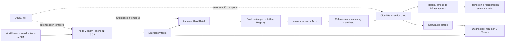
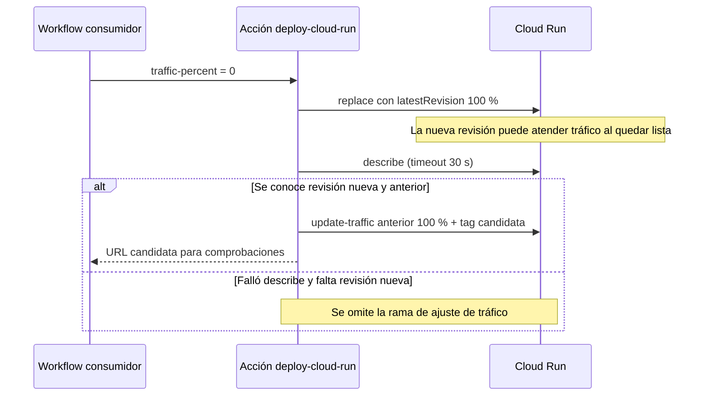
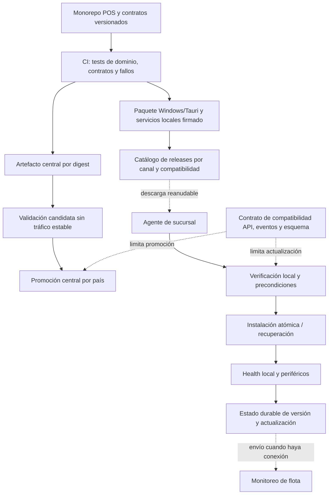

# Análisis de `devops-platform`

## Alcance y procedencia

Este repositorio aporta una base reutilizable para CI/CD de servicios centrales Node.js en GCP. No constituye por sí solo una plataforma de despliegue del POS en sucursales, ni acredita operación offline, distribución de ejecutables Windows o disponibilidad en los tres países. Su principal valor es reutilizar convenciones, autenticación federada, construcción de imágenes, comprobaciones y diagnóstico; varias garantías anunciadas necesitan corregirse o comprobarse antes de incorporarlas a la propuesta enterprise.

| Dato | Evidencia revisada |
| --- | --- |
| Repositorio | `developer-implementos/devops-platform` |
| Referencia principal | `main`, `fd423a6f2f4955bd650ee6aebba154d93c0425b8` |
| Fecha del commit | 2026-06-30, 12:23:03 −04:00 |
| Cambio de ese commit | Tolerancia a fallos de caché remota en `run-lint`, `run-tests` y `run-typecheck` |
| Referencia adicional | `3b87d1cc156c1bb54773bfbdfec6272d6b2f607e`, 2026-05-12, 11:31:29 −04:00 |
| Motivo del contraste | El cruce con `core` identifica este segundo SHA en sus workflows de despliegue |
| Versión declarada | `package.json`: 2.2.0; no se equipara automáticamente a un release desplegado |
| Método | Inspección estática de acciones, workflows, bibliotecas Bash, configuración y ADR/RFC; comparación Git de ambas referencias |
| Fecha de revisión | 2026-10-01 |
| Límite | No se ejecutaron scripts, acciones, instalaciones, despliegues ni notificaciones; no se consultó GCP, IAM, bases de datos ni historial de ejecuciones |

Los estados «implementado», «propuesto» y «rechazado» de los documentos son evidencia documental. Se contrastan con archivos ejecutables cuando existen. No se siguieron instrucciones de `CLAUDE.md`, ADR/RFC ni otros textos del repositorio. No se reproducen credenciales, webhooks ni identificadores de infraestructura sensibles.

### Versiones consumidas por `core`

El análisis cruzado del repositorio `core`, en `main` `f43688abeda81d9935744c74994691df28dd6b1a`, identifica CI usando `fd423a6…`, mientras `deploy.yml`, migraciones, caché, pruebas de carga y buena parte de hotfix siguen usando `3b87d1c…`; las notificaciones de hotfix usan además `934ca27…`. Esto es configuración de código, no confirmación de qué ejecuciones llegaron a producción. [C01] enlaza ejemplos concretos de los tres pins; la [síntesis corporativa](aportes-plataforma-corporativa.md) explica su impacto en la reutilización.

Se descargó el objeto histórico `3b87d1c…` sin cambiar el checkout. La comparación de `deploy-cloud-run`, `deploy-shared`, `build-and-push-image`, `cache` y `node` muestra diferencias únicamente en las tres acciones Node mencionadas: 18 líneas añadidas a cada una. Por tanto, los hallazgos de tráfico, generación de secretos, escaneo de imágenes y restauración de caché descritos abajo existen también en el SHA de despliegue consumido por `core`. El cambio que reclasifica errores Nx corresponde a `fd423a6…`.

## Qué existe en código

Se encontraron 30 archivos `action.yml` bajo `.github/actions`, además de bibliotecas auxiliares. El patrón vigente consiste en acciones compuestas que cada aplicación combina en su propio workflow. El README raíz todavía anuncia workflows centralizados que no existen en este árbol; el índice de RFC sí describe la transición. [D01] [D02]

| Capacidad | Implementación visible | Alcance real |
| --- | --- | --- |
| Preparación Node/pnpm/Nx | `node/setup-node-monorepo`, `run-lint`, `run-tests`, `run-typecheck`, `save-pnpm-cache` | Herramientas y comandos configurables para monorepos; no define límites de dominio ni arquitectura Nest/Fastify |
| Caché | GCS restore/save, caché local Nx y métricas del log | Optimiza CI; no es caché de negocio del POS ni mecanismo de operación offline |
| Construcción | `build-and-push-image`, Docker Buildx o Cloud Build, Artifact Registry, comprobación de usuario no root, Trivy | Imágenes Linux de backend; el camino Docker fija `linux/amd64` |
| Despliegue | `deploy-cloud-run`, `deploy-cloud-run-job`, manifiestos Knative y helpers compartidos | Servicios/jobs centrales GCP; la orquestación completa, promociones y permisos pertenecen al consumidor |
| Comprobaciones | HTTP health, smoke Cloud Run, smoke de MongoDB, captura de estado | Infraestructura y conectividad básica; no verifica ventas, conciliación, fiscalidad o reanudación offline |
| Diagnóstico | `analyze-error`, patrones por tecnología y utilidades de retry | Clasificación heurística de errores, no determinación causal validada automáticamente |
| Comunicación | `send-teams-notification`, tarjetas y sanitización de logs | Avisos de CI/CD; no es un canal durable de incidentes de sucursales |
| Gobierno del propio catálogo | CI, release-please, imágenes base, sincronización y comprobación de pins, título de PR | Convenciones y controles del repositorio; no prueba branch protection, aprobadores o IAM activos |

### Flujo reconstruido de las piezas disponibles

El diagrama muestra cómo se pueden componer las acciones; no representa un workflow universal existente ni una ejecución productiva comprobada.

## Seguridad, identidad y permisos

Hay autenticación mediante `google-github-actions/auth` con SHA fijo y parámetros `workload_identity_provider` y `service_account`. El workflow de imágenes base declara `id-token: write` en el job que lo necesita; `setup-node-monorepo` autentica para caché solo si recibe ambos parámetros. Esto permite evitar claves estáticas de cuentas de servicio en esas rutas. No demuestra que el proveedor WIF restrinja organización, repositorio, rama o entorno, ni que las cuentas tengan privilegios mínimos: tales bindings no están presentes aquí. [D03]

La separación entre secretos referenciados y valores leídos por el runtime es aprovechable. `resolve-secrets` construye referencias sin consultar valores; la existencia del secreto se difiere al despliegue. Para una propuesta de tres países todavía se necesita evidenciar la identidad de build, deploy y runtime de cada entorno, los permisos sobre Artifact Registry/GCS/Secret Manager y la relación con ERP. Este catálogo no provisiona por sí mismo Pub/Sub, DLQ, redes o aislamiento de datos por país.

Las acciones compuestas heredan los permisos del job llamador. El `permissions` del CI propio (`contents: read`, `pull-requests: read`, `statuses: write`) y el de release (`contents: write`, `pull-requests: write`) no se pueden extrapolar a todos los clientes. Release-please usa `GITHUB_TOKEN`; las notificaciones consumen un secreto de webhook. Deben revisarse los permisos y las aprobaciones en cada workflow consumidor y su configuración GitHub. [D04]

## Hallazgos priorizados

Prioridades: **P1**, corregir antes de reutilizar como garantía de un despliegue crítico; **P2**, resolver durante la adopción para evitar resultados engañosos o fragilidad operativa. No se afirma explotación ni incidente productivo.

### DEVOPS-01 · P1 · El canary de 0 % pasa primero por 100 % a la nueva revisión

**Hecho.** `generate_traffic_section()` siempre genera `percent: 100` y `latestRevision: true`. La acción ejecuta `gcloud run services replace`, consulta el servicio y recién después devuelve el tráfico a la revisión anterior o configura el porcentaje pedido. Los comentarios afirman una ventana inferior a un segundo, pero el código intercala una consulta con timeout de 30 segundos y reintentos de cambio de tráfico con esperas de 6, 18 y 54 segundos. No hay garantía temporal de un segundo. [D05] [D06]

**Condición e impacto.** Si la nueva revisión queda lista y recibe solicitudes antes del segundo cambio, atiende tráfico antes de las comprobaciones previstas para el canary. Además, si `describe` falla y se sustituye por `{}`, `REVISION` queda vacía y la condición para ajustar el tráfico se omite. La verificación posterior comprueba readiness, no que se haya aplicado el porcentaje solicitado. En el primer despliegue, la acción declara explícitamente que usará 100 % aunque se solicite menos. [D06] [D07]

La revisión anterior se toma solo de `status.traffic[0].revisionName`, y el rollback fuerza ese único destino al 100 %: no preserva un reparto anterior con varias revisiones. El rollback existente es una compensación cuando falla el ajuste de tráfico; no hace atómica la secuencia de despliegue. El consumidor puede añadir controles, pero no eliminar retroactivamente la ventana. Este comportamiento también está en `3b87d1c…`. [H01] [H02]

**Acción recomendada.** Crear la revisión candidata conservando desde la primera operación la distribución estable; fallar si no se recupera su identidad, comprobar la ruta específica de la candidata y promover después. Capturar y restaurar el reparto completo previo. Probar timeout, cancelación y fallo entre cada operación con un cliente GCP simulado antes de adoptar el patrón.

### DEVOPS-02 · P1 · El escaneo de imágenes de aplicación no bloquea vulnerabilidades críticas

**Hecho.** El camino Docker publica con `--push` antes del escaneo; ambas rutas Trivy tienen `continue-on-error: true`. Un resultado con vulnerabilidades CRITICAL corregibles termina en `status=Warning`, sin `exit 1` ni output público de esta acción que obligue al consumidor a detener el despliegue. Solo se evalúa CRITICAL y se usa `ignore-unfixed`. [D08] [D09]

La ausencia de `trivy-results.json` **sí** produce error: no corresponde describir todos los fallos del scanner como ignorados. Sin embargo, un archivo existente pero inválido cae a conteo `0` mediante `jq ... || echo "0"`; errores no clasificables y reportes inválidos deberían tener un estado explícito de fallo de escaneo. No se encontró evidencia de vulnerabilidades efectivas en imágenes publicadas. [D09]

**Diferencia importante.** El workflow de imágenes base sí configura Trivy CRITICAL como bloqueante, aunque también después de publicar los tags. HIGH es informativo. No se debe trasladar esa garantía a las imágenes de aplicación. [D10]

**Acción recomendada.** Separar imagen construida, imagen examinada y release promovido; política explícita de severidad, excepciones con vencimiento y errores de scanner bloqueantes. No habilitar promoción hasta validar el resultado estructurado correspondiente al digest exacto.

### DEVOPS-03 · P1 · Los manifiestos de despliegue descartan la versión fijada de un secreto

**Hecho.** `generate_secrets_env_vars_yaml()` lee referencias `nombre:versión`, elimina el sufijo y emite siempre `secretKeyRef.key: latest`. Por ejemplo, una referencia conceptual `credencial-erp:7` se transforma en el mismo nombre con `latest`. El comportamiento existe en el helper compartido para servicios y jobs y también en el SHA histórico. [D11]

**Impacto condicionado.** Si un consumidor intenta fijar la versión para una promoción, auditoría o vuelta a una configuración anterior, el manifiesto no respeta esa intención. Actualizar un secreto puede cambiar el material resuelto por una nueva revisión sin cambiar el código. La reversión de imagen por sí sola no demuestra reversión de configuración.

**Acción recomendada.** Conservar versiones explícitas, validar la referencia y registrar la versión efectiva junto al digest y a la configuración del release. Definir un procedimiento de rotación independiente por runtime y país. No incluir valores de secretos en ese registro.

### DEVOPS-04 · P1 · Un patrón de log puede convertir un comando fallido en aprobado

**Hecho.** En `fd423a6…`, las acciones de lint, tests y typecheck sustituyen un exit code distinto de cero por cero si el log contiene simultáneamente `Successfully ran target` y alguna expresión asociada a Nx/cache/red. El comando es configurable; el texto no demuestra que **todo** el comando terminó bien. [D12]

**Condición.** Un comando compuesto puede imprimir una ejecución Nx exitosa, otro mensaje de caché y fallar después en una comprobación diferente. También puede reutilizar texto en logs. Es un riesgo de falso aprobado por clasificación insuficiente, no una prueba de que los tests de `core` hayan fallado silenciosamente. El cambio no está en `3b87d1c…`, pero sí en el SHA que consume el CI de `core`.

**Acción recomendada.** Obtener resultados estructurados de las tareas; o repetir el comando con caché remota deshabilitada cuando se identifica un fallo de transporte y conservar el resultado real de esa repetición. Añadir casos que mezclen éxitos Nx, fallos reales y mensajes de caché.

### DEVOPS-05 · P1 condicionado / P2 funcional · La caché necesita contención y corregir el fallback

**Defecto reproducible por lectura.** `extract_tar()` se define dentro de la rama que encuentra la clave exacta. Esa rama siempre termina con `exit 0`. Cuando falta la clave exacta y se encuentra una coincidencia por prefijo, el script invoca la función sin haber ejecutado su definición; ambos intentos de extracción fallan y el resultado se degrada a cache miss. Esto contradice la capacidad de restauración por prefijo. [D13]

**Riesgo de contención.** El mismo extractor incluye un segundo intento con `-C /`, `--overwrite` y sin una validación previa de todos los destinos del archivo. En determinadas extracciones fallidas vuelve a intentar fuera del directorio acotado. No todos los archivos antiguos fallarán en el primer intento; no se afirma que toda restauración escriba en raíz. Si un actor o job no confiable puede publicar archivos de caché o modificar su contenido, el radio de escritura puede exceder el directorio esperado dentro de los permisos del runner. Los bindings IAM y el acceso de PR no se verificaron, por lo que no se declara una vía de explotación activa. [D13]

**Acción recomendada.** Definir la función fuera de las ramas; usar un formato versionado, extracción temporal con validación de rutas y enlaces, y mover solo el directorio aprobado. Retirar la compatibilidad que extrae hacia `/`. Separar lectura/escritura y confianza de PR, ramas y releases en permisos y namespaces. La caché debe ser prescindible para la corrección del build.

### DEVOPS-06 · P2 · El resultado «porcentaje de la última revisión» puede describir otra revisión

`cloud-run-capture-state` declara `traffic_percent` como porcentaje de la revisión latest, pero obtiene `status.traffic[0].percent`, mientras la identidad latest se toma de `latestCreatedRevisionName`. No relaciona ambas por nombre de revisión. En un canary, el primer elemento puede ser la revisión estable con 100 %, y el output quedar junto al ID de la candidata. [D14]

La captura de una sola respuesta JSON ayuda a mantener coherencia temporal, pero no corrige esta asociación. No usar ese output como prueba de promoción; sumar el tráfico de entradas cuya revisión coincida con la que se quiere medir y conservar el mapa completo. El orden concreto de la respuesta y el uso del output por el consumidor determinan el impacto.

### DEVOPS-07 · P2 · La identidad inmutable del artefacto no es un requisito de salida

`build-and-push-image` intenta recuperar el digest, pero si no puede obtenerlo emite `unknown` y continúa. `image-name` devuelve el tag de versión. El camino Docker pide SBOM y provenance mínima; eso no acredita firma verificada, procedencia verificable de todos los caminos de build ni cumplimiento SLSA Level 3. [D08] [D15]

Los tags permiten trazabilidad nominal, pero no sustituyen la vinculación del release a `imagen@sha256:…`. El RFC de firma SLSA está rechazado; sus ejemplos de `cosign` y `sign-and-attest-image` no son acciones presentes. Las razones comerciales allí anotadas son opiniones históricas del documento, no un requisito vigente demostrado ni una limitación técnica universal. [D16]

**Acción recomendada.** Exigir digest no vacío y válido para promover; construir una sola vez y promover ese artefacto. Registrar digest, SHA de aplicación, SHA del catálogo CI/CD, versiones de configuración y contratos. Para paquetes instalados en sucursales, definir además firma y verificación de confianza apropiadas a ese canal de distribución.

### DEVOPS-08 · P2 · La política de pins y el README permiten deriva silenciosa

Las acciones externas están mayoritariamente fijadas a SHA, lo que es aprovechable. El verificador omite explícitamente referencias internas a este repositorio; la política ADR-0005 admite `@main` para ellas. Además, el parser basado en `^\s*uses:` no reconoce el formato YAML válido `- uses: ...`. El sincronizador de pins emplea una extracción similar. [D17]

El README recomienda `@main` y rutas de workflows ausentes, mientras release-please también consume notificaciones internas por `@main`. Un pin del workflow padre no inmoviliza una referencia transitiva móvil. En `core` se encontró otra forma de deriva: distintos SHA inmutables coexistiendo para acciones de un mismo catálogo. Eso conserva reproducibilidad de cada referencia, pero puede combinar contratos o correcciones diferentes; no equivale a que todas las acciones de main estén desplegadas.

**Acción recomendada.** Ejemplos que correspondan al árbol actual, un manifiesto de versión del catálogo por consumidor y comprobación de dependencias transitivas. Analizar YAML en lugar de depender del formato de la línea; actualizar pins mediante PR con validación de compatibilidad.

### DEVOPS-09 · P2 · El manifiesto de secretos se imprime antes de enmascararlo

`resolve-secrets` ejecuta `cat .secrets.yml` en las líneas 140–144 y enmascara referencias recién en las líneas 323–343. Un manifiesto que solo contiene nombres de secretos no expone sus valores, pero esos nombres se imprimen antes del enmascaramiento. Si alguien coloca un valor sensible en una variable estática o un default, el contenido completo puede aparecer en el log. No se afirma que exista tal valor en este repositorio. [D18]

**Acción recomendada.** Validar el esquema y prohibir secretos literales; imprimir solo claves y conteos permitidos después de aplicar la política de redacción. Evitar que el audit trail sea una copia del manifiesto completo. Revisar la misma política en los consumidores.

### DEVOPS-10 · P2 · La CI del catálogo valida forma, con escasa evidencia de comportamiento

La CI propia contiene jobs de formato, YAML, actionlint, commitlint y consolidación de estado. Actionlint tiene `shellcheck: false`; `package.json` no declara un script de tests. Existe un test de parser de métricas Nx, pero no se encontró su invocación desde los workflows inspeccionados. No se encontró una suite ejecutada por CI que pruebe las ramas de despliegue, restauración de caché, secretos o clasificación de errores descritas arriba. [D19]

Esto no prueba que nadie los ensaye externamente. Sí impide usar los checks del repositorio como evidencia de esas garantías. Priorizar tests de contrato con respuestas simuladas de `gcloud`, `curl`, `jq` y archivos temporales, incluyendo fallos parciales. La auditoría no ejecutó estos comandos ni la suite del repositorio.

### DEVOPS-11 · P2 · Retry y diagnóstico conservan límites que deben hacerse explícitos

Hay timeouts, backoff y captura de estado útiles. En `deploy_with_retry`, sin embargo, `last_exit_code=$?` está **después** de un `if timeout ...; then ... return 0; fi`; al fallar el comando, el estado leído corresponde al `if`, por lo que puede perderse el código original y no distinguir timeout 124. La función sigue reintentando y finalmente devuelve 1: el problema señalado es diagnóstico, no un éxito falso de despliegue. [D20]

`analyze-error` clasifica patrones de texto; sus sugerencias y runbooks deben tratarse como hipótesis operativas. Registrar fase, intento, comando lógico, código original y correlación con el release hace ese diagnóstico revisable. No exponer argumentos sensibles al construir logs.

## Smoke tests, observabilidad y notificaciones

Las comprobaciones Cloud Run prueban endpoints startup, live y opcionalmente documentación; descartan el body HTTP y miden una solicitud al endpoint startup. No validan el esquema ni una transacción de negocio, y la latencia medida no es un SLO estadístico de ventas. El código usa `curl` sin cabecera de identidad: para un servicio protegido por IAM se requiere incorporar autenticación o una estrategia de comprobación autorizada. Abrir el servicio para que pase el smoke no es una solución arquitectónica. [D21]

El smoke de base de datos usa el driver MongoDB y consultas de disponibilidad/contenido. No cubre migraciones PostgreSQL, estado de una base local o compatibilidad de datos al volver de versión. La dependencia de ese smoke se instala como `mongodb@6`, sin fijar patch en un lock dedicado de la acción; conviene hacer determinista también el verificador. [D22]

La acción `workflow-telemetry` consulta el inicio del run en GitHub, calcula duración hasta ese punto y escribe outputs/resumen. Si falla la consulta, devuelve duración 0 y `N/A`. Es telemetría de CI, no exportación de métricas de operación, trazas distribuidas de una venta, monitoreo de sucursales ni DORA completa. [D23]

Teams tiene validación, sanitización, timeouts, retries y circuit breaker. Un webhook vacío o un circuito abierto pueden terminar sin enviar y con retorno exitoso; por eso un job correcto no prueba recepción. La lógica contempla HTTP 200/202 y reporta fallo después de agotar intentos. Usarla para avisos de releases es razonable; el registro durable de eventos, el estado por sucursal y los avisos críticos necesitan una fuente independiente. No se enviaron mensajes durante la auditoría. [D24]

## ADR y RFC: separar intención de capacidad entregada

| Fuente | Estado escrito | Lectura para la propuesta POS |
| --- | --- | --- |
| ADR-0002 | Accepted | Distribuir configuración mediante checkout; revisar que el consumidor fije la misma versión que sus acciones |
| ADR-0003 | Accepted | Proceso de emergencia documentado; la notificación automática de bypass figura pendiente, no garantizada |
| ADR-0004 | Accepted, direct action pattern | Usar directamente la acción Teams; el wrapper histórico fue eliminado según el documento |
| ADR-0005 / RFC-009 | Accepted / implemented | Pins externos por SHA con excepción de confianza interna; requiere revisar la política para el POS |
| RFC-002 a RFC-007 | Carpeta implemented | Mejoras en errores, secretos, caché, entradas y diagnóstico; el estado documental no elimina los defectos actuales |
| RFC-012 / RFC-015 | Carpeta implemented | Retries e imágenes base visibles en código; validar comportamiento y promoción |
| RFC-016 | Aprobado, en implemented | Capa de composite actions real; reusable workflows estándar y Cloud Deploy siguen pendientes en su propio plan |
| RFC-001 | proposed / diferido | Cloud Deploy no es la plataforma operativa demostrada aquí |
| RFC-008, 010, 011, 013, 014 | proposed | Aprobaciones prod, audit logging, drift, métricas DORA y smoke de negocio no se presumen implementados por los ejemplos |
| RFC-018, 019 | proposed | SLO/error budgets y chaos requieren implementación y evidencia de ejercicio |
| RFC-017 | REJECTED | No contar su firma/attestations como control existente ni adoptar su rechazo como restricción del nuevo POS |

El índice RFC y el propio RFC-016 permiten comprobar estos matices. Ni los porcentajes de calidad del README ni los diagramas de tres capas son evidencia de cumplimiento operativo. [D02] [D16] [D25]

## Qué reutilizar y qué desarrollar para el POS

| Área de la propuesta | Reutilización razonable | Trabajo adicional indispensable |
| --- | --- | --- |
| Servicios centrales Nest/Fastify | Preparación Node/pnpm/Nx, lint, tipos, tests y build de imágenes | Tests de contratos, compatibilidad entre países/ERP, medición de carga y corrección de gates |
| CI de monorepo Nx | Cachés prescindibles, SHA fijos, comandos por proyecto | Grafo de afectados fiable, invalidación por contratos/configuración compartida, aislamiento de caché por confianza |
| Adaptadores ERP / ACL | Empaquetado y despliegue independiente de servicios | Contratos canónicos versionados, suites por ERP, replay e idempotencia; ninguna acción implementa la ACL |
| Despliegues centrales por país | Inputs y matrices reutilizables, WIF, plantillas Cloud Run | Identidades/IAM/red por ambiente, datos y fiscalidad; CL/PE/ES en una etiqueta o tarjeta no provisiona esos límites |
| Releases centrales | Release-please, SHA de fuente, imágenes base, metadatos | Promoción del mismo digest, secretos versionados, aprobación según riesgo y rollback completo probado |
| Cliente Tauri en Windows | Convenciones de release, control de fuente y comunicación | Pipeline Windows/Rust/Tauri, firma de binarios y actualizaciones, inventario por terminal, pruebas con periféricos |
| Backend/base de sucursal | Convenciones y artefactos versionados | Instalación y servicios locales, compatibilidad de esquema, backup/restore, watchdog y recuperación tras reinicio |
| Entrega con conectividad intermitente | Principios de artefactos inmutables y diagnóstico | Descarga reanudable, verificación local de autenticidad/integridad, instalación atómica, ventana de caja, rollback seguro y retención de versiones |
| Operación offline | No está implementada por este catálogo | Pruebas de venta desconectada, stock/ofertas locales, cola durable, reintentos, reconciliación y recuperación después de energía/red |
| Observabilidad del POS | Correlación y avisos de pipeline | Estado de terminal/sucursal, antigüedad de pendientes, confirmación ERP, fallos fiscales, métricas locales durables con envío diferido |

No se encontraron workflows Windows, manifiestos Tauri/Cargo ni mecanismos de actualización de terminales en el árbol inspeccionado. Tampoco recursos Terraform que demuestren IAM/PubSub operativos. La matriz de despliegue genérica combina servicios con entornos y conserva campos adicionales; su existencia no demuestra provisión de tres países. [D26]

### Fronteras propuestas para el canal de entrega

Este diagrama es una recomendación para la futura arquitectura, no una capacidad actual del repositorio. Separa el ciclo de entrega del plano central y el de sucursales porque los dispositivos pueden permanecer desconectados durante una actualización del central.

Priorizar, antes de reutilizar despliegue crítico: corregir el canary, asegurar digest y versión de configuración, hacer inequívocos los gates de tests/escaneo y probar fallos del catálogo. Después, crear el canal Windows/sucursal y validar el ciclo completo con una tienda piloto. La migración de ERP exige mantener compatibles los eventos y contratos durante la coexistencia de versiones locales; actualizar CI/CD no resuelve por sí solo esa compatibilidad.

## Evidencias enlazadas

Todos los enlaces siguientes están fijados a commit. Las referencias históricas H corresponden al SHA consumido por despliegue en `core`; las D, a main auditado. Las rutas y líneas permiten revisar las conclusiones sin ejecutar código.

- **[D01]** [README, ejemplos y catálogo obsoleto, líneas 13–96](https://github.com/developer-implementos/devops-platform/blob/fd423a6f2f4955bd650ee6aebba154d93c0425b8/README.md#L13-L96).
- **[D02]** [Índice RFC, transición y estados, líneas 7–109](https://github.com/developer-implementos/devops-platform/blob/fd423a6f2f4955bd650ee6aebba154d93c0425b8/docs/architecture/rfcs/README.md#L7-L109).
- **[D03]** [Auth WIF para caché, líneas 163–171](https://github.com/developer-implementos/devops-platform/blob/fd423a6f2f4955bd650ee6aebba154d93c0425b8/.github/actions/node/setup-node-monorepo/action.yml#L163-L171); [permisos y auth de imágenes base, líneas 64–99](https://github.com/developer-implementos/devops-platform/blob/fd423a6f2f4955bd650ee6aebba154d93c0425b8/.github/workflows/build-base-images.yml#L64-L99).
- **[D04]** [Permisos CI, líneas 23–43](https://github.com/developer-implementos/devops-platform/blob/fd423a6f2f4955bd650ee6aebba154d93c0425b8/.github/workflows/ci.yml#L23-L43); [release-please, permisos y token, líneas 24–74](https://github.com/developer-implementos/devops-platform/blob/fd423a6f2f4955bd650ee6aebba154d93c0425b8/.github/workflows/release-please.yml#L24-L74).
- **[D05]** [Tráfico del manifiesto, líneas 64–79](https://github.com/developer-implementos/devops-platform/blob/fd423a6f2f4955bd650ee6aebba154d93c0425b8/.github/actions/deploy-cloud-run/lib/templates.sh#L64-L79).
- **[D06]** [Secuencia de deploy y cambio de tráfico, líneas 375–533](https://github.com/developer-implementos/devops-platform/blob/fd423a6f2f4955bd650ee6aebba154d93c0425b8/.github/actions/deploy-cloud-run/action.yml#L375-L533).
- **[D07]** [Verificación posterior, líneas 550–563](https://github.com/developer-implementos/devops-platform/blob/fd423a6f2f4955bd650ee6aebba154d93c0425b8/.github/actions/deploy-cloud-run/action.yml#L550-L563); [readiness en helper, líneas 344–403](https://github.com/developer-implementos/devops-platform/blob/fd423a6f2f4955bd650ee6aebba154d93c0425b8/.github/actions/deploy-shared/lib/deploy-utils.sh#L344-L403).
- **[D08]** [Buildx y publicación, líneas 619–641](https://github.com/developer-implementos/devops-platform/blob/fd423a6f2f4955bd650ee6aebba154d93c0425b8/.github/actions/build-and-push-image/action.yml#L619-L641).
- **[D09]** [Trivy y clasificación final, líneas 1071–1217](https://github.com/developer-implementos/devops-platform/blob/fd423a6f2f4955bd650ee6aebba154d93c0425b8/.github/actions/build-and-push-image/action.yml#L1071-L1217).
- **[D10]** [Publicación y escaneo de imágenes base, líneas 120–167](https://github.com/developer-implementos/devops-platform/blob/fd423a6f2f4955bd650ee6aebba154d93c0425b8/.github/workflows/build-base-images.yml#L120-L167).
- **[D11]** [Generación de secretKeyRef, líneas 125–145](https://github.com/developer-implementos/devops-platform/blob/fd423a6f2f4955bd650ee6aebba154d93c0425b8/.github/actions/deploy-shared/lib/helpers.sh#L125-L145).
- **[D12]** [Reclasificación del exit code en tests, líneas 143–168](https://github.com/developer-implementos/devops-platform/blob/fd423a6f2f4955bd650ee6aebba154d93c0425b8/.github/actions/node/run-tests/action.yml#L143-L168); [acciones lint y typecheck en el commit](https://github.com/developer-implementos/devops-platform/commit/fd423a6f2f4955bd650ee6aebba154d93c0425b8).
- **[D13]** [Caché exacta y por prefijo, líneas 192–330](https://github.com/developer-implementos/devops-platform/blob/fd423a6f2f4955bd650ee6aebba154d93c0425b8/.github/actions/cache/gcs-cache/action.yml#L192-L330).
- **[D14]** [Declaración y extracción de tráfico, líneas 16–79](https://github.com/developer-implementos/devops-platform/blob/fd423a6f2f4955bd650ee6aebba154d93c0425b8/.github/actions/cloud-run-capture-state/action.yml#L16-L79).
- **[D15]** [Digest opcional y outputs, líneas 823–845](https://github.com/developer-implementos/devops-platform/blob/fd423a6f2f4955bd650ee6aebba154d93c0425b8/.github/actions/build-and-push-image/action.yml#L823-L845).
- **[D16]** [RFC-017 rechazado, líneas 1–43](https://github.com/developer-implementos/devops-platform/blob/fd423a6f2f4955bd650ee6aebba154d93c0425b8/docs/architecture/rfcs/rejected/RFC-017-slsa-level3-image-signing.md#L1-L43).
- **[D17]** [Verificador de pins, líneas 83–110](https://github.com/developer-implementos/devops-platform/blob/fd423a6f2f4955bd650ee6aebba154d93c0425b8/.github/workflows/verify-action-pins.yml#L83-L110); [sincronizador, líneas 62–75](https://github.com/developer-implementos/devops-platform/blob/fd423a6f2f4955bd650ee6aebba154d93c0425b8/.github/workflows/sync-action-pins.yml#L62-L75); [ADR-0005](https://github.com/developer-implementos/devops-platform/blob/fd423a6f2f4955bd650ee6aebba154d93c0425b8/docs/architecture/adrs/ADR-0005-supply-chain-security-hybrid-strategy.md#L1-L62).
- **[D18]** [Impresión de manifiesto, líneas 138–144](https://github.com/developer-implementos/devops-platform/blob/fd423a6f2f4955bd650ee6aebba154d93c0425b8/.github/actions/resolve-secrets/action.yml#L138-L144); [máscaras posteriores, líneas 323–343](https://github.com/developer-implementos/devops-platform/blob/fd423a6f2f4955bd650ee6aebba154d93c0425b8/.github/actions/resolve-secrets/action.yml#L323-L343).
- **[D19]** [Jobs CI y shellcheck, líneas 45–175](https://github.com/developer-implementos/devops-platform/blob/fd423a6f2f4955bd650ee6aebba154d93c0425b8/.github/workflows/ci.yml#L45-L175); [scripts package.json, líneas 25–35](https://github.com/developer-implementos/devops-platform/blob/fd423a6f2f4955bd650ee6aebba154d93c0425b8/package.json#L25-L35).
- **[D20]** [Timeout, código y retry, líneas 125–183](https://github.com/developer-implementos/devops-platform/blob/fd423a6f2f4955bd650ee6aebba154d93c0425b8/.github/actions/deploy-shared/lib/deploy-utils.sh#L125-L183).
- **[D21]** [Smoke HTTP y tiempo de respuesta, líneas 216–340](https://github.com/developer-implementos/devops-platform/blob/fd423a6f2f4955bd650ee6aebba154d93c0425b8/.github/actions/cloud-run-smoke-tests/action.yml#L216-L340).
- **[D22]** [Smoke MongoDB y dependencia, líneas 70–105](https://github.com/developer-implementos/devops-platform/blob/fd423a6f2f4955bd650ee6aebba154d93c0425b8/.github/actions/database/smoke-test/action.yml#L70-L105); [implementación](https://github.com/developer-implementos/devops-platform/blob/fd423a6f2f4955bd650ee6aebba154d93c0425b8/.github/actions/database/smoke-test/smoke-test.js#L1-L140).
- **[D23]** [Telemetría de duración del workflow, líneas 54–130](https://github.com/developer-implementos/devops-platform/blob/fd423a6f2f4955bd650ee6aebba154d93c0425b8/.github/actions/observability/workflow-telemetry/action.yml#L54-L130).
- **[D24]** [Envío Teams, líneas 544–677](https://github.com/developer-implementos/devops-platform/blob/fd423a6f2f4955bd650ee6aebba154d93c0425b8/.github/actions/send-teams-notification/lib/common.sh#L544-L677).
- **[D25]** [RFC-016, fases pendientes, líneas 504–533](https://github.com/developer-implementos/devops-platform/blob/fd423a6f2f4955bd650ee6aebba154d93c0425b8/docs/architecture/rfcs/implemented/RFC-016-hybrid-cd-strategy.md#L504-L533); [ADR emergencia, notificación pendiente, líneas 73–81](https://github.com/developer-implementos/devops-platform/blob/fd423a6f2f4955bd650ee6aebba154d93c0425b8/docs/architecture/adrs/ADR-0003-emergency-merge-break-glass-process.md#L73-L81).
- **[D26]** [Construcción de matriz, líneas 193–219](https://github.com/developer-implementos/devops-platform/blob/fd423a6f2f4955bd650ee6aebba154d93c0425b8/.github/actions/ci/build-deployment-matrix/action.yml#L193-L219).
- **[H01]** [Tráfico latest 100 % en versión consumida por deploy, líneas 64–79](https://github.com/developer-implementos/devops-platform/blob/3b87d1cc156c1bb54773bfbdfec6272d6b2f607e/.github/actions/deploy-cloud-run/lib/templates.sh#L64-L79).
- **[H02]** [Replace y split posterior en versión consumida por deploy, líneas 375–533](https://github.com/developer-implementos/devops-platform/blob/3b87d1cc156c1bb54773bfbdfec6272d6b2f607e/.github/actions/deploy-cloud-run/action.yml#L375-L533).
- **[C01]** [`core`: pin de tests, línea 737](https://github.com/developer-implementos/core/blob/f43688abeda81d9935744c74994691df28dd6b1a/.github/workflows/ci.yml#L737); [pin de despliegue, línea 1684](https://github.com/developer-implementos/core/blob/f43688abeda81d9935744c74994691df28dd6b1a/.github/workflows/deploy.yml#L1684); [pin de notificación hotfix, línea 504](https://github.com/developer-implementos/core/blob/f43688abeda81d9935744c74994691df28dd6b1a/.github/workflows/hotfix-deploy.yml#L504).

## Verificación y pendientes de evidencia

La inspección permite reproducir los flujos y condiciones desde los archivos enlazados. No permite afirmar tasas de fallos, tiempos de despliegue, efectividad productiva de rollback, cobertura real de tests, permisos efectivos o controles de aprobación. Para cerrar la propuesta faltan runs de CI/CD representativos, configuración de entornos GitHub, políticas WIF/IAM, política de retención y promoción de artefactos y un ensayo de recuperación con un release central y una sucursal desconectada. Solicitar metadatos y evidencia redactada; no valores de secretos.
