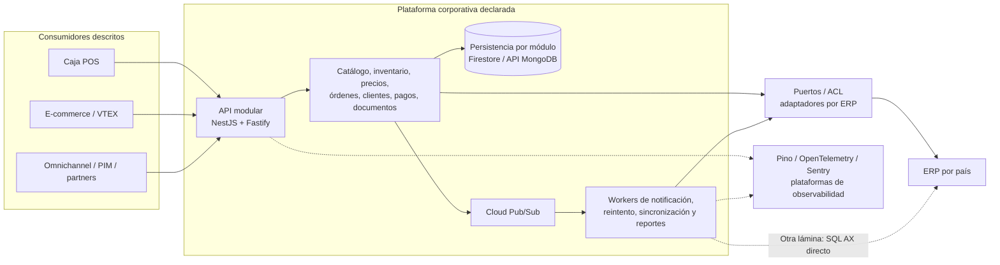
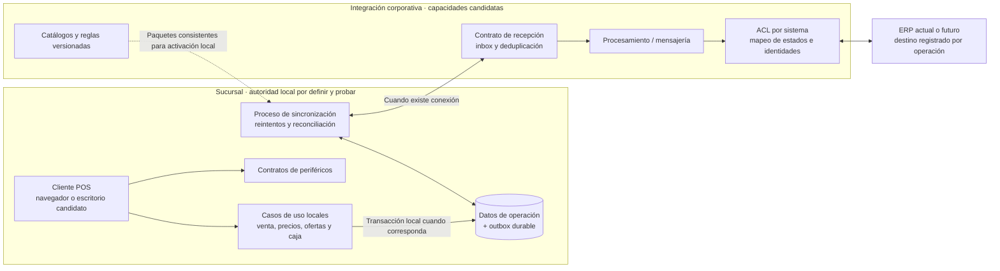

# Análisis de `integration-presentations`

## 1. Alcance y naturaleza de la evidencia

Revisión del **1 de octubre de 2026** del repositorio público `developer-implementos/integration-presentations`, rama **`main`**, commit **`f96fd2d810b528517af75acea048b339beb2c284`**, fechado **2026-04-06 19:16:04 -04:00**. Se inventariaron 141 archivos versionados: 25 Markdown en el repositorio, de los cuales 23 están en `presentations/`, 66 SVG y 28 scripts `.mjs`. Varias presentaciones son versiones alternativas del mismo contenido de arquitectura; no constituyen fuentes independientes que corroboren una afirmación.

Es **material de capacitación y exposición de una plataforma de integración**, con Reveal/Markdown, SVG, Mermaid, notas de presentador y generadores de diagramas. No es otra aplicación POS ni un repositorio de infraestructura productiva. Se leyeron los bloques de arquitectura, módulos, ACL, mensajería, resiliencia, seguridad, métricas, testing, CI/CD y sus notas, junto con los manifiestos y etiquetas de diagramas relevantes. No se renderizaron las presentaciones, pues esta revisión trata su contenido técnico, ni se ejecutaron scripts, servidores, generadores, comandos de instalación o despliegue.

Se aplicó la guía de lectura de la habilidad Presentations, sin alterar diapositivas. Comandos, prompts, reglas de contribución y notas del repositorio se trataron como contenido de la fuente, no como instrucciones del usuario. No se copian secretos, credenciales ni hosts internos.

Se distinguen tres niveles de evidencia:

| Nivel | Qué permite concluir |
| --- | --- |
| **Declarado en las presentaciones** | La fuente enseña o propone un patrón, muestra un ejemplo o afirma un resultado. No demuestra despliegue, cumplimiento ni funcionamiento real. |
| **Contrastado selectivamente con código** | Existe un mecanismo concreto en el snapshot de `core` o `devops-platform`; su alcance se limita al camino revisado. |
| **Aplicación propuesta al POS** | Criterio derivado de esta revisión para Chile, Perú y España; requiere decisiones y validaciones propias. |

El contraste usa `core` en **`f43688abeda81d9935744c74994691df28dd6b1a`**, del 8 de septiembre de 2026, y el análisis de `devops-platform` en **`fd423a6f2f4955bd650ee6aebba154d93c0425b8`**, del 30 de junio de 2026. Ambos son posteriores a estas presentaciones. Por ello, una diferencia puede reflejar evolución del proyecto: no debe trasladarse automáticamente un defecto del pseudocódigo de una lámina al código actual. Ninguno de estos snapshots acredita qué está instalado en producción.

## 2. Qué aporta al proyecto POS

El aporte principal es un **lenguaje arquitectónico y un conjunto de mecanismos reutilizables para integración central**: monolito modular, fachadas, puertos/adaptadores, aislamiento por país, workers, contratos de eventos y operación observable. La plataforma expone capacidades a varios canales, entre ellos caja, comercio electrónico, aplicaciones móviles y sistemas de gestión. El POS aparece como **consumidor de una API central**; no se desarrolla su autoridad local, su recuperación tras caída de sucursal ni su operación desconectada. [IP01], [IP02], [IP03].

| Conjunto documental | Contenido útil | Límite para nuestra propuesta |
| --- | --- | --- |
| `enterprise-architecture-overview` y variantes `enterprise-integration-platform*` | Visión corporativa, NestJS/Fastify, módulos, cinco capas, ERP, workers y GCP. | Mezclan estado declarado, arquitectura objetivo y ejemplos; varias rutas cambian entre láminas. |
| `clean-architecture`, `core-monorepo-overview` | Propiedad por módulo, entidades, casos de uso, repositorios, fachadas y wiring. | Cinco capas y un monorepo no prueban transacciones correctas ni independencia de un ERP. |
| `event-driven`, `resilience`, caso de notificaciones | Outbox, deduplicación, reintentos, DLQ y recuperación de operaciones atascadas. | Los ejemplos de notificación requieren adaptación y pruebas para dinero, inventario y DTE. |
| `security`, `observability`, patrones avanzados | Identidad humana/M2M, permisos, redacción, correlación, circuitos y cache. | Servicios de seguridad/telemetría centrales pueden convertirse en dependencias del camino offline. |
| `testing-patterns`, `cicd-pipeline`, workflow y desarrollo local | Pruebas unitarias, integración, E2E, Nx, convenciones y disciplina de entrega. | Una receta o porcentaje de cobertura no demuestra garantías ni ejecución exitosa. |
| `project-metrics`, `infrastructure-gcp` | SLI/SLO, carga, aislamiento de entornos, servicios gestionados y costos comparativos. | Cifras y costos no tienen evidencia adjunta suficiente para dimensionar o contratar el POS. |
| Manifiestos del propio repositorio | Build estático con Reveal, publicación prevista en Vercel y generación SVG. | Ese pipeline publica documentación; no es el pipeline de la plataforma de integración. |

Fuentes: [IP01]–[IP13]. Los cinco repositorios legacy ya auditados siguen siendo la evidencia del POS chileno recibido. Estas presentaciones no reemplazan la descripción de sucursal/backend/PostgreSQL/sincronizador/AX ni prueban que la plataforma nueva ya los haya sustituido.

### Modelo de arquitectura que declara la fuente

El siguiente Mermaid sintetiza el material; **no representa un despliegue verificado**. La fuente muestra caminos de ACL y también lectura SQL directa desde el worker, que se conservan como una diferencia a resolver.

## 3. Líneas de diseño aprovechables

### Módulos, cinco capas y fachadas

La fuente divide cada capacidad en **Domain, Application, Infrastructure, API y Config**. El dominio expresa reglas y valores; Application coordina casos de uso; Infrastructure implementa acceso a datos e integraciones; API valida/publica contratos; Config compone dependencias. La fachada concentra la interfaz pública del módulo y evita que un consumidor importe directamente su repositorio. [IP04].

La regla llamada `No Shared State` significa, en el diagrama, **propiedad de colecciones por módulo dentro de una base compartida**, con acceso mediante fachadas o eventos. No significa ausencia de persistencia ni impide una base local de sucursal. Aplicarla al POS ayudaría a evitar el acceso transversal observado desde la API de pagos y a los JSON del concentrador; su adopción necesita un plan de compatibilidad para los consumidores existentes. [IP02: 751–768], [api-pagos-caja](api-pagos-caja.md), [apis-implementos](apis-implementos.md).

Las convenciones de código, límites de imports y estructura del monorepo pueden servir como referencia. Debe acordarse la ubicación de los puertos: el overview los sitúa en Application, mientras la presentación Clean Architecture define el puerto de repositorio en Domain y prohíbe a Infrastructure importar Application. Ambas convenciones aparecen en la fuente; hay que elegir una coherente con los imports que se harán cumplir, sin convertir un ejemplo de carpeta en una regla universal. [IP02: 624–629], [IP04: 608–649].

### ACL, contexto de país y ERP futuro

Las láminas proponen adaptadores para Dynamics AX en Chile, un ERP custom en Perú y **Gira en España**. **El usuario confirmó Gira como ERP de España**; quedan pendientes su versión, interfaces y capacidades por operación. Esta confirmación identifica el sistema, pero no acredita la implementación del adaptador mostrado. [IP03: 759–844].

La selección de adaptador mediante configuración de despliegue es útil para aislar infraestructura y traducción. Para el POS, la clave debe contemplar además **ERP de origen/destino y cohorte de migración de cada operación**. Un solo `COUNTRY_CODE` global no resuelve, dentro de Chile, devoluciones de ventas históricas, pagos pendientes y operaciones nuevas que deban ir a ERPs diferentes durante el corte.

El material propone mover la ACL desde on-premise hacia Cloud Run con el ERP común. Es una posibilidad de despliegue; el usuario solamente informó una migración tentativa hacia un ERP compartido, sin confirmar producto, nube, número de instancias o cronograma. No se convierten esas opciones de las láminas en decisiones aprobadas. [IP03: 846–1009].

### Mensajería y workers

Es aprovechable la separación conceptual de API y workers, así como distinguir **fallo de entrega del broker**, **error funcional**, **reintento programado** y **recuperación manual**. El caso de notificaciones presenta `PENDING`, `PROCESSING`, `RETRY_SCHEDULED`, `SENT` y `PERMANENTLY_FAILED`, junto con dos niveles de retry. Para el POS deben existir estados con significado comercial propio, incluida la situación en que el ERP o adquirente pudo ejecutar y la respuesta se perdió. No hay equivalencia automática entre «notificación enviada» y «pago contabilizado». [IP05], [IP06].

Las láminas favorecen Cloud Pub/Sub para integración central. Esta decisión no cubre el enlace tienda-central durante una caída WAN: una sucursal desconectada necesita conservar localmente sus operaciones y trabajo pendiente. Un outbox ubicado solo en cloud no protege una venta que nunca pudo llegar a cloud.

### Seguridad, observabilidad y entrega

Pino estructurado, correlación, redacción, métricas y tracing aportan una base mejor que logs de consola sin contexto. El POS requiere correlación estable por operación, tienda, terminal y etapa de sincronización, además de métricas de antigüedad del backlog, frescura de precios y discrepancias de conciliación. Los logs y Sentry no reemplazan el registro durable ni la auditoría de cambios monetarios. [IP07], [IP08].

La fuente describe JWT/API keys, autorización, scopes y controles de acceso centrales. En el overview, la blacklist Redis es fail-closed; el material detallado también diferencia cache general de autenticación y rate limiting. Mantener esta protección central es razonable, pero su reutilización local exige diseñar la política de identidad y permisos offline, sin que la WAN sea necesaria para cada venta. [IP02: 1474–1523], [IP03: 1482–1494].

Testing, Nx affected, contratos tipados y convenciones de commits ayudan a controlar cambios. La propuesta POS debe agregar pruebas de reinicio, doble entrega, caja aislada, stock/NC concurrentes, resultado fiscal incierto, dispositivo desconectado y compatibilidad entre versiones. Las recetas unitarias o E2E web del material no cubren por sí solas esos escenarios. [IP09], [IP10].

## 4. Hallazgos sobre afirmaciones y ejemplos

Estos hallazgos priorizan **qué no se debe copiar sin validar**. No son incidentes detectados en producción ni vulnerabilidades demostradas en la implementación actual de `core`.

### IP-H01 · Alta · La afirmación «exactamente una vez» supera lo demostrado por el ejemplo

`event-driven.md` concluye «Exactamente-una-vez procesamiento» después de mostrar `wasProcessed(messageId)`, ejecución del efecto y `markProcessed(messageId)`, usando Redis con TTL predeterminado de 86.400 segundos. Dos consumidores podrían superar la consulta inicial, y una caída tras el efecto pero antes de la marca permitiría repetirlo. Tras caducar la marca, tampoco se conserva deduplicación histórica. [IP05: 319–418 y 487–492].

**Implicación:** no trasladar este ejemplo a cobros, reservas NC o creación de DTE como garantía monetaria. Se necesitan identidad de operación, control de concurrencia, durabilidad, deduplicación en el sistema que realiza el efecto y reconciliación para resultados inciertos.

**Contraste:** `core` posterior usa `setNx` antes del handler en `IdempotentHandlerService`, por lo que no es idéntico al ejemplo. También admite funcionar sin cache, y conserva un TTL. Este mecanismo debe evaluarse dentro del flujo completo; su presencia no acredita exactamente una vez ante cualquier fallo. [IC01], [core](core.md).

### IP-H02 · Alta · La explicación de outbox es valiosa, pero los snippets no demuestran atomicidad

El diagrama muestra entidad y evento dentro de una transacción. Sin embargo, `StockService.reserveStock()` llama primero a `repository.reserve()` y después a `saveAndPublish()`, sin mostrar contexto transaccional común. El comentario asegura que comparten transacción, pero el fragmento no permite verificarlo. También se promete publicación eventual mientras el procesador del ejemplo deja de reintentar y marca fallo después de un máximo. [IP05: 170–257 y 290–315].

**Implicación:** documentar la transacción y sesión exactas, la recuperación de fallos definitivos y los invariantes de negocio. Publicar y después marcar `PUBLISHED` puede repetir una publicación si se pierde la confirmación; el consumidor necesita contemplarlo.

**Contraste:** `core` expone `saveTransactional(options, transactionContext)`, que rechaza la ausencia de contexto, y separa una escritura simple. También hay un camino concreto de ingesta de factura que comparte `txCtx` entre proyección y outbox dentro de `transactionRunner.withTransaction`; el adaptador Mongoose usa `session.withTransaction`. Es evidencia de una mejora respecto de las láminas y de atomicidad local en ese camino, no prueba de que todos los productores de eventos utilicen la misma transacción. La revisión de [core](core.md) detalla los caminos concretos. [IC02], [IC05].

### IP-H03 · Alta · La promesa de migración ERP con cero cambios es un objetivo, no una garantía

El diagrama de migración muestra «0% cambios» para Integration API, Sync Worker y Firestore, y resume el trabajo como un adaptador y su traslado a Cloud Run. En otra sección se afirma que Sync Worker consulta SQL de AX directamente y no usa ACL. Ambas representaciones no describen una frontera completamente aislada. [IP03: 846–914 y 1248–1267].

**Implicación:** inventariar lecturas SQL, estados, formatos, IDs, fechas, consultas de históricos y reglas de precios antes de dimensionar la migración. La ACL puede reducir cambios en consumidores si el contrato permanece estable; no elimina diferencias semánticas entre ERPs ni los datos pendientes. La dependencia física ya observada en el POS chileno requiere una transición específica, no reemplazar una URL.

### IP-H04 · Alta · Soportar tres códigos de país no acredita tres implementaciones terminadas

La presentación enseña clases `DynamicsAxAdapter`, `CustomErpAdapter` y `GiraAdapter`, además de matrices CL/PE/ES e infraestructura aislada. Su roadmap califica multi-país como «en progreso», aunque otras diapositivas lo presentan como implementación. [IP03: 918–983], [IP02: 658–672 y 2144–2162].

**Contraste selectivo:** el módulo ERP del `sync-worker` de `core` registra Dynamics AX y Mock; el HTTP custom figura como implementación futura comentada. El mapper de tracking atiende CL y falla explícitamente para PE/ES no implementados. Son capacidades concretas, no prueba de ausencia total de funcionalidad peruana/española en todo el monorepo. [IC03], [IC04].

**Implicación:** construir una matriz país × capacidad × adaptador × evidencia de prueba. Validar identidad fiscal, monedas, impuestos, redondeo, pagos y documentos por operación. También verificar la infraestructura real: un cuadro que dice «residencia en región del país» no acredita ubicación efectiva ni cumplimiento.

### IP-H05 · Alta · Un monolito modular central no proporciona autonomía offline de la tienda

El material defiende llamadas en memoria frente a llamadas de red y muestra etiquetas como `100% Success` o «resiliencia máxima». Esta comparación solo describe la comunicación entre módulos de un proceso. El mismo diseño depende de DB, Redis, ERP, Pub/Sub y proveedores externos, y presenta a la caja como consumidor HTTP del hub. [IP11: 839–949], [IP03: 528–705].

**Implicación:** las ventajas de organización del monolito no permiten inferir disponibilidad de caja con WAN caída, servidor local caído o LAN desconectada. Tampoco un proceso único garantiza ACID entre bases y servicios distintos. Se debe elegir explícitamente dónde persisten venta, pago, reservas, catálogo y outbox, y qué autoridad conserva cada nodo desconectado.

### IP-H06 · Media · Reintentar o vencer un timeout no demuestra ausencia del efecto externo

El material enseña retry, backoff, circuit breaker y bulkhead. Algunos ejemplos aplican `handleAll`, y las notas describen el timeout como cancelación inmediata, sin mostrar propagación de cancelación al proveedor. Las mismas presentaciones sí distinguen errores reintentables y errores funcionales en el caso de notificaciones. [IP12: 215–280 y 374–449], [IP06: 169–246].

**Implicación:** definir política por operación. Un timeout de alta de venta, pago o DTE puede dejar resultado desconocido. Antes de repetir deben existir una clave de operación y una consulta/reconciliación adecuadas. El número de reintentos de Pub/Sub y el del worker pertenecen a capas diferentes; no sumarlos ni copiar intervalos de notificación al POS sin un presupuesto de tiempo y carga.

### IP-H07 · Media · Métricas, costos y rótulos de madurez carecen de evidencia para usarlos como garantías

`project-metrics.md` publica P50 ~15 ms, P99 ~80 ms, uptime 99,9%, cobertura por módulo de 65–80%, cantidades de archivos y tiempos de build/test. No identifica en esas tablas un periodo, entorno, carga, commit y artefacto de medición. El material de infraestructura incluye estimaciones económicas y comparaciones de latencia/soporte; el overview atribuye a Fastify «2x más rápido». [IP13: 29–90 y 222–239], [IP02: 2173–2179], [IP14: 1047–1154].

**Implicación:** conservarlas como cifras declaradas por la fuente. No convertirlas en capacidad observada, SLA, benchmark del POS, evidencia de cumplimiento ni presupuesto actual. Medir carga realista, p95/p99 por operación y comportamiento durante desconexión, incluyendo dependencias. Cobertura ejecutada y trazabilidad de casos son diferentes de un objetivo porcentual.

El roadmap también mezcla periodos 2025/Q1 2026 con notas de funciones terminadas y futuras. El estado de RFC/ADR debe verificarse en el repositorio responsable; sus números no son identificadores globales compartidos por `core` y `devops-platform`.

### IP-H08 · Media · Las recetas de operación necesitan contrastarse con los mecanismos reales

El overview describe un canary que despliega una revisión con 0% de tráfico, ejecuta validación y luego aumenta al 50/100%. La revisión de [devops-platform](devops-platform.md) identifica que su acción de despliegue actualmente envía primero tráfico a `latest` antes de ajustar la distribución. El diagrama no demuestra despliegue sin exposición inicial. [IP02: 1971–1994].

La presentación CI/CD enseña checks bloqueantes y SonarCloud; su presencia real depende de workflows consumidores, configuración del proveedor y protección de ramas. El repositorio de presentaciones contiene scripts para generar contenido, pero no una suite de calidad operacional de la plataforma. No se encontró un directorio `.github` versionado en este snapshot. [IP10], [IP15].

**Implicación:** obtener evidencia de ejecución y configuración de aprobación, rollback, artefactos y compatibilidad antes de adoptar estas garantías para el POS. Las políticas propuestas del repositorio DevOps y las capacidades implementadas se distinguen en su informe; no se infiere que un RFC propuesto ya esté activo.

### IP-H09 · Media · Cache, telemetría y controles centrales no sustituyen estado durable local

`advanced-patterns.md` describe write-through como «escritura atómica DB + Cache» y afirma que no hay inconsistencia; el esquema de invalidación publica por Redis después de actualizar stock. Sin una transacción o protocolo mostrado para ambos almacenes, esa frase no acredita atomicidad. El material de seguridad afirma redacción automática y el de observabilidad usa logs también para auditoría. [IP16: 34–63 y 215–238], [IP08: 401–477], [IP07: 516–522].

**Implicación:** validar pérdida/reordenamiento de invalidaciones, clave completa, versión/frescura y reconstrucción de cache. Para precios/ofertas offline se requiere un conjunto local consistente, no una entrada de cache que puede desaparecer. Para NC y pagos, preservar eventos de negocio y auditoría por separado de logs muestreados, buffer de Sentry o TTL Redis. Probar redacción real de RUT, tokens, cuerpos y errores antes de enviar telemetría fuera de la tienda.

## 5. Contraste resumido con los repositorios auditados

| Declaración documental | Evidencia o límite encontrado | Uso correcto en la propuesta |
| --- | --- | --- |
| NestJS/Fastify, monorepo y módulos | `core` contiene bootstrap Fastify, librerías y workers. Ver revisión detallada de [core](core.md). | Base técnica tangible para evaluar reutilización; no obliga a migrar todo Adonis a la vez. |
| `integration-api` y estructura presentada como real | El snapshot posterior de `core` usa `apps/core-api` y un inventario más amplio. | Fijar commit en diagramas y distinguir rutas históricas de actuales. |
| Outbox y deduplicación de ejemplos | `core` tiene APIs con contexto transaccional y adquisición atómica; las láminas son simplificadas. | Auditar productores/consumidores concretos y trasladar pruebas al POS. |
| Tres adaptadores ERP listos | Registro examinado de `sync-worker`: AX y Mock; HTTP futuro, tracking CL únicamente en ese módulo. | Matriz de completitud por capacidad/país, sin generalizar desde un enum. |
| Zero-change ERP migration | Slides también reconocen SQL AX directo; legacy contiene contratos `RecId/tablasAx` y consumidores de esquemas internos. | ACL con semántica estable y plan de coexistencia/históricos. |
| Canary y quality gates | El informe DevOps distingue implementación, propuestas y diferencias de despliegue. | Validar recorrido real de release y fallos de rollback. |
| Posibilidad de centralizar integraciones | El POS legacy persiste/sincroniza por sucursal y aún exige precio remoto. | Centralizar adaptadores y gobierno sin trasladar al cloud la autoridad necesaria para vender offline. |
| Windows/dispositivos | Estas presentaciones no desarrollan impresión local, MICR, Transbank ni Tauri. | Conservar los hallazgos de [impresión](api-impresion-caja.md) y validar periféricos por separado. |

## 6. Aplicación propuesta al POS offline

La hipótesis a evaluar es **reutilizar principios y capacidades centrales de la plataforma, conservando un núcleo de operación local con garantías propias**. No se propone copiar Firestore, Redis, Pub/Sub, todos los workers o toda la estructura del monorepo a cada tienda. Tampoco se selecciona aquí el runtime de escritorio.

Es un diagrama **propuesto para evaluación**, no una reconstrucción del código actual. Si el requisito incluye terminal aislado del servidor de sucursal, deben agregarse autoridad/persistencia de terminal y reglas de conflictos. Esa decisión no queda resuelta por el uso de NestJS, Tauri o Cloud Run.

### Criterios de adopción y pruebas necesarias

| Área | Prueba o decisión que debe habilitar la adopción |
| --- | --- |
| Autoridad y offline | Matriz WAN caída / LAN caída / servidor de sucursal caído; operaciones habilitadas, duración soportada, límites y recuperación. |
| Precios/ofertas | Dataset versionado y evaluación local con paridad de importes/reglas; activación atómica y comportamiento con datos vencidos. |
| Transacciones | Caída antes/después de guardar venta y outbox; ambos se conservan o se revierten de forma verificable según el caso de uso. |
| Duplicados | Mensaje repetido, consumidores concurrentes, replay posterior al TTL, reinicio durante efecto y republish con distinto ID de transporte. |
| Resultados inciertos | ERP, adquirente o facturador ejecuta pero se pierde respuesta; conciliación previa a reintentar y prohibición de cambiar destino por configuración global. |
| Multipaís | Casos CL/PE/ES por capacidad, moneda y entidad legal; país no soportado se detecta explícitamente. Obtener versión, interfaces y capacidades de Gira, confirmado por el usuario como ERP de España. |
| Observabilidad | Telemetría caída o WAN sin acceso: operación local y persistencia siguen dentro de límites; buffers acotados y sin datos sensibles. |
| Entrega | Nueva y antigua versión coexisten; rollback conserva datos y mensajes; demostrar reparto real de tráfico y criterios de promoción. |
| Evidencia de madurez | Resultados de pruebas y métricas vinculados a commit, entorno, carga y ventana; separar objetivo, configuración y resultado observado. |

La comparación inicial puede usar una capacidad acotada de consulta o un adaptador con datos sintéticos. Incorporar operaciones monetarias después de demostrar sus invariantes. La elección de herramientas debe apoyarse en esas pruebas, no en el rótulo «enterprise-grade» de una lámina.

## 7. Fuentes por commit

`integration-presentations` es público; los enlaces de contraste a `core` requieren acceso al repositorio privado. Los rangos se fijan al snapshot revisado para evitar que cambios de rama alteren la evidencia.

- **[IP01]** [README, 1–58](https://github.com/developer-implementos/integration-presentations/blob/f96fd2d810b528517af75acea048b339beb2c284/README.md#L1-L58) y [438–516](https://github.com/developer-implementos/integration-presentations/blob/f96fd2d810b528517af75acea048b339beb2c284/README.md#L438-L516): naturaleza formativa, catálogo, formato y estructura/build.
- **[IP02]** [enterprise-architecture-overview.md](https://github.com/developer-implementos/integration-presentations/blob/f96fd2d810b528517af75acea048b339beb2c284/presentations/architecture/enterprise-architecture-overview.md#L621-L768): país, módulos y propiedad. Otras secciones citadas: 903–947, 1474–1523, 1971–1994 y 2144–2183.
- **[IP03]** [enterprise-integration-platform-detailed.md, 483–1009](https://github.com/developer-implementos/integration-presentations/blob/f96fd2d810b528517af75acea048b339beb2c284/presentations/architecture/enterprise-integration-platform-detailed.md#L483-L1009): monorepo, contexto y ACL. Sync SQL directo: 1248–1267; Redis: 1482–1510; observabilidad: 2916–2960.
- **[IP04]** [clean-architecture.md, 268–375](https://github.com/developer-implementos/integration-presentations/blob/f96fd2d810b528517af75acea048b339beb2c284/presentations/architecture/clean-architecture.md#L268-L375) y [608–654](https://github.com/developer-implementos/integration-presentations/blob/f96fd2d810b528517af75acea048b339beb2c284/presentations/architecture/clean-architecture.md#L608-L654): orquestación, fachadas y puertos.
- **[IP05]** [event-driven.md, 135–492](https://github.com/developer-implementos/integration-presentations/blob/f96fd2d810b528517af75acea048b339beb2c284/presentations/resilience/event-driven.md#L135-L492): outbox, deduplicación, TTL, DLQ y garantías afirmadas.
- **[IP06]** [case-study-notifications.md, 130–246](https://github.com/developer-implementos/integration-presentations/blob/f96fd2d810b528517af75acea048b339beb2c284/presentations/deep-dives/case-study-notifications.md#L130-L246): fallos de aplicación/transporte. Recuperación: 328–440.
- **[IP07]** [observability.md, 451–538](https://github.com/developer-implementos/integration-presentations/blob/f96fd2d810b528517af75acea048b339beb2c284/presentations/resilience/observability.md#L451-L538): SLO, error budget y herramientas; son ejemplos/afirmaciones de fuente.
- **[IP08]** [security.md, 60–198](https://github.com/developer-implementos/integration-presentations/blob/f96fd2d810b528517af75acea048b339beb2c284/presentations/resilience/security.md#L60-L198) y [401–477](https://github.com/developer-implementos/integration-presentations/blob/f96fd2d810b528517af75acea048b339beb2c284/presentations/resilience/security.md#L401-L477): controles y redacción.
- **[IP09]** [testing-patterns.md, 367–600](https://github.com/developer-implementos/integration-presentations/blob/f96fd2d810b528517af75acea048b339beb2c284/presentations/architecture/testing-patterns.md#L367-L600): recetas de integración, HTTP y E2E.
- **[IP10]** [cicd-pipeline.md, 245–343](https://github.com/developer-implementos/integration-presentations/blob/f96fd2d810b528517af75acea048b339beb2c284/presentations/onboarding/cicd-pipeline.md#L245-L343): quality gates declarados.
- **[IP11]** [platform-architecture.md, 839–949](https://github.com/developer-implementos/integration-presentations/blob/f96fd2d810b528517af75acea048b339beb2c284/presentations/architecture/platform-architecture.md#L839-L949): comparación de red y etiquetas de fiabilidad.
- **[IP12]** [resilience.md, 215–280](https://github.com/developer-implementos/integration-presentations/blob/f96fd2d810b528517af75acea048b339beb2c284/presentations/resilience/resilience.md#L215-L280) y [374–449](https://github.com/developer-implementos/integration-presentations/blob/f96fd2d810b528517af75acea048b339beb2c284/presentations/resilience/resilience.md#L374-L449): timeout, retry y composición.
- **[IP13]** [project-metrics.md, 29–90](https://github.com/developer-implementos/integration-presentations/blob/f96fd2d810b528517af75acea048b339beb2c284/presentations/deep-dives/project-metrics.md#L29-L90) y [222–370](https://github.com/developer-implementos/integration-presentations/blob/f96fd2d810b528517af75acea048b339beb2c284/presentations/deep-dives/project-metrics.md#L222-L370): cifras, roadmap y madurez afirmada.
- **[IP14]** [infrastructure-gcp.md, 1047–1154](https://github.com/developer-implementos/integration-presentations/blob/f96fd2d810b528517af75acea048b339beb2c284/presentations/deep-dives/infrastructure-gcp.md#L1047-L1154): estimaciones económicas de la fuente, sin validar precios actuales.
- **[IP15]** [package.json, 1–22](https://github.com/developer-implementos/integration-presentations/blob/f96fd2d810b528517af75acea048b339beb2c284/package.json#L1-L22), [vercel.json](https://github.com/developer-implementos/integration-presentations/blob/f96fd2d810b528517af75acea048b339beb2c284/vercel.json) y [reveal-md.json](https://github.com/developer-implementos/integration-presentations/blob/f96fd2d810b528517af75acea048b339beb2c284/reveal-md.json): tooling de documentación, no plataforma productiva.
- **[IP16]** [advanced-patterns.md, 34–63](https://github.com/developer-implementos/integration-presentations/blob/f96fd2d810b528517af75acea048b339beb2c284/presentations/resilience/advanced-patterns.md#L34-L63) y [215–238](https://github.com/developer-implementos/integration-presentations/blob/f96fd2d810b528517af75acea048b339beb2c284/presentations/resilience/advanced-patterns.md#L215-L238): afirmaciones de cache e invalidación.
- **[IC01]** [core: idempotent-handler.service.ts, 25–78](https://github.com/developer-implementos/core/blob/f43688abeda81d9935744c74994691df28dd6b1a/libs/shared/backend/pubsub/src/lib/services/idempotent-handler.service.ts#L25-L78): adquisición y procesamiento actuales.
- **[IC02]** [core: outbox.service.ts, 92–145](https://github.com/developer-implementos/core/blob/f43688abeda81d9935744c74994691df28dd6b1a/libs/shared/backend/pubsub/src/lib/services/outbox.service.ts#L92-L145): contexto transaccional explícito.
- **[IC03]** [core: erp-adapters.module.ts, 140–200](https://github.com/developer-implementos/core/blob/f43688abeda81d9935744c74994691df28dd6b1a/apps/sync-worker/src/erp-adapters/erp-adapters.module.ts#L140-L200): registro de adaptadores y futuro HTTP.
- **[IC04]** [core: vtex-tracking-infrastructure.module.ts, 50–68](https://github.com/developer-implementos/core/blob/f43688abeda81d9935744c74994691df28dd6b1a/libs/vtex-tracking/infrastructure/src/lib/vtex-tracking-infrastructure.module.ts#L50-L68): capacidad de mapping de tracking por país.
- **[IC05]** [core: ingest-invoice.service.ts, 241–319](https://github.com/developer-implementos/core/blob/f43688abeda81d9935744c74994691df28dd6b1a/libs/vtex-invoices/application/src/lib/services/ingest-invoice.service.ts#L241-L319) y [mongoose-transaction-runner.adapter.ts, 50–78](https://github.com/developer-implementos/core/blob/f43688abeda81d9935744c74994691df28dd6b1a/libs/shared/backend/pubsub-mongoose/src/lib/adapters/mongoose-transaction-runner.adapter.ts#L50-L78): camino concreto con contexto transaccional compartido para proyección y outbox.

No se modificó el repositorio de presentaciones ni los repositorios usados para contraste. La revisión no certifica el render, la compilación de los ejemplos, las métricas declaradas ni el comportamiento productivo.
