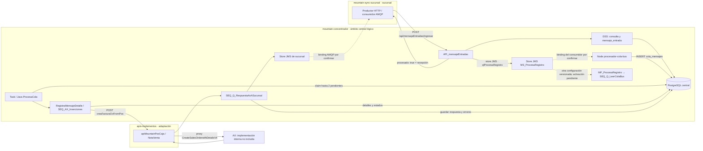

# Ingreso al concentrador y respuesta de AX

Revisión estática: **2026-10-02**. Alcance: subida desde sucursal, recepción y procesamiento central, adaptador .NET de ventas y devolución del resultado. No se ejecutaron aplicaciones corporativas ni se consultaron APIs o bases de datos.

## 1. Evidencia y límite de la reconstrucción

| Repositorio | Snapshot examinado | Qué acredita |
| --- | --- | --- |
| `mountain-concentrador` | `b2fd1ec266d131abb54b7076d41acce30f045119`, rama predeterminada `Pablo`, 2023-09-08 | Configuración Synapse/DSS, mediadores Java y consumidor Node versionados. No acredita despliegue. |
| `mountain-sync-sucursal` | `540ab9a70e7befbca27a2f7eb88b87b25109e4d1`, `master` | Productor HTTP y consumidor de respuestas de sucursal. Se leyó el commit, no el checkout de desarrollo. |
| `apis-implementos` | `8fbe2f1b4d4e464a403aa3daca63ffe712a9dd70` | Receptor .NET compatible y llamada al proxy AX. No incluye implementación interna de AX. |

El concentrador no tiene `main` en las referencias revisadas. `master` y `Pablo` divergen; no se combinaron como si fueran una única versión. Los archivos `CAR/PROD_*`, `CAR/QA_*`, `CAR/DESA_*` y los JAR son artefactos adicionales: sus nombres no demuestran instalación ni equivalencia con el código fuente. Este informe reconstruye **el código del snapshot**, con configuración de runtime pendiente.

**Hallazgo principal:** el repositorio permite reemplazar el antiguo bloque genérico «bus central» por componentes concretos. Todavía no permite afirmar una única ruta desplegada desde el broker: existe un consumidor Node que persiste en PostgreSQL y también un `SamplingProcessor` Synapse asociado al mismo message store. Debe confirmarse su activación y binding efectivos.

## 2. Recorrido normal documentado

Las flechas discontinuas señalan bindings o selección de runtime pendientes; no certifican una topología física. El broker, WSO2, Node, Java y PostgreSQL son responsabilidades lógicas: sus servidores, réplicas y ubicaciones no se infieren del dibujo.

### 2.1 Recepción HTTP y registro central

1. La sucursal usa `Axios.getESBIntance().post('mensajeEntradas/ingresar', data)`. El receptor declara `POST PUT /api/mensajeEntradas/ingresar` y extrae origen, destino, tipo y `mensaje_sucursal_id`. [S01, S02]
2. `SEQ_DSS_RegistraConsulta` llama al template de registro. `DSS_RegistroConsultas.op_insertRegistroConsulta` ejecuta `public.fn_crea_registro_consulta(...)`. Se verifica la invocación; la definición SQL de esa función no está incluida en los archivos fuente localizados. No se inventa su transacción interna. [S03]
3. `SEQ_DSS_MensajeEntrada` → `TP_DSS_MensajeEntrada` llama por SOAP 1.1 a `/services/DSS_MensajeEntrada`, operación `op_insertMensajeEntrada`. El DSS ejecuta `INSERT INTO public.mensaje_entrada(registro_consulta_id, fecha_creacion, mensaje) ... RETURNING *`. [S04]
4. Después crea un sobre XML y lo deposita en `MS_ProcesaRegistro`; el store JMS declara destino `qlProcesaRegistro` y `store.producer.guaranteed.delivery.enable=false`. La API responde con el identificador central y `procesado`, tomado de una propiedad fijada a `true`; en el JSON está entre comillas. **No es la aprobación de AX ni la aplicación del resultado en sucursal.** [S02, S05]
5. Son operaciones distintas: función/INSERT PostgreSQL, publicación JMS y respuesta HTTP. No se observa una transacción atómica que abarque las tres. El `faultSequence` construye un JSON de error; esta lectura no demuestra el código HTTP final de todos los fallos.

Además, el mismo recurso API declara `POST PUT /api/mensajeEntradas/test` y `/api/mensajeEntradas/ingresarClase`. La primera usa `es_prueba=1` pero conserva llamadas de registro/store; la segunda encola sin las dos llamadas DSS previas de `/ingresar`. No son endpoints de salud ni se sustituyen por la ruta normal. Se inventarían efectos si se asumiera que su nombre garantiza ausencia de escrituras. [S02]

### 2.2 Dos configuraciones de consumo que no deben mezclarse

| Configuración versionada | Comportamiento observado | Qué falta confirmar |
| --- | --- | --- |
| Node `procesador-cola-bus/start/queueHooks.js` | Consume la cola indicada por `ESB_BROKER_QUEUE`, decodifica XML y llama a `ColaMensajeService.crear`. El modelo usa `cola_mensajes` sin schema explícito. | Cola efectiva, datasource y `search_path`; que resuelva a la misma `public.cola_mensajes` leída por Java. |
| Java `Task_LeeMensajesCola` → `SEQ_ColaMensajes_Leer` → `ProcesaCola` | Declara `trigger count="0" interval="5"`; `leer-cambios` reclama hasta dos filas de `public.cola_mensajes`, por antigüedad, con `UPDATE ... SET en_proceso=true ... RETURNING *`. La secuencia itera los sobres y llama a `SEQ_Q_LeerColaBus`. | Activación real, significado/configuración efectiva del trigger en el runtime instalado, recuperación de filas interrumpidas y concurrencia. |
| `MP_ProcesaRegistro` | Declara `SamplingProcessor`, `MS_ProcesaRegistro`, secuencia `SEQ_Q_LeerColaBus`, `interval=1000`, `is.active=true`, `concurrency=1`. | Si está instalado/activo o reemplazado por Node; compatibilidad del sobre entregado y coexistencia de consumidores. |

El callback Node llama a `crear(...)` **sin `await`** y luego hace `ch.ack(msg)`; `crear` sí espera `ColaMensaje.create`. Por tanto, el ACK del broker no está condicionado a la finalización del INSERT en ese callback. Es una ventana de fallo verificable en código, no una afirmación de pérdida ocurrida. El cron Node elimina procesados correctos; **no es el proceso que registra ventas en AX**. [S06–S08]

### 2.3 Descomposición y envío a AX

`SEQ_Q_LeerColaBus` diferencia cambios cuyo origen es AX de mensajes de sucursal. Para estos últimos invoca `SEQ_ProcesaRegistroDetalle`. En el caso destino AX:

- `RegistraMensajeDetalle.mensajeEntrante` interpreta los detalles del sobre, busca duplicados y crea `mensaje_detalles`, `mensaje_cabeceras` y `mensaje_detalle_sucursales`. Los IDs centrales y el `mensaje_detalle_id` del JSON original son identidades distintas. [S09–S12]
- La búsqueda inicial de un detalle existente compara **ID de detalle de sucursal + nombre de entidad origen**; la consulta de respuesta existente también restringe tipo de mensaje y destino. Son consultas previas, no prueba de una restricción única ni de idempotencia concurrente de extremo a extremo.
- Si encuentra una relación existente con `procesado=true` y `error=false`, prepara una respuesta almacenada para la sucursal; en esa rama no llama nuevamente a AX. El mediador usa un `estaProcesado` global y un único `jsonBodySucursal` para el conjunto: conviene probar sobres con varios detalles y estados mezclados. [S09]
- En la rama normal, Synapse itera `mensajeDetalleSucursales` secuencialmente y usa `SEQ_AX_Inserciones`. El switch contiene once tipos: `clientes`, `direcciones`, `contactos`, `ventas`, `pago-factura`, `arqueos`, `sobrantes-faltantes`, `pago-abonos-cobranza`, `abono-anticipos`, `devoluciones` y `nota-de-credito`. El caso por defecto registra «tipo no soportado» y llama al endpoint auxiliar; no se acredita rechazo durable uniforme. [S10, S13]
- Para `ventas`, `SEQ_AX_Insert_ventas` conserva el ID de detalle de sucursal, extrae el DTO de `$.data` y hace `call blocking="true"` a `conf:repository/esb/endpoints/EP_Ventas.xml`. El archivo fuente `QARegistryResource/EP_Ventas.xml` declara **POST `/apiMountainPOS/api/caja/mountainpos/creaFacturaOvFromPos`**, timeout `120000` y `responseAction=fault`. El nombre de la carpeta QA no acredita el ambiente ni el binding efectivamente instalado. [S14, S25]

Las siguientes rutas están declaradas en los archivos `QARegistryResource/*.xml` referidos desde ese switch. El nombre QA identifica la carpeta versionada; no certifica el ambiente activo. Solo el receptor de **ventas** se cruzó aquí con .NET; el resto es inventario de configuración, no compatibilidad ni despliegue certificados. [S13; archivos y líneas en el JSON de evidencia]

| Tipo | Secuencia | Método y ruta configurados |
| --- | --- | --- |
| `clientes` | `SEQ_AX_Insert_clientes` | `POST /apiMountainPOS/api/cliente/mountainpos/nuevo` |
| `clientes` | `SEQ_AX_Insert_clientes` | `POST /apiMountainPOS/api/cliente/mountainpos/editar` |
| `direcciones` | `SEQ_AX_Insert_direcciones` | `POST /apiMountainPOS/api/cliente/mountainpos/editar/direccion` |
| `contactos` | `SEQ_AX_Insert_contactos` | `POST /apiMountainPOS/api/cliente/mountainpos/nuevo/contacto` |
| `contactos` | `SEQ_AX_Insert_contactos` | `POST /apiMountainPOS/api/cliente/mountainpos/editar/contacto` |
| `ventas` | `SEQ_AX_Insert_ventas` | `POST /apiMountainPOS/api/caja/mountainpos/creaFacturaOvFromPos` |
| `pago-factura` | `SEQ_AX_Insert_pago_factura` | `POST /apiMountainPOS/api/caja/mountainpos/pagoFactura` |
| `arqueos` | `SEQ_AX_Insert_arqueos` | `POST /apiMountainPOS/api/caja/mountainpos/arqueoCaja` |
| `sobrantes-faltantes` | `SEQ_AX_Insert_sobrantes_faltantes` | `POST /apiMountainPOS/api/caja/mountainpos/faltanteSobrante` |
| `pago-abonos-cobranza` | `SEQ_AX_Insert_pago_abonos_cobranza` | `POST /apiMountainPOS/api/caja/mountainpos/pagoFactura` |
| `abono-anticipos` | `SEQ_AX_Insert_abono_anticipos` | `POST /apiMountainPOS/api/caja/mountainpos/pagoFactura` |
| `devoluciones` | `SEQ_AX_Insert_devoluciones` | `POST /apiMountainPOS/api/caja/mountainpos/pagoFactura` |
| `nota-de-credito` | `SEQ_AX_Insert_nota_credito` | `POST /apiMountainPOS/api/caja/mountainpos/crearDte` |

El receptor compatible es `[HttpPost] api/caja/mountainpos/creaFacturaOvFromPos` en `apiMountainPosCaja/Controllers/CajaController.cs`. Invoca `NotaVenta.crearFacturarOvFromPos`, que construye `VentaContract` y llama al proxy `MountainPOSVentaOmniChannelServiceClient.CreateSalesOrderwithDetailsV4`. El prefijo `/apiMountainPOS` pertenece a la configuración de publicación; el binding y la versión realmente desplegados siguen pendientes. [S15, S16]

La respuesta .NET puede tener `error=false` en el envoltorio y errores dentro de `data.tablasAx`: el controlador no convierte automáticamente todo error de tabla en error superior. **El código AX que materializa las escrituras y sus transacciones no está en estos repositorios**; nombres como `CustInvoiceJour` son referencias de resultado, no una auditoría de INSERT internos de AX.

### 2.4 Resultado central y devolución a la sucursal

`SEQ_Q_RespuestaAxASucursal` conserva la respuesta JSON y llama primero a `actualizarCambioIngresadoAX`. El mediador marca el detalle de destino como procesado, guarda `data_respuesta`, actualiza contadores y extrae errores del envoltorio o de `data.tablasAx`. Si hay error se registra en `public.mensaje_detalle_sucursal_errores` y se activa el reintento; `procesado=true` por sí solo **no equivale a éxito**. [S17, S18]

Luego construye `axRespuesta`, `tipoMensaje`, `tipoMovimiento="entrada"`, `mensajeDetalleId` de sucursal, `error` y `errorMensaje`. `SEQ_OrquestaColaSucursal` elige un store JMS por nombre de entidad. El caso no soportado solamente registra un mensaje en esa secuencia; el binding de todas las sucursales requiere revisión. [S19]

En sucursal el consumidor AMQP vuelve a crear una fila de cola y hace ACK sin esperar esa promesa. El procesamiento posterior interpreta la respuesta y actualiza los datos de negocio y estados de sincronización; no ocurre en el ACK HTTP de ingreso. El detalle de transacciones locales y condiciones por `CustInvoiceJour`/`LedgerJournalTable` se conserva en [D02 del recorrido de datos](../recorridos-datos-tablas.md). [S20]

La emisión fiscal queda fuera de este recorrido de registro ERP. Registrar una venta en AX, emitir un DTE y aplicar la respuesta local son hitos separados.

## 3. Tablas, estados y fronteras de commit

| Objeto | Acceso comprobado | Límite que debe mostrarse |
| --- | --- | --- |
| `public.fn_crea_registro_consulta` | SELECT que invoca una función; DSS devuelve IDs de consulta, entidades y tipo. | Definición y transacción de la función pendientes. `registro_consultas`, `entidades`, `tipo_mensajes` también aparecen en JOIN Java, algunos sin schema. |
| `public.mensaje_entrada` | INSERT de sobre JSON y consulta a registros previos. | Recepción técnica; no tabla de ventas AX. |
| Node `cola_mensajes` / Java `public.cola_mensajes` | Node INSERT; Java claim con `en_proceso=true`; al finalizar `procesado=true, en_proceso=false`. | Coincidencia de instancia/schema pendiente. La selección Java no incluye `error=false`; no se observa en ese método un lease con vencimiento. |
| `public.mensaje_detalles` | Bulk INSERT no existente; UPDATE de datos y banderas; consulta por identidad de origen. | `bulkMensajeDetalle` hace commits intermedios y final; no engloba cabecera y relaciones. |
| `public.mensaje_cabeceras` | INSERT por destino y UPDATE incremental de totales. | Métodos con conexión propia; contadores no prueban confirmación contable. |
| `public.mensaje_detalle_sucursales` | Bulk INSERT; estado procesado/error/reintento; `data_respuesta`, `respuesta_procesada` y fechas. | En ingreso se pasa conexión externa `null`: bulk crea su transacción y commits propios. Resultado y publicación JMS no son un commit común. |
| `public.mensaje_detalle_sucursal_errores` | INSERT de respuesta/error; actualización de indicador `nuevo`. | No confundir con `mensaje_detalle_sucursales` plural ni con la cola de sucursal. |
| `public.errores` y funciones de reintento | Clasificación del error y consulta de candidatos. | Funciones SQL y triggers efectivos no auditados; intervalos reales no inferidos de comentarios. |

Los `BOConexion` revisados configuran `setAutoCommit(true)` al conectar. Los métodos bulk lo cambian temporalmente y hacen commits parciales. Los `catch` de varios BO registran excepciones sin relanzarlas; `mensajeEntrante` termina retornando `true` incluso tras capturarlas. No se observa una transacción global PostgreSQL→AX→JMS ni un rollback integral de ese recorrido. Esto obliga a comprobar recuperación de estados parciales, sin afirmar que ya produjo incidentes. [S09, S11, S12, S17]

## 4. Reintentos y consulta de resultado

- `POST PUT /api/mensajeEntradas/existente` llama a `mensajeEntradaExistente`. Si no hay `data_respuesta` utilizable, informa que no existe respuesta; ello **no prueba que AX no haya producido un efecto**. La sucursal tiene un cliente de esta ruta. [S01, S02, S21]
- `Task_ReintentaErrores` declara `interval="30"` e invoca `SEQ_Reintento`. El mediador pide errores elegibles y sus mensajes mediante `fn_get_errores_a_ejecutar(...)` y `fn_get_data_reintento_por_error(...)`; no se encontró la definición SQL para probar sus bloqueos, calendario o recuperación. [S22, S23]
- La secuencia reintenta hacia AX con `SEQ_AX_Inserciones`; para destino sucursal registra que esa variante aún no está disponible. `GET /api/reintentar` y `GET /api/reintentar/reintento-manual` disparan efectos; no deben presentarse como consultas de salud. El segundo acepta el ID de `mensaje_detalle_sucursales`. [S22, S24]
- El temporizador central no demuestra «cada venta se reintenta cada 30 segundos»: selección por errores y funciones SQL, disponibilidad de servicios y ejecución efectiva lo condicionan.

## 5. Riesgos verificables y pruebas necesarias

| Condición observada | Prueba útil antes de dar garantías |
| --- | --- |
| ACK AMQP sin esperar INSERT, central y sucursal | Interrumpir proceso entre ambas operaciones en entorno de pruebas y verificar custodia/reentrega. |
| Recepción PostgreSQL y publicación JMS separadas | Fallar el store después del INSERT; localizar sobre huérfano y demostrar recuperación sin duplicar efecto ERP. |
| Claim `en_proceso=true` con finalización posterior | Detener Java tras reclamar y antes/después de llamar AX; medir recuperación y concurrencia, sin usar timeout como prueba de «no ejecutado». |
| Respuesta AX y estados centrales se guardan con conexiones separadas | Fallar cada escritura y la publicación de respuesta; verificar lectura de resultado, contadores y reintento seguro. |
| Respuesta vacía tratada como ausencia; comprobación previa de duplicado | Cortar HTTP después del efecto AX y antes de recibir respuesta. Revisar deduplicación real en AX y concurrencia antes de reenviar. |
| Dos consumidores/configuraciones posibles y artefactos CAR/JAR | Comparar export sanitizado de runtime, checksums de artefactos y fuente. No habilitar ambos por deducción del repositorio. |
| Errores capturados y cuerpo completo en varios logs | Revisar propagación observable de fallos y política de datos; no copiar payloads de clientes a documentación o telemetría. |
| Mezcla de detalles nuevos y ya procesados en un sobre | Probar respuesta por detalle, sin omitir pendientes ni reenviar los ya confirmados. |

Pedir al equipo: versiones activas de ESB/DSS/JAR/Node/API; export de secuencias/tasks/stores sin secretos; correspondencia de `ESB_BROKER_QUEUE` con stores; schema/search_path de Node y Java; DDL de funciones, triggers e índices; recuperación de `en_proceso`; política ante timeout AX; contrato y evidencia de idempotencia del servicio AX; y una traza anonimizada con IDs correlacionados HTTP→cola→SQL→AX→sucursal.

## 6. Referencias de código

Los enlaces están fijados a commit; las líneas complementarias, nodos y conexiones están en [concentrador-ingress-evidence.json](../../tools/concentrador-ingress-evidence.json). No se incluyen orígenes privados ni credenciales.

- S01 [Cliente HTTP de sucursal, 289–363](https://github.com/developer-implementos/mountain-sync-sucursal/blob/540ab9a70e7befbca27a2f7eb88b87b25109e4d1/app/Services/LlamadaApis/CambiosConcentradorService.js#L289-L363).
- S02 [API de ingreso y consulta, 18–332](https://github.com/developer-implementos/mountain-concentrador/blob/b2fd1ec266d131abb54b7076d41acce30f045119/ESBImplementos/src/main/synapse-config/api/API_mensajeEntradas.xml#L18-L332).
- S03 [DSS de registro de consulta, 1–30](https://github.com/developer-implementos/mountain-concentrador/blob/b2fd1ec266d131abb54b7076d41acce30f045119/DSConcentrador/dataservice/DSS_RegistroConsultas.dbs#L1-L30).
- S04 [DSS de mensaje de entrada, 1–30](https://github.com/developer-implementos/mountain-concentrador/blob/b2fd1ec266d131abb54b7076d41acce30f045119/DSConcentrador/dataservice/DSS_MensajeEntrada.dbs#L1-L30).
- S05 [Store JMS de procesamiento, 1–9](https://github.com/developer-implementos/mountain-concentrador/blob/b2fd1ec266d131abb54b7076d41acce30f045119/ESBImplementos/src/main/synapse-config/message-stores/MS_ProcesaRegistro.xml#L1-L9).
- S06 [Consumidor Node y ACK, 30–60](https://github.com/developer-implementos/mountain-concentrador/blob/b2fd1ec266d131abb54b7076d41acce30f045119/procesador-cola-bus/start/queueHooks.js#L30-L60).
- S07 [Claim y finalización Java, 18–81](https://github.com/developer-implementos/mountain-concentrador/blob/b2fd1ec266d131abb54b7076d41acce30f045119/ClassProcesaCola/src/main/java/cl/implementos/BO/BOColaMensaje.java#L18-L81).
- S08 [SamplingProcessor alternativo, 1–7](https://github.com/developer-implementos/mountain-concentrador/blob/b2fd1ec266d131abb54b7076d41acce30f045119/ESBImplementos/src/main/synapse-config/message-processors/MP_ProcesaRegistro.xml#L1-L7).
- S09 [Mediador de ingreso, 353–497](https://github.com/developer-implementos/mountain-concentrador/blob/b2fd1ec266d131abb54b7076d41acce30f045119/ClassRegistraMensajeDetalle/src/main/java/cl/implementos/RegistraMensajeDetalle.java#L353-L497).
- S10 [Orquestación de detalles, 45–147](https://github.com/developer-implementos/mountain-concentrador/blob/b2fd1ec266d131abb54b7076d41acce30f045119/ESBImplementos/src/main/synapse-config/sequences/SEQ_ProcesaRegistroDetalle.xml#L45-L147).
- S11 [Detalles: INSERT, commits y búsquedas, 133–416](https://github.com/developer-implementos/mountain-concentrador/blob/b2fd1ec266d131abb54b7076d41acce30f045119/ClassRegistraMensajeDetalle/src/main/java/cl/implementos/BO/BOMensajeDetalle.java#L133-L416).
- S12 [Relación por destino: commits y estado, 59–158](https://github.com/developer-implementos/mountain-concentrador/blob/b2fd1ec266d131abb54b7076d41acce30f045119/ClassRegistraMensajeDetalle/src/main/java/cl/implementos/BO/BOMensajeDetalleSucursal.java#L59-L158).
- S13 [Switch de tipos hacia AX, 1–52](https://github.com/developer-implementos/mountain-concentrador/blob/b2fd1ec266d131abb54b7076d41acce30f045119/ESBImplementos/src/main/synapse-config/sequences/SEQ_AX_Inserciones.xml#L1-L52).
- S14 [Llamada de venta, 1–33](https://github.com/developer-implementos/mountain-concentrador/blob/b2fd1ec266d131abb54b7076d41acce30f045119/ESBImplementos/src/main/synapse-config/sequences/SEQ_AX_Insert_ventas.xml#L1-L33).
- S15 [Receptor .NET, 24–49](https://github.com/developer-implementos/apis-implementos/blob/8fbe2f1b4d4e464a403aa3daca63ffe712a9dd70/apiMountainPosCaja/Controllers/CajaController.cs#L24-L49).
- S16 [Adaptación de venta y llamada AX, 46–245](https://github.com/developer-implementos/apis-implementos/blob/8fbe2f1b4d4e464a403aa3daca63ffe712a9dd70/ServiciosAX/mountainPosCajaServices/NotaVenta.cs#L46-L245).
- S17 [Persistencia del resultado AX, 763–861](https://github.com/developer-implementos/mountain-concentrador/blob/b2fd1ec266d131abb54b7076d41acce30f045119/ClassRegistraMensajeDetalle/src/main/java/cl/implementos/RegistraMensajeDetalle.java#L763-L861).
- S18 [Interpretación y registro de errores, 26–146](https://github.com/developer-implementos/mountain-concentrador/blob/b2fd1ec266d131abb54b7076d41acce30f045119/ClassRegistraMensajeDetalle/src/main/java/cl/implementos/BO/BOMensajeDetalleSucursalErrores.java#L26-L146).
- S19 [Respuesta a sucursal, 1–44](https://github.com/developer-implementos/mountain-concentrador/blob/b2fd1ec266d131abb54b7076d41acce30f045119/ESBImplementos/src/main/synapse-config/sequences/SEQ_Q_RespuestaAxASucursal.xml#L1-L44).
- S20 [Recepción AMQP de sucursal, 36–76](https://github.com/developer-implementos/mountain-sync-sucursal/blob/540ab9a70e7befbca27a2f7eb88b87b25109e4d1/start/queueHooks.js#L36-L76).
- S21 [Consulta de respuesta existente, 914–960](https://github.com/developer-implementos/mountain-concentrador/blob/b2fd1ec266d131abb54b7076d41acce30f045119/ClassRegistraMensajeDetalle/src/main/java/cl/implementos/RegistraMensajeDetalle.java#L914-L960).
- S22 [Secuencia de reintento, 1–69](https://github.com/developer-implementos/mountain-concentrador/blob/b2fd1ec266d131abb54b7076d41acce30f045119/ESBImplementos/src/main/synapse-config/sequences/SEQ_Reintento.xml#L1-L69).
- S23 [Selección mediante función SQL, 214–282](https://github.com/developer-implementos/mountain-concentrador/blob/b2fd1ec266d131abb54b7076d41acce30f045119/ClassRegistraMensajeDetalle/src/main/java/cl/implementos/BO/BOMensajeDetalleSucursal.java#L214-L282).
- S24 [API de reintento con efectos, 14–56](https://github.com/developer-implementos/mountain-concentrador/blob/b2fd1ec266d131abb54b7076d41acce30f045119/ESBImplementos/src/main/synapse-config/api/API_reintentar.xml#L14-L56).
- S25 [Archivo QARegistryResource: endpoint de ventas, 1–18](https://github.com/developer-implementos/mountain-concentrador/blob/b2fd1ec266d131abb54b7076d41acce30f045119/QARegistryResource/EP_Ventas.xml#L1-L18).
