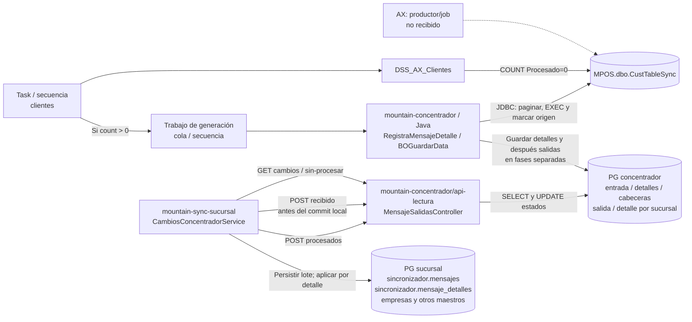

# Mountain concentrador: maestros, MPOS y contrato de lectura

Revisión estática del **2 de octubre de 2026**. Snapshot de `mountain-concentrador`: rama predeterminada informada `Pablo`, commit **`b2fd1ec266d131abb54b7076d41acce30f045119`**, del **8 de septiembre de 2023**. Checkout detached; no se interpretó el nombre de rama como producción. No hay `main` entre las referencias informadas; `master` apunta a `03ab8598b92b4f2dcad8c79861cc2e0036901b35` del 14 de agosto de 2023. El contraste de sucursal usa exclusivamente objetos Git de `mountain-sync-sucursal` **`540ab9a70e7befbca27a2f7eb88b87b25109e4d1`**, aunque su checkout local esté en otra rama.

No se ejecutaron aplicaciones, CAR/JAR, scripts corporativos ni consultas a servicios o bases. Se leyeron fuentes y XML incluidos en archivos CAR como ZIP. Nombres de carpetas PROD/QA/DESA no acreditan instalación. No se publican hosts, IP privadas, credenciales ni valores de conexión.

## Qué cambia con esta evidencia

**MPOS ya está respaldado por código**, como nombre de base SQL usado por Java. `BOAX` fija `MPOS`, el adaptador de clientes configura `CustTableSync` y ejecuta `MPOS.dbo.sp_caja_custTable`. Esto aclara el consumidor central; no identifica quién llena MPOS desde AX, si usa jobs diarios ni si ambas bases comparten servidor. [MC01–MC02]

**La API de lectura deja de ser solo un consumidor conocido.** Este repositorio contiene sus cuatro receptores y consultas PostgreSQL. `sin-procesar` permite recuperar el lote enviado que siga sin procesar **aunque tenga recibido_sucursal=true**. Por tanto, el ACK temprano observado en sucursal crea una ventana sin custodia local, pero no basta para afirmar pérdida definitiva. [MC10–MC13, MC15–MC17]

**No todo el contenido viaja a través de DSS.** En el recorrido de clientes, DSS cuenta pendientes; la secuencia encola trabajo, el mediador Java consulta SQL Server directamente mediante JDBC, genera lotes PostgreSQL y luego API lectura los entrega por HTTP. Reemplazar el broker sin conservar estas funciones no sustituye el concentrador. [MC03–MC09]

## Recorrido observado: cliente como ejemplo de maestro

La flecha AX→MPOS permanece discontinua: el productor no se recibió. El cilindro PostgreSQL central resume tablas de una base lógica; no implica un commit único con MPOS. El aviso AMQP y el polling HTTP son mecanismos complementarios; un aviso no transporta por sí solo todos los datos del maestro ni acredita su aplicación. [MC01–MC09, MC15–MC19, MC23]

1. `Task_SincronizaClientes` inyecta la secuencia que llama al template DSS con acción `count`. Si el resultado supera cero, registra consulta y encola el trabajo. El endpoint fuente declara SOAP 1.1 y path **`/services/DSS_AX_Clientes?wsdl`**, con acción **`urn:opGetCountClientesAX`**; se conserva el path literal, sin afirmar que sea el binding desplegado. [MC03–MC04]
2. `SEQ_Q_LeerColaBus` configura tamaño de página y lote, llama al mediador con `procesarCambiosAX` y después envía aviso hacia la entidad/sucursal. El código fuente incluye almacenamiento JMS con factoría Andes y un SamplingProcessor; su estado operativo requiere el artefacto/configuración instalados. [MC05–MC06, MC23]
3. Para clientes, Java transforma filas del SP en JSON, conserva `RefRecId` como identidad externa y genera identificadores de mensaje/detalle/destino. La envoltura de cada detalle contiene `id_externo`, `mensaje_detalle_sucursal_id`, `mensaje_cabecera_id`, `mensaje_detalle_id` y `data`. Cajas, empleados y precios tienen una rama de división por sucursal; no se generaliza el broadcast de clientes a todos los tipos. [MC02, MC06–MC07]
4. Se guardan detalles centrales, se intenta marcar el origen como procesado y **después** se insertan cabeceras y salidas por entidad. Hay commits separados; la escritura de salida y sus detalles de destino comparte una conexión por lote, pero no abarca todas las tablas ni SQL Server. Algunos helpers registran la excepción sin propagarla. [MC07–MC09]
5. La sucursal obtiene el lote, notifica `recibido`, crea mensaje/detalles locales y aplica cada maestro dentro de su transacción por detalle. Finalmente envía resultados a `procesados`. Fallar una notificación central no equivale a revertir la aplicación local. [MC15–MC18]

## Datos concretos y alcance del esquema

| Objeto | Papel observado | Certeza del nombre/esquema |
| --- | --- | --- |
| `MPOS.dbo.CustTableSync` | Estado de cambios de clientes; Java pagina y cambia `Procesado`. | Base/esquema construidos explícitamente por Java. DSS usa `CustTableSync` sin calificar: la base efectiva de su datasource debe contrastarse. [MC01–MC03] |
| `MPOS.dbo.LogisticsPostalAddressSync` | Cambios de direcciones. | Tabla configurada en `BODireccion`; hereda la construcción SQL con `MPOS.dbo`. [MC01–MC02] |
| `MPOS.dbo.LogisticsElectronicAddressSync` | Cambios de contactos. | Tabla configurada en `BOContacto`; hereda la construcción SQL con `MPOS.dbo`. [MC01–MC02] |
| `sp_caja_custTable`, `sp_caja_logisticsPostalAddress`, `sp_caja_cliente_logisticsElectronicAddress` | Producen los resultados que los adaptadores convierten a mensajes. | Se verifica la llamada/nombre, no el cuerpo SQL, tablas internas o reglas del SP. [MC02–MC03] |
| `public.mensaje_entrada`, `public.mensaje_detalles` | Custodia del payload central y detalles reutilizados por destino. | SQL Java califica `public`; no son las tablas `sincronizador.*` de sucursal. [MC08–MC09] |
| `public.mensaje_cabeceras` | Agrupación por entidad y contadores. | INSERT Java con nombre explícito; API lectura actualiza mediante modelo. [MC09, MC14] |
| `public.mensaje_salida` | Página JSON para una entidad/tipo, con estados de envío/recepción/proceso. | Java califica `public`; el modelo Node declara `mensaje_salida` sin schema. [MC08, MC10–MC14] |
| `public.mensaje_detalle_sucursales` | Vínculos entre detalle, cabecera, salida y destino; resultado/error del detalle. | Java califica `public`; UPDATE de API lectura no califica schema. [MC08, MC14] |
| `entidades`, `tipo_mensajes`, `registro_consultas` | Resolver destino/tipo y registrar consulta. | Se observan consultas y función `public.fn_get_entidades`; su cuerpo/DDL no fue recibido como definición SQL revisada. [MC09, MC11–MC12] |
| `sincronizador.mensajes`, `sincronizador.mensaje_detalles` | Custodia local del lote y de la envoltura central. | Nombres de modelos explícitos en el snapshot del sync. [MC17] |
| `empresas` | INSERT/UPDATE local del maestro cliente, entre otras entidades relacionadas. | SQL del sync sin schema; no anteponer `public.` por conveniencia. No es una operación de stock. [MC18] |

Los tres niveles son distintos: **MPOS como origen de intercambio**, **PG central como distribución/seguimiento**, **PG sucursal como custodia y aplicación local**. El nombre `Procesado` no tiene el mismo significado en ellos.

## Calendarios y variantes: no son «una sincronización diaria»

En el XML fuente, clientes declara `interval="10"`, contactos `20` y direcciones `25`; otras tareas tienen intervalos distintos. Los de precios y atributos incluyen además `count="0"`; bodegas y sucursales declaran `once="true"`. Las tareas cuentan pendientes: sin datos elegibles no necesariamente generan nuevos lotes. Los atributos se registran como configuración fuente, no como jobs efectivos. [MC04, MC24]

La documentación oficial de Scheduled Tasks expresa `interval` en segundos. Es una referencia de sintaxis; **no acredita la versión instalada ni la interpretación efectiva de `count=0` en el sistema recibido**. Consulta: 2 de octubre de 2026. [WSO2: Scheduled Task Properties](https://apim.docs.wso2.com/en/4.2.0/reference/synapse-properties/scheduled-task-properties/).

| Variante leída como archivo | Ejemplo comprobado | Límite |
| --- | --- | --- |
| Fuente `Task_SincronizaClientes.xml` | `interval=10`, sin `count`. | No equivale al binario/configuración desplegados. [MC04] |
| `PROD_E_Task_1.0.0.car` | Las 12 tareas de maestros incluidas llevan `count=0`; clientes mantiene `interval=10`. | Etiqueta PROD no prueba instalación ni actividad. XML leído como entrada ZIP, sin ejecutar. [MC21] |
| `QA_E_Task_1.0.6.car` | Clientes `interval=10`, sin `count`; artículos/atributos tienen `count=0`. | Hay diferencias respecto de PROD y de la fuente. [MC22] |
| `DESA_E_Task_1.0.3.car` | Clientes `interval=10`, sin `count`; precios `interval=60`, sin `count`. | No sustituir esta configuración por la de otro ambiente. [MC22] |
| Sync master `540ab9…` | Cron `*/3 * * * *`, ventana local, lock 3001, reenvíos previos y flag `CRON_BUSCAR_CAMBIOS`; tres segundos entre tipos. | Es descarga de sucursal, no generación AX→MPOS. No garantiza que termine en tres minutos. [MC19] |

`SEQ_Q_LeerColaBus` declara página general de **3000 filas** y salida de **100 detalles**; contactos usa página 500, precios página 10000/salida 200 y precios-todos página 15000/salida 500. El método Java tiene defaults 1000/100, pero toma las propiedades de contexto cuando llegan. No usar los defaults Java como tamaño efectivo de esta secuencia ni confundir página SQL con página entregada a una sucursal. [MC05–MC06]

**Sigue pendiente:** job, trigger o código AX que crea las filas MPOS; frecuencia de ese productor; versión/hashes CAR/JAR/API instalados; cambios manuales del scheduler; base asociada al datasource DSS; ubicación y co-ubicación física. Una consulta cada diez segundos de una tabla alimentada por otro proceso no demuestra cómo ni cuándo se alimenta.

## Contrato HTTP que coincide con el sync revisado

Rutas relativas del receptor Node. Los prefijos/proxy y hosts efectivos no se reconstruyen desde la coincidencia de paths. [MC10, MC16]

| Ruta | Petición y efecto | Qué confirma / qué no confirma |
| --- | --- | --- |
| GET `/mensajeSalidas/cambios` | Query `nombreEntidad,tipoMensaje`. Cuenta pendientes, selecciona el más antiguo no enviado, crea registro de consulta y marca `enviado=true` antes del commit/respuesta. | La selección central no demuestra que el cliente recibió el payload. GET tiene efectos de persistencia. [MC11–MC12] |
| GET `/mensajeSalidas/sin-procesar` | Misma query; selecciona el más antiguo `enviado=true, procesado=false`. | **No filtra `recibido_sucursal`**. Puede reofertar el lote tras ACK temprano; no demuestra recuperación completa o deduplicación del consumidor. [MC11, MC13] |
| POST `/mensajeSalidas/recibido?mensajeSalidaId=…` | Sync envía `data:{}`; servidor usa ID del query, marca recibido y fecha dentro de trx. | El sync lo llama antes de su commit local. La respuesta del receptor no incluye un `error:false` explícito: en éxito devuelve los params; el consumidor continúa porque `!notificado.error` evalúa verdadero si falta el campo. [MC13, MC15–MC16] |
| POST `/mensajeSalidas/procesados` | Body `data[]` con IDs centrales, `error` y `mensaje`. Actualiza resultados de detalle, contadores y marca procesada la salida indicada por el primer elemento. | Tratado no significa correcto: acepta resultados con error. La trx es PostgreSQL central; no engloba las aplicaciones ya hechas en sucursal. [MC14, MC16, MC18] |

La respuesta de lectura contiene `data`, `bloqueado`, `pendientes`, `nombreEntidadOrigen`, `nombreEntidadDestino`, `tipoMensaje` y `mensaje_salida_id`. El sync conserva ese último como `mensaje_concentrador_id`; los IDs dentro de cada detalle vuelven en `procesados`. Esta compatibilidad de estructura está respaldada por ambos snapshots; su coexistencia productiva debe acreditarse. [MC07, MC12–MC18]

**Hay otra API WSO2 en el mismo repositorio:** `/api/mensajeSalidas/*`. Sus GET esperan `codigoEntidad`; la API Node espera `nombreEntidad`. El límite Java asociado exige cero enviados sin procesar, mientras Node permite entregar si el conteo es **menor o igual a diez**, antes de sumar el nuevo. No asumir que cambiar la URL base entre ambas implementaciones conserva el contrato, la concurrencia o el comportamiento. [MC11, MC20]

## Riesgos y correcciones de interpretación

| Hallazgo | Condición / consecuencia posible | Acción para estabilización o sustitución |
| --- | --- | --- |
| MC-F01 · Origen marcado antes de completar distribución | Después del bulk de detalles, se marca MPOS y posteriormente se generan cabeceras/salidas. Fallo o excepción absorbida puede dejar origen fuera del count sin toda la distribución disponible. No se probó un incidente. | Conciliar IDs origen→detalle→salida por destino; probar fallo entre cada persistencia. Definir custodia durable antes de retirar elegibilidad del origen. [MC01, MC07–MC09] |
| MC-F02 · Recibido temprano con vía de recuperación | Caída tras POST recibido y antes de crearMensaje deja ventana sin copia local. Ahora se verifica que sin-procesar aún puede entregar ese lote. | Corregir cualquier explicación que lo llame pérdida definitiva; probar reoferta, deduplicación, retención y restore. La existencia del endpoint no acredita recuperación exitosa. [MC11, MC13, MC15–MC17] |
| MC-F03 · Procesados no es idempotente en contadores | Repetir el POST vuelve a sumar total_sincronizados/errores. El primer elemento elige cabecera/lote y no se observa validación de homogeneidad o completitud del array. total_sincronizados aumenta incluso para ítems con error. | Registrar resultado por identidad del detalle y derivar/deduplicar contadores; probar payload repetido, parcial y mezcla de IDs. No usar ese contador como cantidad de éxitos. [MC14] |
| MC-F04 · Claim exclusivo no demostrado | GET hace SELECT y UPDATE separados, dentro de trx, sin lock de fila/claim condicional visible. Con llamadas concurrentes puede seleccionarse la misma salida. | Probar concurrencia por entidad/tipo y asegurar claim/versionado o consumidor tolerante a reentrega. No confundir trx con exclusión global. [MC11–MC12] |
| MC-F05 · Paginación y estado 9 | Se pasa 0→9 y luego TOP(n) de 9→0; count solo mira 0. Una caída entre fases puede dejar filas fuera de elegibilidad hasta otra acción. | Probar reinicio y reconciliación de 9; revisar semántica de SP y productor. No afirmar bloqueo permanente: nuevos pendientes o recuperación externa pueden intervenir. [MC01, MC03, MC06] |

Además, `procesados` con `data:[]` referencia `repuesta` en lugar de `respuesta` antes del try; payload sin `data` tampoco recibe validación explícita antes de acceder a length. Es un defecto de contrato a corregir, sin equipararlo a pérdida de mensajes ya aplicados. [MC14]

## Consecuencias para la arquitectura objetivo

- Mantener contratos POS independientes de las tablas MPOS y del vocabulario AX. La ACL de maestros debe normalizar identidades, versiones y estados; no basta con renombrar tablas.
- Separar recepción durable, aplicación de cada maestro y reporte de resultado. El nuevo diseño debe definir duplicados, lotes parciales, causalidad cliente→dirección/contacto y recuperación tras restore.
- Planificar la sustitución WSO2 por funciones: polling/SP, paginación, traducción, creación de lotes, distribución por destino, API de lectura, avisos y conciliación. RabbitMQ o un scheduler por sí solos no implementan todas ellas.
- Conservar versiones e identidad del origen durante la migración ERP; cambiar de base o adaptador no debe reinterpretar pendientes históricos como un maestro nuevo.
- En el perfil offline WAN, la sucursal necesita datos válidos y políticas locales. Recibir clientes/precios mediante este mecanismo no demuestra que el POS actual evalúe ofertas offline ni que la caja sea dueña del inventario.

## Evidencia que cerraría los pendientes

Obtener DDL y cuerpos SP sanitizados, productor AX→MPOS y calendario, binding DSS/JNDI, export de tareas activas, hash de CAR/JAR y commit de api-lectura/sync realmente instalados. Reproducir en entorno aislado: caída 0→9; marca MPOS antes de salida; dos GET concurrentes; respuesta GET perdida; recibido antes del commit local; repetición de procesados; resultado con error y restore de cada base. Comparar conteos por **identidad y destino**, no solo banderas.

Las fuentes siguientes se agrupan en **24 referencias de evidencia**. Los enlaces de código fijan commit y líneas; los CAR son binarios con XML inspeccionado como ZIP, sin anclas de línea. Los datos reutilizables para actualizar diagramas se guardan en `tools/concentrador-masters-evidence.json`, excluyendo secretos y ubicaciones físicas no verificadas.

## Fuentes por commit

- **MC01:** [MPOS, datasource y estados de origen](https://github.com/developer-implementos/mountain-concentrador/blob/b2fd1ec266d131abb54b7076d41acce30f045119/ClassRegistraMensajeDetalle/src/main/java/cl/implementos/BO/AX/BOAX.java#L45-L69); [Actualización de origen y paginación 0/9](https://github.com/developer-implementos/mountain-concentrador/blob/b2fd1ec266d131abb54b7076d41acce30f045119/ClassRegistraMensajeDetalle/src/main/java/cl/implementos/BO/AX/BOAX.java#L212-L310).
- **MC02:** [Tabla de clientes, SP y lectura JDBC](https://github.com/developer-implementos/mountain-concentrador/blob/b2fd1ec266d131abb54b7076d41acce30f045119/ClassRegistraMensajeDetalle/src/main/java/cl/implementos/BO/AX/tables/BOCliente.java#L26-L83); [Tabla y SP de contactos](https://github.com/developer-implementos/mountain-concentrador/blob/b2fd1ec266d131abb54b7076d41acce30f045119/ClassRegistraMensajeDetalle/src/main/java/cl/implementos/BO/AX/tables/BOContacto.java#L26-L33); [Tabla y SP de direcciones](https://github.com/developer-implementos/mountain-concentrador/blob/b2fd1ec266d131abb54b7076d41acce30f045119/ClassRegistraMensajeDetalle/src/main/java/cl/implementos/BO/AX/tables/BODireccion.java#L26-L33).
- **MC03:** [DSS: count, SP y actualización](https://github.com/developer-implementos/mountain-concentrador/blob/b2fd1ec266d131abb54b7076d41acce30f045119/DSConcentrador/dataservice/DSS_AX_Clientes.dbs#L1-L83); [SOAPAction opGetCountClientesAX](https://github.com/developer-implementos/mountain-concentrador/blob/b2fd1ec266d131abb54b7076d41acce30f045119/ESBImplementos/src/main/synapse-config/templates/TP_DSS_AX_Clientes.xml#L9-L22); [Endpoint DSS, path y timeout](https://github.com/developer-implementos/mountain-concentrador/blob/b2fd1ec266d131abb54b7076d41acce30f045119/ESBImplementos/src/main/synapse-config/endpoints/EP_DSS_AX_Clientes.xml#L2-L7).
- **MC04:** [Task de clientes](https://github.com/developer-implementos/mountain-concentrador/blob/b2fd1ec266d131abb54b7076d41acce30f045119/ESBImplementos/src/main/synapse-config/tasks/Task_SincronizaClientes.xml#L1-L9); [Solo count > 0 dispara registro y cola](https://github.com/developer-implementos/mountain-concentrador/blob/b2fd1ec266d131abb54b7076d41acce30f045119/ESBImplementos/src/main/synapse-config/sequences/SEQ_DSS_AX_Clientes.xml#L1-L18); [Aviso de trabajo a MS_ProcesaRegistro](https://github.com/developer-implementos/mountain-concentrador/blob/b2fd1ec266d131abb54b7076d41acce30f045119/ESBImplementos/src/main/synapse-config/sequences/SEQ_Q_CambioDesdeAx.xml#L27-L45).
- **MC05:** [Página, límite, mediador y aviso](https://github.com/developer-implementos/mountain-concentrador/blob/b2fd1ec266d131abb54b7076d41acce30f045119/ESBImplementos/src/main/synapse-config/sequences/SEQ_Q_LeerColaBus.xml#L3-L55); [JMS / Andes y qlProcesaRegistro](https://github.com/developer-implementos/mountain-concentrador/blob/b2fd1ec266d131abb54b7076d41acce30f045119/ESBImplementos/src/main/synapse-config/message-stores/MS_ProcesaRegistro.xml#L2-L8); [SamplingProcessor y concurrencia declarada](https://github.com/developer-implementos/mountain-concentrador/blob/b2fd1ec266d131abb54b7076d41acce30f045119/ESBImplementos/src/main/synapse-config/message-processors/MP_ProcesaRegistro.xml#L2-L6).
- **MC06:** [Procesar cambios AX y seleccionar camino](https://github.com/developer-implementos/mountain-concentrador/blob/b2fd1ec266d131abb54b7076d41acce30f045119/ClassRegistraMensajeDetalle/src/main/java/cl/implementos/RegistraMensajeDetalle.java#L962-L1062).
- **MC07:** [Generar detalles, marcar origen y guardar salidas](https://github.com/developer-implementos/mountain-concentrador/blob/b2fd1ec266d131abb54b7076d41acce30f045119/ClassRegistraMensajeDetalle/src/main/java/cl/implementos/BO/BOGuardarData.java#L56-L208).
- **MC08:** [Bulk PostgreSQL de detalles](https://github.com/developer-implementos/mountain-concentrador/blob/b2fd1ec266d131abb54b7076d41acce30f045119/ClassRegistraMensajeDetalle/src/main/java/cl/implementos/BO/BOMensajeDetalle.java#L133-L170); [Bulk de salidas con conexión compartida](https://github.com/developer-implementos/mountain-concentrador/blob/b2fd1ec266d131abb54b7076d41acce30f045119/ClassRegistraMensajeDetalle/src/main/java/cl/implementos/BO/BOMensajeSalida.java#L47-L96); [Detalles de destino con conexión heredada](https://github.com/developer-implementos/mountain-concentrador/blob/b2fd1ec266d131abb54b7076d41acce30f045119/ClassRegistraMensajeDetalle/src/main/java/cl/implementos/BO/BOMensajeDetalleSucursal.java#L59-L120).
- **MC09:** [Tabla física public.mensaje_entrada](https://github.com/developer-implementos/mountain-concentrador/blob/b2fd1ec266d131abb54b7076d41acce30f045119/ClassRegistraMensajeDetalle/src/main/java/cl/implementos/BO/BOMensajeEntrada.java#L40-L65); [Tabla física public.mensaje_cabeceras](https://github.com/developer-implementos/mountain-concentrador/blob/b2fd1ec266d131abb54b7076d41acce30f045119/ClassRegistraMensajeDetalle/src/main/java/cl/implementos/BO/BOMensajeCabecera.java#L43-L65); [Función fn_get_entidades](https://github.com/developer-implementos/mountain-concentrador/blob/b2fd1ec266d131abb54b7076d41acce30f045119/ClassRegistraMensajeDetalle/src/main/java/cl/implementos/BO/BOEntidades.java#L21-L51); [JNDI PostgreSQL y autocommit inicial](https://github.com/developer-implementos/mountain-concentrador/blob/b2fd1ec266d131abb54b7076d41acce30f045119/ClassRegistraMensajeDetalle/src/main/java/cl/implementos/BO/BOConexion.java#L19-L39).
- **MC10:** [Cuatro rutas API lectura](https://github.com/developer-implementos/mountain-concentrador/blob/b2fd1ec266d131abb54b7076d41acce30f045119/api-lectura/start/routes.js#L19-L26); [Modelo mensaje_salida](https://github.com/developer-implementos/mountain-concentrador/blob/b2fd1ec266d131abb54b7076d41acce30f045119/api-lectura/app/Models/MensajeSalida.js#L6-L33).
- **MC11:** [Elegibilidad, selección, enviado y recuperación](https://github.com/developer-implementos/mountain-concentrador/blob/b2fd1ec266d131abb54b7076d41acce30f045119/api-lectura/app/Services/MensajeSalidaService.js#L9-L134).
- **MC12:** [GET cambios modifica estado y confirma trx](https://github.com/developer-implementos/mountain-concentrador/blob/b2fd1ec266d131abb54b7076d41acce30f045119/api-lectura/app/Controllers/Http/MensajeSalidasController.js#L19-L109).
- **MC13:** [Sin procesar y recibido](https://github.com/developer-implementos/mountain-concentrador/blob/b2fd1ec266d131abb54b7076d41acce30f045119/api-lectura/app/Controllers/Http/MensajeSalidasController.js#L112-L191).
- **MC14:** [Procesados, contadores y estado de lote](https://github.com/developer-implementos/mountain-concentrador/blob/b2fd1ec266d131abb54b7076d41acce30f045119/api-lectura/app/Controllers/Http/MensajeSalidasController.js#L194-L277).
- **MC15:** [Sync acusa antes de guardar](https://github.com/developer-implementos/mountain-sync-sucursal/blob/540ab9a70e7befbca27a2f7eb88b87b25109e4d1/app/Services/LlamadaApis/CambiosConcentradorService.js#L79-L111); [Relectura de pendientes](https://github.com/developer-implementos/mountain-sync-sucursal/blob/540ab9a70e7befbca27a2f7eb88b87b25109e4d1/app/Services/LlamadaApis/CambiosConcentradorService.js#L118-L164).
- **MC16:** [GET y POST hacia API lectura](https://github.com/developer-implementos/mountain-sync-sucursal/blob/540ab9a70e7befbca27a2f7eb88b87b25109e4d1/app/Services/LlamadaApis/CambiosConcentradorService.js#L164-L287).
- **MC17:** [Persistir entrada y detalles en transacción local](https://github.com/developer-implementos/mountain-sync-sucursal/blob/540ab9a70e7befbca27a2f7eb88b87b25109e4d1/app/Services/MensajeService.js#L15-L74); [sincronizador.mensajes explícita](https://github.com/developer-implementos/mountain-sync-sucursal/blob/540ab9a70e7befbca27a2f7eb88b87b25109e4d1/app/Models/Mensaje.js#L6-L14); [sincronizador.mensaje_detalles explícita](https://github.com/developer-implementos/mountain-sync-sucursal/blob/540ab9a70e7befbca27a2f7eb88b87b25109e4d1/app/Models/MensajeDetalle.js#L6-L14).
- **MC18:** [Transacción por detalle y resultados](https://github.com/developer-implementos/mountain-sync-sucursal/blob/540ab9a70e7befbca27a2f7eb88b87b25109e4d1/app/Services/MensajeDetalleService.js#L113-L335); [Transformar cliente y guardar empresas](https://github.com/developer-implementos/mountain-sync-sucursal/blob/540ab9a70e7befbca27a2f7eb88b87b25109e4d1/app/Services/Sync/ClientesSyncService.js#L14-L144).
- **MC19:** [Búsqueda cada tres minutos, condiciones](https://github.com/developer-implementos/mountain-sync-sucursal/blob/540ab9a70e7befbca27a2f7eb88b87b25109e4d1/start/cronHooks.js#L117-L151).
- **MC20:** [API WSO2 paralela: contrato diferente](https://github.com/developer-implementos/mountain-concentrador/blob/b2fd1ec266d131abb54b7076d41acce30f045119/ESBImplementos/src/main/synapse-config/api/API_mensajeSalidas.xml#L2-L101); [Variante Java exige cero pendientes enviados](https://github.com/developer-implementos/mountain-concentrador/blob/b2fd1ec266d131abb54b7076d41acce30f045119/ClassRegistraMensajeDetalle/src/main/java/cl/implementos/BO/BOMensajeSalida.java#L145-L164).
- **MC21:** [Archivo CAR etiquetado PROD, inspección ZIP estática](https://github.com/developer-implementos/mountain-concentrador/blob/b2fd1ec266d131abb54b7076d41acce30f045119/CAR/PROD_E_Task_1.0.0.car).
- **MC22:** [Archivo CAR etiquetado QA, inspección ZIP estática](https://github.com/developer-implementos/mountain-concentrador/blob/b2fd1ec266d131abb54b7076d41acce30f045119/CAR/QA_E_Task_1.0.6.car); [Archivo CAR etiquetado DESA, inspección ZIP estática](https://github.com/developer-implementos/mountain-concentrador/blob/b2fd1ec266d131abb54b7076d41acce30f045119/CAR/DESA_E_Task_1.0.3.car).
- **MC23:** [Aviso por entidad de destino](https://github.com/developer-implementos/mountain-concentrador/blob/b2fd1ec266d131abb54b7076d41acce30f045119/ESBImplementos/src/main/synapse-config/sequences/SEQ_Q_CambiosASucursal.xml#L2-L8).
- **MC24:** [Trigger fuente Contactos](https://github.com/developer-implementos/mountain-concentrador/blob/b2fd1ec266d131abb54b7076d41acce30f045119/ESBImplementos/src/main/synapse-config/tasks/Task_SincronizaContactos.xml#L2-L3); [Trigger fuente Direcciones](https://github.com/developer-implementos/mountain-concentrador/blob/b2fd1ec266d131abb54b7076d41acce30f045119/ESBImplementos/src/main/synapse-config/tasks/Task_SincronizaDirecciones.xml#L2-L3); [Trigger fuente Precios](https://github.com/developer-implementos/mountain-concentrador/blob/b2fd1ec266d131abb54b7076d41acce30f045119/ESBImplementos/src/main/synapse-config/tasks/Task_SincronizaPrecios.xml#L2-L3); [Trigger fuente Atributos](https://github.com/developer-implementos/mountain-concentrador/blob/b2fd1ec266d131abb54b7076d41acce30f045119/ESBImplementos/src/main/synapse-config/tasks/Task_SincronizaAtributos.xml#L2-L3).
