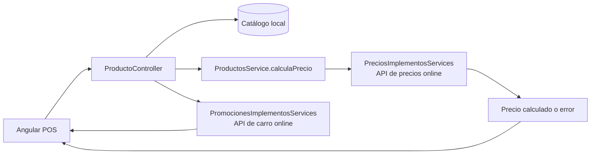
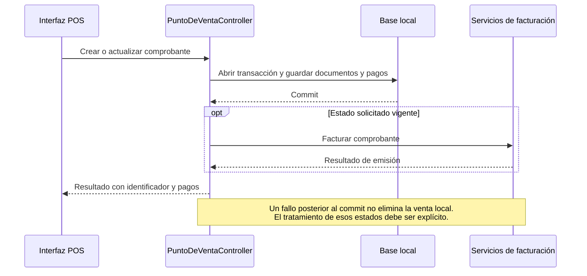

# Análisis de mountain-implementos

## Alcance y referencia

- Repositorio: [developer-implementos/mountain-implementos](https://github.com/developer-implementos/mountain-implementos).
- Rama analizada: `master`, predeterminada. No existe `main` entre las referencias consultadas; también existe `desarrollo`.
- Commit: `711f97fd7948c696bf45c992c5b121683bdbacd7`, 14 de septiembre de 2026.
- Revisión: 1 de octubre de 2026. El usuario identifica `main` como producción probable; el despliegue efectivo de este repositorio sigue sin confirmar.
- Método: análisis estático de manifiestos, rutas, controladores, servicios, modelos, migraciones y pruebas. No se arrancaron aplicaciones ni se consultaron bases o servicios operativos.

Los hallazgos se refieren al commit indicado. Las prioridades reflejan impacto potencial y necesidad de validación, no incidentes comprobados. Se omiten valores de credenciales y direcciones internas.

## 1. Qué contiene

| Unidad | Tecnología declarada | Responsabilidad observada |
| --- | --- | --- |
| `frontend` | Angular 8.2.14, TypeScript 3.5.3; versión de aplicación `v2.5.14.09.26` | Interfaz POS, cobranzas, devoluciones, ofertas, configuración, inventario, reportes y tablero de integración. |
| `backend` | AdonisJS 4.1; paquete framework `^5.0.9`; Lucid `^6.1.3`, pg `^8.3.3`, Axios `^0.19.2` | Servicios de caja y acceso a datos locales, facturación e integraciones online. |
| `backend-concentrador` | AdonisJS 4.1; Axios `^0.27.2`, pg `^8.5.1`, node-cron `^3.0.0` | Administración y consulta de mensajes, errores y estado de sucursales; reintento manual mediante el bus. |

Evidencia: [manifiesto frontend][mi-frontend], [backend][mi-backend], [concentrador][mi-concentrador]. Los rangos de paquetes no garantizan versiones instaladas.

La presencia de tres aplicaciones dentro de un repositorio muestra que repositorio y aplicación no son unidades equivalentes. El backend contiene 68 archivos de migración y 126 archivos bajo `app/Models`; el concentrador tiene sus propios modelos. El código de las reglas y persistencia ocupa múltiples controladores y servicios, no un único backend genérico sin responsabilidades diferenciadas.

En este repositorio no se identificaron los proyectos fuente Java/WSO2, la API de lectura central ni un procesador central de cola independiente. `backend-concentrador` no debe equipararse automáticamente a esos tres componentes.

## 2. Recorridos relevantes

### Consulta de precio y promociones

`calculaPrecio` invoca la API online con SKU, cantidad, RUT, sucursal y usuario. Si falla, lanza una excepción. La implementación anterior basada en precios/ofertas locales está comentada después del retorno activo. El servicio incorpora timeout y cancelación, con 8 segundos predeterminados, y devuelve estado 503 ante error. En la interfaz, un producto con `error_precio` impide abrir el pago. [Servicio de producto][mi-calcula], [consulta remota][mi-precios], [bloqueo de pago][mi-pagar].

La consulta de producto también solicita promociones a través de `promocionesDisponibles` y `promocionesLinea`. Esto amplía el alcance del trabajo offline a reglas promocionales y sus datos. [ProductoController][mi-producto], [servicio de promociones][mi-promociones].

### Venta local y DTE

El controlador hace commit antes de invocar facturación. Existe una comprobación de venta ya finalizada por ID del comprobante y otra de DTE aprobado antes de volver a facturar. Son controles aprovechables; no prueban idempotencia completa ante concurrencia, falta de ID o respuestas externas inciertas. [Venta][mi-venta], [validación de duplicado][mi-duplicado], [facturación de comprobante][mi-factura].

## 3. Hallazgos

### MI-01 · Alta · La venta depende de precios online

**Evidencia:** la ruta activa de cálculo usa el servicio remoto, sin fallback persistente de precios; la alternativa local está comentada. La interfaz bloquea pago tras error de precio. [Cálculo][mi-calcula], [servicio][mi-precios], [interfaz][mi-pagar].

**Impacto:** confirma en este commit la limitación offline descrita en la presentación. El timeout evita una espera indefinida, pero no aporta autonomía. La rama incorpora mejoras de manejo de espera/error que deben conservarse al introducir evaluación local.

**Trabajo propuesto:** inventariar reglas y datos del motor actual, definir autoridad y vigencia y construir equivalencia funcional con el cálculo local. La correspondencia exacta entre `URL_API_PRECIOS` y la API del repositorio corporativo depende de configuración productiva todavía no acreditada.

### MI-02 · Alta · La caché de pagos y NC omite parámetros de identidad

**Evidencia:** `APIFallbackManager` usa `endpoint` como única clave de escritura y lectura, con TTL de 300 segundos. Ante circuito abierto o fallo de ambos endpoints devuelve esa caché. Los métodos activos `CompruebaSaldoNc` y `EstadoNC` pasan RUT/DV y folio como parámetros, respectivamente. [Caché][mi-cache], [consumidores activos][mi-cache-calls].

**Escenario:** una consulta exitosa a `/estadoNC` para folio A llena la caché; una consulta posterior para folio B, durante un fallo de los servicios, puede obtener la respuesta de A. El mismo problema aplica a `/pagosSinSinc` entre clientes. La instancia se mantiene a nivel de módulo del controlador.

**Impacto:** una consulta utilizada en validaciones de notas de crédito puede presentar información de otra operación. El cálculo posterior de pagos filtra por folio y excluye la propia sucursal, por lo que recibir la caché de otro cliente también puede omitir pagos pendientes y devolver un descuento de saldo insuficiente. Ese filtro no corrige la clave de caché. No se ha demostrado una devolución indebida en producción. [Filtro de pagos por NC][mi-cache-filter].

**Trabajo propuesto:** identidad completa de la consulta en la clave, aislamiento por ámbito, metadatos de antigüedad y política específica para decisiones monetarias. Un dato de caché no debe aparentar una confirmación actual del saldo retornable.

### MI-03 · Alta · Rutas operativas fuera del middleware de autenticación

**Evidencia:** el grupo principal de caja termina con `.middleware("auth")`, pero después se registran rutas de sincronización de cobranza, actualización de datos, autocierre e informes públicos. En concentrador hay rutas de reintento y limpieza sin middleware de autenticación aplicado. `AuthInit` inicializa soporte de autenticación; el middleware nombrado `auth` se aplica por separado. [Rutas de caja][mi-rutas-publicas], [rutas del concentrador][mi-rutas-central], [kernel central][mi-kernel].

**Impacto condicionado:** si esos endpoints son alcanzables por un actor no autorizado, puede acceder a capacidades administrativas o de negocio. La publicación, el proxy y los controles de red no fueron inspeccionados. No se concluye exposición pública a Internet.

**Trabajo propuesto:** identificar consumidores de máquina, separar APIs operativas/administrativas y aplicar autorización en servidor por capacidad. Proteger por red puede complementar esa identidad, pero necesita evidencia de configuración y pruebas.

### MI-04 · Alta · Filtros de búsqueda interpolados en SQL

**Evidencia:** `ProductosService._generateWhere` incorpora búsqueda en `whereRaw`; el listado de ofertas hace lo mismo con `parametros.search.value`. El controlador recibe parámetros de la solicitud y compone esos filtros. [Filtros de productos][mi-sql-productos], [filtros de ofertas][mi-sql-ofertas].

**Impacto condicionado:** al alcanzar esas rutas con una búsqueda manipulada, el valor deja de tratarse exclusivamente como dato del filtro. Se requiere parametrización y pruebas negativas. En ofertas, la ruta pertenece al grupo autenticado; no se presenta como una ruta anónima.

**Límite:** no se ejecutaron payloads ni consultas contra bases reales. La constatación es la construcción de SQL por interpolación, no una extracción demostrada de datos.

### MI-05 · Media/alta · Salidas de venta sin cierre explícito de transacción

**Evidencia:** `create` abre una transacción antes de validar duplicados y pagos. Si detecta venta finalizada retorna directamente; si falla la validación de pagos también retorna. No hay `finally` que cierre la transacción en esos caminos. [Apertura y retornos][mi-retornos], [validación de pagos][mi-pagos-vacios].

**Impacto:** esos caminos pueden retener recursos/conexiones de la transacción hasta que otro mecanismo los limpie. Además, el mismo `catch` invoca rollback para errores producidos después del commit, incluidos fallos posteriores de facturación. Ese rollback no puede revertir el commit ya completado. [Commit y catch][mi-venta].

**Trabajo propuesto:** delimitar transacción local, resultados posteriores y recuperación. Validar con pruebas de errores y concurrencia antes de concluir el efecto exacto del driver en ejecución.

### MI-06 · Media · Hay alta, consulta y edición local de ofertas, pero su uso efectivo y su cálculo son distintos

**Evidencia:** rutas POST/PUT, métodos `create`/`edit` y una interfaz con botones Nuevo/Editar. Se persiste `Oferta` con productos asociados. [Rutas][mi-oferta-rutas], [controlador][mi-oferta-crud], [interfaz][mi-oferta-ui].

**Contraste:** el usuario informa uso de solo lectura en caja. El código demuestra capacidad implementada, no que esté habilitada en los perfiles o versiones productivas. La evaluación activa de precio/promoción sigue siendo remota.

**Detalle a corregir si se reutiliza:** en `edit`, el borrado de relaciones no recibe explícitamente la transacción, `save(trx)` no se espera y `commit()` tampoco. Una falla al recrear relaciones puede dejar diferencias respecto de la atomicidad esperada. Es necesaria una prueba con el ORM y la base homologados.

**Trabajo propuesto:** distinguir consulta, administración y evaluación. Inventariar qué parte se usa realmente y decidir qué componentes se conservan para el nuevo módulo local.

### MI-07 · Alta condicionada a vigencia · Credenciales literales en integraciones

**Evidencia:** los servicios de precios y promociones contienen una constante de autenticación Basic; se identifica su ubicación sin reproducir el valor. [Precios][mi-precios-secret], [promociones][mi-promociones-secret].

**Impacto:** si el material sigue vigente, quienes acceden al repositorio pueden reutilizarlo. No se comprobó validez, permisos o exposición de esos servicios.

**Trabajo propuesto:** verificar alcance y vigencia, sustituir por una identidad de servicio administrada y rotar el material activo afectado. Los ejemplos de configuración también requieren revisión sin copiar sus valores a documentación.

### MI-08 · Arquitectura · Identidad y naming ligados a convenciones locales

**Evidencia:** `guardarNumeroUnicoSucursal` genera un identificador visible con parte del slug de sucursal y un correlativo, e incluye una excepción para una sucursal. Se llama después del commit de venta. Los modelos incluyen `Perfile` para `perfiles`, `Sucursale` y nombres plurales/relaciones heterogéneos. [Número de sucursal][mi-numero], [modelo Perfile][mi-perfile], [persistencia posterior][mi-numero-call].

**Impacto:** los nombres y códigos expresan historia del sistema, pero no bastan como identidad global durante una migración multipaís. No se ha probado que exista colisión de identificadores.

**Trabajo propuesto:** conservar referencias históricas, definir ID estable por operación y correspondencias por ERP/entidad; aplicar glosario y mapeos antes de renombrar tablas o columnas. Inventariar consumidores directos, incluido el sincronizador y la API de pagos.

### MI-09 · Alta para offline · La carga de cliente puede limpiar la venta ante fallo del refresco remoto

**Evidencia adicional, a partir de los apuntes del usuario:** el buscador usa clientes locales, pero `EmpresaController.view` intenta refrescar la ficha desde una API al cargarla. Si falla, puede devolver datos locales junto con `error: true`; el flujo principal del POS responde limpiando la venta actual. Otro consumidor usa los datos sin comprobar ese error. La copia local no demuestra un fallback uniforme. [Consulta y guardado remoto/local](https://github.com/developer-implementos/mountain-implementos/blob/711f97fd7948c696bf45c992c5b121683bdbacd7/backend/app/Services/EmpresaService.js#L30-L88), [respuesta](https://github.com/developer-implementos/mountain-implementos/blob/711f97fd7948c696bf45c992c5b121683bdbacd7/backend/app/Controllers/Http/EmpresaController.js#L169-L182), [manejo en POS](https://github.com/developer-implementos/mountain-implementos/blob/711f97fd7948c696bf45c992c5b121683bdbacd7/frontend/src/app/modules/pos/pages/punto-de-venta/punto-de-venta.component.ts#L410-L445).

**Alcance:** afecta al recorrido de carga de cliente inspeccionado; no demuestra eliminación de ventas ya contabilizadas ni una incidencia reproducida en producción. El refresco evita esperar un lote para ese cliente, pero no sustituye la sincronización masiva. Tampoco acredita refresco de todos sus contactos.

**Trabajo propuesto:** separar disponibilidad local del resultado de refresco; definir vigencia y operaciones permitidas con datos locales, preservar la venta en curso y probar clientes existentes/no conocidos con la API caída. La copia de un cupo de crédito no constituye autorización offline por sí sola. La [traza completa y los demás apuntes](../contraste-apuntes-operacion-chile.md) incluyen stock, MPOS, contactos e Instacheck.

## 4. Elementos que conviene aprovechar

- Persistencia local con transacciones para el guardado principal de venta y pagos.
- Separación existente en servicios de precios, promociones y facturación: son puntos donde introducir contratos y pruebas antes de reemplazar componentes.
- Selección de proveedor de facturación entre Acepta e Ingydev, ya encapsulada por un servicio. [Selección][mi-fiscal-provider].
- Controles para no facturar de nuevo un DTE localmente aprobado y para detectar un comprobante ya finalizado.
- Manejo explícito de timeout de precios y bloqueo de pago con precio inválido.
- Tablero de integración que puede evolucionar hacia estados y conciliación más precisos, en lugar de sustituirse sin inventario.

## 5. Pruebas, operación y límites

Se encontraron 43 archivos `*.spec.ts` bajo frontend y un script específico `backend/scripts/test-precios-timeout.js`. Este último incluye pruebas con dobles y un servidor HTTP de loopback para verificar cancelación y estados de interfaz. Su presencia impide afirmar que «no existen pruebas», pero no demuestra cobertura de sincronización, pagos, concurrencia, migración o contingencia fiscal. [Script de pruebas][mi-test].

No se ejecutó el script: requiere dependencias locales del frontend y backend. Tampoco se instaló el stack legado ni se inició la aplicación. No se identificaron workflows de GitHub Actions en el árbol de este commit; podría existir CI externo.

La configuración admite varios drivers de plantilla y selecciona la conexión por entorno. La dependencia `pg` y el relato operativo respaldan PostgreSQL como base usada, pero no se deduce la infraestructura real solamente del valor predeterminado del archivo de configuración.

## 6. Consecuencias para la propuesta

1. Separar un contrato local de precios/promociones de la API corporativa actual, con equivalencia comprobable de reglas y vigencias.
2. Priorizar aislamiento de identidad en caché, confirmaciones y transacciones antes de una campaña de renombrado.
3. Definir fachadas por capacidad y ACL para traducir ERP, evitando que DTOs AX y el significado de sus estados se conviertan en el contrato interno.
4. Mantener identificadores históricos y compatibilidad con consumidores de tablas actuales durante la adopción de naming.
5. Validar versión y permisos de ofertas en una sucursal real. El código permite reducir trabajo de administración, pero no demuestra que el motor offline ya exista.
6. Preparar una prueba de venta persistida con DTE fallido y respuesta incierta, seguida de reintento y conciliación, conservando el mismo ID de negocio.

[mi-frontend]: https://github.com/developer-implementos/mountain-implementos/blob/711f97fd7948c696bf45c992c5b121683bdbacd7/frontend/package.json#L1-L103
[mi-backend]: https://github.com/developer-implementos/mountain-implementos/blob/711f97fd7948c696bf45c992c5b121683bdbacd7/backend/package.json#L1-L63
[mi-concentrador]: https://github.com/developer-implementos/mountain-implementos/blob/711f97fd7948c696bf45c992c5b121683bdbacd7/backend-concentrador/package.json#L1-L40
[mi-calcula]: https://github.com/developer-implementos/mountain-implementos/blob/711f97fd7948c696bf45c992c5b121683bdbacd7/backend/app/Services/ProductosService.js#L134-L205
[mi-precios]: https://github.com/developer-implementos/mountain-implementos/blob/711f97fd7948c696bf45c992c5b121683bdbacd7/backend/app/Services/Precios/PreciosImplementosServices.js#L12-L84
[mi-pagar]: https://github.com/developer-implementos/mountain-implementos/blob/711f97fd7948c696bf45c992c5b121683bdbacd7/frontend/src/app/modules/pos/components/pos-botones/pos-botones.component.ts#L415-L457
[mi-producto]: https://github.com/developer-implementos/mountain-implementos/blob/711f97fd7948c696bf45c992c5b121683bdbacd7/backend/app/Controllers/Http/ProductoController.js#L135-L165
[mi-promociones]: https://github.com/developer-implementos/mountain-implementos/blob/711f97fd7948c696bf45c992c5b121683bdbacd7/backend/app/Services/Promociones/PromocionesImplementosServices.js#L12-L108
[mi-venta]: https://github.com/developer-implementos/mountain-implementos/blob/711f97fd7948c696bf45c992c5b121683bdbacd7/backend/app/Controllers/Http/PuntoDeVentaController.js#L152-L233
[mi-duplicado]: https://github.com/developer-implementos/mountain-implementos/blob/711f97fd7948c696bf45c992c5b121683bdbacd7/backend/app/Controllers/Http/PuntoDeVentaController.js#L236-L253
[mi-factura]: https://github.com/developer-implementos/mountain-implementos/blob/711f97fd7948c696bf45c992c5b121683bdbacd7/backend/app/Services/ComprobanteVentaService.js#L209-L287
[mi-cache]: https://github.com/developer-implementos/mountain-implementos/blob/711f97fd7948c696bf45c992c5b121683bdbacd7/backend/app/Services/api-fallback-manager.js#L7-L94
[mi-cache-calls]: https://github.com/developer-implementos/mountain-implementos/blob/711f97fd7948c696bf45c992c5b121683bdbacd7/backend/app/Controllers/Http/NotaDeCreditoAxController.js#L447-L500
[mi-cache-filter]: https://github.com/developer-implementos/mountain-implementos/blob/711f97fd7948c696bf45c992c5b121683bdbacd7/backend/app/Controllers/Http/NotaDeCreditoAxController.js#L847-L863
[mi-rutas-publicas]: https://github.com/developer-implementos/mountain-implementos/blob/711f97fd7948c696bf45c992c5b121683bdbacd7/backend/start/routes.js#L473-L580
[mi-rutas-central]: https://github.com/developer-implementos/mountain-implementos/blob/711f97fd7948c696bf45c992c5b121683bdbacd7/backend-concentrador/start/routes.js#L19-L51
[mi-kernel]: https://github.com/developer-implementos/mountain-implementos/blob/711f97fd7948c696bf45c992c5b121683bdbacd7/backend-concentrador/start/kernel.js#L15-L63
[mi-sql-productos]: https://github.com/developer-implementos/mountain-implementos/blob/711f97fd7948c696bf45c992c5b121683bdbacd7/backend/app/Services/ProductosService.js#L92-L126
[mi-sql-ofertas]: https://github.com/developer-implementos/mountain-implementos/blob/711f97fd7948c696bf45c992c5b121683bdbacd7/backend/app/Controllers/Http/OfertaController.js#L191-L228
[mi-retornos]: https://github.com/developer-implementos/mountain-implementos/blob/711f97fd7948c696bf45c992c5b121683bdbacd7/backend/app/Controllers/Http/PuntoDeVentaController.js#L68-L118
[mi-pagos-vacios]: https://github.com/developer-implementos/mountain-implementos/blob/711f97fd7948c696bf45c992c5b121683bdbacd7/backend/app/Controllers/Http/PuntoDeVentaController.js#L673-L682
[mi-oferta-rutas]: https://github.com/developer-implementos/mountain-implementos/blob/711f97fd7948c696bf45c992c5b121683bdbacd7/backend/start/routes.js#L325-L329
[mi-oferta-crud]: https://github.com/developer-implementos/mountain-implementos/blob/711f97fd7948c696bf45c992c5b121683bdbacd7/backend/app/Controllers/Http/OfertaController.js#L47-L132
[mi-oferta-ui]: https://github.com/developer-implementos/mountain-implementos/blob/711f97fd7948c696bf45c992c5b121683bdbacd7/frontend/src/app/modules/ofertas/pages/oferta/oferta.component.html#L10-L78
[mi-precios-secret]: https://github.com/developer-implementos/mountain-implementos/blob/711f97fd7948c696bf45c992c5b121683bdbacd7/backend/app/Services/Precios/PreciosImplementosServices.js#L5-L6
[mi-promociones-secret]: https://github.com/developer-implementos/mountain-implementos/blob/711f97fd7948c696bf45c992c5b121683bdbacd7/backend/app/Services/Promociones/PromocionesImplementosServices.js#L7-L8
[mi-numero]: https://github.com/developer-implementos/mountain-implementos/blob/711f97fd7948c696bf45c992c5b121683bdbacd7/backend/app/Services/ConfiguracionService.js#L795-L815
[mi-perfile]: https://github.com/developer-implementos/mountain-implementos/blob/711f97fd7948c696bf45c992c5b121683bdbacd7/backend/app/Models/Perfile.js#L6-L13
[mi-numero-call]: https://github.com/developer-implementos/mountain-implementos/blob/711f97fd7948c696bf45c992c5b121683bdbacd7/backend/app/Controllers/Http/PuntoDeVentaController.js#L209-L212
[mi-fiscal-provider]: https://github.com/developer-implementos/mountain-implementos/blob/711f97fd7948c696bf45c992c5b121683bdbacd7/backend/app/Services/Facturacion/FacturacionService.js#L392-L414
[mi-test]: https://github.com/developer-implementos/mountain-implementos/blob/711f97fd7948c696bf45c992c5b121683bdbacd7/backend/scripts/test-precios-timeout.js#L1-L145

## Ampliación de los recorridos operativos

La [relectura de operación y evolución](../operacion-caja-y-evolucion.md) añade evidencia seleccionada de sesión/cierre, impresión, contexto de precios y entrega compatible a sucursales. Distingue código actual y contrato propuesto con pruebas pendientes; no reemplaza este informe ni acredita implementación productiva.
