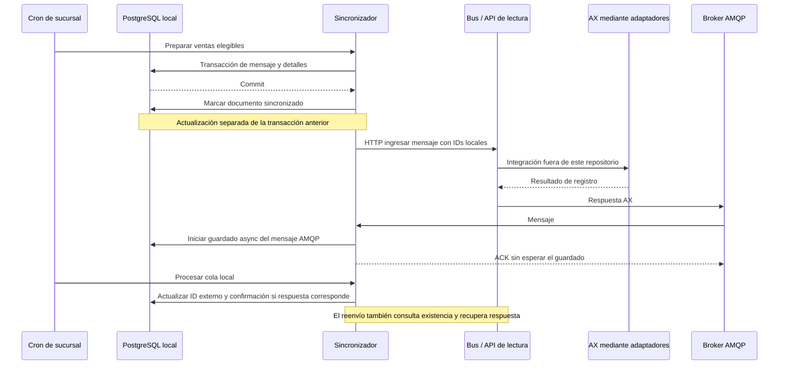
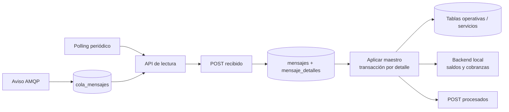
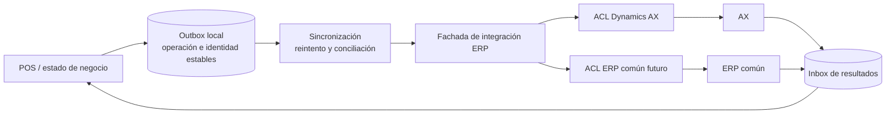

# Análisis del sincronizador de sucursal

## 1. Alcance, ramas y trazabilidad

Repositorio: [developer-implementos/mountain-sync-sucursal](https://github.com/developer-implementos/mountain-sync-sucursal). Revisión estática realizada el **1 de octubre de 2026**.

| Referencia | Commit examinado | Fecha del commit | Uso en este informe |
| --- | --- | --- | --- |
| master | 540ab9a70e7befbca27a2f7eb88b87b25109e4d1 | 2026-04-20 10:51:32 -04:00 | Referencia principal: más reciente y compatible con varios detalles de la presentación. |
| desarrollo, rama predeterminada remota | 97e6d59bfe5e529c941baafa351507a93715d712 | 2025-01-11 05:38:12 -03:00 | Contraste para evitar atribuir a ambas ramas comportamientos diferentes. |
| main | No existe entre las referencias remotas consultadas | — | La indicación del usuario «main es lo más probable» no identifica una rama disponible aquí. |

**Ninguna rama está confirmada como desplegada en producción.** El clon local conserva el checkout de desarrollo; master se inspeccionó mediante su referencia remota, sin modificar código ni configuración. Las referencias de evidencia de este informe apuntan al SHA completo de master, salvo indicación expresa.

Se amplió el historial para comparar ambas referencias: desarrollo es ancestro de master, y master incorpora **22 commits adicionales**. Cambian siete archivos: cronHooks, SincronizadorService, MensajeDetalleService, ArticulosSyncService, PagoFacturaSyncUploadService, VentasSyncUploadService y package.json. El contexto funcional se contrastó con el [anexo de la presentación](../antecedentes-presentacion-chile.md) y el [README](../../README.md).

Método: lectura de código, manifiestos, rutas, migraciones y diferencias de Git; simulaciones aisladas de semántica JavaScript. No se ejecutaron la aplicación, migraciones, pruebas del repositorio ni scripts de arranque; no se instalaron dependencias ni se accedió a bases o servicios corporativos. No se reproducen valores de credenciales, hosts ni datos personales. Las conclusiones distinguen comportamiento visible en código de riesgos condicionados por configuración o componentes no auditados en este informe.

## 2. Responsabilidad e inventario

Es una aplicación **Node.js / AdonisJS** que combina API HTTP, consumidor AMQP y trabajos cron en el mismo proceso. server.js precarga queueHooks y cronHooks antes de iniciar HTTP. Comparte modelos y tablas operativas con el backend de sucursal; además de transportar datos, transforma contratos AX y escribe entidades del negocio local. No es una replicación de PostgreSQL hacia AX. [S01]

| Área | Elementos observados |
| --- | --- |
| Versión declarada | Aplicación 4.2.0 en master y 4.1.0 en desarrollo; adonis-version 4.1.0 en ambas. |
| Dependencias declaradas | @adonisjs/framework ^5.0.9, Lucid ^6.1.3, pg ^8.3.3, amqplib ^0.6.0, axios ^0.20.0, node-cron ^3.0.0, log4js ^6.6.1. Los rangos no prueban versiones instaladas. |
| Subidas | Once familias: ventas, pago-factura, nota-de-credito, clientes, direcciones, contactos, abono-anticipos, arqueos, sobrantes-faltantes, pago-abonos-cobranza, devoluciones. |
| Bajadas programadas | Catorce tipos: clientes, saldos, direcciones, contactos, facturas-pendientes, empleados, cajas, bancos, sucursales, bodegas, plaza-bancos, precios, articulos, motivo-devolucion-nota-de-credito. |
| Bajadas adicionales implementadas | Atributos y variantes de precios: precios-todos, precio-minimo, precio-desc-vendedores, precio-historico-clientes, precio-minimo-segmento; no todas están en el cron de búsqueda. |
| Persistencia de integración | sincronizador.mensajes, mensaje_detalles, cola_mensajes, tipo_mensajes, tipo_movimientos y sincronizacion_salidas. |
| Persistencia de negocio | Escrituras directas en documentos, empresas, comprobante_ventas, pagos, cobranzas, abonos, devoluciones, cajas_usuarios y maestros; tablas de precios en servicios. |
| Llamadas HTTP | Bus: mensajeEntradas/ingresar, mensajeEntradas/existente, ping. API de lectura: mensajeSalidas/cambios, sin-procesar, recibido, procesados. Backend local: consultas y recalculación de saldos, creación de documentos y cobranzas. |
| Arranque/operación | apps.json declara un proceso para server.js. La topología real y cantidad de instancias no se deducen de ese archivo. |
| Pruebas/build | package.json declara node ace test, pero el árbol inspeccionado no contiene carpeta de tests, lockfile ni workflow de CI. TestLlamadasController son endpoints operativos/de prueba, no una suite automatizada. |

Evidencia: manifiesto [S02], cron [S03], despacho de maestros [S08], modelos [S15], cliente HTTP [S14] y árbol del commit [S23].

## 3. Flujos y estados comprobables

### 3.1. Subida: preparar no significa registrar en AX

1. El cron de master solicita ventas antes que pagos y notas de crédito; luego procesa clientes y demás familias, esperando cada llamada y dos segundos entre tipos. El orden del cron no garantiza que AX haya confirmado la operación anterior. [S03]
2. Para boleta/factura se toman hasta 100 documentos no sincronizados, de la sucursal, con cliente ya identificado externamente. Fuera de NODE_ENV=development, la consulta exige documento vigente, un DTE en los estados locales aprobado o aprobado-con-repado y una dirección con identificador externo cuando existe. Son filtros del código; no constituyen una afirmación sobre la validez fiscal de esos estados. [S04]
3. Se genera el DTO específico de AX y se crean cabecera y detalles del mensaje en una transacción local. Después, fuera de esa transacción, se marca documentos.sincronizado=true. Todavía no se ha hecho la llamada al bus. [S04][S05]
4. Se envía el mensaje por HTTP a mensajeEntradas/ingresar. Si falla, queda el mecanismo de reenvío y conciliación descrito más abajo. [S06]
5. La respuesta de AX puede entrar por AMQP o recuperarse mediante la consulta HTTP de existencia. Para ventas, sincronizacion_confirmada=true e id_externo se actualizan cuando se encuentra una respuesta satisfactoria de CustInvoiceJour. Para pagos se busca LedgerJournalTable. Una orden SalesTable por sí sola no acredita factura contabilizada. [S07][S08]

Las direcciones exigen empresas.id_externo distinto de cero. En master, con PAGO_VENTA_DEPENDIENTES=true, los pagos exigen documentos con identificador externo, y se excluye el comprobante si contiene alguna factura sin él. La dependencia se implementa con IDs y filtros; no existe aquí un orquestador explícito de estados por venta. [S09][S10]

| Marca | Significado visible | Qué no acredita |
| --- | --- | --- |
| documentos.sincronizado | Mensaje local preparado; también se vuelve a establecer en respuestas AX. | Recepción del bus, contabilización ni deuda registrada en AX. |
| documentos.sincronizacion_confirmada | Respuesta reconocida de factura AX procesada localmente. | Estado en un ERP futuro ni reconciliación independiente contra el libro contable. |
| comprobante_ventas.sincronizado | Los mensajes locales del pago para AX y GENERAL se guardaron; ocurre antes del envío HTTP del pago. | Contabilización del pago en AX. No es la marca de documentos. |
| comprobante_ventas.sincronizacion_confirmada | Se procesó respuesta de pago con LedgerJournalTable sin error. | No se establece por la sola confirmación CustInvoiceJour de la venta. |
| nota_de_credito_externas.sincronizado | Para pagos NC, se establece al aplicar el diario exitoso del pago. | No cambia en el mismo instante que comprobante_ventas.sincronizado. |
| mensaje_detalles.procesado | Finalización del tratamiento local del detalle; puede acompañarse de error=true. | Éxito funcional universal. |
| cola_mensajes.procesado | Se intentó tratar el aviso o respuesta; también se marca true ante excepciones. | Aplicación satisfactoria del maestro o respuesta. |
| en_proceso_reenvio | Bandera de trabajo de reenvío. | Garantía de exclusión o confirmación externa. |

El diagrama no afirma que los pasos externos sean atómicos ni que los mensajes lleguen una sola vez.

### 3.2. Bajada: aviso, recepción de lote y procesamiento son tres etapas

Un aviso AMQP de tipoMovimiento=salida dispara la búsqueda de un lote. También existe polling periódico. El sincronizador valida nombreEntidadDestino contra el nombre configurado de sucursal; si difiere o recibe un lote por defecto, intenta recuperar el último lote sin procesar. Estos controles son valiosos, aunque no demuestran aislamiento multiempresa. [S06]

El orden exacto es: obtener lote → avisar recibido a la API central → persistir mensaje y detalles localmente → aplicar maestros por detalle → notificar lista de resultados procesados. Cada maestro usa una transacción por detalle; las marcas de mensaje se actualizan después. Se invoca al backend local para actualizar saldos/cobranzas, por fuera de esas transacciones. [S06][S08]

El aviso central se confirma **antes** del guardado durable local. **Actualización del 2 de octubre de 2026:** el receptor api-lectura de mountain-concentrador ya fue inspeccionado. `sin-procesar` consulta `enviado=true/procesado=false` sin filtrar `recibido_sucursal`, por lo que puede reofertar el lote acusado sin copia local. La retención efectiva, la ejecución del reintento y la deduplicación requieren pruebas; no se declara pérdida definitiva ni recuperación garantizada. [Consulta central](https://github.com/developer-implementos/mountain-concentrador/blob/b2fd1ec266d131abb54b7076d41acce30f045119/api-lectura/app/Services/MensajeSalidaService.js#L93-L125), [informe de maestros](mountain-concentrador-maestros.md).

## 4. Calendario y reintentos reales del código

### 4.1. master

| Trabajo | Programación | Condiciones |
| --- | --- | --- |
| Procesar hasta 40 mensajes de cola, liberar atascados y ping | Cada minuto | Ventana de día; lock 1001. |
| Envío de once familias | Cada minuto | Ventana, CRON_ENVIAR_CAMBIOS distinto del string false; lock 2001. |
| Liberar detalles y reenvío; después buscar maestros | Cada tres minutos | Ventana; lock 3001. Solo la búsqueda depende de CRON_BUSCAR_CAMBIOS. |
| Forzar ventas/pagos sin confirmación | Cada dos minutos | Ventana; lock 5001. |
| Limpieza, VACUUM y REINDEX | Cada diez minutos | Sábado, 16:30 inclusive a 23:00 exclusive; lock 4001. |

La ventana implementada es **sábado 07:00 ≤ hora < 16:00; todos los demás días, incluido domingo, 07:00 ≤ hora < 22:00**. No hay exclusión de festivos. Esto explica el ejemplo del domingo en las notas de la presentación, pero no prueba la configuración productiva. El comentario «otros días 7 a 19» no coincide con la condición que llega hasta 22. [S03]

Todos esos cron declaran America/Santiago, pero las funciones que habilitan las ventanas usan new Date().getHours()/getDay(), que dependen del huso del proceso. Es necesario verificar TZ/SO; configurar timezone en cron no demuestra que las comprobaciones manuales usen el mismo huso.

La recepción AMQP no comprueba esa ventana. Puede seguir persistiendo mensajes fuera del horario aunque el cron difiera su procesamiento. Las rutas HTTP manuales y las búsquedas recursivas iniciadas por un lote tampoco consultan esa función. Un trabajo que empieza antes del cierre puede continuar después. Por tanto, «fuera del horario no se sincroniza» es una simplificación excesiva del código. [S03][S06][S12]

### 4.2. Política de reenvío

No se encontró un backoff exponencial basado en un contador de intentos. Se observan umbrales y jobs de reparación superpuestos:

- reEnviarCambios selecciona hasta 100 detalles por defecto, no procesados, no marcados en reenvío, destinados a AX y cuya cabecera tiene más de cinco minutos; prioriza los más antiguos.
- Marca los detalles en reenvío mediante llamadas sin await. Para cada uno espera 500 ms y consulta su existencia en central. Si existe, intenta aplicar la respuesta AX; si no, espera dos segundos y reenvía el mismo detalle.
- Un error de la consulta de existencia produce un objeto sin existente y entra igualmente en la rama de reenvío. Un timeout no demuestra que la primera entrega haya fallado.
- Los detalles en reenvío, no procesados y sin error se liberan cuando updated_at lleva más de veinte minutos. Un resultado de error AX se marca procesado y no entra por este camino general.
- soporteForzarVentasNoConfirmadas vuelve a poner procesado=false y en_proceso_reenvio=false para ventas y pagos seleccionados por falta de confirmación; en master corre cada dos minutos. Puede volver a habilitar estos casos antes de los veinte minutos.
- La cola AMQP local libera registros en_proceso=true y procesado=false con más de diez minutos. Los errores marcados procesado=true no entran en esa recuperación.
- El broker reconecta cada cinco segundos con heartbeat de 60 segundos. Los reintentos de lotes por defecto/otra sucursal son acotados a cinco intentos en esos caminos, con pausas breves.

Evidencia: selección y reparación [S07], recuperación de cola [S11], conexión [S12] y recuperación de lotes [S06].

El límite de 100 no implica que el trabajo termine dentro de un minuto. Con 100 mensajes inexistentes, las pausas explícitas suman al menos 250 segundos, antes de contar HTTP y DB. En master, la búsqueda de maestros espera que termine ese reenvío dentro del mismo cron. El timeout hacia el bus/lectura es 20 segundos; hacia el backend local, 1.200.000 ms, es decir, veinte minutos. [S07][S14]

### 4.3. Diferencias de desarrollo

| Aspecto | desarrollo | master |
| --- | --- | --- |
| Envío | Cada dos minutos, cinco segundos entre tipos y enviarCambios sin await. | Cada minuto, dos segundos y await por tipo. |
| Orden | Clientes, direcciones y contactos antes de ventas. | Ventas, pagos y NC antes de clientes. |
| Reenvío | Cada dos minutos; liberación cada tres. | Agrupados cada tres minutos. |
| Maestros | Cada tres minutos; diez segundos entre tipos, sin esperar la llamada. | Tras reenvío, tres segundos y await. |
| Ventana | Sin restricción diurna en los cron operativos. | Sábado hasta 16; resto de días hasta 22. |
| Reparación de no confirmadas | Cada dos horas. | Cada dos minutos. |
| Concurrencia cron | Sin advisory locks. | Advisory locks de sesión; limitaciones en hallazgo SYNC-04. |
| Pagos | Sobrescribe candidatos por un UUID fijo; usa una variable fuera de su alcance en una rama y condición invertida. | Retira esas instrucciones; conserva el defecto del string false descrito en SYNC-08. |
| Ventas | PayMode fijo EF; UpdateCreditMax según cálculo de cupo. | PayMode se deriva de pagos; UpdateCreditMax=0; agrega extraRef802. |

Estas diferencias impiden usar la rama predeterminada como sustituto automático de la versión operativa. Evidencia de desarrollo: [D01][D02][D03].

## 5. Hallazgos priorizados y condiciones de materialización

P1: integridad/continuidad o control de acceso que conviene resolver antes de extender el diseño. P2: resiliencia, operación o deuda importante. La prioridad es de esta revisión, no una declaración de incidente ni una severidad de producción verificada.

### SYNC-01 · P1 · ACK AMQP antes del guardado local

**Evidencia:** queueHooks llama ColaMensajeService.crear sin await y acto seguido ch.ack(msg); crear es async y espera ColaMensaje.create. [S12][S11]

**Condición e impacto:** si el insert falla o el proceso cae después del ACK y antes del commit, la aplicación ya confirmó recepción sin haber conservado el aviso/respuesta. El try/catch del callback no captura un rechazo posterior de esa promesa sin await. La consulta posterior de existencia puede recuperar algunas respuestas AX; no sustituye la garantía de recepción.

**Precisión:** no se debe describir esto como noAck=true ni durable=false. No se pasan esas opciones y el código de amqplib 0.6.0 declara durable=true por defecto y noAck=false. Hay ACK manual, pero está situado antes de la persistencia. La configuración efectiva y persistencia del publicador de negocio central requieren otra evidencia. [Documentación fuente de amqplib 0.6.0](https://github.com/amqp-node/amqplib/blob/v0.6.0/lib/api_args.js)

**Acción propuesta:** inbox durable con identidad del mensaje, commit antes del ACK, deduplicación, tratamiento de mensajes inválidos y control de concurrencia. Probar pérdida de conexión/DB entre cada paso.

### SYNC-02 · P1 · Se confirma el lote de maestros antes de persistirlo

**Evidencia:** procesarCambioEntrante espera notificarCambioRecibido y solo después llama crearMensaje. [S06]

**Condición e impacto:** caída o fallo de base en ese intervalo deja central en estado recibido sin copia local durable. Además, notificarCambioProcesado captura errores HTTP y solo los registra; el llamador continúa marcando la cabecera local como procesada. Se pueden separar el estado central y el local. [S06][S08]

**Límite actualizado:** api-lectura central permite reofertar enviados no procesados aunque ya estén recibidos. La ventana de custodia y la divergencia de estados continúan requiriendo pruebas de retención/reentrega/restore; no son evidencia de pérdida definitiva. La marca recibido no elimina por sí sola la elegibilidad de recuperación. [Filtro central verificado](https://github.com/developer-implementos/mountain-concentrador/blob/b2fd1ec266d131abb54b7076d41acce30f045119/api-lectura/app/Services/MensajeSalidaService.js#L93-L125).

**Acción propuesta:** persistir primero el lote/cursor y su identidad, confirmar recepción después, y persistir una tarea de confirmación de procesamiento para reintentar hasta obtener acuse central.

### SYNC-03 · P1 · Mensaje y marca de negocio no forman una única unidad atómica

**Evidencia:** crearMensaje transacciona cabecera y detalles; VentasSyncUploadService marca documentos.sincronizado después, con otra operación. La confirmación AX también hace commit de cambios de negocio antes de actualizar mensaje_detalles. [S04][S05][S08]

**Condición e impacto:** una caída entre la creación del mensaje y la marca permite regenerar la misma venta con otro mensaje_detalle_id. El reenvío consulta existencia por el ID del detalle; ese ID identifica un intento de preparación, no necesariamente la única operación de negocio. La confirmación separada puede dejar entidad y mensaje con estados diferentes.

**Límite:** el DTO conserva documento_id/dte_id y el bus o AX podrían deduplicar por esas claves; eso no se verifica en este repositorio.

**Cruce con consulta de pagos NC:** comprobante_ventas.sincronizado se marca al guardar los dos mensajes locales del pago, antes de enviar al bus; la confirmación LedgerJournalTable llega después. [PagoFacturaSyncUploadService.js:20–72](https://github.com/developer-implementos/mountain-sync-sucursal/blob/540ab9a70e7befbca27a2f7eb88b87b25109e4d1/app/Services/SyncUpload/PagoFacturaSyncUploadService.js#L20-L72). La API de pagos filtra pendientes con cv.sincronizado=false, por lo que deja de listar ese consumo de NC durante ese intervalo. [api-pagos-caja, services/pagosService.js:78–108](https://github.com/developer-implementos/api-pagos-caja/blob/33cd625f029aa78798f0baf307c41e17ebee92e1/services/pagosService.js#L78-L108). El backend suma esos pagos de otras sucursales al descuento del saldo y mantiene una reserva local distinta basada en nota_de_credito_externas.sincronizado. [NotaDeCreditoAxController.js:54–88](https://github.com/developer-implementos/mountain-implementos/blob/711f97fd7948c696bf45c992c5b121683bdbacd7/backend/app/Controllers/Http/NotaDeCreditoAxController.js#L54-L88), [filtros locales y remotos:808–863](https://github.com/developer-implementos/mountain-implementos/blob/711f97fd7948c696bf45c992c5b121683bdbacd7/backend/app/Controllers/Http/NotaDeCreditoAxController.js#L808-L863). Se infiere una ventana de subestimación del consumo pendiente en otra sucursal; no demuestra doble utilización efectiva, pues falta contrastar los demás controles de estado y validaciones centrales.

**Acción propuesta:** outbox transaccional con clave estable de operación, contrato de idempotencia verificado hasta ERP y una transición atómica de inbox/estado local. Unificar primero el significado de los estados.

### SYNC-04 · P1 · Los locks de master no fijan la sesión PostgreSQL

**Evidencia:** tryLock y unlock usan llamadas independientes Database.raw con pg_try_advisory_lock y pg_advisory_unlock. La configuración PostgreSQL tiene un pool de hasta 150 conexiones. No se retiene una conexión ni se verifica el resultado de unlock. [S03][S16]

**Condición e impacto:** los locks son de sesión. Si liberar usa otra conexión del pool, no libera el lock adquirido; si un nuevo job reutiliza la sesión propietaria, puede adquirir nuevamente el mismo lock. Es posible bloquear trabajo en otras sesiones o permitir solapamientos. La exclusión no queda demostrada por la sola presencia de estos locks. [Semántica oficial de advisory locks](https://www.postgresql.org/docs/current/explicit-locking.html#ADVISORY-LOCKS)

Adicionalmente, el cron de envío y el de reenvío usan claves diferentes; las rutas manuales no toman esos locks. verificarSincronizacionEnProceso hace lectura y actualización separadas y caduca a los cinco minutos, mientras una llamada al backend puede durar veinte. [S07][S14]

**Acción propuesta:** definir un único protocolo de adquisición de trabajo, con conexión retenida o lease durable y propietario, exclusión por operación y recuperación comprobable. Validar con dos procesos y jobs que duren más que su intervalo.

### SYNC-05 · P1 · Endpoints con efectos y configuraciones sensibles versionadas

**Evidencia:** rutas enviar-cambios, buscar-cambios, re-enviar-cambios y múltiples test/* no declaran middleware auth. kernel registra AuthInit global y define auth como middleware nominal, pero las rutas no lo aplican. QueueConnection solo normaliza el body. [S13]

.env.example.prod contiene valores no vacíos en APP_KEY, DB_PASSWORD y ESB_BROKER_PASSWORD; .env_old también contiene configuraciones sensibles. Se omiten todos los valores. [S17]

**Condición e impacto:** un actor con acceso de red a esas rutas puede intentar disparar reenvíos o funciones de prueba sin autenticación exigida por este código. El alcance externo real depende de firewall, proxy y despliegue. La vigencia de los secretos no se comprobó.

**Acción propuesta:** autenticación de servicio y autorización explícita de soporte, retirar rutas de prueba de la distribución operativa, sustituir secretos por inyección segura y revisar/rotar con el propietario aquellos que sigan vigentes. Los clientes HTTP no añaden credenciales ni firma; AMQP usa el protocolo amqp y credenciales de entorno. Revisar el transporte efectivo y el perímetro sin inferir que exista exposición pública. [S12][S14]

### SYNC-06 · P2 · La recuperación confunde error de consulta con inexistencia

**Evidencia:** validarMensajeExiste devuelve error=true cuando falla HTTP, sin existente. reEnviarCambios consulta solo existente y reenvía en el caso contrario; también devuelve error=false en su resultado final aunque capture una excepción. [S06][S07]

**Condición e impacto:** una respuesta perdida o un timeout de consulta puede disparar otro envío de una operación ya recibida; el diagnóstico superior puede señalar éxito a pesar del fallo. No se observa en el cliente una distinción entre «no existe», «procesando», «rechazado» y «resultado desconocido».

**Acción propuesta:** estados explícitos, reenvíos idempotentes, resultado desconocido conciliable, clasificación de errores recuperables y funcionales, y presupuesto/alerta por edad de pendientes. No convertir un timeout en evidencia de ausencia.

### SYNC-07 · P2 · Mensajes inválidos y fallos de cola no tienen recuperación uniforme

**Evidencia:** el publicador llamado en cada conexión envía el texto de diagnóstico something to do a la misma cola. No es el XML esperado; el decodificador puede devolver error y el consumidor guarda data={} y hace ACK. procesarMensajes excluye data={}; la limpieza solo elimina registros procesados. [S11][S12][S18]

Los mensajes válidos se seleccionan por created_at descendente, hasta 40. Un flujo sostenido de nuevos mensajes puede postergar a los antiguos. Ante excepción se marca procesado=true/error=true, y el job de recuperación solo recoge procesado=false/en_proceso=true. También existe una condición sospechosa en actualizarMensajesRestantes: where con columna tipo_mensaje con espacio final y un literal con apariencia de referencia a columna. Requiere verificar el SQL generado; no se ejecutó contra DB. [S11]

**Impacto:** acumulación de entradas inválidas, pendientes antiguos demorados y necesidad de reparación manual para ciertos fallos. Los mecanismos de consulta central pueden compensar algunos casos, pero no todos tienen la misma cobertura.

**Acción propuesta:** retirar el envío diagnóstico del canal de negocio, dead-letter/quarantena local con motivo y métricas, antigüedad prioritaria y pruebas del SQL de consolidación de avisos.

### SYNC-08 · P2 · Desactivar dependencia venta/pago impide enviar pagos en master

**Evidencia:** facturasSinIdExterno se inicializa al string false y solo se reemplaza por un boolean cuando PAGO_VENTA_DEPENDIENTES es el string true. El envío ocurre dentro de if (!facturasSinIdExterno). [S10]

**Condición e impacto:** al configurar false, el string no vacío sigue siendo verdadero en JavaScript y la negación da false: el comprobante se omite aunque sea elegible. No se afirma que esa opción esté desactivada en producción.

**Acción propuesta:** parsear opciones de configuración a booleanos, mantener el tipo de la variable y probar tanto dependencia activada como desactivada. Los defectos adicionales de desarrollo están detallados en la comparación de ramas y no se atribuyen a master.

### SYNC-09 · P2 · Logs detallan cargas de negocio; observabilidad centrada en consola

**Evidencia:** enviarCambiosConcentrador imprime JSON.stringify(data); actualizarMensajeSincronizadoAX imprime la respuesta AX; el DTO contiene identificadores de cliente y usuario de caja. log4js utiliza appender de consola. [S06][S08][S19]

**Impacto condicionado:** si la salida se recolecta de forma central, se amplía la presencia de información de negocio/personal y pueden quedar objetos de error HTTP completos. No se inspeccionaron colectores ni permisos.

**Acción propuesta:** logs estructurados con correlación y redacción, métricas por sucursal/país/tipo (pendientes, más antiguo, errores, descartes, latencia hasta confirmación), trazas acotadas y conciliación operacional. No equiparar el ping con salud de la cadena completa.

### SYNC-10 · P2 · Mantenimiento y migraciones requieren una estrategia operativa explícita

master ejecuta limpiezas, VACUUM y REINDEX cada diez minutos del sábado entre 16:30 y 23:00. Limpiar mensajes retira/recrea una FK dentro de una transacción; la recepción AMQP sigue activa fuera del horario cron. La retención local observada elimina cola correcta de más de una semana, errores procesados de más de cuatro y ciertos mensajes/detalles de más de tres. [S03][S05][S11][S08]

No se deduce que esa retención cubra auditoría, reconexiones prolongadas o respuestas tardías. Si una confirmación llega tras borrar su detalle, actualizarMensajeSincronizadoAX ya no encuentra el identificador. Los scripts de migración presentes presuponen tablas y schemas que no crean; este repositorio por sí solo no constituye una reconstrucción completa de la base. [S20]

**Acción propuesta:** migraciones con propietario, reconstrucción ensayada, retención por estado y ventana de reconciliación, backup/restore local y mantenimiento aislado de la recepción. Medir el efecto de REINDEX y de los cambios de FK bajo carga.

## 6. Datos, naming, ACL y ERP común

El código confirma que estandarizar naming tiene un objetivo más amplio que cambiar mayúsculas:

- Se mezclan schemas explícitos sincronizador/servicios con tablas operativas sin schema explícito; parte de la resolución depende del search_path efectivo. Hay modelos como Direccione, Sucursale y Devolucione, métodos como mepearConPagosRecibidos/getESBIntance y nombres temporales como precios_preciosnew. Conviene acordar vocabulario y convenciones antes de migrar nombres físicos. [S15][S19][S20]
- El contrato de integración usa nombres y tablas AX: CustAccount, SalesId, InvoiceAcepta, Worker, DeliveryPostalAddress, CustInvoiceJour, LedgerJournalTable y RecId; incorpora RUT/DV y estados DTE chilenos. La traducción ya existe, pero está repartida entre selección de negocio, construcción de mensajes y aplicación de respuestas. [S04][S08]
- mensaje_detalle_id, documento_id y id_externo cumplen roles diferentes. id_externo no incorpora en su nombre ni estructura el sistema propietario, empresa legal o versión del destino. Durante coexistencia, no debe sobrescribirse sin conservar los IDs del ERP anterior.
- La envoltura usa nombre_entidad_origen/destino y AX como destino predeterminado. No se observa en esa envoltura un contrato explícito de country, legalEntity, ERP destination version o schemaVersion. Para soportar coexistencia se requiere incorporar estos conceptos de forma compatible, no solo cambiar el texto AX. [S05][S07]
- servicios.precios_preciosnew conserva cantidades, precio y porcentaje como enteros, vigencia y RecId. Falta definir moneda y escala de los importes para el modelo común; no se puede asumir que el formato local actual de Chile sirva sin cambios para Perú y España. La existencia de estas tablas demuestra descarga de datos, no un motor de ofertas ni cálculo offline. [S21]
- La marca sincronizado cambia de significado según entidad/fase. Un catálogo de estados debería separar venta local, preparación de mensaje, aceptación central, procesamiento ERP, rechazo, resultado desconocido y conciliación.

Límites candidatos para la propuesta, sujetos a validación:

| Capacidad | Separación sugerida | Evidencia que la motiva |
| --- | --- | --- |
| Integración ERP | Fachada estable por capacidad: registrar venta/pago, consultar resultado; ACL AX para traducir contratos y respuestas. | DTO y reconocimiento de tablas AX repartidos en subida/bajada. |
| Transporte fiable | Outbox/inbox y motor de reintentos independiente de transformaciones AX. | ACK prematuro, estados múltiples y reparaciones SQL. |
| Identidades externas | Tabla de correspondencias por operación, entidad legal, país y sistema destino. | Uso transversal de id_externo y RecId. |
| Fiscalidad | Adaptador fiscal por país y estado fiscal explícito separado del estado ERP. | Elegibilidad de ventas dependiente del DTE local. |
| Ofertas/precios | Distribución versionada de datos y reglas; evaluación local con vigencia y procedencia. | Descarga a servicios sin demostrar evaluación local. |
| Datos operativos | Propietario de cada escritura y APIs internas mínimas; transición gradual desde DB compartida. | Sincronizador modifica directamente tablas del negocio y llama al backend para derivados. |

Este es un límite conceptual propuesto, no una elección de infraestructura ni una implementación ya existente.

Para el corte tentativo de Chile en 2027, cada operación pendiente necesita conservar qué sistema debe recibirla y cómo consultar su resultado. Cambiar globalmente el destino de mensajes antiguos podría registrar una venta en el ERP equivocado, repetirla o dejar su pago/devolución sin la venta de referencia. Deben definirse el tratamiento de ventas offline anteriores al corte, respuestas AX tardías, devoluciones posteriores, maestros de ambos sistemas y reversión del despliegue.

## 7. Contraste con la presentación y preguntas resueltas

| Antecedente | Resultado del contraste |
| --- | --- |
| Aplicación sincronizador 4.2.0 | Coincide con master; desarrollo declara 4.1.0. |
| Envío aproximadamente cada minuto | Coincide con el disparador de master; no es SLA ni frecuencia de reintento de cada venta. |
| Sábado después del cierre se retoma domingo | Compatible con master: domingo sí está dentro de los días habilitados; validar huso y versión desplegada. |
| Sincronizado no equivale a confirmado AX | Confirmado en el flujo de preparación y en campos diferenciados de confirmación. |
| Momento DTE frente a sincronización | Para boleta/factura, fuera del modo development, la selección exige DTE en los estados admitidos; la venta guardada sin DTE no entra por esa consulta. No generalizar a todas las operaciones o rutas. |
| Entrega garantizada desactivada | La descripción debe precisarse: hay ACK manual y declaración durable por defecto, pero el ACK se ejecuta antes de persistir; el central no se ha validado en este informe. |
| Posible mezcla de mensajes | Hay defensas para lotes de otra sucursal; no prueba que haya ocurrido un incidente. Debe inspeccionarse también el origen y su aislamiento. |
| Precios/descargas locales | Se verifican tablas y servicios de precios; no demuestra que la caja pueda vender offline ni que exista módulo de ofertas local. |
| Dependencia cliente → dirección y venta → pago | Existen filtros por id_externo; orden cron por sí solo no asegura confirmación. En master hay una opción defectuosa para desactivar dependencia de pagos. |
| Tres motores del ecosistema | Este componente utiliza PostgreSQL, HTTP y AMQP; no demuestra una conexión directa del sincronizador a SQL Server ni MongoDB. |

## 8. Validaciones necesarias y evidencia aún pendiente

1. Obtener SHA/versiones efectivamente desplegadas por sucursal, flags del entorno, TZ y configuración PostgreSQL/broker. Verificar si hay varios procesos y cómo se supervisan.
2. Ensayar en entorno aislado caídas antes/después de commit y ACK, y antes/después de recibido/procesados, con reconciliación de totales.
3. Verificar idempotencia central y AX usando mismo detalle, otro detalle para la misma venta y timeout después de recepción; recuperar resultados sin volver a crear negocio.
4. Comprobar exclusión con dos workers, sesiones distintas del pool, trabajos largos y ejecución manual simultánea.
5. Validar ventas sin DTE, DTE rechazado, estados con reparos, cliente/dirección aún no confirmados y pagos dependientes, incluyendo configuración false.
6. Reproducir una desconexión prolongada y el corte de ERP con cola pendiente; medir antigüedad, capacidad de recuperación, conflictos de maestros y respuesta tardía después de retención.
7. Completar pruebas de contrato para datos y reglas de precios; comprobar si backend/interfaz aplican esos datos localmente.
8. Confirmar quién controla schema, migraciones y search_path, cómo se restaura una sucursal nueva y qué datos persisten como auditoría.

Verificaciones puras realizadas: una simulación de la secuencia async sin await produjo amqp_ack antes de db_commit; la evaluación de !'false' produjo false; la condición horaria permitió domingo a las 18:00 y rechazó sábado a esa hora. Estas verifican semántica y lectura del código; no prueban un incidente ni el funcionamiento extremo a extremo.

## 9. Evidencia reproducible

Los enlaces requieren acceso al repositorio privado. Rangos en master salvo sección D. No contienen copias de secretos.

- [S01 · Arranque y precargas, server.js:20–27](https://github.com/developer-implementos/mountain-sync-sucursal/blob/540ab9a70e7befbca27a2f7eb88b87b25109e4d1/server.js#L20-L27).
- [S02 · Manifiesto de master, package.json:1–46](https://github.com/developer-implementos/mountain-sync-sucursal/blob/540ab9a70e7befbca27a2f7eb88b87b25109e4d1/package.json#L1-L46).
- [S03 · Cron, locks y ventanas, start/cronHooks.js:13–217](https://github.com/developer-implementos/mountain-sync-sucursal/blob/540ab9a70e7befbca27a2f7eb88b87b25109e4d1/start/cronHooks.js#L13-L217).
- [S04 · Selección, marca y DTO de venta, VentasSyncUploadService.js:20–346](https://github.com/developer-implementos/mountain-sync-sucursal/blob/540ab9a70e7befbca27a2f7eb88b87b25109e4d1/app/Services/SyncUpload/VentasSyncUploadService.js#L20-L346).
- [S05 · Creación transaccional, envoltura y limpieza, MensajeService.js:15–368](https://github.com/developer-implementos/mountain-sync-sucursal/blob/540ab9a70e7befbca27a2f7eb88b87b25109e4d1/app/Services/MensajeService.js#L15-L368).
- [S06 · Recibido, procesados, existencia y envío HTTP, CambiosConcentradorService.js:18–363](https://github.com/developer-implementos/mountain-sync-sucursal/blob/540ab9a70e7befbca27a2f7eb88b87b25109e4d1/app/Services/LlamadaApis/CambiosConcentradorService.js#L18-L363).
- [S07 · Flags, reenvío y reparación, SincronizadorService.js:188–476](https://github.com/developer-implementos/mountain-sync-sucursal/blob/540ab9a70e7befbca27a2f7eb88b87b25109e4d1/app/Services/SincronizadorService.js#L188-L476).
- [S08 · Aplicación de maestros y respuestas AX, MensajeDetalleService.js:79–780](https://github.com/developer-implementos/mountain-sync-sucursal/blob/540ab9a70e7befbca27a2f7eb88b87b25109e4d1/app/Services/MensajeDetalleService.js#L79-L780).
- [S09 · Dependencia cliente/dirección, DireccionesSyncUploadService.js:42–102](https://github.com/developer-implementos/mountain-sync-sucursal/blob/540ab9a70e7befbca27a2f7eb88b87b25109e4d1/app/Services/SyncUpload/DireccionesSyncUploadService.js#L42-L102).
- [S10 · Selección y dependencia de pagos, PagoFacturaSyncUploadService.js:93–220](https://github.com/developer-implementos/mountain-sync-sucursal/blob/540ab9a70e7befbca27a2f7eb88b87b25109e4d1/app/Services/SyncUpload/PagoFacturaSyncUploadService.js#L93-L220).
- [S11 · Persistencia, cola y recuperación, ColaMensajeService.js:17–199](https://github.com/developer-implementos/mountain-sync-sucursal/blob/540ab9a70e7befbca27a2f7eb88b87b25109e4d1/app/Services/ColaMensajeService.js#L17-L199).
- [S12 · Consumidor/publicador AMQP, start/queueHooks.js:26–130](https://github.com/developer-implementos/mountain-sync-sucursal/blob/540ab9a70e7befbca27a2f7eb88b87b25109e4d1/start/queueHooks.js#L26-L130).
- [S13 · Rutas sin auth declarado, start/routes.js:20–34](https://github.com/developer-implementos/mountain-sync-sucursal/blob/540ab9a70e7befbca27a2f7eb88b87b25109e4d1/start/routes.js#L20-L34); [middleware, kernel.js:15–44](https://github.com/developer-implementos/mountain-sync-sucursal/blob/540ab9a70e7befbca27a2f7eb88b87b25109e4d1/start/kernel.js#L15-L44); [QueueConnection.js:9–18](https://github.com/developer-implementos/mountain-sync-sucursal/blob/540ab9a70e7befbca27a2f7eb88b87b25109e4d1/app/Middleware/QueueConnection.js#L9-L18).
- [S14 · Clientes HTTP y timeouts, Axios.js:9–61](https://github.com/developer-implementos/mountain-sync-sucursal/blob/540ab9a70e7befbca27a2f7eb88b87b25109e4d1/app/Utils/Axios.js#L9-L61).
- [S15 · Schema de mensajes, Models/Mensaje.js:8–21](https://github.com/developer-implementos/mountain-sync-sucursal/blob/540ab9a70e7befbca27a2f7eb88b87b25109e4d1/app/Models/Mensaje.js#L8-L21); [cola, Models/ColaMensaje.js:8–10](https://github.com/developer-implementos/mountain-sync-sucursal/blob/540ab9a70e7befbca27a2f7eb88b87b25109e4d1/app/Models/ColaMensaje.js#L8-L10).
- [S16 · Pool PostgreSQL, config/database.js:71–83](https://github.com/developer-implementos/mountain-sync-sucursal/blob/540ab9a70e7befbca27a2f7eb88b87b25109e4d1/config/database.js#L71-L83).
- [S17 · Ubicaciones de configuración sensible, .env.example.prod:6–28](https://github.com/developer-implementos/mountain-sync-sucursal/blob/540ab9a70e7befbca27a2f7eb88b87b25109e4d1/.env.example.prod#L6-L28); [archivo histórico .env_old](https://github.com/developer-implementos/mountain-sync-sucursal/blob/540ab9a70e7befbca27a2f7eb88b87b25109e4d1/.env_old).
- [S18 · Decodificador XML, xmlDecode.js:3–34](https://github.com/developer-implementos/mountain-sync-sucursal/blob/540ab9a70e7befbca27a2f7eb88b87b25109e4d1/app/Utils/xmlDecode.js#L3-L34).
- [S19 · Log4js, app/Config/log4js.js:8–34](https://github.com/developer-implementos/mountain-sync-sucursal/blob/540ab9a70e7befbca27a2f7eb88b87b25109e4d1/app/Config/log4js.js#L8-L34); [mapeo de pagos, MensajeDetalleService.js:932–963](https://github.com/developer-implementos/mountain-sync-sucursal/blob/540ab9a70e7befbca27a2f7eb88b87b25109e4d1/app/Services/MensajeDetalleService.js#L932-L963).
- [S20 · Migración sobre tabla preexistente, 1670947362138_sincronizacion_salidas_schema.js:7–18](https://github.com/developer-implementos/mountain-sync-sucursal/blob/540ab9a70e7befbca27a2f7eb88b87b25109e4d1/database/migrations/1670947362138_sincronizacion_salidas_schema.js#L7-L18).
- [S21 · Tabla local de precios, 1700509914889_precios_preciosnew_schema.js:8–20](https://github.com/developer-implementos/mountain-sync-sucursal/blob/540ab9a70e7befbca27a2f7eb88b87b25109e4d1/database/migrations/1700509914889_precios_preciosnew_schema.js#L8-L20); [transformación de precios, PreciosSyncService.js:18–86](https://github.com/developer-implementos/mountain-sync-sucursal/blob/540ab9a70e7befbca27a2f7eb88b87b25109e4d1/app/Services/SyncPrecios/PreciosSyncService.js#L18-L86).
- [S22 · Interacciones con backend, BackendSucursalService.js](https://github.com/developer-implementos/mountain-sync-sucursal/blob/540ab9a70e7befbca27a2f7eb88b87b25109e4d1/app/Services/LlamadaApis/BackendSucursalService.js).
- [S23 · Árbol completo examinado de master](https://github.com/developer-implementos/mountain-sync-sucursal/tree/540ab9a70e7befbca27a2f7eb88b87b25109e4d1).
- [D01 · Cron en desarrollo](https://github.com/developer-implementos/mountain-sync-sucursal/blob/97e6d59bfe5e529c941baafa351507a93715d712/start/cronHooks.js#L14-L107).
- [D02 · Diferencias de pagos en desarrollo](https://github.com/developer-implementos/mountain-sync-sucursal/blob/97e6d59bfe5e529c941baafa351507a93715d712/app/Services/SyncUpload/PagoFacturaSyncUploadService.js#L133-L228).
- [D03 · Diferencias de ventas en desarrollo](https://github.com/developer-implementos/mountain-sync-sucursal/blob/97e6d59bfe5e529c941baafa351507a93715d712/app/Services/SyncUpload/VentasSyncUploadService.js#L212-L244).
