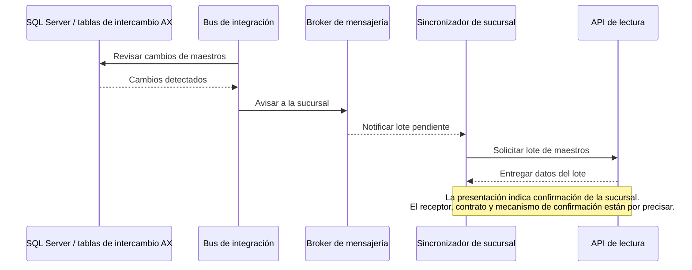

# Antecedentes de la presentación del POS de Chile

## 1. Fuente y alcance de la lectura

Fuente: [Ecosistema de Caja Mountain 4.pptx](<referencias/Ecosistema de Caja Mountain 4.pptx>), titulada «Sistema de Caja Mountain Pos», con 15 diapositivas. Se revisaron los textos, las tablas, las notas del presentador y el diagrama de arquitectura incrustado en la diapositiva 5.

Este documento organiza lo que la presentación **declara sobre el sistema actual de Chile**. No constituye una auditoría del código, de la infraestructura ni de la configuración productiva. Las menciones a manifiestos o hallazgos de código pertenecen a la fuente y se conservan como tales.

**Complemento posterior:** el usuario entregó cinco repositorios, analizados por separado en el [informe de código](analisis-repositorios/README.md). Allí se contrastan estados, calendario, precios, MongoDB, ofertas y dispositivos con evidencia por commit. Este anexo mantiene la interpretación de la presentación para distinguir lo declarado por la fuente de lo observado después en código.

**Apuntes posteriores del usuario:** la caja no maneja stock. El 2026-10-02 confirmó que Instacheck ya no funciona como integrador y Orsan continúa vigente. Las menciones de Instacheck y sus impactos en las tablas siguientes se conservan como contenido histórico de las diapositivas, no como dependencia vigente. Los apuntes sobre MPOS SQL, cadencias y refresco por RUT se registran con su grado de confirmación en el [contraste de operación de Chile](contraste-apuntes-operacion-chile.md).

Las instrucciones para exponer las láminas se consideran notas de la fuente. No se convierten en tareas del proyecto ni sustituyen el requisito del usuario de preparar una arquitectura para Chile, Perú y España con operación offline y un módulo de ofertas local.

El [README del proyecto](../README.md) integra estos antecedentes con lo informado directamente por el usuario. La presentación no aporta una arquitectura de Perú o España. El usuario confirmó posteriormente **Gira como ERP de España**; su versión, interfaces y capacidades por operación siguen pendientes de documentar.

### Índice de la fuente

| Diapositiva | Tema | Aporte principal |
| --- | --- | --- |
| 1 | Portada | Alcance: arquitectura, datos, integraciones y dependencias. |
| 2 | Resumen ejecutivo | Operación distribuida, registro posterior en AX y puntos de atención. |
| 3 | Módulos de negocio | Siete módulos dentro de una aplicación web. |
| 4 | Cuatro capas | Presentación, negocio y datos, integración, ERP y externos. |
| 5 | Ecosistema completo | Diagrama lógico Mountain / Implementos, v2.5.14. |
| 6 | Tienda y central | PC de caja, servidor de sucursal y bloqueo por consulta de precios online. |
| 7 | Bases de datos | Funciones de PostgreSQL, SQL Server y MongoDB. |
| 8 | Lenguajes y aplicaciones | Agrupaciones tecnológicas y deuda de versiones. |
| 9 | Matriz tecnológica | Diez componentes con versiones y dependencias declaradas. |
| 10 | Integraciones | Consultas online y procesamiento diferido; guardado previo al DTE en las notas. |
| 11 | Servicios / APIs | Responsabilidades y usos del término «concentrador». |
| 12 | Bus de datos | Subida, bajada, orden de entidades y ventana horaria. |
| 13 | Dependencias | Efectos de fallos e impactos preliminares. |
| 14 | Puntos de atención | Integridad, seguridad, operación y deuda tecnológica. |
| 15 | Cierre | Sin antecedentes técnicos adicionales. |

## 2. Módulos funcionales

Fuente: diapositiva 3 y sus notas. Los módulos se abren mediante rutas de una sola aplicación web.

| Módulo | Funcionalidad documentada |
| --- | --- |
| Ofertas | Consulta de ofertas vigentes y su detalle. |
| Punto de venta | Venta, pagos, apertura y cierre de caja e integración con Transbank. |
| Cobranzas | Recaudación, documentos pendientes, cuotas y acuerdos. |
| Devoluciones | Notas de crédito y devolución de dinero. |
| Reportes | Ventas, recaudación, cierre e informe Z. |
| Configuraciones | Clientes, usuarios, perfiles y parámetros. |
| Sincronizador | Tablero de integración: mensajes, entidades y errores. |

Las notas distinguen los seis primeros módulos, de uso diario en tienda, del tablero de sincronización, orientado principalmente a soporte. Ese tablero y el proceso sincronizador de la sucursal tienen responsabilidades distintas aunque compartan nombre.

La descripción de ofertas no documenta un motor local de evaluación ni funciones locales de creación o edición. Ese alcance sigue pendiente para el requisito solicitado por el usuario.

## 3. Distribución y responsabilidades

Fuentes: diapositivas 4 a 7 y 11.

| Ubicación documentada | Componentes y responsabilidad |
| --- | --- |
| PC Windows de caja | Aplicación web, agente de impresión y agente Transbank con terminal. |
| Servidor de sucursal | Backend de caja, sincronizador y base de datos local. |
| Central: integración | Bus, broker, API de lectura y administración del concentrador. |
| Central: ERP y auxiliares | APIs de AX, Dynamics AX y API de consulta de pagos. |

La nota de la diapositiva 5 aclara que el diagrama es **lógico**: no implica que todos los componentes centrales compartan un servidor. El [diagrama original](referencias/arquitectura-original-chile.jpeg) se conserva junto con la presentación.

### Servicios descritos

| Servicio | Responsabilidad según la diapositiva 11 |
| --- | --- |
| Backend de caja | API principal de ventas, pagos, cierre, DTE y reportes. Atiende a la interfaz. |
| Sincronizador | Proceso separado que sube transacciones y baja maestros. |
| API de lectura | Entrega a cada sucursal sus lotes de maestros pendientes. |
| Administración del concentrador | Tablero de mensajes y errores, con capacidad de reintentar envíos. |
| APIs de integración con AX | Adaptan las solicitudes a Dynamics AX, tanto para consultas online como para registro diferido. |
| API de consulta de pagos | Consulta pagos pendientes de sincronización y estado de notas de crédito. |

«Concentrador» se usa en la presentación para referirse al bus, su administración o la API de lectura. La API de lectura y la administración comparten el modelo de mensajes, pero son aplicaciones distintas según las notas de la diapositiva 11.

### Persistencia

La diapositiva 7 identifica **tres motores**, no tres instancias:

- **PostgreSQL en sucursal:** ventas, pagos, sesiones de caja, maestros locales y cola de mensajes del sincronizador.
- **PostgreSQL en central:** registro de mensajes del concentrador.
- **SQL Server:** base de Dynamics AX y tablas de intercambio que el bus revisa para detectar cambios de maestros.
- **MongoDB:** estado de notas de crédito, consultado por la API de pagos durante devoluciones.

La misma lámina explica que la tienda persiste primero localmente y después sincroniza mediante mensajes. No describe replicación directa de bases de datos. «Servicio de pagos» designa una API que agrupa consultas a varios servicios, según la aclaración incluida en esa lámina.

### Protocolos, rótulos y detalles que requieren contraste

La diapositiva 5 es un mapa lógico. Sus rótulos se conservan como evidencia de la fuente, separando las precisiones posteriores del código:

| Rótulo o relación de la imagen | Lectura y contraste posterior |
| --- | --- |
| Navegador ↔ backend, HTTP / JSON; backend `3333`; sincronizador `3344` | Puertos y protocolos declarados, no inventario de escuchas ni reglas de red efectivas. |
| Navegador ↔ dispositivos, HTTPS / JSON / JWT; impresión `8181` | El servicio Windows revisado configura HTTP en loopback con ruta `Impresion/{acción}`. La imagen no prueba TLS/JWT efectivos ni la exposición del proceso. Ver [impresión](analisis-repositorios/api-impresion-caja.md). |
| API de consulta de pagos `3386` | El snapshot declara `3366` como puerto predeterminado. La diferencia necesita configuración/proxy/artefacto desplegado; no se elige un número como producción. Ver [pagos](analisis-repositorios/api-pagos-caja.md). |
| WSO2 / Synapse: DSS, CAR, mediadores Java; broker AMQP/JMS Andes | Son responsabilidades diferentes agrupadas en integración. El código/artefactos efectivos del bus y del broker aún deben entregarse. |
| SQL Server AX / tablas de integración; JDBC y DSS | No acredita el DDL, la instancia MPOS informada, la frecuencia del productor ni su ubicación en el servidor AX. |
| Servicios AX / adaptadores; DATOSAXSQL; WCF NET.TCP `8201` | El repositorio `apis-implementos` sí contiene APIs y bibliotecas `ServiciosAX`/`DatosAXSql`. Falta contrastar su despliegue y el lado servidor AX; el puerto del dibujo no es una comprobación de conectividad. |
| APIs .NET dentro de «integración sucursal» | El bloque lógico no demuestra que cada sucursal ejecute una copia. La diapositiva 6 sitúa APIs AX en central; pedir correspondencia proceso→host. |
| Procesador cola bus, API lectura y administración concentrador | Componentes separados en el dibujo. Solo el backend de administración está identificado dentro de Mountain; no atribuirle automáticamente las otras responsabilidades. |
| QLIKTAIL | Rótulo literal de sistema externo en la imagen. Producto exacto, función, versión, consumidor y vigencia pendientes; no inferir una integración activa de BI a partir del nombre. |

La figura representa más de una vez API de consulta de pagos y SQL Server/tablas de integración. No permite contar instancias ni concluir que sean bases o procesos independientes. Esa ambigüedad se suma al «PostgreSQL de caja» dibujado en central y debe resolverse con el inventario efectivo.

El [catálogo técnico](catalogo-integraciones-actuales.md) incorpora estos límites y la trazabilidad del código. Los hosts, balanceadores, TLS, autenticación efectiva y cantidad de instancias pertenecen al inventario operativo solicitado al equipo.

## 4. Matriz tecnológica documentada

Fuente: diapositiva 9 y sus notas. Son versiones declaradas en los manifiestos según la presentación, pendientes de contrastar con repositorios y despliegues efectivos.

| Componente | Lenguaje | Framework / plataforma declarada | Dependencias destacadas |
| --- | --- | --- | --- |
| Frontend | TypeScript, HTML, SCSS | Angular 8.2.14; CLI 8.3.20; TypeScript 3.5.3 | RxJS 6.4, Material 8.2.3, Bootstrap 4.4.1, Chart.js, xlsx, SDK Transbank. |
| Backend de caja | JavaScript | AdonisJS 4.1 | Lucid 6.1, pg 8.3, Axios, WebSocket, Algolia. |
| Backend del concentrador | JavaScript | AdonisJS 4.1 | Lucid, pg, Axios 0.27, node-cron 3.0, log4js. |
| Sincronizador | JavaScript | AdonisJS 4.1; versión de aplicación 4.2.0 | amqplib 0.6, pg 8.3, Axios 0.20, node-cron. |
| API de lectura | JavaScript | AdonisJS 4.1 | pg 8.7, Lucid, log4js, compresión. |
| Procesador de cola del bus | JavaScript | AdonisJS 4.1 | amqplib 0.8, pg 8.7, node-cron, xml2js. |
| Bus y mediadores | Java, XML, SQL | WSO2 EI 6.6.0, Carbon / Synapse; Maven | synapse-core 2.1.7, synapse-commons 2.1.2, JDBC, artefactos CAR. |
| APIs corporativas | C#, SQL | .NET Framework 4.5; ASP.NET MVC / Web API | WCF, ADO.NET, Newtonsoft.Json, log4net, Npgsql. |
| Consulta de pagos | JavaScript | Node.js; Express 4.17 | pg 8.7, Mongoose 5.13, helmet, cors. |
| Impresión | C# | .NET Framework 4.7.2; servicio Windows | Web API SelfHost 5.2.7, ESC/POS, ZXing, iText, log4net. |

Las notas añaden estos detalles que conviene conservar para una futura validación técnica:

- Backend de caja: `@adonisjs/framework ^5.0.9`, Lucid `^6.1.3` y `pg ^8.3.3`, además de la etiqueta AdonisJS 4.1. Son etiquetas de ámbitos diferentes que deben contrastarse con el manifiesto original.
- Sincronizador: `amqplib ^0.6.0`, `pg ^8.3.3` y `Axios ^0.20.0`.
- Bus: `synapse-core 2.1.7-wso2v142` y `synapse-commons 2.1.2-wso2v4`.
- Consulta de pagos: `pg ^8.7.3` y `Mongoose ^5.13.15`, además de morgan y control de tasa.
- Impresión: uso de spooler de Windows y POS for .NET, entre otras dependencias.

Los rangos de paquetes no acreditan versiones instaladas. La versión 4.2.0 de la aplicación sincronizador, la versión AdonisJS 4.1 y el rótulo v2.5.14 del diagrama pertenecen a ámbitos distintos.

Las diapositivas 8 y 9 señalan Angular 8 y .NET Framework 4.5 como fuera de soporte. Se conserva como una afirmación de la presentación; no se ha realizado una comprobación independiente de ciclos de soporte. No debe extenderse automáticamente al componente de impresión, que figura con .NET Framework 4.7.2.

## 5. Integraciones y sincronización

### 5.1. Operaciones online

Fuente: diapositiva 10.

| Origen | Destino | Función documentada |
| --- | --- | --- |
| Aplicación web | Backend de caja | Operación interactiva de caja. |
| Backend | API de precios | Consulta del precio de cada producto. |
| Backend | APIs de AX | Cliente, saldo, orden de venta y notas de crédito. |
| Backend | Facturador | Emisión de DTE; Acepta en esta lámina, Acepta / Ingydev en el resto del material. |
| Backend | ORSAN / Instacheck | Cheques y crédito. |
| Navegador | Agentes locales | Impresión y Transbank. |

El material identifica consultas online a AX además del registro diferido de transacciones. Por ello, la frase resumida de la diapositiva 10 «si llega a AX, fue diferido» no se toma como una regla universal de integración.

**Orden documentado:** la nota de la diapositiva 10 indica guardado local de la venta antes de emitir el DTE. Un fallo posterior puede dejar la venta persistida; la tabla de la diapositiva 13 lo describe como venta guardada sin DTE. No se especifican estados, compensaciones, prevención de duplicados ni el momento de habilitación para sincronizar respecto del resultado fiscal.

### 5.2. Subida de transacciones

Fuentes: diapositivas 10 a 12 y sus notas.

El sincronizador de sucursal revisa cada minuto y envía transacciones al bus. El bus las entrega a las APIs de AX y la respuesta vuelve por el broker. El usuario añadió que la frecuencia cambia después de varios reintentos; la presentación no detalla esa política.

La diapositiva 12 enumera once tipos, manteniendo «sobrantes y faltantes» como una categoría:

1. Ventas.
2. Pagos.
3. Notas de crédito.
4. Clientes.
5. Direcciones.
6. Contactos.
7. Arqueos.
8. Sobrantes y faltantes.
9. Anticipos.
10. Abonos de cobranza.
11. Devoluciones.

Se documentan dos dependencias de orden: cliente antes de su dirección y venta registrada en AX antes de su pago. No se han proporcionado los contratos ni el mecanismo que hace cumplir ese orden.

### 5.3. Bajada de maestros

Fuentes: diapositivas 7, 10 y 12.

Los maestros enumerados son clientes, artículos, precios, descuentos, saldos, facturas pendientes, empleados, cajas, bancos, bodegas y sucursales.

El broker transmite el aviso; la API de lectura entrega los datos. Que existan maestros de precios y descuentos descargados no prueba que el precio de venta se pueda resolver localmente: las diapositivas 6, 13 y 14 declaran la dependencia de la API online.

### 5.4. Ventanas horarias

La diapositiva 12 declara:

| Días | Ventana documentada |
| --- | --- |
| Lunes a viernes | 07:00 a 22:00. |
| Sábado | 07:00 a 16:00. |
| Domingo y festivos | Sin definición explícita en el texto de la lámina. |

La lámina indica que fuera de la ventana no hay sincronización. Sin embargo, sus notas presentan el ejemplo de una venta del sábado a las 18:00 que sube el domingo a las 07:00. Se conserva la discrepancia sin asumir cuál de las dos descripciones es correcta.

Quedan por confirmar el calendario configurado, el huso horario, los festivos y si las mismas ventanas se aplican a subida, bajada y reintentos. Por esta razón, «cada minuto» tampoco describe una frecuencia permanente durante todo el día.

## 6. Dependencias y efectos de fallos

Fuente: diapositiva 13 y sus notas. La clasificación de impacto es **preliminar según la presentación**, pendiente de validación con operaciones. No constituye un SLA ni una clasificación nueva para la arquitectura objetivo.

| Dependencia | Efecto descrito si falla | Impacto indicado |
| --- | --- | --- |
| Base de datos de sucursal | No se puede operar ni sincronizar. | Alto. |
| API de precios | No se puede continuar ni finalizar la venta. | Alto. |
| Facturador Acepta / Ingydev | Puede quedar una venta guardada sin DTE emitido. | Alto. |
| Dynamics AX y sus APIs | Fallan consultas y el registro se difiere. | Medio. |
| Broker | Se retrasan avisos y respuestas de AX. | Medio. |
| API de lectura | Puede llegar el aviso sin poder descargar los datos. | Medio. |
| Transbank, agente y terminal | Falla el pago con tarjeta; la lámina indica que otros medios continúan. | Medio. |
| ORSAN / Instacheck | No se validan cheques ni crédito. | Medio; las notas lo califican como estimación. |
| MongoDB | Falla la consulta del estado de notas de crédito. | Bajo. |

El impacto depende de la operación concreta. La tabla no acredita que todas las formas de venta, cobro o devolución puedan continuar sin AX u otros servicios externos.

## 7. Puntos de atención reportados

Fuente principal: diapositiva 14 y sus notas, complementada por las diapositivas 6, 8, 9 y 13. Se registran como afirmaciones de la fuente, pendientes de contraste técnico.

| Tema | Qué reporta la presentación | Límite de la información disponible |
| --- | --- | --- |
| Integridad de mensajes | La entrega garantizada no está activada y, ante ciertas fallas, un mensaje podría perderse o mezclarse. | No se entregan aquí configuración, código, escenarios reproducibles ni evidencia de incidentes. |
| Autenticación y credenciales | Algunas rutas y APIs internas no exigen autenticación y existen credenciales en archivos de configuración. | Las notas aclaran que la protección efectiva también depende de la red y la publicación, ausentes de los repositorios mencionados. No se han verificado exposición ni explotabilidad. |
| Estados de sincronización | «Sincronizado» no equivale a confirmado en AX. Las notas lo asocian a ventas preparadas. | Falta el modelo de estados y la evidencia utilizada para acreditar el registro efectivo en AX. |
| Impresión | Puede reportar éxito aunque falle. | Falta precisar el punto de confirmación y los errores que se ocultan. |
| Offline | La API de precios online impide continuar o finalizar la venta si no está disponible. | No se detallan todos los escenarios de desconexión ni el alcance de contingencia de pagos y DTE. |
| Versiones | Se reporta falta de soporte de Angular 8 y .NET Framework 4.5, y antigüedad de AdonisJS 4.1. | Versiones de ejecución y ciclos de soporte pendientes de validación independiente. |

Las notas de la diapositiva 14 remiten a un «documento de referencia» con el detalle técnico de los hallazgos. Ese documento no forma parte de los archivos recibidos hasta ahora.

## 8. Discrepancias y aclaraciones pendientes

| ID | Punto | Evidencia y aclaración necesaria |
| --- | --- | --- |
| PEN-01 | Calendario de sincronización | Diap. 12: horario sin domingo frente a un ejemplo en notas que sí sincroniza el domingo. Confirmar configuración efectiva. |
| PEN-02 | Conteo de aplicaciones | Diap. 2 y 8: seis aplicaciones. Diap. 9: diez componentes. Diap. 11: seis servicios con otra agrupación. Conciliar aplicaciones, repositorios, procesos y despliegues. |
| PEN-03 | Componentes AdonisJS | Las notas de diap. 9 dicen seis; su tabla identifica cinco: backend de caja, backend concentrador, sincronizador, API de lectura y procesador de cola. Identificar el componente faltante o corregir el conteo. |
| PEN-04 | Online y diferido con AX | La regla resumida de diap. 10 no refleja las consultas online a AX que la misma lámina enumera. Documentar modalidad por operación. |
| PEN-05 | Persistencia y repetición de componentes en el mapa | El diagrama de diap. 5 representa otro «PostgreSQL de caja» en central y repite SQL Server/API de pagos. Diap. 6 describe servidor y base por sucursal. Precisar qué representa cada bloque sin deducir instancias físicas; aclarar también APIs .NET bajo «integración sucursal». |
| PEN-06 | Relación entre DTE y sincronización | Notas de diap. 10: guardado antes del DTE. Falta definir si el resultado fiscal condiciona el envío y registro posterior en AX. |
| PEN-07 | Precios y ofertas locales | Diap. 12 enumera descarga de precios y descuentos, pero diap. 6, 13 y 14 mantienen consulta online obligatoria. Precisar uso de los maestros y capacidades locales requeridas. |
| PEN-08 | Versiones y soporte | Contrastar matriz y rangos de manifiestos con versiones instaladas. Conservar por separado versiones de aplicación, framework y paquetes. |
| PEN-09 | Hallazgos técnicos | Obtener el detalle al que remite diap. 14 y validar condiciones de fallo, red, autenticación y configuración de mensajes. |

Estas aclaraciones completan el registro de antecedentes. Todavía no se seleccionan tecnologías, patrones de integración ni mecanismos de operación offline para la arquitectura objetivo.

## Relectura orientada a operación

La [ampliación operativa](operacion-caja-y-evolucion.md) contrasta las láminas 3, 7, 11 y 12 con apertura/cierre, cobranzas y devoluciones, y las dependencias de 6/10/13 con precios e impresión. Conserva la distinción entre la fuente histórica, el código revisado y lo informado posteriormente por el usuario. O01/O03 explican el ciclo de caja y de impresión en la web sin equiparar cierre, cuadre, emisión, papel y registro ERP.
