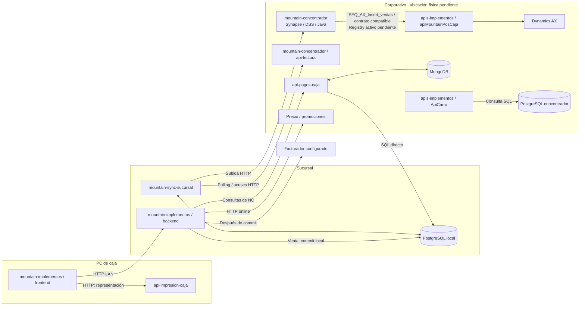

# Catálogo de integraciones actuales

> Ampliación del 2 de octubre: se recibió **mountain-concentrador**. El [mapa de repositorios](mapa-repositorios-y-conexiones.md) y su [auditoría](analisis-repositorios/mountain-concentrador.md) identifican ahora WSO2, DSS, Java, api-lectura y procesador-cola-bus. Los receptores centrales están localizados; artefactos instalados, bindings y recuperación integrada siguen pendientes.
Revisión: **2 de octubre de 2026**. Alcance: POS chileno reconstruido mediante lectura estática de seis repositorios del POS, presentación original y apuntes operativos. Se registran **35 rutas o llamadas prioritarias y 29 componentes/alias**; no es un inventario exhaustivo de APIs ni acredita despliegue en producción. Complementa las [vistas de arquitectura y flujos](vistas-arquitectura-y-flujos.md) y los [informes de código](analisis-repositorios/README.md).

Los [recorridos de datos D01–D05](recorridos-datos-tablas.md) conectan estas llamadas con tablas, colecciones, lecturas/escrituras y commits. Incluyen además llamadas auxiliares de saldo y recálculo con sus propias fuentes; la selección de 35 entradas de este catálogo sigue siendo acotada. Ninguna de estas vistas ejecuta las rutas descritas.

## 1. Alcance, evidencia y uso

La indicación del usuario de que «main es lo más probable» es una hipótesis de versión productiva. Los repositorios revisados no comparten todos esa rama. Se fijan los commits siguientes para que el análisis sea reproducible; ninguna prueba contactó APIs, bases o periféricos corporativos.

| Repositorio | Rama inspeccionada | Commit | Fecha del commit |
| --- | --- | --- | --- |
| mountain-implementos | master | [711f97fd7948](https://github.com/developer-implementos/mountain-implementos/tree/711f97fd7948c696bf45c992c5b121683bdbacd7) | 2026-09-14 |
| mountain-sync-sucursal | master | [540ab9a70e7b](https://github.com/developer-implementos/mountain-sync-sucursal/tree/540ab9a70e7befbca27a2f7eb88b87b25109e4d1) | 2026-04-20 |
| api-pagos-caja | main | [33cd625f029a](https://github.com/developer-implementos/api-pagos-caja/tree/33cd625f029aa78798f0baf307c41e17ebee92e1) | 2026-06-25 |
| api-impresion-caja | main | [2e74b2d64985](https://github.com/developer-implementos/api-impresion-caja/tree/2e74b2d64985902f5fdfb52902016a5f65d7b577) | 2026-07-23 |
| apis-implementos | master | [8fbe2f1b4d4e](https://github.com/developer-implementos/apis-implementos/tree/8fbe2f1b4d4e464a403aa3daca63ffe712a9dd70) | 2026-09-11 |
| mountain-concentrador | Pablo, predeterminada; sin main | [b2fd1ec266d1](https://github.com/developer-implementos/mountain-concentrador/tree/b2fd1ec266d131abb54b7076d41acce30f045119) | 2023-09-08 |

En el sincronizador se leyó `master` directamente mediante Git; la rama predeterminada `desarrollo` del checkout es anterior. Esto no determina qué binario está instalado. Los enlaces GitHub fijan SHA y líneas y algunos requieren acceso al repositorio privado.

**Ruta declarada** significa que existe un receptor/controlador; no demuestra tráfico ni identifica por sí sola al llamador. **Llamada observada** significa que el código construye una petición; no demuestra el servicio o configuración efectiva de destino. Las fichas indican cuándo existen ambas evidencias. `integration-caller` es un placeholder de consumidor desconocido, no una aplicación adicional.

Los paths son relativos al servidor lógico y respetan mayúsculas del código. Un sufijo como `mensajeSalidas/cambios` o `cliente` conserva su carácter relativo; los valores entre `${…}` representan una URL configurable, no una ruta inventada. No se publican IP, DNS privados, credenciales, tokens ni cadenas de conexión. Las ubicaciones son lógicas y las versiones corresponden a manifiestos/antecedentes, no a software instalado.

## 2. Despliegue reconstruido y correspondencia con repositorios

El PPTX ubica navegador y agentes en un PC Windows; backend, sincronizador y PostgreSQL en el ámbito de sucursal; integración, concentrador y adaptación AX en el ámbito corporativo. **Central no es un servidor único.** El segundo PostgreSQL de caja que aparece dentro del bloque central, la ubicación de facturadores y la etiqueta «APIs .NET de integración sucursal» necesitan aclaración. Una biblioteca como DatosAXSql no agrega por sí misma una instancia desplegada.

| Componente / alias | Zona lógica | Código / runtime | Puerto o binding conocido | Responsabilidad |
| --- | --- | --- | --- | --- |
| **PC de caja · Angular** · `ui` | terminal | mountain-implementos/frontend; Angular 8.2.14; navegador | Cliente HTTP; puerto de publicación no confirmado | Interfaz POS; llama backend, impresión y SDK de pagos. |
| **Servidor de sucursal · backend Mountain** · `backend` | branch | mountain-implementos/backend; Node.js / AdonisJS 4.1 | 3333 según diagrama y valor predeterminado del cliente del sync | Venta, persistencia local, precios, clientes y coordinación fiscal. |
| **PostgreSQL de sucursal** · `localdb` | branch | Modelos Mountain y sincronizador; PostgreSQL; versión instalada pendiente | No publicado en el catálogo | Datos de negocio y mensajes; backend/sync comparten el esquema observado. |
| **Sincronizador de sucursal** · `sync` | branch | mountain-sync-sucursal; Node.js / AdonisJS 4.1; cron + AMQP | 3344 según diagrama; despliegue por confirmar | Prepara/sube ventas y pagos, descarga maestros y aplica respuestas AX. |
| **Agente de impresión Windows** · `print` | terminal | api-impresion-caja; Servicio C# .NET Framework 4.7.2 / Web API SelfHost | HTTP localhost:8181 en código | Impresión GDI/RAW/Zebra y lector MICR; no emite fiscalmente ni autoriza tarjetas. |
| **Agente / terminal Transbank** · `transbank` | terminal | SDK consumidor en Mountain; agente no incluido; SDK web declarado; runtime del agente por confirmar | No confirmado | Acceso al terminal bancario; separado de api-pagos-caja. |
| **mountain-concentrador · WSO2 / Synapse** · `bus` | Central · ámbito lógico | mountain-concentrador / ESBImplementos, DSConcentrador, ClassRegistraMensajeDetalle; XML Synapse / DSS / Java; WSO2 EI 6.6.0 según PPTX | HTTP/JSON según diagrama; listener real pendiente | Recibir sobres, persistir, transformar y despachar a .NET/AX; generar respuestas y reintentos. |
| **Broker AMQP/JMS · Andes según PPTX** · `broker` | Central · ámbito lógico | Clientes/stores en mountain-concentrador y mountain-sync-sucursal; servidor no auditado; AMQP desde amqplib; producto/versionado servidor por validar | AMQP/JMS según diagrama; puerto real no publicado | Transporte de sobres, avisos y respuestas; separado de transformación y persistencia. |
| **mountain-concentrador · api-lectura** · `readapi` | Central · ámbito lógico | mountain-concentrador / api-lectura; Node.js / AdonisJS 4.1 / Lucid / PostgreSQL | HTTP; rutas mensajeSalidas/*; prefijo de publicación por validar | Seleccionar lotes, marcar enviado/recibido/procesados y recuperar enviados no procesados. |
| **mountain-concentrador · procesador-cola-bus** · `bus-processor` | Central · ámbito lógico | mountain-concentrador / procesador-cola-bus; Node.js / AdonisJS 4.1 / amqplib / PostgreSQL | No confirmado | Consume XML del broker y crea cola_mensajes. Java ProcesaCola reclama después las filas; el cron Node limpia procesados. |
| **Administración del concentrador** · `central-admin` | Central · ámbito lógico | mountain-implementos/backend-concentrador; Node.js / AdonisJS 4.1 | Puerto productivo no confirmado | Consulta de mensajes/errores y reintentos de integración. |
| **PostgreSQL del concentrador** · `centraldb` | Central · ámbito lógico | mountain-concentrador, mountain-implementos/backend-concentrador y apis-implementos/ApiCarro; PostgreSQL; versión/instancia por confirmar | No publicado | Sobres, detalles por destino, lotes, cola y estados de integración; lectura administrativa y URL DTE. |
| **APIs y bibliotecas de adaptación AX** · `axapi` | Central · ámbito lógico | apis-implementos; ASP.NET Web API / C# .NET Framework 4.5; WCF y ADO.NET | HTTP API no confirmado; diagrama AOS WCF net.tcp:8201 | Recibe factura/pago/cliente; llama servicios AX y SQL mediante bibliotecas. |
| **APIs .NET de integración sucursal (etiqueta del diagrama)** · `branch-dotnet` | Ubicación por confirmar | Asignación de proyectos pendiente; PPTX: APIs .NET | HTTP/JSON; puerto no confirmado | Paso de integración mostrado entre backend y central. |
| **DatosAXSql / acceso SQL AX** · `datasaxsql` | Central · ámbito lógico | apis-implementos/DatosAXSql; Biblioteca C#; ADO.NET | No aplica como listener independiente | Consultas SQL encapsuladas; no es por sí misma otro servidor. |
| **SQL Server AX / tablas de intercambio** · `sql-interchange` | Central · ámbito lógico | DDL y procesos servidor no incluidos; SQL Server según PPTX | No publicado | Datos AX y tablas usadas por integración; límites por confirmar. |
| **Dynamics AX on-premise · AOS** · `ax` | Central · ámbito lógico | Implementación X++/AOS no incluida; Dynamics AX / WCF según fuente | net.tcp:8201 según diagrama, no verificado | Registro ERP posterior a venta/DTE según flujo informado. |
| **Precio remoto / ApiPrecios candidata** · `pricing` | Central · ámbito lógico | apis-implementos/ApiPrecios; caller Mountain; Receptor candidato ASP.NET Web API / .NET Framework con MongoDB; binding vigente pendiente | HTTP; endpoint efectivo de Mountain configurable | Calcula precios/reglas; ruta compatible con parámetros enviados por Mountain. |
| **Servicio de promociones / carro configurado** · `promotions` | Ubicación por confirmar | Caller Mountain; receptor concreto no localizado; HTTP/JSON; runtime servidor pendiente | Base URL_API_CARRO configurable | Promociones disponibles y líneas asociadas. |
| **API de refresco de cliente por RUT** · `clientapi` | Ubicación por confirmar | Caller Mountain; receptor exacto no localizado; HTTP/JSON; runtime servidor pendiente | Base URL_API_CLIENTES + cliente | Devuelve ficha individual para guardar/refrescar en base local. |
| **API consulta de pagos y estados de NC** · `payments` | Central · ámbito lógico | api-pagos-caja; Node.js / Express; pg y Mongoose | 3386 en diagrama; 3366 predeterminado en código | Consulta PG de sucursales y escribe estados de NC en MongoDB; no es Transbank. |
| **MongoDB · NC, directorio y otros usos** · `mongo` | Central · ámbito lógico | api-pagos-caja; ApiPrecios y otros consumidores .NET; MongoDB/Mongoose y driver .NET | No publicado | estadoNC y directorio de sucursales/usuarios; colecciones de precios en otro contexto. |
| **ApiCarro · consulta del concentrador** · `carroapi` | Central · ámbito lógico | apis-implementos/ApiCarro; ASP.NET Web API / C# .NET Framework 4.5 | HTTP; puerto no confirmado | Entre otras capacidades, lee mensajes/JSON en PG concentrador para consultar documentos. |
| **MPOS · SQL Server de intercambio** · `mpos` | Ubicación por confirmar | Lectores en mountain-concentrador / ClassRegistraMensajeDetalle; SQL Server / JDBC; dbName MPOS en BOAX | No confirmado | CustTableSync y otras tablas alimentan generación central de lotes; se invoca MPOS.dbo.sp_caja_custTable. |
| **Facturador Acepta configurado** · `fiscal-acepta` | external | Caller Mountain; implementación proveedor no incluida; HTTP con XML codificado en formulario | URL configurable; puerto y despliegue no publicados | Recibe documento para publicar; separado de impresión y registro AX. |
| **Facturador Ingydev** · `fiscal-ingydev` | external | Caller Mountain; implementación proveedor no incluida; HTTP POST SOAP/XML | Ruta /WSFactElect/?wsdl en fuente; origen omitido | Emisión y consulta fiscal por servicio SOAP. |
| **QLIKTAIL (texto literal del diagrama)** · `qliktail` | external | No localizado; No confirmado | No confirmado | Sistema externo dibujado; función y uso POS pendientes. |
| **Consumidor corporativo por identificar** · `integration-caller` | Ubicación por confirmar | Por identificar; No confirmado | No aplica | Origen no comprobado de rutas declaradas en APIs corporativas. |
| **Instacheck · fuera de uso según el equipo** · `instacheck` | external | Contrato y despliegue no identificados; No confirmado | No confirmado | Integración histórica de cheques; el equipo confirmó que Instacheck ya no se utiliza. El estado de ORSAN es independiente. |

### 2.1. Confianza y evidencia por componente

**PC de caja · Angular (`ui`).** PPTX ubica navegador en PC Windows; manifiesto y llamadas confirman Angular. Evidencia: Código + antecedente de ubicación; instalación pendiente. Pendiente: SO, navegador, forma de servir estáticos, URL base y versión instalada.

Fuentes: [mountain-implementos/frontend/package.json:1–103](https://github.com/developer-implementos/mountain-implementos/blob/711f97fd7948c696bf45c992c5b121683bdbacd7/frontend/package.json#L1-L103); [mountain-implementos/frontend/src/app/services/punto-de-venta.service.ts:388–399](https://github.com/developer-implementos/mountain-implementos/blob/711f97fd7948c696bf45c992c5b121683bdbacd7/frontend/src/app/services/punto-de-venta.service.ts#L388-L399); [PPTX original: zonas, componentes y versiones declaradas (diap. 5–11)](../docs/antecedentes-presentacion-chile.md).

**Servidor de sucursal · backend Mountain (`backend`).** PPTX identifica servidor de sucursal; código separa backend y sync. Evidencia: Código + antecedente; host/VM no comprobados. Pendiente: Sistema operativo, supervisor, instancias y colocación de PostgreSQL.

Fuentes: [mountain-implementos/backend/package.json:1–63](https://github.com/developer-implementos/mountain-implementos/blob/711f97fd7948c696bf45c992c5b121683bdbacd7/backend/package.json#L1-L63); [mountain-implementos/backend/start/routes.js:112–122](https://github.com/developer-implementos/mountain-implementos/blob/711f97fd7948c696bf45c992c5b121683bdbacd7/backend/start/routes.js#L112-L122); [mountain-sync-sucursal/app/Utils/Axios.js:46–61](https://github.com/developer-implementos/mountain-sync-sucursal/blob/540ab9a70e7befbca27a2f7eb88b87b25109e4d1/app/Utils/Axios.js#L46-L61); [PPTX original: zonas, componentes y versiones declaradas (diap. 5–11)](../docs/antecedentes-presentacion-chile.md).

**PostgreSQL de sucursal (`localdb`).** PPTX describe base por sucursal; pg/Lucid y transacciones presentes. Evidencia: Motor y consumidores observados; instancia real pendiente. Pendiente: DDL real, schema/search_path, permisos, backups y si comparte máquina con backend.

Fuentes: [mountain-implementos/backend/app/Controllers/Http/PuntoDeVentaController.js:152–233](https://github.com/developer-implementos/mountain-implementos/blob/711f97fd7948c696bf45c992c5b121683bdbacd7/backend/app/Controllers/Http/PuntoDeVentaController.js#L152-L233); [mountain-sync-sucursal/app/Models/Mensaje.js:8–21](https://github.com/developer-implementos/mountain-sync-sucursal/blob/540ab9a70e7befbca27a2f7eb88b87b25109e4d1/app/Models/Mensaje.js#L8-L21); [PPTX original: zonas, componentes y versiones declaradas (diap. 5–11)](../docs/antecedentes-presentacion-chile.md).

**Sincronizador de sucursal (`sync`).** PPTX en servidor sucursal; llamadas a PostgreSQL y backend verificadas. Evidencia: Código de master; producción no confirmada. Pendiente: Resolver master/desarrollo, TZ, flags, cantidad de procesos y supervisión.

Fuentes: [mountain-sync-sucursal/package.json:1–46](https://github.com/developer-implementos/mountain-sync-sucursal/blob/540ab9a70e7befbca27a2f7eb88b87b25109e4d1/package.json#L1-L46); [mountain-sync-sucursal/start/cronHooks.js:13–217](https://github.com/developer-implementos/mountain-sync-sucursal/blob/540ab9a70e7befbca27a2f7eb88b87b25109e4d1/start/cronHooks.js#L13-L217); [PPTX original: zonas, componentes y versiones declaradas (diap. 5–11)](../docs/antecedentes-presentacion-chile.md).

**Agente de impresión Windows (`print`).** Binding loopback y Windows Service; PPTX lo ubica en PC Windows. Evidencia: Código de binding; instalación/binario pendiente. Pendiente: Servicio vs proyecto MVC alternativo, identidad Windows, drivers, impresoras y origen permitido.

Fuentes: [api-impresion-caja/WindowsServiceImpresora/ServiceImpresora.cs:30–60](https://github.com/developer-implementos/api-impresion-caja/blob/2e74b2d64985902f5fdfb52902016a5f65d7b577/WindowsServiceImpresora/ServiceImpresora.cs#L30-L60); [api-impresion-caja/WindowsServiceImpresora/WindowsServiceImpresora.csproj:8–11](https://github.com/developer-implementos/api-impresion-caja/blob/2e74b2d64985902f5fdfb52902016a5f65d7b577/WindowsServiceImpresora/WindowsServiceImpresora.csproj#L8-L11); [PPTX original: zonas, componentes y versiones declaradas (diap. 5–11)](../docs/antecedentes-presentacion-chile.md).

**Agente / terminal Transbank (`transbank`).** PPTX ubica agente y terminal en puesto; package.json incluye SDK. Evidencia: Antecedente + dependencia; modelo y protocolo no auditados. Pendiente: Repositorio/binario del agente, SDK instalado, modelo/firmware y operaciones homologadas.

Fuentes: [mountain-implementos/frontend/package.json:68–76](https://github.com/developer-implementos/mountain-implementos/blob/711f97fd7948c696bf45c992c5b121683bdbacd7/frontend/package.json#L68-L76); [PPTX original: zonas, componentes y versiones declaradas (diap. 5–11)](../docs/antecedentes-presentacion-chile.md).

**mountain-concentrador · WSO2 / Synapse (`bus`).** Recibir sobres, persistir, transformar y despachar a .NET/AX; generar respuestas y reintentos. Código de APIs, secuencias, DSS, mediadores y CAR; zona central según PPTX, hosts sin validar. Pendiente: Export desplegado, hashes de CAR/JAR, elección Node o SamplingProcessor, funciones SQL y recuperación.

Fuentes: [API de ingreso y consulta central](https://github.com/developer-implementos/mountain-concentrador/blob/b2fd1ec266d131abb54b7076d41acce30f045119/ESBImplementos/src/main/synapse-config/api/API_mensajeEntradas.xml#L18-L246); [Persistencia de sobres en PostgreSQL](https://github.com/developer-implementos/mountain-concentrador/blob/b2fd1ec266d131abb54b7076d41acce30f045119/DSConcentrador/dataservice/DSS_MensajeEntrada.dbs#L1-L30); [Auditoría de mountain-concentrador](analisis-repositorios/mountain-concentrador.md).

**Broker AMQP/JMS · Andes según PPTX (`broker`).** Transporte de sobres, avisos y respuestas; separado de transformación y persistencia. PPTX indica broker central; consumidor AMQP presente. Pendiente: Topología, persistencia, replicación, confirmaciones y política de retención.

Fuentes: [Consumo AMQP y ACK central](https://github.com/developer-implementos/mountain-concentrador/blob/b2fd1ec266d131abb54b7076d41acce30f045119/procesador-cola-bus/start/queueHooks.js#L30-L60); [Store JMS qlProcesaRegistro](https://github.com/developer-implementos/mountain-concentrador/blob/b2fd1ec266d131abb54b7076d41acce30f045119/ESBImplementos/src/main/synapse-config/message-stores/MS_ProcesaRegistro.xml#L1-L9); [Auditoría de mountain-concentrador](analisis-repositorios/mountain-concentrador.md).

**mountain-concentrador · api-lectura (`readapi`).** Seleccionar lotes, marcar enviado/recibido/procesados y recuperar enviados no procesados. Receptor implementado y contrato compatible con sync; publicación efectiva pendiente. Pendiente: Binding desplegado, variante Node frente API Synapse, retención y deduplicación de acuses.

Fuentes: [Rutas de API lectura](https://github.com/developer-implementos/mountain-concentrador/blob/b2fd1ec266d131abb54b7076d41acce30f045119/api-lectura/start/routes.js#L19-L26); [MPOS, lotes y acuses: auditoría y fuentes](analisis-repositorios/mountain-concentrador-maestros.md).

**mountain-concentrador · procesador-cola-bus (`bus-processor`).** Consume XML del broker y crea cola_mensajes. Java ProcesaCola reclama después las filas; el cron Node limpia procesados. Código central revisado; diferente del sync de sucursal y de Java. Pendiente: ACK sin await INSERT; cola efectiva, search_path, despliegue y coexistencia con SamplingProcessor.

Fuentes: [Consumo AMQP y ACK central](https://github.com/developer-implementos/mountain-concentrador/blob/b2fd1ec266d131abb54b7076d41acce30f045119/procesador-cola-bus/start/queueHooks.js#L30-L60); [Claim y finalización de cola en Java](https://github.com/developer-implementos/mountain-concentrador/blob/b2fd1ec266d131abb54b7076d41acce30f045119/ClassProcesaCola/src/main/java/cl/implementos/BO/BOColaMensaje.java#L18-L81); [Auditoría de mountain-concentrador](analisis-repositorios/mountain-concentrador.md).

**Administración del concentrador (`central-admin`).** Código y presentación distinguen administración de API de lectura. Evidencia: Código + ubicación lógica; servidor real pendiente. Pendiente: Proceso, artefacto, permisos y separación de API de lectura.

Fuentes: [mountain-implementos/backend-concentrador/package.json:1–40](https://github.com/developer-implementos/mountain-implementos/blob/711f97fd7948c696bf45c992c5b121683bdbacd7/backend-concentrador/package.json#L1-L40); [mountain-implementos/backend-concentrador/start/routes.js:19–51](https://github.com/developer-implementos/mountain-implementos/blob/711f97fd7948c696bf45c992c5b121683bdbacd7/backend-concentrador/start/routes.js#L19-L51); [PPTX original: zonas, componentes y versiones declaradas (diap. 5–11)](../docs/antecedentes-presentacion-chile.md).

**PostgreSQL del concentrador (`centraldb`).** Sobres, detalles por destino, lotes, cola y estados de integración; lectura administrativa y URL DTE. SQL en DSS, Java, modelos Node y ApiCarro. Instancia/schema efectivos por validar. Pendiente: Propiedad del esquema, DDL, retención y significado del segundo PG de caja dibujado en central.

Fuentes: [Persistencia de sobres en PostgreSQL](https://github.com/developer-implementos/mountain-concentrador/blob/b2fd1ec266d131abb54b7076d41acce30f045119/DSConcentrador/dataservice/DSS_MensajeEntrada.dbs#L1-L30); [Claim y finalización de cola en Java](https://github.com/developer-implementos/mountain-concentrador/blob/b2fd1ec266d131abb54b7076d41acce30f045119/ClassProcesaCola/src/main/java/cl/implementos/BO/BOColaMensaje.java#L18-L81); [Auditoría de mountain-concentrador](analisis-repositorios/mountain-concentrador.md).

**APIs y bibliotecas de adaptación AX (`axapi`).** PPTX coloca adaptación AX en zona corporativa; también dibuja APIs .NET en integración sucursal. Evidencia: Código presente; correspondencia proyecto→host pendiente. Pendiente: IIS/servicio, bindings, artefactos y qué APIs están en sucursal o central.

Fuentes: [apis-implementos/ApisImplementos.sln:6–29](https://github.com/developer-implementos/apis-implementos/blob/8fbe2f1b4d4e464a403aa3daca63ffe712a9dd70/ApisImplementos.sln#L6-L29); [apis-implementos/apiMountainPosCaja/Controllers/CajaController.cs:23–77](https://github.com/developer-implementos/apis-implementos/blob/8fbe2f1b4d4e464a403aa3daca63ffe712a9dd70/apiMountainPosCaja/Controllers/CajaController.cs#L23-L77); [PPTX original: zonas, componentes y versiones declaradas (diap. 5–11)](../docs/antecedentes-presentacion-chile.md).

**APIs .NET de integración sucursal (etiqueta del diagrama) (`branch-dotnet`).** Solo etiqueta/posición del diagrama; no identifica ejecutable ni host. Evidencia: Antecedente sin mapeo de código. Pendiente: Distinguir de APIs corporativas y confirmar si se despliega realmente por sucursal.

Fuentes: [PPTX original: zonas, componentes y versiones declaradas (diap. 5–11)](../docs/antecedentes-presentacion-chile.md).

**DatosAXSql / acceso SQL AX (`datasaxsql`).** Biblioteca en solución .NET; diagrama usa bloque DATOSAXSQL. Evidencia: Código de biblioteca; ejecución depende de API que la carga. Pendiente: Procedimientos, vistas, permisos y base SQL efectiva.

Fuentes: [apis-implementos/DatosAXSql/ordenMountainPOSdb.cs:19–60](https://github.com/developer-implementos/apis-implementos/blob/8fbe2f1b4d4e464a403aa3daca63ffe712a9dd70/DatosAXSql/ordenMountainPOSdb.cs#L19-L60); [PPTX original: zonas, componentes y versiones declaradas (diap. 5–11)](../docs/antecedentes-presentacion-chile.md).

**SQL Server AX / tablas de intercambio (`sql-interchange`).** Agrupaciones del diagrama; no se infiere una sola instancia. Evidencia: Antecedente + consumidores SQL; infraestructura pendiente. Pendiente: Separación AX/MPOS/intercambio, productores, jobs, DDL y retención.

Fuentes: [apis-implementos/DatosAXSql/ordenMountainPOSdb.cs:19–60](https://github.com/developer-implementos/apis-implementos/blob/8fbe2f1b4d4e464a403aa3daca63ffe712a9dd70/DatosAXSql/ordenMountainPOSdb.cs#L19-L60); [PPTX original: zonas, componentes y versiones declaradas (diap. 5–11)](../docs/antecedentes-presentacion-chile.md).

**Dynamics AX on-premise · AOS (`ax`).** On-premise informado por usuario y PPTX; proxies consumidores en .NET. Evidencia: Antecedente + clientes; configuración real pendiente. Pendiente: Versión AX, contratos X++, AOS, procedimientos, idempotencia y consultas por referencia.

Fuentes: [apis-implementos/ServiciosAX/mountainPosCajaServices/Pago.cs:20–132](https://github.com/developer-implementos/apis-implementos/blob/8fbe2f1b4d4e464a403aa3daca63ffe712a9dd70/ServiciosAX/mountainPosCajaServices/Pago.cs#L20-L132); [apis-implementos/ServiciosAX/mountainPosCajaServices/NotaVenta.cs:46–272](https://github.com/developer-implementos/apis-implementos/blob/8fbe2f1b4d4e464a403aa3daca63ffe712a9dd70/ServiciosAX/mountainPosCajaServices/NotaVenta.cs#L46-L272); [PPTX original: zonas, componentes y versiones declaradas (diap. 5–11)](../docs/antecedentes-presentacion-chile.md).

**Precio remoto / ApiPrecios candidata (`pricing`).** Central/remota según presentación; no prueba máquina ni binding URL_API_PRECIOS. Evidencia: Ambos contratos observados; unión efectiva pendiente. Pendiente: URL/path productivo, Mongo/colecciones, moneda, reglas y paridad para evaluación local.

Fuentes: [apis-implementos/ApiPrecios/Controllers/PreciosController.cs:17–190](https://github.com/developer-implementos/apis-implementos/blob/8fbe2f1b4d4e464a403aa3daca63ffe712a9dd70/ApiPrecios/Controllers/PreciosController.cs#L17-L190); [mountain-implementos/backend/app/Services/Precios/PreciosImplementosServices.js:25–56](https://github.com/developer-implementos/mountain-implementos/blob/711f97fd7948c696bf45c992c5b121683bdbacd7/backend/app/Services/Precios/PreciosImplementosServices.js#L25-L56); [PPTX original: zonas, componentes y versiones declaradas (diap. 5–11)](../docs/antecedentes-presentacion-chile.md).

**Servicio de promociones / carro configurado (`promotions`).** Dependencia remota en código; no se vincula automáticamente a ApiCarro del repo .NET. Evidencia: Llamada verificada; receptor y host pendientes. Pendiente: Repositorio que expone promocionesDisponibles/promocionesLinea y reglas usadas.

Fuentes: [mountain-implementos/backend/app/Services/Promociones/PromocionesImplementosServices.js:12–108](https://github.com/developer-implementos/mountain-implementos/blob/711f97fd7948c696bf45c992c5b121683bdbacd7/backend/app/Services/Promociones/PromocionesImplementosServices.js#L12-L108).

**API de refresco de cliente por RUT (`clientapi`).** Llamada en EmpresaService; no identifica despliegue/receptor inequívoco. Evidencia: Llamada verificada; implementación receptora pendiente. Pendiente: Contrato real, fuente AX/MPOS y si comparte despliegue con ApiCliente.

Fuentes: [mountain-implementos/backend/app/Services/EmpresaService.js:30–88](https://github.com/developer-implementos/mountain-implementos/blob/711f97fd7948c696bf45c992c5b121683bdbacd7/backend/app/Services/EmpresaService.js#L30-L88).

**API consulta de pagos y estados de NC (`payments`).** Central según PPTX; arranque configurable observado. Evidencia: Código + ubicación lógica; puerto/binario reales pendientes. Pendiente: Resolver discrepancia de puerto, proxy/red, índices y alcance de consultas.

Fuentes: [api-pagos-caja/app.js:108–116](https://github.com/developer-implementos/api-pagos-caja/blob/33cd625f029aa78798f0baf307c41e17ebee92e1/app.js#L108-L116); [api-pagos-caja/routes/pagos.js:1–16](https://github.com/developer-implementos/api-pagos-caja/blob/33cd625f029aa78798f0baf307c41e17ebee92e1/routes/pagos.js#L1-L16); [api-pagos-caja/services/pagosService.js:4–109](https://github.com/developer-implementos/api-pagos-caja/blob/33cd625f029aa78798f0baf307c41e17ebee92e1/services/pagosService.js#L4-L109); [PPTX original: zonas, componentes y versiones declaradas (diap. 5–11)](../docs/antecedentes-presentacion-chile.md).

**MongoDB · NC, directorio y otros usos (`mongo`).** Usos de código; agrupar el motor no demuestra misma instancia/base. Evidencia: Modelos/consumidores verificados; topología pendiente. Pendiente: Inventario de bases, colecciones, propiedad, índices y credenciales fuera de fuente.

Fuentes: [api-pagos-caja/models/estadoNC.model.js:4–28](https://github.com/developer-implementos/api-pagos-caja/blob/33cd625f029aa78798f0baf307c41e17ebee92e1/models/estadoNC.model.js#L4-L28); [api-pagos-caja/models/cajaSucursales.model.js:4–26](https://github.com/developer-implementos/api-pagos-caja/blob/33cd625f029aa78798f0baf307c41e17ebee92e1/models/cajaSucursales.model.js#L4-L26); [apis-implementos/ApiPrecios/Controllers/PreciosController.cs:17–39](https://github.com/developer-implementos/apis-implementos/blob/8fbe2f1b4d4e464a403aa3daca63ffe712a9dd70/ApiPrecios/Controllers/PreciosController.cs#L17-L39).

**ApiCarro · consulta del concentrador (`carroapi`).** Consulta verificada; ubicación corporativa lógica. Evidencia: Código de consulta; consumidor concreto pendiente. Pendiente: Quién usa concentrador, permisos y contrato que sustituya SQL/JSON interno.

Fuentes: [apis-implementos/ApiCarro/Controllers/CarroController.cs:331–355](https://github.com/developer-implementos/apis-implementos/blob/8fbe2f1b4d4e464a403aa3daca63ffe712a9dd70/ApiCarro/Controllers/CarroController.cs#L331-L355).

**MPOS · SQL Server de intercambio (`mpos`).** CustTableSync y otras tablas alimentan generación central de lotes; se invoca MPOS.dbo.sp_caja_custTable. Nombre de base, motor y lectores comprobados; productor AX→MPOS, host y job diario pendientes. Pendiente: Productor AX→MPOS, cuerpos SP, DDL, triggers, bajas, horario efectivo y servidor.

Fuentes: [MPOS, lotes y acuses: auditoría y fuentes](analisis-repositorios/mountain-concentrador-maestros.md).

**Facturador Acepta configurado (`fiscal-acepta`).** Adaptador existe; servicio efectivo depende de configuración. Evidencia: Llamada verificada; ubicación local/central/remota pendiente. Pendiente: Ruta efectiva, artefacto/contrato, contingencia, consulta y política de reintento.

Fuentes: [mountain-implementos/backend/app/Services/Facturacion/FacturacionAceptaService.js:672–724](https://github.com/developer-implementos/mountain-implementos/blob/711f97fd7948c696bf45c992c5b121683bdbacd7/backend/app/Services/Facturacion/FacturacionAceptaService.js#L672-L724).

**Facturador Ingydev (`fiscal-ingydev`).** Adaptador y ruta observados; ubicación y ambiente no acreditados. Evidencia: Llamada verificada; despliegue/uso productivo pendientes. Pendiente: Endpoint efectivo, ambiente, respuesta fiscal, contingencia y consulta.

Fuentes: [mountain-implementos/backend/app/Services/Facturacion/FacturacionIngydevService.js:402–420](https://github.com/developer-implementos/mountain-implementos/blob/711f97fd7948c696bf45c992c5b121683bdbacd7/backend/app/Services/Facturacion/FacturacionIngydevService.js#L402-L420).

**QLIKTAIL (texto literal del diagrama) (`qliktail`).** Solo aparece como sistema externo en la imagen original. Evidencia: Antecedente visual. Pendiente: Confirmar nombre, propietario, responsabilidad, datos y contrato.

Fuentes: [PPTX original: zonas, componentes y versiones declaradas (diap. 5–11)](../docs/antecedentes-presentacion-chile.md).

**Consumidor corporativo por identificar (`integration-caller`).** Placeholder explícito para no inventar una llamada efectiva. Evidencia: Desconocido. Pendiente: Identificar caller y ruta de bus que alcanza cada controlador.

Sin fuente de implementación: placeholder deliberado para un consumidor aún no identificado.

**Instacheck · fuera de uso según el equipo (`instacheck`).** La presentación agrupa ORSAN / Instacheck; el apunte posterior confirma la retirada de Instacheck, sin determinar la vigencia de ORSAN. Evidencia: Histórico; retirada de Instacheck informada por el equipo. Pendiente: Confirmar únicamente la vigencia y el contrato residual de ORSAN, además de datos/históricos que deban conservarse.

Fuentes: [Presentación original: sistemas externos](../docs/antecedentes-presentacion-chile.md); [Contraste con apuntes operativos](../docs/contraste-apuntes-operacion-chile.md).

### 2.2. Diferencias que afectan el inventario

- **Pagos:** el diagrama indica `3386`; el código arranca con `process.env.PORT` y valor predeterminado `3366`. Ninguno acredita el puerto activo. Esta API consulta pagos y estados de NC; no sustituye al agente Transbank.
- **Impresión:** el diagrama menciona HTTPS/JSON/JWT en dispositivos, pero el servicio revisado enlaza HTTP en `localhost:8181`, permite llamadas anónimas y CORS amplio. Loopback limita el binding observado; no acredita exposición LAN. Debe confirmarse el binario instalado y su control de orígenes.
- **MongoDB:** hay escrituras de `estadoNC`, directorio de sucursales y usuarios, además de otros consumidores .NET/precios. No se puede equiparar todo ello con una sola base o instancia dedicada exclusivamente a NC.
- **PostgreSQL:** la API de pagos se conecta directamente a sucursales. ApiCarro consulta tablas/JSON del concentrador. Estas dependencias deben incluirse en consolidación, permisos, recuperación y migración de esquemas.
- **.NET AX:** se recibieron controladores, bibliotecas SQL y proxies WCF en `apis-implementos`; faltan principalmente implementación X++/AOS, DDL/procedimientos y configuración desplegada. La solución contiene nueve proyectos API y tres bibliotecas; no equivale a doce servidores.
- **WSO2:** mediación Synapse/DSS, broker Andes y procesador de cola son responsabilidades distintas. mountain-concentrador contiene la implementación central; su correspondencia con los artefactos instalados sigue pendiente.

Fuentes de estas diferencias: fichas `payments`, `print`, `mongo`, `centraldb`, `axapi` y `bus`; detalles de comportamiento en los endpoints siguientes.

## 3. Lectura del recorrido

Las flechas representan interacciones descritas en sus fuentes; no son capturas de tráfico. La flecha punteada tiene secuencia, recurso QA y receptor compatibles en código; falta acreditar el binding instalado. El diagrama resume algunos recorridos y omite AMQP, cliente individual y terminal bancario; las [vistas de arquitectura](vistas-arquitectura-y-flujos.md) amplían esos límites. La persistencia local, emisión fiscal, impresión y registro AX tienen confirmaciones distintas.

## 4. Endpoints y llamadas prioritarias

Cada ficha conserva origen/destino lógico, tipo de evidencia, sincronía, dependencia offline y una condición de fallo. Las rutas .NET y del agente usan el routing del proyecto; reverse proxies y prefijos productivos siguen pendientes.

### 4.1. Venta, precios y DTE

Venta local, evaluación remota, emisión fiscal y registro AX son pasos diferentes.

#### e-sale-save · `POST /punto-de-venta`

**Origen → destino:** PC de caja · Angular (`ui`) → Servidor de sucursal · backend Mountain (`backend`). **Evidencia:** ruta receptora declarada; Ruta y llamada observadas; despliegue y tráfico no verificados.

**Función:** Guardar comprobante, documentos y pagos recibidos por el backend; el cargo en el terminal tiene otro recorrido.

**Ejecución y continuidad:** HTTP síncrono en LAN. La transacción local se confirma antes de solicitar facturación cuando corresponde. La persistencia es local a sucursal; precio, medios de pago y facturación pueden necesitar servicios remotos. No acredita venta completa offline.

**Condición / límite:** Un fallo fiscal después del commit no elimina la venta guardada. Reintentar toda la venta sin identidad estable puede repetir efectos; verificar estado original.

**Código:** `mountain-implementos`, commit `711f97fd7948`. [mountain-implementos/backend/start/routes.js:113–113](https://github.com/developer-implementos/mountain-implementos/blob/711f97fd7948c696bf45c992c5b121683bdbacd7/backend/start/routes.js#L113-L113); [mountain-implementos/frontend/src/app/services/punto-de-venta.service.ts:388–399](https://github.com/developer-implementos/mountain-implementos/blob/711f97fd7948c696bf45c992c5b121683bdbacd7/frontend/src/app/services/punto-de-venta.service.ts#L388-L399); [mountain-implementos/backend/app/Controllers/Http/PuntoDeVentaController.js:152–253](https://github.com/developer-implementos/mountain-implementos/blob/711f97fd7948c696bf45c992c5b121683bdbacd7/backend/app/Controllers/Http/PuntoDeVentaController.js#L152-L253); [mountain-implementos/backend/app/Services/ComprobanteVentaService.js:209–287](https://github.com/developer-implementos/mountain-implementos/blob/711f97fd7948c696bf45c992c5b121683bdbacd7/backend/app/Services/ComprobanteVentaService.js#L209-L287).

#### e-product-price · `GET /Productos/:id`

**Origen → destino:** PC de caja · Angular (`ui`) → Servidor de sucursal · backend Mountain (`backend`). **Evidencia:** ruta receptora declarada; Ruta y llamada observadas.

**Función:** Obtener producto y calcular precio usando contexto de cliente, cantidad y sucursal.

**Ejecución y continuidad:** HTTP síncrono: el backend invoca cálculo de precio. Consultar el maestro local no vuelve local el cálculo; este recorrido depende de precio remoto.

**Condición / límite:** El fallo de precio se propaga; la UI revisada bloquea continuar al pago con error de precio. No usar precio anterior como garantía.

**Código:** `mountain-implementos`, commit `711f97fd7948`. [mountain-implementos/backend/start/routes.js:39–39](https://github.com/developer-implementos/mountain-implementos/blob/711f97fd7948c696bf45c992c5b121683bdbacd7/backend/start/routes.js#L39-L39); [mountain-implementos/frontend/src/app/services/productos.service.ts:14–28](https://github.com/developer-implementos/mountain-implementos/blob/711f97fd7948c696bf45c992c5b121683bdbacd7/frontend/src/app/services/productos.service.ts#L14-L28); [mountain-implementos/backend/app/Controllers/Http/ProductoController.js:135–165](https://github.com/developer-implementos/mountain-implementos/blob/711f97fd7948c696bf45c992c5b121683bdbacd7/backend/app/Controllers/Http/ProductoController.js#L135-L165); [mountain-implementos/backend/app/Services/ProductosService.js:134–205](https://github.com/developer-implementos/mountain-implementos/blob/711f97fd7948c696bf45c992c5b121683bdbacd7/backend/app/Services/ProductosService.js#L134-L205).

#### e-price-call · `GET ${URL_API_PRECIOS}`

**Origen → destino:** Servidor de sucursal · backend Mountain (`backend`) → Precio remoto / ApiPrecios candidata (`pricing`). **Evidencia:** llamada saliente observada; Llamada observada; path final configurado y receptor efectivo pendientes.

**Función:** Solicitar precio con rut, sku, cantidad, sucursal y usuario; URL completa configurable.

**Ejecución y continuidad:** HTTP síncrono con cancelación por timeout; el valor predeterminado del helper es 8 segundos. Dependencia remota del flujo de caja; no se acredita un motor local equivalente de precios/ofertas.

**Condición / límite:** Ante error devuelve error=true y status 503. La URL efectiva y su vinculación con ApiPrecios no se verificaron.

**Código:** `mountain-implementos`, commit `711f97fd7948`. [mountain-implementos/backend/app/Services/Precios/PreciosImplementosServices.js:12–56](https://github.com/developer-implementos/mountain-implementos/blob/711f97fd7948c696bf45c992c5b121683bdbacd7/backend/app/Services/Precios/PreciosImplementosServices.js#L12-L56).

#### e-price-api · `GET /api/precios/precio`

**Origen → destino:** Consumidor corporativo por identificar (`integration-caller`) → Precio remoto / ApiPrecios candidata (`pricing`). **Evidencia:** ruta receptora declarada; Receptor declarado; llamador y binding de despliegue pendientes.

**Función:** Ruta .NET que declara rut, sucursal, sku, cantidad y usuario y ejecuta reglas de precio.

**Ejecución y continuidad:** HTTP síncrono con consultas a datos y reglas del servicio. Sin evidencia de ejecución o réplica local en cada sucursal.

**Condición / límite:** La firma es compatible con e-price-call; no prueba que URL_API_PRECIOS apunte a este servicio en producción.

**Código:** `apis-implementos`, commit `8fbe2f1b4d4e`. [apis-implementos/ApiPrecios/Controllers/PreciosController.cs:17–190](https://github.com/developer-implementos/apis-implementos/blob/8fbe2f1b4d4e464a403aa3daca63ffe712a9dd70/ApiPrecios/Controllers/PreciosController.cs#L17-L190).

#### e-promotions · `POST promocionesDisponibles`

**Origen → destino:** Servidor de sucursal · backend Mountain (`backend`) → Servicio de promociones / carro configurado (`promotions`). **Evidencia:** llamada saliente observada; Llamada saliente observada; base configurable.

**Función:** Consultar promociones disponibles; sufijo agregado a URL_API_CARRO. El mismo servicio consulta promocionesLinea para sus relaciones.

**Ejecución y continuidad:** HTTP síncrono con timeout declarado de 30 segundos. Requiere el servicio configurado; no demuestra evaluación local de ofertas.

**Condición / límite:** Disponibilidad del catálogo local no reemplaza esta llamada ni sus reglas. Endpoint receptor y ubicación física deben confirmarse.

**Código:** `mountain-implementos`, commit `711f97fd7948`. [mountain-implementos/backend/app/Services/Promociones/PromocionesImplementosServices.js:12–58](https://github.com/developer-implementos/mountain-implementos/blob/711f97fd7948c696bf45c992c5b121683bdbacd7/backend/app/Services/Promociones/PromocionesImplementosServices.js#L12-L58); [mountain-implementos/backend/app/Services/Promociones/PromocionesImplementosServices.js:60–108](https://github.com/developer-implementos/mountain-implementos/blob/711f97fd7948c696bf45c992c5b121683bdbacd7/backend/app/Services/Promociones/PromocionesImplementosServices.js#L60-L108).

#### e-document-retry · `GET /Documentos/facturar`

**Origen → destino:** Consumidor corporativo por identificar (`integration-caller`) → Servidor de sucursal · backend Mountain (`backend`). **Evidencia:** ruta receptora declarada; Ruta receptora declarada; consumidor efectivo no verificado.

**Función:** Volver a facturar un documento indicado por query id; ruta adicional al recorrido normal después del commit.

**Ejecución y continuidad:** HTTP síncrono que puede producir un efecto fiscal. Depende del facturador configurado y de sus capacidades, no acreditadas para operación offline.

**Condición / límite:** GET tiene efecto; repetición automática, timeout o recarga exige consultar resultado antes de reenviar. No confundir con descarga de PDF.

**Código:** `mountain-implementos`, commit `711f97fd7948`. [mountain-implementos/backend/start/routes.js:21–21](https://github.com/developer-implementos/mountain-implementos/blob/711f97fd7948c696bf45c992c5b121683bdbacd7/backend/start/routes.js#L21-L21); [mountain-implementos/backend/app/Controllers/Http/DocumentoController.js:96–101](https://github.com/developer-implementos/mountain-implementos/blob/711f97fd7948c696bf45c992c5b121683bdbacd7/backend/app/Controllers/Http/DocumentoController.js#L96-L101).

#### e-fiscal-acepta · `POST ${FACTURACION_ACEPTA_SERVICIO}`

**Origen → destino:** Servidor de sucursal · backend Mountain (`backend`) → Facturador Acepta configurado (`fiscal-acepta`). **Evidencia:** llamada saliente observada; Llamada observada; URL, despliegue y proveedor activo pendientes.

**Función:** Enviar datos XML al servicio Acepta con comando publicar y referencia documental.

**Ejecución y continuidad:** HTTP síncrono posterior al guardado de venta; URL completa por configuración. La accesibilidad y modalidad fiscal offline de este proveedor no están acreditadas.

**Condición / límite:** Sin timeout explícito en esta llamada. Un error de transporte no prueba que el proveedor no emitiera: conservar referencia y conciliar.

**Código:** `mountain-implementos`, commit `711f97fd7948`. [mountain-implementos/backend/app/Services/Facturacion/FacturacionService.js:392–414](https://github.com/developer-implementos/mountain-implementos/blob/711f97fd7948c696bf45c992c5b121683bdbacd7/backend/app/Services/Facturacion/FacturacionService.js#L392-L414); [mountain-implementos/backend/app/Services/Facturacion/FacturacionAceptaService.js:672–724](https://github.com/developer-implementos/mountain-implementos/blob/711f97fd7948c696bf45c992c5b121683bdbacd7/backend/app/Services/Facturacion/FacturacionAceptaService.js#L672-L724).

#### e-fiscal-ingydev · `POST /WSFactElect/?wsdl`

**Origen → destino:** Servidor de sucursal · backend Mountain (`backend`) → Facturador Ingydev (`fiscal-ingydev`). **Evidencia:** llamada saliente observada; Llamada y path observados; origen omitido deliberadamente.

**Función:** Enviar SOAP/XML al servicio Ingydev; se conserva el path sin divulgar el origen configurado.

**Ejecución y continuidad:** HTTP síncrono; selector de implementación decide Acepta o Ingydev. No se ha verificado contingencia fiscal ni ubicación del servicio; externo significa fuera del backend POS.

**Condición / límite:** Respuesta perdida puede dejar resultado fiscal incierto. Consultar estado con la identidad documental antes de repetir.

**Código:** `mountain-implementos`, commit `711f97fd7948`. [mountain-implementos/backend/app/Services/Facturacion/FacturacionIngydevService.js:17](https://github.com/developer-implementos/mountain-implementos/blob/711f97fd7948c696bf45c992c5b121683bdbacd7/backend/app/Services/Facturacion/FacturacionIngydevService.js#L17); [mountain-implementos/backend/app/Services/Facturacion/FacturacionIngydevService.js:402–448](https://github.com/developer-implementos/mountain-implementos/blob/711f97fd7948c696bf45c992c5b121683bdbacd7/backend/app/Services/Facturacion/FacturacionIngydevService.js#L402-L448); [mountain-implementos/backend/app/Services/Facturacion/FacturacionService.js:392–414](https://github.com/developer-implementos/mountain-implementos/blob/711f97fd7948c696bf45c992c5b121683bdbacd7/backend/app/Services/Facturacion/FacturacionService.js#L392-L414).

#### e-ax-invoice · `POST /api/caja/mountainpos/creaFacturaOvFromPos`

**Origen → destino:** `bus` → `axapi`. **Evidencia:** Synapse y receptor .NET localizados; recurso QA versionado, binding productivo pendiente.

**Función:** Wrapper .NET para crear factura de orden de venta en AX a través de ServiciosAX.

**Ejecución y continuidad:** HTTP síncrono dentro del receptor; el registro desde sucursal pertenece a la integración diferida. No es requisito de conectividad directa de la UI; la continuidad depende del guardado y recuperación de mensajes.

**Condición / límite:** El wrapper puede devolver error:false junto con una respuesta interna de error. La condición FACTURADA no acredita idempotencia general.

**Código:** [apis-implementos/apiMountainPosCaja/Controllers/CajaController.cs:23–49](https://github.com/developer-implementos/apis-implementos/blob/8fbe2f1b4d4e464a403aa3daca63ffe712a9dd70/apiMountainPosCaja/Controllers/CajaController.cs#L23-L49); [apis-implementos/ServiciosAX/mountainPosCajaServices/NotaVenta.cs:232–272](https://github.com/developer-implementos/apis-implementos/blob/8fbe2f1b4d4e464a403aa3daca63ffe712a9dd70/ServiciosAX/mountainPosCajaServices/NotaVenta.cs#L232-L272); [WSO2: llamada al registry y secuencia de respuesta](https://github.com/developer-implementos/mountain-concentrador/blob/b2fd1ec266d131abb54b7076d41acce30f045119/ESBImplementos/src/main/synapse-config/sequences/SEQ_AX_Insert_ventas.xml#L13-L32); [Recurso QA: contrato de ventas y timeout, no binding productivo](https://github.com/developer-implementos/mountain-concentrador/blob/b2fd1ec266d131abb54b7076d41acce30f045119/QARegistryResource/EP_Ventas.xml#L3-L6).

#### e-ax-payment · `POST /api/caja/mountainpos/pagoFactura`

**Origen → destino:** Consumidor corporativo por identificar (`integration-caller`) → APIs y bibliotecas de adaptación AX (`axapi`). **Evidencia:** ruta receptora declarada; Receptor declarado; mediación y despliegue pendientes.

**Función:** Registrar pago/journal de factura en AX; no autoriza tarjeta ni cobra al terminal.

**Ejecución y continuidad:** HTTP síncrono hacia proxy AX; su uso en la integración de sucursal es diferido respecto de la operación local. AX puede enterarse después; confirmación de transporte no equivale a registro financiero.

**Condición / límite:** Respuesta anidada y resultado incierto requieren inspeccionar resultado de negocio. El wrapper no acredita deduplicación extremo a extremo.

**Código:** `apis-implementos`, commit `8fbe2f1b4d4e`. [apis-implementos/apiMountainPosCaja/Controllers/CajaController.cs:53–77](https://github.com/developer-implementos/apis-implementos/blob/8fbe2f1b4d4e464a403aa3daca63ffe712a9dd70/apiMountainPosCaja/Controllers/CajaController.cs#L53-L77); [apis-implementos/ServiciosAX/mountainPosCajaServices/Pago.cs:20–132](https://github.com/developer-implementos/apis-implementos/blob/8fbe2f1b4d4e464a403aa3daca63ffe712a9dd70/ServiciosAX/mountainPosCajaServices/Pago.cs#L20-L132).

### 4.2. Cliente por RUT

Además de maestros por lotes, la carga individual refresca datos remotamente.

#### e-customer-view · `GET /empresas/:id`

**Origen → destino:** PC de caja · Angular (`ui`) → Servidor de sucursal · backend Mountain (`backend`). **Evidencia:** ruta receptora declarada; Ruta y consumidor Angular observados.

**Función:** Consultar/refrescar cliente: id local o id nulo con query rut.

**Ejecución y continuidad:** HTTP síncrono: intenta consulta externa, actualiza datos locales y retorna resultado de consulta local. Existe información local, pero la consulta con RUT incluye refresh remoto; no equivale a una experiencia validada sin WAN.

**Condición / límite:** El manejo de error del refresh puede afectar la selección del cliente. Es una lectura/rematerialización, no una escritura del cliente en AX.

**Código:** `mountain-implementos`, commit `711f97fd7948`. [mountain-implementos/backend/start/routes.js:50–50](https://github.com/developer-implementos/mountain-implementos/blob/711f97fd7948c696bf45c992c5b121683bdbacd7/backend/start/routes.js#L50-L50); [mountain-implementos/frontend/src/app/services/empresas.service.ts:28–54](https://github.com/developer-implementos/mountain-implementos/blob/711f97fd7948c696bf45c992c5b121683bdbacd7/frontend/src/app/services/empresas.service.ts#L28-L54); [mountain-implementos/backend/app/Controllers/Http/EmpresaController.js:66–88](https://github.com/developer-implementos/mountain-implementos/blob/711f97fd7948c696bf45c992c5b121683bdbacd7/backend/app/Controllers/Http/EmpresaController.js#L66-L88); [mountain-implementos/backend/app/Services/EmpresaService.js:30–88](https://github.com/developer-implementos/mountain-implementos/blob/711f97fd7948c696bf45c992c5b121683bdbacd7/backend/app/Services/EmpresaService.js#L30-L88).

#### e-customer-refresh · `GET cliente`

**Origen → destino:** Servidor de sucursal · backend Mountain (`backend`) → API de refresco de cliente por RUT (`clientapi`). **Evidencia:** llamada saliente observada; Llamada saliente; base y receptor efectivos pendientes.

**Función:** Agregar el sufijo cliente a URL_API_CLIENTES y consultar con parámetro _rutCliente; guardar respuesta en PostgreSQL local.

**Ejecución y continuidad:** HTTP síncrono con timeout declarado de 30 segundos. La llamada necesita acceso al servicio configurado. El contrato de fallback local requiere validación funcional.

**Condición / límite:** El receptor no se ha identificado inequívocamente entre los proyectos .NET recibidos. No atribuir esta llamada a ApiCliente por su nombre.

**Código:** `mountain-implementos`, commit `711f97fd7948`. [mountain-implementos/backend/app/Services/EmpresaService.js:30–88](https://github.com/developer-implementos/mountain-implementos/blob/711f97fd7948c696bf45c992c5b121683bdbacd7/backend/app/Services/EmpresaService.js#L30-L88); [mountain-implementos/backend/app/Controllers/Http/EmpresaController.js:169–182](https://github.com/developer-implementos/mountain-implementos/blob/711f97fd7948c696bf45c992c5b121683bdbacd7/backend/app/Controllers/Http/EmpresaController.js#L169-L182).

### 4.3. Maestros y sincronización

Llamadas del sincronizador y receptores compatibles en mountain-concentrador; binding desplegado pendiente.

#### e-sync-upload · `POST /api/mensajeEntradas/ingresar`

**Origen → destino:** `sync` → `bus`. **Evidencia:** Llamador y receptor compatibles; despliegue pendiente.

**Función:** Subir un mensaje de integración preparado localmente al bus central.

**Ejecución y continuidad:** HTTP síncrono por envío; disparado en segundo plano por cron o acción de sincronización. Si no hay WAN, el envío necesita recuperación posterior. La existencia de tablas de mensajes no prueba ausencia de pérdidas ni reintentos idempotentes.

**Condición / límite:** procesado=true en HTTP representa recepción. PostgreSQL y JMS son pasos separados; no confirma AX.

**Código:** [mountain-sync-sucursal/app/Utils/Axios.js:9–20](https://github.com/developer-implementos/mountain-sync-sucursal/blob/540ab9a70e7befbca27a2f7eb88b87b25109e4d1/app/Utils/Axios.js#L9-L20); [mountain-sync-sucursal/app/Services/LlamadaApis/CambiosConcentradorService.js:289–318](https://github.com/developer-implementos/mountain-sync-sucursal/blob/540ab9a70e7befbca27a2f7eb88b87b25109e4d1/app/Services/LlamadaApis/CambiosConcentradorService.js#L289-L318); [mountain-sync-sucursal/app/Services/SincronizadorService.js:188–476](https://github.com/developer-implementos/mountain-sync-sucursal/blob/540ab9a70e7befbca27a2f7eb88b87b25109e4d1/app/Services/SincronizadorService.js#L188-L476); [API de ingreso y consulta central](https://github.com/developer-implementos/mountain-concentrador/blob/b2fd1ec266d131abb54b7076d41acce30f045119/ESBImplementos/src/main/synapse-config/api/API_mensajeEntradas.xml#L18-L246).

#### e-sync-exists · `POST /api/mensajeEntradas/existente`

**Origen → destino:** `sync` → `bus`. **Evidencia:** Llamador y receptor compatibles; despliegue pendiente.

**Función:** Consultar si el concentrador ya conoce un mensaje; se usa en recuperación/reenvío.

**Ejecución y continuidad:** HTTP síncrono de control, separado del resultado de negocio ERP. Necesita acceso al bus. La falta de respuesta impide distinguir ausencia de mensaje de fallo de consulta.

**Condición / límite:** Sin data_respuesta no demuestra ausencia de efecto AX; reintentar requiere reconciliación.

**Código:** [mountain-sync-sucursal/app/Utils/Axios.js:9–20](https://github.com/developer-implementos/mountain-sync-sucursal/blob/540ab9a70e7befbca27a2f7eb88b87b25109e4d1/app/Utils/Axios.js#L9-L20); [mountain-sync-sucursal/app/Services/LlamadaApis/CambiosConcentradorService.js:340–363](https://github.com/developer-implementos/mountain-sync-sucursal/blob/540ab9a70e7befbca27a2f7eb88b87b25109e4d1/app/Services/LlamadaApis/CambiosConcentradorService.js#L340-L363); [mountain-sync-sucursal/app/Services/SincronizadorService.js:188–476](https://github.com/developer-implementos/mountain-sync-sucursal/blob/540ab9a70e7befbca27a2f7eb88b87b25109e4d1/app/Services/SincronizadorService.js#L188-L476); [API de ingreso y consulta central](https://github.com/developer-implementos/mountain-concentrador/blob/b2fd1ec266d131abb54b7076d41acce30f045119/ESBImplementos/src/main/synapse-config/api/API_mensajeEntradas.xml#L18-L246).

#### e-sync-ping · `GET /api/ping`

**Origen → destino:** `sync` → `bus`. **Evidencia:** Llamador y receptor Synapse compatibles; despliegue pendiente.

**Función:** Enviar ping con identificador de entidad al bus.

**Ejecución y continuidad:** HTTP síncrono auxiliar en segundo plano. Fallo indica falta de respuesta de esta ruta; no mide continuidad funcional de venta local.

**Condición / límite:** Éxito del ping no prueba salud de AX, DTE, colas, PostgreSQL ni entrega de mensajes.

**Código:** [mountain-sync-sucursal/app/Utils/Axios.js:9–20](https://github.com/developer-implementos/mountain-sync-sucursal/blob/540ab9a70e7befbca27a2f7eb88b87b25109e4d1/app/Utils/Axios.js#L9-L20); [mountain-sync-sucursal/app/Services/LlamadaApis/CambiosConcentradorService.js:320–338](https://github.com/developer-implementos/mountain-sync-sucursal/blob/540ab9a70e7befbca27a2f7eb88b87b25109e4d1/app/Services/LlamadaApis/CambiosConcentradorService.js#L320-L338); [API_ping: receptor y secuencia DSS](https://github.com/developer-implementos/mountain-concentrador/blob/b2fd1ec266d131abb54b7076d41acce30f045119/ESBImplementos/src/main/synapse-config/api/API_ping.xml#L14-L26).

#### e-master-changes · `GET mensajeSalidas/cambios`

**Origen → destino:** `sync` → `readapi`. **Evidencia:** Llamador y receptor Node compatibles.

**Función:** Obtener cambios de maestro por nombreEntidad y tipoMensaje desde API de lectura.

**Ejecución y continuidad:** Polling HTTP síncrono dentro de un procesamiento asíncrono respecto de la venta. Sin WAN se retiene la última información local disponible; vigencia, completitud y política de cambios deben definirse por dominio.

**Condición / límite:** Marca enviado y confirma la transacción antes de responder; existe sin-procesar para recuperación.

**Código:** [mountain-sync-sucursal/app/Services/LlamadaApis/CambiosConcentradorService.js:154–195](https://github.com/developer-implementos/mountain-sync-sucursal/blob/540ab9a70e7befbca27a2f7eb88b87b25109e4d1/app/Services/LlamadaApis/CambiosConcentradorService.js#L154-L195); [mountain-sync-sucursal/app/Utils/Axios.js:23–43](https://github.com/developer-implementos/mountain-sync-sucursal/blob/540ab9a70e7befbca27a2f7eb88b87b25109e4d1/app/Utils/Axios.js#L23-L43); [Rutas de API lectura](https://github.com/developer-implementos/mountain-concentrador/blob/b2fd1ec266d131abb54b7076d41acce30f045119/api-lectura/start/routes.js#L19-L26); [MPOS, lotes y acuses: auditoría y fuentes](analisis-repositorios/mountain-concentrador-maestros.md).

#### e-master-unprocessed · `GET mensajeSalidas/sin-procesar`

**Origen → destino:** `sync` → `readapi`. **Evidencia:** Llamador y receptor Node compatibles.

**Función:** Recuperar lotes enviado=true y procesado=false, incluso con recibido_sucursal=true.

**Ejecución y continuidad:** HTTP síncrono de recuperación; separado de recepción y aplicación local. Requiere API de lectura. Una lista vacía solo es interpretable con éxito explícito del contrato.

**Condición / límite:** El filtro central permite relectura de enviados no procesados incluso con recibido_sucursal=true. Retención y recuperación integrada siguen por probar.

**Código:** [mountain-sync-sucursal/app/Services/LlamadaApis/CambiosConcentradorService.js:197–231](https://github.com/developer-implementos/mountain-sync-sucursal/blob/540ab9a70e7befbca27a2f7eb88b87b25109e4d1/app/Services/LlamadaApis/CambiosConcentradorService.js#L197-L231); [mountain-sync-sucursal/app/Utils/Axios.js:23–43](https://github.com/developer-implementos/mountain-sync-sucursal/blob/540ab9a70e7befbca27a2f7eb88b87b25109e4d1/app/Utils/Axios.js#L23-L43); [Rutas de API lectura](https://github.com/developer-implementos/mountain-concentrador/blob/b2fd1ec266d131abb54b7076d41acce30f045119/api-lectura/start/routes.js#L19-L26); [MPOS, lotes y acuses: auditoría y fuentes](analisis-repositorios/mountain-concentrador-maestros.md).

#### e-master-received · `POST mensajeSalidas/recibido`

**Origen → destino:** `sync` → `readapi`. **Evidencia:** Llamador y receptor Node compatibles.

**Función:** Notificar recepción usando query mensajeSalidaId y cuerpo {data:{}}.

**Ejecución y continuidad:** HTTP síncrono: en el recorrido inspeccionado se notifica antes de crear/aplicar el mensaje local. Si se interrumpe el proceso después del aviso y antes de persistir, la recuperación depende de la semántica central.

**Condición / límite:** El ACK precede al guardado local en el sync. No excluye por sí solo el lote de sin-procesar.

**Código:** [mountain-sync-sucursal/app/Services/LlamadaApis/CambiosConcentradorService.js:77–109](https://github.com/developer-implementos/mountain-sync-sucursal/blob/540ab9a70e7befbca27a2f7eb88b87b25109e4d1/app/Services/LlamadaApis/CambiosConcentradorService.js#L77-L109); [mountain-sync-sucursal/app/Services/LlamadaApis/CambiosConcentradorService.js:233–262](https://github.com/developer-implementos/mountain-sync-sucursal/blob/540ab9a70e7befbca27a2f7eb88b87b25109e4d1/app/Services/LlamadaApis/CambiosConcentradorService.js#L233-L262); [mountain-sync-sucursal/app/Utils/Axios.js:23–43](https://github.com/developer-implementos/mountain-sync-sucursal/blob/540ab9a70e7befbca27a2f7eb88b87b25109e4d1/app/Utils/Axios.js#L23-L43); [Rutas de API lectura](https://github.com/developer-implementos/mountain-concentrador/blob/b2fd1ec266d131abb54b7076d41acce30f045119/api-lectura/start/routes.js#L19-L26); [MPOS, lotes y acuses: auditoría y fuentes](analisis-repositorios/mountain-concentrador-maestros.md).

#### e-master-processed · `POST mensajeSalidas/procesados`

**Origen → destino:** `sync` → `readapi`. **Evidencia:** Llamador y receptor Node compatibles.

**Función:** Informar resultados de aplicación por detalle al concentrador.

**Ejecución y continuidad:** HTTP síncrono posterior al procesamiento; catch registra error. Necesita conectividad central; el acuse no es una transacción distribuida con la DB local.

**Condición / límite:** Contadores incrementales y errores por detalle; deduplicación del acuse no acreditada.

**Código:** [mountain-sync-sucursal/app/Services/LlamadaApis/CambiosConcentradorService.js:264–287](https://github.com/developer-implementos/mountain-sync-sucursal/blob/540ab9a70e7befbca27a2f7eb88b87b25109e4d1/app/Services/LlamadaApis/CambiosConcentradorService.js#L264-L287); [mountain-sync-sucursal/app/Utils/Axios.js:23–43](https://github.com/developer-implementos/mountain-sync-sucursal/blob/540ab9a70e7befbca27a2f7eb88b87b25109e4d1/app/Utils/Axios.js#L23-L43); [Rutas de API lectura](https://github.com/developer-implementos/mountain-concentrador/blob/b2fd1ec266d131abb54b7076d41acce30f045119/api-lectura/start/routes.js#L19-L26); [MPOS, lotes y acuses: auditoría y fuentes](analisis-repositorios/mountain-concentrador-maestros.md).

#### e-sync-manual · `GET /sincronizador/enviar-cambios`

**Origen → destino:** Consumidor corporativo por identificar (`integration-caller`) → Sincronizador de sucursal (`sync`). **Evidencia:** ruta receptora declarada; Ruta receptora; llamador operativo y exposición no comprobados.

**Función:** Disparar manualmente el envío de cambios con parámetros de entidad.

**Ejecución y continuidad:** HTTP síncrono de control que ejecuta un efecto de integración. No sustituye acceso WAN; solo invoca trabajo que puede quedar pendiente o fallar.

**Condición / límite:** GET produce efectos y las rutas mostradas no declaran middleware de autenticación. Exposición de red y controles desplegados requieren inventario.

**Código:** `mountain-sync-sucursal`, commit `540ab9a70e7b`. [mountain-sync-sucursal/start/routes.js:19–23](https://github.com/developer-implementos/mountain-sync-sucursal/blob/540ab9a70e7befbca27a2f7eb88b87b25109e4d1/start/routes.js#L19-L23); [mountain-sync-sucursal/app/Controllers/Http/SincronizadorController.js:12–17](https://github.com/developer-implementos/mountain-sync-sucursal/blob/540ab9a70e7befbca27a2f7eb88b87b25109e4d1/app/Controllers/Http/SincronizadorController.js#L12-L17).

#### e-sync-backend · `POST /public/punto-de-venta/sinc-guarda-documento-cobranza`

**Origen → destino:** Sincronizador de sucursal (`sync`) → Servidor de sucursal · backend Mountain (`backend`). **Evidencia:** llamada saliente observada; Llamada y receptor observados; topología y controles de red pendientes.

**Función:** Solicitar al backend local que guarde derivados documentales/de cobranza recibidos por integración.

**Ejecución y continuidad:** HTTP síncrono por LAN; cliente hacia backend declara timeout de hasta 20 minutos. No requiere WAN para el salto local, pero su origen de datos pertenece al proceso de sincronización.

**Condición / límite:** Endpoint public queda fuera del grupo auth inspeccionado. Timeout extenso y respuesta perdida requieren reconciliar por identidad, no repetir a ciegas.

**Código:** `mountain-sync-sucursal`, commit `540ab9a70e7b`. [mountain-sync-sucursal/app/Services/LlamadaApis/BackendSucursalService.js:16–44](https://github.com/developer-implementos/mountain-sync-sucursal/blob/540ab9a70e7befbca27a2f7eb88b87b25109e4d1/app/Services/LlamadaApis/BackendSucursalService.js#L16-L44); [mountain-sync-sucursal/app/Utils/Axios.js:46–61](https://github.com/developer-implementos/mountain-sync-sucursal/blob/540ab9a70e7befbca27a2f7eb88b87b25109e4d1/app/Utils/Axios.js#L46-L61); [mountain-implementos/backend/start/routes.js:549](https://github.com/developer-implementos/mountain-implementos/blob/711f97fd7948c696bf45c992c5b121683bdbacd7/backend/start/routes.js#L549).

#### e-concentrador-read · `GET /api/carro/concentrador`

**Origen → destino:** Consumidor corporativo por identificar (`integration-caller`) → ApiCarro · consulta del concentrador (`carroapi`). **Evidencia:** ruta receptora declarada; Ruta declarada y acceso a PostgreSQL observados; llamador y destino físico pendientes.

**Función:** Consultar URL de DTE por numero y tipo leyendo JSON de mensajes en PostgreSQL del concentrador.

**Ejecución y continuidad:** HTTP síncrono con acceso SQL directo a tablas de integración. Depende de conectividad de ApiCarro al concentrador y de que el mensaje/DTE esté disponible allí.

**Condición / límite:** SQL construida por interpolación de parámetros y acoplamiento a estructura JSON/tablas. No representa descarga de maestros ni una API de lectura intercambiable.

**Código:** `apis-implementos`, commit `8fbe2f1b4d4e`. [apis-implementos/ApiCarro/Controllers/CarroController.cs:331–355](https://github.com/developer-implementos/apis-implementos/blob/8fbe2f1b4d4e464a403aa3daca63ffe712a9dd70/ApiCarro/Controllers/CarroController.cs#L331-L355).

### 4.4. Notas de crédito y consultas de pagos

API Express con MongoDB y consultas directas a PostgreSQL de sucursales; no autoriza tarjetas.

#### e-credit-search · `POST /nota-de-credito/por-cliente`

**Origen → destino:** PC de caja · Angular (`ui`) → Servidor de sucursal · backend Mountain (`backend`). **Evidencia:** ruta receptora declarada; Ruta y llamada Angular observadas.

**Función:** Buscar NC del cliente y ajustar saldo visible con pagos locales y consulta de NC pendientes de sincronizar.

**Ejecución y continuidad:** HTTP síncrono que combina varias fuentes con distinta frescura. Necesita dependencias remotas para el saldo agregado; la caché no acredita saldo disponible autoritativo.

**Condición / límite:** Consulta, marca en uso, consumo local y confirmación en AX no forman una única transacción. No se ha demostrado doble uso productivo, pero sí ventanas a probar.

**Código:** `mountain-implementos`, commit `711f97fd7948`. [mountain-implementos/backend/start/routes.js:397](https://github.com/developer-implementos/mountain-implementos/blob/711f97fd7948c696bf45c992c5b121683bdbacd7/backend/start/routes.js#L397); [mountain-implementos/frontend/src/app/services/nota-credito.service.ts:35–45](https://github.com/developer-implementos/mountain-implementos/blob/711f97fd7948c696bf45c992c5b121683bdbacd7/frontend/src/app/services/nota-credito.service.ts#L35-L45); [mountain-implementos/backend/app/Controllers/Http/NotaDeCreditoAxController.js:45–95](https://github.com/developer-implementos/mountain-implementos/blob/711f97fd7948c696bf45c992c5b121683bdbacd7/backend/app/Controllers/Http/NotaDeCreditoAxController.js#L45-L95).

#### e-payment-query · `POST /api/pagos/`

**Origen → destino:** Consumidor corporativo por identificar (`integration-caller`) → API consulta de pagos y estados de NC (`payments`). **Evidencia:** ruta receptora declarada; Receptor declarado; llamador no identificado.

**Función:** Consultar pagos de una factura con puntoEmision y factura; busca la sucursal en MongoDB y consulta su PostgreSQL.

**Ejecución y continuidad:** HTTP síncrono con conexión PostgreSQL directa a la sucursal correspondiente. Requiere disponibilidad de la sucursal elegida y del directorio Mongo. No procesa ni autoriza un cargo con tarjeta.

**Condición / límite:** Selecciona el primer documento de la consulta por folio; identidad fiscal completa y unicidad deben validarse. Error de consulta no es ausencia de pagos.

**Código:** `api-pagos-caja`, commit `33cd625f029a`. [api-pagos-caja/app.js:58](https://github.com/developer-implementos/api-pagos-caja/blob/33cd625f029aa78798f0baf307c41e17ebee92e1/app.js#L58); [api-pagos-caja/routes/pagos.js:5–5](https://github.com/developer-implementos/api-pagos-caja/blob/33cd625f029aa78798f0baf307c41e17ebee92e1/routes/pagos.js#L5-L5); [api-pagos-caja/controllers/pagosController.js:6–21](https://github.com/developer-implementos/api-pagos-caja/blob/33cd625f029aa78798f0baf307c41e17ebee92e1/controllers/pagosController.js#L6-L21); [api-pagos-caja/services/pagosService.js:4–75](https://github.com/developer-implementos/api-pagos-caja/blob/33cd625f029aa78798f0baf307c41e17ebee92e1/services/pagosService.js#L4-L75).

#### e-credit-pending · `GET /api/pagos/pagosSinSinc`

**Origen → destino:** Servidor de sucursal · backend Mountain (`backend`) → API consulta de pagos y estados de NC (`payments`). **Evidencia:** ruta receptora declarada; Ruta y sufijo consumidor observados; base efectiva de Mountain configurada.

**Función:** Obtener pagos con NC aprobados, de ventas finalizadas y con cv.sincronizado=false, filtrados por rut y dv.

**Ejecución y continuidad:** HTTP síncrono agregado a PostgreSQL de sucursales, cuyos datos de conexión provienen de Mongo. No garantiza consultar todas las sucursales ni conocer NC consumidas que ya salieron de este filtro pero aún no llegaron a AX.

**Condición / límite:** cv.sincronizado puede indicar preparación local antes de confirmación AX; queda una ventana que debe probarse. Fallback de Mountain usa clave de caché por endpoint y puede mezclar clientes al fallar.

**Código:** `api-pagos-caja`, commit `33cd625f029a`. [api-pagos-caja/app.js:58](https://github.com/developer-implementos/api-pagos-caja/blob/33cd625f029aa78798f0baf307c41e17ebee92e1/app.js#L58); [api-pagos-caja/routes/pagos.js:6–6](https://github.com/developer-implementos/api-pagos-caja/blob/33cd625f029aa78798f0baf307c41e17ebee92e1/routes/pagos.js#L6-L6); [api-pagos-caja/controllers/pagosController.js:80–94](https://github.com/developer-implementos/api-pagos-caja/blob/33cd625f029aa78798f0baf307c41e17ebee92e1/controllers/pagosController.js#L80-L94); [api-pagos-caja/services/pagosService.js:78–140](https://github.com/developer-implementos/api-pagos-caja/blob/33cd625f029aa78798f0baf307c41e17ebee92e1/services/pagosService.js#L78-L140); [api-pagos-caja/services/pagosService.js:326–353](https://github.com/developer-implementos/api-pagos-caja/blob/33cd625f029aa78798f0baf307c41e17ebee92e1/services/pagosService.js#L326-L353); [mountain-implementos/backend/app/Controllers/Http/NotaDeCreditoAxController.js:447–470](https://github.com/developer-implementos/mountain-implementos/blob/711f97fd7948c696bf45c992c5b121683bdbacd7/backend/app/Controllers/Http/NotaDeCreditoAxController.js#L447-L470); [mountain-implementos/backend/app/Services/api-fallback-manager.js:7–94](https://github.com/developer-implementos/mountain-implementos/blob/711f97fd7948c696bf45c992c5b121683bdbacd7/backend/app/Services/api-fallback-manager.js#L7-L94).

#### e-credit-state · `GET /api/pagos/estadoNC`

**Origen → destino:** Servidor de sucursal · backend Mountain (`backend`) → API consulta de pagos y estados de NC (`payments`). **Evidencia:** ruta receptora declarada; Ruta y consumidor del sufijo observados; configuración efectiva pendiente.

**Función:** Consultar en MongoDB estados por folio mediante query folio.

**Ejecución y continuidad:** HTTP síncrono de consulta; no reserva ni consume por sí solo. Central y caché pueden tener estado incompleto/desactualizado; la ausencia de marca no acredita saldo gastable.

**Condición / límite:** La consulta usa folio sin origen; no demuestra unicidad entre entidades. Caché Mountain por endpoint puede devolver otro folio en modo fallback.

**Código:** `api-pagos-caja`, commit `33cd625f029a`. [api-pagos-caja/app.js:58](https://github.com/developer-implementos/api-pagos-caja/blob/33cd625f029aa78798f0baf307c41e17ebee92e1/app.js#L58); [api-pagos-caja/routes/pagos.js:10–10](https://github.com/developer-implementos/api-pagos-caja/blob/33cd625f029aa78798f0baf307c41e17ebee92e1/routes/pagos.js#L10-L10); [api-pagos-caja/controllers/pagosController.js:23–32](https://github.com/developer-implementos/api-pagos-caja/blob/33cd625f029aa78798f0baf307c41e17ebee92e1/controllers/pagosController.js#L23-L32); [mountain-implementos/backend/app/Controllers/Http/NotaDeCreditoAxController.js:477–500](https://github.com/developer-implementos/mountain-implementos/blob/711f97fd7948c696bf45c992c5b121683bdbacd7/backend/app/Controllers/Http/NotaDeCreditoAxController.js#L477-L500); [mountain-implementos/backend/app/Services/api-fallback-manager.js:7–94](https://github.com/developer-implementos/mountain-implementos/blob/711f97fd7948c696bf45c992c5b121683bdbacd7/backend/app/Services/api-fallback-manager.js#L7-L94).

#### e-credit-reserve · `POST /api/pagos/estadoNC`

**Origen → destino:** Consumidor corporativo por identificar (`integration-caller`) → API consulta de pagos y estados de NC (`payments`). **Evidencia:** ruta receptora declarada; Receptor declarado; llamador y contrato de propiedad pendientes.

**Función:** Crear marca de estado NC con folio/origen/monto/puntoEmision, o poner en uso la encontrada.

**Ejecución y continuidad:** Escritura síncrona a MongoDB, separada de venta local y registro ERP. No acredita una reserva corporativa durable de saldo ni una política offline.

**Condición / límite:** Read-then-write sin transición condicional atómica; tras res.json(existe) falta return y se intenta crear otra fila. No confundir el nombre reserva con garantía de exclusión.

**Código:** `api-pagos-caja`, commit `33cd625f029a`. [api-pagos-caja/app.js:58](https://github.com/developer-implementos/api-pagos-caja/blob/33cd625f029aa78798f0baf307c41e17ebee92e1/app.js#L58); [api-pagos-caja/routes/pagos.js:11–11](https://github.com/developer-implementos/api-pagos-caja/blob/33cd625f029aa78798f0baf307c41e17ebee92e1/routes/pagos.js#L11-L11); [api-pagos-caja/controllers/pagosController.js:34–58](https://github.com/developer-implementos/api-pagos-caja/blob/33cd625f029aa78798f0baf307c41e17ebee92e1/controllers/pagosController.js#L34-L58); [api-pagos-caja/models/estadoNC.model.js:4–28](https://github.com/developer-implementos/api-pagos-caja/blob/33cd625f029aa78798f0baf307c41e17ebee92e1/models/estadoNC.model.js#L4-L28).

#### e-credit-release · `PUT /api/pagos/estadoNC/:folio/:origen`

**Origen → destino:** Consumidor corporativo por identificar (`integration-caller`) → API consulta de pagos y estados de NC (`payments`). **Evidencia:** ruta receptora declarada; Receptor declarado; consumidor efectivo pendiente.

**Función:** Marcar una NC como disponible buscando folio y origen.

**Ejecución y continuidad:** Escritura síncrona a MongoDB. Necesita conectividad a la API; no demuestra que sea seguro liberar al agotarse un timeout local.

**Condición / límite:** No verifica propietario/intento ni versión de la operación; tras NC inexistente falta retorno. Liberar con pago incierto requiere reconciliación antes de habilitar otro uso.

**Código:** `api-pagos-caja`, commit `33cd625f029a`. [api-pagos-caja/app.js:58](https://github.com/developer-implementos/api-pagos-caja/blob/33cd625f029aa78798f0baf307c41e17ebee92e1/app.js#L58); [api-pagos-caja/routes/pagos.js:12–12](https://github.com/developer-implementos/api-pagos-caja/blob/33cd625f029aa78798f0baf307c41e17ebee92e1/routes/pagos.js#L12-L12); [api-pagos-caja/controllers/pagosController.js:61–77](https://github.com/developer-implementos/api-pagos-caja/blob/33cd625f029aa78798f0baf307c41e17ebee92e1/controllers/pagosController.js#L61-L77).

### 4.5. Impresión y lector de cheques

API Windows de loopback y efectos físicos; respuesta HTTP no acredita impresión.

#### e-print-health · `GET /Impresion/Index`

**Origen → destino:** Consumidor corporativo por identificar (`integration-caller`) → Agente de impresión Windows (`print`). **Evidencia:** ruta receptora declarada; Ruta convencional controller/action observada; llamador no identificado.

**Función:** Responder que el servicio HTTP está activo.

**Ejecución y continuidad:** HTTP local de respuesta inmediata; no inspecciona periférico. Puede responder sin WAN si proceso local está activo.

**Condición / límite:** No demuestra impresora conectada, papel, spooler operativo ni impresión física. No usar como prueba de readiness del dispositivo.

**Código:** `api-impresion-caja`, commit `2e74b2d64985`. [api-impresion-caja/WindowsServiceImpresora/ServiceImpresora.cs:30–60](https://github.com/developer-implementos/api-impresion-caja/blob/2e74b2d64985902f5fdfb52902016a5f65d7b577/WindowsServiceImpresora/ServiceImpresora.cs#L30-L60); [api-impresion-caja/WindowsServiceImpresora/Controllers/ImpresionController.cs:24–28](https://github.com/developer-implementos/api-impresion-caja/blob/2e74b2d64985902f5fdfb52902016a5f65d7b577/WindowsServiceImpresora/Controllers/ImpresionController.cs#L24-L28).

#### e-print-test · `GET /Impresion/Test`

**Origen → destino:** Consumidor corporativo por identificar (`integration-caller`) → Agente de impresión Windows (`print`). **Evidencia:** ruta receptora declarada; Receptor declarado; uso operativo no observado.

**Función:** Ejecutar una prueba de impresión física.

**Ejecución y continuidad:** HTTP local con efecto sobre periférico; GET no es un health check inocuo. No requiere WAN por diseño de este salto; sí impresora/controladores/disponibilidad local.

**Condición / límite:** Registra excepciones, pero retorna HTTP 200 con error=false. La respuesta no acredita que haya salido papel; polling puede repetir impresiones.

**Código:** `api-impresion-caja`, commit `2e74b2d64985`. [api-impresion-caja/WindowsServiceImpresora/ServiceImpresora.cs:30–60](https://github.com/developer-implementos/api-impresion-caja/blob/2e74b2d64985902f5fdfb52902016a5f65d7b577/WindowsServiceImpresora/ServiceImpresora.cs#L30-L60); [api-impresion-caja/WindowsServiceImpresora/Controllers/ImpresionController.cs:30–47](https://github.com/developer-implementos/api-impresion-caja/blob/2e74b2d64985902f5fdfb52902016a5f65d7b577/WindowsServiceImpresora/Controllers/ImpresionController.cs#L30-L47).

#### e-print-thermal · `POST /Impresion/ImprimirDTE_Termica`

**Origen → destino:** PC de caja · Angular (`ui`) → Agente de impresión Windows (`print`). **Evidencia:** ruta receptora declarada; Receptor y composición de llamada Angular observados; URL de impresora efectiva configurable.

**Función:** Imprimir representación recibida usando configuración y columnas; no emitir DTE nuevo.

**Ejecución y continuidad:** HTTP local desde Angular; PrintDocument/driver gobierna ejecución física. Salto local independiente de WAN; obtener antes los datos a imprimir puede depender de otro servicio.

**Condición / límite:** Excepciones se registran y aun así devuelve 200/error=false. Angular no valida cuerpo de error en el recorrido revisado; falta identidad/estado durable de trabajo para reintentos.

**Código:** `api-impresion-caja`, commit `2e74b2d64985`. [api-impresion-caja/WindowsServiceImpresora/ServiceImpresora.cs:30–60](https://github.com/developer-implementos/api-impresion-caja/blob/2e74b2d64985902f5fdfb52902016a5f65d7b577/WindowsServiceImpresora/ServiceImpresora.cs#L30-L60); [api-impresion-caja/WindowsServiceImpresora/Controllers/ImpresionController.cs:49–71](https://github.com/developer-implementos/api-impresion-caja/blob/2e74b2d64985902f5fdfb52902016a5f65d7b577/WindowsServiceImpresora/Controllers/ImpresionController.cs#L49-L71); [mountain-implementos/frontend/src/app/services/impresion.service.ts:36–47](https://github.com/developer-implementos/mountain-implementos/blob/711f97fd7948c696bf45c992c5b121683bdbacd7/frontend/src/app/services/impresion.service.ts#L36-L47); [mountain-implementos/frontend/src/app/services/impresion.service.ts:107–145](https://github.com/developer-implementos/mountain-implementos/blob/711f97fd7948c696bf45c992c5b121683bdbacd7/frontend/src/app/services/impresion.service.ts#L107-L145).

#### e-print-pdf · `POST /Impresion/ImprimirDTE_Pdf`

**Origen → destino:** Consumidor corporativo por identificar (`integration-caller`) → Agente de impresión Windows (`print`). **Evidencia:** ruta receptora declarada; Receptor declarado; consumidor no identificado.

**Función:** Ruta de impresión con dataTexto; pese al nombre, devuelve un ApiResponse, no un archivo PDF.

**Ejecución y continuidad:** HTTP local hacia helper de impresión. No acredita descarga ni generación fiscal offline.

**Condición / límite:** Catch seguido de 200/error=false; revisar compatibilidad SetLineas/Imprimir y listas inicializadas antes de utilizar. El nombre no es contrato suficiente.

**Código:** `api-impresion-caja`, commit `2e74b2d64985`. [api-impresion-caja/WindowsServiceImpresora/ServiceImpresora.cs:30–60](https://github.com/developer-implementos/api-impresion-caja/blob/2e74b2d64985902f5fdfb52902016a5f65d7b577/WindowsServiceImpresora/ServiceImpresora.cs#L30-L60); [api-impresion-caja/WindowsServiceImpresora/Controllers/ImpresionController.cs:74–94](https://github.com/developer-implementos/api-impresion-caja/blob/2e74b2d64985902f5fdfb52902016a5f65d7b577/WindowsServiceImpresora/Controllers/ImpresionController.cs#L74-L94).

#### e-print-zebra · `POST /Impresion/ImprimirZebra`

**Origen → destino:** Consumidor corporativo por identificar (`integration-caller`) → Agente de impresión Windows (`print`). **Evidencia:** ruta receptora declarada; Receptor declarado; llamador y modelo/firmware pendientes.

**Función:** Enviar contenido RAW a impresora Zebra configurada.

**Ejecución y continuidad:** HTTP local con efecto físico a través del spooler/controlador Windows. El envío local no requiere WAN; depende de dispositivo y configuración.

**Condición / límite:** Respuesta 200/error=false incluso tras excepción; helper RAW no propaga todos los fallos de envío. Spooler del SO no equivale a diario durable de aplicación.

**Código:** `api-impresion-caja`, commit `2e74b2d64985`. [api-impresion-caja/WindowsServiceImpresora/ServiceImpresora.cs:30–60](https://github.com/developer-implementos/api-impresion-caja/blob/2e74b2d64985902f5fdfb52902016a5f65d7b577/WindowsServiceImpresora/ServiceImpresora.cs#L30-L60); [api-impresion-caja/WindowsServiceImpresora/Controllers/ImpresionController.cs:96–117](https://github.com/developer-implementos/api-impresion-caja/blob/2e74b2d64985902f5fdfb52902016a5f65d7b577/WindowsServiceImpresora/Controllers/ImpresionController.cs#L96-L117); [api-impresion-caja/Biblioteca/Helper/RawPrinterHelper.cs:51–101](https://github.com/developer-implementos/api-impresion-caja/blob/2e74b2d64985902f5fdfb52902016a5f65d7b577/Biblioteca/Helper/RawPrinterHelper.cs#L51-L101).

#### e-print-micr · `GET / POST /Impresion/LecturaCheque_Termica`

**Origen → destino:** PC de caja · Angular (`ui`) → Agente de impresión Windows (`print`). **Evidencia:** ruta receptora declarada; GET y POST declarados; POST observado por construcción del cliente.

**Función:** Accionar lector de cheque y devolver lectura MICR; Angular compone llamada POST.

**Ejecución y continuidad:** HTTP local que espera hardware. El helper incluye espera activa y manejo de dispositivo. El salto es local; no comprueba autorización/validez financiera del cheque.

**Condición / límite:** Puede bloquear, fallar o quedar incierto el estado del hardware. Contiene datos financieros; no volcar respuestas completas en telemetría.

**Código:** `api-impresion-caja`, commit `2e74b2d64985`. [api-impresion-caja/WindowsServiceImpresora/ServiceImpresora.cs:30–60](https://github.com/developer-implementos/api-impresion-caja/blob/2e74b2d64985902f5fdfb52902016a5f65d7b577/WindowsServiceImpresora/ServiceImpresora.cs#L30-L60); [api-impresion-caja/WindowsServiceImpresora/Controllers/ImpresionController.cs:177–198](https://github.com/developer-implementos/api-impresion-caja/blob/2e74b2d64985902f5fdfb52902016a5f65d7b577/WindowsServiceImpresora/Controllers/ImpresionController.cs#L177-L198); [api-impresion-caja/Biblioteca/Helper/CheckScanner.cs:22–225](https://github.com/developer-implementos/api-impresion-caja/blob/2e74b2d64985902f5fdfb52902016a5f65d7b577/Biblioteca/Helper/CheckScanner.cs#L22-L225); [mountain-implementos/frontend/src/app/services/impresion.service.ts:36–47](https://github.com/developer-implementos/mountain-implementos/blob/711f97fd7948c696bf45c992c5b121683bdbacd7/frontend/src/app/services/impresion.service.ts#L36-L47).

## 5. Límites transversales que deben conservar los contratos

**Autenticación y red.** La mayoría de rutas de negocio seleccionadas en Mountain pertenece al grupo con middleware `auth`; las rutas `public/*` están fuera de ese grupo. Las rutas mostradas de sincronización manual y API de pagos no declaran un middleware equivalente. Impresión es anónima en el controlador, pero el binding observado es loopback. Esto exige inventariar los controles realmente desplegados; no permite afirmar exposición pública ni ausencia de controles de red.

Fuentes: [grupo y middleware Mountain](https://github.com/developer-implementos/mountain-implementos/blob/711f97fd7948c696bf45c992c5b121683bdbacd7/backend/start/routes.js#L473), [ruta pública de sincronización](https://github.com/developer-implementos/mountain-implementos/blob/711f97fd7948c696bf45c992c5b121683bdbacd7/backend/start/routes.js#L549), [rutas sync](https://github.com/developer-implementos/mountain-sync-sucursal/blob/540ab9a70e7befbca27a2f7eb88b87b25109e4d1/start/routes.js#L19-L23), [montaje pagos](https://github.com/developer-implementos/api-pagos-caja/blob/33cd625f029aa78798f0baf307c41e17ebee92e1/app.js#L58), [controlador impresión](https://github.com/developer-implementos/api-impresion-caja/blob/2e74b2d64985902f5fdfb52902016a5f65d7b577/WindowsServiceImpresora/Controllers/ImpresionController.cs#L18-L20).

**Identidades y confirmaciones.** Folio, id local, comprobante, mensaje, intento, documento fiscal y referencia AX no son identidades intercambiables. `cv.sincronizado` puede marcar preparación antes del resultado AX. Un HTTP 200, un ACK AMQP, una marca Mongo o la aceptación del spooler tampoco son prueba equivalente de resultado monetario/fiscal/físico. Los informes de [sincronización](analisis-repositorios/mountain-sync-sucursal.md) y [pagos](analisis-repositorios/api-pagos-caja.md) describen las ventanas y sus límites; no se ha demostrado un incidente productivo de doble uso de NC.

**Offline.** Este catálogo no promete venta integral offline porque identifica persistencia local junto con dependencias remotas de precio, cliente, NC y facturación. La arquitectura objetivo debe definir la continuidad por capacidad y estado: venta persistida, precio evaluado con versión vigente, pago conocido o incierto, documento fiscal pendiente o confirmado y registro ERP pendiente o confirmado.

## 6. Componentes y evidencias aún necesarios

| Área | Qué falta | Implicación |
| --- | --- | --- |
| Inventario desplegado | Versiones/binarios instalados, bindings, procesos, hosts lógicos, redes, réplicas y propietarios por sucursal/país. | main/master son referencias de código, no acreditación de producción. No convertir valores predeterminados en puertos activos. |
| WSO2 / Synapse / DSS / broker | Export efectivo de WSO2, checksums de CAR/JAR, bindings, selección de consumidores, topología del broker y funciones SQL. Código central ya recibido. | Las variantes fuente/CAR no acreditan qué ruta corre; no certificar durabilidad o reemplazo uno a uno. |
| API de lectura y procesador de cola central | Versión activa de api-lectura/procesador, variante Synapse, retención, deduplicación de acuses y ensayos de recuperación. | Existe código de relectura; falta demostrar recuperación integrada y seguridad ante ACK repetido o fallo parcial. |
| AX / MPOS / tablas de intercambio | Código X++/AOS, cuerpos de procedimientos, DDL, jobs AX→MPOS y contratos desplegados. Las APIs y bibliotecas .NET sí están recibidas. | No se acredita idempotencia, unicidad por referencia ni exactamente cuándo el ERP confirma resultado. |
| Precio, promociones y clientes | Configuración sanitizada que vincule URL_API_PRECIOS, URL_API_CARRO y URL_API_CLIENTES con servicios/rutas desplegados. | Una firma compatible o un nombre de proyecto no demuestra que ese código sea el receptor activo. |
| Transbank, impresión y fiscal | Agentes/binarios activos, modelos, firmware, drivers, contratos y comportamiento ante timeout por sucursal/país. | No inferir capacidades offline, consulta, cancelación, deduplicación ni confirmación física desde una API HTTP. |
| PostgreSQL / Mongo / SQL Server | Inventario de instancias/bases, índices/constraints efectivos, permisos, retención, backups y restauraciones probadas. | Tres nombres de motores no significan tres instancias. Mongo no contiene solo NC; PostgreSQL del concentrador recibe consultas de ApiCarro. |

Antes de declarar validado un recorrido productivo se necesita una matriz sanitizada **país → sucursal → componente → artefacto/SHA → proceso → binding lógico → propietario**, más trazas correlacionadas de éxito, timeout y recuperación. Para receptores no recibidos se requieren contratos y artefactos, no credenciales. La revisión en producción y pruebas con periféricos deben acordarse en entornos controlados; no fueron ejecutadas en este levantamiento.

## 7. Criterios de aceptación para completar este catálogo

1. Correlacionar una venta y su documento fiscal con la preparación del mensaje, recepción central, resultado AX y recuperación tras respuesta perdida, sin usar `sincronizado=true` como sustituto de confirmación ERP.
2. Probar consultas de NC con una sucursal inaccesible, consulta fallida, caché de otro folio/cliente y pagos preparados que todavía no estén en AX; nunca interpretar datos parciales como saldo corporativo disponible.
3. Verificar llamadas de precios/promociones/clientes contra configuración sanitizada y contrato real, incluyendo errores y timeout; identificar reglas y datos necesarios para el módulo local de ofertas.
4. Probar aplicación de maestros con caída entre aviso recibido y persistencia, además de repetición/reoferta; documentar la transacción y recuperación del receptor central.
5. Verificar impresión con periférico desconectado, papel agotado, respuesta perdida y reimpresión; distinguir aceptación HTTP, aceptación del spooler y confirmación física cuando el hardware la ofrezca.
6. Registrar los contratos por capacidad y proveedor antes de sustituir WSO2, ERP o dispositivo, incluyendo identidad lógica estable, resultado incierto y reconciliación. Esto complementa la [propuesta de arquitectura](propuesta-arquitectura.md) y la [extensibilidad de proveedores](extensibilidad-proveedores-dispositivos.md).

La [presentación técnica](../presentation/index.html) consume el mismo inventario mediante [datos estáticos](../presentation/technical-data.js). Los enlaces de código son permalinks por SHA y no dependen de tener la carpeta `repos/` para navegar el ZIP.

### Administración central adicional

#### e-central-retry · `GET /api/reintentar/reintento-manual`

**Origen → destino:** `central-admin` → `bus`. **Evidencia:** Cliente y API versionados; instancia activa pendiente.

**Función:** Solicitar reintento de un mensaje por ID desde backend-concentrador hacia Synapse.

**Ejecución y continuidad:** HTTP de administración; ejecuta efectos pese a utilizar GET. Necesita acceso a la integración central; no es una operación local de venta.

**Condición / límite:** Reenviar un efecto incierto exige identidad y conciliación. La ruta no demuestra permisos ni seguridad del despliegue.

**Código:** [mountain-implementos/backend-concentrador/app/Controllers/Http/ConcentradorController.js:126-155](https://github.com/developer-implementos/mountain-implementos/blob/711f97fd7948c696bf45c992c5b121683bdbacd7/backend-concentrador/app/Controllers/Http/ConcentradorController.js#L126-L155); [mountain-concentrador/ESBImplementos/src/main/synapse-config/api/API_reintentar.xml:2-37](https://github.com/developer-implementos/mountain-concentrador/blob/b2fd1ec266d131abb54b7076d41acce30f045119/ESBImplementos/src/main/synapse-config/api/API_reintentar.xml#L2-L37); [mountain-implementos/backend-concentrador/start/routes.js:19-51](https://github.com/developer-implementos/mountain-implementos/blob/711f97fd7948c696bf45c992c5b121683bdbacd7/backend-concentrador/start/routes.js#L19-L51).
