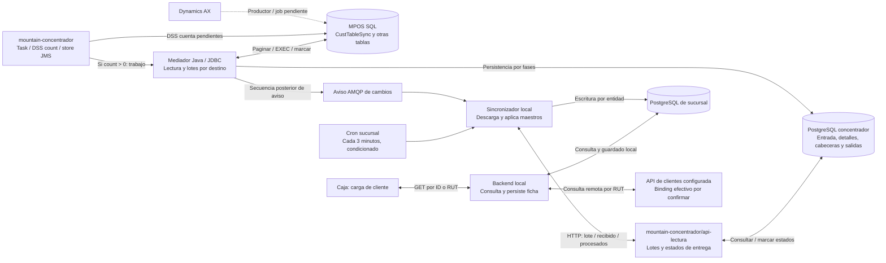

# Apuntes de operación de Chile y contraste con el código

Registro iniciado el 1 de octubre de 2026 y actualizado el 2 de octubre con mountain-concentrador. Reúne los apuntes del usuario sobre la presentación y su contraste con los repositorios recibidos. El video o la transcripción todavía no se han recibido. Las afirmaciones del usuario, sus recuerdos tentativos y la evidencia de código se mantienen diferenciados.

## 1. Resultado por apunte

| ID | Apunte recibido | Resultado del contraste | Cómo se incorpora |
| --- | --- | --- | --- |
| AP-01 | La caja no maneja stock. | **Aclaración operativa del usuario.** El repositorio contiene funciones de inventario, pero su presencia no demuestra uso en caja ni autoridad sobre existencias. No se identificó una llamada equivalente de reserva/decremento local en el flujo de venta inspeccionado. | No imponer un módulo de stock ni movimientos de inventario local como parte obligatoria de la venta. Identificar quién realiza la reserva externa mencionada anteriormente. |
| AP-02 | Hay una base SQL MPOS con tablas de cambios de clientes, direcciones y contactos. | **Nombre y lectores corroborados.** BOAX fija MPOS y adaptadores Java identifican CustTableSync, LogisticsPostalAddressSync y LogisticsElectronicAddressSync. DDL, cuerpos SP y productor siguen pendientes. | Registrar MPOS comprobado en el lector, separado de AX y PostgreSQL; no inferir ubicación ni replicación. |
| AP-03 | Esos procesos corren una vez al día; MPOS estaría en el mismo servidor de AX. | **Hipótesis, expresada con duda por el usuario.** No hay evidencia suficiente del job central ni de su ubicación. El cron de sucursal revisado busca maestros cada tres minutos, con condiciones; es otra etapa. | Separar cadencia AX → MPOS, generación de lotes y descarga/aplicación en sucursal. No afirmar servidor compartido ni sincronización global diaria. |
| AP-04 | Al ingresar el RUT se actualiza el cliente, por lo que quizás no necesita sincronización. | **Confirmado parcialmente.** Seleccionar/cargar un cliente dispara una consulta remota y persistencia local; no todo tecleo del RUT equivale a ese recorrido. El mecanismo evita esperar al lote de ese cliente, pero complementa la sincronización masiva. | Documentar ambos caminos y las reglas de frescura/conflicto. La llamada observada consulta datos; no demuestra una modificación del cliente en AX. |
| AP-05 | Los cambios de AX se pasan a MPOS; algunos procesos consultan tablas continuamente, posiblemente WSO2. | **Lectores centrales corroborados.** Task WSO2 llama DSS count; una secuencia encola trabajo y Java consulta MPOS por JDBC. Productor AX→MPOS y tareas activas siguen pendientes; los CAR difieren de fuentes. | Separar polling configurado de calendario real y conservar AX→MPOS como productor por verificar. |
| AP-06 | Otro proceso genera el lote y lo pasa a las bases locales. | **Generador y consumidor corroborados.** Java crea lotes PostgreSQL por destino; api-lectura los entrega y sync escribe localmente. Se conocen tablas y estados en ambos lados. | Mostrar descarga/aplicación local y fronteras de persistencia; no dibujar escritura SQL central directa hacia sucursal. |
| AP-07 | Instacheck ya no funciona como integrador. | **Actualización operativa del usuario.** El código todavía conserva ramas y configuración de Instacheck; eso no prueba que estén activas. | Marcarlo como no operativo según el usuario, conservar la diapositiva como fuente histórica e identificar la configuración/proveedor vigente. No extender la conclusión a Orsan. |
| AP-08 | Ventana L–V 07:00–22:00 y sábado 07:00–16:00; fuera de ella la tienda no sincroniza. | **Regla operativa informada; diferencias con código.** El snapshot permite domingo 07:00–22:00 y no aplica la misma compuerta a AMQP, rutas manuales y trabajos ya iniciados. | Confirmar el artefacto desplegado, zona horaria, domingos/festivos y política por flujo. No presentar el código como prueba de la operación real ni el relato como descripción de todas las rutas. |
| AP-09 | Los sábados fuera de esa ventana se mantienen las bases. | **Informado y compatible parcialmente con el cron revisado.** Falta inventario de bases intervenidas y procedimiento productivo. | Diseñar mantenimiento con admisión, drenaje y checkpoints; distinguir servidor local de bases centrales/ERP. |

## 2. Alcance de esta verificación

Se revisaron los snapshots ya usados en el proyecto, sin actualizar ramas ni modificar código:

| Repositorio | Referencia principal | Commit |
| --- | --- | --- |
| Mountain, frontend/backend/concentrador | `master` | `711f97fd7948c696bf45c992c5b121683bdbacd7` |
| Sincronizador de sucursal | `master`, consultado por Git; el checkout conserva `desarrollo` | `540ab9a70e7befbca27a2f7eb88b87b25109e4d1` |
| APIs corporativas | `master` | `8fbe2f1b4d4e464a403aa3daca63ffe712a9dd70` |
| Mountain concentrador, WSO2/DSS/Java y api-lectura | Predeterminada `Pablo`, checkout detached; no `main` | `b2fd1ec266d131abb54b7076d41acce30f045119` |

La revisión es estática: no se ejecutaron aplicaciones, jobs, consultas SQL, APIs ni pruebas contra servicios de la empresa. Los commits y configuraciones productivos siguen pendientes de vincular a los binarios instalados. No se reproducen credenciales ni direcciones de infraestructura.

## 3. Stock: alcance operativo frente a funciones presentes

El antecedente actual es que **la caja no gestiona stock**. El desfase previamente informado —inventario reservado antes de que aparezca la deuda en AX— no demuestra que la caja sea quien reserva. Hay que identificar el proceso y sistema responsables de esa reserva, su relación con la orden de venta y el momento de consumo/liberación.

Mountain contiene rutas `documento-ingresos`; al guardar un ingreso se invoca un servicio que suma stock en una bodega. `BodegasService` modifica `bodegas_has_productos.stock` y registra logs; también contempla una acción de resta. Esto demuestra código disponible, no habilitación o utilización productiva de esas funciones por caja. [Rutas de ingreso](https://github.com/developer-implementos/mountain-implementos/blob/711f97fd7948c696bf45c992c5b121683bdbacd7/backend/start/routes.js#L237-L238), [llamada de ingreso](https://github.com/developer-implementos/mountain-implementos/blob/711f97fd7948c696bf45c992c5b121683bdbacd7/backend/app/Controllers/Http/DocumentoIngresosController.js#L193-L208), [servicio de bodega](https://github.com/developer-implementos/mountain-implementos/blob/711f97fd7948c696bf45c992c5b121683bdbacd7/backend/app/Services/BodegasService.js#L9-L41).

**Efecto en la arquitectura objetivo:** mantener la autoridad de stock en el sistema responsable y conservar las referencias necesarias en la venta. Solo incorporar proyecciones, reservas o cupos locales si se acuerdan como requisitos del nuevo POS. Una base local de ventas y catálogo no implica una base autoritativa de inventario.

## 4. AX, MPOS y distribución de maestros

### Tres etapas y tres cadencias posibles

La auditoría de `mountain-concentrador` completa el tramo central. **MPOS está comprobado como base usada por Java**, con `MPOS.dbo.CustTableSync`, `LogisticsPostalAddressSync` y `LogisticsElectronicAddressSync` como tablas de cambios de clientes, direcciones y contactos. Los lectores indican sus SP; no se recibió el productor que llena esas tablas desde AX, el DDL ni los cuerpos de los procedimientos. [MPOS, datasource y estados de origen](https://github.com/developer-implementos/mountain-concentrador/blob/b2fd1ec266d131abb54b7076d41acce30f045119/ClassRegistraMensajeDetalle/src/main/java/cl/implementos/BO/AX/BOAX.java#L45-L69); [Tabla de clientes, SP y lectura JDBC](https://github.com/developer-implementos/mountain-concentrador/blob/b2fd1ec266d131abb54b7076d41acce30f045119/ClassRegistraMensajeDetalle/src/main/java/cl/implementos/BO/AX/tables/BOCliente.java#L26-L83); [Tabla y SP de direcciones](https://github.com/developer-implementos/mountain-concentrador/blob/b2fd1ec266d131abb54b7076d41acce30f045119/ClassRegistraMensajeDetalle/src/main/java/cl/implementos/BO/AX/tables/BODireccion.java#L26-L33); [Tabla y SP de contactos](https://github.com/developer-implementos/mountain-concentrador/blob/b2fd1ec266d131abb54b7076d41acce30f045119/ClassRegistraMensajeDetalle/src/main/java/cl/implementos/BO/AX/tables/BOContacto.java#L26-L33).

| Etapa | Qué se sabe | Qué falta |
| --- | --- | --- |
| AX → MPOS | El usuario informa el traspaso; BOAX fija MPOS y sus lectores identifican tablas/SP. | Productor real, detección de cambios/bajas, cuerpos SP, job diario y ubicación física. |
| MPOS → lotes por sucursal | Tarea WSO2 llama DSS count; si hay pendientes encola trabajo. Java consulta directamente por JDBC y genera tablas PostgreSQL de entrada, detalles, cabeceras y salidas por destino. | Artefactos activos, datasource DSS, DDL, retención, reconciliación y latencia real. |
| Lotes → base local | api-lectura expone cambios/recibido/procesados/sin-procesar; sync consume por nombreEntidad y aplica maestros localmente. | Binding instalado, cobertura de sucursales y pruebas de reentrega, deduplicación y restore. |

No debe equipararse “proceso diario” con “la caja sincroniza una vez al día”. La tarea **fuente** de clientes declara `interval=10`; contactos 20 y direcciones 25. Los XML dentro de los CAR etiquetados PROD/QA/DESA contienen diferencias, incluido `count=0` en algunas variantes. Estos archivos no acreditan las tareas efectivamente activas ni el horario del productor AX→MPOS. El [informe central](analisis-repositorios/mountain-concentrador-maestros.md) conserva inventario y límites. [Task de clientes](https://github.com/developer-implementos/mountain-concentrador/blob/b2fd1ec266d131abb54b7076d41acce30f045119/ESBImplementos/src/main/synapse-config/tasks/Task_SincronizaClientes.xml#L1-L9); [Trigger fuente Contactos](https://github.com/developer-implementos/mountain-concentrador/blob/b2fd1ec266d131abb54b7076d41acce30f045119/ESBImplementos/src/main/synapse-config/tasks/Task_SincronizaContactos.xml#L2-L3); [Trigger fuente Direcciones](https://github.com/developer-implementos/mountain-concentrador/blob/b2fd1ec266d131abb54b7076d41acce30f045119/ESBImplementos/src/main/synapse-config/tasks/Task_SincronizaDirecciones.xml#L2-L3); [Archivo CAR etiquetado PROD, inspección ZIP estática](https://github.com/developer-implementos/mountain-concentrador/blob/b2fd1ec266d131abb54b7076d41acce30f045119/CAR/PROD_E_Task_1.0.0.car); [Archivo CAR etiquetado QA, inspección ZIP estática](https://github.com/developer-implementos/mountain-concentrador/blob/b2fd1ec266d131abb54b7076d41acce30f045119/CAR/QA_E_Task_1.0.6.car); [Archivo CAR etiquetado DESA, inspección ZIP estática](https://github.com/developer-implementos/mountain-concentrador/blob/b2fd1ec266d131abb54b7076d41acce30f045119/CAR/DESA_E_Task_1.0.3.car).

En sucursal hay un cron cada tres minutos que, después de tareas de reenvío, busca maestros si lo permiten la ventana y `CRON_BUSCAR_CAMBIOS`. Incluye clientes, saldos, direcciones y contactos, entre otros. La ejecución puede demorar: el intervalo no garantiza frescura de tres minutos. También se buscan cambios por aviso AMQP de salida. [Búsqueda cada tres minutos, condiciones](https://github.com/developer-implementos/mountain-sync-sucursal/blob/540ab9a70e7befbca27a2f7eb88b87b25109e4d1/start/cronHooks.js#L117-L151); [aviso y búsqueda](https://github.com/developer-implementos/mountain-sync-sucursal/blob/540ab9a70e7befbca27a2f7eb88b87b25109e4d1/app/Services/ColaMensajeService.js#L97-L114).

### Generación, descarga y acuses son fronteras distintas

DSS cuenta registros con `Procesado=0`. El payload lo obtiene el mediador Java directamente por JDBC, mediante paginación y SP: **DSS no transporta necesariamente todo el lote**. `BOGuardarData` persiste detalles, marca MPOS procesado y después crea cabeceras/salidas por sucursal. Esas fases no comparten una transacción global SQL Server/PostgreSQL; `Procesado=1` en MPOS no significa aplicado en todas las sucursales. [DSS: count, SP y actualización](https://github.com/developer-implementos/mountain-concentrador/blob/b2fd1ec266d131abb54b7076d41acce30f045119/DSConcentrador/dataservice/DSS_AX_Clientes.dbs#L1-L83); [SOAPAction opGetCountClientesAX](https://github.com/developer-implementos/mountain-concentrador/blob/b2fd1ec266d131abb54b7076d41acce30f045119/ESBImplementos/src/main/synapse-config/templates/TP_DSS_AX_Clientes.xml#L9-L22); [Procesar cambios AX y seleccionar camino](https://github.com/developer-implementos/mountain-concentrador/blob/b2fd1ec266d131abb54b7076d41acce30f045119/ClassRegistraMensajeDetalle/src/main/java/cl/implementos/RegistraMensajeDetalle.java#L962-L1062); [Tabla de clientes, SP y lectura JDBC](https://github.com/developer-implementos/mountain-concentrador/blob/b2fd1ec266d131abb54b7076d41acce30f045119/ClassRegistraMensajeDetalle/src/main/java/cl/implementos/BO/AX/tables/BOCliente.java#L26-L83); [Generar detalles, marcar origen y guardar salidas](https://github.com/developer-implementos/mountain-concentrador/blob/b2fd1ec266d131abb54b7076d41acce30f045119/ClassRegistraMensajeDetalle/src/main/java/cl/implementos/BO/BOGuardarData.java#L56-L208); [Bulk de salidas con conexión compartida](https://github.com/developer-implementos/mountain-concentrador/blob/b2fd1ec266d131abb54b7076d41acce30f045119/ClassRegistraMensajeDetalle/src/main/java/cl/implementos/BO/BOMensajeSalida.java#L47-L96).

El repositorio contiene ahora el **receptor api-lectura**, con contrato compatible con los GET/POST de sync y parámetro `nombreEntidad`. `GET cambios` selecciona una salida y marca `enviado=true` antes de responder; sync acusa `recibido` antes de persistir el sobre local. La consulta `sin-procesar` filtra `enviado=true/procesado=false`, **sin filtrar recibido_sucursal**, de modo que un lote acusado sin copia local sigue siendo elegible. Esto corrige la incertidumbre anterior sobre esa selección, pero no prueba retención o recuperación exitosa en producción. [Cuatro rutas API lectura](https://github.com/developer-implementos/mountain-concentrador/blob/b2fd1ec266d131abb54b7076d41acce30f045119/api-lectura/start/routes.js#L19-L26); [GET cambios modifica estado y confirma trx](https://github.com/developer-implementos/mountain-concentrador/blob/b2fd1ec266d131abb54b7076d41acce30f045119/api-lectura/app/Controllers/Http/MensajeSalidasController.js#L19-L109); [Elegibilidad, selección, enviado y recuperación](https://github.com/developer-implementos/mountain-concentrador/blob/b2fd1ec266d131abb54b7076d41acce30f045119/api-lectura/app/Services/MensajeSalidaService.js#L9-L134); [Sin procesar y recibido](https://github.com/developer-implementos/mountain-concentrador/blob/b2fd1ec266d131abb54b7076d41acce30f045119/api-lectura/app/Controllers/Http/MensajeSalidasController.js#L112-L191); [Sync acusa antes de guardar](https://github.com/developer-implementos/mountain-sync-sucursal/blob/540ab9a70e7befbca27a2f7eb88b87b25109e4d1/app/Services/LlamadaApis/CambiosConcentradorService.js#L79-L111); [Relectura de pendientes](https://github.com/developer-implementos/mountain-sync-sucursal/blob/540ab9a70e7befbca27a2f7eb88b87b25109e4d1/app/Services/LlamadaApis/CambiosConcentradorService.js#L118-L164); [GET y POST hacia API lectura](https://github.com/developer-implementos/mountain-sync-sucursal/blob/540ab9a70e7befbca27a2f7eb88b87b25109e4d1/app/Services/LlamadaApis/CambiosConcentradorService.js#L164-L287).

Sync conserva el sobre en `sincronizador.mensajes` y `sincronizador.mensaje_detalles`, aplica por detalle y transmite resultados, incluidos errores. Central marca detalles/salida e incrementa contadores: repetir `POST procesados` vuelve a sumarlos, y `total_sincronizados` incluye resultados con error. No es una medición de éxitos ni un acuse idempotente demostrado. [Persistir entrada y detalles en transacción local](https://github.com/developer-implementos/mountain-sync-sucursal/blob/540ab9a70e7befbca27a2f7eb88b87b25109e4d1/app/Services/MensajeService.js#L15-L74); [sincronizador.mensajes explícita](https://github.com/developer-implementos/mountain-sync-sucursal/blob/540ab9a70e7befbca27a2f7eb88b87b25109e4d1/app/Models/Mensaje.js#L6-L14); [sincronizador.mensaje_detalles explícita](https://github.com/developer-implementos/mountain-sync-sucursal/blob/540ab9a70e7befbca27a2f7eb88b87b25109e4d1/app/Models/MensajeDetalle.js#L6-L14); [Transacción por detalle y resultados](https://github.com/developer-implementos/mountain-sync-sucursal/blob/540ab9a70e7befbca27a2f7eb88b87b25109e4d1/app/Services/MensajeDetalleService.js#L113-L335); [Procesados, contadores y estado de lote](https://github.com/developer-implementos/mountain-concentrador/blob/b2fd1ec266d131abb54b7076d41acce30f045119/api-lectura/app/Controllers/Http/MensajeSalidasController.js#L194-L277).

El cliente distingue configuración `API_LECTURA_*` y fallback `ESB_*`. Además existe una API WSO2 paralela con `codigoEntidad`, distinta del contrato Node `nombreEntidad`, y diferencias de elegibilidad. Deben identificarse prefijos y artefactos instalados; no se presume una misma instancia por compartir nombres. [Cliente HTTP](https://github.com/developer-implementos/mountain-sync-sucursal/blob/540ab9a70e7befbca27a2f7eb88b87b25109e4d1/app/Utils/Axios.js#L23-L43); [API WSO2 paralela: contrato diferente](https://github.com/developer-implementos/mountain-concentrador/blob/b2fd1ec266d131abb54b7076d41acce30f045119/ESBImplementos/src/main/synapse-config/api/API_mensajeSalidas.xml#L2-L101); [Variante Java exige cero pendientes enviados](https://github.com/developer-implementos/mountain-concentrador/blob/b2fd1ec266d131abb54b7076d41acce30f045119/ClassRegistraMensajeDetalle/src/main/java/cl/implementos/BO/BOMensajeSalida.java#L145-L164).

### Vista combinada con incertidumbre explícita

Solo AX→MPOS sigue punteado como productor no recibido. Los lectores centrales, persistencia y receptores se apoyan en código; su presencia no acredita ubicación física, versión instalada ni tarea activa. El aviso transporta una señal de búsqueda, no todos los maestros.

El posible job diario se mantiene **solo** en el tramo AX→MPOS pendiente. No se asume que MPOS comparta servidor con AX ni que sea el concentrador PostgreSQL. La existencia de una ruta de recuperación no reemplaza ensayos de corte entre marca de origen, distribución, respuesta HTTP, acuse, commit local y notificación final.

## 5. Qué sucede al buscar o cargar un cliente por RUT

### Búsqueda local y refresco remoto son caminos complementarios

1. El selector consulta `GET empresas?formato=simple&buscar=…`; el backend busca en `personas` y `empresas` locales. [Servicio frontend](https://github.com/developer-implementos/mountain-implementos/blob/711f97fd7948c696bf45c992c5b121683bdbacd7/frontend/src/app/services/empresas.service.ts#L24-L35), [consulta local](https://github.com/developer-implementos/mountain-implementos/blob/711f97fd7948c696bf45c992c5b121683bdbacd7/backend/app/Controllers/Http/EmpresaController.js#L546-L583).
2. Seleccionar un cliente lleva a cargar `GET empresas/{id}`. `EmpresaController.view` intenta `buscarClienteEnLinea` antes de devolver la ficha local. [Selección](https://github.com/developer-implementos/mountain-implementos/blob/711f97fd7948c696bf45c992c5b121683bdbacd7/frontend/src/app/modules/pos/components/pos-detalle-venta-actual/pos-detalle-venta-actual.component.ts#L401-L425), [controlador](https://github.com/developer-implementos/mountain-implementos/blob/711f97fd7948c696bf45c992c5b121683bdbacd7/backend/app/Controllers/Http/EmpresaController.js#L66-L92).
3. El servicio obtiene el RUT y consulta el endpoint configurado `cliente` con `_rutCliente`, con timeout de 30 segundos. Si recibe datos válidos, llama a `guardaClienteAX`. [Consulta remota](https://github.com/developer-implementos/mountain-implementos/blob/711f97fd7948c696bf45c992c5b121683bdbacd7/backend/app/Services/EmpresaService.js#L30-L88).
4. Se guardan persona, empresa, clasificaciones, bloqueo, giro, direcciones y datos de cupo/plazo del estado de cuenta dentro de una transacción local. Después se lee la ficha local para la respuesta. [Persistencia](https://github.com/developer-implementos/mountain-implementos/blob/711f97fd7948c696bf45c992c5b121683bdbacd7/backend/app/Services/EmpresaService.js#L130-L249).
5. Para un cliente que no aparece localmente existe la ruta `empresas/null?rut=…`; puede crear la copia local si la API lo devuelve. [Alta de copia por RUT](https://github.com/developer-implementos/mountain-implementos/blob/711f97fd7948c696bf45c992c5b121683bdbacd7/frontend/src/app/modules/pos/components/pos-detalle-venta-actual/pos-detalle-venta-actual.component.ts#L603-L628).

**Conclusión:** el refresco bajo demanda permite obtener ese cliente sin esperar al próximo lote. No reemplaza la distribución de maestros a otras cajas ni la sincronización de cambios originados localmente. La ruta observada hace un GET y actualiza la copia local; no prueba una escritura del cliente en AX por el hecho de ingresar el RUT. El nombre `guardaClienteAX` tampoco identifica por sí solo el servidor que atiende la API: no se localizó el contrato exacto en las APIs corporativas examinadas.

### Los contactos tienen un tratamiento distinto

El guardado de la ficha anterior no llama a `guardarContactos`. Existe una consulta separada de contacto de compra del cliente express: el servicio devuelve datos sin persistirlos en ese método, y el formulario los aplica tras cambios del RUT con debounce de 500 ms. No afirmar que toda consulta de RUT sincroniza todos los contactos. La sincronización masiva sí tiene un tratamiento específico de contactos. [Consulta express](https://github.com/developer-implementos/mountain-implementos/blob/711f97fd7948c696bf45c992c5b121683bdbacd7/backend/app/Services/EmpresaService.js#L92-L127), [formulario](https://github.com/developer-implementos/mountain-implementos/blob/711f97fd7948c696bf45c992c5b121683bdbacd7/frontend/src/app/modules/pos/components/pos-detalle-venta-actual/pos-detalle-venta-actual.component.ts#L451-L487).

### Nueva dependencia a considerar para offline

Si falla la consulta remota, el backend puede conservar el cliente local en `data` y devolver a la vez `error: true`. La página principal del POS comprueba ese error y limpia la venta. Otro método del componente de detalle usa `data` sin comprobar el error, de modo que no existe un fallback uniforme en los recorridos inspeccionados. Es un comportamiento de código, no una incidencia productiva reproducida. [Respuesta del backend](https://github.com/developer-implementos/mountain-implementos/blob/711f97fd7948c696bf45c992c5b121683bdbacd7/backend/app/Controllers/Http/EmpresaController.js#L169-L182), [flujo principal](https://github.com/developer-implementos/mountain-implementos/blob/711f97fd7948c696bf45c992c5b121683bdbacd7/frontend/src/app/modules/pos/pages/punto-de-venta/punto-de-venta.component.ts#L410-L445), [otro consumidor](https://github.com/developer-implementos/mountain-implementos/blob/711f97fd7948c696bf45c992c5b121683bdbacd7/frontend/src/app/modules/pos/components/pos-detalle-venta-actual/pos-detalle-venta-actual.component.ts#L356-L367).

La arquitectura objetivo necesita distinguir “cliente local disponible”, “refresco pendiente/fallido”, “cliente no conocido localmente” y “operación autorizada con esta versión de datos”. Leer una copia local no concede crédito ni elimina un bloqueo: esas decisiones requieren políticas de vigencia y riesgo. Probar los recorridos completos de selección/carga con la API caída, incluyendo preservación de la venta en curso.

## 6. Instacheck: estado informado y huellas en el código

Se adopta el antecedente del usuario: **Instacheck ya no funciona como integrador**. La imagen y las tablas originales son históricas. No se presupone que esté operativo porque aparezca en ellas ni se infiere cuál es su reemplazo.

Mountain conserva casos `instacheck` e `instacheck-api` en `ChequeVerificacionService`, junto con una variante Orsan. El controller pasa el tipo recibido al servicio; la interfaz usa configuración para seleccionar el verificador. El modelo frontend incluso contiene un valor inicial Instacheck. Estas huellas permiten localizar el componente para inventario/retirada, pero no demuestran la configuración efectiva de las tiendas. [Despacho por tipo](https://github.com/developer-implementos/mountain-implementos/blob/711f97fd7948c696bf45c992c5b121683bdbacd7/backend/app/Services/Cheque/ChequeVerificacionService.js#L57-L161), [controller](https://github.com/developer-implementos/mountain-implementos/blob/711f97fd7948c696bf45c992c5b121683bdbacd7/backend/app/Controllers/Http/ChequesController.js#L10-L21), [configuración inicial](https://github.com/developer-implementos/mountain-implementos/blob/711f97fd7948c696bf45c992c5b121683bdbacd7/frontend/src/app/models/configuraciones.model.ts#L70-L80), [selección en interfaz](https://github.com/developer-implementos/mountain-implementos/blob/711f97fd7948c696bf45c992c5b121683bdbacd7/frontend/src/app/modules/pos/components/modals/modal-pagar/modal-pagar.component.ts#L110-L123).

Pedir al equipo el proveedor/procedimiento vigente para cheques, el alcance de la salida de uso de Instacheck y las configuraciones residuales. No es necesario probar su endpoint ni realizar validaciones reales de cheques para organizar esta información.

## 7. Horarios de sincronización y mantenimiento

Se registra el horario aportado: **lunes a viernes de 07:00 a 22:00; sábado de 07:00 a 16:00**. El usuario indica que fuera de esas ventanas la tienda no sincroniza y que el sábado se aprovecha para mantenimiento de bases. Domingos, festivos, excepciones y zona efectiva deben quedar explícitos en el procedimiento.

El `master` inspeccionado tiene sábado `07:00 ≤ hora < 16:00` y otros días —incluido domingo— `07:00 ≤ hora < 22:00`. La configuración horaria del cron no garantiza que `new Date().getHours()/getDay()` use esa zona. La recepción AMQP, rutas manuales y búsquedas encadenadas no comparten necesariamente el control; un trabajo iniciado puede continuar después del cierre. Esto es una **discrepancia por resolver**, no evidencia de incumplimiento ocurrido en producción. [Informe y referencias del sincronizador](analisis-repositorios/mountain-sync-sucursal.md#4-calendario-y-reintentos-reales-del-código).

La [revisión de resiliencia](revision-resiliencia-datos-pos.md) detalla el mantenimiento encontrado y propone controles por clase de trabajo. El nuevo POS debe distinguir estar sin red, diferido por horario, detenido por mantenimiento, en reintento y en cuarentena. Un ACK exige persistencia durable, también durante cambios de ventana. La [revisión corporativa](revision-arquitectura-corporativa.md) evalúa recibir ventas centralmente aunque su publicación al ERP espere su ventana.

## 8. Evidencia pendiente y efecto sobre la propuesta

| Evidencia concreta a solicitar | Qué permite resolver |
| --- | --- |
| DDL e inventario lógico de MPOS; jobs o productores de cambios de AX, sin datos ni credenciales | Confirmar nombre, función, ubicación y cómo llegan altas, cambios y bajas. |
| Cadencia de cada etapa por entidad, con hora/zona, última ejecución y volumen | Separar el recuerdo del proceso diario del polling central y del cron de sucursal. |
| Artefactos WSO2/SQL/API de lectura y generador de lotes | Verificar el tramo faltante, las garantías de retención, los checkpoints y la recuperación después de acuses. |
| Componente que atiende la API de clientes y contrato desplegado | Determinar origen efectivo, campos refrescados, controles de acceso y comportamiento ante error. |
| Reglas de convivencia entre lotes, refresco por RUT y cambios locales pendientes | Evitar que un dato atrasado reemplace uno nuevo o borre una modificación pendiente; definir versión y dueño por atributo. |
| Proceso que crea/consume/libera la reserva de inventario | Aclarar el desfase reserva/deuda sin atribuir inventario a la caja. |
| Configuración/procedimiento vigente de cheques | Reflejar la salida de uso de Instacheck sin asumir el estado de Orsan o de otros proveedores. |
| Calendario efectivo, TZ del proceso/SO, excepciones y procedimiento de mantenimiento por base | Resolver la diferencia dominical, comprobar qué rutas se detienen y dimensionar acumulación/reconexión. |

Estos elementos amplían E02/E03/E05/E08 y se reúnen en E12 de la [solicitud al equipo](solicitud-informacion-equipo.md). La [propuesta](propuesta-arquitectura.md) se ajusta para no imponer stock local, mantener el doble camino de actualización de maestros y exigir continuidad explícita al fallar el refresco de cliente. La futura transcripción podrá precisar el tramo central sin reemplazar la evidencia de implementación.
