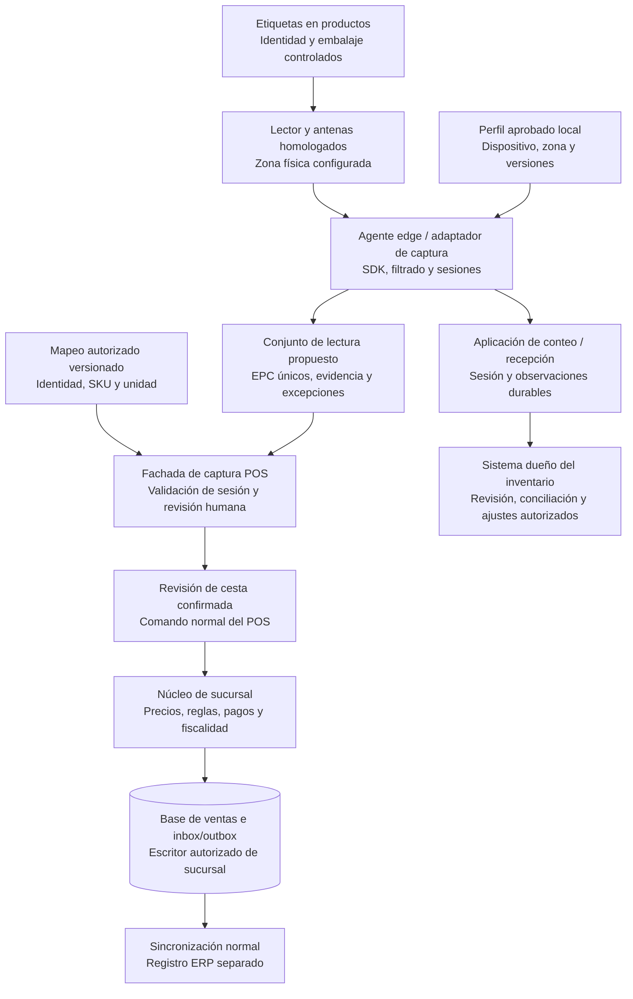

# Evolución futura: RFID, conteos y autoservicio

Fecha: **1 de octubre de 2026**. Estado: **oportunidad futura informada por el usuario; alcance, presupuesto, hardware y despliegue sin aprobar**. Complementa la [propuesta POS](propuesta-arquitectura.md), la [extensibilidad de dispositivos](extensibilidad-proveedores-dispositivos.md) y la [resiliencia de datos](revision-resiliencia-datos-pos.md).

La arquitectura puede preparar puntos de extensión para lectura RFID sin convertirla en requisito de la primera entrega. **RFID identifica objetos; no cobra, no acredita una venta y no convierte al POS en dueño del inventario.** El antecedente informado se mantiene: la caja actual no maneja stock. El autoservicio es una decisión de producto separada, que podría utilizar RFID, códigos de barras o ambos.

## 1. Qué aporta el ejemplo de Decathlon

Decathlon describe un programa que integra identificación desde fabricación, logística, conteos y venta; también documenta cambios de embalaje y ubicación de etiquetas para materiales difíciles. Es un antecedente de transformación de la cadena, no evidencia de que baste instalar un lector en caja. [Trazabilidad y RFID en Decathlon, página con hitos hasta 2024](https://sustainability.decathlon.com/product-traceability-and-rfid-technology-at-decathlon).

Su material de 2021 presenta lectura para caja asistida y experiencias donde el cliente confirma la cesta y después paga. Sirve como referencia de interacción; no describe el POS de Implementos ni demuestra compatibilidad con sus productos, proveedores o condiciones offline. No trasladamos porcentajes comerciales de precisión, tiempos o ahorro a esta propuesta. [Antecedente oficial de Decathlon](https://www.decathlon-united.media/media/decathlon-united-rfid-en).

## 2. Cuatro capacidades que deben decidirse por separado

| Capacidad futura | Responsable y valor posible | Límite de alcance |
| --- | --- | --- |
| Etiquetado y trazabilidad de unidades | Proveedores, compras, catálogo y logística: identidad desde origen o recepción, calidad del etiquetado y relación con producto/unidad. | Antes de leer masivamente, alguien debe asignar, aplicar y verificar los identificadores. No se asume que todos los proveedores etiqueten. |
| Recepción, conteos y ubicaciones | Equipo y sistema dueño del inventario: capturar observaciones para revisar diferencias y movimientos. | No crear una segunda autoridad de stock en caja ni ajustar existencias por cada lectura. |
| Lectura de cesta asistida | POS: preparar líneas y cantidades candidatas para que el operador revise y use el flujo normal de venta. | Leer no inicia un cobro, reserva, emisión fiscal ni registro ERP. |
| Autoservicio | Producto y operaciones: experiencia, supervisión, accesibilidad, excepciones y prevención de pérdidas. | No depende conceptualmente de RFID; requiere validaciones propias de pagos, fiscalidad, permisos y atención al cliente. |

No se ha auditado una implementación RFID de la empresa ni confirmado lectores, etiquetas, serialización, EPCIS o capacidades de inventario disponibles. Los componentes y contratos siguientes son **diseño propuesto**, no soporte actual.

## 3. Identidad: producto, unidad física y etiqueta

| Concepto | Significado y uso propuesto |
| --- | --- |
| GTIN y código EAN/UPC habitual | GTIN identifica una clase de artículo comercial; EAN/UPC es una forma de representarlo. No identifica por sí solo cuál de dos unidades iguales se leyó. El SKU interno se obtiene mediante un mapeo autorizado. |
| EPC de una unidad vendible | Elegir un esquema aprobado; por ejemplo, SGTIN combina GTIN y número de serie para identificar una instancia. Un EPC también puede representar otros objetos según su esquema: no tratar toda etiqueta como una unidad de venta. |
| TID | Identifica características del chip y, cuando exista, su serial propio; no es el EPC del producto ni un SKU. No asumir unicidad serial o autenticación universal por disponer de TID. |

Estas distinciones provienen de [GS1: claves, EPC y TID](https://www.gs1.org/services/epc-encoder/faqs) y [serialización en GS1](https://support.gs1.org/support/solutions/articles/43000734238-how-does-serialisation-differ-from-unique-identification-in-the-gs1-system-). EPC Gen2 regula la comunicación entre lector y etiquetas UHF pasivas; el esquema de datos se define por separado. La conformidad de radio no demuestra que el catálogo entienda la identidad ni que la cesta esté completa. [GS1 Gen2](https://www.gs1.org/standards/rfid/uhf-air-interface-protocol), [Tag Data Standard](https://ref.gs1.org/standards/tds/).

Mantener un registro autoritativo de **identidad canónica → producto/SKU, unidad de venta, nivel de embalaje y, cuando corresponda, lote/serie**, con fuente y versión. Validar emisor/esquema, normalización y unicidad; no truncar códigos ni perder ceros significativos. La migración ERP cambia mapeos controlados, no la historia de la unidad. Identidades desconocidas o ambiguas quedan fuera de incorporación automática.

Deduplicar observaciones repetidas por identidad canónica dentro de la sesión. **Tres EPC distintos del mismo SKU pueden representar tres unidades**, si el mapeo confirma que cada uno corresponde a una unidad vendible. Deduplicar por SKU perdería cantidades; contar cada lectura multiplicaría artificialmente las unidades. Una identidad duplicada por error de codificación o clonación requiere investigación: leer el mismo EPC no prueba que haya un solo objeto físico ni que sea auténtico.

## 4. Viabilidad física y económica antes de elegir equipos

En autopartes deben probarse piezas metálicas, líquidos, embalajes aluminizados, orientación y acumulación de productos. Existen diseños de etiquetas para aplicaciones específicas; ello no hace intercambiables todas las etiquetas. [Tipos y materiales de etiquetas RAIN](https://therainalliance.org/what-is-rain/tags/), [GS1: metal y agua](https://support.gs1.org/support/solutions/articles/43000734154-does-rfid-work-around-metal-and-water-).

La zona física de lectura requiere diseño: antenas, potencia, proximidad, apantallamiento cuando corresponda y coordinación con lectores vecinos. RAIN documenta interferencia y reflexiones que pueden producir omisiones o extender la lectura fuera del área esperada; más alcance no siempre mejora el resultado. La intensidad recibida o repetición de una señal no certifica por sí sola pertenencia a la cesta. [RAIN, lecciones de campo, §§3.4–3.10](https://therainalliance.org/wp-content/uploads/2021/04/RAIN_RFID_Lessons_learned_from_the_field.pdf).

Definir reglas distintas para pieza, consumible, caja cerrada, paquete, kit y venta a granel. Una etiqueta en un embalaje no implica que todas sus unidades interiores tengan serial propio o sigan dentro; no contar a la vez el contenedor y sus componentes. Un kit requiere composición autorizada; granel, longitud o peso siguen su método de cantidad validado.

Homologar combinación de etiqueta, ubicación, lector, antena, SDK, firmware y entorno por país/sucursal. La configuración de radio permitida debe validarse localmente antes del piloto; no extrapolar parámetros de España a Chile o Perú. Las tablas de RAIN son una guía, no sustituyen esa comprobación. [Guía de diseño RAIN, edición 2023](https://therainalliance.org/wp-content/uploads/2023/09/RAIN-RFID_System_Design_Guidelines-V2.pdf).

No se recomienda comprar un modelo concreto todavía. Comparar coste por unidad etiquetada útil, mano de obra de aplicación/verificación, lectores, instalación, soporte, reemplazos y errores frente al proceso con código de barras. La conveniencia puede variar por categoría; no es obligatorio etiquetar todo el surtido.

## 5. Arquitectura preparada para extensión



La aplicación de conteo es una capacidad del dominio de inventario, aunque reutilice el mismo adaptador o equipo de captura. El diagrama no la incorpora al dominio financiero del POS. Una lectura se enruta según propósito y sesión; no alimenta indistintamente una venta y un ajuste de stock.

Reutilizar el catálogo de flota y los perfiles país/entidad/sucursal/caja: puerto de captura tipado, adaptador por SDK y fachada de sesión. Una **ACL —Anti-Corruption Layer—** traduce significado si el proveedor maneja objetos/estados distintos; no reemplaza autorización ni decide cantidades comerciales. Un SDK .NET puede mantenerse en proceso separado. El núcleo desconoce marcas y objetos del SDK. [Contratos y distribución ya propuestos](extensibilidad-proveedores-dispositivos.md).

El agente puede estar en el PC o dispositivo de captura homologado. En el perfil WAN, el servidor de sucursal conserva autoridad sobre la venta; el agente no se convierte en escritor alternativo durante una caída LAN. Si varias aplicaciones comparten lector, se necesita propietario/controlador único y exclusión entre sesiones.

## 6. De observación a cesta: contratos y estados

Contratos conceptuales, independientes del fabricante; no son APIs implementadas:

```text
CaptureSession:
  session_id, purpose(checkout|count|receiving), scope, operator_ref
  device_id, zone_id, profile_revision, started_at, status, revision

TagObservation:
  observation_id, session_id, source_sequence, canonical_identity
  observed_at, received_at, reader_id, antenna_id, signal_metadata_optional

ReadSetProposal:
  proposal_id, session_id, revision, mapping_revision, profile_revision
  accepted_candidates, unknown_identities, ambiguity_flags, completeness_status

ConfirmBasketCapture:
  command_id, sale_session_id, expected_cart_revision
  proposal_id, proposal_revision, reviewed_lines, operator_ref

InventoryObservationBatch:
  batch_id, count_session_id, site, read_point, started_at, ended_at
  mapping_revision, observed_identities, exceptions, scope_and_cutoff
```

Abrir explícitamente una sesión, limitar zona/propósito, observar, normalizar, deduplicar y preparar una propuesta. `ambiguity_flags` registra dudas concretas; no se presenta un porcentaje de confianza como certeza de que todos los productos fueron leídos. La revisión resuelve identidades, cantidades y excepciones antes de enviar un comando normal del POS.

El backend valida permisos, contexto, mapeo y revisión esperada de cesta. Deduplica `command_id` y conserva vínculo entre captura aceptada y líneas; repetir una propuesta aceptada no vuelve a añadirlas. Antes de iniciar el pago, fijar la revisión de cesta y sus importes conforme al flujo normal. Lecturas tardías o cambios de mapeo no la alteran; una modificación exige nuevo flujo explícito y resolver el estado del pago en curso.

Aplicar revisiones por **identidad y vínculo de captura**, actualizando esa contribución sin volver a sumarla ni sobrescribir líneas manuales. Por ejemplo, `{A}` seguido de `{A,B}` incorpora solo B; una lectura posterior `{B}` no elimina A. Quitar A requiere una acción explícita, revisión y control de versión. Cambiar `command_id` no autoriza a insertar de nuevo la misma unidad.

Al confirmar captura, el escritor compartido debe detectar **atómicamente la misma identidad asignada a dos cestas activas de la sucursal** y resolver el conflicto antes de otro cobro. El vínculo no se libera solo por timeout si hay un pago incierto. Es integridad local de cestas, no una reserva global de inventario; devolución/reventa, clonación o error de etiqueta requieren su flujo y evidencia propios.

No hay cobro ni asiento ERP causado únicamente por una lectura. El catálogo de precios/ofertas, controles fiscales y proveedor de pago mantienen sus reglas. Tampoco se marca una etiqueta como vendida para toda la empresa basándose solo en una observación local.

## 7. Fallos y excepciones que el piloto debe resolver

| Situación | Comportamiento propuesto |
| --- | --- |
| Lecturas repetidas o reentrega del mismo lote | Deduplicar observaciones/identidades en la sesión y comandos aceptados; no aumentar cantidades por número de respuestas del lector. |
| Revisiones parcialmente solapadas de captura | Conciliar por identidad/vínculo y revisión de cesta, conservando líneas manuales. No duplicar unidades previas ni eliminar por ausencia en el nuevo lote. |
| Dos cajas confirman simultáneamente el mismo EPC | Detectar conflicto en el escritor de sucursal antes de un segundo cobro; resolverlo sin liberar una cesta con pago incierto por mera expiración. |
| Carrito vecino, pasillo o etiqueta ajena | Filtrar por esquema y contexto, detectar ambigüedad de zona y pedir revisión. No incorporar automáticamente todo lo que alcance la antena. |
| Retiro o incorporación de un producto | Generar revisión explícita de cesta; dejar de leer una etiqueta no demuestra que el producto fue retirado. Verificar físicamente/releer según procedimiento. |
| Tag perdido, dañado u oculto; producto sin etiqueta | Al detectar la excepción mediante revisión física/comparación, marcar captura incompleta y usar identificación alternativa controlada. El lector por sí solo no descubre todos los artículos sin tag; una omisión no significa cantidad cero ni descuento automático de stock. |
| Nuevo SKU, identidad desconocida o mapeo vencido | Bloquear esa incorporación automática; obtener mapeo autorizado o resolver por el procedimiento alternativo. No inventar SKU por similitud o por fragmentos del EPC. |
| Colisión de codificación, clon o etiqueta cambiada | Registrar excepción, no confiar en unicidad aparente ni autenticidad por lectura. Investigar y corregir etiquetado mediante proceso autorizado, preservando trazabilidad. |
| Caja/kit y componentes leídos simultáneamente | Aplicar nivel de venta y composición verificados; evitar contar el padre y sus hijos como unidades independientes. |
| Lectura por RFID y luego EAN/UPC del mismo artículo | El código sin serial no demuestra si es la misma unidad: separar físicamente pendientes o reiniciar/verificar la captura según protocolo. No sumar ambos automáticamente ni deduplicar solo por SKU. |
| Pérdida de lector o LAN durante captura | Conservar estado parcial, impedir una confirmación que presuponga completitud y recuperar o cambiar al procedimiento alternativo controlado. |
| Lectura tardía de sesión anterior o cambio de operador | Rechazar asociación con la nueva cesta; comprobar identidad, cierre y revisión de sesión. No trasladar silenciosamente productos entre clientes. |
| Devolución, cambio de etiqueta o reventa | Operación propia con evidencia y mapeo histórico; no tratar EPC como prohibición perpetua de reventa ni como comprobante de compra suficiente. |

## 8. Offline, custodia y observaciones de inventario

**Pérdida WAN:** la captura para caja puede funcionar con lector, LAN, escritor y mapeo/perfil locales vigentes. La venta se persiste en sucursal y sincroniza por el protocolo existente; esto no autoriza pagos o emisión fiscal offline que sus contratos no permitan. Pérdida del servidor o LAN no habilita una caja autónoma por instalar RFID.

Conservar las propuestas aceptadas y su relación con la venta de forma durable. El agente mantiene la evidencia necesaria hasta el acuse del servidor posterior a su persistencia, con retención para reentrega/restauración; comprobar reinicio y ACK perdido. Las lecturas de radio de alta frecuencia requieren buffers acotados y una política propia de retención: no inundar la outbox financiera ni llenar el disco de ventas con cada observación cruda.

Para conteos, publicar lotes durables con identidad, sitio, zona, ventana temporal, alcance, operador y excepciones. Separar hora observada de hora recibida y controlar desajustes de reloj. El dueño del inventario define corte/concurrencia de movimientos, compara con expectativas, solicita recuentos y decide ajustes; **la ausencia en una pasada no demuestra inexistencia física**.

Un conteo offline es provisional hasta conciliar con el sistema propietario. Lecturas en dos zonas, ventas concurrentes o movimientos durante el conteo no se resuelven con «gana el último timestamp». RFID no evita carreras globales de reserva/stock ni demuestra dónde está ahora una unidad observada antes.

Evaluar EPCIS/CBV si se necesita compartir trazabilidad entre aplicaciones y proveedores: GS1 define eventos con contexto de qué ocurrió, cuándo, dónde y por qué. Es una referencia de interoperabilidad, no una obligación de instalar un repositorio EPCIS en cada caja ni una garantía de exactitud física. [GS1 EPCIS](https://www.gs1.org/standards/epcis).

## 9. Seguridad, privacidad y autoservicio

- Autenticar agente, operador y dispositivos según capacidad; perfiles firmados, mínimos privilegios y adaptadores aprobados. Los datos leídos son entrada no confiable: validar tamaño, formato y esquema; nunca ejecutar contenido de una etiqueta.
- Separar lectura de escritura/codificación, bloqueo o desactivación de tags. Estas últimas operaciones requieren autorización, objetivo concreto, verificación y evidencia; las claves del lector/tag no van en el renderer ni en logs. No codificar PAN, CVV o identidad del cliente.
- No vincular EPC a seguimiento de personas por defecto. Definir propósito, acceso, retención, información al cliente y tratamiento de devoluciones. La combinación de identidades de artículos con otras bases puede afectar privacidad; no se concluye cumplimiento legal para los tres países en este documento. [RAIN: privacidad y confianza](https://therainalliance.org/three-risks-three-solutions-how-rain-protects-data-privacy-and-trust/).
- Si se considera `Kill` u otro modo de privacidad, verificar soporte y consecuencias del tag/proveedor. No desactivar automáticamente por una lectura ni por un pago incierto; desactivar puede impedir usos posteriores de la etiqueta y requiere una decisión de producto/privacidad explícita.
- Autoservicio necesita cesta comprensible, cantidades corregibles, ayuda accesible, intervención autorizada para excepciones y cierre/limpieza de sesión sin borrar operaciones pendientes. Definir medios de pago, documentos y operaciones permitidos; no exponer permisos de cajero a una sesión de cliente.
- Prevención de pérdidas y controles de salida son otra capacidad por evaluar. Ni una alarma ni su desactivación acreditan pago; no reutilizar una lectura como decisión de fraude o seguimiento personal.

## 10. Piloto en tres fases y criterios para avanzar

| Fase propuesta | Trabajo y criterio de decisión |
| --- | --- |
| 1. Línea base y alcance | Un país, una tienda/entorno y un subconjunto representativo de productos; medir proceso con código de barras, definir dueño de identidad/inventario, etiquetado, materiales, unidades y objetivos. Si la alternativa convencional cubre el problema mejor, no escalar RFID. |
| 2. Laboratorio físico y captura asistida | Homologar etiquetas/zona/lector con productos y embalajes reales, sesiones vecinas y fallos. Comparar cesta y conteo con verificación física independiente. Integrar lectura revisada sin automatizar cobro ni ajustes. |
| 3. Piloto operativo e integración | Validar entrega/conciliación con el dueño del inventario antes de escalar conteos; medir valor y soporte en tienda, conservar fallback, desplegar por perfiles. El autoservicio necesita un gate propio posterior o separado. |

Medir falsos añadidos, omisiones, errores de cantidad/unidad, cestas correctas completas, tiempo total con excepciones, tasa de fallback y carga de revisión. Para conteos, registrar cobertura y diferencias resueltas respecto de verificación física; muchos reportes de lectura no equivalen a muchas unidades correctas. Separar métricas por categoría, material, embalaje, zona y combinación de hardware.

Fijar umbrales con negocio antes del piloto; ninguna cifra comercial de otra cadena los sustituye. Probar expresamente los escenarios de §7, revisiones solapadas con líneas manuales, confirmación concurrente en dos cajas, restauración/reentrega y operación WAN. Coste total incluye etiquetas, aplicación, infraestructura radio, integración, mantenimiento y errores; no prometer ROI ni dimensionar lectores a partir del número público de tiendas.

## 11. Evidencia que pedir al equipo

**E19 — Viabilidad RFID y cadena de etiquetado:** paquetes de información propuestos para la siguiente revisión.

1. Dueño y sistema de stock/ubicaciones por país; contratos de recepción, conteo, reserva, ajuste y movimientos concurrentes. ¿Qué flujo se quiere mejorar primero y cuál es su coste/error actual?
2. Cobertura de GTIN, seriales y etiquetas de proveedores; autoridad de asignación, unicidad, reetiquetado y mapeo SKU/unidad antes y después de migrar ERP.
3. Muestra representativa de categorías/materiales/embalajes, kits, cajas, granel y consumibles; dónde se pondría cada tag, quién lo verifica y cuánto cuesta mantenerlo.
4. Plano de áreas, cajas próximas, zonas de conteo, lectores ya existentes y restricciones de instalación; perfiles regionales, homologación y responsables técnicos.

**E20 — Autoridad de inventario y experiencia de caja futura:** decidir autoridad, integración y experiencia; autoservicio sigue siendo una decisión separada del etiquetado.

5. ¿Caja asistida con lectura masiva, conteos rápidos o autoservicio? Usuarios, excepciones, accesibilidad, supervisión, prevención de pérdidas y política de privacidad para cada opción.
6. Operaciones, pagos y documentos permitidos en autoservicio por país; intervención del personal, soporte offline y recuperación cuando existe un pago incierto.
7. Protocolo de lectura mixta, retirada de productos, etiquetas defectuosas y devoluciones; responsable de aprobarlo y de verificar los resultados físicos del piloto.
8. Presupuesto, métricas base, umbrales, responsable del piloto y criterio de parada; integración de inventario y mantenimiento de flota antes de ampliación.
