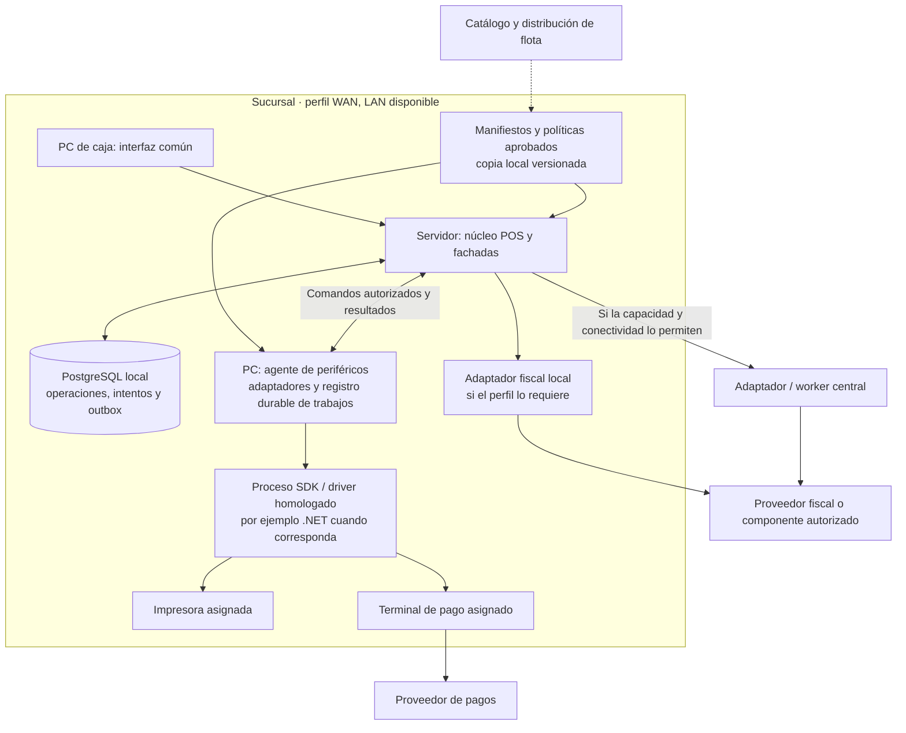

# Extensibilidad de facturación, pagos e impresión

Fecha: 1 de octubre de 2026. Complementa la [propuesta de arquitectura](propuesta-arquitectura.md) y la [revisión corporativa](revision-arquitectura-corporativa.md). Define un diseño para incorporar proveedores y dispositivos sin crear una aplicación POS distinta por país o tienda; no acredita soporte ya implementado.

## 1. Requisito y evidencia disponible

| Estado | Antecedente y alcance |
| --- | --- |
| **Requisito informado** | Las aplicaciones de facturación e impresión, impresoras y terminales/modelos de pago pueden variar por país, sucursal y caja. Se busca un núcleo POS común y cambios mínimos para incorporar variantes. |
| **Observado en código** | Mountain ya encapsula selección de facturación entre Acepta e Ingydev. La API de impresión es un proceso local Windows/.NET con contratos y formatos ligados al sistema actual; imprimir un DTE no significa emitirlo. |
| **Diseño propuesto** | Puertos por capacidad, fachadas de casos de uso, adaptadores homologados, configuración tipada y un catálogo de combinaciones compatibles. ACL cuando haya diferencias semánticas. |
| **Soporte real pendiente** | Inventario instalado, versiones, modelos, firmware, SDK, contratos, permisos por operación y pruebas de hardware/proveedor. No se demuestra compatibilidad de todos los modelos Transbank ni de otros adquirentes. |

Fuentes del estado actual: [Mountain: facturación y selección de proveedor](analisis-repositorios/mountain-implementos.md), [impresión: funciones, contratos y límites](analisis-repositorios/api-impresion-caja.md) y [dispositivos en la presentación original](antecedentes-presentacion-chile.md).

**«Plug-and-play» significa aquí configurar una combinación previamente homologada.** Un modelo o proveedor nuevo puede necesitar desarrollo de adaptador, cambios de contrato y certificación. Una API común reduce el alcance del cambio; no convierte cualquier hardware en compatible ni elimina las reglas fiscales o de pago.

## 2. Fronteras de responsabilidad

| Pieza | Responsabilidad propuesta | Límite |
| --- | --- | --- |
| Dominio POS | Venta, importes, caja, identidad de operación y reglas comunes. | No conoce marcas, DLL, puertos USB, nombres de ejecutables ni estados específicos de un proveedor. |
| Fachadas | Coordinar capacidades como iniciar pago, emitir documento o imprimir una representación existente. | No equiparar esas tres operaciones ni obligar a un despliegue separado por fachada. |
| Puertos | Contratos tipados por capacidad: pago, fiscalidad, impresión y consulta de resultado. | Evitar una única función genérica `execute(provider, payload)` que filtre modelos externos al dominio. |
| Adaptadores | Resolver protocolo, driver, SDK, transporte y versión del proveedor/dispositivo. | Un SDK .NET puede ejecutarse en otro proceso; no se fuerza su reescritura en Node.js o Rust. |
| ACL | Traducir significado, referencias, importes, documentos, estados y errores cuando difieran. | No traducir «enviado», «aceptado», «autorizado» y «liquidado» al mismo estado de éxito. |
| Políticas y perfiles | Determinar operaciones permitidas, datos requeridos y capacidades aplicables al contexto. | No dispersar `if (country)` o `if (printerBrand)` por el dominio. |
| Catálogo de flota | Mantener versiones, firmas, compatibilidad, homologación, asignaciones y despliegue gradual. | No ser una dependencia online de cada venta ya autorizada. |

La variación fiscal se expresa mediante políticas y módulos explícitos por régimen/documento; la variación técnica, mediante adaptadores. Se comparten reglas realmente comunes, sin reducir todas las integraciones al mínimo que soporte el proveedor menos capaz. Una capacidad adicional tiene contrato propio, versión y condiciones de uso.

La ACL se justifica por diferencias semánticas; no debe absorber el negocio ni convertirse en la orquestación general. Puede implementarse dentro de un módulo o como servicio según el límite operativo. [Patrón ACL de Microsoft](https://learn.microsoft.com/en-us/azure/architecture/patterns/anti-corruption-layer).

## 3. Ubicación de componentes y perfil offline

La referencia sigue siendo **perfil WAN**: el servidor de sucursal es el escritor autorizado de las ventas y sus intentos; las cajas lo consumen por LAN. El agente de periféricos corre en el PC que controla el dispositivo. Su registro durable de trabajos no lo convierte en un segundo escritor del negocio.



Las dos rutas fiscales representan opciones de despliegue: **la operación lógica fija una ruta y todos sus intentos la conservan**, no se emite simultáneamente por ambas. El canal entre núcleo y agente debe autenticar a ambas partes y puede iniciarlo el agente; el dibujo no obliga a abrir un servicio remoto sin protección en el PC.

La fiscalidad puede ejecutarse localmente, en central o mediante proveedor, según la modalidad homologada. Offline solo permite las capacidades y documentos expresamente autorizados con recursos vigentes. Un terminal conectado, un driver cargado o un documento impreso no prueban aprobación del pago ni emisión fiscal. Ante caída de LAN/servidor, este perfil detiene nuevas operaciones; la autonomía por terminal sigue siendo otra decisión. [Perfiles y fiscalidad de la propuesta](propuesta-arquitectura.md).

## 4. Configuración tipada y capacidades efectivas

Un perfil aprobado identifica país, entidad legal, sucursal y caja; asigna proveedor, establecimiento/comercio, dispositivo y versiones compatibles por capacidad. La precedencia propuesta es **base corporativa → país/régimen → entidad legal → sucursal → caja**, limitada a campos permitidos. Una excepción de caja puede seleccionar una impresora homologada; no ampliar su autorización fiscal o de crédito.

Resolver y validar la configuración antes de activarla. Conservar localmente un manifiesto completo, versionado, firmado y con hash; una actualización parcial no sustituye al último perfil válido. La matriz de compatibilidad contempla contrato, núcleo, agente, adaptador, SDK, sistema operativo, modelo/firmware y plantilla. Versiones instaladas no equivalen a versiones compatibles.

**Capacidad declarada**, **disponibilidad actual** y **autorización** son ejes diferentes. La decisión efectiva por operación combina:

- soporte homologado de la combinación y del tipo de operación;
- política de país/entidad/caja, permisos del operador y vigencias;
- conectividad real con agente, dispositivo y proveedor necesarios;
- recursos y estado: papel, certificado, datos locales, espacio, intentos pendientes o dispositivo ocupado.

La UI recibe una decisión explicable —permitida, restringida, pendiente de resolver o no soportada— y el motivo. Debe distinguir «puedo imprimir una copia», «puedo iniciar un pago» y «puedo emitir este documento». Si no se conoce el estado de una dependencia, mostrarlo; un dato de capacidad almacenado no certifica salud actual.

## 5. Contratos conceptuales y resultado durable

El siguiente esquema ilustra fronteras; no es una API implementada ni fija definitivamente nombres o campos. Cada petición de negocio tiene un payload tipado propio, con dinero y moneda explícitos donde corresponda, sin exponer objetos del SDK a la UI.

```text
ApprovedProfile:
  profile_id, revision, scope(country, legal_entity, branch, register)
  policy_revision, compatible_versions, capabilities, signature
  bindings(payment, fiscal, printing), effective_from, valid_until

OperationBinding:                      # Guardado antes del primer efecto externo
  operation_id, binding_id, capability, request_hash
  provider_id, merchant_or_establishment_id, device_id_if_applicable
  adapter_id, adapter_version, contract_version, profile_revision
  document_or_payment_reference, template_revision_if_applicable

Attempt: attempt_id, operation_id, binding_id, command_id, attempt_status
AgentJournal: command_id, request_hash, receipt_state, result, observation_id

PaymentPort: initiatePayment(command), queryPayment(attemptRef)
             reversePayment(command)    # Solo si esa capacidad está homologada
FiscalPort:  issueDocument(command), queryDocument(attemptRef)
PrintPort:   submitPrintJob(command), queryPrintJob(jobRef)

AttemptObservation:
  attempt_id, observed_at, source, external_reference_if_available
  delivery_state, capability_specific_status, certainty, evidence_ref
  error_code_if_any, permitted_next_actions
```

No existe un `success: true` universal. Pago distingue autorización y liquidación; fiscalidad conserva emisión, recepción y resolución aplicables; impresión distingue aceptado, enviado al spooler, fallo y evidencia física cuando el dispositivo la aporte. `certainty = unknown` conserva la incertidumbre; no se convierte en rechazo ni en permiso para repetir.

El servidor persiste operación, binding y `command_id` antes de despachar. El agente valida identidad/ámbito, deduplica por comando y hash, persiste su recepción y solo entonces confirma un ACK de **recepción durable**. Ese acuse todavía no significa que se ejecutó el efecto. Guarda también el resultado observado y su correlación para reenviarlo tras una caída de LAN.

En el retorno, la sucursal confirma la observación **después de persistirla vinculada a operación e intento**. El agente conserva el resultado hasta ese acuse y después aplica la retención acordada, sin borrado inmediato. Retención y deduplicación deben cubrir reentrega y restauración; probar caída de sucursal después del commit de la observación y antes de devolver el ACK.

Si el dispositivo produjo el efecto pero se perdió la comunicación, sucursal y agente recuperan el mismo comando y consultan o concilian su estado; no lo ejecutan otra vez por no haber recibido respuesta. El journal del agente no le concede autoridad para aceptar nuevas ventas durante la caída LAN. La expiración de un lease tampoco demuestra que una llamada al SDK terminó ni autoriza a repetirla.

No hay una transacción atómica entre PostgreSQL, spooler, terminal y proveedor: intención previa, journal y consultas de resultado cubren esa separación, con incertidumbre explícita cuando falte evidencia. [Límites actuales de impresión](analisis-repositorios/api-impresion-caja.md), [recuperación de efectos externos](revision-resiliencia-datos-pos.md).

## 6. Cambios de proveedor, reintentos y reimpresión

**Fijar el binding en la operación lógica antes del primer efecto**, no solo en su intento: cobro, emisión o trabajo de impresión tienen identidad propia y pueden pertenecer a una misma venta. Todos sus reintentos conservan ese binding. Generar otro `attempt_id` no autoriza a cambiar adquirente, emisor o dispositivo mientras la operación siga incierta.

Una actualización de configuración afecta operaciones futuras; una reasignación requiere resolver los efectos previos, autorización y trazabilidad. Las versiones necesarias para consultar o recuperar operaciones anteriores se conservan durante la transición, o se migran con equivalencia demostrada y auditoría.

Las consultas y nuevas reversas/anulaciones vinculadas a efectos anteriores son una excepción al perfil nuevo por defecto: conservan proveedor, comercio/emisor y referencias de origen según la capacidad homologada. Una reversa tiene identidad propia y referencia a la operación original; no se enruta al proveedor recién configurado por ser una solicitud nueva. Si no existe un mecanismo soportado, requiere resolución controlada.

| Situación | Regla propuesta |
| --- | --- |
| Timeout al cobrar o emitir | Mantener resultado desconocido; consultar por la referencia original o conciliar. No enviar automáticamente a otro terminal/proveedor ni reemitir con otra identidad. |
| Reinicio después de respuesta perdida | Recuperar operación, intentos, binding, comando y journal; reconocer reentregas. Un nuevo ID no se usa para eludir la deduplicación. |
| Proveedor no soporta consulta/idempotencia | Declarar la limitación; exigir resolución controlada antes de repetir. El adaptador no fabrica una garantía inexistente. |
| Reversa/anulación | Operación tipada y autorizada, vinculada al intento original; su propio resultado puede quedar incierto. No asumir soporte universal. |
| Impresora sin papel antes de entregar | Conservar trabajo y estado comprobable; el operador sigue el procedimiento permitido. Aceptación del spooler no demuestra papel entregado. |
| Reimpresión solicitada | Nuevo trabajo/copia autorizada, con motivo y referencia al documento original. No crear otra factura, venta ni cobro. |
| Cambio de impresora tras entrega incierta | No reencaminar ciegamente. Consultar estado disponible y autorizar una copia trazable según política. |
| Retirada de adaptador | Resolver pendientes, conservar consultas históricas y evidencias, verificar rollback; no desinstalar dejando intentos irrecuperables. |

Estas reglas amplían los controles descritos en la [propuesta](propuesta-arquitectura.md); no acreditan que los proveedores actuales ofrezcan todas esas consultas. La [API de impresión auditada](analisis-repositorios/api-impresion-caja.md) carece de identidad y registro durable propios de trabajos, y puede comunicar éxito después de errores: su reutilización requiere atender esas brechas.

## 7. Seguridad, catálogo y entrega a la flota

El renderer de Angular/Tauri no recibe secretos de proveedor, claves fiscales ni credenciales de dispositivo. Expresa una intención de negocio; núcleo y agente verifican identidad, ámbito, permisos y binding. El agente autentica comandos, limita capacidades, valida contenido y serializa acceso al dispositivo; escuchar en localhost no sustituye autorización. La evidencia actual de autenticación de impresión está delimitada en [IMP-02](analisis-repositorios/api-impresion-caja.md).

Si varias cajas comparten un periférico, asignar un único agente controlador autorizado y serializar todos sus comandos; dos agentes independientes no coordinan acceso por tener cada uno su cola. El cambio de propietario exige resolver llamadas en curso y excluir al anterior, sin interpretar el vencimiento de un lease como prueba de que dejó de ejecutar.

Las credenciales se aprovisionan y rotan mediante mecanismos administrativos protegidos; el manifiesto contiene referencias, no valores secretos. El control de acceso local debe funcionar durante la desconexión autorizada, con vigencia y límites. El agente usa los privilegios mínimos compatibles con su driver/SDK.

Si se selecciona Tauri, sus binarios externos por plataforma son una opción de empaquetado, no una obligación de reescribir el SDK. El agente vital y la recuperación de intentos no deben depender de que la ventana del POS permanezca abierta: elegir servicio supervisado o ciclo de vida independiente según la capacidad. [Binarios externos en Tauri](https://v2.tauri.app/develop/sidecar/).

Los adaptadores se distribuyen como paquetes aprobados y firmados, con dueño, contrato, compatibilidad, pruebas y procedencia. **No se descargan ni ejecutan plugins JavaScript remotos arbitrarios por cambiar una configuración.** Cambiar un manifiesto selecciona componentes ya instalados/aprobados o programa su instalación verificada; no convierte configuración en código ejecutable.

El catálogo registra combinaciones concretas y su estado: candidata, en laboratorio, homologada, en piloto, desplegada, retirada. Desplegar por anillos, ejecutar autocomprobaciones sin efectos monetarios/fiscales/impresión sorpresivos y permitir rollback compatible con datos e intentos pendientes. La caída del catálogo central no detiene operaciones que el perfil local vigente permite. [Distribución propuesta](opciones-tecnologicas.md), [límites del DevOps corporativo para tiendas](analisis-repositorios/devops-platform.md).

Separar descubrimiento/salud de pruebas con efecto: el `GET /Test` actual de impresión imprime, por lo que no sirve como sondeo inocuo. Las pruebas de dispositivo con salida física requieren una acción explícita. Además, `api-pagos-caja` es una API de consulta/estado de pagos y NC; no se identifica como agente Transbank ni emisor fiscal. [Impresión, superficie HTTP](analisis-repositorios/api-impresion-caja.md), [papel de la API de pagos](analisis-repositorios/api-pagos-caja.md).

Antes de apagar o actualizar un agente, detener nueva admisión, drenar con límite y preservar estados inciertos cuando no sea seguro cancelar el SDK. La versión siguiente y un posible rollback deben poder leer el journal y consultar operaciones anteriores; no borrar trabajos para completar una instalación. Probar ese ciclo también con un dispositivo compartido.

## 8. Escenarios: situación conocida y objetivo

| Escenario | Punto de partida / límite | Resultado propuesto |
| --- | --- | --- |
| Sustituir la app de facturación | Existe selección de proveedor en Mountain; cobertura funcional y despliegue deben inventariarse. | Homologar adaptador y perfil, sin duplicar dominio. Conservar bindings y resultados de documentos anteriores. |
| Cambiar impresora o aplicación de impresión | Servicio Windows con DTOs y formatos específicos; compatibilidad física no probada aquí. | Sustituir adaptador/plantilla homologados, manteniendo contrato de trabajo, documento original y auditoría. |
| Instalar otro modelo de terminal Transbank | El modelo, SDK, firmware y operaciones compatibles siguen pendientes de inventario. | Seleccionar una combinación validada; si no existe, desarrollar/homologar adaptador antes de habilitarla. |
| Operar en Perú o España | No hay evidencia equivalente del conjunto de periféricos y proveedores de esos países. | Aplicar políticas de país y bindings concretos; conservar núcleo común sin suponer equivalencia fiscal o bancaria. |
| Dos cajas con dispositivos distintos | La granularidad instalada aún requiere inventario. | Configuración por caja, mismo núcleo en sucursal y capacidades visibles por operación. |
| Se pierde Internet | Datos y agentes locales no prueban disponibilidad del adquirente o facturador. | Continuar únicamente operaciones autorizadas con dependencias disponibles; presentar límites e incertidumbre. |

## 9. Información mínima y aceptación

Pedir una fila por combinación instalada: país/entidad/sucursal/caja, aplicación y versión, fabricante/modelo/firmware, SO/arquitectura, driver/SDK y licencia, modo de conexión, proveedor/comercio/establecimiento, documentos/operaciones habilitados y responsable. No incluir secretos. Añadir contratos, entorno de prueba, procedimiento de homologación, consultas/reversas disponibles, estados de error y política offline aprobada.

Solicitar además ejemplos anonimizados de comprobantes y formatos, tamaños de papel, recursos fiscales administrados, topología núcleo/agente, número de dispositivos compartidos y comportamiento operativo ante timeout, reinicio, falta de papel, cambio de terminal o caída del proveedor. Este paquete amplía la [solicitud al equipo](solicitud-informacion-equipo.md).

| Criterio de aceptación del piloto | Evidencia requerida |
| --- | --- |
| Un núcleo, dos combinaciones reales homologadas | Cambiar mediante perfil/adaptador sin modificar reglas de venta ni bifurcar el POS; conservar ventas, referencias y recuperación de pendientes durante la transición. |
| Capacidad no soportada o incompatible | Bloqueo explicable antes del efecto; ningún fallback silencioso a otra operación/proveedor. |
| Timeout y configuración cambiada | La operación y sus intentos conservan binding; ni otro `attempt_id` ni un lease vencido generan otro cobro/documento por failover automático. |
| Reinicio o LAN caída después del efecto | ACK posterior a persistencia del journal, correlación por `command_id` y recuperación durable; conciliar el efecto sin volver a ejecutarlo a ciegas. |
| Respuesta de agente persistida, ACK perdido | Reentregar la observación sin repetir su efecto; agente conserva evidencia hasta acuse durable y retención, incluso al restaurar. |
| Dispositivo original retirado con operación incierta | Al reemplazar equipo/proveedor, el pendiente no se reenvía al nuevo; consultas y reversas históricas usan origen/referencias, o resolución controlada si no hay capacidad. |
| Impresión perdida y copia explícita | Diferenciar trabajo repetido de nueva copia; conservar factura/venta/pago originales y motivo de reimpresión. |
| Caída WAN con LAN disponible | Perfil, autorización y adaptadores locales vigentes; solo se habilitan operaciones realmente permitidas sin dependencias inaccesibles. |
| Paquete/configuración no aprobado | Rechazo por firma, versión o ámbito; renderer sin acceso a secretos; llamadas al agente autenticadas. |
| Salud y periférico compartido | Descubrimiento sin imprimir/cobrar/emitir; comandos concurrentes serializados por el controlador autorizado. |
| Rollout y retirada | Drenaje, preservación/compatibilidad del journal y rollback ensayado en hardware real, con consultas de operaciones antiguas disponibles. |

Son pruebas propuestas, aún no ejecutadas. El objetivo es incorporar variantes mediante contratos y configuración controlada, manteniendo integridad y capacidad de recuperación; la palabra «plug-and-play» no sustituye esa evidencia.

## 10. Extensión futura a lectores RFID

La [posibilidad de RFID y autoservicio](evolucion-rfid-autoservicio.md) amplía el catálogo de periféricos con un puerto de captura, distinto de pagos y fiscalidad. El adaptador entrega observaciones identificadas por sesión/lector/zona y el núcleo recibe una selección validada de artículos. No se exponen comandos de radio o SDK a las reglas de venta.

El perfil debe describir modelos, firmware, SDK, antenas, zona y configuración regional homologados, nivel de etiquetado, mapeo de identidades y capacidades de lectura. Escritura/codificación de tags y funciones de seguridad de tienda son capacidades separadas con permisos propios; no se habilitan por instalar el lector. Una sustitución de lector conserva sesiones y controla observaciones tardías para que no ingresen en otra cesta.

RFID es una opción futura: la lectura masiva no demuestra un pago ni un conteo completo. El dueño externo del inventario conserva la autoridad sobre ajustes, y la captura mediante código de barras/manual sigue disponible con un procedimiento que evite duplicar artículos ya leídos.
