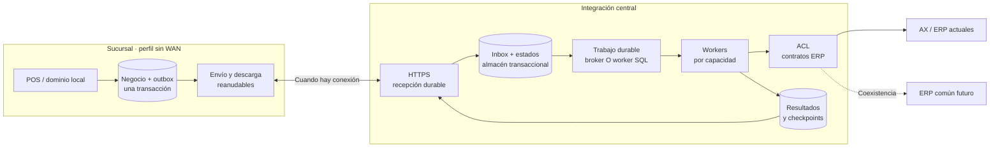

# Mensajería del POS: WSO2, RabbitMQ, BullMQ y alternativas durables

**Fecha de consulta: 1 de octubre de 2026. Estado: investigación y recomendación provisional, no ADR aprobado.** Fuentes primarias oficiales, contrastadas con los informes locales. No se ejecutaron aplicaciones, instalaciones, pruebas, despliegues ni conexiones a servicios corporativos. Las capacidades de un producto no acreditan la configuración ni las garantías del POS instalado.

## 1. Recomendación para esta empresa

**Conviene reducir el acoplamiento a WSO2 y al ERP, pero cambiar WSO2 por RabbitMQ o BullMQ no es una sustitución equivalente.** La decisión debe separar tres responsabilidades: conservar la operación local, transportar trabajo y ejecutar/traducir la integración ERP.

Proponemos como base del siguiente piloto:

1. **Sucursal: conservar una base transaccional local y añadir outbox/inbox durables.** PostgreSQL ya existe en este perfil; no añadir un broker o Redis a cada tienda por defecto. Si se exige autonomía de cada terminal cuando cae la LAN, la ubicación de esa autoridad requiere una decisión adicional.
2. **Tienda–central: usar un contrato HTTPS con recepción durable, idempotencia y consulta de estado**, compatible con desconexiones prolongadas. El proceso local reanuda el envío; recibir una petición no significa contabilizarla en AX.
3. **Central: separar la ACL y los workers del transporte.** Conservar inicialmente las integraciones WSO2/.NET necesarias y sustituirlas por capacidad. La ACL debe poder invocar AX ahora y el ERP común después, conservando el destino histórico de cada operación.
4. **Para un reemplazo central del broker Andes, RabbitMQ es el candidato preferente si se requiere una solución operable on-premise/híbrida y con contratos AMQP entre aplicaciones distintas.** Si la plataforma corporativa GCP/Pub/Sub ya tiene operación, responsables y garantías aprobadas para este uso, preferir su reutilización antes de introducir un segundo broker central. Esa comprobación está pendiente.
5. **BullMQ es un candidato para coordinar trabajos de una aplicación, no el reemplazo completo del ESB.** Comparar su backend Redis y su backend PostgreSQL; no afirmar que BullMQ obliga hoy a desplegar Redis. Empezar por una tarea recuperable y medirlo antes de incorporarlo a un efecto monetario.

**Adopción preferida para el primer piloto:** PostgreSQL local + outbox, HTTPS + recepción durable central y un despacho central acotado sobre PostgreSQL. Antes de crear infraestructura nueva, comprobar si una capacidad corporativa mantenida cubre ese despacho con las mismas garantías. Esta base debe superar los gates de la sección 5; aún no se declara suficiente para producción. No implica desarrollar un broker genérico ni instalar simultáneamente todas las alternativas de este documento.

## 2. Qué sabemos del entorno actual

La [presentación chilena](antecedentes-presentacion-chile.md) identifica **WSO2 EI 6.6.0, Carbon/Synapse, DSS, CAR y mediadores Java**, mientras el diagrama muestra además **Andes AMQP/JMS**. Son versiones y componentes declarados; falta verificar los artefactos realmente desplegados, sus parches, protocolos, políticas y soporte. La revisión no dispone de las fuentes completas del bus central, mediadores, API de lectura ni procesador central de cola.

El [sincronizador auditado](analisis-repositorios/mountain-sync-sucursal.md) envía transacciones por HTTP, recibe avisos/respuestas por AMQP y descarga datos mediante la API de lectura. Se encontraron ACK antes de esperar persistencia, estados separados y ventanas de reenvío. Cambiar el broker no corrige esos caminos de aplicación. Los [adaptadores .NET](analisis-repositorios/apis-implementos.md) también contienen integración WCF/SQL y reglas de precios que ninguna cola reemplaza.

La revisión de [core](analisis-repositorios/core.md) aporta código de NestJS/Fastify, Pub/Sub y outbox, con un camino transaccional concreto para factura. También identifica límites en deduplicación y publicación concurrente. Constituye una base para reutilización selectiva; no prueba operación offline ni despliegue efectivo en los tres países.

## 3. Separar productos y responsabilidades

La documentación histórica de WSO2 distingue el perfil ESB/data services del perfil Message Broker y muestra librerías Andes/JMS. La documentación actual de Micro Integrator describe capacidades de integración y conexión a brokers externos. Por tanto, «WSO2» no designa una sola función que pueda intercambiarse por una librería de jobs. [WSO2: perfiles de Enterprise Integrator](https://wso2.com/library/articles/2017/08/end-to-end-capabilities-of-wso2-enterprise-integrator/), [WSO2 MI: introducción](https://mi.docs.wso2.com/en/latest/get-started/introduction/).

| Responsabilidad actual o necesaria | Sustitución o tratamiento candidato | Lo que todavía hay que implementar/verificar |
| --- | --- | --- |
| Cola y transporte de avisos/respuestas Andes | RabbitMQ, Pub/Sub o recepción durable HTTP según el tramo | Custodia, routing, reentrega, consumidores, seguridad, retención y recuperación. |
| Mediación Synapse y artefactos CAR/Java | Mantener temporalmente WSO2 o extraer a servicios/ACL | Transformaciones, enriquecimiento, orden de pasos y errores reales. |
| DSS y lecturas SQL | APIs de datos y adaptadores con dueño | Contratos, paginación, checkpoints, consistencia y sustitución de SQL AX. |
| APIs AX/WCF | Adaptador AX mantenido o encapsulado | Resultado incierto, identificadores, deduplicación remota y consulta de estado. |
| Trabajo programado o reintentos internos | Worker durable PostgreSQL o BullMQ | Límites, backoff, claim, recuperación y semántica de cada operación. |
| Reglas de precios y ofertas | Motor local y paquetes versionados | Paridad de cálculo, vigencias, activación y trazabilidad. |
| Auditoría monetaria y conciliación | Modelo durable de negocio | No sustituirlo por logs, estado de un job o una DLQ. |

WSO2 MI documenta listeners/senders RabbitMQ y el patrón message store + forwarding processor. **Puede existir convivencia entre mediación y broker nuevo**; no es necesario reescribir ambos a la vez. Estos documentos se presentan como MI 4.6.0 en la consulta, no como la versión EI 6.6.0 citada en la presentación. Hay que probar la combinación exacta antes de reutilizar configuraciones o clientes. [Conectar MI con RabbitMQ](https://mi.docs.wso2.com/en/latest/install-and-setup/setup/brokers/configure-with-rabbitmq/), [RabbitMQ Message Store](https://mi.docs.wso2.com/en/latest/learn/examples/message-store-processor-examples/using-rabbitmq-message-stores/).

## 4. Opciones y límites relevantes

### RabbitMQ: mensajería central entre aplicaciones

RabbitMQ diferencia **publisher confirms**, emitidos por el broker, de **consumer acknowledgements**, emitidos por el consumidor. Ninguno demuestra por sí mismo una transacción ERP. Además, un mensaje sin ruta puede recibir confirmación; el productor debe gestionar mensajes retornados, por ejemplo con `mandatory`, y verificar la topología esperada. [Confirms y acknowledgements](https://www.rabbitmq.com/docs/confirms).

Para colas centrales replicadas con prioridad en durabilidad, evaluar **quorum queues**. Necesitan mayoría disponible; confirmar publicación y disponer de réplicas no elimina todos los modos de pérdida, ni garantiza disponibilidad ante pérdida de esa mayoría. Los detalles cambian por versión. El piloto debe fijar versión, número y ubicación de réplicas, políticas de almacenamiento y RPO/RTO. [Quorum queues, documentación 4.2](https://www.rabbitmq.com/docs/4.2/quorum-queues).

Si la confirmación se pierde, el productor puede retransmitir algo ya aceptado. El consumidor debe ser idempotente o deduplicar de forma durable, y acusar solo después de conservar el trabajo o aplicar su efecto local. Se requiere identidad de negocio independiente del ID de entrega. [Guía de fiabilidad](https://www.rabbitmq.com/docs/reliability).

La DLQ tampoco es una caja fuerte automática: el dead-lettering predeterminado puede perder mensajes cuando falla el destino. En quorum queues existe una modalidad `at-least-once` que exige configuración y tiene costos/límites propios. Definir políticas de desborde, destino indisponible, mensajes tóxicos, retención, acceso y replay; no activar descarte silencioso para una venta pendiente. [Seguridad de DLX](https://www.rabbitmq.com/docs/4.2/dlx), [Dead-lettering de quorum queues](https://www.rabbitmq.com/docs/4.2/quorum-queues#dead-lettering).

**Aplicación propuesta:** un broker central puede desacoplar recepción, integración ERP, conciliación y consumidores independientes. No desplegar un único cluster de consenso repartido entre sucursales y países a través de enlaces offline. RabbitMQ diferencia clustering sobre redes confiables de Federation/Shovel para enlazar brokers independientes sobre WAN. Eso no justifica instalar un broker por tienda: la outbox local puede ser suficiente. [Distribución de RabbitMQ](https://www.rabbitmq.com/docs/distributed).

### BullMQ: ejecución de jobs, con backend explícito

BullMQ organiza colas y workers, con trabajos completados o fallidos. Es adecuado para tareas programadas, reportes, procesamiento de lotes y reintentos de una aplicación cuando su contrato operativo lo admite. Que existan bindings para otros lenguajes no lo convierte en sustituto de mediaciones WSO2 ni en protocolo ERP. [Modelo Queue/Worker](https://docs.bullmq.io/guide/introduction).

**Backend Redis.** La guía de producción pide configurar persistencia y `maxmemory-policy=noeviction`; también advierte que el contenido de los jobs se almacena en claro. Añadir BullMQ con Redis significa operar ese almacén, sus copias, capacidad, acceso y recuperación. [BullMQ en producción](https://docs.bullmq.io/guide/going-to-production). Redis documenta que AOF con `appendfsync everysec` puede perder aproximadamente un segundo de escrituras en un desastre: no usar ese ajuste como prueba de RPO cero de una venta ya aceptada. [Persistencia Redis](https://redis.io/docs/latest/operate/oss_and_stack/management/persistence/).

**Backend PostgreSQL: novedad que debe entrar en la evaluación.** La documentación oficial ya lo ofrece como alternativa; el export existe en el tag upstream `v6.3.11`. El proveedor describe Redis como la opción más probada. El backend SQL tiene migraciones explícitas y no admite downgrade de esquema. Es una vía para evitar Redis, pero **compartir PostgreSQL o un pool no demuestra que `Queue.add()` participe en el mismo commit que la venta**. El piloto debe verificar esa integración o conservar una outbox transaccional que alimente los jobs. No se ha instalado ni ensayado este backend. [Backend PostgreSQL](https://docs.bullmq.io/guide/postgresql), [export en v6.3.11](https://raw.githubusercontent.com/taskforcesh/bullmq/v6.3.11/src/index.ts).

Un worker puede perder su lock y el trabajo volver a espera para ejecutarse de nuevo. Por ello se necesitan operaciones idempotentes incluso cuando la librería coordina consumidores. [Stalled jobs](https://docs.bullmq.io/guide/workers/stalled-jobs), [Patrón de jobs idempotentes](https://docs.bullmq.io/patterns/idempotent-jobs). La unicidad de `jobId` deja de bloquear nuevos jobs cuando el anterior se elimina; no equivale a deduplicación histórica de cobros o NC. [Job IDs y eliminación](https://docs.bullmq.io/patterns/throttle-jobs).

BullMQ permite `attempts`, backoff y jitter. Nuestra política debe distinguir error técnico transitorio, rechazo funcional y efecto remoto incierto. Configurar más reintentos no establece que un POST fallido sea seguro de repetir. [Reintentos BullMQ](https://docs.bullmq.io/guide/retrying-failing-jobs).

### PostgreSQL + worker + HTTPS: una alternativa inicial deliberadamente acotada

**Diseño propuesto:** transacción de negocio y outbox en la base local; proceso de envío que adquiere trabajo pendiente; endpoint central que persiste inbox, identidad y estado antes de responder; worker central que avanza la integración; resultados descargables de forma durable con checkpoint. No necesita una conexión WAN permanente ni otro motor de almacenamiento en la sucursal. HTTPS transporta la petición; la durabilidad la aportan la persistencia y el protocolo.

PostgreSQL admite `FOR UPDATE SKIP LOCKED` para reducir contención entre consumidores de una tabla similar a una cola. No es una solución completa: omite filas bloqueadas y no garantiza orden causal del negocio. [SELECT y locking](https://www.postgresql.org/docs/current/sql-select.html#SQL-FOR-UPDATE-SHARE).

**Trabajo que debemos asumir si elegimos este camino:** claims con propietario y vencimiento, consultas e índices, scheduler de reintentos, fair scheduling por tienda, recuperación tras caída, retención, alarmas, herramientas de soporte y pruebas de carga. No mantener una transacción SQL abierta durante una llamada WAN/ERP lenta. Al finalizar, actualizar con verificación del claim; un lease expirado no detiene un efecto externo ya iniciado.

`LISTEN/NOTIFY` sirve para despertar workers conectados; el trabajo debe vivir en tablas y volver a buscarse después de una reconexión. PostgreSQL entrega notificaciones tras el commit y recomienda usar tablas para datos estructurados. El polling de respaldo evita convertir la notificación en el único registro del trabajo. [NOTIFY](https://www.postgresql.org/docs/current/sql-notify.html).

No publicar directamente las tablas de sucursal en la red central ni replicar escrituras financieras bidireccionales como sustituto del protocolo. La unidad de intercambio es una operación o paquete versionado con contrato público.

### Pub/Sub: reutilización corporativa si GCP es el destino operativo aprobado

La suscripción predeterminada de Pub/Sub ofrece entrega al menos una vez; el orden requiere configuración y una clave apropiada. Usar lo existente en `core` puede reducir plataformas operadas, pero hay que confirmar ownership, cuotas, IAM, regiones, retención, costos y monitoreo del producto POS. [Suscripciones Pub/Sub](https://docs.cloud.google.com/pubsub/docs/subscription-overview).

La opción llamada exactly-once tiene alcance acotado: pull/StreamingPull, región y message ID del servicio; también pueden existir duplicados producidos mediante publicaciones diferentes. No hace atómica una escritura SQL ni un cobro en un adquirente. [Alcance de exactly-once en Pub/Sub](https://docs.cloud.google.com/pubsub/docs/exactly-once-delivery).

**Aplicación propuesta:** Pub/Sub puede ocupar el transporte central después de la recepción durable de tienda. La venta offline debe persistir antes, sin depender de Google Cloud. No se necesitan simultáneamente Pub/Sub y RabbitMQ para la misma frontera salvo un motivo de coexistencia o interconexión explícito.

## 5. Matriz de decisión provisional por carga de trabajo

La tabla expresa una **recomendación de arquitectura**, no un benchmark de productos ni una elección de compra.

| Carga / frontera | Primera opción para evaluar | Cuándo cambia | Qué no delegar al transporte |
| --- | --- | --- | --- |
| Venta y pendientes offline de sucursal | Base local existente + outbox + proceso local | Aislamiento de terminal exige otra ubicación de la autoridad | Atomicidad, límites offline, respaldo y recuperación. |
| Entrega tienda–central y descarga de resultados | HTTPS + inbox durable + checkpoint/polling | Mantener AMQP inicialmente si reducir cambios del cliente compensa su operación | Identidad, aceptación durable, reanudación y resultado de negocio. |
| Integración central heterogénea con on-premise | RabbitMQ como candidato al broker Andes | Pub/Sub corporativo si nube, operación e integración híbrida están aprobadas | ACL, WCF/SQL/REST, idempotencia remota, estados y conciliación. |
| Pocos tipos de trabajo central y pocos consumidores | Tabla de trabajo PostgreSQL + workers | Fan-out, consumidores independientes y operación justifican broker | Herramientas de soporte, scheduling, límites y recuperación. |
| Jobs internos recuperables de una aplicación Nest | BullMQ, eligiendo backend | Mantener worker SQL simple si la biblioteca no reduce trabajo real | Idempotencia del efecto; retención monetaria. |
| Precios y ofertas para tiendas | Paquetes versionados y checkpoints | Eventos pueden avisar de una nueva versión | Consistencia del paquete, vigencia y activación atómica. |
| Reintentos de pago, NC o DTE inciertos | Estado durable + consulta/conciliación por operación | Retry automático solo con contrato que lo haga seguro | Decidir si el remoto ya ejecutó. |

**Criterio para simplificar bases:** reducir motores adicionales y escrituras cruzadas, no forzar una sola base mundial. La outbox e inbox del POS pueden compartir su motor transaccional con tablas separadas por responsabilidad. Las bases de AX y otros ERPs no desaparecen al cambiar de broker. Migrar MongoDB de NC requiere trasladar su autoridad y sus invariantes, no mover el documento a una cola. Redis de BullMQ y un cache general tienen requisitos operativos distintos aunque compartan tecnología.

El backend PostgreSQL de BullMQ entra como candidato de jobs del piloto; no se asume madurez equivalente en todos los backends ni compatibilidad automática con los wrappers Nest instalados. Una nueva dependencia solo se adopta si disminuye trabajo operativo con evidencia.

### Gates de adopción después de la revisión adversarial

| Decisión | Gate verificable antes de adoptarla |
| --- | --- |
| Mantener despacho PostgreSQL sin broker adicional | Un conjunto limitado de tipos de trabajo, claims/leases y cambios de estado condicionales; scheduler y recuperación mantenidos; justicia entre tiendas; replay operable. Medir carga de recuperación, locks, conexiones, WAL y crecimiento junto al negocio. Si exige recrear fan-out, suscripciones y operación de un broker general, reabrir la decisión. |
| Reutilizar Pub/Sub corporativo | Producto POS autorizado en esa plataforma; propietario y guardia operativa identificados; cuota, presupuesto, conectividad híbrida y recuperación demostrados. Compararlo antes de crear otro broker. La existencia de bibliotecas en `core` no supera este gate. |
| Incorporar RabbitMQ | Necesidad concreta de routing, consumidores o aislamiento; contratos y versión fijados; operador, HA, custodia, políticas de DLX y recuperación probados. Medir también la complejidad añadida y su integración con lo que permanezca en WSO2. |
| Incorporar BullMQ | Backend y versión fijados; integración con Nest validada; pruebas de pérdida de lock, reinicio, retención y migración/rollback de datos. Verificar transacción de negocio/outbox y recuperar trabajos aunque la cola pierda su estado. No convertir el ID del job en la autoridad financiera. |
| Consolidar en PostgreSQL central | Inventario de escritores y consumidores, esquema con dueño, aislamiento de recursos, respaldos y restores ensayados. Cambiar motor no permite degradar reserva/consumo/liberación NC a una simple proyección de consulta. |
| Retirar WSO2/Andes | Todas las capacidades afectadas y consumidores inventariados; equivalencia de contratos, protocolo, resultados y errores; pendientes conciliados y rollback sin repetir efectos. Cubrir maestros, precios y otros flujos, además del alta AX. |

Para cada gate deben existir responsable, evidencia por versión/entorno y criterio de fallo. No se consideran superados por una demostración de camino exitoso ni por un número de sucursales estimado.

## 6. Topología propuesta para validar

La inserción de inbox y la creación del trabajo central deben tener una frontera transaccional verificable. Si `work` es un broker externo, **inbox/estado/outbox central se guardan juntos y un relay publica**; no sustituirlo por un insert y publish independientes. El diagrama abrevia esa outbox. Si es una tabla de trabajo, coordinar su inserción en el mismo commit cuando comparta autoridad y base.

### Cuatro confirmaciones con significados diferentes

| Hito | Significado propuesto | Lo que no demuestra |
| --- | --- | --- |
| Commit local | El POS conservó negocio y pendiente conforme a su política de durabilidad | Que central conozca la operación. |
| Acuse durable central | Central conservó la identidad y trabajo para continuar | Que se haya ejecutado o aceptado en el ERP. |
| Confirm/ACK del broker | Transferencia de custodia en el tramo configurado | Pago, DTE o contabilización ERP confirmados. |
| Resultado de negocio | El adaptador conservó evidencia del resultado por operación | Conciliación global completa si faltan otros efectos. |

Un `202 Accepted` solamente tendrá el segundo significado si **nuestro contrato e implementación** lo garantizan tras commit; el código HTTP por sí mismo no lo garantiza. Un timeout conserva la identidad de operación y conduce a consulta/reenvío seguro, nunca a generar una operación nueva porque falte respuesta.

**La transferencia de custodia debe sobrevivir a recuperación ante desastre.** Si central acusa recibo y luego restaura un backup anterior, mientras la tienda ya eliminó su pendiente, puede desaparecer trabajo aceptado. Definir qué evidencia/origen permite reconstruirlo, cuánto se conserva, cómo se detectan huecos y cómo se mantienen IDs después de restore. La retención local no debe depender únicamente de recibir un HTTP 2xx. El RPO comprometido se debe contrastar con almacenamiento, replicas, archivos de recuperación y conciliación efectivos; «tenemos backups» no cierra ese contrato.

Para escalar a tres países, separar país, entidad legal, tienda, terminal, moneda y ERP destino. El destino se fija con la operación, incluyendo versión de contrato y referencias históricas; no se recalcula un pendiente por un cambio global de `COUNTRY_CODE`. No mezclar todos los reintentos financieros y descargas grandes en una única cola sin límites. El orden se define por agregado/dependencia —por ejemplo cliente antes de venta cuando el contrato lo exija—, sin imponer un orden global a todos los países.

## 7. Migración incremental desde WSO2/Andes

| Paso | Entregable y condición de avance |
| --- | --- |
| 1. Reconstruir contratos reales | Inventario de CAR, secuencias, Java, DSS, tablas, APIs, colas, bindings, JMS/AMQP, reply-to, correlación, TTL, retry y consumidores. Mapear versión instalada y propietario. |
| 2. Corregir puntos de pérdida conocidos | Persistir antes del ACK, conservar IDs y distinguir recibido/preparado/confirmado/rechazado/incierto. Ensayar fallos sin cambiar todo el transporte. |
| 3. Introducir una fachada de integración POS | Contratos canónicos versionados delante de lo existente. Puede delegar en WSO2 y adaptadores .NET durante la transición. No copiar entidades AX al dominio común. |
| 4. Pilotar un recorrido recuperable | Una descarga o consulta sin efecto monetario, usando datos sintéticos. Comparar payload, routing, errores, tiempos y recuperación con el contrato vigente. |
| 5. Pilotar un comando de negocio completo | Outbox → recepción durable → integración → resultado → inbox local. Un único ejecutor autorizado del efecto por operación. Comparación en sombra solo para validaciones/transformaciones, sin doble alta real. |
| 6. Cortar por capacidad y cohorte | Tiendas/países/versiones identificados; drenar o transferir pendientes con identidad y estado. Probar rollback de la ruta sin volver a ejecutar lo ya confirmado. |
| 7. Retirar piezas concretas | Apagar una cola, secuencia o mediador solo tras verificar consumidores, backlog, conciliación y soporte. Retener trazabilidad y recuperación durante la ventana acordada. |

La selección del broker y la extracción de mediaciones pueden ser olas distintas. Un puente de mensajes debe preservar IDs, correlation/reply metadata, errores y custodia; no asumir compatibilidad porque ambos extremos digan AMQP/JMS. Cualquier coexistencia exige un único dueño de cada efecto. La documentación RabbitMQ describe Shovel como consumo y republicación con modos de ACK configurables; eso exige probar la configuración del puente, no solo que conecte. [Shovel](https://www.rabbitmq.com/docs/shovel).

## 8. Pruebas que deben decidir la adopción

| Prueba aislada | Evidencia esperada |
| --- | --- |
| Corte WAN antes y después del commit local | Venta y pendiente se conservan/revierten juntos según el caso; reinicio y reenvío verificables. |
| Central guarda, respuesta HTTP se pierde | Mismo ID devuelve estado coherente; no se crea otro efecto. |
| Broker acepta, confirm se pierde | Republicación tolerada; deduplicación en el consumidor y en el efecto cuando corresponda. |
| Consumidor termina DB y cae antes del ACK | Reentrega sin repetir la mutación local; estado recuperable. |
| ERP ejecuta y la respuesta se pierde | Estado incierto, consulta y conciliación; no retry ciego ni cambio de ERP destino. |
| Dos workers / lease vencido / job stalled | Claim y actualización verificables; un worker atrasado no pisa al vigente. La protección del remoto se prueba aparte. |
| Redis o PostgreSQL se reinicia; disco se llena | Pérdida y recuperación medidas contra RPO/RTO; ninguna aceptación exitosa silenciosa cuando no pudo persistirse. |
| DLQ caída o llena / mensaje tóxico | Operación localizable, alarma, política de retención y replay autorizado; no descarte oculto. |
| Duplicado tras limpieza, TTL, restore o replay | La identidad de negocio conserva la protección necesaria más allá del ID temporal del job/broker. |
| Central restaura un backup anterior a acuses ya enviados | Detectar huecos y reconstruir pendientes con IDs originales; probar el caso en que tienda ya avanzó checkpoint o limpió su outbox. Ninguna doble ejecución para efectos remotos que sí sobrevivieron. |
| Cola de una tienda crece o ERP de un país cae | Aislamiento, backpressure, fairness y límites; no bloquear todo el resto. |
| Versiones antigua/nueva y corte ERP | Compatibilidad, destino histórico, devoluciones y pendientes anteriores al corte. |
| Descarga de paquete interrumpida | Checkpoint y activación consistentes; no mezclar reglas/precios de dos versiones. |

Medir tasa de llegada por tipo, tamaño de payload, duración máxima offline, fan-out, latencia ERP, antigüedad del pendiente más antiguo y tiempo de recuperación. Para una aproximación inicial, backlog ≈ tasa de llegada × interrupción; si llegan mensajes nuevos durante la recuperación, la capacidad de consumo debe superar esa llegada. No dimensionar solo con promedio diario ni atribuir un número de transacciones por segundo a un producto sin medir el recorrido completo.

## 9. Límites de la investigación y decisiones pendientes

- La presentación cita EI 6.6.0, pero su versión operativa y la de Andes siguen sin verificarse. No se afirma EOL, costo ni compatibilidad de actualización sin inventario y contrato de soporte.
- Las páginas `latest/current` cambian. Se consultaron MI 4.6.0, PostgreSQL 18, documentación RabbitMQ 4.2 y guías generales vigentes; ninguna es una prescripción de versión para producción. Fijar versiones soportadas y configuración en el ADR/piloto.
- La página oficial de releases BullMQ listaba `v6.3.11` el 1 de octubre de 2026; se inspeccionó su export PostgreSQL. No se instaló el paquete, no se ejecutaron benchmarks y no se certificó compatibilidad con Nest ni con versiones existentes. [Releases oficiales BullMQ](https://github.com/taskforcesh/bullmq/releases).
- Faltan volumen, SLA, presupuesto operativo, experiencia del equipo, política cloud por país, ownership de Pub/Sub corporativo y repositorios centrales. Sin esos datos, una puntuación numérica «RabbitMQ 9/BullMQ 7» daría una precisión injustificada.
- La recomendación de la sección 1 es suficiente para un piloto revisable: garantiza que primero se diseñen fronteras durables y contratos, y permite elegir el transporte central con evidencia sin comprometer la operación offline.

Todas las referencias web enlazadas corresponden a documentación o repositorios oficiales consultados el **2026-10-01**. No se usaron comparativas comerciales de terceros ni resultados de comunidades como sustento técnico.
