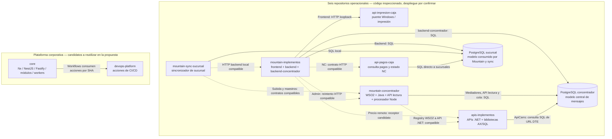
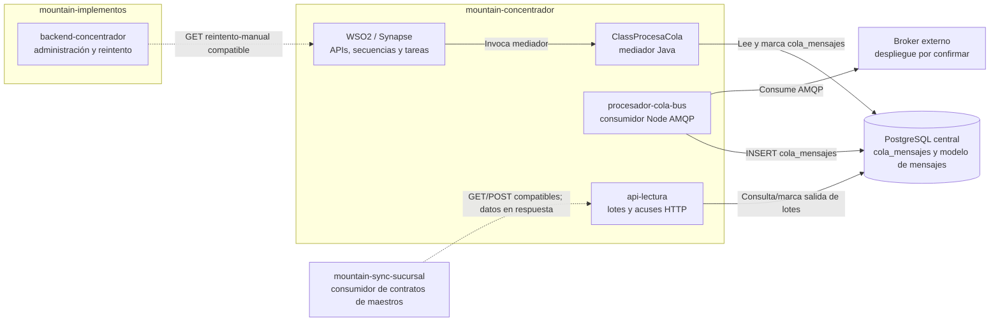

# Mapa de repositorios y conexiones del POS

Actualizado: **2 de octubre de 2026**. Inventario estático transversal de los **nueve repositorios entregados**: seis aportan código del ecosistema POS actual y tres son precedentes corporativos o material de formación. El nuevo repositorio `mountain-concentrador` permite localizar piezas antes pendientes: API de lectura, procesador Node de cola, mediadores Java y artefactos WSO2.

La presentación separa los **ocho repositorios de software** por su papel: Ecosistema muestra los seis del POS actual y diez relaciones seleccionadas; Propuesta concentra las fichas de core/devops-platform y la evidencia de su relación de CI/CD, como apoyo a la reutilización propuesta. `integration-presentations` se conserva en este inventario de fuentes solo como material del que se extrajeron ideas; queda fuera de los diagramas, tarjetas y conexiones del tutorial.

**Repositorio, aplicación, base y servidor no son equivalentes.** Un repositorio puede contener varias aplicaciones y bibliotecas. La evidencia identifica código y contratos compatibles; no determina qué commit, CAR, DLL, script, recurso de registry o configuración está instalado hoy. Los informes anteriores que decían “no localizado” describían el alcance de los cinco repositorios iniciales; este mapa incorpora la nueva fuente sin atribuirle producción.

No se ejecutaron aplicaciones, scripts de los repositorios, migraciones ni pruebas corporativas. No se accedió a bases, ERPs, periféricos ni endpoints privados. Las fuentes se fijan por SHA/rango y no se reproducen credenciales ni orígenes de servicios.

## 1. Los nueve nombres, sin mezclar operación y precedentes

| Repositorio | Papel en este análisis | Qué contiene o aporta |
| --- | --- | --- |
| [`mountain-implementos`](https://github.com/developer-implementos/mountain-implementos) | Operacional POS | Caja Angular, backend transaccional de sucursal y administración central del concentrador: tres aplicaciones en un mismo repositorio. |
| [`mountain-sync-sucursal`](https://github.com/developer-implementos/mountain-sync-sucursal) | Operacional POS | Sincronizador de sucursal: prepara subidas, recibe resultados, descarga maestros y llama al backend local. |
| [`mountain-concentrador`](https://github.com/developer-implementos/mountain-concentrador) | Operacional POS | Código de integración central ahora localizado: WSO2/Synapse, mediadores Java, API de lectura y procesador Node de cola. |
| [`api-impresion-caja`](https://github.com/developer-implementos/api-impresion-caja) | Operacional POS | Puente local Windows para impresión y lector de cheques, invocado por el frontend de caja. |
| [`api-pagos-caja`](https://github.com/developer-implementos/api-pagos-caja) | Operacional POS | Consultas corporativas de pagos/documentos y estados de notas de crédito; accede a PostgreSQL de sucursales y MongoDB. |
| [`apis-implementos`](https://github.com/developer-implementos/apis-implementos) | Operacional POS | Solución .NET corporativa: nueve APIs y tres bibliotecas, con adaptación AX, precios, documentos y lecturas de datos. |
| [`core`](https://github.com/developer-implementos/core) | Precedente corporativo | Precedente corporativo de monorepo Nx, NestJS/Fastify, módulos, workers, seguridad, contratos y observabilidad. |
| [`devops-platform`](https://github.com/developer-implementos/devops-platform) | Precedente corporativo | Acciones y automatización corporativa de CI/CD para servicios centrales; core ya referencia versiones concretas. |
| [`integration-presentations`](https://github.com/developer-implementos/integration-presentations) | Documentación | Material de formación sobre plataforma de integración, módulos, ACL, mensajería y entrega; sirve para explicar y contrastar decisiones. |

La clasificación `platform` no significa que `core` carezca de aplicaciones ejecutables. Significa que **no se acreditó su participación en esta cadena POS actual**. `devops-platform` sí aparece como dependencia de workflows de `core`; eso es automatización de entrega, no una llamada durante la venta. Las láminas de `integration-presentations` son evidencia documental, no despliegue.

### Versiones examinadas

| Repositorio | Referencia usada | SHA |
| --- | --- | --- |
| mountain-implementos | master | `711f97fd7948c696bf45c992c5b121683bdbacd7` |
| mountain-sync-sucursal | master; distinta de la predeterminada desarrollo | `540ab9a70e7befbca27a2f7eb88b87b25109e4d1` |
| mountain-concentrador | **Pablo**, predeterminada; commit de 2023-09-08 | `b2fd1ec266d131abb54b7076d41acce30f045119` |
| api-impresion-caja | main | `2e74b2d64985902f5fdfb52902016a5f65d7b577` |
| api-pagos-caja | main | `33cd625f029aa78798f0baf307c41e17ebee92e1` |
| apis-implementos | master | `8fbe2f1b4d4e464a403aa3daca63ffe712a9dd70` |
| core | main | `f43688abeda81d9935744c74994691df28dd6b1a` |
| devops-platform | main; otros pins consumidos por core | `fd423a6f2f4955bd650ee6aebba154d93c0425b8` |
| integration-presentations | main | `f96fd2d810b528517af75acea048b339beb2c284` |

En `mountain-concentrador` existe además `master` en `03ab8598b92b4f2dcad8c79861cc2e0036901b35`, también de 2023, y no se identificó `main`. La hipótesis del usuario de que probablemente se usa main no permite elegir una rama inexistente ni atribuir Pablo a producción. Comparar contratos de 2023 con consumidores de 2026 exige verificar los artefactos y configuración efectivos.

## 2. Topología por repositorio

Línea continua: interacción observada en código o dependencia de datos explícita. Línea punteada rotulada **compatible**: consumidor/receptor o modelo compatibles, con binding/despliegue pendiente. La dirección de las flechas SQL indica **quién consulta/escribe**, no quién “empuja” la base. Las respuestas HTTP no se dibujan de nuevo.

Este mapa no dibuja una base única compartida entre sucursales ni fija máquinas físicas. Tampoco coloca `core` entre el POS y AX. El broker AMQP, AX/AOS, MPOS/SQL Server, MongoDB, facturadores y dispositivos externos permanecen como dependencias del ecosistema: **no son repositorios adicionales entregados**. Sus conexiones detalladas se leen en el [catálogo de integraciones](catalogo-integraciones-actuales.md) y las [vistas de arquitectura](vistas-arquitectura-y-flujos.md), contrastadas con la nueva revisión central.

## 3. Dos “concentradores” que no deben confundirse

| Unidad | Repositorio real | Responsabilidad observada | No equivale a |
| --- | --- | --- | --- |
| `backend-concentrador` | mountain-implementos | Consulta/administración de mensajes y errores; reintento manual HTTP al bus. | WSO2, API lectura o worker de cola. |
| APIs/secuencias Synapse y recursos CAR/DSS/task | mountain-concentrador | Recepción/ruteo, invocación de mediadores, tareas y contratos hacia registry. | Una sola app Node o un solo servidor acreditado. |
| `ClassRegistraMensajeDetalle` | mountain-concentrador | Mediador Java de mensajes/cambios e integración con datos centrales. | Backend de caja o consumidor AMQP Node. |
| `ClassProcesaCola` | mountain-concentrador | Mediador Java que obtiene trabajo y registra su procesamiento. | `procesador-cola-bus` pese al nombre parecido. |
| `procesador-cola-bus` | mountain-concentrador | Consumidor AMQP que prepara datos para `cola_mensajes`; cron elimina registros marcados procesados correctamente. | El cron no es quien registra por sí mismo la venta en AX. |
| `api-lectura` | mountain-concentrador | API HTTP de lotes y acuses de salida con PostgreSQL. | Pantallas de administración o broker. |
| `ApiCarro` | apis-implementos | Entre otras capacidades, consulta tablas/JSON del concentrador para recuperar la URL de un DTE. | API de lectura de maestros ni receptor que registra ventas. |

El diagrama separa responsabilidades; **no prueba durabilidad por el solo nombre de “cola”**. El consumidor Node y el mediador Java necesitan revisión de sus ACK, claims y límites de transacción. La inspección de código sustituye “implementación no localizada” por componentes concretos; las garantías y el despliegue permanecen por validar.

## 4. Conexiones que conviene enseñar y su certeza

| Relación | Evidencia útil | Límite |
| --- | --- | --- |
| Mountain → impresión | Angular envía contenido de boletas, facturas y comprobantes de pago o cobranza al contrato térmico del servicio Windows. | Solicita impresión en papel; no emite un nuevo DTE ni confirma que el papel haya salido. Canal y periférico dependen de configuración. |
| Mountain → API pagos/NC | Controller consumidor y rutas Express compatibles. | No equivale a cobrar con Transbank; configuración/fallback vigentes pendientes. |
| API pagos → PostgreSQL de sucursales | SQL de documentos/pagos y resolución de conexión. | Dependencia de datos; no atraviesa necesariamente el backend de caja. |
| Mountain → APIs .NET de precio | Parámetros de consulta y receptor ApiPrecios candidato. | No asignar URL_API_CARRO o URL_API_CLIENTES por semejanza de nombre. |
| Sync → backend local | Cliente local y responsabilidades de sincronización. | La conexión HTTP y el acceso SQL local son acoplamientos diferentes. |
| Sync → WSO2 | POST `/api/mensajeEntradas/ingresar` y recurso Synapse compatible. | Snapshot 2023 vs 2026, CAR/configuración efectiva pendientes. |
| Sync → API lectura | GET cambios/sin-procesar y POST recibido/procesados en ambos lados. | Compatibilidad de contrato no demuestra cadencia, retención ni acuse durable. |
| Admin Mountain → WSO2 | GET `/api/reintentar/reintento-manual` en caller y recurso. | Administrador y bus son aplicaciones distintas, aunque compartan datos. |
| WSO2 → API .NET → AX | Secuencia de venta → endpoint de registry → receptor `creaFacturaOvFromPos`. | El recurso localizado es de QA; prefijo, despliegue activo y ejecución AX no se presumen. |
| ApiCarro → PostgreSQL central | Lee `mensaje_detalles`, `mensaje_detalle_sucursales`, `tipo_mensajes`, `entidades` y `UrlDte`. | Consulta documental, no registro de venta ni llamada REST a api-lectura. |
| core → devops-platform | Workflows fijan SHA de acciones. | Dependencia de CI/CD; no tráfico operacional de la caja. |

En el [dataset para la presentación](../presentation/repositories-data.js), `code` significa implementación observada, nunca prueba de producción; `compatible`, encaje estático con binding pendiente; y `reported`, relación informada que requeriría contraste. Se conservan once relaciones entre repositorios de software: diez pertenecen al mapa actual de Ecosistema y la relación core → devops-platform se consulta en Propuesta, junto a sus fichas y fuentes. **La dependencia CI/CD entre core y devops-platform no debe dibujarse como tráfico de una venta**, aunque sí tiene evidencia de código.

## 5. Qué cambia para la arquitectura propuesta

- Inventariar y versionar **contratos, consumidores SQL, recursos WSO2 y tareas** antes de retirar el bus o renombrar tablas. El concentrador ahora tiene consumidores identificables desde Mountain, sync y ApiCarro.
- Delimitar recepción, cola, preparación de lotes, procesamiento AX, respuesta a sucursal y administración. Compartir repositorio no vuelve atómicos esos pasos.
- Mantener fachada/ACL con modelos propios del POS y contratos por capacidad. Los adaptadores legacy pueden preservar nombres y formatos AX mientras se migra; los nuevos contratos no deben heredar tablas del bus como API pública.
- Reutilizar de core/devops únicamente capacidades seleccionadas y verificadas. El updater de sucursal, las migraciones recuperables, los permisos offline, el único escritor y la compatibilidad entre versiones siguen siendo trabajo del nuevo POS.

Son implicaciones de diseño, no cambios implementados. Ver [propuesta de arquitectura](propuesta-arquitectura.md), [revisión corporativa](revision-arquitectura-corporativa.md) y [validaciones pendientes](validacion-y-decisiones.md).

## 6. Evidencia que falta para cerrar la topología

Pedir un inventario por sucursal/entidad con versiones instaladas de backend, sync, agentes, APIs y bases; mapa de consumidores SQL; artefactos CAR/JAR/DSS y rutas/recursos de registry activos; endpoints lógicos y propietarios por capacidad; colas/tópicos, productores y consumidores; identificación del scheduler de maestros y de MPOS; y trazas de una venta y de un lote con identidades correlacionadas. Debe distinguirse lo generado en build de lo que realmente se activó, sin compartir credenciales.

Para la presentación, abrir [`window.POS_REPOSITORIES`](../presentation/repositories-data.js): `repositories` conserva los nueve IDs/nombres completos, rol, unidades, fuentes y límites; `connections` conserva emisor/receptor, significado, certeza y fuentes. La UI puede seleccionar una relación y desplegar su evidencia sin añadir otra colección de slides.

## Fuentes por snapshot

Las siguientes referencias sustentan el dataset y el contraste transversal. Los rangos se verifican contra los objetos Git locales; no se ejecuta el código. Los detalles ya auditados permanecen en [los informes por repositorio](analisis-repositorios/README.md).

- **R01:** [mountain-implementos/frontend/package.json:1-103](https://github.com/developer-implementos/mountain-implementos/blob/711f97fd7948c696bf45c992c5b121683bdbacd7/frontend/package.json#L1-L103).
- **R02:** [mountain-implementos/backend/package.json:1-63](https://github.com/developer-implementos/mountain-implementos/blob/711f97fd7948c696bf45c992c5b121683bdbacd7/backend/package.json#L1-L63).
- **R03:** [mountain-implementos/backend-concentrador/package.json:1-40](https://github.com/developer-implementos/mountain-implementos/blob/711f97fd7948c696bf45c992c5b121683bdbacd7/backend-concentrador/package.json#L1-L40).
- **R04:** [mountain-sync-sucursal/package.json:1-46](https://github.com/developer-implementos/mountain-sync-sucursal/blob/540ab9a70e7befbca27a2f7eb88b87b25109e4d1/package.json#L1-L46).
- **R05:** [mountain-sync-sucursal/app/Utils/Axios.js:9-61](https://github.com/developer-implementos/mountain-sync-sucursal/blob/540ab9a70e7befbca27a2f7eb88b87b25109e4d1/app/Utils/Axios.js#L9-L61).
- **R06:** [mountain-sync-sucursal/start/queueHooks.js:26-130](https://github.com/developer-implementos/mountain-sync-sucursal/blob/540ab9a70e7befbca27a2f7eb88b87b25109e4d1/start/queueHooks.js#L26-L130).
- **R07:** [mountain-concentrador/ESBImplementos/src/main/synapse-config/api/API_mensajeEntradas.xml:2-18](https://github.com/developer-implementos/mountain-concentrador/blob/b2fd1ec266d131abb54b7076d41acce30f045119/ESBImplementos/src/main/synapse-config/api/API_mensajeEntradas.xml#L2-L18).
- **R08:** [mountain-concentrador/ClassRegistraMensajeDetalle/src/main/java/cl/implementos/RegistraMensajeDetalle.java:45-104](https://github.com/developer-implementos/mountain-concentrador/blob/b2fd1ec266d131abb54b7076d41acce30f045119/ClassRegistraMensajeDetalle/src/main/java/cl/implementos/RegistraMensajeDetalle.java#L45-L104).
- **R09:** [mountain-concentrador/ClassProcesaCola/src/main/java/cl/implementos/ProcesaCola.java:39-84](https://github.com/developer-implementos/mountain-concentrador/blob/b2fd1ec266d131abb54b7076d41acce30f045119/ClassProcesaCola/src/main/java/cl/implementos/ProcesaCola.java#L39-L84).
- **R10:** [mountain-concentrador/api-lectura/start/routes.js:23-26](https://github.com/developer-implementos/mountain-concentrador/blob/b2fd1ec266d131abb54b7076d41acce30f045119/api-lectura/start/routes.js#L23-L26).
- **R11:** [mountain-concentrador/procesador-cola-bus/start/queueHooks.js:31-58](https://github.com/developer-implementos/mountain-concentrador/blob/b2fd1ec266d131abb54b7076d41acce30f045119/procesador-cola-bus/start/queueHooks.js#L31-L58).
- **R12:** [api-impresion-caja/WindowsServiceImpresora/ServiceImpresora.cs:30-60](https://github.com/developer-implementos/api-impresion-caja/blob/2e74b2d64985902f5fdfb52902016a5f65d7b577/WindowsServiceImpresora/ServiceImpresora.cs#L30-L60).
- **R13:** [api-impresion-caja/WindowsServiceImpresora/WindowsServiceImpresora.csproj:8-11](https://github.com/developer-implementos/api-impresion-caja/blob/2e74b2d64985902f5fdfb52902016a5f65d7b577/WindowsServiceImpresora/WindowsServiceImpresora.csproj#L8-L11).
- **R14:** [api-impresion-caja/AplicacionWeb/Controllers/HomeController.cs:13-51](https://github.com/developer-implementos/api-impresion-caja/blob/2e74b2d64985902f5fdfb52902016a5f65d7b577/AplicacionWeb/Controllers/HomeController.cs#L13-L51).
- **R15:** [api-pagos-caja/routes/pagos.js:1-16](https://github.com/developer-implementos/api-pagos-caja/blob/33cd625f029aa78798f0baf307c41e17ebee92e1/routes/pagos.js#L1-L16).
- **R16:** [api-pagos-caja/services/pagosService.js:78-140](https://github.com/developer-implementos/api-pagos-caja/blob/33cd625f029aa78798f0baf307c41e17ebee92e1/services/pagosService.js#L78-L140).
- **R17:** [api-pagos-caja/models/estadoNC.model.js:4-28](https://github.com/developer-implementos/api-pagos-caja/blob/33cd625f029aa78798f0baf307c41e17ebee92e1/models/estadoNC.model.js#L4-L28).
- **R18:** [apis-implementos/ApisImplementos.sln:6-29](https://github.com/developer-implementos/apis-implementos/blob/8fbe2f1b4d4e464a403aa3daca63ffe712a9dd70/ApisImplementos.sln#L6-L29).
- **R19:** [apis-implementos/apiMountainPosCaja/Controllers/CajaController.cs:23-77](https://github.com/developer-implementos/apis-implementos/blob/8fbe2f1b4d4e464a403aa3daca63ffe712a9dd70/apiMountainPosCaja/Controllers/CajaController.cs#L23-L77).
- **R20:** [apis-implementos/ApiCarro/Controllers/CarroController.cs:338-355](https://github.com/developer-implementos/apis-implementos/blob/8fbe2f1b4d4e464a403aa3daca63ffe712a9dd70/ApiCarro/Controllers/CarroController.cs#L338-L355).
- **R21:** [apis-implementos/ApiPrecios/Controllers/PreciosController.cs:17-190](https://github.com/developer-implementos/apis-implementos/blob/8fbe2f1b4d4e464a403aa3daca63ffe712a9dd70/ApiPrecios/Controllers/PreciosController.cs#L17-L190).
- **R22:** [core/apps/core-api/src/bootstrap/factories/nest-application.factory.ts:25-38](https://github.com/developer-implementos/core/blob/f43688abeda81d9935744c74994691df28dd6b1a/apps/core-api/src/bootstrap/factories/nest-application.factory.ts#L25-L38).
- **R23:** [core/apps/sync-worker/src/erp-adapters/erp-adapters.module.ts:150-199](https://github.com/developer-implementos/core/blob/f43688abeda81d9935744c74994691df28dd6b1a/apps/sync-worker/src/erp-adapters/erp-adapters.module.ts#L150-L199).
- **R24:** [core/eslint.config.mjs:151-215](https://github.com/developer-implementos/core/blob/f43688abeda81d9935744c74994691df28dd6b1a/eslint.config.mjs#L151-L215).
- **R25:** [devops-platform/.github/actions/deploy-cloud-run/action.yml:375-533](https://github.com/developer-implementos/devops-platform/blob/fd423a6f2f4955bd650ee6aebba154d93c0425b8/.github/actions/deploy-cloud-run/action.yml#L375-L533).
- **R26:** [core/.github/workflows/ci.yml:737-737](https://github.com/developer-implementos/core/blob/f43688abeda81d9935744c74994691df28dd6b1a/.github/workflows/ci.yml#L737-L737).
- **R27:** [core/.github/workflows/deploy.yml:1684-1684](https://github.com/developer-implementos/core/blob/f43688abeda81d9935744c74994691df28dd6b1a/.github/workflows/deploy.yml#L1684-L1684).
- **R28:** [integration-presentations/README.md:1-58](https://github.com/developer-implementos/integration-presentations/blob/f96fd2d810b528517af75acea048b339beb2c284/README.md#L1-L58).
- **R29:** [integration-presentations/presentations/architecture/enterprise-integration-platform-detailed.md:846-876](https://github.com/developer-implementos/integration-presentations/blob/f96fd2d810b528517af75acea048b339beb2c284/presentations/architecture/enterprise-integration-platform-detailed.md#L846-L876).
- **R30:** [mountain-implementos/frontend/src/app/services/impresion.service.ts:107-145](https://github.com/developer-implementos/mountain-implementos/blob/711f97fd7948c696bf45c992c5b121683bdbacd7/frontend/src/app/services/impresion.service.ts#L107-L145).
- **R31:** [api-impresion-caja/WindowsServiceImpresora/Controllers/ImpresionController.cs:49-71](https://github.com/developer-implementos/api-impresion-caja/blob/2e74b2d64985902f5fdfb52902016a5f65d7b577/WindowsServiceImpresora/Controllers/ImpresionController.cs#L49-L71).
- **R32:** [mountain-implementos/backend/app/Controllers/Http/NotaDeCreditoAxController.js:447-500](https://github.com/developer-implementos/mountain-implementos/blob/711f97fd7948c696bf45c992c5b121683bdbacd7/backend/app/Controllers/Http/NotaDeCreditoAxController.js#L447-L500).
- **R33:** [api-pagos-caja/services/pagosService.js:326-353](https://github.com/developer-implementos/api-pagos-caja/blob/33cd625f029aa78798f0baf307c41e17ebee92e1/services/pagosService.js#L326-L353).
- **R34:** [mountain-implementos/backend/app/Services/Precios/PreciosImplementosServices.js:12-56](https://github.com/developer-implementos/mountain-implementos/blob/711f97fd7948c696bf45c992c5b121683bdbacd7/backend/app/Services/Precios/PreciosImplementosServices.js#L12-L56).
- **R35:** [mountain-sync-sucursal/app/Utils/Axios.js:46-61](https://github.com/developer-implementos/mountain-sync-sucursal/blob/540ab9a70e7befbca27a2f7eb88b87b25109e4d1/app/Utils/Axios.js#L46-L61).
- **R36:** [mountain-sync-sucursal/app/Services/LlamadaApis/CambiosConcentradorService.js:289-318](https://github.com/developer-implementos/mountain-sync-sucursal/blob/540ab9a70e7befbca27a2f7eb88b87b25109e4d1/app/Services/LlamadaApis/CambiosConcentradorService.js#L289-L318).
- **R37:** [mountain-concentrador/api-lectura/app/Services/MensajeSalidaService.js:47-90](https://github.com/developer-implementos/mountain-concentrador/blob/b2fd1ec266d131abb54b7076d41acce30f045119/api-lectura/app/Services/MensajeSalidaService.js#L47-L90).
- **R38:** [mountain-sync-sucursal/app/Services/LlamadaApis/CambiosConcentradorService.js:154-287](https://github.com/developer-implementos/mountain-sync-sucursal/blob/540ab9a70e7befbca27a2f7eb88b87b25109e4d1/app/Services/LlamadaApis/CambiosConcentradorService.js#L154-L287).
- **R39:** [mountain-implementos/backend-concentrador/app/Controllers/Http/ConcentradorController.js:126-155](https://github.com/developer-implementos/mountain-implementos/blob/711f97fd7948c696bf45c992c5b121683bdbacd7/backend-concentrador/app/Controllers/Http/ConcentradorController.js#L126-L155).
- **R40:** [mountain-concentrador/ESBImplementos/src/main/synapse-config/api/API_reintentar.xml:2-37](https://github.com/developer-implementos/mountain-concentrador/blob/b2fd1ec266d131abb54b7076d41acce30f045119/ESBImplementos/src/main/synapse-config/api/API_reintentar.xml#L2-L37).
- **R41:** [mountain-implementos/backend-concentrador/start/routes.js:19-51](https://github.com/developer-implementos/mountain-implementos/blob/711f97fd7948c696bf45c992c5b121683bdbacd7/backend-concentrador/start/routes.js#L19-L51).
- **R42:** [mountain-concentrador/api-lectura/app/Models/MensajeDetalleSucursal.js:1-35](https://github.com/developer-implementos/mountain-concentrador/blob/b2fd1ec266d131abb54b7076d41acce30f045119/api-lectura/app/Models/MensajeDetalleSucursal.js#L1-L35).
- **R43:** [WSO2: llamada al registry y secuencia de respuesta](https://github.com/developer-implementos/mountain-concentrador/blob/b2fd1ec266d131abb54b7076d41acce30f045119/ESBImplementos/src/main/synapse-config/sequences/SEQ_AX_Insert_ventas.xml#L13-L32).
- **R44:** [Recurso QA: contrato de ventas y timeout, no binding productivo](https://github.com/developer-implementos/mountain-concentrador/blob/b2fd1ec266d131abb54b7076d41acce30f045119/QARegistryResource/EP_Ventas.xml#L3-L6).
- **R45:** [apiMountainPosCaja: receptor POST de factura/OV](https://github.com/developer-implementos/apis-implementos/blob/8fbe2f1b4d4e464a403aa3daca63ffe712a9dd70/apiMountainPosCaja/Controllers/CajaController.cs#L23-L26).
