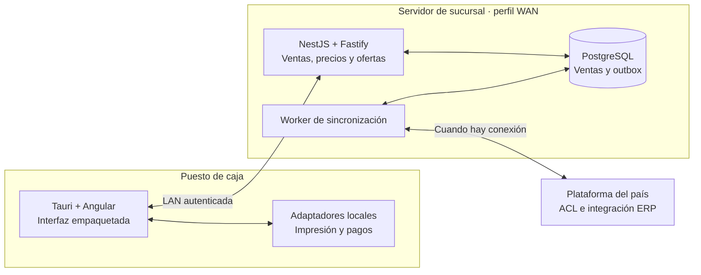

# Opciones tecnológicas discutidas para el POS

Registro iniciado el 1 de octubre de 2026, precisado el 5 de octubre de 2026. Complementa la [propuesta de arquitectura](propuesta-arquitectura.md) y conserva las alternativas planteadas por el usuario después del análisis inicial de repositorios. **Angular empaquetado en Tauri y el uso de Nx son direcciones indicadas por el usuario. NestJS/Fastify y PostgreSQL en sucursal y país son la recomendación técnica explícita, aún pendiente de aprobación y piloto.** Aceptar cliente y Nx no aprueba automáticamente backend, datos, topología, operación ni todos los dispositivos. Este documento no acredita implementación ni despliegue del producto POS objetivo.

La evaluación de **WSO2, RabbitMQ, BullMQ, workers PostgreSQL y Pub/Sub** está en [Investigación de mensajería](investigacion-mensajeria-pos.md). Incluye el backend PostgreSQL documentado actualmente por BullMQ, sin asumir que sea tan probado como Redis ni que comparta automáticamente la transacción de venta. La [revisión corporativa](revision-arquitectura-corporativa.md) reúne selección provisional, simplificación de motores, horario y condiciones de retirada. Estas decisiones son independientes de NestJS/Fastify o del monorepo.

La [revisión posterior de la plataforma corporativa](analisis-repositorios/aportes-plataforma-corporativa.md) encontró Nx, NestJS/Fastify, Pino y Sentry implementados en `core`, con módulos y workers. Por tanto, TEC-01/02/04/05 tienen un precedente interno que debe aprovecharse. Su reutilización requiere límites claros y adaptación offline; Tauri y la entrega de una flota de cajas no quedan resueltos por ese precedente. Los tres informes incorporan commits y evidencias sin certificar despliegues.

La evaluación de **servicios de IA** está en [Propuestas de IA para el POS](servicios-ia-pos.md). Compara tareas y alternativas convencionales antes de seleccionar generación de texto, búsqueda semántica, OCR o modelos de anomalías. Los proveedores y runtimes son candidatos; se conservan contratos propios, autonomía del núcleo, autorización de datos y alternativas offline. Incorporar IA no obliga a otro motor de base ni a un modelo por caja.

## 1. Estado de las alternativas

**Evolución futura adicional:** [RFID y autoservicio](evolucion-rfid-autoservicio.md). Evaluar lectores/antenas/etiquetas junto con los productos y el entorno físico, detrás de contratos de captura. RFID no obliga a cambiar NestJS, Tauri o el motor de datos, ni a crear un POS distinto por fabricante. SDK, middleware del lector y configuración regional requieren homologación. El eventual conteo se integra con el dueño de inventario; no introduce autoridad de stock en caja por defecto.

| ID | Alternativa planteada por el usuario | Evaluación y recomendación inicial | Decisión pendiente |
| --- | --- | --- | --- |
| TEC-01 | NestJS con Fastify en lugar de Express | Backend recomendado de sucursal y país. Monolito modular en sucursal; workers supervisados según responsabilidad. | Aprobación técnica, compatibilidad, experiencia del equipo, recursos locales, versiones y alcance de migración. |
| TEC-02 | Usar `nestjs-pino` y Sentry | Pino para logging estructurado; Sentry para errores y trazas, con política de captura, correlación y operación desconectada. | Retención, datos permitidos, alojamiento, presupuesto de telemetría y validación de integración. |
| TEC-03 | Aplicación de escritorio Tauri en lugar de navegador | Dirección de cliente aceptada: Angular empaquetado en Tauri para puestos físicos de caja. Administración/reporting podrían continuar en navegador. | Homologación de periféricos, empaquetado, distribución y soporte Rust/WebView2; esta dirección no amplía el perfil offline. |
| TEC-04 | Usar Nx | Dirección indicada para organizar el producto, sus contratos y tareas de construcción/validación; se recomienda un monorepo POS con releases propios. | Alcance del repositorio, límites de proyectos, toolchains, CI, propiedad y estrategia de releases. |
| TEC-05 | Quizás usar un monolito modular | Recomendado como punto de partida del núcleo transaccional; plataforma central y workers mantienen límites operativos propios. | Módulos, autoridad de datos, transacciones y criterios para separar procesos/servicios. |
| TEC-06 | PostgreSQL o MongoDB para los datos del POS | Recomendar PostgreSQL de sucursal y PostgreSQL operativo por país; tablas relacionales más JSONB para datos variables acotados. MongoDB se conserva donde haya un caso vigente identificado, sin desplegarlo por defecto en tiendas. | Validación del modelo, carga, recuperación, aislamiento por país, versiones soportadas y transición de consumidores heredados. |

La adopción de un framework no demuestra por sí sola integridad de ventas, idempotencia de pagos ni autonomía offline. Esas garantías se establecen en contratos, transacciones, estados y recuperación, y se comprueban con pruebas.

## 2. NestJS y Fastify

**Planteamiento:** usar NestJS para organizar módulos, casos de uso, autorización e integraciones, y Fastify como proveedor HTTP mediante `@nestjs/platform-fastify`. Nest dispone de un adaptador oficial; los middleware específicos de Express requieren revisar compatibilidad o equivalentes Fastify. [Documentación oficial](https://docs.nestjs.com/techniques/performance).

El despliegue recomendado es concreto: **backend de sucursal NestJS + Fastify, compartido por sus cajas y conectado a PostgreSQL de sucursal; backend de país NestJS + Fastify, conectado a PostgreSQL operativo del país**. Los workers reutilizan módulos de aplicación en procesos supervisados y no necesitan exponer HTTP para realizar sus trabajos. Nest admite contextos de aplicación independientes de listeners de red. «Núcleo local» se denomina aquí backend de sucursal para que su ubicación y responsabilidad queden claras. [Aplicaciones independientes de Nest](https://docs.nestjs.com/standalone-applications).

El beneficio buscado es coherencia de código y límites de responsabilidad. No se promete una mejora porcentual del rendimiento del POS a partir de benchmarks HTTP: las consultas SQL, el fan-out entre sucursales y las integraciones remotas observadas pueden dominar la latencia total.

Organización propuesta:

- Módulos de ventas, caja/turnos, catálogo/precios/ofertas, pagos, devoluciones y conciliación.
- Reglas de negocio y casos de uso independientes de objetos HTTP y detalles Fastify.
- Fachadas y ACL para integrar ERPs y proveedores, manteniendo contratos propios del POS.
- Workers de sincronización y conciliación con ciclos de vida y recursos controlables. Compartir módulos no obliga a ejecutar todas las funciones en un proceso.
- Persistencia transaccional e inbox/outbox durables; cron y colas en memoria no sustituyen esos mecanismos.

**Alcance real de la migración:** `api-pagos-caja` usa Express directamente, mientras Mountain, el concentrador y el sincronizador usan AdonisJS. Pasarlos a NestJS exige revisar ORM, transacciones, validación, autenticación y jobs; no es solamente cambiar el servidor HTTP. Los adaptadores .NET y de dispositivos pueden conservarse donde cumplan los contratos.

**Criterio de piloto:** una operación representativa con persistencia, worker y telemetría en hardware de sucursal. Medir latencia de extremo a extremo, memoria, CPU, conexiones y recuperación. Comparar contratos y resultados con el sistema actual sin duplicar efectos externos.

### PostgreSQL en sucursal y país frente a MongoDB

**Recomendación:** una base PostgreSQL por sucursal en el perfil WAN y una base operativa PostgreSQL por país en la plataforma central. «Por país» fija separación de datos y autoridad; instancias, clústeres, réplicas y alojamiento se dimensionan después. No hay una base transaccional por terminal ni una conexión SQL desde Angular/Tauri. El cliente llama a la API; el backend y sus workers autorizados acceden a la persistencia.

| Criterio del POS | PostgreSQL propuesto | MongoDB como alternativa | Criterio de elección |
| --- | --- | --- | --- |
| Venta, partidas, pagos, turnos y devoluciones relacionados | Tablas con claves, referencias y restricciones explícitas; una transacción coordina los cambios locales | Se puede modelar con documentos embebidos o referencias, y usar transacciones cuando se modifican varios documentos | Recomendamos el modelo relacional para estas invariantes y consultas; no suponemos superioridad de rendimiento sin medir |
| Negocio y mensajes pendientes | Venta y outbox en la misma transacción de sucursal; inbox, efecto y outbox en la misma transacción de país | Es posible implementar también un outbox transaccional; requiere diseñar transacciones, sesiones, esquema y configuración de durabilidad | Mantener una sola frontera transaccional por nodo evita escrituras dobles entre motores |
| Reglas variables y payloads de integración | JSONB junto a columnas tipadas para IDs, dinero, estado, país y versión | El modelo documental puede ser adecuado para agregados autocontenidos y proyecciones de consulta | Necesitar JSON no basta para introducir otro motor; evaluar consultas, tamaños, índices y evolución del esquema |
| Operación y evolución del legado | Continúa el motor ya observado en sucursales; centraliza prácticas de migración, backup y recuperación en el objetivo POS | Puede seguir siendo dueño o proyección de datos en servicios existentes que lo justifiquen | La reducción de motores es un objetivo operativo; no autoriza retirar MongoDB ni alterar servicios vigentes sin inventario y transición |

PostgreSQL ofrece restricciones `PRIMARY KEY`, `UNIQUE`, `CHECK` y claves foráneas para expresar parte de esas invariantes. La aplicación sigue siendo responsable de reglas entre operaciones, autorización y recuperación. Las restricciones y pruebas de concurrencia deben diseñarse; instalar PostgreSQL no evita por sí solo una devolución doble. [Restricciones PostgreSQL](https://www.postgresql.org/docs/current/ddl-constraints.html).

JSONB permite consultas e índices sobre JSON, de modo que reglas y payloads variables pueden coexistir con datos relacionales. Se propone limitar su tamaño y darles un contrato/versionado; importes, referencias y estados que soporten invariantes no se ocultan en un documento sin controles. JSONB no conserva formato textual original ni orden de claves: el original firmado o evidencia que requiera bytes exactos se conserva separadamente. [Tipos JSON y diseño de documentos en PostgreSQL](https://www.postgresql.org/docs/current/datatype-json.html).

**MongoDB sí ofrece transacciones ACID multidocumento** en replica sets y clústeres fragmentados. Su documentación advierte que no sustituyen un modelo de datos adecuado y pueden costar más que las escrituras de un solo documento. Los servidores independientes no soportan esas transacciones; la topología, `read concern` y `write concern` forman parte de la evaluación. Esta es una diferencia operativa que debe probarse, no una razón para afirmar que MongoDB carece de transacciones. [Transacciones](https://www.mongodb.com/docs/manual/core/transactions/), [consideraciones de producción](https://www.mongodb.com/docs/manual/core/transactions-production-consideration/).

La decisión podría revisarse para una **proyección documental delimitada**, con propietario, consultas y métricas que demuestren beneficio sobre PostgreSQL/JSONB, sin hacerla autoridad simultánea de la misma venta. No recomendamos dual write «venta en PostgreSQL, outbox o réplica obligatoria en MongoDB»; una proyección en otro motor se alimentaría después del commit por eventos y podría reconstruirse. Las fuentes MongoDB actuales de catálogo/precios no obligan a instalar MongoDB en sucursal: el adaptador publica contratos del dominio y el POS mantiene su espejo local autorizado.

### Schemas, transacciones y espejos locales

Los nombres siguientes describen propiedad lógica, no un esquema implementado. Se propone una sola base de sucursal con schemas/tablas por módulo y acceso a través de sus interfaces:

| Propietario | Datos propuestos | Escritura permitida |
| --- | --- | --- |
| Ventas y caja | Venta, partidas, aplicación de importes, turno, movimientos y referencias de devolución | Casos de uso del módulo; una unidad de trabajo comparte transacción cuando una invariante lo requiere |
| Pagos y fiscalidad | Intentos, referencias externas, resultados inciertos, respuestas y evidencias | Sus módulos y adaptadores por comandos; nunca equiparar commit de venta con pago autorizado o documento aceptado |
| Precios/maestros | Espejos de catálogo, clientes permitidos, precios y promociones, con versión, vigencia y origen | Consumidor de distribución autorizado; el uso local es lectura y cálculo, no edición implícita del maestro corporativo |
| Sincronización | Outbox, inbox, cursor, intentos, entrega y acuses | Productores insertan outbox dentro de la transacción de negocio; workers solo actualizan metadatos de entrega y llaman al módulo receptor |
| Módulos de país | Inbox y proyecciones consolidadas, distribución, conciliación y outbox por destino | Transacción propia de país; la copia de una venta de sucursal no habilita otro editor de su historia |

La inserción de outbox participa en **la misma conexión y transacción** de PostgreSQL que el cambio de negocio; no basta usar dos repositorios que apunten al mismo servidor. En recepción, una clave única de origen + consumidor + ID de evento y la verificación del contenido soportan deduplicación: mismo ID y otro contenido se rechaza. Inbox, efecto de recepción y nuevos mensajes se confirman juntos antes del ACK. Las garantías se prueban con reinicios, mensajes repetidos y acuses perdidos. [Transacciones PostgreSQL](https://www.postgresql.org/docs/current/tutorial-transactions.html).

Para precios y promociones se recomienda un espejo de lectura PostgreSQL de sucursal con **deltas por eventos, carga masiva programada y conciliación manual controlada**. La carga se prepara y valida antes de activar un conjunto coherente; la venta registra la versión aplicada. El dueño de cada dato, la cobertura de eventos, vigencias y política de datos vencidos requieren contrato. Esto elimina la consulta central obligatoria del camino de venta permitido offline sin convertir a la sucursal en autora del precio corporativo. El funcionamiento se desarrolla en [Operación de caja y evolución](operacion-caja-y-evolucion.md).

## 3. Pino, `nestjs-pino` y Sentry

### Logging y correlación

Fastify utiliza Pino cuando se habilita su logger. `nestjs-pino` permite integrarlo con el logging de Nest y contexto de solicitudes. Se propone una política centralizada y un único mecanismo de logging automático HTTP, evitando duplicar registros. La opción `useExisting` requiere atender las diferencias entre contexto HTTP, ciclo de vida y otros contextos descritas por la biblioteca. [Fastify Logging](https://fastify.dev/docs/latest/Reference/Logging/), [nestjs-pino](https://github.com/iamolegga/nestjs-pino).

Campos propuestos, según disponibilidad y política de datos:

| Ámbito | Campos de referencia |
| --- | --- |
| Aplicación y despliegue | `service`, `release`, `environment` |
| Origen de la operación | `country`, entidad legal, `storeId`, `terminalId` |
| Diagnóstico | `requestId`, `traceId`, correlación y duración |
| Negocio e integración | `saleId`, `paymentId`, `eventId`, ID de intento y estado |

Los IDs de negocio permanecen estables aunque un reintento tenga otro request/trace ID. En workers se crea y propaga contexto explícitamente. Se propone JSON en producción y una vista legible durante desarrollo. La política debe excluir credenciales, tokens, datos de tarjeta y datos personales innecesarios; no registrar cuerpos completos por defecto.

### Sentry

Usar el SDK oficial `@sentry/nestjs`, inicializado antes de los módulos que debe instrumentar, con versión/release identificable y source maps. Integrar los filtros de excepciones y aislar el contexto de trabajos en segundo plano para no mezclar información entre operaciones. [Guía NestJS de Sentry](https://docs.sentry.io/platforms/javascript/guides/nestjs/).

Sentry ofrece integración con Pino para capturar logs y, opcionalmente, errores. Definir niveles, muestreo y quién captura cada excepción, evitando enviarla varias veces desde un filtro, el logger y una llamada manual. La selección de versiones debe respetar la compatibilidad del SDK y la integración; no se ha fijado aquí una combinación exacta. [Integración oficial Pino–Sentry](https://docs.sentry.io/platforms/javascript/guides/nestjs/configuration/integrations/pino/).

### Condiciones para operación offline

- Una caída de Internet o del destino de telemetría no debe bloquear ventas, commits locales ni workers.
- Logs locales con rotación, límites de disco/memoria y envío posterior controlado. Definir retención o descarte ante saturación.
- Verificar las garantías concretas de persistencia del transporte elegido; no asumir una cola durable por instalar el SDK.
- Conservar ventas, pagos y auditoría financiera en registros transaccionales. Logs y trazas muestreadas no son su fuente de verdad.
- Medir antigüedad del backlog, pendientes fiscales, pagos inciertos, demora de confirmación ERP y cobertura de sucursales, además de errores HTTP.
- Confirmar si Sentry puede alojarse como servicio externo o requiere otra modalidad según las restricciones del proyecto.

Con el cliente Tauri previsto, Pino cubre el proceso Node/NestJS; interfaz y proceso Rust necesitan instrumentación propia y correlación entre procesos, cuya compatibilidad debe comprobarse.

## 4. Tauri como cliente de caja

La dirección aceptada de cliente es **Angular empaquetado en Tauri**. Tauri permite una interfaz HTML/CSS/JavaScript dentro de una aplicación de escritorio, con un proceso nativo Rust y WebView; en Windows emplea WebView2. Las reglas de negocio permanecen en el backend de sucursal y módulos de dominio, sin obligación de portarlas a Rust. La aceptación de esta dirección no acredita compatibilidad de todos los SDK o periféricos. [Modelo de procesos](https://v2.tauri.app/concept/process-model/), [configuración del frontend](https://v2.tauri.app/start/frontend/).

Se propone empaquetar los recursos necesarios de la interfaz para que pueda arrancar sin descargarlos de un servidor. Revisar navegación, rutas, configuración de endpoints, almacenamiento y autenticación. Angular 8 y las dependencias observadas requieren su propio plan de actualización aunque se empaqueten en Tauri.

### Distribución según el perfil offline

| Requisito | Distribución candidata | Consecuencia |
| --- | --- | --- |
| Sin Internet, sucursal disponible | Tauri en cajas; NestJS/Fastify y PostgreSQL en sucursal. | La sucursal sigue siendo el escritor compartido; perder LAN o servidor puede detener ventas. |
| Sin Internet y también sin LAN/servidor | Tauri, servicio transaccional y persistencia por caja; coordinación y sincronización posterior. | Requiere identidad por caja, reglas locales y políticas explícitas para stock, NC y otros recursos compartidos. |



El diagrama corresponde al perfil WAN. Instalar Tauri no resuelve la dependencia de precios online, contingencias fiscales ni autorización de pagos. El perfil de aislamiento por caja exige otro despliegue y garantías adicionales; no consiste en habilitar automáticamente otro escritor cuando falla la sucursal.

### Relación con NestJS y los dispositivos

NestJS corre en un proceso Node separado, no dentro del WebView. Puede residir en sucursal o en el terminal. Tauri documenta cómo distribuir Node como sidecar; si los trabajos deben continuar al cerrar la ventana, se propone un servicio supervisado independiente de la interfaz. [Node.js como sidecar](https://v2.tauri.app/learn/sidecar-nodejs/).

Mantener inicialmente los adaptadores de impresión/pagos que superen validación, detrás de contratos locales. No se presupone compatibilidad Transbank porque funcione desde Chrome ni la necesidad de reescribir impresión/MICR en Rust. Corregir los resultados ambiguos y la identidad de trabajos documentados en el análisis sigue siendo necesario.

El requisito de variantes por país/sucursal se desarrolla en [Extensibilidad de proveedores y dispositivos](extensibilidad-proveedores-dispositivos.md). La selección se hace con perfiles aprobados y capacidades por operación; no con una bifurcación de Angular/Tauri por modelo. Un adaptador nuevo puede entregarse como proceso separado cuando el SDK lo requiera. Núcleo, interfaz y agentes mantienen contratos compatibles y ciclos de despliegue controlados; cerrar la ventana no debe borrar ni reiniciar intentos externos pendientes.

### Seguridad, distribución y soporte

- Capacidades nativas acotadas y comandos concretos. No exponer credenciales de PostgreSQL/ERP o ejecución genérica de comandos al frontend. Revisar origen, comunicación autenticada con agentes y permisos. [Capabilities de Tauri](https://v2.tauri.app/security/capabilities/).
- Instalador que contemple dependencias sin Internet. Tauri admite distribuir el instalador offline de WebView2 o un runtime fijo; la elección incluye responsabilidad de actualización y mantenimiento. [Instalador Windows](https://v2.tauri.app/distribute/windows-installer/).
- Paquetes firmados, actualización por grupos de tiendas y convivencia de versiones de cliente/backend/agentes. El updater verifica firmas; la política de despliegue y recuperación pertenece al proyecto. [Updater](https://v2.tauri.app/plugin/updater/).
- No actualizar durante una venta crítica ni revertir datos eliminando operaciones nuevas. Verificar compatibilidad de esquemas antes de permitir rollback de binarios.
- Incluir mantenimiento de Rust, WebView2, empaquetado, dispositivos y flota instalada en el coste y capacidades del equipo.

**Piloto propuesto:** caja Windows representativa con periféricos y proveedores de prueba. Verificar arranque sin Internet, impresión/reimpresión, lector y pago permitido en homologación; cortar WAN, LAN, servidor y agente por separado. Probar cierre inesperado, reinicio durante operación, convivencia de versiones y actualización fallida. Aprobar solo con recuperación trazable sin repetir cobros ni documentos, y con restricciones visibles en cada escenario.

## 5. Monorepo con Nx

**Dirección indicada por el usuario:** usar Nx para organizar el producto. Se recomienda un monorepo POS con contratos y releases propios; falta concretar límites de proyectos, propiedad y convivencia con `core`. Este repositorio `pos-enterprise` conserva el análisis y la presentación. La maqueta funcional separada `corporate-pos` usa Nx y datos sintéticos; no demuestra que el backend de sucursal, PostgreSQL, integración ERP o sincronización de esta propuesta estén implementados.

Monorepo define cómo se organiza el código. Nx aporta un grafo de proyectos y tareas, caché y ejecución de tareas afectadas por cambios. Esto no determina cuántos procesos, bases o despliegues existen en producción. Su caché de compilación tampoco es una caché de datos del POS ni una solución offline de negocio. [Tareas Nx](https://nx.dev/docs/features/run-tasks), [caché de tareas](https://nx.dev/docs/features/cache-task-results), [tareas afectadas](https://nx.dev/docs/features/ci-features/affected).

Nx tiene integraciones para Angular y NestJS. Para Rust/Tauri y otros componentes, las tareas deben incorporar sus herramientas nativas; un comando Nx no sustituye Cargo, compilación Windows, firma o homologación. La guía oficial de Rust también contempla comandos personalizados y un plugin comunitario opcional. Los proyectos .NET existentes pueden continuar fuera del monorepo o integrarse después con su cadena de construcción validada. [Nx Angular](https://nx.dev/docs/technologies/angular/introduction), [Nx NestJS](https://nx.dev/docs/technologies/node/nest/introduction), [Rust en Nx](https://nx.dev/docs/kb/add-rust-to-nx-workspace).

### Organización ilustrativa

La siguiente estructura es un mapa del objetivo, no una afirmación de que todos estos directorios o procesos existan en la maqueta ni una obligación de desplegarlos desde el inicio. Los nombres definitivos dependen del glosario y del alcance aprobado.

```text
apps/
  pos-desktop/           # Angular y proyecto Tauri/src-tauri
  pos-runtime/           # NestJS + Fastify en sucursal, perfil WAN recomendado
  pos-sync-worker/       # Sincronización local supervisada
  country-api/           # Recepción, consolidación y administración por país
  erp-worker/            # Integración en la red autorizada del ERP
  backoffice/            # Administración web, si el alcance la requiere
libs/
  sales/                 # Venta y sus interfaces públicas
  cash/                  # Turnos y movimientos de caja
  payments/              # Intentos, resultados y coordinación de pagos
  pricing/               # Reglas puras/versionadas de precios y ofertas
  returns/               # Devoluciones y consumo autorizado de NC
  fiscal/                # Contratos y políticas por país
  erp/                   # Puertos, ACL y adaptadores por sistema
  sync/                  # Protocolo, estados e inbox/outbox
  contracts/             # Contratos de intercambio versionados
  shared-kernel/         # Tipos mínimos: dinero, moneda e identidad
  ui/                    # Componentes de presentación reutilizables
docs/
tools/
```

La disposición de carpetas no crea por sí sola proyectos Nx ni límites verificables. Se definirán proyectos en las fronteras que deban controlarse. Cada módulo puede separar dominio, aplicación e infraestructura sin generar una biblioteca por cada clase o función. Evitar una librería `shared` que exponga todos los modelos ORM y reglas de todos los dominios.

### Reglas para que el monorepo mantenga límites

| Regla propuesta | Aplicación |
| --- | --- |
| Dependencias controladas | Etiquetas por dominio, capa y entorno; reglas de importación y rechazo de ciclos en CI. |
| Dominio independiente | Reglas puras sin importaciones de Angular, Nest, Fastify, Tauri ni ORM. La composición concreta queda en las aplicaciones/adaptadores. |
| Frontend acotado | Consume contratos públicos y componentes UI; no importa repositorios de persistencia, credenciales ni implementaciones ERP. |
| Variación por país/ERP | Políticas y adaptadores explícitos; evitar propagar condiciones de país y campos AX por todo el núcleo. |
| Propiedad del código y datos | Responsables por módulo, interfaz pública y migraciones; revisiones de cambios de contrato con productores/consumidores. |
| Despliegues compatibles | Versionar contratos y artefactos aunque compartan commit; probar cajas antiguas contra servicios nuevos. |

La regla ESLint `@nx/enforce-module-boundaries` permite comprobar dependencias entre proyectos JavaScript/TypeScript mediante etiquetas. No verifica automáticamente consultas SQL, permisos en ejecución o el contrato con .NET/Rust; esos límites necesitan verificaciones adicionales. [Límites de módulos en Nx](https://nx.dev/docs/features/enforce-module-boundaries).

Nx se usa en desarrollo y CI; el runtime de caja ejecuta artefactos compilados y no debe necesitar Nx ni conectarse a Nx Cloud para vender. La caché local puede ser el inicio; el uso de caché remota requiere una decisión propia sobre datos, acceso y coste. Definir entradas/salidas de las tareas, toolchains y plataforma para no reutilizar resultados incompatibles. Deploy, migraciones de datos y operaciones con efectos externos no se tratarán como tareas reproducibles mediante caché.

La adopción se concentra en el producto objetivo. No se propone copiar sin selección los cinco repositorios a una carpeta nueva: contienen legados, configuraciones sensibles y capacidades corporativas fuera del POS. Los clones bajo `repos/` siguen siendo material de análisis y no forman por ello parte del código del nuevo producto.

## 6. Monolito modular y unidades de ejecución

**Recomendación:** comenzar con un monolito modular para el núcleo transaccional local y una plataforma central modular, acompañados por workers y adaptadores donde su ciclo de vida, dependencias o carga lo requieran. Es coherente con la propuesta previa de priorizar modularidad. No significa un único proceso mundial ni una base compartida entre todos los países.

| Unidad | Responsabilidad y autoridad |
| --- | --- |
| Tauri + Angular | Presentación y capacidades nativas acotadas. No se convierte en autoridad de la venta por compartir código. |
| Backend de sucursal NestJS + Fastify | Ventas, caja, precios/ofertas, coordinación de pagos y operaciones fiscales/devoluciones habilitadas. Escritor compartido por las cajas, con PostgreSQL de sucursal, en el perfil WAN recomendado. |
| Worker local | Entrega y recuperación de mensajes durables, con recursos acotados y supervisión independiente de la ventana. |
| Plataforma del país | Recepción, consolidación, maestros y conciliación. Mantiene las autoridades por dato acordadas; la proyección central de una venta no crea otro editor de su historia. |
| Workers ERP/proveedores | Aislar reintentos, límites y fallos externos; traducir mediante ACL y conservar resultados. |
| Adaptadores .NET existentes | Mantener los que cumplan contratos y homologación; repositorio común no obliga a reescribirlos. |

### Módulos con límites reales

Cada módulo controla sus datos y ofrece operaciones públicas. Otros módulos no modifican directamente sus tablas ni importan sus entidades ORM internas. La separación lógica puede usar schemas/tablas bajo una misma base local; no obliga a crear una base por módulo.

La confirmación local conserva la transacción que necesita el negocio: venta, cambios asociados y outbox se coordinan mediante interfaces y una unidad de trabajo común donde corresponda. No fragmentar esa garantía por convertir llamadas internas en mensajes asíncronos innecesarios. Los efectos externos —pago, fiscalidad o ERP— siguen sus protocolos de estados y recuperación; no se vuelven atómicos por estar en un monolito.

Compartir código entre POS y central permite reutilizar un motor puro de precios o tipos monetarios, pero cada instancia ejecuta una versión identificable. No sustituye distribución de reglas/datos, activación atómica ni pruebas de compatibilidad entre cajas atrasadas y servicios actualizados.

### Cuándo extraer un servicio

Separar cuando exista evidencia de escala independiente, aislamiento de fallos, frontera de seguridad, disponibilidad o ciclo de entrega autónomo, y estén claros contrato, datos y responsabilidad operativa. Integración ERP y trabajos pesados son candidatos por sus dependencias externas. Un aumento del número de carpetas, países o desarrolladores no basta por sí solo.

La autonomía local permanece como criterio de aceptación: extraer un servicio no puede introducir una llamada central obligatoria para una operación que deba funcionar offline. El coste de nuevas redes, colas, estados y observabilidad debe justificarse frente al beneficio medido.

### Validación de la organización propuesta

Probar que una dependencia prohibida/circular falla en CI; que un cambio de contrato ejecuta las verificaciones relevantes de productor/consumidores; que un cliente anterior funciona con la versión central candidata; y que cerrar Tauri o detener un worker no corrompe ventas persistidas. Medir builds completos y afectados, coste de mantenimiento del workspace y reproducibilidad de artefactos en las plataformas homologadas.

## 7. Información adicional para decidir

Además de las preguntas siguientes, el [análisis corporativo](analisis-repositorios/aportes-plataforma-corporativa.md#7-información-nueva-para-pedir-al-equipo) solicita responsables de bibliotecas/contratos, relación del producto POS con `core`, autoridad de precios y ofertas, versiones de las acciones CI/CD y garantías reales de las ACL. La recomendación inicial es un monorepo del producto POS con paquetes corporativos versionados; ubicarlo dentro de `core` requiere acordar propiedad y releases independientes. No se propone copiar el repositorio completo ni compartir sus tablas como contrato.

Ampliar Q08–Q10 de la [solicitud al equipo](solicitud-informacion-equipo.md) con: versiones/SO y recursos mínimos de cajas; modelos, drivers y SDK de periféricos; administración de dispositivos y permisos de instalación; experiencia NestJS/Rust; política de telemetría; capacidad de distribuir paquetes y soporte de sucursales desconectadas.

Para concretar Nx y el monolito modular propuesto, confirmar también propiedad/permisos de repositorios, responsables por dominio, toolchains, capacidad de CI Windows, estrategia de versiones, límites de compatibilidad y necesidades reales de despliegue/escala independiente. La organización del código indicada con Nx y la arquitectura de ejecución son decisiones distintas.

Las [validaciones del proyecto](validacion-y-decisiones.md) recogen los casos de adopción tecnológica. Las fuentes oficiales anteriores se consultaron durante la evaluación; al implementar se volverán a comprobar versiones y compatibilidad, sin convertir las recomendaciones en decisiones aprobadas por defecto.
