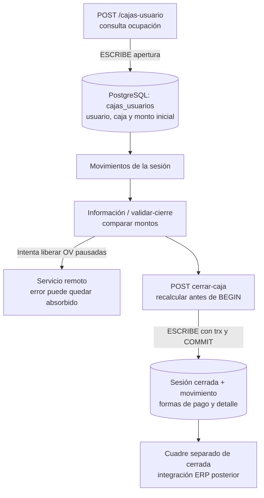
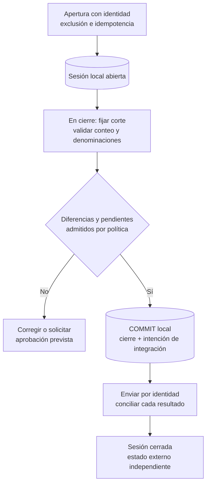
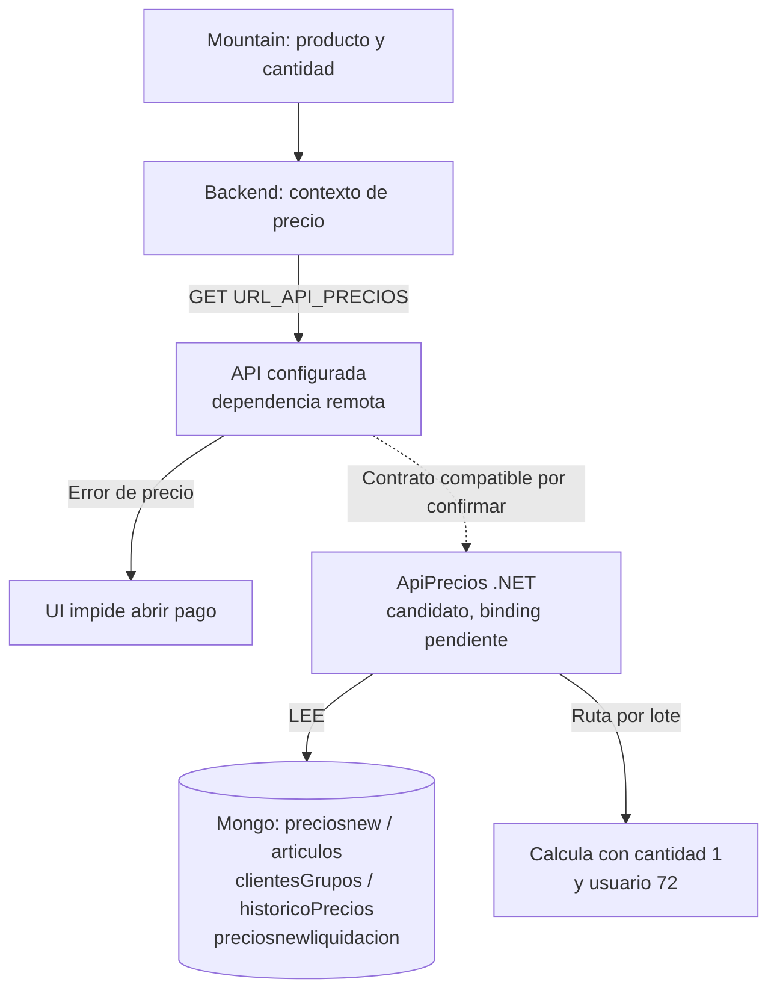
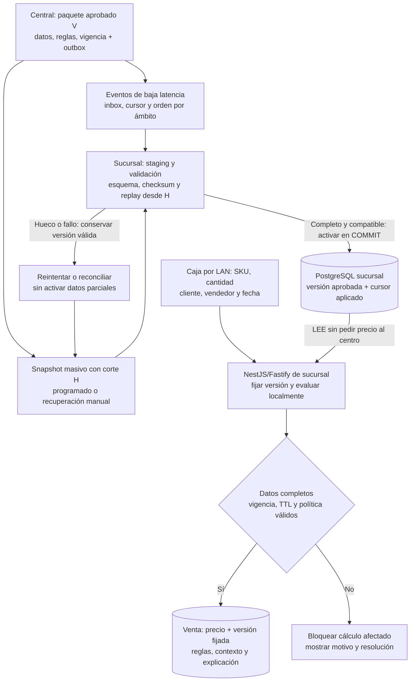
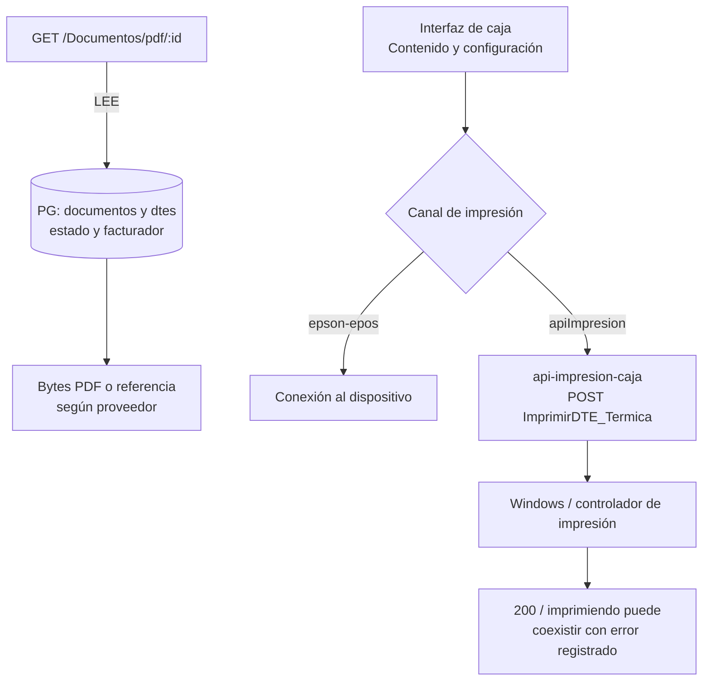
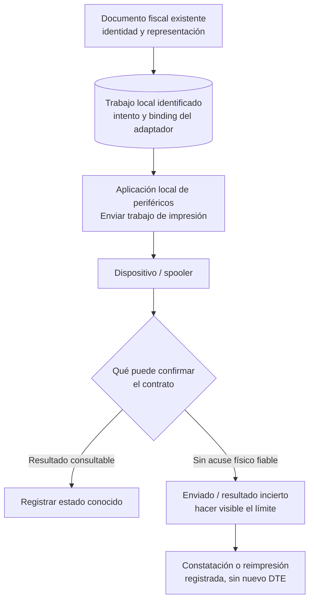
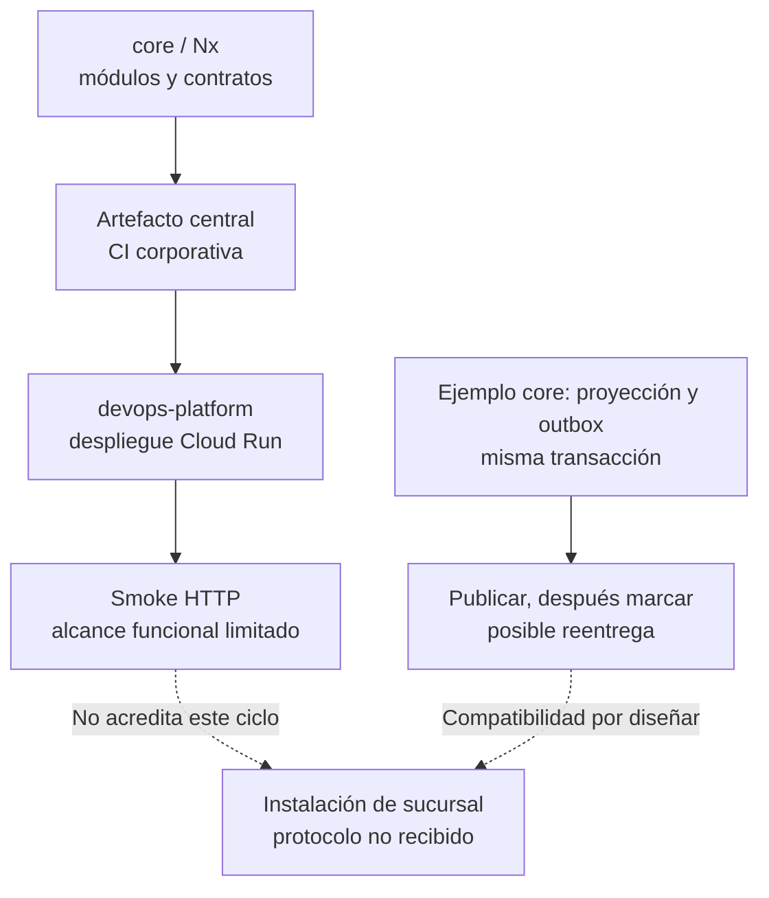
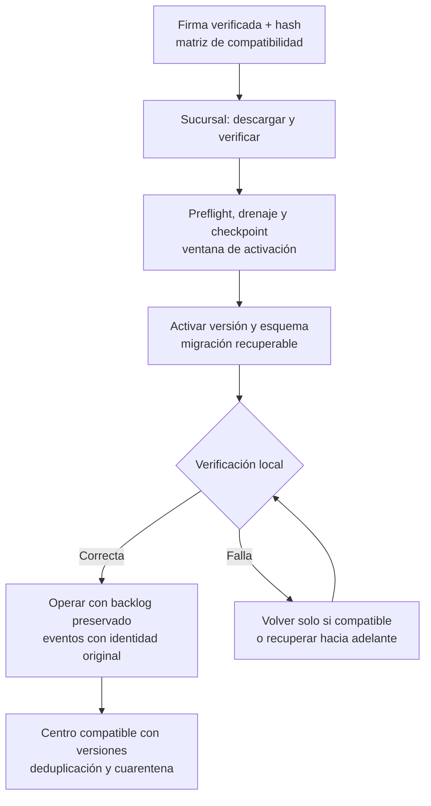

# Operación de caja y evolución del POS

Revisión del **1 de octubre de 2026**. Esta ampliación releyó las 15 láminas y notas del [PowerPoint original](<referencias/Ecosistema de Caja Mountain 4.pptx>), y volvió a contrastar fragmentos concretos de los repositorios ya fijados. Añade operación cotidiana, límites de impresión, contexto del precio y entrega de versiones a los recorridos D01–D05. No es una nueva auditoría completa ni valida el despliegue productivo.

En la [presentación web](../presentation/index.html), **Venta** incorpora O01/O03 y las distinciones de operación; **Propuesta**, O02; **Evolución**, O04. Cada caso alterna código actual y contrato propuesto, con un escenario de excepción. Se conservan ocho capítulos. Los ocho Mermaid de este documento alimentan esos diagramas; las comparaciones son explicaciones, no ejecutan caja, ERP, hardware ni pipelines.

## Fuentes y criterio de selección

La PPTX conserva SHA-256 `4590c267a92f5e1e05b9f0e5c1c0629c61ab5c616f3590ab7ce1b37274f52381`. Se siguieron las relaciones reales entre cada lámina y su archivo de notas: por ejemplo, la lámina 3 enlaza a `notesSlide2.xml`. Las láminas 1 y 15 no tienen notas. Sus instrucciones de exposición se trataron como información documental, no como nuevas instrucciones del usuario.

Las láminas 3/7/11/12 respaldan módulos, sesiones PostgreSQL, responsabilidad de cierre y familias de subida. Las láminas 6/10/13 describen dependencias e impactos preliminares, que no se convierten aquí en SLA ni autorización para operar otros medios de pago. Las fuentes corporativas revisadas incluyen Mountain, sincronizador, APIs .NET, impresión, pagos, core, DevOps y presentaciones de integración; esta ronda profundiza en una selección de los archivos ya disponibles, sin afirmar que se releyó cada línea de los ocho repositorios.

Los enlaces fijan SHA y rangos. Los nombres de tablas PostgreSQL sin esquema se conservan así; no se añade `public` sin evidencia. Las etiquetas de modelos se distinguen de tablas físicas. No se publican hosts ni credenciales. Las propuestas se apoyan en los [contratos y decisiones existentes](propuesta-arquitectura.md), [resiliencia](revision-resiliencia-datos-pos.md) y [extensibilidad](extensibilidad-proveedores-dispositivos.md); siguen sujetas a revisión y pruebas.

## Operaciones que el equipo debe distinguir

La presentación original enumera POS, cobranzas y devoluciones como módulos separados. Sus efectos tampoco deben comprimirse en la palabra «pago».

### Venta y pago de la venta

La persona compra ahora. El backend registra documentos, comprobante y pagos recibidos; DTE y registro en AX tienen fases separadas. Es el recorrido de venta y D01.

**Límite:** Guardar un pago recibido no demuestra autorización bancaria ni confirmación ERP. [Recorrido D01 de venta y DTE](recorridos-datos-tablas.md).

### Cobranza de una deuda anterior

Se recauda contra documentos, acuerdos o cuotas previas. El controlador guarda cobranza, vínculo con cajas_usuario_id, pagos y detalle, hace commit y luego recalcula deuda no sincronizada. No hay que repetir el flujo de una nueva venta para describirlo.

**Límite:** Faltan reglas completas de imputación, concurrencia entre sucursales y autorización offline. El commit no engloba el recálculo posterior ni confirma AX. [Rutas de cobranza](https://github.com/developer-implementos/mountain-implementos/blob/711f97fd7948c696bf45c992c5b121683bdbacd7/backend/start/routes.js#L331-L344); [Cobranza, sesión y commit](https://github.com/developer-implementos/mountain-implementos/blob/711f97fd7948c696bf45c992c5b121683bdbacd7/backend/app/Controllers/Http/CobranzaController.js#L73-L157); [Pagos asociados a cobranza](https://github.com/developer-implementos/mountain-implementos/blob/711f97fd7948c696bf45c992c5b121683bdbacd7/backend/app/Controllers/Http/CobranzaController.js#L1981-L1997).

### NC y uso como medio de pago

Una nota de crédito y su saldo pueden consultarse y, bajo reglas del negocio, utilizarse como medio de pago. D05 explica consulta, marcas Mongo y consumo local como recorridos relacionados, sin transacción común acreditada.

**Límite:** El D05 no cubre toda emisión de NC, entrega/reversa de dinero ni devolución física de productos. Una NC no implica por sí sola un reembolso. [Rutas de NC](https://github.com/developer-implementos/mountain-implementos/blob/711f97fd7948c696bf45c992c5b121683bdbacd7/backend/start/routes.js#L396-L407); [D05 y sus límites](recorridos-datos-tablas.md).

### Devolución y entrega de dinero

Existen rutas propias de devoluciones. El alta revisada persiste entidad y detalles; ese método no demuestra un cargo reversado en el terminal ni entrega física de efectivo. Deben reconstruirse esas ramas con el equipo.

**Límite:** Devolucione.create no recibe la trx que sí reciben los detalles en el fragmento revisado: no dibujar atomicidad total. La devolución física tampoco convierte al POS en dueño del stock. [Rutas de devoluciones](https://github.com/developer-implementos/mountain-implementos/blob/711f97fd7948c696bf45c992c5b121683bdbacd7/backend/start/routes.js#L353-L356); [Alta de devolución y detalles](https://github.com/developer-implementos/mountain-implementos/blob/711f97fd7948c696bf45c992c5b121683bdbacd7/backend/app/Controllers/Http/DevolucioneController.js#L127-L151).

## O01 · Abrir, cuadrar y cerrar una sesión

PPTX: láminas 3, 7, 11 y 12, con sus notas asociadas. El código revisado describe aperturas y cierres de Chile; no demuestra configuración de permisos, constraints o procedimientos productivos. Sesión de caja y ventana horaria del sincronizador son conceptos diferentes.

### Actual: código observado

Abrir caja crea una sesión con usuario y monto inicial. Al terminar, el sistema compara importes y registra cierre y diferencias; el estado cerrada, el cuadre y la confirmación ERP permanecen separados.

1. POST /cajas-usuario consulta ocupación y crea cajas_usuarios. El método usa America/Santiago; no prueba una política corporativa multipaís.
2. GET informacion-cierre modifica el tipo de cierre. POST validar-cierre también intenta liberar OV pausadas en un servicio remoto y puede absorber ese error.
3. POST cerrar-caja recalcula diferencias antes de BEGIN; luego guarda sesión, movimiento y detalle con trx, y hace commit. Cerrada puede coexistir con caja_cuadrada=false.
4. El selector revisado bloquea cierre parcial. La exportación de custodia es otro recorrido: cerrar no confirma archivo descargado, entrega bancaria ni registro AX.

**Frontera:** El snapshot del arqueo precede a la transacción de cierre. Deben probarse movimientos concurrentes, doble cierre y apertura concurrente; no se han demostrado incidencias productivas.

### Propuesto: contrato por validar

El escritor de sucursal debe proteger la identidad de sesión, fijar el punto de corte y validar el conteo. Las tareas externas conservan su seguimiento aunque negocio permita terminar el turno con pendientes.

1. Apertura idempotente con exclusión de caja/usuario probada en el escritor local. Identidad de sesión, fecha de negocio, moneda y zona horaria explícitas.
2. Al pasar a en cierre, fijar el corte y decidir dónde se asignan movimientos concurrentes. Validar importes y denominaciones en backend.
3. Guardar cierre, diferencias, motivo/aprobación cuando corresponda e intenciones externas en una transacción local. Mantener identidad de cada intención.
4. Sincronizar y conciliar liberación de OV, arqueo y diferencias con estados propios. El responsable de negocio decide qué pendiente bloquea cerrar.

**Frontera:** Los nombres de estado y la política son propuesta. No existe un permiso implícito para cerrar offline ni para aceptar cualquier diferencia.

### Excepción: Se corta WAN al terminar el turno y queda una OV pausada

**Actual:** La validación intenta liberarla por un servicio remoto antes del cierre. Su error puede quedar registrado sin aparecer como error de validación; cerrar localmente no prueba la liberación ni el registro en AX.

**Propuesto:** La UI presenta el pendiente con su identidad. La política acordada decide si deja cerrar; cuando corresponda, el cierre conserva una intención durable y el worker consulta o concilia su resultado.

**Prueba pendiente:** Perder la respuesta del cierre, repetir la confirmación, crear un movimiento al mismo tiempo y ordenar denominaciones con un cero antes de otra cantidad positiva. Comprobar que no se duplica ni se pierde detalle.

### Matices y evidencia

- El helper de efectivo retorna al encontrar una cantidad cero y puede omitir denominaciones posteriores. La UI revisada reemplaza la validación de ese detalle por true. Es un comportamiento de código, no evidencia de un arqueo productivo afectado.
- La exclusión de apertura observada es SELECT antes de INSERT. Faltan índices/constraints/configuración para demostrar o descartar duplicados bajo concurrencia.
- Ciertos cierres se fechan a las 23:59:59 del día de apertura y guardan cierre_desfasado. La propuesta debe conservar fecha de negocio y hora real del evento, con calendario por país.
- El archivo de custodia observado se nombra por fecha, se descarga y se programa su eliminación a cinco segundos. En el mismo filesystem, exportaciones concurrentes o lentas requieren prueba. Proponer identidad de exportación, retención y limpieza acorde al ciclo del recurso.
- Cierre de sesión, informe Z, cuadre, custodia, mantenimiento y fin de ventana de sincronización requieren contratos separados. La revisión no ha demostrado equivalencia contable o fiscal entre ellos.

- [Rutas de apertura y cierre](https://github.com/developer-implementos/mountain-implementos/blob/711f97fd7948c696bf45c992c5b121683bdbacd7/backend/start/routes.js#L67-L99)
- [Apertura de sesión](https://github.com/developer-implementos/mountain-implementos/blob/711f97fd7948c696bf45c992c5b121683bdbacd7/backend/app/Controllers/Http/CajasUsuarioController.js#L79-L110)
- [Consultas de ocupación](https://github.com/developer-implementos/mountain-implementos/blob/711f97fd7948c696bf45c992c5b121683bdbacd7/backend/app/Controllers/Http/CajasUsuarioController.js#L809-L849)
- [Validar cierre e invocar liberación de OV](https://github.com/developer-implementos/mountain-implementos/blob/711f97fd7948c696bf45c992c5b121683bdbacd7/backend/app/Controllers/Http/CajasUsuarioController.js#L234-L257)
- [OV pausadas y manejo del error remoto](https://github.com/developer-implementos/mountain-implementos/blob/711f97fd7948c696bf45c992c5b121683bdbacd7/backend/app/Controllers/Http/CajasUsuarioController.js#L1514-L1544)
- [Cierre: cálculo previo, transacción y commit](https://github.com/developer-implementos/mountain-implementos/blob/711f97fd7948c696bf45c992c5b121683bdbacd7/backend/app/Controllers/Http/CajasUsuarioController.js#L116-L210)
- [Cerrada y bandera de cuadre](https://github.com/developer-implementos/mountain-implementos/blob/711f97fd7948c696bf45c992c5b121683bdbacd7/backend/app/Controllers/Http/CajasUsuarioController.js#L1227-L1244)
- [Denominaciones: retorno ante cantidad cero](https://github.com/developer-implementos/mountain-implementos/blob/711f97fd7948c696bf45c992c5b121683bdbacd7/backend/app/Controllers/Http/CajasUsuarioController.js#L1371-L1403)
- [GET de información modifica tipo de cierre](https://github.com/developer-implementos/mountain-implementos/blob/711f97fd7948c696bf45c992c5b121683bdbacd7/backend/app/Controllers/Http/CajasUsuarioController.js#L610-L647)
- [Validación efectiva en UI](https://github.com/developer-implementos/mountain-implementos/blob/711f97fd7948c696bf45c992c5b121683bdbacd7/frontend/src/app/modules/pos/pages/cerrar-caja/cerrar-caja.component.ts#L303-L411)
- [Parcial bloqueado en el selector](https://github.com/developer-implementos/mountain-implementos/blob/711f97fd7948c696bf45c992c5b121683bdbacd7/frontend/src/app/modules/pos/pages/definir-cierre/definir-cierre.component.ts#L43-L84)
- [Custodia: generación y descarga](https://github.com/developer-implementos/mountain-implementos/blob/711f97fd7948c696bf45c992c5b121683bdbacd7/backend/app/Services/ExcelServiceV2.js#L371-L400)
- [Láminas y notas de la presentación original](antecedentes-presentacion-chile.md)

## O02 · Precio, oferta y reglas locales

Mountain prueba el consumo remoto. ApiPrecios .NET contiene un cálculo compatible, pero falta confirmar el binding productivo. El CRUD de ofertas existe en el código y no contradice el uso de solo lectura informado en caja: presencia de código, permisos efectivos y evaluación del precio son preguntas distintas.

### Actual: código observado

La venta usa una consulta de precio remota. El cálculo encontrado considera cliente, sucursal, cantidad y vendedor, además de reglas e históricos; una lista de SKU/precio no conserva por sí sola ese comportamiento.

1. Mountain envía SKU, cantidad, RUT, sucursal y usuario al servicio de precios configurado. Ante error, el flujo de interfaz revisado impide abrir el pago.
2. En ApiPrecios candidata se leen clientesGrupos, articulos, historicoPrecios, preciosnew y preciosnewliquidacion, entre otras colecciones. El histórico depende de la fecha del proceso.
3. La ruta por lote invoca el cálculo con cantidad 1 y usuario 72. No demuestra equivalencia con una consulta individual que use otro contexto.
4. Administrar ofertas en pantallas y ejecutar reglas de precio son capacidades diferentes. Hay rutas CRUD, pero la caja se informó como solo lectura.

**Frontera:** Confirmar qué motor y reglas usa producción antes de extraer lógica. La respuesta revisada de ApiPrecios no identifica una versión del conjunto de reglas/datos.

### Propuesto: contrato por validar

Se recomienda un **modelo de lectura de precios y ofertas en el PostgreSQL de sucursal**, alimentado por eventos y reconciliado mediante cargas masivas programables. El backend NestJS/Fastify evalúa localmente paquetes aprobados y versionados; las cajas lo consumen por LAN. La autoridad comercial permanece en el sistema central responsable de cada dato. Esta distribución es unidireccional y no permite editar maestros centrales desde la copia local. Sigue el [contrato de contenedores y propiedad de datos](propuesta-arquitectura.md#contratos-de-contenedores-y-propiedad-de-datos): un escritor de negocio por sucursal, sin base adicional por terminal en el perfil WAN.

1. **Publicar versiones aprobadas.** Preparar un paquete inmutable por país, entidad legal y ámbito comercial/sucursal: precios, promociones, grupos y demás dependencias necesarias para el cálculo. Su manifiesto identifica versión, versión base si es incremental, esquema, motor compatible, moneda, vigencias, límite autorizado de uso offline y checksum. Una publicación aprobada guarda manifiesto e intención de notificar en una transacción con outbox. Si el legado exige CDC, usarlo para alimentar al publicador central y traducir sus cambios; copiar filas del ERP no equivale a aprobar una campaña ni a portar su motor.
2. **Consumir eventos con recuperación.** El worker de sucursal recibe cambios o referencias a paquetes por un contrato reanudable, inicialmente HTTPS con cursor durable; no se exige añadir un broker en cada tienda. Persistir `eventId`, ámbito, época del origen, secuencia/versión y hash en inbox antes del acuse. Duplicados con igual contenido no vuelven a aplicarse; el mismo ID con otro contenido se retiene como conflicto. Distinguir cursor recibido de cursor aplicado: recepción durable no significa versión activa. Detectar huecos, reordenamiento y versión base ausente; no avanzar aplicación por encima de un hueco pendiente ni ordenar solo por hora de llegada.
3. **Programar carga masiva y conciliación.** Configurar frecuencia, zona horaria, ventana, tamaño de lote, concurrencia y desfase entre sucursales; negocio debe acordar la frescura requerida antes de fijar números. El mismo worker admite arranque inicial, carga programada y reintento manual autorizado con identidad de trabajo. El snapshot debe ser completo para su ámbito, incluir bajas, y declarar un corte consistente `H` del flujo de cambios. Retener y recibir los deltas posteriores mientras se descarga; si su retención expiró, solicitar un snapshot nuevo. Un `MAX(id)` o una fecha de consulta sin contrato de consistencia no acreditan ese corte.
4. **Construir y activar sin mezclar.** Descargar por partes reanudables a staging separado de los datos activos; comprobar origen autorizado, esquema/motor, checksum, conteos y referencias del manifiesto. Reconstruir la candidata con los deltas posteriores a `H`, incluidas bajas, hasta un punto conocido completo. Comparar con la versión/cursor ya aplicados para impedir que una carga lenta retroceda cambios recientes. El incremental también produce una versión coherente: no parchea las tablas que está leyendo una venta. Activar mediante un commit local del puntero de versión y su cursor aplicado; conservar la anterior para ventas que ya la referencian y recuperación dentro de su validez. Interrumpir una descarga nunca deja media promoción activa.
5. **Calcular y fijar la versión por venta.** El backend evalúa con SKU, cantidad, cliente, sucursal, vendedor, fecha de negocio y reglas aplicables, usando únicamente la versión aprobada fijada para esa cotización/venta. Guardar versión, reglas, entradas relevantes y explicación con el importe. Revalidar vigencia y plazo de la cotización antes de confirmar; si requiere recotizar, mostrar el cambio y obtener la aceptación prevista antes del pago. Una actualización de paquetes no cambia silenciosamente precios de una venta en curso ni reescribe ventas confirmadas. La operación offline aprobada no solicita un precio central para completarse.
6. **Separar desconexión, atraso e invalidez.** Caer la WAN no invalida automáticamente el paquete. Su antigüedad máxima autorizada (TTL), vigencia comercial y compatibilidad se verifican localmente, con reloj controlado. Un contacto con el servidor o una nueva descarga de la misma versión no renueva esos límites. Paquete ausente, datos requeridos incompletos, reglas incompatibles o autorización vencida bloquean el cálculo afectado; ninguna oferta vencida se extiende silenciosamente. Una excepción requiere una política comercial explícita y evidencia auditable, no un fallback genérico al último precio disponible.

La operación debe mostrar versión publicada/recibida/activa, última conciliación correcta, antigüedad, huecos y trabajos fallidos. El cron es una vía de reparación y comprobación periódica; los eventos reducen latencia entre ejecuciones. Ambos caminos usan el mismo validador y protocolo de activación. Separar la programación del trabajo de su ejecución durable evita que reiniciar el proceso o perder una respuesta borre el intento pendiente.

**Frontera:** Es una propuesta con consistencia eventual, reentrega e idempotencia; no promete exactly-once entre sistemas ni réplica bidireccional de maestros. Requiere paridad con el motor productivo, autoridad por atributo, retención y políticas comerciales de vigencia acordadas. La autonomía descrita cubre caída WAN con LAN y servidor disponibles; no autoriza pagos, saldos compartidos ni promociones de uso único sin el mecanismo específico que requieran.

### Excepción: Se pierde un evento mientras llega una carga masiva y hay una venta abierta

**Actual:** El precio del recorrido observado depende de la API remota; no se acreditó un protocolo de cursor, replay y activación local. El lote encontrado fija cantidad y usuario, por lo que tampoco sustituye sin pruebas al cálculo contextual.

**Propuesto:** La sucursal detecta el hueco y recupera desde su cursor o pide otro snapshot si ya no hay historial. Reproduce los deltas posteriores al corte, valida el conjunto y activa sin retroceder la versión aplicada. Mientras tanto puede vender con la versión anterior solo si sigue autorizada; la venta abierta conserva su versión y revalida la cotización al confirmar.

**Prueba pendiente:** Duplicar y desordenar eventos; perder uno; enviar el mismo ID con otro hash; publicar durante el snapshot; incluir una baja; cortar energía antes/después del commit de activación; expirar el historial y la vigencia offline. Verificar cero mezclas de versiones, ningún retroceso ni cambio silencioso del ticket. Comparar además cantidad, cliente, vendedor, acuerdo, solapamiento de promociones y redondeo con casos productivos aprobados. Estas son pruebas de aceptación propuestas, no resultados medidos.

### Fundamento técnico del contrato propuesto

El outbox evita separar la escritura de negocio de la intención de publicación; el consumidor sigue teniendo que tratar duplicados. Esto respalda publicar el manifiesto y su evento de manera transaccional, sin atribuir al transporte una garantía end-to-end de ejecución única. [AWS: transactional outbox](https://docs.aws.amazon.com/prescriptive-guidance/latest/cloud-design-patterns/transactional-outbox.html).

Debezium documenta IDs de evento para deduplicación y claves de agregado para mantener orden dentro de una partición. Son referencias para identidad y ámbito del contrato; no una selección automática de Kafka/Debezium ni una garantía de orden global. [Debezium: Outbox Event Router](https://debezium.io/documentation/reference/stable/transformations/outbox-event-router.html).

PostgreSQL documenta snapshots exportados vinculados al punto desde el que continúa el flujo lógico, y advierte que un reinicio puede volver a entregar cambios. Debezium explica cómo reconciliar snapshot y cambios concurrentes mediante marcas de avance. Son fundamentos del corte y replay; un snapshot incremental por sí solo no convierte el conjunto comercial multitabla en una versión aprobada y atómica. Esa garantía corresponde al publicador y al activador propuestos. [PostgreSQL: snapshots y logical decoding](https://www.postgresql.org/docs/current/logicaldecoding-explanation.html), [Debezium: incremental snapshots](https://debezium.io/blog/2021/10/07/incremental-snapshots/).

### Matices y evidencia

- El nombre de una colección Mongo se toma de GetCollection. No identifica servidor, instancia, ubicación física ni productor de datos.
- La ventana del histórico usa DateTime.Now con tres meses previos. Reloj/zona horaria y fecha efectiva son parte del contrato a decidir; no basta copiar el comentario que dice retirar el histórico mientras permanece código que lo usa.
- El objetivo de estandarizar naming no justifica renombrar estas colecciones sin mapear consumidores ni identificar el motor activo.

- [Mountain: camino activo de cálculo](https://github.com/developer-implementos/mountain-implementos/blob/711f97fd7948c696bf45c992c5b121683bdbacd7/backend/app/Services/ProductosService.js#L134-L205)
- [Llamada remota con contexto y timeout](https://github.com/developer-implementos/mountain-implementos/blob/711f97fd7948c696bf45c992c5b121683bdbacd7/backend/app/Services/Precios/PreciosImplementosServices.js#L12-L84)
- [Bloqueo de pago con error de precio](https://github.com/developer-implementos/mountain-implementos/blob/711f97fd7948c696bf45c992c5b121683bdbacd7/frontend/src/app/modules/pos/components/pos-botones/pos-botones.component.ts#L415-L457)
- [Colecciones de precios, grupos e histórico](https://github.com/developer-implementos/apis-implementos/blob/8fbe2f1b4d4e464a403aa3daca63ffe712a9dd70/ApiPrecios/Controllers/PreciosController.cs#L60-L133)
- [Lote con cantidad y usuario fijados](https://github.com/developer-implementos/apis-implementos/blob/8fbe2f1b4d4e464a403aa3daca63ffe712a9dd70/ApiPrecios/Controllers/PreciosController.cs#L569-L589)
- [Respuesta sin versión de reglas](https://github.com/developer-implementos/apis-implementos/blob/8fbe2f1b4d4e464a403aa3daca63ffe712a9dd70/ApiPrecios/Models/respuestaPrecio.cs#L8-L23)
- [Rutas de administración de ofertas](https://github.com/developer-implementos/mountain-implementos/blob/711f97fd7948c696bf45c992c5b121683bdbacd7/backend/start/routes.js#L325-L329)
- [Presentación original: precio online y módulos](antecedentes-presentacion-chile.md)
- [Contrato local de precios y ofertas propuesto](propuesta-arquitectura.md)

## O03 · Documento emitido y trabajo de impresión

La representación PDF y los canales de impresión se verificaron en Mountain y la API Windows. El comportamiento descrito no acredita versiones instaladas, papel entregado ni capacidades de todos los dispositivos. La app api-pagos-caja sigue separada de la aplicación de conexión con el terminal Transbank.

### Actual: código observado

El documento fiscal, su representación y el intento de impresión recorren servicios diferentes. El canal configurado determina si se usa ePOS o la API Windows.

1. GET /Documentos/pdf/:id consulta documentos, dtes y configuración del facturador. Ingydev devuelve bytes PDF decodificados; Acepta una referencia/URL en ese método.
2. Angular elige por slug_tipo_impresora. epson se muestra no configurado; epson-epos usa conexión al dispositivo; apiImpresion envía HTTP a la API Windows.
3. La API térmica invoca PrintDocument.Print(). Su controlador puede devolver 200/error=false después de registrar una excepción.
4. La rama apiImpresion inicia una suscripción y no inspecciona el cuerpo de éxito. No hay prueba aquí de un trabajo durable correlacionado ni de entrega física.

**Frontera:** El diagrama muestra rutas relacionadas de documento e impresión, no que cada impresión térmica consuma GET /Documentos/pdf. Ningún acuse observado acredita papel entregado.

### Propuesto: contrato por validar

El POS conserva la identidad fiscal existente y crea un trabajo de impresión independiente. El adaptador informa solo lo que el proveedor o dispositivo permite conocer.

1. Identificar el DTE existente y obtener una representación autorizada, sin reemitir por un fallo de papel.
2. Persistir trabajo, intento, terminal, adaptador y referencia documental antes del envío según el contrato local.
3. Separar aceptación del trabajo, fallo conocido y resultado incierto. Consultar estado solo si el dispositivo lo soporta.
4. Cuando no existe acuse físico, mostrar esa limitación y registrar constatación o reimpresión con motivo. Nunca inventar un estado impreso.

**Frontera:** Persistir un trabajo no vuelve idempotente al spooler. La política de reimpresión debe tratar la copia que quizá ya salió y las capacidades reales del dispositivo.

### Excepción: El DTE existe, pero se pierde la respuesta después de enviar a imprimir

**Actual:** No se puede deducir que no salió papel. El 200 observado y la finalización de la función no prueban entrega física; los canales tampoco tienen un contrato de confirmación uniforme.

**Propuesto:** Conservar la identidad del trabajo y el documento, consultar cuando sea posible y hacer explícito el resultado incierto. Una reimpresión se registra como nueva copia de ese documento.

**Prueba pendiente:** Distinguir fallo antes de enviar, dispositivo sin papel y respuesta perdida después de aceptar. Confirmar que ninguna variante emite otro DTE por resolver la impresión.

### Matices y evidencia

- El bloque PDF documenta la obtención de representación, mientras el canal térmico recibe contenido/configuración de la UI. No se une una dependencia de PDF a cada impresión sin evidencia de su llamador.
- No se asume que Windows carezca de spooler ni que todo modelo ofrezca consulta de estado. Deben inventariarse SDK, aplicación, driver, firmware y protocolo reales por sucursal.
- La opción epson que muestra no configurado no implica que todas las impresoras Epson estén sin soporte: el código distingue explícitamente epson-epos y apiImpresion.

- [Documento PDF según proveedor](https://github.com/developer-implementos/mountain-implementos/blob/711f97fd7948c696bf45c992c5b121683bdbacd7/backend/app/Controllers/Http/DocumentoController.js#L233-L305)
- [Canal y llamada de impresión](https://github.com/developer-implementos/mountain-implementos/blob/711f97fd7948c696bf45c992c5b121683bdbacd7/frontend/src/app/services/impresion.service.ts#L42-L145)
- [HTTP de impresión térmica](https://github.com/developer-implementos/api-impresion-caja/blob/2e74b2d64985902f5fdfb52902016a5f65d7b577/WindowsServiceImpresora/Controllers/ImpresionController.cs#L49-L71)
- [PrintDocument.Print y error](https://github.com/developer-implementos/api-impresion-caja/blob/2e74b2d64985902f5fdfb52902016a5f65d7b577/Biblioteca/Helper/PrinterHelper.cs#L110-L125)
- [Contratos propuestos de proveedores y dispositivos](extensibilidad-proveedores-dispositivos.md)
- [Persistencia de venta y DTE actual](recorridos-datos-tablas.md)

## O04 · Actualizar sin perder operaciones pendientes

Se releyeron core, devops-platform e integration-presentations en sus snapshots auditados. El despliegue observado de Cloud Run no acredita un instalador de sucursal. Las garantías objetivo son criterios de adopción para POS; no nuevos incidentes ni reapertura de decisiones del repositorio core.

### Actual: código observado

La plataforma ofrece precedentes de estructura modular, integración y entrega central. Esos activos son candidatos a reutilizar; el ciclo de instalación y recuperación de tiendas requiere un contrato adicional.

1. core usa Nest/Fastify y Nx para organizar dependencias. Monorepo, módulo y unidad desplegable son niveles distintos; una fachada puede seguir dependiendo de red.
2. devops-platform contiene build y despliegue Cloud Run. Los caminos revisados no acreditan una candidata inicialmente sin tráfico ni una prueba funcional de venta por el smoke HTTP.
3. Un flujo de core comparte contexto de transacción entre proyección y outbox. El relay publica antes de marcar procesado, por lo que la reentrega sigue siendo posible.
4. DomainEvent deriva eventName de constructor.name. Ese helper no demuestra un contrato externo estable frente a renombrados, replay o convivencia de versiones.

**Frontera:** El inventario revisado no aportó un actualizador Windows/Tauri ni protocolo de instalación offline. Esto no afirma que la empresa carezca de otra herramienta fuera de los repos recibidos.

### Propuesto: contrato por validar

Centro y sucursales deben tolerar versiones diferentes durante un periodo acordado. Cada activación local conserva operaciones pendientes y prueba cómo recuperarse si falla el cambio de programa o esquema.

1. Publicar paquete con autenticidad del origen e integridad verificadas y matriz de compatibilidad entre UI, backend/esquema, sincronizador, aplicación local de periféricos y contratos. No aceptar una identidad de artefacto desconocida.
2. Descargar de forma reanudable, comprobar recursos y activar por grupos de sucursales. La ventana requiere drenaje, checkpoint y continuidad definidos.
3. Ensayar migración y corte de energía. Volver al binario anterior solo si el esquema y las operaciones nuevas siguen siendo compatibles; de lo contrario recuperar hacia adelante y revalidar el estado antes de operar.
4. Conservar identidad y versión de eventos durante replay. El centro reconoce duplicados, admite contratos antiguos dentro del horizonte pactado y conserva versiones desconocidas para tratamiento controlado.

**Frontera:** Restaurar un backup puede perder ventas posteriores; no es un rollback automático seguro. La compatibilidad debe incluir backlog, referencias ERP, permisos locales y efectos externos inciertos.

### Excepción: Una tienda con versión anterior reconecta después de actualizar el centro

**Actual:** Los activos corporativos no demuestran compatibilidad universal entre versiones. Compartir una clase de evento o una librería no asegura que el mensaje antiguo mantenga nombre, interpretación e identidad.

**Propuesto:** El receptor valida el contrato y la identidad originales. Si ya lo aplicó, reconoce el duplicado; si no soporta la versión, conserva el mensaje para tratamiento controlado. Un cambio de ERP tampoco redirige automáticamente una operación pendiente.

**Prueba pendiente:** Enviar dos veces la misma operación, entregar un contrato antiguo soportado y otro desconocido, y simular reinicio tras migración local. Verificar que no se genera otro UUID para evitar la deduplicación ni se borra el backlog.

### Matices y evidencia

- En el snapshot, el manifiesto Cloud Run dirige 100 % a latest y la acción ajusta tráfico después del reemplazo. El build contempla digest unknown. Son límites de esos caminos, no incidentes probados ni características de todos los workflows consumidores.
- Una biblioteca compartida de outbox o un flujo transaccional concreto son reutilizables. No acreditan atomicidad de todos los módulos, exactly-once en ERP ni compatibilidad de todos los eventos.
- La matriz de adopción debe separar código, ejecución y entrega: módulos/fachadas para responsabilidades; servidor escritor y PostgreSQL para operación de sucursal; paquetes y protocolos para actualizarla.
- Los adaptadores AX y mock revisados no prueban un POS con adaptadores productivos para Gira o Perú. El destino histórico, empresa, referencias y versión de contrato se conservan por operación durante el corte ERP.
- La vigencia de permisos locales también cambia entre versiones y desconexiones. La propuesta debe declarar una ventana de revocación aceptada por negocio/seguridad, sin inventar TTL ni prometer revocación central instantánea cuando no hay WAN.

- [Nest con adaptador Fastify](https://github.com/developer-implementos/core/blob/f43688abeda81d9935744c74994691df28dd6b1a/apps/core-api/src/bootstrap/factories/nest-application.factory.ts#L25-L38)
- [Límites entre módulos y capas en Nx](https://github.com/developer-implementos/core/blob/f43688abeda81d9935744c74994691df28dd6b1a/eslint.config.mjs#L151-L215)
- [Adaptadores AX y mock; extensión futura](https://github.com/developer-implementos/core/blob/f43688abeda81d9935744c74994691df28dd6b1a/apps/sync-worker/src/erp-adapters/erp-adapters.module.ts#L150-L199)
- [Tráfico del manifiesto Cloud Run](https://github.com/developer-implementos/devops-platform/blob/fd423a6f2f4955bd650ee6aebba154d93c0425b8/.github/actions/deploy-cloud-run/lib/templates.sh#L64-L79)
- [Despliegue y ajuste de tráfico](https://github.com/developer-implementos/devops-platform/blob/fd423a6f2f4955bd650ee6aebba154d93c0425b8/.github/actions/deploy-cloud-run/action.yml#L375-L533)
- [Digest y fallback unknown](https://github.com/developer-implementos/devops-platform/blob/fd423a6f2f4955bd650ee6aebba154d93c0425b8/.github/actions/build-and-push-image/action.yml#L823-L845)
- [Alcance del smoke HTTP](https://github.com/developer-implementos/devops-platform/blob/fd423a6f2f4955bd650ee6aebba154d93c0425b8/.github/actions/cloud-run-smoke-tests/action.yml#L216-L266)
- [Ejemplo transaccional de proyección y outbox](https://github.com/developer-implementos/core/blob/f43688abeda81d9935744c74994691df28dd6b1a/libs/vtex-invoices/application/src/lib/services/ingest-invoice.service.ts#L241-L306)
- [Publicación y marcado posterior](https://github.com/developer-implementos/core/blob/f43688abeda81d9935744c74994691df28dd6b1a/libs/shared/backend/pubsub/src/lib/services/outbox-processor.service.ts#L309-L322)
- [Identidad, versión y nombre del evento](https://github.com/developer-implementos/core/blob/f43688abeda81d9935744c74994691df28dd6b1a/libs/core/src/lib/domain/events/domain-event.ts#L47-L107)
- [Adopción corporativa y límites POS](analisis-repositorios/aportes-plataforma-corporativa.md)
- [Recuperación, compatibilidad y restauración](revision-resiliencia-datos-pos.md)

## Identidad y permisos durante la desconexión

Además del programa y sus datos, la sucursal necesita autoridad para cada operación. El código corporativo registra autenticación antes de autorización; una ruta JWT revisada valida firma/expiración y consulta blacklist y, cuando está configurado, el puerto de revocación por identidad. La ruta protegida deniega cuando la dependencia requerida no está disponible; el enriquecimiento de una ruta pública tiene otro contrato. Eso no habilita a desactivar guardias para permitir operar una caja sin WAN. [Orden AuthN/AuthZ](https://github.com/developer-implementos/core/blob/f43688abeda81d9935744c74994691df28dd6b1a/libs/shared/backend/auth/src/lib/auth.module.ts#L104-L145), [JWT y revocación](https://github.com/developer-implementos/core/blob/f43688abeda81d9935744c74994691df28dd6b1a/libs/shared/backend/auth/src/lib/guards/unified-auth.guard.ts#L1042-L1099), [tratamiento protegido/público](https://github.com/developer-implementos/core/blob/f43688abeda81d9935744c74994691df28dd6b1a/libs/shared/backend/auth/src/lib/guards/unified-auth.guard.ts#L1360-L1408).

**Propuesta:** distinguir identidad humana, terminal/sucursal, permiso de operación y vigencia de política local. Evaluar permisos verificables limitados por capacidad y ámbito, aprovisionamiento y rotación del dispositivo, control de reloj y política al vencer. Sin WAN no se puede conocer inmediatamente una revocación central: negocio y seguridad deben aceptar una ventana acotada o restringir la capacidad. No se fija un TTL arbitrario. El centro autentica al emisor y valida su ámbito; no confía en un país/sucursal arbitrario del payload ni reutiliza la credencial humana como identidad del sincronizador.

Probar vencimiento, revocación durante desconexión, cambio de reloj, reinicio sin WAN y reconexión. Abrir sesión de caja, autenticarse y estar autorizado para devolver dinero son decisiones distintas.

## Información concreta para la siguiente revisión con el equipo

- Una apertura y un cierre sanitizados: modo habilitado, actores, diferencias aceptadas, fecha de negocio, denominaciones y movimiento concurrente. Precisar el contrato del informe Z.
- Una cobranza de deuda previa, una NC aplicada y una devolución de dinero por medio: identidad original, autorización, imputación, estado externo y recuperación. Identificar al dueño de inventario para la devolución física.
- Binding real de precio/promoción, reglas y casos comerciales aprobados, datos necesarios y vigencia offline. Confirmar si la ruta de lote se usa y para qué.
- Un DTE y sus intentos de impresión, con driver/firmware/canal y acuses posibles. Diferenciar aceptación del trabajo de papel entregado.
- Procedimiento de instalación y restore de sucursal; matriz de versiones, artefactos identificables, permisos locales, ejemplos de backlog antiguo y ventana de compatibilidad.

Estos pedidos complementan la [solicitud existente](solicitud-informacion-equipo.md). No implican que las incidencias hipotéticas hayan ocurrido ni que las capacidades objetivo estén implementadas.
