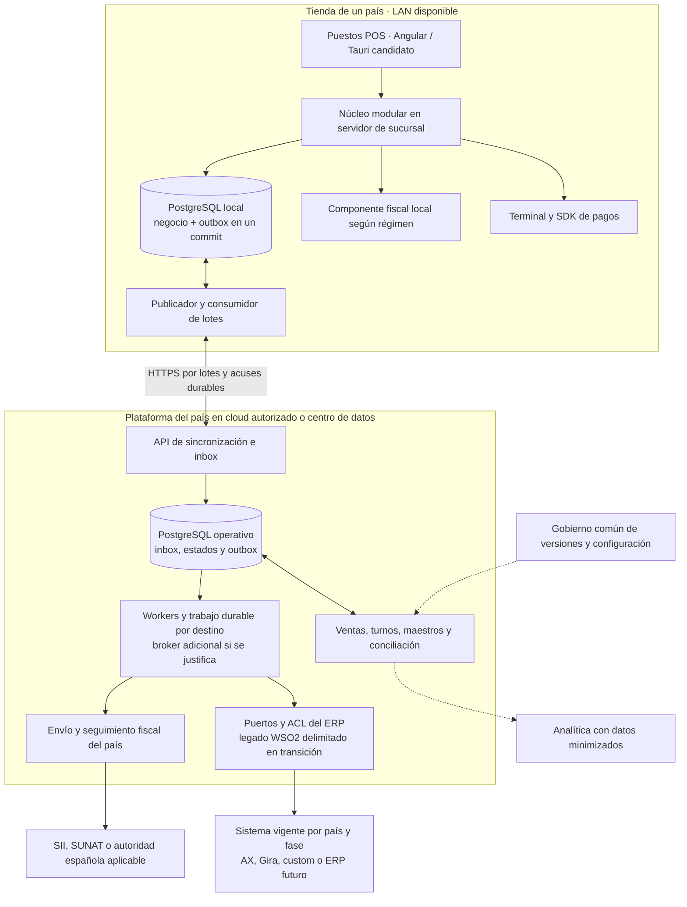
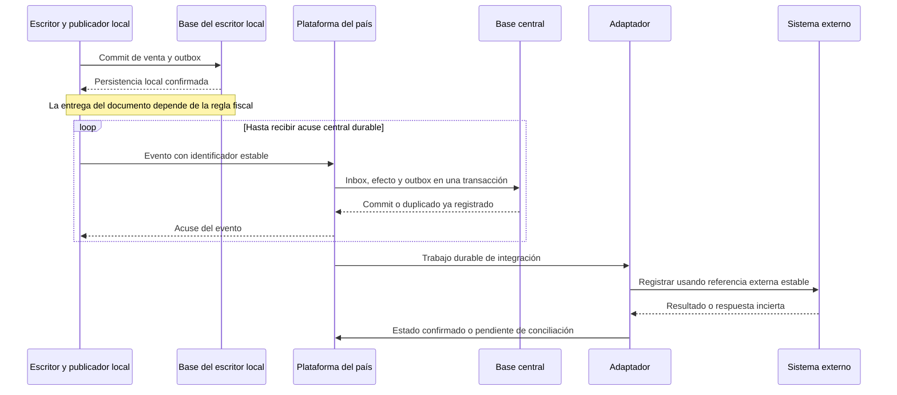
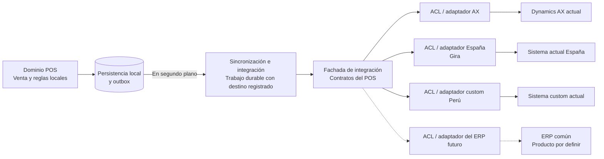

# Propuesta de arquitectura enterprise para POS en Chile Perú y España

**Fuente de decisión vigente:** este documento y sus [ADR](#decisiones-de-arquitectura) gobiernan la recomendación objetivo, aún no aprobada. Las revisiones conservan motivos, alternativas y pruebas; las guías y diagramas la sintetizan. Un cambio de recomendación debe actualizar aquí su decisión y alcance antes de propagarse a las síntesis.

Se propone evolucionar el POS hacia una operación local autónoma, sincronización asíncrona y una plataforma operativa separada por país. Los sistemas actuales se integran mediante adaptadores: Dynamics AX on-premise en Chile, Gira en España y un sistema custom en Perú. La venta no depende de estos sistemas para completar las operaciones habilitadas durante una desconexión.

La recomendación inicial es aprovechar la persistencia por sucursal documentada para Chile si offline significa perder Internet. La vista principal desarrolla ese perfil WAN. La autonomía por terminal ante pérdida de LAN o servidor sigue como perfil ampliado sujeto a aprobación; no se prescribe una nueva base por caja para resolver únicamente una caída de Internet.

La [revisión crítica corporativa](revision-arquitectura-corporativa.md) incorpora horario/mantenimiento, evaluación WSO2/RabbitMQ/BullMQ, consolidación de datos, expansión y protección de la inversión ante cambio de ERP. La [investigación de mensajería](investigacion-mensajeria-pos.md), el [inventario público de tiendas](cobertura-publica-sucursales.md) y los [casos adversos](revision-resiliencia-datos-pos.md) documentan fuentes, alternativas y límites de esta revisión.

La condición para considerar la solución enterprise es demostrar integridad de ventas y pagos, recuperación ante fallos, trazabilidad, controles de acceso y conciliación. El número de microservicios no constituye un criterio de calidad.

Estado: propuesta inicial, 1 de octubre de 2026. Destinatarios: arquitectura, operaciones de tiendas, finanzas, seguridad y responsables de integración de cada país. Las elecciones técnicas son recomendaciones; los objetivos numéricos son propuestas que deben validarse.

Nivel de definición: arquitectura de referencia. El diseño de implementación, la topología definitiva, el dimensionamiento y los compromisos operativos se cerrarán con las decisiones y evidencias de la [solicitud al equipo](solicitud-informacion-equipo.md). Las correcciones al sistema vigente son un frente de estabilización; la arquitectura objetivo y el plan para llegar a ella deben tener entregables y criterios propios.

Actualizada con el [análisis estático de cinco repositorios](analisis-repositorios/README.md). Los commits y las ramas están registrados; su correspondencia con producción no está confirmada. La revisión agrega evidencia del sistema chileno y no valida todavía los sistemas de Perú o España.

Las [vistas técnicas](vistas-arquitectura-y-flujos.md) separan despliegue y secuencias actuales de actividades/estados propuestos. El [catálogo de integraciones](catalogo-integraciones-actuales.md) conserva rutas y repositorios por SHA; la [matriz de cobertura](cobertura-documentacion-presentacion.md) indica qué se explica en la presentación y qué permanece en documentación de consulta.

## Alcance y supuestos

| Aspecto | Base de la propuesta |
| --- | --- |
| Países y sistemas | Chile con Dynamics AX on-premise; España con Gira, capacidades e interfaces por validar; Perú con custom |
| Evolución ERP | La empresa busca un ERP común para los tres países. Posible inicio por Chile el próximo año, interpretado tentativamente como 2027 con referencia a esta conversación de 2026. Producto, alcance y calendario sin confirmar |
| Offline | Requisito confirmado. Perfil inicial: caída de Internet con sucursal disponible. Perfil ampliado por confirmar: aislamiento de caja respecto de la red y servidor de tienda |
| Autonomía | Hipótesis de prueba de 72 horas de captura local. No equivale a permiso de emisión fiscal o cobro con tarjeta durante 72 horas |
| Infraestructura | El AX actual es on-premise; se contempla su integración mientras siga operativo. El despliegue del ERP futuro y la posibilidad de alojar la plataforma POS en cloud están pendientes; el diseño admite centros de datos privados |
| Escala | Directorios públicos: 31 tiendas Chile, 12 Perú y 3 España, consultados el 1 de octubre de 2026. Son entradas publicadas, no despliegues POS confirmados. Cajas, catálogo, ventas pico y capacidad de proveedores siguen pendientes; no se dimensiona por la cifra de tiendas |
| Comercio | Venta presencial de productos como referencia; pesaje, productos regulados, servicios y omnicanalidad requieren confirmar su alcance |
| Equipos | Cajas administradas con almacenamiento persistente y periféricos homologados; sistema operativo pendiente de inventario |
| Proveedores y periféricos variables | Requisito informado: distintas apps de facturación e impresión, impresoras y terminales/modelos de pago por país o sucursal. Un núcleo común con contratos y perfiles; soporte de cada combinación pendiente de homologación |
| Antecedentes incorporados | El README documenta servicios y datos por sucursal en Chile, seis aplicaciones y necesidad de un módulo local de ofertas; interfaces y granularidad aún requieren inventario |

El alcance funcional inicial comprende catálogo, precios, evaluación local de ofertas, impuestos, venta, pagos, comprobantes, turnos, movimientos de caja, devoluciones autorizadas y conciliación. Crédito, canje de puntos, gift cards, reservas entre tiendas y devoluciones sin evidencia central se restringen offline salvo un mecanismo de autorización acotado y validado.

## Evolución desde la arquitectura actual de Chile

Los [antecedentes del proyecto](../README.md) describen una solución distribuida por sucursal y sincronización con AX en segundo plano. La [imagen de referencia](referencias/arquitectura-actual-chile.png) identifica Angular, backend y sincronizador AdonisJS, PostgreSQL local, integraciones .NET, broker AMQP/JMS, WSO2/Synapse y servicios de facturación y pagos. Estas referencias orientan la evolución; no acreditan por sí solas la configuración ni las garantías operativas de los componentes.

| Perfil de continuidad | Decisión de despliegue | Consecuencia |
| --- | --- | --- |
| Sin WAN, sucursal operativa | Mantener backend y PostgreSQL por sucursal como autoridad de las transacciones; endurecer outbox, fiscalidad, pagos y recuperación | Evita introducir una base adicional por terminal. La caída del servidor o LAN sí puede detener cajas; mitigar según el RTO acordado |
| Sin WAN y sin LAN o servidor local | Añadir servicio y persistencia por caja; la sucursal pasa a coordinar y replicar | Cada caja conserva la autoridad de sus ventas. Se necesitan cupos, identidad offline y administración adicional de dispositivos |

El diagrama siguiente desarrolla el primer perfil: servicio transaccional, base e inbox/outbox local en sucursal, consumidos por LAN. Las garantías de aislamiento de terminal no aplican a ese despliegue. No se alterna entre escritores de sucursal y terminal automáticamente durante una avería. La transición de perfil requiere un corte controlado de propiedad y conciliación.

La propuesta inicial contemplaba reutilizar Angular, AdonisJS y PostgreSQL cuando sus versiones, diseño y pruebas satisficieran los requisitos. En conversaciones posteriores, el usuario planteó NestJS/Fastify, Pino/Sentry y Tauri, evaluados favorablemente como candidatos para el objetivo en [Opciones tecnológicas](opciones-tecnologicas.md). La selección permanece abierta: la transición del legado y la elección del stack objetivo son decisiones relacionadas pero distintas. Los adaptadores .NET y el bus existentes también requieren evaluar contratos, soporte y garantías antes de conservarlos o sustituirlos.

El desfase informado entre reserva de inventario, emisión de DTE y registro posterior de deuda en AX se trata con estados separados. Se debe documentar quién crea, consume y libera la reserva, cómo vence y qué sucede ante un pago o DTE fallido. El envío habitual aproximado de un minuto no prueba recepción ni contabilización dentro de ese plazo.

**Precisión de alcance recibida después:** la caja actual no maneja stock. La reserva informada no se atribuye al POS sin identificar al sistema responsable. La propuesta no impone un módulo de inventario local: cualquier consulta, proyección, reserva o consumo de cupos se incorpora solo si negocio lo requiere. El [contraste de apuntes de Chile](contraste-apuntes-operacion-chile.md) también documenta MPOS, la actualización de clientes bajo demanda y la confirmación del usuario del 2026-10-02: Orsan continúa vigente e Instacheck ya no funciona como integrador.

La revisión de código refuerza tres prioridades antes de sustituir componentes: eliminar la dependencia de precios online para operaciones habilitadas offline, establecer confirmaciones posteriores a persistencia durable y corregir la semántica de pendientes de pago/NC. También identifica rutas sin autorización aplicada, SQL interpolado y secretos versionados cuyo alcance debe verificarse y corregirse de forma coordinada. Los informes por repositorio delimitan las condiciones; no se presupone exposición pública ni un incidente ocurrido.

## Reutilización de core y devops-platform

**Se propone reutilización concreta de ambos repositorios**, mediante componentes seleccionados, adaptados y probados para el POS. Esta recomendación recoge el [análisis de la plataforma corporativa](analisis-repositorios/aportes-plataforma-corporativa.md); no implica una adopción aprobada ni que ya existan paquetes publicados para el POS.

| Origen y forma de uso | Qué se propone aprovechar | Condición para incorporarlo |
| --- | --- | --- |
| `core`: código compartido | Convenciones y controles de Nx; componentes de logs, correlación y configuración; contratos y utilidades de país/moneda. Seleccionar bibliotecas y publicarlas con versiones para incluirlas en el software POS. | Revisar dependencias y propietarios; adaptar observabilidad y configuración para arrancar y operar sin servicios centrales. Validar moneda y reglas por operación. |
| `core`: capacidades centrales por API | Evaluar servicios existentes de catálogo, clientes e integración ERP como parte de la plataforma central del POS; distribuir a sucursales los datos necesarios para las operaciones offline autorizadas. | Confirmar qué servicio es responsable de cada dato, qué contratos ofrece y sus garantías. El cliente remoto de precios actual no sustituye al motor local de ofertas. |
| `devops-platform`: construcción y entrega | Consumir acciones corporativas para comprobar código, construir artefactos y desplegar servicios centrales, fijando la versión de cada acción. | Corregir o cubrir las brechas de validación y despliegue antes de adoptarlas. Cloud Run solo aplica si se aprueba ese destino; las acciones revisadas no acreditan una entrega completa a tiendas. |
| Producto POS: desarrollo específico | Núcleo local de caja, motor local de precios/ofertas, protocolo sucursal–central, adaptadores de dispositivos y actualización de la flota. | Reutilizar piezas compatibles donde existan y desarrollar lo faltante; demostrar continuidad, recuperación y compatibilidad con los datos locales. |

La recomendación inicial es un **monorepo POS con versiones de producto independientes**, que consume bibliotecas corporativas y acciones de entrega. La alternativa de alojarlo dentro de `core` requiere acordar propiedad, permisos y ciclos de publicación. El [inventario detallado de reutilización](analisis-repositorios/aportes-plataforma-corporativa.md#3-qué-reutilizar-qué-adaptar-y-qué-desarrollar) conserva candidatos y evidencias; evita duplicar una implementación corporativa que sí cumpla los requisitos.

Las bibliotecas incluidas en el software de la sucursal se ejecutan localmente. Las APIs de `core` participan en intercambios con la plataforma central; `devops-platform` prepara y entrega versiones. **Ningún servicio central de estos repositorios debe ser requisito de cada venta habilitada offline.** La reutilización de inbox/outbox, reintentos y adaptadores ERP exige validar cada flujo, especialmente cuando el ERP aplica un cambio y se pierde su respuesta. Los [criterios CORP-01 a CORP-08](validacion-y-decisiones.md#validación-de-componentes-corporativos-candidatos) definen las pruebas pendientes.

## Arquitectura de referencia: perfil WAN preferente

El diagrama representa una tienda y su plataforma de país; se repite para Chile, Perú y España. No existe un único servicio remoto obligatorio para que todas las tiendas vendan. El componente fiscal puede producir registros locales y delegar su transmisión, únicamente cuando el régimen aplicable lo permite.

**Caja y núcleo de sucursal.** La interfaz usa por LAN un servicio autenticado que calcula la venta, conserva maestros válidos, controla turnos y persiste negocio y outbox. El único ejemplar de una venta no queda en memoria o caché del navegador. Impresión y terminal bancario se validan en hardware real; otros periféricos se incorporan según el alcance.

**Servidor de sucursal, perfil WAN.** Es el escritor autorizado y su pérdida puede detener las cajas. Se acuerdan redundancia, backups, repuesto, RTO/RPO y aislamiento del escritor anterior antes de failover. Ninguna caja activa un escritor alternativo por su cuenta.

**Perfil ampliado por terminal.** Si se aprueba continuidad ante pérdida de LAN/servidor, cada caja necesita runtime, persistencia, identidad y autoridad propias. El nodo de tienda puede distribuir maestros y recibir otra copia durable, pero no se vuelve requisito de toda venta local. Se restringen operaciones que requieren coordinación y se administran cupos explícitos. Este perfil agrega complejidad y no queda seleccionado por el requisito WAN.

**Plataforma de país.** Mantiene el registro operativo consolidado, distribuye configuración y concilia con pagos, fiscalidad y sistema financiero. Separa bases, colas, credenciales y límites de recursos por país y entidad legal. Una interrupción de AX no debe llenar la cola de España ni detener Perú. La analítica corporativa recibe datos asíncronamente.

**Integración.** Una capa de traducción evita que campos, estados y particularidades de un sistema externo invadan el modelo del POS. Los servicios fiscales y de pagos también tienen contratos propios y resultados persistidos.

### Extensibilidad de facturación, pagos e impresión

**Requisito informado:** una misma aplicación corporativa debe servir a sucursales con distintos facturadores, aplicaciones de impresión, impresoras y terminales de pago, con cambios mínimos. El alcance incluye diferentes modelos de Transbank en Chile y proveedores aún por inventariar en los otros países. No se presupone que un mismo proveedor opere en los tres países.

Se proponen puertos separados para pagos, documentos fiscales e impresión, expuestos mediante fachadas del POS. Cada adaptador implementa el protocolo o SDK correspondiente; una ACL traduce diferencias de significado, estados y errores donde existan. No es obligatorio desplegar un servicio adicional por patrón. El [diseño de extensibilidad](extensibilidad-proveedores-dispositivos.md) precisa perfiles, capacidades, contratos conceptuales, pruebas y transición.

La configuración aprobada se resuelve por país, entidad legal, sucursal y caja, y se conserva localmente con su versión. Se diferencia capacidad soportada por el adaptador, habilitada por la política y disponible en ese momento: un terminal conectado no implica que pueda autorizar pagos sin conexión. Las opciones de la interfaz se derivan de esas capacidades y sus motivos de restricción.

En el perfil WAN el núcleo de sucursal sigue siendo el escritor de negocio; las aplicaciones locales en el PC de caja acceden a periféricos y conservan la evidencia necesaria para recuperar los comandos externos. Sucursal y aplicación local intercambian comandos con identidad estable y acuses después de persistencia; si cae la LAN después de un cobro, recuperan la evidencia disponible y consultan o concilian cuando exista esa capacidad. Si falta evidencia, conservan la incertidumbre para una resolución controlada. El registro técnico de la aplicación local no crea otro propietario de ventas ni demuestra por sí solo idempotencia del dispositivo. Un SDK puede mantenerse en un proceso .NET si lo requiere el proveedor, aunque el núcleo use NestJS y la interfaz Tauri. Facturación local, central o remota se decide por integración y modalidad validada.

Cada operación lógica de pago o emisión fija su destino y cada intento registra cuenta comercial o emisor, dispositivo cuando corresponda, versión de contrato/adaptador y perfil aplicado. Cambiar de terminal o facturador rige para operaciones nuevas independientes; un pendiente conserva su ruta y las capacidades de consulta o conciliación que realmente existan. Consultas y reversas vinculadas a efectos anteriores resuelven proveedor y referencias desde su origen, no desde el perfil nuevo. Crear otro ID de intento o agotar un timeout no autoriza volver a cobrar o emitir con otro proveedor. Una reimpresión referencia el documento existente y no inicia otro pago ni otra emisión fiscal.

**Criterio de éxito:** incorporar una combinación ya homologada mediante configuración, y un proveedor nuevo mediante un adaptador y sus pruebas sin reescribir ventas o duplicar el POS por país. Una capacidad comercial realmente nueva puede requerir evolucionar el contrato y la interfaz. «Plug-and-play» significa catálogo controlado y compatible, no promesa de admitir cualquier equipo conectado.

### Evolución opcional: identificación RFID y autoservicio

**Posibilidad planteada por el usuario:** adoptar, con el crecimiento, cajas que lean productos etiquetados por RFID como referencia de experiencia Decathlon, y aprovechar la tecnología para conteos más rápidos. Es una oportunidad futura; no se ha aprobado alcance, compra de lectores, modalidad de autoservicio ni responsabilidad de stock para el POS.

Se propone una capacidad de **captura de artículos** separada del núcleo de venta. Un adaptador de lector en la aplicación local de periféricos entrega observaciones tipadas con sesión, lector/zona, identidad normalizada y tiempo. La capa de aplicación deduplica observaciones de una misma instancia, resuelve producto/unidad con un catálogo versionado y presenta candidatos. El operador o cliente revisa y confirma mediante el caso de uso normal del POS; la lectura no cobra ni emite documentos. Antes de iniciar el pago se fija la versión revisada de la cesta; lecturas tardías no cambian su importe ni se asignan a la siguiente sesión.

| Uso futuro | Propietario y frontera |
| --- | --- |
| Caja atendida con lectura múltiple | POS prepara una cesta revisable; conserva reglas, precios, permisos y estados de pago/fiscalidad |
| Conteo, recepción o localización | Herramienta de captura entrega observaciones al sistema dueño de inventario, todavía por identificar; ese sistema concilia movimientos, revisa diferencias y autoriza ajustes |
| Autoservicio | Nueva experiencia de usuario y operación sobre contratos del mismo núcleo; requiere intervención de supervisor, accesibilidad, medios de pago y tratamiento de excepciones. Puede evaluarse con RFID o códigos de barras |

Los identificadores serializados distinguen instancias; un código de producto no identifica por sí solo cada unidad física. Dos instancias válidas del mismo SKU pueden representar dos unidades, mientras que múltiples lecturas de la misma etiqueta siguen representando una instancia. Normalizar representación, catálogo y nivel de empaque: una etiqueta de caja, kit o pallet no equivale automáticamente a una unidad vendible. Lecturas desconocidas, contradictorias o fuera de zona se revisan. Una etiqueta tampoco acredita autenticidad o propiedad por sí sola.

El alcance físico debe probarse con los artículos reales: metales, líquidos, embalaje, orientación, etiquetas dañadas y lectores/cestas cercanas. Perder una lectura no demuestra que el artículo haya salido de la cesta ni que exista stock cero. Cambiar a código de barras exige conciliar las líneas ya capturadas para evitar duplicados; un EAN sin serial no permite emparejar automáticamente la unidad física con un EPC.

**Offline:** pueden capturarse y persistirse sesiones si están disponibles lector, aplicación local, LAN, escritor y mapeos locales autorizados. Un tag desconocido no dispara una venta improvisada ni consulta central obligatoria: pasa a excepción o captura alternativa validada. Los conteos enviados después conservan IDs y contexto temporal; no sobrescriben stock más reciente ni demuestran exclusividad de una unidad entre tiendas aisladas.

El [diseño detallado de RFID y autoservicio](evolucion-rfid-autoservicio.md) incluye fuentes primarias, arquitectura Mermaid, controles, métricas y etapas. Se recomienda primero un piloto sobre categorías representativas y un proceso acotado de captura/conteo, después caja asistida y, si el negocio lo justifica, autoservicio. Esta evolución no bloquea la entrega inicial del POS ni obliga a incorporar bases o microservicios nuevos por lector.

Los eventos de radio se agregan con límites de tasa, memoria, disco y retención. La persistencia de sesiones y evidencias necesarias debe ser recuperable sin escribir cada lectura repetida en las tablas de venta ni competir sin límites con el commit financiero.

## Funcionamiento sin conexión

| Escenario | Comportamiento propuesto |
| --- | --- |
| Sin Internet, LAN disponible | Perfil WAN: commit en PostgreSQL de sucursal y outbox pendiente. Perfil ampliado: commit en terminal y réplica cuando esté disponible. Pagos y emisión según capacidades autorizadas |
| Sin LAN o servidor de tienda | Perfil WAN: detener nuevas ventas hasta recuperar acceso al escritor de sucursal. Perfil ampliado: la caja continúa operaciones locales permitidas, sin transferencia de turnos ni coordinación remota |
| ERP fuera de servicio | Venta y sincronización POS continúan; contabilización queda pendiente con alertas y responsable |
| Proveedor fiscal inaccesible | Activar exclusivamente contingencia o transmisión diferida admitida para ese régimen y documento |
| Proveedor de pagos inaccesible | Efectivo u otro medio efectivamente disponible. Tarjeta solo si el adquirente habilita esa modalidad |
| Caja sin disco disponible o sin capacidad fiscal válida | No iniciar una operación que no pueda persistirse o documentarse legalmente; mostrar causa y procedimiento operativo |
| Terminal destruido o perdido durante aislamiento | Perfil WAN: las ventas confirmadas permanecen en el servidor; recuperar puesto/periféricos. Perfil por terminal: recuperar hasta la última copia disponible; el tramo de ese escritor sin replicar puede perderse |
| Servidor escritor de sucursal destruido | Perfil WAN: recuperar hasta la réplica/backup disponible; las cajas se detienen hasta disponer de autoridad válida. No extrapolar el RPO de central |

Antes de cobrar, el POS calcula su capacidad de operar: vigencia de precios e impuestos, autorización offline del operador, espacio disponible, material fiscal, estado del reloj y medios de pago. Los límites de ventas y de importes dependen del perfil de riesgo aprobado. La autonomía efectiva es el menor de esos límites, aunque el disco permita almacenar más operaciones.

La interfaz muestra estado de conexión, antigüedad de maestros, ventas pendientes y restricciones concretas. No comunica «sincronizado» cuando solo recibió un acuse del nodo de tienda.

### Confirmación local de una venta

1. Validar reglas, importes, recursos fiscales y persistir la intención de venta y de pago con identificadores estables antes de invocar un dispositivo externo.
2. Ejecutar el pago. Un timeout deja el intento en estado desconocido: consultar su resultado o conciliarlo antes de iniciar otro cobro. Una operación offline aceptada por el adquirente conserva ese estado específico y su riesgo; no se presenta como liquidada.
3. En una transacción local, persistir la venta final, líneas, impuestos, referencias de pago, movimientos de caja y eventos de salida. Conservar referencias a reservas externas cuando correspondan; solo incluir movimientos o consumo de cupos locales si esa responsabilidad se acuerda explícitamente para el POS. Incluir los registros fiscales que deban producirse simultáneamente según el régimen; si existe una llamada fiscal externa, coordinarla mediante estados y recuperación, sin fingir una transacción distribuida.
4. Confirmar al operador después del commit local y entregar el documento permitido. Un fallo de impresión permite reimprimir el mismo documento sin crear otra venta ni otro cobro.
5. Replicar y transmitir en segundo plano. Conservar estados independientes de recepción central, fiscalidad, integración ERP y liquidación del pago.

Un pago aprobado seguido de un fallo de escritura local se recupera desde la intención persistida y la consulta al proveedor; si no puede completarse la venta, se aplica reversa o intervención operativa trazable. No se reintenta el cargo a ciegas.

### Sincronización y consistencia

Se propone entrega **al menos una vez** con efectos idempotentes. La venta y su outbox se escriben en la misma transacción. El receptor registra el identificador en una inbox y aplica el efecto en su propia transacción; los eventos posteriores salen por otra outbox. Un broker por sí solo no garantiza una única contabilización.

En el perfil WAN, el servidor de sucursal escribe y publica. En el perfil por terminal, el runtime de caja escribe y el nodo de tienda puede retransmitir su evento; cualquier ruta directa usa la misma identidad. El origen conserva los pendientes hasta el acuse central durable y después aplica una retención de recuperación, no una eliminación inmediata. La política debe permitir reconstruir el registro central si un restore retrocede a antes de un ACK. El acuse central no acredita aceptación fiscal, asiento contable ni pago liquidado.

Cada evento incluye `eventId`, `schemaVersion`, entidad legal, país, tienda, caja, época de instalación, secuencia local, agregado, versión del agregado y correlación. El identificador de venta es independiente del número fiscal, del intento de pago y del asiento ERP. Las claves de deduplicación se verifican contra la identidad autenticada del dispositivo. El mismo ID con contenido distinto se rechaza y genera una alerta.

Se garantiza orden por agregado cuando su negocio lo exige; no un orden global por reloj. Se detectan huecos, eventos adelantados y replays. Los lotes admiten acuses individuales, reintentos con espera creciente y aleatoriedad, límites de caudal y cuarentena de errores de negocio. Un mensaje inválido no debe detener todas las cajas.

La retención de deduplicación debe cubrir todo el horizonte permitido de reenvío y restauración; un evento demasiado antiguo requiere revisión controlada. Una reinstalación crea una nueva identidad de ejecución y no puede reutilizar secuencias, permisos, folios ni recursos offline de una copia vieja.

**Transición desde el sincronizador actual:** esperar el commit local antes del ACK AMQP; persistir el lote descargado antes de acusarlo como recibido; agrupar preparación de mensaje y marca de negocio en una transacción. Diferenciar consulta de existencia fallida de inexistencia confirmada antes de decidir reenvíos. Los locks que dependan de una sesión de base deben mantener esa sesión durante todo su ciclo, o sustituirse por un mecanismo de exclusión verificable. Estas medidas responden a [SYNC-01 a SYNC-06](analisis-repositorios/mountain-sync-sucursal.md); no basta cambiar el broker para resolverlas.

El registro de seguimiento debe distinguir entidad y etapa: venta preparada, pago preparado, entrega central y confirmación ERP. La correspondencia de las marcas legacy se mantiene explícita durante la migración. Las colas de error requieren causa, responsable, reanudación segura y evidencia de resolución, sin convertir un fallo de consulta en autorización para repetir efectos monetarios.

### Propiedad de datos y conflictos

El sistema actual combina lotes de maestros con una consulta individual por RUT al cargar un cliente, que actualiza su copia local. En el recorrido principal, fallar esa consulta puede limpiar la venta aunque haya datos locales. El objetivo debe separar lectura local autorizada y refresco remoto: conservar versión/frescura, evitar que lotes atrasados sobrescriban datos más recientes o cambios locales pendientes, y distinguir cliente desconocido de refresco fallido. El tratamiento de contactos se valida por separado. Esta política no autoriza crédito ni levanta bloqueos sin reglas explícitas. [Contraste de clientes, MI-09](contraste-apuntes-operacion-chile.md#5-qué-sucede-al-buscar-o-cargar-un-cliente-por-rut).

| Información | Autoridad propuesta y regla |
| --- | --- |
| Venta capturada y movimientos de caja | POS de origen; correcciones mediante anulación, devolución o ajuste trazable, sin reescribir historia |
| Turno y cajón | Una caja propietaria; transferencia solo con cierre o traspaso coordinado. Sin toma automática de un turno aislado |
| Catálogo, precio y promoción | Un dueño por atributo, por confirmar. Distribuir versiones completas o incrementales con activación atómica |
| Impuestos y reglas fiscales | Configuración de país aprobada y versionada; conservar la versión aplicada a cada documento |
| Stock físico y disponible | Sistema de inventario confirmado, fuera del POS según el alcance actual informado. Proyección o cupos locales solo si se acuerdan como requisito futuro; referencias a reservas externas cuando correspondan |
| Pago | Proveedor como autoridad de autorización y liquidación; POS conserva referencias y evidencias |
| Documento fiscal | Emisor fiscal conforme al régimen; se preservan documento, estado y respuesta de la autoridad |
| Contabilidad | Sistema financiero confirmado por país; su rechazo no borra una venta ya realizada |

No usar «última escritura gana» para dinero ni, cuando forme parte del alcance, para stock. La caja no mantiene inventario según el antecedente actual; las reglas siguientes son condicionales a que se le asigne control de disponibilidad. Si el negocio exige que el POS impida sobreventa de un SKU offline, se necesitan cupos exclusivos preasignados por caja o bloquear esa operación al perder coordinación. Cada cupo se consume de forma durable; no se reasigna hasta confirmar su devolución o invalidar de forma segura al propietario anterior. Si esa responsabilidad permanece en un sistema externo, definir qué referencia o autorización recibe la caja y qué ventas admite durante su indisponibilidad.

Las devoluciones entre cajas o tiendas requieren consultar la venta y su saldo retornable, o consumir una autorización exclusiva previamente asignada. Conocer una copia del ticket no basta para impedir una doble devolución durante una partición.

La consulta actual de NC depende de bases de sucursales y de marcas de preparación de pagos. Se propone una proyección central alimentada por eventos para consulta, con frescura y cobertura visibles, y una autoridad de reserva que aplique exclusión atómica. La proyección por sí sola no autoriza el consumo de un saldo. La reserva debe identificar entidad legal, documento, importe, moneda, propietario, operación y vencimiento; sus cambios requieren comparación de estado e idempotencia. Una sucursal que no responde produce un resultado incompleto explícito. Offline, consumir únicamente capacidad exclusiva previamente asignada o restringir la operación según la política acordada. La solución debe probar la ventana preparación→confirmación descrita en el [análisis transversal de NC](analisis-repositorios/README.md#5-estados-y-riesgo-transversal-de-notas-de-crédito).

### Evaluación local de ofertas

El requisito local de ofertas documentado en el proyecto se aborda con un motor de evaluación junto al servicio de venta: en la sucursal para el primer perfil, o en cada caja para el segundo. Recibe paquetes versionados de reglas, condiciones, prioridades, acumulación, vigencias y redondeos; el ticket conserva reglas aplicadas y descuentos calculados. La misma entrada y versión deben producir el mismo resultado en todos los nodos homologados.

La propuesta inicial permite evaluar y aplicar ofertas sin consultar un servicio central. La creación o modificación local de campañas queda pendiente de confirmación. Si se requiere, deberá incluir ámbito, autorización, auditoría y resolución de conflictos explícita; una desconexión no concede permiso para publicar campañas globales. Cupones de uso único y presupuestos compartidos necesitan cupos exclusivos o conexión, y una regla vencida no se prolonga silenciosamente.

El código de Mountain ya contiene alta/edición de ofertas, aunque su habilitación productiva no está acreditada; esa administración no elimina la dependencia remota de cálculo. Antes de extraer el motor, identificar el endpoint efectivo y levantar los datos de MongoDB/AX que usa: grupos de cliente, descuentos de vendedor, cantidades, históricos, mínimos y vigencias. Construir casos de referencia y comparar precio, descuento, regla aplicada y redondeo; no evaluar solo la igualdad del precio final. Los paquetes locales deben activarse completos y preservar la versión anterior ante descargas parciales. [Mountain, MI-01 y MI-06](analisis-repositorios/mountain-implementos.md), [APIs, API-H08](analisis-repositorios/apis-implementos.md).

## Integración de los sistemas actuales

### Chile con Dynamics AX on-premise

Instalar el proceso de integración dentro de la red autorizada de AX. El proceso de integración consume trabajo mediante una conexión saliente autenticada hacia la plataforma, que puede estar en un centro de datos privado. AOS y la base SQL no se exponen directamente a Internet y el POS no escribe en tablas operativas del ERP.

La versión de AX debe confirmarse antes de elegir protocolo. Si se trata de AX 2012, Microsoft documenta servicios AIF y WCF, puertos de integración e intercambio XML por lotes. Las interfaces disponibles dependen de la instalación y sus desarrollos. Se priorizan servicios existentes o una extensión transaccional; un intercambio de archivos con manifiesto y acuse es una alternativa que requiere validación. No se asumen APIs de Dynamics 365 Finance. [Microsoft sobre servicios de AX 2012](https://github.com/MicrosoftDocs/DynamicsAX2012-technet/blob/main/dynamicsax2012-technet/what-s-new-services-and-application-integration-framework.md).

Mapear explícitamente entidad legal y `DataAreaId`, y partición cuando corresponda; no depender de la empresa por defecto de la cuenta técnica. [Microsoft sobre seguridad de AIF](https://github.com/MicrosoftDocs/DynamicsAX2012-technet/blob/main/dynamicsax2012-technet/security-best-practices-for-services-and-aif.md).

El repositorio corporativo aporta APIs y bibliotecas WCF existentes, pero también expone `tablasAx`, `RecId` y resultados parciales. La ACL debe transformar cada resultado a estados propios del POS, conservando el detalle externo para diagnóstico. El sobre `error=false` no basta para declarar éxito si una etapa interna falla. Se requiere revisar la implementación X++ y el bus antes de prometer idempotencia de extremo a extremo; el caso existente de factura ya registrada no prueba la misma garantía para pagos, NC y altas de cliente. [API-H04 a API-H06](analisis-repositorios/apis-implementos.md).

### España con Gira

**Confirmado por el usuario:** el sistema utilizado en España es Gira. La denominación coincide con las presentaciones corporativas; queda resuelta la duda sobre el nombre. Todavía deben obtenerse versión, despliegue, personalizaciones, interfaces y responsables. El material revisado no acredita un adaptador español completo en producción. [Contraste corporativo](analisis-repositorios/integration-presentations.md).

Definir la integración mediante una ACL para Gira que traduzca identidades, documentos, importes, impuestos, estados y errores al contrato común del POS. La selección del protocolo depende de las interfaces efectivamente disponibles; no se asume una API o un mecanismo de eventos específico.

Validar por operación qué sistema mantiene la autoridad de inventario, clientes, crédito, contabilidad y documentos fiscales. Exigir claves de operación, consulta de resultado, tratamiento de respuestas parciales y conciliación según las capacidades de Gira. La comunicación con el ERP permanece fuera del camino síncrono de las ventas autorizadas offline, y el destino de cada operación se conserva durante la futura migración al ERP común.

### Perú con un sistema custom

Levantar interfaces, modelo de datos, seguridad, capacidad transaccional y responsable de mantenimiento. Preferir una API contractual; si no existe, acordar un buzón de integración controlado por el equipo del sistema o lotes con checksum, manifiesto y acuse. No se presupone que el custom tenga REST, eventos o idempotencia.

### Contrato común y conciliación

Las ventas, devoluciones, movimientos de caja y cierres se intercambian con identificadores de negocio estables, moneda, importes decimales, impuestos, versiones de reglas y referencias fiscales y de pago. Las fechas incluyen instante UTC, zona horaria y fecha comercial; el cierre no depende exclusivamente de la medianoche UTC. Cada país conserva su moneda y reglas de redondeo; una consolidación cambiaria pertenece a reporting y contabilidad.

En el adaptador revisado, el pago usa la fecha del proceso aunque su DTO contiene una fecha de transacción. Acordar cómo mapear fecha del hecho, fecha contable y periodos cerrados antes de transportar ventas atrasadas o cortar al nuevo ERP. Los importes existentes mezclan enteros y otros tipos sin moneda explícita en los DTO revisados: no extrapolar una convención implícita de Chile a los otros países. [API-H07 y API-H09](analisis-repositorios/apis-implementos.md).

El sistema destino debe garantizar una referencia externa única dentro de su transacción de registro. Si recibe la operación pero se pierde la respuesta, el adaptador consulta por esa referencia. Si el destino no permite unicidad ni consulta fiable, la garantía de evitar duplicados queda limitada y es un riesgo que debe resolverse antes del piloto financiero.

Los estados distinguen recibido, validado, rechazado, registrado y contabilizado. Se concilian conteos, importes, moneda, medios de pago y referencias por entidad, tienda y día comercial. Finanzas resuelve discrepancias de liquidación o asiento; operaciones de tienda, diferencias de caja; el responsable fiscal, rechazos tributarios. Una corrección deja evidencia y no suprime el intento original.

## Estandarización y evolución hacia un ERP común

**Antecedente del usuario:** se busca un ERP común para Chile, Perú y España, con posible inicio de migración por Chile el próximo año. El horizonte 2027 es tentativo, tomando 2026 como fecha de referencia. No se han seleccionado producto, instancia, despliegue ni calendario definitivo. La migración del POS y la del ERP son iniciativas relacionadas cuyos cortes deben coordinarse.

El usuario propone considerar convenciones de nombres, ACL y fachadas. Los siguientes criterios son recomendaciones para desarrollar y validar; no autorizan todavía renombrados físicos ni fijan una tecnología.

### Convenciones y vocabulario

| Trabajo propuesto | Alcance y entregable |
| --- | --- |
| Glosario del dominio | Acordar el significado de venta, pedido, pago, deuda, reserva, devolución y documento fiscal. Registrar equivalencias por país y ERP, sin equiparar conceptos que tienen ciclos de vida distintos. |
| Persistencia | Definir idioma, singular/plural, mayúsculas/minúsculas y abreviaturas, además de convenciones para schemas, tablas, columnas, claves, índices, colecciones y scripts de migración. Aplicar a datos controlados por el POS y adaptar al motor. |
| Código | Definir nombres de módulos, tipos, funciones, DTOs y límites de integración. Mantener vocabulario común con convenciones idiomáticas de TypeScript/JavaScript, C# y Java. |
| APIs y eventos | Acordar nombres, semántica de estados, identificadores y versiones de contratos. Separar IDs del POS de identificadores fiscales y de cada ERP. |
| Adopción y gobierno | Inventariar dependencias y asignar responsables. Aplicar las convenciones a componentes nuevos y planificar cambios graduales en los existentes, con revisión y verificaciones automatizadas donde corresponda. |

Un schema o tabla nuevo del POS debería expresar su responsabilidad de negocio; el contrato compartido no debería heredar nombres internos de AX. Los nombres técnicos específicos se conservan en el adaptador donde son necesarios. La estandarización no presupone cambiar estructuras internas de un ERP de terceros ni compartir una misma base entre países.

Para nombres existentes, se propone añadir primero una representación compatible, migrar datos y consumidores de forma controlada y retirar la anterior cuando ya no sea necesaria. Según el motor y el cambio, esa compatibilidad podría implementarse con vistas, mapeos o versiones de API. La retirada debe contemplar cajas desconectadas, restauraciones y mensajes antiguos; un simple renombrado no resuelve esas dependencias.

El inventario ya identifica consumidores que no pasan por el ORM de Mountain: el sincronizador comparte tablas de negocio, la API de pagos consulta PostgreSQL de sucursales y `ApiCarro` lee tablas/JSON internos del concentrador. Las pruebas de compatibilidad deben cubrir esos caminos y sus consultas. El glosario de estados se acuerda antes de renombrar `sincronizado`, pues la misma palabra tiene significados distintos según la entidad. [Evidencia transversal](analisis-repositorios/README.md#6-naming-acl-y-fachadas-con-alcance-concreto).

### ACL, fachada y adaptador

La **fachada** ofrece una interfaz acotada para una capacidad de integración y oculta los componentes que la atienden. La **ACL** protege el modelo del POS traduciendo significados entre sistemas: identificadores, estados, importes, unidades, referencias y errores. El **adaptador** resuelve el acceso técnico al destino y sus protocolos. Son responsabilidades complementarias que pueden implementarse en un mismo módulo; no obligan a desplegar tres servicios. [Referencia de Microsoft sobre Anti-Corruption Layer](https://learn.microsoft.com/en-us/azure/architecture/patterns/anti-corruption-layer).

Aquí ACL significa *Anti-Corruption Layer*, no lista de control de acceso. Se propone ubicar las reglas comerciales y la política de reintentos fuera de la traducción específica del ERP. Una fachada con los mismos DTOs y estados internos de AX seguiría acoplando los consumidores a AX; cambiar solamente nombres de campos no establece un modelo independiente.

Este diagrama representa una alternativa lógica para evaluar. Las ramas son destinos seleccionables por operación y etapa, no un envío simultáneo a todos los ERPs. El futuro conector aparece punteado porque todavía no se ha definido. La fachada de integración no añade una llamada remota obligatoria para confirmar las operaciones locales habilitadas offline.

### Coexistencia y corte de ERP

Se propone preparar una transición gradual, con límites que permitan sustituir una integración manteniendo estables sus consumidores. El patrón Strangler Fig describe esta sustitución progresiva detrás de una fachada; su aplicabilidad al programa ERP dependerá de los cortes funcionales que ese programa permita. [Referencia de Microsoft sobre Strangler Fig](https://learn.microsoft.com/en-us/azure/architecture/patterns/strangler-fig).

Para este POS, la propuesta de transición debe resolver:

1. **Autoridad de datos por etapa.** Definir el sistema responsable de cada maestro y proceso por país, entidad legal y ámbito funcional. El ERP común no implica una única instancia ni elimina las diferencias fiscales o comerciales por país.
2. **Identidad y equivalencias.** Conservar IDs estables del POS y correspondencias con cada ERP, incluyendo entidad legal y sistema origen. El identificador de AX no debe convertirse en la identidad universal de una venta o cliente.
3. **Destino persistido.** Registrar la política de migración y el destino asignado a cada operación de integración, preservándolo en reintentos. Un cambio de configuración global no puede reenviar automáticamente a otro ERP una operación ya asignada o posiblemente registrada en AX. Cualquier reasignación requiere conciliar el efecto previo y dejar trazabilidad.
4. **Operaciones offline tardías.** Acordar cómo se enrutan ventas capturadas antes o durante el corte y recibidas después. No decidir solo con la hora del dispositivo: deben considerarse la fase autorizada, los IDs, las dependencias y el estado de los sistemas involucrados. Los casos ambiguos necesitan una resolución explícita.
5. **Continuidad de documentos previos.** Definir dónde se registran pagos, devoluciones y notas de crédito asociados a ventas del ERP anterior, conservando la referencia de origen aunque el nuevo efecto corresponda al ERP futuro.
6. **Conciliación y salida.** Drenar o migrar pendientes mediante un procedimiento controlado, comprobar efectos e importes y fijar criterios para retirar cada conector. Una comparación en paralelo no autoriza doble contabilización. El retorno a una fase previa también debe conciliar lo ya registrado y conservar las ventas nuevas.

Los mapeos al futuro ERP deberán probar capacidades y casos de negocio reales. Un contrato estable reduce el alcance de los cambios en el POS, pero no garantiza que cambiar de ERP requiera únicamente sustituir un conector.

## Fiscalidad y documentos por país

Venta comercial, autorización del pago, documento fiscal y entrega de su representación tienen estados distintos. Un ticket interno no sustituye automáticamente a un comprobante tributario. El motor fiscal debe seleccionar reglas por entidad legal, establecimiento, país, documento y modalidad; conservar evidencias y controlar sus plazos.

### Chile

El formato oficial de boleta electrónica incorpora timbre, CAF y firma. Se propone reservar folios de forma exclusiva, custodiar material fiscal y generar los documentos mediante un componente validado para la operación. Una caja restaurada o reemplazada no puede reutilizar folios de la anterior. La distribución de rangos por caja debe verificarse con el emisor y la solución fiscal. [Formato oficial de boletas del SII](https://www.sii.cl/factura_electronica/factura_mercado/formato_boletas_elec_202412.pdf).

El SII publica una contingencia específica para cortes eléctricos o situaciones esporádicas que impiden emitir boletas. Esa respuesta no establece una autorización general para cualquier desconexión prolongada. Debe validarse el procedimiento para boletas, facturas y otros documentos concretos, incluyendo envío, representación y regularización. El objetivo técnico de 72 horas no define ese permiso. [Contingencia publicada por el SII](https://www.sii.cl/preguntas_frecuentes/factura_electronica/001_003_7837.htm).

### Perú

Definir la modalidad de emisión y los roles de SUNAT, PSE u OSE aplicables. En el SEE del contribuyente existen CDR aceptadas, aceptadas con observación y rechazadas; SUNAT indica que el comprobante rechazado carece de validez tributaria. El POS conserva documento y CDR, expone pendientes y activa resolución de rechazos. [SEE del contribuyente](https://cpe.sunat.gob.pe/sistema_emision/see_contribuyente).

Los plazos se parametrizan por documento y modalidad. La Resolución 000302-2024 recoge, para las facturas y notas vinculadas de las modalidades que modifica, un máximo de tres días calendario contados desde el día siguiente a la emisión. No se extrapola a boletas, resúmenes o comprobantes físicos, ni se modela como un timeout fijo de 72 horas. [Resolución SUNAT](https://www.sunat.gob.pe/legislacion/superin/2024/000302-2024.pdf).

Si se usa contingencia física, se requieren documentos y procedimientos autorizados, incluyendo comunicación posterior; no basta con imprimir un recibo interno. La modalidad y su vigencia normativa se confirman con el responsable fiscal antes del piloto. [Concurrencia de comprobantes físicos](https://www.gob.pe/25526-concurrencia-en-la-emision-de-comprobantes-de-pago-fisicos).

### España

Determinar primero el régimen de cada sociedad y territorio. AEAT publica adaptación antes del 1 de enero de 2027 para los contribuyentes del Impuesto sobre Sociedades alcanzados y antes del 1 de julio de 2027 para el resto alcanzado. Las exclusiones, como determinados supuestos de SII español, y las particularidades forales requieren clasificación individual. No se asume que VERI*FACTU sea la única modalidad posible. [Ámbito y fechas de AEAT](https://sede.agenciatributaria.gob.es/Sede/iva/sistemas-informaticos-facturacion-verifactu/preguntas-frecuentes/cuestiones-generales-ambitos-aplicacion.html).

Para VERI*FACTU, AEAT permite continuar facturando ante incidencias de remisión, con reintentos periódicos y marca `Incidencia=S`. Esa contingencia no implica alternar libremente entre modalidades por operación. Se propone delimitar los sistemas de facturación autónomos y sus cadenas, para que una caja aislada conserve una secuencia válida sin depender de un secuenciador central inaccesible. [Incidencias y sistemas autónomos según AEAT](https://sede.agenciatributaria.gob.es/Sede/iva/sistemas-informaticos-facturacion-verifactu/preguntas-frecuentes/sistemas-verifactu.html).

El registro de facturación debe generarse junto con la expedición de la factura cuando resulte exigible, con su representación y QR conforme al régimen. No se diseña un proceso que emita primero y reconstruya o altere los registros después en back office. Se conserva el registro original y se transmiten correcciones mediante los procedimientos permitidos. [Preguntas para desarrolladores de AEAT](https://sede.agenciatributaria.gob.es/static_files/AEAT_Desarrolladores/EEDD/IVA/VERI-FACTU/FAQs-Desarrolladores.pdf).

Las referencias fiscales se revisaron el 1 de octubre de 2026. Orientan las restricciones de arquitectura; la matriz efectiva de obligaciones requiere validación tributaria local y revisión antes de cada salida a producción.

## Seguridad y operación

Cada dispositivo tiene identidad propia, credenciales rotables y permisos limitados a sus tiendas y entidades. El enrolamiento requiere conexión y control administrativo. El acceso offline usa una autorización firmada, vinculada al dispositivo y al operador, con funciones, importe y vigencia limitados. No se resuelve ampliando indefinidamente la duración de un token de acceso central.

La revocación remota no llega a una caja aislada: se acepta una ventana acotada y se restringen funciones sensibles. Se controla retroceso de reloj mediante la última referencia confiable y tiempo monotónico cuando esté disponible; reinicios sin tiempo verificable activan una política conservadora. Un PIN local requiere protección contra fuerza bruta y bloqueo según política.

Aplicar cifrado de disco, protección de claves en el almacén seguro del equipo, cifrado en tránsito, privilegio mínimo y separación de funciones de cajero, supervisor, soporte y auditor. Los certificados fiscales requieren custodia y renovación específicas; no se distribuye indiscriminadamente una clave privada corporativa a todas las cajas.

El POS conserva tokens y referencias de pago, minimizando datos de tarjeta. La integración propuesta evita capturar PAN completo, CVV, PIN y datos de pista en la aplicación, logs y colas. PCI SSC prohíbe retener datos de autenticación sensibles después de la autorización incluso cifrados; el alcance PCI concreto se valida con el proveedor y el responsable de seguridad. [PCI SSC](https://www.pcisecuritystandards.org/faqs/1533/).

La separación de datos por país es una decisión de aislamiento operativo, no una afirmación de residencia legal obligatoria. Privacidad debe definir bases de tratamiento, transferencias internacionales, retención y derechos por jurisdicción. Minimizar datos personales en cajas y analítica; conservar documentos fiscales según sus obligaciones específicas.

Registrar auditoría de descuentos, anulaciones, devoluciones, accesos, cambios de reglas y replays. Una cadena de hashes puede facilitar la detección de alteraciones, pero requiere anclajes externos y control de claves; no se presenta como protección suficiente frente a un equipo totalmente comprometido.

El monitoreo combina latencia, errores y capacidad con edad de la cola, ventas pendientes, certificados próximos a vencer, recursos fiscales, diferencias contables, cierres y pagos desconocidos. La telemetría se almacena localmente durante la desconexión. El panel central muestra «último contacto»; la ausencia de eventos no demuestra que la tienda esté sana.

La frontera de dispositivos también requiere identidad y autorización. Para impresión, registrar un ID de trabajo vinculado al documento, diferenciar aceptado/enviado/error/desconocido y consultar el resultado antes de repetir. La aceptación del spooler no prueba entrega física del papel; una reimpresión explícita conserva documento y pago. Los formatos y lectores se homologan por país. Esta evolución responde a los errores de resultado, ausencia de identidad durable de trabajo y acoplamientos de la [aplicación de impresión revisada](analisis-repositorios/api-impresion-caja.md).

## Servicios de inteligencia artificial propuestos

**Solicitud del usuario:** evaluar servicios de IA e incorporarlos a la propuesta y presentación. No existe todavía una selección de proveedor, modelo ni caso productivo. El [diseño de servicios de IA](servicios-ia-pos.md) detalla prioridades, datos, alternativas sin IA, funcionamiento offline, candidatos tecnológicos, costes y criterios de aceptación.

La recomendación es incorporar asistencia sobre información autorizada, manteniendo el núcleo transaccional independiente del modelo. Se proponen dos pilotos iniciales sujetos a disponibilidad de datos y dolor operativo medido: **consulta de procedimientos con fuentes** y **búsqueda asistida de catálogo**. Si faltan manuales vigentes o un catálogo curado, primero se corrigen esas fuentes; no se intenta suplirlas mediante respuestas generadas.

| Servicio candidato | Valor esperado a comprobar | Frontera que conserva el POS |
| --- | --- | --- |
| Asistente de procedimientos | Encontrar instrucciones de caja, periféricos y recuperación, citando versión y fuente | No sustituye permisos ni procedimientos aprobados; sin evidencia suficiente se abstiene |
| Búsqueda asistida de catálogo | Recuperar candidatos desde descripción, sinónimos y referencias | La equivalencia/compatibilidad debe existir en la fuente autorizada; similitud textual no la acredita. La caja no se vuelve dueña del stock |
| Extracción de pedidos o cotizaciones | Proponer un borrador a partir de un documento, con campos y origen visibles | Operador revisa códigos, cantidades y unidades; el núcleo vuelve a validar precio, reglas y permisos |
| Explicación de pendientes y conciliación | Resumir evidencias y priorizar revisión de anomalías | Emparejamiento exacto y reglas primero; un resultado de pago/fiscal incierto no cambia por una interpretación del modelo |
| Recomendaciones de complementos | Ayudar al vendedor a encontrar productos relacionados y compatibles | Catálogo y reglas comerciales filtran; no inventar stock, descuentos o compatibilidad ni añadir líneas sin intervención |
| Analítica asistida | Consultar indicadores aprobados con explicación y frescura | Métricas calculadas mediante consultas autorizadas; sin SQL libre del modelo ni acceso directo a tablas ERP |
| Diagnóstico operativo asistido | Resumir incidentes por versión de app, adaptador y dispositivo | Logs minimizados y procedimientos aprobados; no ejecutar comandos de reparación ni replays monetarios desde la IA |

**Integración propuesta:** un módulo de asistencia aplica identidad, ámbito, permisos, minimización y presupuesto antes de recuperar contexto. Consume APIs de lectura o proyecciones delimitadas y usa adaptadores de proveedor/modelo. Mantener contratos por capacidad y resultados tipados con fuentes y versiones; no compartir las tablas ERP ni sus DTO como contrato de la IA. Cambiar proveedor requiere reevaluar comportamiento, coste y tratamiento de datos, además de compatibilidad de API.

**Reutilización existente:** en `core` se verificó un servicio que consume recomendaciones y relaciones entre productos. Debe evaluarse como fuente o alternativa antes de crear otro recomendador. Esa evidencia no demuestra IA generativa, funcionamiento offline ni compatibilidad técnica entre piezas. El [análisis ampliado de core](analisis-repositorios/core.md#ampliación-para-evaluar-ia-y-recomendaciones) fija el commit y los límites.

El control de acceso filtra documentos y datos antes de incorporarlos al contexto; también alcanza índices, cachés y enlaces de fuentes. Documentos, imágenes, logs y texto recuperado son datos no confiables, nunca instrucciones para ampliar permisos. La respuesta no recibe herramientas de cobro, emisión, SQL o shell. La aplicación valida cualquier borrador y el operador actúa mediante los flujos normales. [Aislamiento y recuperación autorizada en RAG, Microsoft](https://learn.microsoft.com/en-us/azure/architecture/ai-ml/guide/secure-multitenant-rag).

**Offline:** conservar búsqueda exacta, manuales locales vigentes y entrada manual. Un modelo o buscador semántico local es opcional, condicionado a licencia, memoria, CPU/GPU y latencia bajo carga de venta. No instalar un LLM en cada caja por defecto. Ante falta de WAN, permiso, fuente o capacidad local se deshabilita la asistencia afectada sin bloquear ventas habilitadas. Si el perfil exige servidor de sucursal, la IA no habilita autonomía adicional ante caída LAN.

**Operación y evaluación:** separar recursos y límites de IA de los del commit local; fijar tiempos máximos, cuotas, cancelación y mecanismo de desactivación. Medir utilidad frente a búsqueda/manuales/reglas convencionales, errores de recomendación, abstenciones, calidad de citas, latencia, coste por tarea útil y efecto sobre la venta. No registrar prompts, documentos ni respuestas sensibles en Pino/Sentry por defecto. Cualquier uso de cloud y tratamiento de datos por país necesita validación; «no se usa para entrenar» no demuestra ausencia de retención.

## Tecnología y despliegue propuestos

Las [opciones tecnológicas discutidas](opciones-tecnologicas.md) amplían esta matriz. NestJS/Fastify, Tauri y monorepo Nx son candidatos recomendados para evaluar. El monolito modular concreta la organización inicial del núcleo. No hay decisión definitiva ni cambio en el alcance offline todavía pendiente.

La revisión adicional de [`core`, `devops-platform` e `integration-presentations`](analisis-repositorios/aportes-plataforma-corporativa.md) verifica un precedente corporativo para Nx, NestJS/Fastify, Pino/Sentry, módulos, workers y CI/CD. Se recomienda alinear convenciones, contratos y bibliotecas con esa plataforma, conservando un runtime local autónomo. Los servicios centrales de `core` se integran mediante capacidades delimitadas; su persistencia y dependencias cloud no se trasladan automáticamente a tienda. La elección física de repositorio, alojamiento y paquetes requiere propietarios y validación de sus garantías.

| Capa | Referencia técnica y criterio |
| --- | --- |
| Aplicación de caja | Evaluar Angular empaquetado en Tauri para puestos físicos y mantener administración/reporting web; homologar periféricos, WebView2 y distribución. La autonomía por caja exige además servicio y persistencia locales |
| Persistencia local | Mantener PostgreSQL por sucursal en el perfil WAN. Para el perfil por caja, SQLite con WAL y `synchronous=FULL`, cifrado y backups consistentes; evitar SQLite compartido por red |
| Plataforma | Evaluar NestJS con Fastify para el núcleo objetivo, con módulos claros y runtime soportado; definir transición desde AdonisJS/Express. Conservar .NET donde lo exijan adaptadores o SDK y cumpla sus contratos |
| Observabilidad | Evaluar `nestjs-pino` para logs estructurados y Sentry para diagnóstico/trazas; incluir métricas operativas, correlación de workers, retención local acotada y tolerancia a caída de telemetría |
| Datos centrales | Base relacional, por ejemplo PostgreSQL, con réplica, backups y recuperación a un punto en el tiempo según objetivos acordados |
| Mensajería | Base propuesta: outbox/inbox y HTTPS durable; workers centrales sobre registro persistido. RabbitMQ central o servicio gestionado corporativo si justifican transporte/enrutamiento/aislamiento. BullMQ para trabajos delimitados. WSO2 conserva solo capacidades heredadas necesarias mientras se migran; ver comparación y criterios de retirada en la revisión corporativa |
| Workers | Sincronización, conectores y transmisión fiscal desplegables de forma independiente |
| Infraestructura | Automatizada y reproducible; cloud autorizado o máquinas virtuales privadas. Kubernetes solo si escala y capacidad operativa lo justifican |
| Organización del código y CI | Evaluar monorepo Nx, límites entre proyectos, contratos versionados y tareas afectadas. Artefactos y despliegues conservan ciclos propios; Nx no es una dependencia operativa de la caja |
| IA opcional | Servicios por capacidad detrás de contratos propios, recuperación autorizada y evaluación versionada. Cloud aprobado o inferencia local homologada; búsqueda y operación convencional conservadas. Ver [servicios y candidatos](servicios-ia-pos.md) |

SQLite documenta que WAL con `synchronous=NORMAL` puede perder transacciones confirmadas ante un fallo eléctrico; por ello se propone `FULL`. La durabilidad sigue dependiendo del sistema operativo y del almacenamiento real. Los backups deben usar un mecanismo consistente, como la API de backup, y verificarse mediante restauración. [Durabilidad de SQLite](https://www.sqlite.org/pragma.html#pragma_synchronous), [API de backup](https://www.sqlite.org/backup.html).

Se propone iniciar el núcleo local como monolito modular, con plataforma central modular separada y workers según su responsabilidad. Cada módulo controla sus datos e interfaces; una unidad de trabajo coordina los cambios locales y outbox que deben confirmarse juntos. El monorepo puede compartir contratos y reglas puras sin convertir central y sucursal en dos escritores de la misma operación. Extraer un microservicio requiere una necesidad demostrada de escala, aislamiento, seguridad o despliegue. El [detalle de módulos y organización Nx](opciones-tecnologicas.md#5-monorepo-con-nx) conserva estas opciones como candidatas.

Desplegar por anillos: laboratorio, tienda piloto, grupo de tiendas y país. Firmar paquetes, conservar compatibilidad de contratos con cajas atrasadas y probar migraciones de datos locales. Un rollback de binarios solo se admite con un esquema compatible; no restaura una base vieja que borre ventas nuevas. Las actualizaciones no se fuerzan durante una venta ni un turno crítico.

La plataforma de cada país requiere redundancia, backups inmutables según política y ejercicios de recuperación. La topología de recuperación mantiene un escritor autorizado por partición contable; un sitio secundario no se activa sin aislar al anterior. El código y la configuración común se comparten; los datos operativos y fallos se aíslan.

## Decisiones de arquitectura

Los identificadores siguientes permiten discutir y cambiar decisiones sin perder su motivo. **Todas están propuestas, no aprobadas.** Al aprobar una, registrar fecha, responsables, alternativa elegida/descartada, evidencias y condición de revisión. Cambiar de opinión mediante un registro que sustituya al anterior; no borrar la decisión histórica. Los responsables indicados son roles por asignar, no personas ya comprometidas.

| ID y decisión candidata | Motivo y coste | Evidencia necesaria para cerrarla | Responsable sugerido |
| --- | --- | --- | --- |
| ADR-01 · Escritor local por sucursal para perfil WAN | Aprovecha distribución actual; el servidor/LAN siguen siendo dependencia. Autonomía por terminal agrega persistencia, coordinación y recuperación. | Q01/Q07: matriz offline, caída de servidor, RPO/RTO y coste comparado de ambos perfiles. | Producto + operaciones + plataforma |
| ADR-02 · Recuperación del nodo de tienda | Copia independiente y escritor único reducen pérdida/split-brain; no prometen RPO cero durante destrucción de tienda aislada. | Ensayo de pérdida de disco, restore, aislamiento del escritor anterior y recuperación de pagos pendientes. | Plataforma + DBA + soporte |
| ADR-03 · Consistencia eventual con custodia e idempotencia | Mantiene operaciones permitidas; exige pendientes, acuses durables, reintentos y conciliación. | ACK perdido, reentrega, mismo ID con payload distinto, restore central y recuperación de backlog con ventas nuevas. | Integración + finanzas |
| ADR-04 · Núcleo común y fiscalidad/pagos por capacidad nacional | Reutiliza ventas y reglas comunes; exige contratos/homologación y variantes por entidad/proveedor. | Q03/E16: combinaciones y contingencias autorizadas, consulta de resultado incierto y sustitución de proveedor con pendientes. | Producto + fiscalidad/pagos + integración |
| ADR-05 · Fachadas y ACL por capacidad ERP | Aísla semántica AX/Gira/custom; mantiene mapeos e históricos y añade gestión de latencia contable. | Pruebas de equivalencia, destino persistido, tardíos offline, devolución/cobranza histórica y reversión del corte. | Programa ERP + integración + finanzas |
| ADR-06 · Naming y propiedad de escritura con transición gradual | Vocabulario coherente y contratos explícitos; requiere compatibilidad con SQL externo, mensajes y versiones antiguas. | E05: consumidores inventariados, migraciones compatibles y prueba con caja atrasada. | Arquitectura + dueños de módulos + DBA |
| ADR-07 · Aislamiento por país/entidad y destino | Limita acceso e impacto de fallos; la separación física puede aumentar infraestructura y operación. | Q06/Q08: carga, permisos, residencia, coste y prueba de fallo/aislamiento. Separación lógica mínima; topología física por decidir. | Plataforma + seguridad + responsables por país |
| ADR-08 · Monolito modular y Nx candidatos | Facilitan desarrollo y consistencia inicial; requieren límites de dependencia y versiones compatibles. Extraer servicios solo por necesidad demostrada. | Fronteras y propiedad de módulos, CI por impacto, despliegue con versiones mixtas y carga del piloto. | Ingeniería POS + plataforma |
| ADR-09 · Reutilización selectiva de `core` y DevOps | Aprovecha código/experiencia; hereda dependencias y obligaciones de soporte. | E10/E11: paquetes estables, garantías verificadas, cierre de hallazgos relevantes y pruebas offline/Windows. | Dueños de `core`/DevOps + ingeniería POS |
| ADR-10 · Transporte inicial PostgreSQL + HTTPS con workers | Reduce componentes nuevos; necesita custodia, límites y supervisión. Broker/job engine se adopta según carga/capacidad. | Gates de mensajería, saturación, recuperación, capacidades WSO2 inventariadas y equipo operador asignado. | Integración + plataforma |
| ADR-11 · Precio y ofertas evaluados localmente | Resuelve bloqueo online; distribuir datos no basta: hay que portar reglas, vigencias y autoridad. | Casos de paridad aprobados, promociones solapadas, redondeo, datos vencidos y actualización atómica. Precisar creación/edición local. | Comercial + dueño de precios + ingeniería POS |
| ADR-12 · IA y RFID como extensiones opcionales | Añaden asistencia/captura sin tomar autoridad de pagos, fiscalidad o inventario. Tienen coste, fallos y pilotos propios. | Métricas frente al proceso actual, evidencia de calidad, fallback, hardware/etiquetado y criterios de retirada. | Producto + operaciones + dueños de datos |

Referencias de cierre: [preguntas y evidencias](solicitud-informacion-equipo.md), [pruebas de aceptación](validacion-y-decisiones.md), [gates de mensajería](investigacion-mensajeria-pos.md#5-matriz-de-decisión-provisional-por-carga-de-trabajo), [opciones tecnológicas](opciones-tecnologicas.md). Un resultado del piloto puede modificar una candidata; la existencia de este registro no la convierte en una tecnología adoptada.

Se descartan como base un POS que consulte al ERP en cada venta y una solución cuya única persistencia sea caché de navegador. Un servidor de tienda obligatorio es compatible con el perfil WAN, pero no satisface el aislamiento adicional de cada caja. Una arquitectura con consolidación cloud puede seguir siendo válida: la capacidad offline reside en la tienda o caja según el perfil aprobado.

Los objetivos, pruebas de aceptación, riesgos y etapas de entrega están en [Validación y decisiones pendientes](validacion-y-decisiones.md). La aprobación final de arquitectura requiere validar las capacidades e interfaces de Gira en España, el alcance de la restricción cloud y la combinación real de pagos, fiscalidad y autonomía exigida. El nombre Gira ya está confirmado por el usuario.
