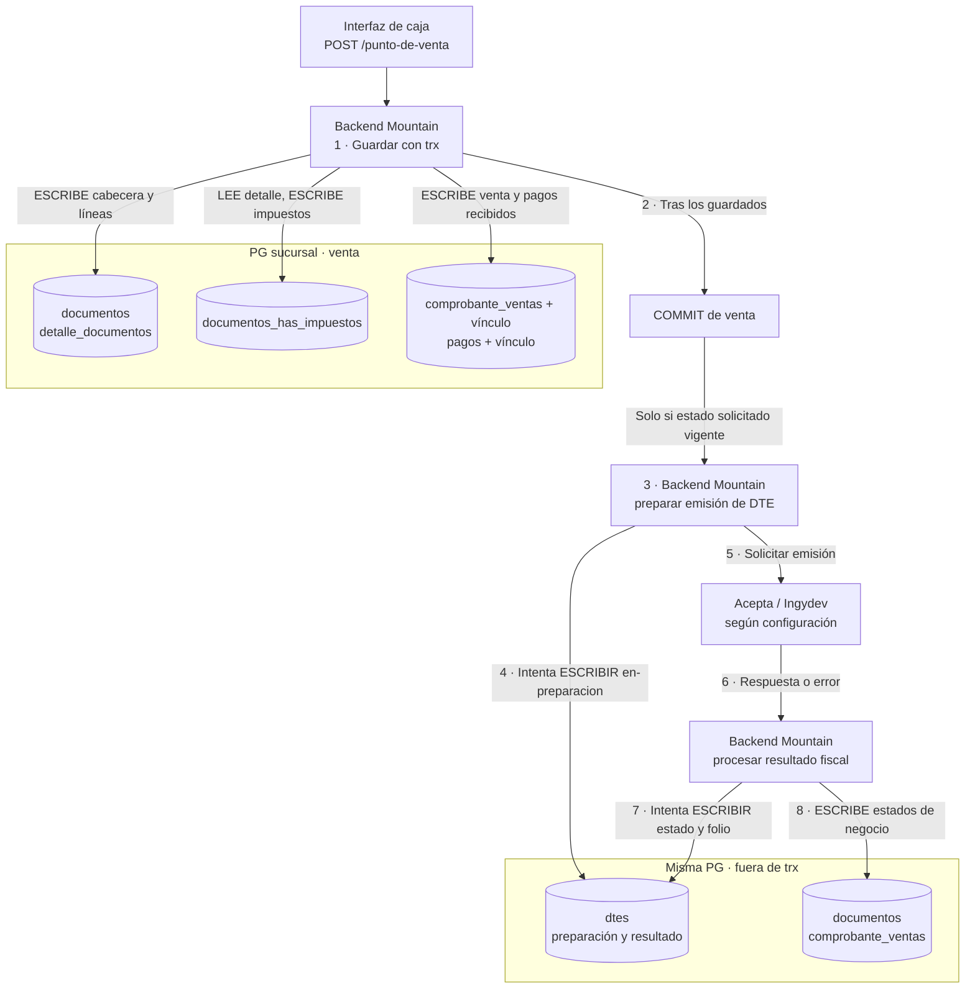
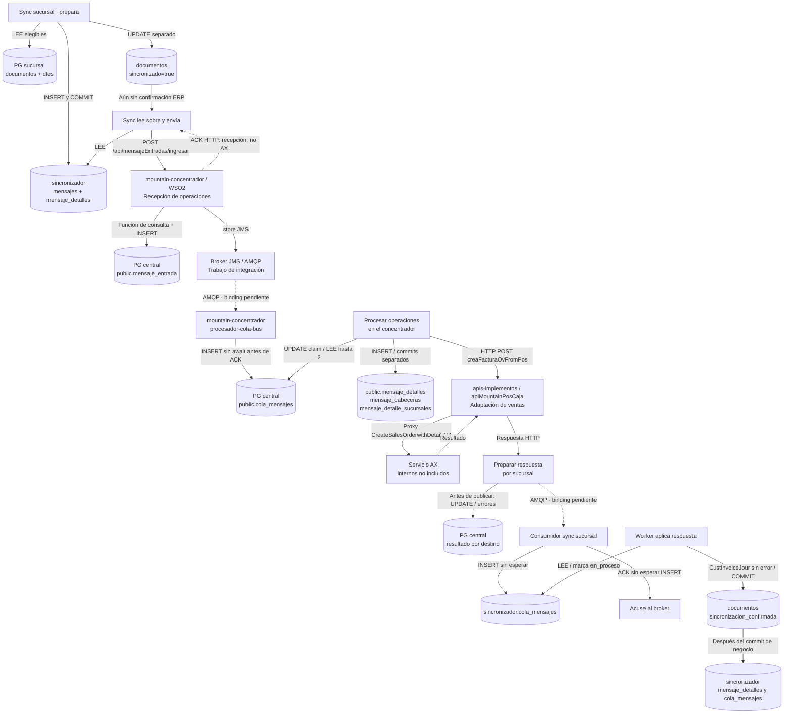
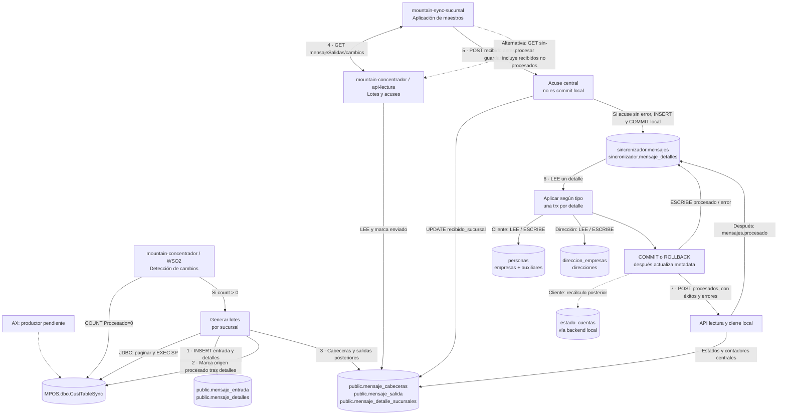
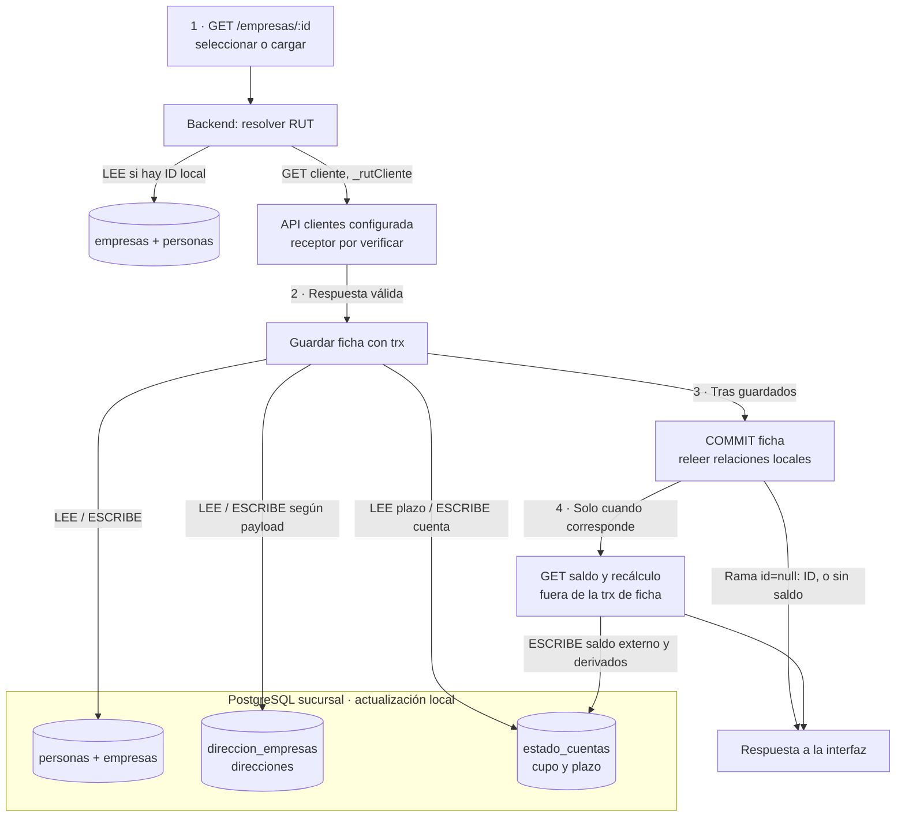
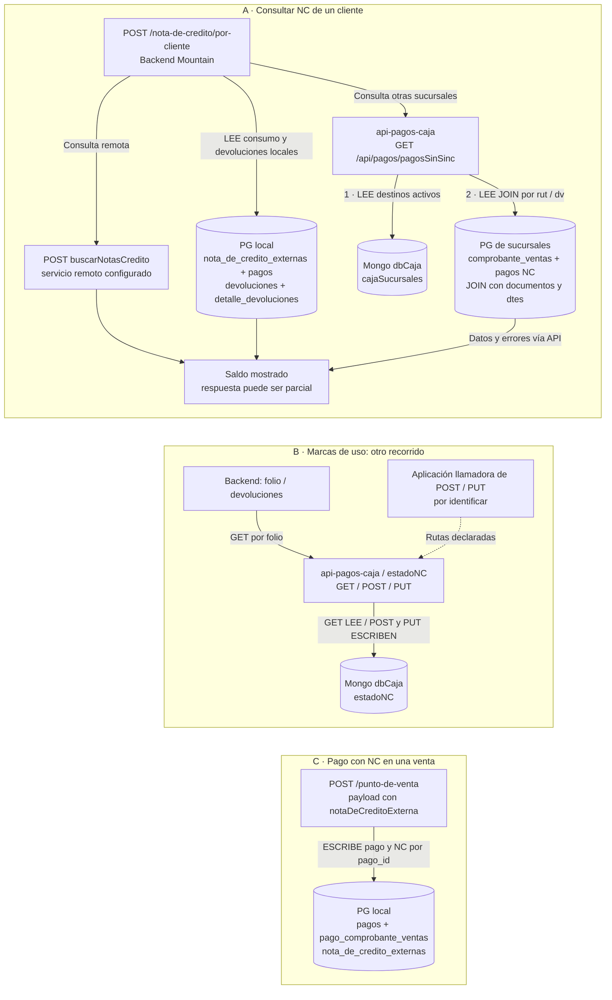

# Recorridos actuales: de la acción a las tablas

Revisión: **1 de octubre de 2026**. Estos recorridos amplían el [catálogo de endpoints](catalogo-integraciones-actuales.md) y las [vistas de arquitectura](vistas-arquitectura-y-flujos.md). Se reconstruyen desde los commits de Chile ya revisados. **No son trazas de producción ni un modelo completo de todas las tablas.**

La [presentación, capítulo Datos](../presentation/index.html#datos), permite elegir un recorrido, avanzar paso a paso y pulsar sus aplicaciones o tablas. Cada paso explica la lectura, escritura o llamada involucrada. Las fichas muestran campos de estado, límites de transacción y fuentes. Los cinco dibujos Mermaid de este documento son la fuente de los diagramas web.

## Cómo leer los recorridos

Una flecha **LEE** significa que el proceso consulta la tabla indicada; **ESCRIBE** significa que solicita una modificación. La dirección de la flecha sigue la acción del proceso sobre la base, no un diagrama de movimiento físico de cada fila. Las flechas de respuesta y de continuación se rotulan por separado. Un cilindro puede agrupar tablas de una misma operación; no representa una tabla nueva. Los números fijan el orden narrativo y los pasos interactivos destacan las piezas involucradas.

Los cuadros delimitan **bases o ámbitos lógicos**, no servidores confirmados. No se copian IP, nombres de bases configuradas ni credenciales. `COMMIT` cierra la transacción indicada, no confirma una emisión fiscal, el registro en AX ni una escritura en otra base. Las flechas punteadas se explican en su etiqueta: dependencia pendiente, respuesta asíncrona o actualización posterior, según el caso.

**Precisión de nombres:** cuando un modelo declara `schema.tabla`, se reproduce ese nombre. Cuando migraciones y consultas identifican la tabla sin schema, se conserva el nombre sin añadir `public`: el `search_path` efectivo sigue pendiente. En MongoDB se distingue el modelo de la colección cuando hay evidencia explícita. No se infieren tablas físicas de AX/MPOS a partir de nombres de entidades en mensajes.

Las fuentes fijan `mountain-implementos@711f97fd7948`, `mountain-sync-sucursal@540ab9a70e7b` y `api-pagos-caja@33cd625f029a`. En el sincronizador se leyó **master**, aunque el checkout predeterminado está en `desarrollo`. Producción, hosts, permisos y DDL efectivo requieren validación del equipo. Los enlaces al código pueden requerir acceso a GitHub corporativo.

## D01 · Venta → persistencia → DTE

El backend guarda documentos y pagos recibidos. Después del commit solicita la emisión fiscal y actualiza sus estados por separado.

**Límite principal:** La transacción de venta termina antes de facturar. _guardarEstadoDte absorbe errores de escritura: una llamada o respuesta fiscal no garantiza que dtes haya quedado actualizado. No se ha certificado la participación de todos los guardados Lucid en la misma trx.

### Seguir la operación

1. **Guardar la venta recibida.** POST /punto-de-venta abre una transacción. Guarda cabecera y líneas, calcula impuestos y registra el comprobante y los pagos recibidos. Registrar un pago aquí no equivale a ejecutar un cargo bancario. Ruta/llamada: `POST /punto-de-venta`. [Guardado de documentos, comprobante y vínculos](https://github.com/developer-implementos/mountain-implementos/blob/711f97fd7948c696bf45c992c5b121683bdbacd7/backend/app/Controllers/Http/PuntoDeVentaController.js#L309-L418); [Documento y detalle con trx](https://github.com/developer-implementos/mountain-implementos/blob/711f97fd7948c696bf45c992c5b121683bdbacd7/backend/app/Controllers/Http/PuntoDeVentaController.js#L586-L669); [Lectura y recálculo de impuestos](https://github.com/developer-implementos/mountain-implementos/blob/711f97fd7948c696bf45c992c5b121683bdbacd7/backend/app/Services/ImpuestosService.js#L17-L62); [Guardado de pago y datos específicos](https://github.com/developer-implementos/mountain-implementos/blob/711f97fd7948c696bf45c992c5b121683bdbacd7/backend/app/Services/PagoService.js#L59-L100); [Vínculos del pago al comprobante](https://github.com/developer-implementos/mountain-implementos/blob/711f97fd7948c696bf45c992c5b121683bdbacd7/backend/app/Services/ComprobanteVentaService.js#L105-L133).

2. **Cerrar la transacción de venta.** El controlador ejecuta trx.commit(). Para un documento solicitado como vigente, verifica cobranza y llama al servicio de facturación después. Un error posterior no deshace ese commit. [Controlador: commit y facturación posterior](https://github.com/developer-implementos/mountain-implementos/blob/711f97fd7948c696bf45c992c5b121683bdbacd7/backend/app/Controllers/Http/PuntoDeVentaController.js#L151-L202).

3. **Preparar el documento fiscal.** El servicio relee documentos del comprobante y DTE existentes. Intenta guardar dtes en estado en-preparacion antes de invocar al proveedor. Esa escritura está fuera de la transacción de venta. [Relectura del comprobante y fallo fiscal](https://github.com/developer-implementos/mountain-implementos/blob/711f97fd7948c696bf45c992c5b121683bdbacd7/backend/app/Services/ComprobanteVentaService.js#L209-L248); [Preparación, llamada y resultado fiscal](https://github.com/developer-implementos/mountain-implementos/blob/711f97fd7948c696bf45c992c5b121683bdbacd7/backend/app/Services/Facturacion/FacturacionService.js#L295-L399); [Persistencia DTE y catch local](https://github.com/developer-implementos/mountain-implementos/blob/711f97fd7948c696bf45c992c5b121683bdbacd7/backend/app/Services/Facturacion/FacturacionService.js#L463-L485).

4. **Solicitar la emisión.** El proveedor configurado procesa la emisión. El helper de escritura de dtes captura su propio error; el recorrido puede continuar aunque la marca local anterior no se haya guardado. Ruta/llamada: `POST a FACTURACION_ACEPTA_SERVICIO o servicio SOAP Ingydev, según configuración`. [Preparación, llamada y resultado fiscal](https://github.com/developer-implementos/mountain-implementos/blob/711f97fd7948c696bf45c992c5b121683bdbacd7/backend/app/Services/Facturacion/FacturacionService.js#L295-L399); [Persistencia DTE y catch local](https://github.com/developer-implementos/mountain-implementos/blob/711f97fd7948c696bf45c992c5b121683bdbacd7/backend/app/Services/Facturacion/FacturacionService.js#L463-L485).

5. **Guardar el resultado por separado.** Tras la respuesta o el error, se intenta actualizar dtes y se cambian estados de documentos/comprobante. Puede quedar la venta persistida con fallo fiscal. La integración con AX ocurre en otro recorrido. [Preparación, llamada y resultado fiscal](https://github.com/developer-implementos/mountain-implementos/blob/711f97fd7948c696bf45c992c5b121683bdbacd7/backend/app/Services/Facturacion/FacturacionService.js#L295-L399); [Persistencia DTE y catch local](https://github.com/developer-implementos/mountain-implementos/blob/711f97fd7948c696bf45c992c5b121683bdbacd7/backend/app/Services/Facturacion/FacturacionService.js#L463-L485); [Relectura del comprobante y fallo fiscal](https://github.com/developer-implementos/mountain-implementos/blob/711f97fd7948c696bf45c992c5b121683bdbacd7/backend/app/Services/ComprobanteVentaService.js#L209-L248); [Facturación y cambio de estado del documento](https://github.com/developer-implementos/mountain-implementos/blob/711f97fd7948c696bf45c992c5b121683bdbacd7/backend/app/Services/DocumentoService.js#L397-L434).

### Datos y fronteras dentro de este recorrido

**documentos + detalle_documentos** — LEE / ESCRIBE. Crea o actualiza el documento, elimina detalle previo y guarda líneas con trx. Los importes se actualizan durante el cálculo de impuestos. Tablas PostgreSQL identificadas sin esquema calificado. search_path y DDL productivos pendientes. [Documento y detalle con trx](https://github.com/developer-implementos/mountain-implementos/blob/711f97fd7948c696bf45c992c5b121683bdbacd7/backend/app/Controllers/Http/PuntoDeVentaController.js#L586-L669); [Lectura y recálculo de impuestos](https://github.com/developer-implementos/mountain-implementos/blob/711f97fd7948c696bf45c992c5b121683bdbacd7/backend/app/Services/ImpuestosService.js#L17-L62).

**documentos_has_impuestos** — LEE / ESCRIBE. ImpuestosService lee líneas y relaciones de productos/producto_impuestos/impuestos, actualiza importes y reemplaza impuestos del documento. No implica stock ni evaluación local de ofertas. Tablas PostgreSQL identificadas sin esquema calificado. search_path y DDL productivos pendientes. [Lectura y recálculo de impuestos](https://github.com/developer-implementos/mountain-implementos/blob/711f97fd7948c696bf45c992c5b121683bdbacd7/backend/app/Services/ImpuestosService.js#L17-L62); [Nombre de la relación de impuestos](https://github.com/developer-implementos/mountain-implementos/blob/711f97fd7948c696bf45c992c5b121683bdbacd7/backend/app/Services/DocumentoService.js#L161-L174).

**Comprobante y pagos de la venta** — ESCRIBE. Agrupa comprobante_ventas, comprobante_venta_has_documentos, pagos y pago_comprobante_ventas. Son cuatro tablas de la misma operación, no una tabla nueva. Vínculos y guardados específicos de NC requieren validar la propagación efectiva de trx. Tablas PostgreSQL identificadas sin esquema calificado. search_path y DDL productivos pendientes. Campos/estado: venta_finalizada=true cuando el documento solicitado es vigente; no confirma AX. [Guardado de documentos, comprobante y vínculos](https://github.com/developer-implementos/mountain-implementos/blob/711f97fd7948c696bf45c992c5b121683bdbacd7/backend/app/Controllers/Http/PuntoDeVentaController.js#L309-L418); [Guardado de pago y datos específicos](https://github.com/developer-implementos/mountain-implementos/blob/711f97fd7948c696bf45c992c5b121683bdbacd7/backend/app/Services/PagoService.js#L59-L100); [Vínculos del pago al comprobante](https://github.com/developer-implementos/mountain-implementos/blob/711f97fd7948c696bf45c992c5b121683bdbacd7/backend/app/Services/ComprobanteVentaService.js#L105-L133).

**COMMIT de venta** — CIERRA TRANSACCIÓN. El commit sucede antes de verificar cobranza y facturar. Un rollback intentado después no revierte la transacción ya confirmada.  [Controlador: commit y facturación posterior](https://github.com/developer-implementos/mountain-implementos/blob/711f97fd7948c696bf45c992c5b121683bdbacd7/backend/app/Controllers/Http/PuntoDeVentaController.js#L151-L202).

**dtes: preparación y resultado** — LEE / INTENTA ESCRIBIR. Una sola tabla recibe intentos de escritura antes y después del proveedor. El helper usa findOrCreate/merge/save sin la trx anterior y captura excepciones localmente. No se puede interpretar su retorno como garantía de persistencia. Tablas PostgreSQL identificadas sin esquema calificado. search_path y DDL productivos pendientes. Campos/estado: documento_id, estado_dte_id; folio, fecha y PDF según respuesta. [Preparación, llamada y resultado fiscal](https://github.com/developer-implementos/mountain-implementos/blob/711f97fd7948c696bf45c992c5b121683bdbacd7/backend/app/Services/Facturacion/FacturacionService.js#L295-L399); [Persistencia DTE y catch local](https://github.com/developer-implementos/mountain-implementos/blob/711f97fd7948c696bf45c992c5b121683bdbacd7/backend/app/Services/Facturacion/FacturacionService.js#L463-L485); [Migración con nombre dtes](https://github.com/developer-implementos/mountain-implementos/blob/711f97fd7948c696bf45c992c5b121683bdbacd7/backend/database/migrations/1635954728771_dtes_schema.js#L6-L16).

**documentos y comprobante_ventas, después del commit** — ESCRIBE. Son las mismas tablas del guardado inicial, mostradas en otro momento. Se actualiza estado_documento_id; un fallo fiscal puede poner venta_finalizada=false. Tablas PostgreSQL identificadas sin esquema calificado. search_path y DDL productivos pendientes. Campos/estado: estado_documento_id, venta_finalizada. [Facturación y cambio de estado del documento](https://github.com/developer-implementos/mountain-implementos/blob/711f97fd7948c696bf45c992c5b121683bdbacd7/backend/app/Services/DocumentoService.js#L397-L434); [Relectura del comprobante y fallo fiscal](https://github.com/developer-implementos/mountain-implementos/blob/711f97fd7948c696bf45c992c5b121683bdbacd7/backend/app/Services/ComprobanteVentaService.js#L209-L248); [save de estado sin trx original](https://github.com/developer-implementos/mountain-implementos/blob/711f97fd7948c696bf45c992c5b121683bdbacd7/backend/app/Services/DocumentoService.js#L303-L309).

### Lectura crítica y pruebas pendientes

- La vista concentra persistencia: omite consultas previas de precio, autorización del medio de pago, impresión y catálogos auxiliares. Esos recorridos están en V02 y el catálogo.
- Los guardados principales reciben trx, pero PagoComprobanteVenta.save() no pasa argumento explícito después de findOrCreate(..., trx), y el guardado de NotaDeCreditoExterna utiliza una firma particular. Hace falta una prueba con la versión efectiva de Lucid para acreditar su participación; no se afirma ni atomicidad completa ni fuga comprobada.
- Prueba de frontera recomendada: forzar un fallo de persistencia de dtes antes y después del proveedor, observar la venta conservada y verificar recuperación sin duplicar emisión. Es una prueba pendiente, no ejecutada sobre sistemas corporativos.

## D02 · Venta preparada → concentrador → respuesta AX

Preparación local, recepción central, procesamiento AX y aplicación en sucursal son hitos distintos. El concentrador ahora tiene evidencia de Synapse/DSS, PostgreSQL, Node y mediadores Java.

**Límite principal:** Se representa la vía Node→cola SQL→Java del código. Activación y bindings efectivos pendientes: existe también MP_ProcesaRegistro. El ACK HTTP solo acusa recepción y ambos consumidores AMQP hacen ACK sin esperar el INSERT. No hay commit global PostgreSQL→AX→broker.

El recorrido detalla fuente `mountain-concentrador@b2fd1ec`, cruzada con `mountain-sync-sucursal@540ab9a` y `apis-implementos@8fbe2f1`. Los hosts físicos, CAR/JAR instalados y funciones SQL internas no se deducen del repositorio. Véase [ingreso al concentrador](analisis-repositorios/mountain-concentrador-ingreso.md) para alternativas, rutas de reintento y fronteras de commit.

### Seguir la operación

1. **Seleccionar documentos elegibles.** Sync lee documentos y relaciones. En la rama no development también exige condiciones fiscales sobre dtes. No envía automáticamente toda venta guardada. [Selección y marca anticipada del documento](https://github.com/developer-implementos/mountain-sync-sucursal/blob/540ab9a70e7befbca27a2f7eb88b87b25109e4d1/app/Services/SyncUpload/VentasSyncUploadService.js#L20-L150).

2. **Crear el sobre local.** MensajeService inserta sincronizador.mensajes y sincronizador.mensaje_detalles dentro de una transacción y confirma. Es una transacción posterior a la de la venta. [Transacción de cabecera y detalles](https://github.com/developer-implementos/mountain-sync-sucursal/blob/540ab9a70e7befbca27a2f7eb88b87b25109e4d1/app/Services/MensajeService.js#L15-L81); [Modelo → sincronizador.mensajes](https://github.com/developer-implementos/mountain-sync-sucursal/blob/540ab9a70e7befbca27a2f7eb88b87b25109e4d1/app/Models/Mensaje.js#L6-L21); [Modelo → sincronizador.mensaje_detalles](https://github.com/developer-implementos/mountain-sync-sucursal/blob/540ab9a70e7befbca27a2f7eb88b87b25109e4d1/app/Models/MensajeDetalle.js#L6-L14).

3. **Marcar preparado antes de enviar.** Después de crear el mensaje, actualiza documentos.sincronizado=true fuera de la transacción anterior. Luego el emisor lee el sobre y realiza el POST al bus. Esa marca no confirma AX. Ruta: `POST /api/mensajeEntradas/ingresar`. [Selección y marca anticipada del documento](https://github.com/developer-implementos/mountain-sync-sucursal/blob/540ab9a70e7befbca27a2f7eb88b87b25109e4d1/app/Services/SyncUpload/VentasSyncUploadService.js#L20-L150); [Leer mensaje de salida con detalles](https://github.com/developer-implementos/mountain-sync-sucursal/blob/540ab9a70e7befbca27a2f7eb88b87b25109e4d1/app/Services/MensajeService.js#L223-L258); [Envío HTTP al bus](https://github.com/developer-implementos/mountain-sync-sucursal/blob/540ab9a70e7befbca27a2f7eb88b87b25109e4d1/app/Services/SincronizadorService.js#L87-L101).

4. **Registrar recepción y encolar.** API_mensajeEntradas llama a DSS de consulta y mensaje; INSERT public.mensaje_entrada precede store JMS. Devuelve procesado=true como recepción técnica, no confirmación AX. Ruta: `POST /api/mensajeEntradas/ingresar`. [Recepción HTTP, sobre y ACK técnico](https://github.com/developer-implementos/mountain-concentrador/blob/b2fd1ec266d131abb54b7076d41acce30f045119/ESBImplementos/src/main/synapse-config/api/API_mensajeEntradas.xml#L18-L246); [DSS invoca fn_crea_registro_consulta](https://github.com/developer-implementos/mountain-concentrador/blob/b2fd1ec266d131abb54b7076d41acce30f045119/DSConcentrador/dataservice/DSS_RegistroConsultas.dbs#L1-L30); [INSERT public.mensaje_entrada](https://github.com/developer-implementos/mountain-concentrador/blob/b2fd1ec266d131abb54b7076d41acce30f045119/DSConcentrador/dataservice/DSS_MensajeEntrada.dbs#L1-L30); [Store JMS qlProcesaRegistro](https://github.com/developer-implementos/mountain-concentrador/blob/b2fd1ec266d131abb54b7076d41acce30f045119/ESBImplementos/src/main/synapse-config/message-stores/MS_ProcesaRegistro.xml#L1-L9).

5. **Separar consumidor Node y trabajador Java.** Node consume la cola configurada, solicita INSERT sin await y hace ACK. Java reclama hasta2 filas de public.cola_mensajes y enruta los detalles. Instancia/schema Node, bindings y activación pendientes; existe alternativa SamplingProcessor. [Consumidor AMQP: crear sin await y ACK](https://github.com/developer-implementos/mountain-concentrador/blob/b2fd1ec266d131abb54b7076d41acce30f045119/procesador-cola-bus/start/queueHooks.js#L30-L60); [Tabla cola_mensajes sin schema explícito](https://github.com/developer-implementos/mountain-concentrador/blob/b2fd1ec266d131abb54b7076d41acce30f045119/procesador-cola-bus/app/Models/ColaMensaje.js#L6-L10); [Claim SQL y marcar procesado](https://github.com/developer-implementos/mountain-concentrador/blob/b2fd1ec266d131abb54b7076d41acce30f045119/ClassProcesaCola/src/main/java/cl/implementos/BO/BOColaMensaje.java#L18-L81); [Trigger declarado y secuencia](https://github.com/developer-implementos/mountain-concentrador/blob/b2fd1ec266d131abb54b7076d41acce30f045119/ESBImplementos/src/main/synapse-config/tasks/Task_LeeMensajesCola.xml#L1-L9); [Consumidor Synapse alternativo versionado](https://github.com/developer-implementos/mountain-concentrador/blob/b2fd1ec266d131abb54b7076d41acce30f045119/ESBImplementos/src/main/synapse-config/message-processors/MP_ProcesaRegistro.xml#L1-L7).

6. **Preparar relaciones y registrar en AX.** Java crea detalles/cabecera/relación con commits separados; la secuencia ventas llama EP_Ventas. CajaController/NotaVenta adapta la venta e invoca el proxy AX. La implementación interna de AX no está incluida. Ruta: `POST /apiMountainPOS/api/caja/mountainpos/creaFacturaOvFromPos`. [Detalle, cabecera, relación y estaProcesado](https://github.com/developer-implementos/mountain-concentrador/blob/b2fd1ec266d131abb54b7076d41acce30f045119/ClassRegistraMensajeDetalle/src/main/java/cl/implementos/RegistraMensajeDetalle.java#L353-L497); [Bulk con commits parciales](https://github.com/developer-implementos/mountain-concentrador/blob/b2fd1ec266d131abb54b7076d41acce30f045119/ClassRegistraMensajeDetalle/src/main/java/cl/implementos/BO/BOMensajeDetalle.java#L133-L170); [Bulk de relación y UPDATE respuesta AX](https://github.com/developer-implementos/mountain-concentrador/blob/b2fd1ec266d131abb54b7076d41acce30f045119/ClassRegistraMensajeDetalle/src/main/java/cl/implementos/BO/BOMensajeDetalleSucursal.java#L59-L158); [Extracción del DTO y call blocking](https://github.com/developer-implementos/mountain-concentrador/blob/b2fd1ec266d131abb54b7076d41acce30f045119/ESBImplementos/src/main/synapse-config/sequences/SEQ_AX_Insert_ventas.xml#L1-L33); [POST ruta apiMountainPOS; configuración, no despliegue](https://github.com/developer-implementos/mountain-concentrador/blob/b2fd1ec266d131abb54b7076d41acce30f045119/QARegistryResource/EP_Ventas.xml#L1-L18); [Receptor .NET compatible](https://github.com/developer-implementos/apis-implementos/blob/8fbe2f1b4d4e464a403aa3daca63ffe712a9dd70/apiMountainPosCaja/Controllers/CajaController.cs#L24-L49); [Adaptación y proxy CreateSalesOrderwithDetailsV4](https://github.com/developer-implementos/apis-implementos/blob/8fbe2f1b4d4e464a403aa3daca63ffe712a9dd70/ServiciosAX/mountainPosCajaServices/NotaVenta.cs#L46-L245).

7. **Guardar resultado y publicar retorno.** SEQ_Q_RespuestaAxASucursal clasifica error y tablasAx, guarda respuesta/estados en PostgreSQL y publica por entidad de origen con el ID del detalle de sucursal. Procesado=true puede coexistir con error. [Persistir resultado y notificar sucursal](https://github.com/developer-implementos/mountain-concentrador/blob/b2fd1ec266d131abb54b7076d41acce30f045119/ESBImplementos/src/main/synapse-config/sequences/SEQ_Q_RespuestaAxASucursal.xml#L1-L44); [Respuesta central y estados por destino](https://github.com/developer-implementos/mountain-concentrador/blob/b2fd1ec266d131abb54b7076d41acce30f045119/ClassRegistraMensajeDetalle/src/main/java/cl/implementos/RegistraMensajeDetalle.java#L763-L861); [Inspección de errores e INSERT historial](https://github.com/developer-implementos/mountain-concentrador/blob/b2fd1ec266d131abb54b7076d41acce30f045119/ClassRegistraMensajeDetalle/src/main/java/cl/implementos/BO/BOMensajeDetalleSucursalErrores.java#L26-L146); [Store por entidad y caso no soportado](https://github.com/developer-implementos/mountain-concentrador/blob/b2fd1ec266d131abb54b7076d41acce30f045119/ESBImplementos/src/main/synapse-config/sequences/SEQ_OrquestaColaSucursal.xml#L1-L156).

8. **Recibir respuesta y acusar al broker.** El consumidor invoca la creación de sincronizador.cola_mensajes sin await y emite ACK a continuación. No espera a que termine el INSERT. Persistir la respuesta y acusar recibo son hechos distintos. [Crear cola sin await y emitir ACK](https://github.com/developer-implementos/mountain-sync-sucursal/blob/540ab9a70e7befbca27a2f7eb88b87b25109e4d1/start/queueHooks.js#L36-L76); [Crear y procesar cola local](https://github.com/developer-implementos/mountain-sync-sucursal/blob/540ab9a70e7befbca27a2f7eb88b87b25109e4d1/app/Services/ColaMensajeService.js#L17-L140); [Modelo → sincronizador.cola_mensajes](https://github.com/developer-implementos/mountain-sync-sucursal/blob/540ab9a70e7befbca27a2f7eb88b87b25109e4d1/app/Models/ColaMensaje.js#L6-L10).

9. **Aplicar el resultado a negocio.** El worker lee la cola y el detalle asociado. Solo una respuesta de venta con CustInvoiceJour sin error activa id_externo y sincronizacion_confirmada. Una respuesta de pago se evalúa por separado. [Crear y procesar cola local](https://github.com/developer-implementos/mountain-sync-sucursal/blob/540ab9a70e7befbca27a2f7eb88b87b25109e4d1/app/Services/ColaMensajeService.js#L17-L140); [Aplicar respuesta AX por entidad](https://github.com/developer-implementos/mountain-sync-sucursal/blob/540ab9a70e7befbca27a2f7eb88b87b25109e4d1/app/Services/MensajeDetalleService.js#L366-L591).

10. **Actualizar el seguimiento después.** Tras el commit de negocio se actualiza mensaje_detalles. La cola también termina con procesado y, cuando corresponde, error. Procesado no significa éxito ni todas estas escrituras son atómicas. [Aplicar respuesta AX por entidad](https://github.com/developer-implementos/mountain-sync-sucursal/blob/540ab9a70e7befbca27a2f7eb88b87b25109e4d1/app/Services/MensajeDetalleService.js#L366-L591); [Actualizar metadata después del commit](https://github.com/developer-implementos/mountain-sync-sucursal/blob/540ab9a70e7befbca27a2f7eb88b87b25109e4d1/app/Services/MensajeDetalleService.js#L768-L780); [Crear y procesar cola local](https://github.com/developer-implementos/mountain-sync-sucursal/blob/540ab9a70e7befbca27a2f7eb88b87b25109e4d1/app/Services/ColaMensajeService.js#L17-L140).

### Datos y fronteras dentro de este recorrido

**documentos + dtes, entrada del sync** — LEE. Selecciona hasta 100 documentos. Lee empresas y relaciones de cliente, líneas/productos, pagos, caja/usuario y referencias. Fuera de development une dtes y direccion_empresas y exige condiciones fiscales. Tabla de negocio sin esquema calificado. El search_path y el DDL productivos requieren validación. documentos.sincronizado=false; empresa con referencia externa; filtros de tipo/estado según ambiente. [Selección y marca anticipada del documento](https://github.com/developer-implementos/mountain-sync-sucursal/blob/540ab9a70e7befbca27a2f7eb88b87b25109e4d1/app/Services/SyncUpload/VentasSyncUploadService.js#L20-L150); [Relaciones para el DTO AX](https://github.com/developer-implementos/mountain-sync-sucursal/blob/540ab9a70e7befbca27a2f7eb88b87b25109e4d1/app/Services/SyncUpload/VentasSyncUploadService.js#L363-L395).

**sincronizador.mensajes + sincronizador.mensaje_detalles** — ESCRIBE / LEE. Cabecera y detalles del sobre se insertan con la misma trx y commit. El emisor luego los consulta. No se demuestra atomicidad con la transacción que originó la venta. Esquema sincronizador declarado explícitamente por static get table() en el modelo.  [Modelo → sincronizador.mensajes](https://github.com/developer-implementos/mountain-sync-sucursal/blob/540ab9a70e7befbca27a2f7eb88b87b25109e4d1/app/Models/Mensaje.js#L6-L21); [Modelo → sincronizador.mensaje_detalles](https://github.com/developer-implementos/mountain-sync-sucursal/blob/540ab9a70e7befbca27a2f7eb88b87b25109e4d1/app/Models/MensajeDetalle.js#L6-L14); [Transacción de cabecera y detalles](https://github.com/developer-implementos/mountain-sync-sucursal/blob/540ab9a70e7befbca27a2f7eb88b87b25109e4d1/app/Services/MensajeService.js#L15-L81); [Leer mensaje de salida con detalles](https://github.com/developer-implementos/mountain-sync-sucursal/blob/540ab9a70e7befbca27a2f7eb88b87b25109e4d1/app/Services/MensajeService.js#L223-L258).

**documentos.sincronizado, marca anticipada** — ESCRIBE. UPDATE posterior a la creación del mensaje y anterior al HTTP. Es preparación local, no confirmación externa. Tabla de negocio sin esquema calificado. El search_path y el DDL productivos requieren validación. sincronizado=true; sincronizacion_confirmada no se activa aquí. [Selección y marca anticipada del documento](https://github.com/developer-implementos/mountain-sync-sucursal/blob/540ab9a70e7befbca27a2f7eb88b87b25109e4d1/app/Services/SyncUpload/VentasSyncUploadService.js#L20-L150).

**API_mensajeEntradas / DSS** — RECIBE / SOLICITA SQL / PUBLICA. mountain-concentrador recibe POST /api/mensajeEntradas/ingresar, invoca DSS de consulta y mensaje, publica un store y devuelve procesado=true antes de AX. DSS usa public.fn_crea_registro_consulta e INSERT public.mensaje_entrada; función SQL interna no incluida.  [Recepción HTTP, sobre y ACK técnico](https://github.com/developer-implementos/mountain-concentrador/blob/b2fd1ec266d131abb54b7076d41acce30f045119/ESBImplementos/src/main/synapse-config/api/API_mensajeEntradas.xml#L18-L246); [DSS invoca fn_crea_registro_consulta](https://github.com/developer-implementos/mountain-concentrador/blob/b2fd1ec266d131abb54b7076d41acce30f045119/DSConcentrador/dataservice/DSS_RegistroConsultas.dbs#L1-L30); [INSERT public.mensaje_entrada](https://github.com/developer-implementos/mountain-concentrador/blob/b2fd1ec266d131abb54b7076d41acce30f045119/DSConcentrador/dataservice/DSS_MensajeEntrada.dbs#L1-L30).

**sincronizador.cola_mensajes** — ESCRIBE / LEE. Se intenta insertar el aviso/respuesta local. El worker lee hasta 40 registros y marca en_proceso; después registra procesado/error. Esquema sincronizador declarado explícitamente por static get table() en el modelo. en_proceso, procesado, error. Procesado puede contener un resultado fallido. [Modelo → sincronizador.cola_mensajes](https://github.com/developer-implementos/mountain-sync-sucursal/blob/540ab9a70e7befbca27a2f7eb88b87b25109e4d1/app/Models/ColaMensaje.js#L6-L10); [Crear y procesar cola local](https://github.com/developer-implementos/mountain-sync-sucursal/blob/540ab9a70e7befbca27a2f7eb88b87b25109e4d1/app/Services/ColaMensajeService.js#L17-L140).

**documentos, confirmación de venta** — ESCRIBE / COMMIT. En la transacción de aplicación, una entrada CustInvoiceJour con error=false activa id_externo, sincronizado y sincronizacion_confirmada. No demuestra INSERT directo en una tabla física AX. Tabla de negocio sin esquema calificado. El search_path y el DDL productivos requieren validación. ov según respuesta; id_externo, sincronizado=true, sincronizacion_confirmada=true en la condición satisfactoria. [Aplicar respuesta AX por entidad](https://github.com/developer-implementos/mountain-sync-sucursal/blob/540ab9a70e7befbca27a2f7eb88b87b25109e4d1/app/Services/MensajeDetalleService.js#L366-L591).

**Metadata posterior: detalle y cola** — ESCRIBE. Actualiza sincronizador.mensaje_detalles después del commit de negocio; el worker actualiza sincronizador.cola_mensajes al terminar. Son escrituras posteriores, no una única transacción con documentos. Esquema sincronizador declarado explícitamente por static get table() en el modelo. procesado, error, respuesta_externa y fechas en el detalle; procesado/error en la cola. [Modelo → sincronizador.mensaje_detalles](https://github.com/developer-implementos/mountain-sync-sucursal/blob/540ab9a70e7befbca27a2f7eb88b87b25109e4d1/app/Models/MensajeDetalle.js#L6-L14); [Modelo → sincronizador.cola_mensajes](https://github.com/developer-implementos/mountain-sync-sucursal/blob/540ab9a70e7befbca27a2f7eb88b87b25109e4d1/app/Models/ColaMensaje.js#L6-L10); [Aplicar respuesta AX por entidad](https://github.com/developer-implementos/mountain-sync-sucursal/blob/540ab9a70e7befbca27a2f7eb88b87b25109e4d1/app/Services/MensajeDetalleService.js#L366-L591); [Actualizar metadata después del commit](https://github.com/developer-implementos/mountain-sync-sucursal/blob/540ab9a70e7befbca27a2f7eb88b87b25109e4d1/app/Services/MensajeDetalleService.js#L768-L780); [Crear y procesar cola local](https://github.com/developer-implementos/mountain-sync-sucursal/blob/540ab9a70e7befbca27a2f7eb88b87b25109e4d1/app/Services/ColaMensajeService.js#L17-L140).

**public.mensaje_entrada / registro de consulta** — ESCRIBE. DSS invoca public.fn_crea_registro_consulta y luego INSERT del sobre JSON. PostgreSQL y store JMS no comparten un commit global demostrado.   [DSS invoca fn_crea_registro_consulta](https://github.com/developer-implementos/mountain-concentrador/blob/b2fd1ec266d131abb54b7076d41acce30f045119/DSConcentrador/dataservice/DSS_RegistroConsultas.dbs#L1-L30); [INSERT public.mensaje_entrada](https://github.com/developer-implementos/mountain-concentrador/blob/b2fd1ec266d131abb54b7076d41acce30f045119/DSConcentrador/dataservice/DSS_MensajeEntrada.dbs#L1-L30).

**MS_ProcesaRegistro / qlProcesaRegistro** — PUBLICA / ENTREGA. Store JMS versionado. Consumidor Node usa ESB_BROKER_QUEUE configurable; cotejar binding. SamplingProcessor es otra configuración versionada, no una segunda etapa obligatoria.   [Store JMS qlProcesaRegistro](https://github.com/developer-implementos/mountain-concentrador/blob/b2fd1ec266d131abb54b7076d41acce30f045119/ESBImplementos/src/main/synapse-config/message-stores/MS_ProcesaRegistro.xml#L1-L9); [Consumidor Synapse alternativo versionado](https://github.com/developer-implementos/mountain-concentrador/blob/b2fd1ec266d131abb54b7076d41acce30f045119/ESBImplementos/src/main/synapse-config/message-processors/MP_ProcesaRegistro.xml#L1-L7); [Nombre de cola y broker por configuración](https://github.com/developer-implementos/mountain-concentrador/blob/b2fd1ec266d131abb54b7076d41acce30f045119/procesador-cola-bus/start/queueHooks.js#L4-L13).

**procesador-cola-bus** — RECIBE / SOLICITA INSERT. Node decodifica XML, llama crear sin await y hace ACK. El cron elimina procesados correctos; no llama AX.   [Consumidor AMQP: crear sin await y ACK](https://github.com/developer-implementos/mountain-concentrador/blob/b2fd1ec266d131abb54b7076d41acce30f045119/procesador-cola-bus/start/queueHooks.js#L30-L60); [INSERT por modelo y eliminación de procesados](https://github.com/developer-implementos/mountain-concentrador/blob/b2fd1ec266d131abb54b7076d41acce30f045119/procesador-cola-bus/app/Services/ColaMensajeService.js#L8-L25).

**public.cola_mensajes** — ESCRIBE / LEE / MARCA. Java reclama hasta2 filas no procesadas/no en proceso y marca en_proceso=true; luego procesado=true,en_proceso=false. Node escribe tabla no calificada: validar instancia/search_path.   [Claim SQL y marcar procesado](https://github.com/developer-implementos/mountain-concentrador/blob/b2fd1ec266d131abb54b7076d41acce30f045119/ClassProcesaCola/src/main/java/cl/implementos/BO/BOColaMensaje.java#L18-L81); [Tabla cola_mensajes sin schema explícito](https://github.com/developer-implementos/mountain-concentrador/blob/b2fd1ec266d131abb54b7076d41acce30f045119/procesador-cola-bus/app/Models/ColaMensaje.js#L6-L10); [Columnas y valores iniciales de cola](https://github.com/developer-implementos/mountain-concentrador/blob/b2fd1ec266d131abb54b7076d41acce30f045119/procesador-cola-bus/database/migrations/1640028044697_cola_mensajes_schema.js#L7-L19).

**Task_LeeMensajesCola / RegistraMensajeDetalle** — LEE / PROCESA / ENVÍA. Task/ProcesaCola lee cola; secuencias y mediador descomponen, consultan duplicados y seleccionan ventas. Respuesta previa exitosa permite evitar AX; probar sobres con estados mezclados.   [Trigger declarado y secuencia](https://github.com/developer-implementos/mountain-concentrador/blob/b2fd1ec266d131abb54b7076d41acce30f045119/ESBImplementos/src/main/synapse-config/tasks/Task_LeeMensajesCola.xml#L1-L9); [Java leer-cambios e iteración](https://github.com/developer-implementos/mountain-concentrador/blob/b2fd1ec266d131abb54b7076d41acce30f045119/ESBImplementos/src/main/synapse-config/sequences/SEQ_ColaMensajes_Leer.xml#L1-L31); [Detalle, cabecera, relación y estaProcesado](https://github.com/developer-implementos/mountain-concentrador/blob/b2fd1ec266d131abb54b7076d41acce30f045119/ClassRegistraMensajeDetalle/src/main/java/cl/implementos/RegistraMensajeDetalle.java#L353-L497); [Destino AX, respuesta previa e iteración](https://github.com/developer-implementos/mountain-concentrador/blob/b2fd1ec266d131abb54b7076d41acce30f045119/ESBImplementos/src/main/synapse-config/sequences/SEQ_ProcesaRegistroDetalle.xml#L45-L147); [Selección por once tipos](https://github.com/developer-implementos/mountain-concentrador/blob/b2fd1ec266d131abb54b7076d41acce30f045119/ESBImplementos/src/main/synapse-config/sequences/SEQ_AX_Inserciones.xml#L1-L52).

**mensaje_detalles / mensaje_cabeceras / mensaje_detalle_sucursales** — LEE / ESCRIBE. Escrituras public. Detalle, cabecera y relación por destino se guardan con métodos/commits separados. No confundir ID central con ID original de sucursal.   [Bulk con commits parciales](https://github.com/developer-implementos/mountain-concentrador/blob/b2fd1ec266d131abb54b7076d41acce30f045119/ClassRegistraMensajeDetalle/src/main/java/cl/implementos/BO/BOMensajeDetalle.java#L133-L170); [INSERT cabecera y UPDATE contadores](https://github.com/developer-implementos/mountain-concentrador/blob/b2fd1ec266d131abb54b7076d41acce30f045119/ClassRegistraMensajeDetalle/src/main/java/cl/implementos/BO/BOMensajeCabecera.java#L43-L85); [Bulk de relación y UPDATE respuesta AX](https://github.com/developer-implementos/mountain-concentrador/blob/b2fd1ec266d131abb54b7076d41acce30f045119/ClassRegistraMensajeDetalle/src/main/java/cl/implementos/BO/BOMensajeDetalleSucursal.java#L59-L158); [Identidad de origen y búsqueda de resultado](https://github.com/developer-implementos/mountain-concentrador/blob/b2fd1ec266d131abb54b7076d41acce30f045119/ClassRegistraMensajeDetalle/src/main/java/cl/implementos/BO/BOMensajeDetalle.java#L328-L416).

**CajaController / NotaVenta** — RECIBE / ADAPTA / INVoca. apis-implementos expone el receptor compatible; construye VentaContract y llama CreateSalesOrderwithDetailsV4. Prefijo de publicación de EP_Ventas y despliegue pendientes.   [Extracción del DTO y call blocking](https://github.com/developer-implementos/mountain-concentrador/blob/b2fd1ec266d131abb54b7076d41acce30f045119/ESBImplementos/src/main/synapse-config/sequences/SEQ_AX_Insert_ventas.xml#L1-L33); [POST ruta apiMountainPOS; configuración, no despliegue](https://github.com/developer-implementos/mountain-concentrador/blob/b2fd1ec266d131abb54b7076d41acce30f045119/QARegistryResource/EP_Ventas.xml#L1-L18); [Receptor .NET compatible](https://github.com/developer-implementos/apis-implementos/blob/8fbe2f1b4d4e464a403aa3daca63ffe712a9dd70/apiMountainPosCaja/Controllers/CajaController.cs#L24-L49); [Adaptación y proxy CreateSalesOrderwithDetailsV4](https://github.com/developer-implementos/apis-implementos/blob/8fbe2f1b4d4e464a403aa3daca63ffe712a9dd70/ServiciosAX/mountainPosCajaServices/NotaVenta.cs#L46-L245).

**Servicio AX de venta** — PROCESA / RESPONDE. Proxy WCF verificado desde .NET. Código servidor, idempotencia y transacciones internas AX no incluidos; nombres de tablas en respuesta no prueban INSERT internos.   [Adaptación y proxy CreateSalesOrderwithDetailsV4](https://github.com/developer-implementos/apis-implementos/blob/8fbe2f1b4d4e464a403aa3daca63ffe712a9dd70/ServiciosAX/mountainPosCajaServices/NotaVenta.cs#L46-L245).

**Resultado por destino / historial de errores** — ESCRIBE RESULTADO. Registra data_respuesta, procesado/error/reintento y mensaje_detalle_sucursal_errores. Inspecciona error exterior y tablasAx. Guardado y publicación JMS son separados.   [Respuesta central y estados por destino](https://github.com/developer-implementos/mountain-concentrador/blob/b2fd1ec266d131abb54b7076d41acce30f045119/ClassRegistraMensajeDetalle/src/main/java/cl/implementos/RegistraMensajeDetalle.java#L763-L861); [Inspección de errores e INSERT historial](https://github.com/developer-implementos/mountain-concentrador/blob/b2fd1ec266d131abb54b7076d41acce30f045119/ClassRegistraMensajeDetalle/src/main/java/cl/implementos/BO/BOMensajeDetalleSucursalErrores.java#L26-L146); [Bulk de relación y UPDATE respuesta AX](https://github.com/developer-implementos/mountain-concentrador/blob/b2fd1ec266d131abb54b7076d41acce30f045119/ClassRegistraMensajeDetalle/src/main/java/cl/implementos/BO/BOMensajeDetalleSucursal.java#L59-L158).

**SEQ_Q_RespuestaAxASucursal / store por entidad** — PUBLICA RESPUESTA. Después de intentar guardar el resultado arma axRespuesta y mensajeDetalleId de sucursal; selecciona store por origen. Caso no soportado solo registra log aquí.   [Persistir resultado y notificar sucursal](https://github.com/developer-implementos/mountain-concentrador/blob/b2fd1ec266d131abb54b7076d41acce30f045119/ESBImplementos/src/main/synapse-config/sequences/SEQ_Q_RespuestaAxASucursal.xml#L1-L44); [Store por entidad y caso no soportado](https://github.com/developer-implementos/mountain-concentrador/blob/b2fd1ec266d131abb54b7076d41acce30f045119/ESBImplementos/src/main/synapse-config/sequences/SEQ_OrquestaColaSucursal.xml#L1-L156); [Ejemplo de store JMS por sucursal](https://github.com/developer-implementos/mountain-concentrador/blob/b2fd1ec266d131abb54b7076d41acce30f045119/ESBImplementos/src/main/synapse-config/message-stores/MS_QL_OUT_ARICA.xml#L1-L9).

### Lectura crítica y pruebas pendientes

- El diagrama usa nombres cortos en los últimos cilindros: mensaje_detalles y cola_mensajes pertenecen al esquema sincronizador. La confirmación de documentos corresponde a venta; pago-factura reconoce LedgerJournalTable y tiene efectos diferentes sobre comprobante_ventas y pagos/NC.
- El objeto updateMensaje que arma el consumidor no prueba una actualización ejecutada de contadores de la cabecera. Esta vista solo dibuja escrituras observadas.
- Revisar con pruebas de corte entre crear mensaje/marcar documento, INSERT/ACK y commit de negocio/metadata. Deben verificarse recuperación, reentrega e idempotencia antes de considerar fiable cada frontera.

- En el centro se deben probar cortes entre SQL/store, ACK/INSERT, claim/llamada AX, resultado/store y respuestas con detalles mezclados. La ausencia de respuesta guardada no autoriza inferir que AX no produjo efecto.
- MP_ProcesaRegistro también está versionado como SamplingProcessor; no se dibuja como etapa adicional ni se presume instalado junto con Node. Confirmar export de runtime antes de cerrar el mapa operativo.

## D03 · MPOS → lotes centrales → maestros locales

El concentrador cuenta pendientes mediante DSS, lee MPOS con Java/JDBC y genera lotes PostgreSQL. API lectura los entrega; sync acusa recepción antes de guardarlos y aplica detalles uno a uno.

**Límite principal:** El productor AX→MPOS y el despliegue siguen pendientes. Java marca MPOS antes de completar cabeceras/salidas. Recibido precede al commit local, pero sin-procesar todavía reofrece enviado=true/procesado=false sin excluir recibido. No hay transacción global ni éxito íntegro implícito.

### Seguir la operación

1. **Detectar pendientes en MPOS.** El productor AX→MPOS sigue sin implementación recibida. La tarea fuente de clientes llama DSS count sobre CustTableSync con Procesado=0. interval=10 y variantes CAR son configuración, no calendario productivo confirmado. Ruta/llamada: `SOAP /services/DSS_AX_Clientes?wsdl; opGetCountClientesAX`. [MPOS, datasource y estados de origen](https://github.com/developer-implementos/mountain-concentrador/blob/b2fd1ec266d131abb54b7076d41acce30f045119/ClassRegistraMensajeDetalle/src/main/java/cl/implementos/BO/AX/BOAX.java#L45-L69); [Tabla de clientes, SP y lectura JDBC](https://github.com/developer-implementos/mountain-concentrador/blob/b2fd1ec266d131abb54b7076d41acce30f045119/ClassRegistraMensajeDetalle/src/main/java/cl/implementos/BO/AX/tables/BOCliente.java#L26-L83); [Task de clientes](https://github.com/developer-implementos/mountain-concentrador/blob/b2fd1ec266d131abb54b7076d41acce30f045119/ESBImplementos/src/main/synapse-config/tasks/Task_SincronizaClientes.xml#L1-L9); [Solo count > 0 dispara registro y cola](https://github.com/developer-implementos/mountain-concentrador/blob/b2fd1ec266d131abb54b7076d41acce30f045119/ESBImplementos/src/main/synapse-config/sequences/SEQ_DSS_AX_Clientes.xml#L1-L18); [DSS: count, SP y actualización](https://github.com/developer-implementos/mountain-concentrador/blob/b2fd1ec266d131abb54b7076d41acce30f045119/DSConcentrador/dataservice/DSS_AX_Clientes.dbs#L1-L83); [Endpoint DSS, path y timeout](https://github.com/developer-implementos/mountain-concentrador/blob/b2fd1ec266d131abb54b7076d41acce30f045119/ESBImplementos/src/main/synapse-config/endpoints/EP_DSS_AX_Clientes.xml#L2-L7).

2. **Generar detalles con Java/JDBC.** Si count>0, el trabajo pasa por store JMS/Andes y secuencia WSO2. RegistraMensajeDetalle pagina MPOS, ejecuta sp_caja_custTable y persiste entrada/detalles en PostgreSQL. DSS cuenta; el payload se obtiene directamente por JDBC. [Aviso de trabajo a MS_ProcesaRegistro](https://github.com/developer-implementos/mountain-concentrador/blob/b2fd1ec266d131abb54b7076d41acce30f045119/ESBImplementos/src/main/synapse-config/sequences/SEQ_Q_CambioDesdeAx.xml#L27-L45); [JMS / Andes y qlProcesaRegistro](https://github.com/developer-implementos/mountain-concentrador/blob/b2fd1ec266d131abb54b7076d41acce30f045119/ESBImplementos/src/main/synapse-config/message-stores/MS_ProcesaRegistro.xml#L2-L8); [Página, límite, mediador y aviso](https://github.com/developer-implementos/mountain-concentrador/blob/b2fd1ec266d131abb54b7076d41acce30f045119/ESBImplementos/src/main/synapse-config/sequences/SEQ_Q_LeerColaBus.xml#L3-L55); [Procesar cambios AX y seleccionar camino](https://github.com/developer-implementos/mountain-concentrador/blob/b2fd1ec266d131abb54b7076d41acce30f045119/ClassRegistraMensajeDetalle/src/main/java/cl/implementos/RegistraMensajeDetalle.java#L962-L1062); [Tabla de clientes, SP y lectura JDBC](https://github.com/developer-implementos/mountain-concentrador/blob/b2fd1ec266d131abb54b7076d41acce30f045119/ClassRegistraMensajeDetalle/src/main/java/cl/implementos/BO/AX/tables/BOCliente.java#L26-L83); [Tabla física public.mensaje_entrada](https://github.com/developer-implementos/mountain-concentrador/blob/b2fd1ec266d131abb54b7076d41acce30f045119/ClassRegistraMensajeDetalle/src/main/java/cl/implementos/BO/BOMensajeEntrada.java#L40-L65); [Bulk PostgreSQL de detalles](https://github.com/developer-implementos/mountain-concentrador/blob/b2fd1ec266d131abb54b7076d41acce30f045119/ClassRegistraMensajeDetalle/src/main/java/cl/implementos/BO/BOMensajeDetalle.java#L133-L170).

3. **Marcar origen y construir salidas.** BOGuardarData marca MPOS procesado tras el bulk de detalles, antes de insertar cabeceras/salidas. Los vínculos de destino comparten conexión con las salidas; eso no incluye todas las fases ni SQL Server. [Generar detalles, marcar origen y guardar salidas](https://github.com/developer-implementos/mountain-concentrador/blob/b2fd1ec266d131abb54b7076d41acce30f045119/ClassRegistraMensajeDetalle/src/main/java/cl/implementos/BO/BOGuardarData.java#L56-L208); [Actualización de origen y paginación 0/9](https://github.com/developer-implementos/mountain-concentrador/blob/b2fd1ec266d131abb54b7076d41acce30f045119/ClassRegistraMensajeDetalle/src/main/java/cl/implementos/BO/AX/BOAX.java#L212-L310); [Tabla física public.mensaje_cabeceras](https://github.com/developer-implementos/mountain-concentrador/blob/b2fd1ec266d131abb54b7076d41acce30f045119/ClassRegistraMensajeDetalle/src/main/java/cl/implementos/BO/BOMensajeCabecera.java#L43-L65); [Bulk de salidas con conexión compartida](https://github.com/developer-implementos/mountain-concentrador/blob/b2fd1ec266d131abb54b7076d41acce30f045119/ClassRegistraMensajeDetalle/src/main/java/cl/implementos/BO/BOMensajeSalida.java#L47-L96); [Detalles de destino con conexión heredada](https://github.com/developer-implementos/mountain-concentrador/blob/b2fd1ec266d131abb54b7076d41acce30f045119/ClassRegistraMensajeDetalle/src/main/java/cl/implementos/BO/BOMensajeDetalleSucursal.java#L59-L120).

4. **Pedir cambios a la API de lectura.** Polling o aviso AMQP puede iniciar la búsqueda. El receptor api-lectura está en mountain-concentrador: selecciona una salida, marca enviado y confirma antes de responder. Sync valida destino/datos; binding productivo pendiente. Ruta/llamada: `GET mensajeSalidas/cambios; recuperación: mensajeSalidas/sin-procesar`. [Descarga, recibido, guardado y procesados](https://github.com/developer-implementos/mountain-sync-sucursal/blob/540ab9a70e7befbca27a2f7eb88b87b25109e4d1/app/Services/LlamadaApis/CambiosConcentradorService.js#L77-L318); [Crear y procesar cola local](https://github.com/developer-implementos/mountain-sync-sucursal/blob/540ab9a70e7befbca27a2f7eb88b87b25109e4d1/app/Services/ColaMensajeService.js#L17-L140); [Cuatro rutas API lectura](https://github.com/developer-implementos/mountain-concentrador/blob/b2fd1ec266d131abb54b7076d41acce30f045119/api-lectura/start/routes.js#L19-L26); [GET cambios modifica estado y confirma trx](https://github.com/developer-implementos/mountain-concentrador/blob/b2fd1ec266d131abb54b7076d41acce30f045119/api-lectura/app/Controllers/Http/MensajeSalidasController.js#L19-L109); [Elegibilidad, selección, enviado y recuperación](https://github.com/developer-implementos/mountain-concentrador/blob/b2fd1ec266d131abb54b7076d41acce30f045119/api-lectura/app/Services/MensajeSalidaService.js#L9-L134).

5. **Acusar recepción antes de guardar.** El sync llama recibido antes del INSERT local. El receptor marca recibido_sucursal y hace commit; si el acuse no declara error, sync crea mensajes/detalles con otra transacción. Sin-procesar sigue incluyendo recibidos no procesados. Ruta/llamada: `POST mensajeSalidas/recibido`. [Descarga, recibido, guardado y procesados](https://github.com/developer-implementos/mountain-sync-sucursal/blob/540ab9a70e7befbca27a2f7eb88b87b25109e4d1/app/Services/LlamadaApis/CambiosConcentradorService.js#L77-L318); [Transacción de cabecera y detalles](https://github.com/developer-implementos/mountain-sync-sucursal/blob/540ab9a70e7befbca27a2f7eb88b87b25109e4d1/app/Services/MensajeService.js#L15-L81); [Sin procesar y recibido](https://github.com/developer-implementos/mountain-concentrador/blob/b2fd1ec266d131abb54b7076d41acce30f045119/api-lectura/app/Controllers/Http/MensajeSalidasController.js#L112-L191); [Elegibilidad, selección, enviado y recuperación](https://github.com/developer-implementos/mountain-concentrador/blob/b2fd1ec266d131abb54b7076d41acce30f045119/api-lectura/app/Services/MensajeSalidaService.js#L9-L134).

6. **Aplicar un detalle de cliente o dirección.** El worker abre una transacción por detalle. Un cliente modifica personas/empresas y auxiliares; una dirección modifica direccion_empresas/direcciones y necesita resolver su cliente. Son tipos alternativos, no una transacción conjunta. [Transacción por detalle y metadata posterior](https://github.com/developer-implementos/mountain-sync-sucursal/blob/540ab9a70e7befbca27a2f7eb88b87b25109e4d1/app/Services/MensajeDetalleService.js#L79-L355); [Aplicación de clientes y auxiliares](https://github.com/developer-implementos/mountain-sync-sucursal/blob/540ab9a70e7befbca27a2f7eb88b87b25109e4d1/app/Services/Sync/ClientesSyncService.js#L14-L407); [Aplicación condicionada de direcciones](https://github.com/developer-implementos/mountain-sync-sucursal/blob/540ab9a70e7befbca27a2f7eb88b87b25109e4d1/app/Services/Sync/DireccionesSyncService.js#L20-L315).

7. **Confirmar ese detalle y registrar su resultado.** Sin error se confirma; con error controlado se revierte. Después se actualiza metadata del detalle fuera de esa transacción. Procesado puede significar que se registró un error, no que el maestro se aplicó bien. [Transacción por detalle y metadata posterior](https://github.com/developer-implementos/mountain-sync-sucursal/blob/540ab9a70e7befbca27a2f7eb88b87b25109e4d1/app/Services/MensajeDetalleService.js#L79-L355).

8. **Recalcular cuenta si corresponde.** Después de cliente se intenta completar plazo y pedir recálculo al backend local, que puede guardar estado_cuentas. Este trabajo posterior puede fallar sin deshacer el cliente ya confirmado. Ruta/llamada: `GET public/cobranzas/actualizar-estado-cuenta (backend local)`. [Recálculo posterior por backend local](https://github.com/developer-implementos/mountain-sync-sucursal/blob/540ab9a70e7befbca27a2f7eb88b87b25109e4d1/app/Services/LlamadaApis/BackendSucursalService.js#L189-L212); [Cálculo y guardado de estado de cuenta](https://github.com/developer-implementos/mountain-implementos/blob/711f97fd7948c696bf45c992c5b121683bdbacd7/backend/app/Services/Cobranzas/AcuerdoCobranzaService.js#L811-L1166); [Ruta local de recálculo de cuenta](https://github.com/developer-implementos/mountain-implementos/blob/711f97fd7948c696bf45c992c5b121683bdbacd7/backend/start/routes.js#L527-L535); [Controlador que recibe el recálculo](https://github.com/developer-implementos/mountain-implementos/blob/711f97fd7948c696bf45c992c5b121683bdbacd7/backend/app/Controllers/Http/CobranzaController.js#L2058-L2102).

9. **Informar resultados y cerrar el mensaje.** POST procesados transmite resultados incluidos errores; central marca detalles/salida y suma contadores de la cabecera. Después sync marca su cabecera local con otra escritura. Repetir procesados vuelve a sumar: total_sincronizados no cuenta solo éxitos. Ruta/llamada: `POST mensajeSalidas/procesados`. [Descarga, recibido, guardado y procesados](https://github.com/developer-implementos/mountain-sync-sucursal/blob/540ab9a70e7befbca27a2f7eb88b87b25109e4d1/app/Services/LlamadaApis/CambiosConcentradorService.js#L77-L318); [Transacción por detalle y metadata posterior](https://github.com/developer-implementos/mountain-sync-sucursal/blob/540ab9a70e7befbca27a2f7eb88b87b25109e4d1/app/Services/MensajeDetalleService.js#L79-L355); [Procesados, contadores y estado de lote](https://github.com/developer-implementos/mountain-concentrador/blob/b2fd1ec266d131abb54b7076d41acce30f045119/api-lectura/app/Controllers/Http/MensajeSalidasController.js#L194-L277).

10. **Recuperar un enviado no procesado.** Ruta alternativa: GET sin-procesar consulta enviado=true/procesado=false, sin filtrar recibido_sucursal. Permite reofertar un lote acusado sin copia local, pero retención, reintento y deduplicación requieren pruebas. No se declara pérdida definitiva ni recuperación garantizada. Ruta/llamada: `GET mensajeSalidas/sin-procesar`. [Elegibilidad, selección, enviado y recuperación](https://github.com/developer-implementos/mountain-concentrador/blob/b2fd1ec266d131abb54b7076d41acce30f045119/api-lectura/app/Services/MensajeSalidaService.js#L9-L134); [Sin procesar y recibido](https://github.com/developer-implementos/mountain-concentrador/blob/b2fd1ec266d131abb54b7076d41acce30f045119/api-lectura/app/Controllers/Http/MensajeSalidasController.js#L112-L191); [Relectura de pendientes](https://github.com/developer-implementos/mountain-sync-sucursal/blob/540ab9a70e7befbca27a2f7eb88b87b25109e4d1/app/Services/LlamadaApis/CambiosConcentradorService.js#L118-L164); [GET y POST hacia API lectura](https://github.com/developer-implementos/mountain-sync-sucursal/blob/540ab9a70e7befbca27a2f7eb88b87b25109e4d1/app/Services/LlamadaApis/CambiosConcentradorService.js#L164-L287).

### Datos y fronteras dentro de este recorrido

**AX → productor de cambios pendiente** — PRODUCCIÓN DE CAMBIOS PENDIENTE. El usuario informa cambios desde AX hacia MPOS. El código recibido demuestra lectores MPOS, no quién alimenta la base ni un job diario o servidor compartido. MPOS sí aparece en el lector Java; productor y DDL pendientes. [MPOS, datasource y estados de origen](https://github.com/developer-implementos/mountain-concentrador/blob/b2fd1ec266d131abb54b7076d41acce30f045119/ClassRegistraMensajeDetalle/src/main/java/cl/implementos/BO/AX/BOAX.java#L45-L69); [Tabla de clientes, SP y lectura JDBC](https://github.com/developer-implementos/mountain-concentrador/blob/b2fd1ec266d131abb54b7076d41acce30f045119/ClassRegistraMensajeDetalle/src/main/java/cl/implementos/BO/AX/tables/BOCliente.java#L26-L83).

**MPOS.dbo.CustTableSync** — LEE / PAGINA / MARCA. BOAX fija MPOS; BOCliente selecciona tabla/Id y ejecuta MPOS.dbo.sp_caja_custTable. La paginación hace 0→9 y TOP(n) 9→0; marcar Procesado=1 no significa aplicado en sucursal. Contactos/direcciones tienen tablas específicas. Java califica MPOS.dbo; DSS usa CustTableSync sin esquema. Confirmar su datasource/DDL. [MPOS, datasource y estados de origen](https://github.com/developer-implementos/mountain-concentrador/blob/b2fd1ec266d131abb54b7076d41acce30f045119/ClassRegistraMensajeDetalle/src/main/java/cl/implementos/BO/AX/BOAX.java#L45-L69); [Actualización de origen y paginación 0/9](https://github.com/developer-implementos/mountain-concentrador/blob/b2fd1ec266d131abb54b7076d41acce30f045119/ClassRegistraMensajeDetalle/src/main/java/cl/implementos/BO/AX/BOAX.java#L212-L310); [Tabla de clientes, SP y lectura JDBC](https://github.com/developer-implementos/mountain-concentrador/blob/b2fd1ec266d131abb54b7076d41acce30f045119/ClassRegistraMensajeDetalle/src/main/java/cl/implementos/BO/AX/tables/BOCliente.java#L26-L83); [Tabla y SP de contactos](https://github.com/developer-implementos/mountain-concentrador/blob/b2fd1ec266d131abb54b7076d41acce30f045119/ClassRegistraMensajeDetalle/src/main/java/cl/implementos/BO/AX/tables/BOContacto.java#L26-L33); [Tabla y SP de direcciones](https://github.com/developer-implementos/mountain-concentrador/blob/b2fd1ec266d131abb54b7076d41acce30f045119/ClassRegistraMensajeDetalle/src/main/java/cl/implementos/BO/AX/tables/BODireccion.java#L26-L33); [DSS: count, SP y actualización](https://github.com/developer-implementos/mountain-concentrador/blob/b2fd1ec266d131abb54b7076d41acce30f045119/DSConcentrador/dataservice/DSS_AX_Clientes.dbs#L1-L83).

**Task / DSS / cola WSO2** — CONSULTA COUNT / ENCOLA. Task fuente de clientes interval=10 llama opGetCountClientesAX. Si count>0 encola trabajo MS_ProcesaRegistro; SamplingProcessor conduce a SEQ_Q_LeerColaBus. Las variantes CAR difieren y no acreditan tareas activas.  [Task de clientes](https://github.com/developer-implementos/mountain-concentrador/blob/b2fd1ec266d131abb54b7076d41acce30f045119/ESBImplementos/src/main/synapse-config/tasks/Task_SincronizaClientes.xml#L1-L9); [Solo count > 0 dispara registro y cola](https://github.com/developer-implementos/mountain-concentrador/blob/b2fd1ec266d131abb54b7076d41acce30f045119/ESBImplementos/src/main/synapse-config/sequences/SEQ_DSS_AX_Clientes.xml#L1-L18); [SOAPAction opGetCountClientesAX](https://github.com/developer-implementos/mountain-concentrador/blob/b2fd1ec266d131abb54b7076d41acce30f045119/ESBImplementos/src/main/synapse-config/templates/TP_DSS_AX_Clientes.xml#L9-L22); [DSS: count, SP y actualización](https://github.com/developer-implementos/mountain-concentrador/blob/b2fd1ec266d131abb54b7076d41acce30f045119/DSConcentrador/dataservice/DSS_AX_Clientes.dbs#L1-L83); [Aviso de trabajo a MS_ProcesaRegistro](https://github.com/developer-implementos/mountain-concentrador/blob/b2fd1ec266d131abb54b7076d41acce30f045119/ESBImplementos/src/main/synapse-config/sequences/SEQ_Q_CambioDesdeAx.xml#L27-L45); [JMS / Andes y qlProcesaRegistro](https://github.com/developer-implementos/mountain-concentrador/blob/b2fd1ec266d131abb54b7076d41acce30f045119/ESBImplementos/src/main/synapse-config/message-stores/MS_ProcesaRegistro.xml#L2-L8); [SamplingProcessor y concurrencia declarada](https://github.com/developer-implementos/mountain-concentrador/blob/b2fd1ec266d131abb54b7076d41acce30f045119/ESBImplementos/src/main/synapse-config/message-processors/MP_ProcesaRegistro.xml#L2-L6).

**RegistraMensajeDetalle → BOCliente / BOGuardarData** — LEE / TRANSFORMA / ESCRIBE. Lee contenido por JDBC, registra entrada/detalles, marca MPOS y después genera cabeceras y sobres de salida por entidad. No existe aquí un commit común SQL Server/PostgreSQL.  [Procesar cambios AX y seleccionar camino](https://github.com/developer-implementos/mountain-concentrador/blob/b2fd1ec266d131abb54b7076d41acce30f045119/ClassRegistraMensajeDetalle/src/main/java/cl/implementos/RegistraMensajeDetalle.java#L962-L1062); [Tabla de clientes, SP y lectura JDBC](https://github.com/developer-implementos/mountain-concentrador/blob/b2fd1ec266d131abb54b7076d41acce30f045119/ClassRegistraMensajeDetalle/src/main/java/cl/implementos/BO/AX/tables/BOCliente.java#L26-L83); [Generar detalles, marcar origen y guardar salidas](https://github.com/developer-implementos/mountain-concentrador/blob/b2fd1ec266d131abb54b7076d41acce30f045119/ClassRegistraMensajeDetalle/src/main/java/cl/implementos/BO/BOGuardarData.java#L56-L208); [Función fn_get_entidades](https://github.com/developer-implementos/mountain-concentrador/blob/b2fd1ec266d131abb54b7076d41acce30f045119/ClassRegistraMensajeDetalle/src/main/java/cl/implementos/BO/BOEntidades.java#L21-L51).

**public.mensaje_entrada · public.mensaje_detalles** — ESCRIBE DATOS DEL LOTE. Persistencia central de payload y detalles anterior a la marca de origen. El bulk de detalles utiliza su conexión/transacción; excepciones SQL pueden quedar solo registradas. Prefijo public explícito en SQL Java. [Tabla física public.mensaje_entrada](https://github.com/developer-implementos/mountain-concentrador/blob/b2fd1ec266d131abb54b7076d41acce30f045119/ClassRegistraMensajeDetalle/src/main/java/cl/implementos/BO/BOMensajeEntrada.java#L40-L65); [Bulk PostgreSQL de detalles](https://github.com/developer-implementos/mountain-concentrador/blob/b2fd1ec266d131abb54b7076d41acce30f045119/ClassRegistraMensajeDetalle/src/main/java/cl/implementos/BO/BOMensajeDetalle.java#L133-L170); [Generar detalles, marcar origen y guardar salidas](https://github.com/developer-implementos/mountain-concentrador/blob/b2fd1ec266d131abb54b7076d41acce30f045119/ClassRegistraMensajeDetalle/src/main/java/cl/implementos/BO/BOGuardarData.java#L56-L208).

**public.mensaje_cabeceras · public.mensaje_salida · public.mensaje_detalle_sucursales** — ESCRIBE / LEE / ACTUALIZA ESTADOS. Cabeceras y entregas por destino. API modifica enviado, recibido_sucursal y procesado en fases distintas. Procesados suma resultados, incluidos errores, sin deduplicar el incremento. Java usa public; API lectura usa nombres no calificados. search_path y binding por verificar. Campos/estado: enviado; recibido_sucursal; procesado/error; total_sincronizados y total_errores. [Tabla física public.mensaje_cabeceras](https://github.com/developer-implementos/mountain-concentrador/blob/b2fd1ec266d131abb54b7076d41acce30f045119/ClassRegistraMensajeDetalle/src/main/java/cl/implementos/BO/BOMensajeCabecera.java#L43-L65); [Bulk de salidas con conexión compartida](https://github.com/developer-implementos/mountain-concentrador/blob/b2fd1ec266d131abb54b7076d41acce30f045119/ClassRegistraMensajeDetalle/src/main/java/cl/implementos/BO/BOMensajeSalida.java#L47-L96); [Detalles de destino con conexión heredada](https://github.com/developer-implementos/mountain-concentrador/blob/b2fd1ec266d131abb54b7076d41acce30f045119/ClassRegistraMensajeDetalle/src/main/java/cl/implementos/BO/BOMensajeDetalleSucursal.java#L59-L120); [Elegibilidad, selección, enviado y recuperación](https://github.com/developer-implementos/mountain-concentrador/blob/b2fd1ec266d131abb54b7076d41acce30f045119/api-lectura/app/Services/MensajeSalidaService.js#L9-L134); [Procesados, contadores y estado de lote](https://github.com/developer-implementos/mountain-concentrador/blob/b2fd1ec266d131abb54b7076d41acce30f045119/api-lectura/app/Controllers/Http/MensajeSalidasController.js#L194-L277).

**api-lectura: MensajeSalidasController / Service** — LEE / MARCA ENVÍO / RECUPERA. Receptores AdonisJS en mountain-concentrador: cambios selecciona y marca enviado; sin-procesar recupera enviado=true/procesado=false sin excluir recibido. API WSO2 paralela usa codigoEntidad; este receptor y sync usan nombreEntidad.  [Cuatro rutas API lectura](https://github.com/developer-implementos/mountain-concentrador/blob/b2fd1ec266d131abb54b7076d41acce30f045119/api-lectura/start/routes.js#L19-L26); [GET cambios modifica estado y confirma trx](https://github.com/developer-implementos/mountain-concentrador/blob/b2fd1ec266d131abb54b7076d41acce30f045119/api-lectura/app/Controllers/Http/MensajeSalidasController.js#L19-L109); [Elegibilidad, selección, enviado y recuperación](https://github.com/developer-implementos/mountain-concentrador/blob/b2fd1ec266d131abb54b7076d41acce30f045119/api-lectura/app/Services/MensajeSalidaService.js#L9-L134); [API WSO2 paralela: contrato diferente](https://github.com/developer-implementos/mountain-concentrador/blob/b2fd1ec266d131abb54b7076d41acce30f045119/ESBImplementos/src/main/synapse-config/api/API_mensajeSalidas.xml#L2-L101); [GET y POST hacia API lectura](https://github.com/developer-implementos/mountain-sync-sucursal/blob/540ab9a70e7befbca27a2f7eb88b87b25109e4d1/app/Services/LlamadaApis/CambiosConcentradorService.js#L164-L287).

**Sobre local y metadata: mensajes / mensaje_detalles** — ESCRIBE / LEE. Nombres completos sincronizador.mensajes y sincronizador.mensaje_detalles. Inserta cabecera y detalles con trx, conserva referencia al mensaje del concentrador. Más adelante actualiza metadata fuera del commit del maestro. Esquema sincronizador declarado explícitamente por static get table() en el modelo. Campos/estado: mensaje_concentrador_id; procesado/error y fechas por detalle; estado de cabecera separado. [Modelo → sincronizador.mensajes](https://github.com/developer-implementos/mountain-sync-sucursal/blob/540ab9a70e7befbca27a2f7eb88b87b25109e4d1/app/Models/Mensaje.js#L6-L21); [Modelo → sincronizador.mensaje_detalles](https://github.com/developer-implementos/mountain-sync-sucursal/blob/540ab9a70e7befbca27a2f7eb88b87b25109e4d1/app/Models/MensajeDetalle.js#L6-L14); [Transacción de cabecera y detalles](https://github.com/developer-implementos/mountain-sync-sucursal/blob/540ab9a70e7befbca27a2f7eb88b87b25109e4d1/app/Services/MensajeService.js#L15-L81); [Transacción por detalle y metadata posterior](https://github.com/developer-implementos/mountain-sync-sucursal/blob/540ab9a70e7befbca27a2f7eb88b87b25109e4d1/app/Services/MensajeDetalleService.js#L79-L355).

**personas + empresas y auxiliares** — LEE / ESCRIBE. Crea/actualiza persona y empresa con trx. Puede obtener o crear clasificación, cartera, segmento, bloqueo y giro. Varias lecturas de apoyo no llevan la transacción. Tabla de negocio sin esquema calificado. El search_path y el DDL productivos requieren validación. Campos/estado: Referencias externas y datos del maestro. No es registro de venta ni control de stock. [Aplicación de clientes y auxiliares](https://github.com/developer-implementos/mountain-sync-sucursal/blob/540ab9a70e7befbca27a2f7eb88b87b25109e4d1/app/Services/Sync/ClientesSyncService.js#L14-L407); [Guardado de persona](https://github.com/developer-implementos/mountain-sync-sucursal/blob/540ab9a70e7befbca27a2f7eb88b87b25109e4d1/app/Services/PersonaService.js#L13-L61).

**direccion_empresas + direcciones** — LEE / ESCRIBE. Resuelve empresa por referencia externa y valida RUT. Sin empresa devuelve error. Aplica condiciones de vigencia y dirección principal; usa catálogos auxiliares de comuna/tipo. Nombres literales en consultas SQL, sin prefijo de esquema. [Aplicación condicionada de direcciones](https://github.com/developer-implementos/mountain-sync-sucursal/blob/540ab9a70e7befbca27a2f7eb88b87b25109e4d1/app/Services/Sync/DireccionesSyncService.js#L20-L315).

**Commit/rollback por detalle** — CIERRA TRX / ESCRIBE METADATA. El resultado sin error produce commit; el error controlado rollback. Luego actualizarDetalle guarda procesado/error sin la misma trx. El camino de excepción tiene su propio manejo.  [Transacción por detalle y metadata posterior](https://github.com/developer-implementos/mountain-sync-sucursal/blob/540ab9a70e7befbca27a2f7eb88b87b25109e4d1/app/Services/MensajeDetalleService.js#L79-L355).

**estado_cuentas, trabajo posterior** — LEE / ESCRIBE CONDICIONAL. Tras cliente, el sync lee/puede completar estado_cuenta_plazos y llama al backend. Este puede recalcular y escribir estado_cuentas. No pertenece a la transacción del detalle ya aplicada. Tabla de negocio sin esquema calificado. El search_path y el DDL productivos requieren validación. [Recálculo posterior por backend local](https://github.com/developer-implementos/mountain-sync-sucursal/blob/540ab9a70e7befbca27a2f7eb88b87b25109e4d1/app/Services/LlamadaApis/BackendSucursalService.js#L189-L212); [Cálculo y guardado de estado de cuenta](https://github.com/developer-implementos/mountain-implementos/blob/711f97fd7948c696bf45c992c5b121683bdbacd7/backend/app/Services/Cobranzas/AcuerdoCobranzaService.js#L811-L1166); [Ruta local de recálculo de cuenta](https://github.com/developer-implementos/mountain-implementos/blob/711f97fd7948c696bf45c992c5b121683bdbacd7/backend/start/routes.js#L527-L535); [Controlador que recibe el recálculo](https://github.com/developer-implementos/mountain-implementos/blob/711f97fd7948c696bf45c992c5b121683bdbacd7/backend/app/Controllers/Http/CobranzaController.js#L2058-L2102).

### Lectura crítica y pruebas pendientes

- MPOS ya no es solo un nombre informado: el lector Java fija base, tablas y SP. El productor AX→MPOS, sus cuerpos SP, el job diario y la ubicación física siguen pendientes. DSS usa tabla sin calificar; validar su datasource antes de equipararlo con la conexión Java.
- Java marca origen antes de completar las salidas por sucursal. Probar cortes entre persistir detalles, marcar MPOS y crear cabeceras/salidas; no se declara un incidente ni una transacción central única.
- El acuse temprano deja una ventana sin copia local, pero la API central permite recuperar enviados no procesados sin excluir recibidos. Probar caída tras recibido y antes del INSERT local, retención, deduplicación y restore; la disponibilidad del endpoint no garantiza recuperación exitosa.
- La API de procesados suma contadores por cada resultado, también los erróneos. Repetir la petición vuelve a sumar; probar reentrega, resultados parciales y mezcla de IDs. No interpretar total_sincronizados como éxitos aplicados.
- Los detalles de dirección dependen de que el cliente pueda resolverse. Reprocesamiento de tipos dependientes y recálculo posterior no convierten todo el lote en una sola transacción.
- Tareas fuente, XML dentro de CAR, cron de sucursal, avisos AMQP y rutas manuales describen vías distintas. No certifican calendario productivo. El [informe central de maestros](analisis-repositorios/mountain-concentrador-maestros.md) documenta intervalos y variantes sin publicar hosts.

## D04 · Cliente por RUT → ficha → estado de cuenta

Seleccionar o cargar un cliente puede refrescar la copia local. Guardar su ficha y actualizar después el saldo son fases diferentes.

**Límite principal:** El dibujo sigue un refresco exitoso. Si falla, el controlador puede leer la ficha local y consultar saldo sin un nuevo commit de ficha. No se ejecuta por cada tecla ni prueba escritura en AX; la rama id=null puede devolver solo el ID recién creado.

### Seguir la operación

1. **Resolver la identidad y consultar.** Al cargar/seleccionar cliente, el backend obtiene RUT desde empresas/personas si hay ID local, o normaliza el RUT recibido. Consulta el sufijo cliente del servicio configurado. Ruta/llamada: `GET /empresas/:id → GET ${URL_API_CLIENTES}cliente?_rutCliente=…`. [Resolver RUT y consultar cliente remoto](https://github.com/developer-implementos/mountain-implementos/blob/711f97fd7948c696bf45c992c5b121683bdbacd7/backend/app/Services/EmpresaService.js#L30-L88); [Solicitudes de carga de empresa](https://github.com/developer-implementos/mountain-implementos/blob/711f97fd7948c696bf45c992c5b121683bdbacd7/frontend/src/app/services/empresas.service.ts#L28-L50).

2. **Guardar persona, empresa y direcciones.** Con una respuesta válida y CustTableRecId, abre trx. Crea/actualiza personas y empresas y procesa las direcciones recibidas bajo sus condiciones. No reemplaza indiscriminadamente todas las direcciones ni sincroniza todos los contactos. [Validar respuesta y persistir ficha](https://github.com/developer-implementos/mountain-implementos/blob/711f97fd7948c696bf45c992c5b121683bdbacd7/backend/app/Services/EmpresaService.js#L130-L253); [Direcciones según payload y condiciones](https://github.com/developer-implementos/mountain-implementos/blob/711f97fd7948c696bf45c992c5b121683bdbacd7/backend/app/Services/DireccionesService.js#L9-L280).

3. **Guardar cupo y cerrar la ficha.** Lee el plazo y actualiza estado_cuentas: cupo, plazo y, si es nueva, saldo inicial. Confirma la ficha local. La llamada remota previa y las actualizaciones posteriores de saldo quedan fuera. [Cupo/plazo, estado de cuenta y commit](https://github.com/developer-implementos/mountain-implementos/blob/711f97fd7948c696bf45c992c5b121683bdbacd7/backend/app/Services/EmpresaService.js#L225-L268).

4. **Actualizar saldo solo en la rama aplicable.** La carga completa puede invocar estadoDeCuenta(id,true) si hay cuenta y no es cliente de venta público. Fuera de development consulta saldo remoto y actualiza ese saldo solo si la respuesta no declara error; el recálculo local puede continuar. Si falló el refresco de ficha, esta rama puede usar los datos locales sin nuevo commit. Ruta/llamada: `GET ${URL_API_CLIENTES}saldo (condicional)`. [Cargar relaciones y saldo condicionado](https://github.com/developer-implementos/mountain-implementos/blob/711f97fd7948c696bf45c992c5b121683bdbacd7/backend/app/Controllers/Http/EmpresaController.js#L66-L182); [Consulta remota saldo y actualización](https://github.com/developer-implementos/mountain-implementos/blob/711f97fd7948c696bf45c992c5b121683bdbacd7/backend/app/Services/Cobranzas/AcuerdoCobranzaService.js#L917-L1017); [Cálculo y guardado de estado de cuenta](https://github.com/developer-implementos/mountain-implementos/blob/711f97fd7948c696bf45c992c5b121683bdbacd7/backend/app/Services/Cobranzas/AcuerdoCobranzaService.js#L811-L1166).

5. **Devolver datos o tratar el error.** id=null puede devolver el ID antes de cargar toda la ficha. En otras ramas, la respuesta puede combinar datos locales y error del refresco. La interfaz POS inspeccionada puede limpiar la venta en preparación: no es un DELETE de una venta persistida. [Cargar relaciones y saldo condicionado](https://github.com/developer-implementos/mountain-implementos/blob/711f97fd7948c696bf45c992c5b121683bdbacd7/backend/app/Controllers/Http/EmpresaController.js#L66-L182); [Tratamiento de error en UI](https://github.com/developer-implementos/mountain-implementos/blob/711f97fd7948c696bf45c992c5b121683bdbacd7/frontend/src/app/modules/pos/pages/punto-de-venta/punto-de-venta.component.ts#L410-L445).

### Datos y fronteras dentro de este recorrido

**empresas + personas, resolver identidad** — LEE. JOIN local para obtener la identidad cuando se carga por ID. Son las mismas tablas actualizadas más adelante, mostradas en otro momento. Tabla de negocio sin esquema calificado. El search_path y el DDL productivos requieren validación. [Resolver RUT y consultar cliente remoto](https://github.com/developer-implementos/mountain-implementos/blob/711f97fd7948c696bf45c992c5b121683bdbacd7/backend/app/Services/EmpresaService.js#L30-L88).

**personas + empresas, copia local** — LEE / ESCRIBE. Find/create/merge/save mediante ORM con trx. La consulta SQL de resolución corrobora esos nombres; las relaciones y catálogos auxiliares tienen operaciones adicionales. Tabla de negocio sin esquema calificado. El search_path y el DDL productivos requieren validación. [Validar respuesta y persistir ficha](https://github.com/developer-implementos/mountain-implementos/blob/711f97fd7948c696bf45c992c5b121683bdbacd7/backend/app/Services/EmpresaService.js#L130-L253); [Resolver RUT y consultar cliente remoto](https://github.com/developer-implementos/mountain-implementos/blob/711f97fd7948c696bf45c992c5b121683bdbacd7/backend/app/Services/EmpresaService.js#L30-L88); [Guardar persona](https://github.com/developer-implementos/mountain-implementos/blob/711f97fd7948c696bf45c992c5b121683bdbacd7/backend/app/Services/EmpresaService.js#L375-L423).

**direccion_empresas + direcciones** — LEE / ESCRIBE. Procesa las direcciones del payload. Enlaces no vigentes o sin sincronizar tienen reglas particulares; no representa un reemplazo total de direcciones ni una escritura de contactos. Nombres literales en SQL sin esquema explícito. [Direcciones según payload y condiciones](https://github.com/developer-implementos/mountain-implementos/blob/711f97fd7948c696bf45c992c5b121683bdbacd7/backend/app/Services/DireccionesService.js#L9-L280); [Validar respuesta y persistir ficha](https://github.com/developer-implementos/mountain-implementos/blob/711f97fd7948c696bf45c992c5b121683bdbacd7/backend/app/Services/EmpresaService.js#L130-L253).

**estado_cuentas, dos momentos de escritura** — LEE / ESCRIBE. Dentro de la trx de ficha guarda cupo/plazo. Después, en el camino aplicable, actualiza saldo externo y campos derivados con otras operaciones. Es la misma tabla, no una tabla saldos. Tabla de negocio sin esquema calificado. El search_path y el DDL productivos requieren validación. Campos/estado: monto_cupo_credito, saldo_credito inicial; luego monto_saldo_externo, fecha y derivados según rama. [Cupo/plazo, estado de cuenta y commit](https://github.com/developer-implementos/mountain-implementos/blob/711f97fd7948c696bf45c992c5b121683bdbacd7/backend/app/Services/EmpresaService.js#L225-L268); [Consulta remota saldo y actualización](https://github.com/developer-implementos/mountain-implementos/blob/711f97fd7948c696bf45c992c5b121683bdbacd7/backend/app/Services/Cobranzas/AcuerdoCobranzaService.js#L917-L1017); [Cálculo y guardado de estado de cuenta](https://github.com/developer-implementos/mountain-implementos/blob/711f97fd7948c696bf45c992c5b121683bdbacd7/backend/app/Services/Cobranzas/AcuerdoCobranzaService.js#L811-L1166); [Migración estado_cuentas](https://github.com/developer-implementos/mountain-implementos/blob/711f97fd7948c696bf45c992c5b121683bdbacd7/backend/database/migrations/1640016682001_estado_cuentas_schema.js#L6-L17).

**COMMIT de ficha y relectura** — COMMIT / LEE. Confirma el guardado de ficha; luego el controlador lee relaciones. No abarca GET cliente ni la consulta adicional GET saldo. La variante id=null puede retornar solo el ID.  [Cupo/plazo, estado de cuenta y commit](https://github.com/developer-implementos/mountain-implementos/blob/711f97fd7948c696bf45c992c5b121683bdbacd7/backend/app/Services/EmpresaService.js#L225-L268); [Cargar relaciones y saldo condicionado](https://github.com/developer-implementos/mountain-implementos/blob/711f97fd7948c696bf45c992c5b121683bdbacd7/backend/app/Controllers/Http/EmpresaController.js#L66-L182).

**Saldo remoto y recálculo posterior** — LEE / ESCRIBE. Consulta remota condicionada, timeout 3000 ms en el snapshot. El recálculo lee ventas/pagos no confirmados, cobranzas, abonos y acuerdos/cuotas; guarda derivados en estado_cuentas fuera de la trx anterior. Entre los auxiliares: documentos, comprobante_ventas y vínculos, pagos, cobranzas, abonos, cobranza_acuerdos, cobranza_cuotas; schema no acreditado. [Consulta remota saldo y actualización](https://github.com/developer-implementos/mountain-implementos/blob/711f97fd7948c696bf45c992c5b121683bdbacd7/backend/app/Services/Cobranzas/AcuerdoCobranzaService.js#L917-L1017); [Cálculo y guardado de estado de cuenta](https://github.com/developer-implementos/mountain-implementos/blob/711f97fd7948c696bf45c992c5b121683bdbacd7/backend/app/Services/Cobranzas/AcuerdoCobranzaService.js#L811-L1166); [Cargar relaciones y saldo condicionado](https://github.com/developer-implementos/mountain-implementos/blob/711f97fd7948c696bf45c992c5b121683bdbacd7/backend/app/Controllers/Http/EmpresaController.js#L66-L182).

### Lectura crítica y pruebas pendientes

- El camino dibujado tiene un refresco exitoso y commit de ficha. Si el refresco falla, el controlador puede continuar con datos locales y consultar saldo sin un nuevo commit. El saldo externo se actualiza solo ante respuesta sin error; el recálculo local puede continuar.
- La carga individual complementa los lotes D03. Una ficha recién refrescada no convierte el saldo en autorización de crédito ni asegura que todos los cambios centrales hayan llegado.
- El helper revisado no llama a guardarContactos en el tramo de guardaClienteAX. La existencia de código para contactos en otros recorridos no autoriza añadirlos a este flujo.
- Probar cliente existente/nuevo, respuesta remota inválida, dirección pendiente local y fallo de saldo tras commit. La UI debería distinguir frescura de ficha, completitud del saldo y estado del borrador.

## D05 · Notas de crédito entre varias bases

Seguir una NC exige distinguir consulta de saldo, marcas de uso y guardado de pago. El dibujo muestra sus caminos relacionados, sin unirlos en una transacción inexistente.

**Límite principal:** La consulta por cliente no invoca automáticamente estadoNC. Los llamadores POST/PUT de marcas no están identificados. Una sucursal inaccesible o un pago preparado aún sin confirmación AX puede dejar incompleta la vista del saldo.

### Seguir la operación

1. **Consultar NC y pendientes locales.** La consulta por cliente obtiene NC del servicio remoto configurado y lee consumos/devoluciones locales pendientes. No se conoce aquí la tabla física del servicio remoto ni se debe inventar una tabla AX. Ruta/llamada: `POST /nota-de-credito/por-cliente → POST ${URL_API_CAJA}buscarNotasCredito`. [Buscar NC y ajustar saldo por cliente](https://github.com/developer-implementos/mountain-implementos/blob/711f97fd7948c696bf45c992c5b121683bdbacd7/backend/app/Controllers/Http/NotaDeCreditoAxController.js#L30-L95); [Consumo NC y devoluciones locales](https://github.com/developer-implementos/mountain-implementos/blob/711f97fd7948c696bf45c992c5b121683bdbacd7/backend/app/Controllers/Http/NotaDeCreditoAxController.js#L795-L833).

2. **Resolver sucursales desde Mongo.** La API de pagos lee la colección cajaSucursales para resolver sucursales activas y abrir consultas PostgreSQL. Mongo sirve aquí como directorio; no replica ni consulta por sí solo las tablas de las tiendas. Ruta/llamada: `GET /api/pagos/pagosSinSinc`. [Directorio y consultas por sucursal](https://github.com/developer-implementos/api-pagos-caja/blob/33cd625f029aa78798f0baf307c41e17ebee92e1/services/pagosService.js#L326-L353); [Colección explícita cajaSucursales](https://github.com/developer-implementos/api-pagos-caja/blob/33cd625f029aa78798f0baf307c41e17ebee92e1/models/cajaSucursales.model.js#L22-L26).

3. **Leer pagos NC que cumplen el filtro.** El JOIN selecciona por rut/dv pagos aprobados de forma nota-de-credito, ventas finalizadas y cv.sincronizado=false. Devuelve datos y errores de las consultas a sucursales. No son todos los pagos ni un saldo corporativo autoritativo. [JOIN y filtros de pagos con NC](https://github.com/developer-implementos/api-pagos-caja/blob/33cd625f029aa78798f0baf307c41e17ebee92e1/services/pagosService.js#L78-L140); [Directorio y consultas por sucursal](https://github.com/developer-implementos/api-pagos-caja/blob/33cd625f029aa78798f0baf307c41e17ebee92e1/services/pagosService.js#L326-L353); [Descontar pagos de otras sucursales](https://github.com/developer-implementos/mountain-implementos/blob/711f97fd7948c696bf45c992c5b121683bdbacd7/backend/app/Controllers/Http/NotaDeCreditoAxController.js#L847-L864).

4. **Entender la ventana antes de AX.** El sincronizador puede marcar comprobante_ventas.sincronizado=true al preparar el mensaje, antes del HTTP. Ese pago deja de aparecer en este filtro aunque AX aún no lo confirme. Es una ventana por probar, no evidencia de doble gasto ocurrido. [Marca de pago preparado antes de HTTP](https://github.com/developer-implementos/mountain-sync-sucursal/blob/540ab9a70e7befbca27a2f7eb88b87b25109e4d1/app/Services/SyncUpload/PagoFacturaSyncUploadService.js#L20-L72); [JOIN y filtros de pagos con NC](https://github.com/developer-implementos/api-pagos-caja/blob/33cd625f029aa78798f0baf307c41e17ebee92e1/services/pagosService.js#L78-L140).

5. **Distinguir marcas Mongo de consulta de saldo.** En otros recorridos por folio/devoluciones se consulta estadoNC. POST/PUT escriben la marca en uso/disponible y sus llamadores no están identificados aquí. /por-cliente no ejecuta esta secuencia automáticamente. Ruta/llamada: `GET /api/pagos/estadoNC; POST /api/pagos/estadoNC; PUT /api/pagos/estadoNC/:folio/:origen`. [Consulta de marca en validación de devoluciones](https://github.com/developer-implementos/mountain-implementos/blob/711f97fd7948c696bf45c992c5b121683bdbacd7/backend/app/Controllers/Http/NotaDeCreditoAxController.js#L428-L500); [GET, POST y PUT del estado NC](https://github.com/developer-implementos/api-pagos-caja/blob/33cd625f029aa78798f0baf307c41e17ebee92e1/controllers/pagosController.js#L23-L77); [Colección explícita y campos estadoNC](https://github.com/developer-implementos/api-pagos-caja/blob/33cd625f029aa78798f0baf307c41e17ebee92e1/models/estadoNC.model.js#L4-L28).

6. **Guardar el pago con NC en la venta.** Si el payload de venta trae notaDeCreditoExterna, el backend guarda pago, vínculo y NC local por pago_id. Esa escritura no acredita llamada a marcas Mongo ni confirmación AX, y no forma una transacción común con la consulta anterior. Ruta/llamada: `POST /punto-de-venta`. [Guardar pago recibido](https://github.com/developer-implementos/mountain-implementos/blob/711f97fd7948c696bf45c992c5b121683bdbacd7/backend/app/Services/PagoService.js#L59-L100); [Persistir NC asociada al pago](https://github.com/developer-implementos/mountain-implementos/blob/711f97fd7948c696bf45c992c5b121683bdbacd7/backend/app/Services/PagoService.js#L134-L145); [Vincular pago a comprobante](https://github.com/developer-implementos/mountain-implementos/blob/711f97fd7948c696bf45c992c5b121683bdbacd7/backend/app/Services/ComprobanteVentaService.js#L117-L131).

### Datos y fronteras dentro de este recorrido

**Consumo y devoluciones de la sucursal** — LEE. Dos lecturas locales: nota_de_credito_externas con su pago; devoluciones con detalle_devoluciones. No son un único JOIN. Ajustan por referencias externas según condiciones. Nombres sin schema calificado; search_path pendiente. Campos/estado: NC externas con sincronizado=0; devoluciones con sincronizacion_confirmada=0. [Consumo NC y devoluciones locales](https://github.com/developer-implementos/mountain-implementos/blob/711f97fd7948c696bf45c992c5b121683bdbacd7/backend/app/Controllers/Http/NotaDeCreditoAxController.js#L795-L833); [Relación NC → pago](https://github.com/developer-implementos/mountain-implementos/blob/711f97fd7948c696bf45c992c5b121683bdbacd7/backend/app/Models/NotaDeCreditoExterna.js#L6-L18).

**cajaSucursales** — LEE. Colección Mongo con nombre explícito en el tercer argumento de dbCaja.model. Se lee como directorio de sucursales/conexiones; no se publican valores de conexión. Colección explícita cajaSucursales; dbCaja es alias lógico, no nombre físico publicado. [Colección explícita cajaSucursales](https://github.com/developer-implementos/api-pagos-caja/blob/33cd625f029aa78798f0baf307c41e17ebee92e1/models/cajaSucursales.model.js#L22-L26); [Directorio y consultas por sucursal](https://github.com/developer-implementos/api-pagos-caja/blob/33cd625f029aa78798f0baf307c41e17ebee92e1/services/pagosService.js#L326-L353).

**JOIN de pagos con NC por sucursal** — LEE. En la misma consulta participan comprobante_ventas, comprobante_venta_has_documentos, documentos, dtes; pago_comprobante_ventas, pagos, nota_de_credito_externas; empresas, personas, tipo_documentos, estado_pagos, caja_has_forma_pagos y forma_pagos. El cilindro resume este JOIN, no crea una tabla nueva. Este SQL no califica el esquema de las tablas. No trasladar public desde otras consultas. Campos/estado: rut/dv; cv.sincronizado=false; cv.venta_finalizada=true; pago aprobado; forma nota-de-credito. [JOIN y filtros de pagos con NC](https://github.com/developer-implementos/api-pagos-caja/blob/33cd625f029aa78798f0baf307c41e17ebee92e1/services/pagosService.js#L78-L140); [Directorio y consultas por sucursal](https://github.com/developer-implementos/api-pagos-caja/blob/33cd625f029aa78798f0baf307c41e17ebee92e1/services/pagosService.js#L326-L353); [Marca de pago preparado antes de HTTP](https://github.com/developer-implementos/mountain-sync-sucursal/blob/540ab9a70e7befbca27a2f7eb88b87b25109e4d1/app/Services/SyncUpload/PagoFacturaSyncUploadService.js#L20-L72).

**estadoNC** — LEE / ESCRIBE. Colección explícita en Mongo, conexión lógica dbCaja. GET lee por folio; POST/PUT crean o actualizan estado. El POST existente continúa tras responder y puede intentar creación adicional; el PUT carece de comparación de propietario/intento. No es un ledger de importe disponible. Colección explícita estadoNC, no nombre inferido por pluralización. Campos/estado: folio, origen, estado. El detalle de concurrencia y unicidad requiere pruebas. [Colección explícita y campos estadoNC](https://github.com/developer-implementos/api-pagos-caja/blob/33cd625f029aa78798f0baf307c41e17ebee92e1/models/estadoNC.model.js#L4-L28); [GET, POST y PUT del estado NC](https://github.com/developer-implementos/api-pagos-caja/blob/33cd625f029aa78798f0baf307c41e17ebee92e1/controllers/pagosController.js#L23-L77).

**pagos + vínculo + nota_de_credito_externas** — ESCRIBE. Guarda pagos, los vincula en pago_comprobante_ventas y registra NC por pago_id. La firma particular save(NotaDeCreditoEntidad,trx) debe comprobarse con la versión de Lucid para acreditar atomicidad. Tablas sin schema explícito en las operaciones citadas. Campos/estado: pago_id; sincronizado local y confirmación posterior tienen momentos distintos. [Guardar pago recibido](https://github.com/developer-implementos/mountain-implementos/blob/711f97fd7948c696bf45c992c5b121683bdbacd7/backend/app/Services/PagoService.js#L59-L100); [Persistir NC asociada al pago](https://github.com/developer-implementos/mountain-implementos/blob/711f97fd7948c696bf45c992c5b121683bdbacd7/backend/app/Services/PagoService.js#L134-L145); [Vincular pago a comprobante](https://github.com/developer-implementos/mountain-implementos/blob/711f97fd7948c696bf45c992c5b121683bdbacd7/backend/app/Services/ComprobanteVentaService.js#L117-L131).

### Lectura crítica y pruebas pendientes

- A, B y C son recorridos relacionados, no fases obligatorias consecutivas. No hay evidencia aquí de una transacción distribuida entre PostgreSQL, MongoDB y el ERP.
- En otra ruta, POST /api/pagos/, el SQL sí escribe los nombres public.dtes y public.documentos. Ese prefijo explícito no se extrapola al JOIN de pagosSinSinc mostrado aquí.
- Probar consulta parcial con una tienda caída, pago preparado aún no confirmado por AX, dos clientes alternados durante fallo de caché y POST/PUT concurrentes de estadoNC. Cambiar Mongo por otro motor no resuelve por sí solo identidad, completitud o exclusión.

## Lo que estos recorridos aportan a la propuesta

La lectura transversal muestra qué debe proteger la nueva arquitectura: límites de commit explícitos, identidad de operación, resultado externo consultable, deduplicación y conciliación. Una marca como `sincronizado` o `procesado` no debe comprimir estados distintos. Una consulta parcial debe conservar su grado de completitud y una copia local debe expresar su frescura. Son criterios para [los contratos propuestos](propuesta-arquitectura.md), no funcionalidades que esta documentación haya añadido al POS actual.

Antes de renombrar o consolidar tablas, mapear cada consumidor y propietario de escritura. Los JOIN directos entre aplicaciones y la API que consulta varias sucursales muestran dependencias que una migración debe conservar o sustituir mediante contratos. No se propone crear una base intermedia adicional solo para reproducir esos acoplamientos.

Para completar el modelo físico, pedir al equipo DDL sanitizado, schemas/search_path efectivos, dueños de escritura, índices de identidad/deduplicación, política de concurrencia, versiones desplegadas y ejemplos de trazas sin datos de clientes. Para AX/MPOS/central faltan productor, tabla de intercambio, job, receptor y resultado durable. También deben validarse permisos, retención y restauración. Ver la [solicitud de información](solicitud-informacion-equipo.md).

**Cobertura:** cinco operaciones seleccionadas de Chile. No es un ERD completo, no demuestra tráfico o garantías productivas y no extrapola las tablas a Perú/España. La caja no se presenta como dueña del stock. Diagramas, fichas y pasos usan evidencia del mismo snapshot; las pruebas mencionadas siguen pendientes en entornos autorizados.
