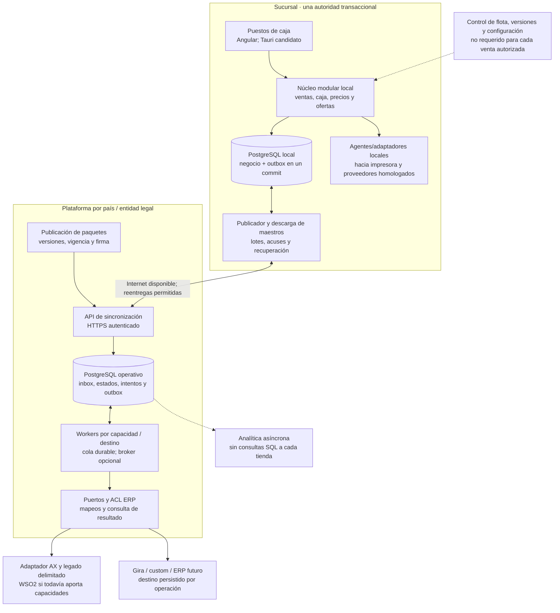

# Revisión crítica de la arquitectura corporativa del POS

**Función de esta revisión:** conservar motivos, alternativas, objeciones y evidencia que sustentan el diseño. La [propuesta y sus ADR](propuesta-arquitectura.md#decisiones-de-arquitectura) son la fuente de la recomendación vigente, todavía por aprobar; esta revisión no mantiene una segunda arquitectura objetivo independiente.

Fecha: 1 de octubre de 2026. Complementa y ajusta la [propuesta de arquitectura](propuesta-arquitectura.md). Se apoya en los ocho repositorios ya analizados, nuevos apuntes operativos y fuentes públicas primarias. **Es una decisión de diseño propuesta, no una implementación ni una aprobación de producción.**

## 1. Recomendación ejecutiva

Preparar un **producto POS común, con núcleo modular autónomo en sucursal, datos transaccionales locales y una plataforma de integración separada del ERP**. El perfil inicial conserva PostgreSQL por sucursal cuando el requisito es tolerar pérdida de Internet. La autonomía de cada terminal ante caída de LAN/servidor es otro perfil y necesita una decisión explícita.

La nueva inversión debe concentrarse en dominio, reglas de ofertas, identidad, contratos, persistencia, recuperación y operación de flota. Esos activos pueden sobrevivir a cambios de ERP, framework y broker. Una ACL ayuda a contener diferencias, pero no convierte una migración de ERP en cambiar una URL.

Recomiendo **sacar progresivamente de WSO2 la responsabilidad de definir el negocio del nuevo POS**. Su retirada física queda condicionada al inventario de contratos y artefactos: hoy también puede mediar protocolos, SQL, transformaciones y procesos que una cola no reemplaza. Mantener capacidades necesarias detrás de adaptadores es una transición válida con criterios de salida; debe cubrir maestros, precios y otros consumidores, además del registro en AX.

La **base preferente para un piloto**, condicionada a pruebas de capacidad y recuperación, es **outbox local → HTTPS por lotes → inbox/registro operativo PostgreSQL central → workers y adaptadores**. Esto no significa hacer SQL remoto desde tiendas. Antes de agregar infraestructura, evaluar capacidades corporativas mantenidas. RabbitMQ es candidato para transporte central cuando se justifiquen consumidores independientes, enrutamiento o aislamiento de cargas; no requiere instalar un broker por sucursal. BullMQ es candidato para trabajos de aplicación, no un sustituto completo de WSO2. La [investigación de mensajería](investigacion-mensajeria-pos.md) compara también su backend PostgreSQL actual y la plataforma Pub/Sub ya presente en `core`.

## 2. Qué cambian los nuevos apuntes

| Antecedente | Estado y consecuencia |
|---|---|
| Sincronización L–V 07:00–22:00; sábado 07:00–16:00 | Regla operativa informada por el usuario. Confirmar zona horaria, domingos, festivos, alcance por flujo y versión desplegada. No confundir horario comercial con disponibilidad técnica requerida. |
| Mantenimiento de bases fuera de horario los sábados | Informado. Precisar qué bases y operaciones se detienen. El código revisado contiene mantenimiento local, pero no acredita el procedimiento productivo completo. |
| Fuera del horario, la tienda no sincroniza | Intención operativa informada cuyo alcance por flujo debe precisarse. El cron inspeccionado permite domingos y existen caminos AMQP/manuales sin esa misma compuerta. |
| Preparar cambio a ERP común, empezando por Chile | Refuerza contratos propios, ACL, identidad histórica y destino persistido por operación. No fija producto ni fecha. |
| Reducir bases/motores | Objetivo razonable de coste operativo; no autoriza a eliminar persistencia necesaria para offline ni a compartir tablas como contrato entre dominios. |
| Expansión de países y sucursales | Requiere alta repetible de tiendas, aislamiento, versiones compatibles y dimensionamiento por carga efectiva. El inventario público no demuestra cantidad de cajas activas. |

El [contraste operativo](contraste-apuntes-operacion-chile.md) y la [revisión de resiliencia y datos](revision-resiliencia-datos-pos.md) preservan evidencia y diferencias. No se probó el horario contra tiendas reales.

## 3. Tres rondas de revisión

| Ronda | Pregunta crítica | Resultado que cambia la propuesta |
|---|---|---|
| 1. Evidencia y responsabilidades | ¿Qué está implementado, qué se informó y qué hace cada producto? | Separar WSO2/Synapse, broker, workers y registro durable; contrastar horario; contar sedes públicas sin inferir TPS. |
| 2. Alternativas y contraejemplos | ¿Qué falla si quitamos una pieza, agregamos una cola o cambiamos el ERP? | Una solución sin broker adicional es posible; centralizar la única base destruye offline; un único motor no implica una única instancia; el corte ERP necesita autoridad y conciliación. |
| 3. Operación y pruebas adversas | ¿Cómo se recupera después de respuesta perdida, backup antiguo, mantenimiento o reconexión masiva? | Criterios de aceptación por invariante, límites por destino, retención que cubra replay y piloto antes de retirar legado. |

Las rondas son revisiones de diseño y evidencia. Los ensayos de fallos descritos son trabajo pendiente; no se han ejecutado sobre un POS nuevo.

## 4. WSO2, RabbitMQ y BullMQ: separar las decisiones

| Responsabilidad | Dónde debe quedar en el objetivo | Qué no debe suponerse |
|---|---|---|
| Reglas de venta, turnos, precios y ofertas | Módulos del núcleo POS; cálculo puro y versionado cuando corresponda | Un broker no calcula promociones ni elimina una llamada online. |
| Traducción de modelos AX/Gira/custom | ACL y adaptadores por capacidad/ERP | Una fachada de nombres nuevos sobre DTO de AX no protege el dominio. |
| Transporte, retención y reparto de mensajes | Protocolo de sincronización y, si aporta valor, broker central | Confirmación del broker no es confirmación del ERP. |
| Reintentos, dependencias y tareas programadas | Workers con estados durables, presupuesto de reintentos y límites por destino | Una cola con reintentos no sabe si el ERP ya produjo el efecto. |
| Registro y consulta del estado de cada operación | Base operativa POS/integración con identidad estable y evidencias | Los logs o la cola no sustituyen al registro auditable. |
| Adaptación SOAP/WCF, JDBC, archivos y transformaciones existentes | Adaptadores específicos; legado delimitado durante transición | RabbitMQ/BullMQ no ejecutan automáticamente los mediadores existentes. |

La decisión no es elegir una marca para todas las filas. El detalle de garantías, límites, versiones y fuentes está en [Mensajería](investigacion-mensajeria-pos.md).

### Selección inicial y condiciones para cambiarla

1. **Tienda:** persistencia y outbox en PostgreSQL; publicador con lotes, checkpoints, límites y reconexión. No agregar Redis/RabbitMQ por defecto a la flota.
2. **Ingreso central:** API con identidad de tienda, control por país/sociedad, acuse después del commit y respuestas por operación. Soportar reentrega parcial del lote.
3. **Despacho central básico:** workers sobre registros durables con concurrencia limitada. Adoptar biblioteca mantenida o un mecanismo acotado; no construir accidentalmente un broker genérico. Antes de adoptarlo, demostrar claims con dueño/vencimiento, transiciones condicionales, orden por agregado, retención, replay y operación de soporte. La expiración de un lease no detiene una llamada externa ya iniciada.
4. **RabbitMQ central:** candidato si las pruebas muestran necesidad de enrutamiento, varios consumidores o separación de cargas. Acordar custodia, retención, alta disponibilidad y equipo operador. Un cluster central dentro de redes estables; no un cluster quorum extendido por WAN entre tiendas.
5. **BullMQ:** evaluar para tareas de aplicación. Redis sigue siendo el backend predeterminado; la documentación actual también ofrece PostgreSQL y lo diferencia del más probado Redis. Compartir una base no demuestra que `Queue.add` participe en el commit de la venta. La outbox se mantiene salvo prueba de atomicidad equivalente. [Backend PostgreSQL de BullMQ](https://docs.bullmq.io/guide/postgresql).
6. **Servicio gestionado existente:** si el POS central puede usar cloud y el equipo ya opera Pub/Sub en `core`, compararlo con introducir RabbitMQ. Incluir cuota, coste, soporte, conectividad on-premise y salida del proveedor. La tienda conserva autonomía sin ese servicio.

No instalar simultáneamente RabbitMQ, Redis/BullMQ y otro bus para el mismo trabajo sin una responsabilidad distinta, un dueño y una medición que lo justifique. Kafka no queda descartado universalmente: requiere una necesidad concreta de log de eventos, replay y consumidores que el alcance actual todavía no demuestra.

## 5. Una base intermedia sí puede ser útil; una copia indiscriminada del ERP no

La base central propuesta es un **registro operativo de integración**: inbox, identidad y hash de eventos, resultado por etapa, intentos externos, destino ERP, referencias remotas, outbox y proyecciones de lectura delimitadas. Puede evolucionar desde el concentrador actual si su esquema, operación y migración lo permiten. No se necesita inventar otra base con tablas AX duplicadas como contrato del POS.

| Persistencia | Recomendación | Condición de retirada o evolución |
|---|---|---|
| PostgreSQL de sucursal | Conservar como candidato preferente en perfil WAN; migraciones y datos por módulo | Revisar disponibilidad y recuperación local; nunca convertirla en caché descartable de ventas pendientes. |
| PostgreSQL central/concentrador | Consolidar funciones compatibles en una plataforma operativa con propietarios claros | Compatibilidad, aislamiento, backup/restore y conciliación; no sumar tablas sin conocer quién las escribe. |
| SQL Server de AX | Mantener mientras AX lo requiera | Depende del programa ERP; no es una base propia del POS que pueda sustituirse unilateralmente. |
| MPOS SQL | Investigar productor, bajas, lotes y consumidores; encapsular el tramo heredado | Retirar solo cuando un publicador validado entregue todas sus capacidades y los consumidores hayan migrado. |
| MongoDB para NC y otros consumidores | Evaluar persistencia relacional para capacidades migradas, conservando autoridad transaccional de reserva/consumo/liberación separada de proyecciones de lectura | Inventario de colecciones y consumidores: también aparecen directorio de sucursales y usuarios. Conciliar saldos, propietarios, índices e históricos. No basta con copiar documentos a JSONB; migrar NC no retira automáticamente todo Mongo. |
| Redis o broker | Agregar únicamente por una necesidad probada | La identidad financiera y los estados recuperables no deben depender solo de una entrada transitoria de caché/cola. |
| Persistencia por terminal | Solo para perfil ampliado aprobado | Añade administración, conflictos y recuperación por dispositivo. SQLite no debe incorporarse simplemente para uniformar la palabra «offline». |

**Menos motores no significa una sola base física.** Offline necesita copias locales; límites de fallo y país pueden necesitar instancias separadas del mismo motor. Una base por módulo tampoco es obligatoria: el monolito modular puede compartir transacción local con tablas/schemas de propietario único. La simplificación se mide en despliegues operables, respaldos, restore y acoplamiento, no únicamente en contar cilindros en un diagrama.

## 6. Arquitectura preferente: perfil WAN con sucursal autónoma

Este diagrama reemplaza como vista principal el perfil por terminal del borrador inicial. La topología ampliada sigue disponible cuando se apruebe ese requisito. Los componentes de pagos/fiscalidad aplican solo capacidades autorizadas y homologadas.



Un centro inaccesible no debe impedir operaciones locales autorizadas. Un servidor de sucursal inaccesible sí detiene esas operaciones en este perfil; se resuelve con el objetivo de recuperación local o con el perfil por terminal, no habilitando un segundo escritor improvisado.

El relay central, el broker opcional y el worker pueden repetir entregas. La escritura de negocio y deduplicación se confirma en la misma transacción de su receptor cuando comparten base. La llamada externa al ERP está fuera de esa transacción: un intento de resultado incierto se consulta y concilia.

## 7. Cómo conservar la inversión al cambiar el ERP

### Fronteras distintas y complementarias

- **Dominio:** venta, turno, pago, devolución y oferta usan conceptos propios del POS. El total histórico no se recalcula con precios nuevos.
- **Puertos:** capacidades precisas, por ejemplo registrar una operación o consultar su resultado por referencia; sin entidades ORM ni códigos AX expuestos al dominio.
- **Fachada:** entrada estable que coordina un caso de uso. No obliga a crear otro microservicio.
- **ACL:** traduce significado, identificadores, estados y errores al modelo de cada ERP; las reglas comerciales comunes siguen en el dominio. Una ACL puede ser un módulo o un servicio cuando la operación lo justifique. [Patrón ACL, Microsoft](https://learn.microsoft.com/en-us/azure/architecture/patterns/anti-corruption-layer).

Los contratos deben modelar capacidades ausentes: si un ERP no admite idempotencia, consulta por referencia, reserva o reversa, el adaptador lo declara. No simula éxito para ofrecer una falsa interfaz uniforme.

### Invariantes del corte

| Caso | Regla propuesta |
|---|---|
| Venta ya asignada o posiblemente registrada en AX | Conservar su destino persistido. Un cambio global de configuración no la reenvía a otro ERP. |
| Venta offline anterior al corte que llega después | Resolver con fase de autoridad y referencias; el reloj de la caja no determina por sí solo el destino. |
| Devolución/pago/NC de una venta histórica | Conservar referencia y ERP de origen; el nuevo efecto sigue la política acordada por sociedad y fase. |
| Lectura en paralelo | Comparar mapeos y resultados sin generar doble contabilización. No habilitar escrituras en ambos ERPs por defecto. |
| Rollback | Detener el cambio de autoridad, conciliar efectos producidos y decidir destino de pendientes; no restaurar ciegamente una configuración vieja. |
| Retirada del legado | Sin consumidores activos, pendientes resueltos, maestros equivalentes, históricos accesibles y reversión ensayada. |

Se propone migración incremental por capacidad/sucursal/país donde el programa ERP permita esos cortes. La fachada de transición también necesita capacidad, disponibilidad y fecha/criterio de retirada; no debe convertirse en otra dependencia permanente sin propietario. [Strangler Fig, Microsoft](https://learn.microsoft.com/en-us/azure/architecture/patterns/strangler-fig).

### Ejemplo mínimo de metadatos

```text
operation_id, event_id, event_type, schema_version, payload_hash
country_id, legal_entity_id, branch_id, register_id
business_date, captured_at_utc, timezone_id
authority_epoch, aggregate_id, aggregate_version
target_binding_id, target_erp, mapping_version
local_status, central_status, fiscal_status, payment_status, erp_status
```

Son campos conceptuales, no el esquema definitivo. La identidad de intento externo puede diferir de la identidad de venta; dos pagos parciales no se deduplican como si fueran el mismo cobro. Un mismo ID con otro contenido debe rechazarse y dejar evidencia. La retención de esa evidencia cubre replay, backups y desconexión acordados.

**Custodia y desastre central:** un ACK no autoriza a borrar inmediatamente toda copia de origen. Si central restaura a un punto anterior al ACK, puede perder tanto el mensaje como su deduplicación mientras ERP ya produjo el efecto. Acordar conservación local/archivo independiente, detección de huecos, reconstrucción y consulta de resultados externos antes de purgar. Ensayar este caso y aceptar explícitamente cualquier RPO residual; no declarar recuperación por el solo hecho de tener backups.

### Extender la frontera a proveedores y dispositivos

El requisito posterior de variar facturadores, aplicaciones de impresión, impresoras y terminales por país/sucursal amplía esta misma protección. Se proponen puertos de pago, fiscalidad e impresión, adaptadores por integración y perfiles locales versionados por entidad/sucursal/caja. ACL se reserva para diferencias semánticas; adaptar un driver no obliga a crear otra capa ni otro servicio. Los contratos declaran capacidades y restricciones sin simular uniformidad entre equipos.

El cambio de perfil aplica a operaciones nuevas. Un cobro o documento con resultado incierto conserva proveedor, cuenta/emisor y referencia original; se consulta o concilia antes de repetir efectos. El [diseño de extensibilidad](extensibilidad-proveedores-dispositivos.md) define los límites de «plug-and-play», agentes locales, compatibilidad y pruebas. Es un requisito y diseño propuesto; no acredita soporte de modelos concretos.

## 8. Horarios y mantenimiento como política de capacidad

Propuesta: modelar por separado **captura local**, **recepción durable central**, **aplicación de maestros**, **publicación al ERP**, **fiscalidad** y **mantenimiento**. El horario de AX no se convierte automáticamente en el horario del POS completo.

Si negocio/operaciones autorizan ese alcance y la infraestructura lo permite, recibir duraderamente en el centro fuera de la ventana ERP reduce datos únicamente locales. Es una propuesta nueva, no la política actual confirmada. El worker de AX espera mientras el ERP está cerrado o en mantenimiento. Si el centro también está detenido, la outbox de tienda retiene pendientes dentro de su capacidad. Ambas situaciones se ven distintas en soporte.

Un mantenimiento debe detener admisión de trabajo incompatible, drenar lo que está en ejecución con un límite, registrar checkpoints y recién entonces modificar la base. «Apagar el cron» no detiene un consumidor AMQP ni un trabajo largo ya iniciado. Si se mantiene recepción durante mantenimiento, debe existir otro almacenamiento durable autorizado; no confirmar datos que solo están en memoria.

Guardar timestamps en UTC, la fecha de negocio y zona IANA configurada por sucursal. Horarios laborales, festivos, mantenimiento y excepciones son configuración versionada y auditable. No usar una única zona de Chile para todos los países. El cierre de sesión del navegador tampoco debe activar o desactivar sincronización.

**Ejemplo condicionado:** si no hay sincronización dominical ni excepciones, desde sábado 16:00 hasta lunes 07:00 hay 39 horas de reloj civil sin ventana. El tiempo transcurrido real se calcula con fechas y zona IANA, porque un cambio de offset puede alterarlo. No son 39 horas de ventas continuas: el backlog depende de operaciones y trabajos efectivamente generados durante el intervalo. El objetivo inicial de 72 horas sigue siendo una hipótesis, no se deduce de este calendario.

## 9. Escala corporativa: qué tomar de las prácticas públicas

Amazon documenta contratos idempotentes para reintentos seguros. Google SRE trata cuotas, saturación y degradación frente a sobrecarga. Shopify Engineering describe correlación, estados de intentos y conciliación de pagos. Son referencias primarias de prácticas concretas; no prueban que exista una arquitectura POS universal de «las bigtech». [Amazon: idempotencia](https://aws.amazon.com/builders-library/making-retries-safe-with-idempotent-APIs/), [Google: sobrecarga](https://sre.google/sre-book/handling-overload/), [Shopify: resiliencia de pagos](https://shopify.engineering/building-resilient-payment-systems).

Aplicación propuesta a Implementos:

1. **Producto común, configuración local.** Mismos contratos, artefactos y módulos compartidos; extensiones de país versionadas. Evitar forks completos por país y un `if país` disperso por todo el negocio.
2. **Separación de fallos.** Límites de concurrencia, conexiones, almacenamiento y reintentos por país/destino. Una caída de AX no debe agotar recursos de Gira. La separación lógica no protege de la caída de un cluster físico compartido: documentar ese riesgo y aislar físicamente cuando el objetivo lo exija.
3. **Flota administrada.** Alta con IDs propios, certificado del dispositivo, configuración firmada, bootstrap verificable y pruebas de periféricos. No clonar una base con ventas, IDs o credenciales de otra sucursal.
4. **Actualizaciones graduales.** Anillos de despliegue, contratos compatibles con cajas atrasadas, migraciones expandir/contraer, rollback ensayado y bloqueo de versiones incompatibles. El plano de control caído no paraliza una caja con autorización/configuración vigentes.
5. **Carga protegida.** Reanudar tiendas con dispersión temporal, presupuestos y cuotas. Separar trabajo nuevo, maestros, conciliación y backlog; garantizar progreso justo en lugar de una cola global que sature AX a las 07:00. Preservar dependencias por agregado y evitar que priorizar novedades deje pendientes antiguos sin avance.
6. **Operación por transacción.** Soporte ve qué etapa falta, antigüedad, importe pendiente por moneda/sociedad y quién resuelve; no sumar CLP, PEN y EUR como un único saldo. Logs correlacionados ayudan, pero no sustituyen ese estado durable.

### Dimensionar con datos; no con cantidad de logos en el diagrama

Al 01-10-2026, los directorios oficiales tienen **46 entradas publicadas: [Chile 31](https://www.implementos.cl/sitio/tiendas), [Perú 12](https://www.implementos.com.pe/sitio/tiendas) y [España 3](https://www.implementos.eu/sitio/tiendas)**. El [inventario público de sucursales](cobertura-publica-sucursales.md) conserva método y nombres; es una referencia de cobertura, no un inventario productivo del POS. Faltan cajas por tienda, concurrencia, operaciones, mensajes, tamaño y capacidad por destino.

Para un destino y horizonte concretos:

```text
B = mensajes pendientes acumulados durante la indisponibilidad o pausa
lambda = tasa de nuevos mensajes elegibles que llegan mientras recuperamos
mu = tasa efectiva sostenible de confirmación por ese destino
tiempo mínimo de drenaje ≈ B / (mu - lambda), solo si mu > lambda
```

Es una aproximación estacionaria: `lambda` y `mu` deben expresarse en la misma unidad —por ejemplo, mensajes elegibles y confirmaciones útiles por segundo—, sin confundirlas con tickets vendidos. El resultado representa tiempo de procesamiento disponible; el tiempo calendario añade ventanas cerradas y variabilidad. Si `mu <= lambda`, ningún broker hace desaparecer el atraso: debe aumentar capacidad efectiva, reducir carga autorizada o ampliar la ventana. El coste de una venta depende de sus líneas, documentos y llamadas externas; el rendimiento se mide por clase de trabajo y recurso limitante. Probar ventanas de 1×, 3× y 10× la carga medida es una propuesta de ensayo, no una proyección de ventas ni una garantía.

## 10. Qué entra, qué cambia y qué puede salir

| Tratamiento | Elementos | Evidencia de aceptación |
|---|---|---|
| Conservar y evolucionar | Persistencia local, separación sucursal/central, UX conocida, agentes homologables, adaptadores .NET útiles | Contratos, soporte y pruebas en hardware real. |
| Incorporar | Motor local de ofertas, outbox/inbox, estados de efectos externos, registro de integración, ACL, identidad de flota, conciliación | Recuperación demostrada ante cortes, duplicados, disco lleno y respuesta externa perdida. |
| Simplificar | Estados ambiguos, consultas de NC contra muchas tiendas, múltiples copias sin dueño, frameworks duplicados sin justificación | Equivalencia funcional, medición de coste/operación y saldos reconciliados. |
| Retirar gradualmente | Mediaciones WSO2 migradas, concentradores redundantes, MPOS/Mongo si pierden consumidores, configuraciones residuales de Instacheck | Inventario cerrado, consumidores migrados, pendientes drenados, históricos conservados y rollback. |
| Condicionar a evidencia | RabbitMQ/BullMQ, motor por terminal, microservicios adicionales, Kafka, multi-región activa | Necesidad concreta, coste operativo sostenible, benchmark y prueba de fallo. |

## 11. Decisión y validación siguientes

Antes del piloto, cerrar: perfil offline, política de ventas por país, responsabilidad de maestros/NC/reservas, contratos y artefactos WSO2, topología de mantenimiento, permisos cloud, capacidad ERP y soporte de flota. La [solicitud al equipo](solicitud-informacion-equipo.md) incluye el paquete de evidencia.

El piloto debe demostrar integridad y recuperación en una sucursal representativa. Para retirar WSO2 o una base, además de comparar resultados exitosos, probar pérdida de acuse, entrega parcial, duplicados, orden causal, pendientes del ERP anterior y rollback. Los [casos adversos](revision-resiliencia-datos-pos.md) y las [validaciones](validacion-y-decisiones.md) son criterios de aceptación, no resultados ya obtenidos.

No se reemplazaron servicios, bases ni integraciones corporativas durante esta investigación. Se actualizan únicamente los artefactos de propuesta y formación.

## 12. Cambios provocados por la revisión adversarial

| Objeción detectada en la segunda ronda | Resolución incorporada |
|---|---|
| PostgreSQL + HTTP se describía como suficiente sin ensayo. | Se limita a base preferente de piloto y se agregan condiciones de operación, claims y carga. |
| Mongo/NC se reducía a proyección de lectura. | Se preserva explícitamente autoridad monetaria y se incluyen otros consumidores antes de retirar el motor. |
| Reducir WSO2 al conector de alta AX omitía otras capacidades. | Retirada por capacidad con inventario de maestros, precios, DSS y consumidores. |
| El horario se trataba como regla de todas las rutas. | Separar política informada, código y alcance por flujo; domingo y excepciones pendientes. |
| 39 horas civiles se confundían con duración transcurrida. | Cálculo condicionado a calendario, fechas y zona IANA. |
| ACK central parecía suficiente para purgar origen. | Añadida recuperación ante pérdida del estado central y deduplicación tras restore. |
| Cantidad de sedes podía parecer dimensionamiento. | Cifras públicas diferenciadas de cajas, carga y capacidad efectiva de ERP. |

La tercera ronda verifica coherencia documental y convierte estas objeciones en criterios de aceptación. No declara aprobados los productos ni superadas las pruebas productivas.

## 13. Ampliación posterior: inteligencia artificial opcional

La [evaluación de servicios de IA](servicios-ia-pos.md) incorpora asistencia de procedimientos, búsqueda de catálogo, OCR, explicación de pendientes, recomendaciones, analítica y diagnóstico operativo. Procedimientos y catálogo son pilotos candidatos sujetos a datos curados y beneficio medido contra las alternativas convencionales. El alcance no asigna stock a la caja ni convierte modelos en autoridades de precios, pagos, fiscalidad o compatibilidad de repuestos.

Se mantiene un núcleo determinista que opera sin IA. El módulo de asistencia recupera únicamente datos autorizados mediante contratos de lectura, usa proveedores detrás de adaptadores y conserva versiones y fuentes. Offline dispone de alternativas convencionales; la inferencia local queda condicionada a pruebas de hardware y licencia. Cloud, retención, recursos, coste y calidad se aprueban por capacidad. Un piloto de IA no sustituye las pruebas de integridad del POS ni es requisito para completar su migración.

## 14. Ampliación posterior: RFID y posibles cajas de autoservicio

El usuario plantea RFID como oportunidad ante el crecimiento, inspirada en Decathlon y en conteos más rápidos. El [diseño de evolución](evolucion-rfid-autoservicio.md) distingue etiquetado en la cadena, captura de artículos para caja, observaciones de inventario y autoservicio. El núcleo común consume una cesta revisada, independiente de cómo se leyó el producto; el dueño de inventario conserva sus ajustes. RFID no cambia por sí solo la autoridad de datos ni confirma una venta o un pago.

Se reutilizan contratos, perfiles de capacidades y agentes para encapsular lectores y SDK. Antes de extender: validar identidad/unidad de empaque, materiales y radio, zonas de lectura, sesiones, datos locales, mezcla con código de barras, recuperación y costes. Una etiqueta repetida no suma unidades; dos instancias válidas del mismo SKU sí pueden hacerlo. Los casos de excepción deben ser visibles y el piloto debe medir el proceso completo, incluida la corrección manual. Autoservicio y extensión a nuevos países requieren decisiones y homologación propias.

## Evidencia central recibida el 2 de octubre

La [auditoría de mountain-concentrador](analisis-repositorios/mountain-concentrador.md) identifica ahora APIs Synapse, DSS, mediadores Java, api-lectura y consumidor Node. Esto concreta el inventario previo a sustituir WSO2: separar transporte, transformación, generación de lotes, persistencia, estados y adaptación AX. RabbitMQ/BullMQ no sustituyen ese conjunto por sí solos. El origen AX→MPOS y la configuración instalada siguen pendientes.
