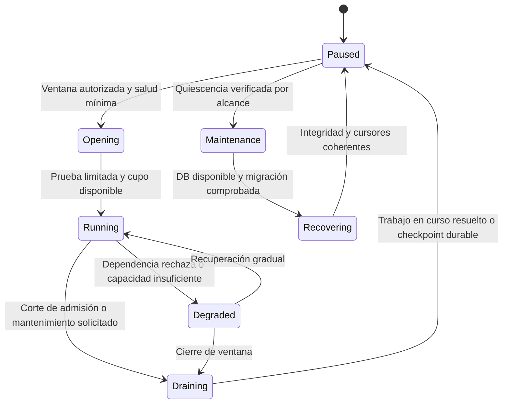

# Revisión crítica: ventanas de sincronización, resiliencia y datos del POS

**Estado:** análisis y propuesta para discusión; no es una configuración aprobada ni una validación productiva. Fecha: 1 de octubre de 2026. Revisión estática de documentos y código, junto con fuentes primarias de arquitectura. No se ejecutaron servicios corporativos, SQL, migraciones ni mantenimiento.

La nueva información sobre horarios cambia el problema: no basta con poder almacenar ventas offline. Debemos demostrar que los pendientes sobreviven a cierres programados, mantenimiento, reinicios y reenvíos, y que pueden recuperarse sin saturar al ERP cuando se abre la siguiente ventana.

En este documento **hecho observado** significa lectura de un commit concreto; **informado** significa antecedente del usuario; **inferencia** es una consecuencia condicionada de esas evidencias; **propuesta** identifica un diseño todavía por acordar. Ninguno de estos términos acredita por sí solo el comportamiento productivo.

## 1. Qué cambia con el horario informado

| Aspecto | Antecedente y evidencia | Conclusión admisible |
| --- | --- | --- |
| Calendario informado | Lunes a viernes 07:00–22:00; sábado 07:00–16:00; fuera de horario no se sincroniza. El sábado, fuera de horario, se mantienen las DB. | **Informado.** Debe precisar zona, excepciones, qué flujos se detienen y si el cierre es de admisión o de toda actividad. |
| Calendario del commit | `isAllowedTimeDia()` trata el sábado por separado y admite 07:00–22:00 en todos los demás días, incluido domingo. | **Hecho observado.** Diverge del calendario informado; no concluir que producción sincroniza los domingos. [Cron del sincronizador](https://github.com/developer-implementos/mountain-sync-sucursal/blob/540ab9a70e7befbca27a2f7eb88b87b25109e4d1/start/cronHooks.js#L26-L50). |
| Configuración de hora | Los cron declaran `America/Santiago`; las comprobaciones usan `new Date().getHours()/getDay()`. | **Hecho observado.** Deben verificarse TZ/SO/runtime: el huso del disparador no demuestra el huso de la comprobación. [Análisis, calendario](analisis-repositorios/mountain-sync-sucursal.md#4-calendario-y-reintentos-reales-del-código). |
| Otros puntos de entrada | AMQP se conecta/consume sin consultar esa ventana; existen rutas HTTP operativas y caminos recursivos sin esa misma comprobación. | **Hecho observado.** Detener cron no establece silencio de escritura ni quiescencia. [Consumidor](https://github.com/developer-implementos/mountain-sync-sucursal/blob/540ab9a70e7befbca27a2f7eb88b87b25109e4d1/start/queueHooks.js#L26-L130), [rutas](https://github.com/developer-implementos/mountain-sync-sucursal/blob/540ab9a70e7befbca27a2f7eb88b87b25109e4d1/start/routes.js#L20-L34). |
| Trabajo en curso | La ventana se comprueba al entrar al cron, no antes de cada efecto. | **Inferencia:** un trabajo iniciado antes del cierre puede seguir después, con duración dependiente de datos y red. El cierre horario no cancela de forma segura un efecto ya enviado. |
| Mantenimiento del commit | Cada diez minutos del sábado, entre 16:30 y 23:00, ejecuta limpieza y `VACUUM ANALYZE` + `REINDEX TABLE` de tablas del sincronizador. | **Hecho observado.** No prueba qué DB se mantienen realmente ni que ese procedimiento deba conservarse. [Cron y mantenimiento](https://github.com/developer-implementos/mountain-sync-sucursal/blob/540ab9a70e7befbca27a2f7eb88b87b25109e4d1/start/cronHooks.js#L146-L217). |

La referencia principal anterior sigue siendo `master` **540ab9a70e7befbca27a2f7eb88b87b25109e4d1**; su despliegue no está confirmado. El checkout local es otra rama. Esta revisión leyó el commit con `git show`, sin cambiar el código. Los conflictos entre presentación, apuntes y repositorio deben convertirse en preguntas verificables, no resolverse escogiendo silenciosamente una fuente.

**Inferencia de capacidad:** si el domingo está cerrado, desde sábado 16:00 hasta lunes 07:00 hay 39 horas civiles sin ventana; el tiempo transcurrido real debe calcularse con la zona y sus cambios de offset. En una semana sin cambios de reloj ni festivos, las ventanas informadas suman 84 horas. Esto describe el calendario, no la disponibilidad del POS ni una garantía de sincronización. Tampoco significa que durante todo ese cierre se generen ventas: hace falta medir producción de pendientes por origen.

## 2. Objeciones a la propuesta existente

La [propuesta de arquitectura](propuesta-arquitectura.md) ya incluía identidad, outbox/inbox, separación de estados, reintentos y conciliación. La tabla registra objeciones al borrador previo a esta ronda. La [síntesis corporativa](revision-arquitectura-corporativa.md#12-cambios-provocados-por-la-revisión-adversarial) y la propuesta principal incorporan las correcciones documentales, incluido el diagrama preferente WAN. Los criterios de cierre operativo siguen pendientes: corregir una descripción no equivale a implementar o probar la solución.

| Prioridad | Brecha o tensión | Cambio propuesto y criterio de cierre |
| --- | --- | --- |
| Alta | Se recomienda primero sucursal + PostgreSQL para caída WAN, pero el diagrama principal desarrolla persistencia por terminal. | Hacer del perfil WAN el diagrama de referencia inicial. Presentar el aislamiento de terminal como variante con coste, autoridad y pruebas adicionales; elegirlo solo con requisito explícito. |
| Alta | “72 horas offline” aparece como hipótesis sin distribución de caídas, volumen ni capacidad. | Mantenerlo únicamente como escenario de ensayo identificado. Dimensionar cada tienda por tasa real, espacio, vigencia de reglas y horizonte de recuperación; no convertir 72 horas en política comercial. |
| Alta | Al menos una vez + inbox protege efectos transaccionales locales, pero puede interpretarse como protección de todo efecto ERP. | Expresar por contrato qué destino garantiza unicidad, cómo consulta resultados y qué ocurre tras timeout. Sin esa capacidad, suspender el reenvío ciego y conciliar. |
| Alta | No hay una máquina de estados para cierre, drenaje, mantenimiento y reapertura. | Una política común gobierna cron, AMQP, API manual y replays; el mantenimiento tiene evidencia de quiescencia y recuperación. |
| Alta | Cola durable y reintentos se describen sin presupuesto de backlog ni recuperación. | Medir producción, capacidad segura del cuello de botella, edad de pendientes y duración restante de ventana. Aprobar una prueba de recuperación con tráfico nuevo simultáneo. |
| Alta | “Maestros versionados” no resuelve por sí mismo competencia entre lote y refresco por RUT. | Definir versión de origen, dueño por atributo y activación de snapshots. Un lote viejo no sobreescribe una ficha más nueva ni un cambio local pendiente. |
| Media | Se preserva la diversidad de motores sin un plan explícito de permanencia/salida por responsabilidad. | PostgreSQL como candidato para datos POS nuevos; SQL Server y Mongo permanecen donde sus consumidores lo requieren hasta demostrar una migración. Reducir motores es un resultado posible, no una meta que justifique pérdida semántica. |
| Media | El retiro de la ACL legacy y los plazos de compatibilidad no tienen condición verificable. | Retirar por capability cuando no queden dependencias, pendientes ni obligaciones de consulta/respuesta tardía; no por la fecha del nuevo ERP. |
| Media | El aislamiento por país se presenta fuerte, pero no tiene topología ni análisis de fallo/coste. | Separar credenciales, datos, colas y límites lógicos como mínimo; decidir separación física con carga, riesgos y capacidad del equipo. No construir tres plataformas divergentes sin necesidad. |

La revisión de Amazon sobre backlogs advierte que una cola puede prolongar mucho la recuperación aunque conserve mensajes. La recomendación aplicable aquí es medir atraso y capacidad del consumidor, no solo éxito de publicación. No implica adoptar un servicio de AWS. [Amazon Builders’ Library: backlogs](https://d1.awsstatic.com/builderslibrary/pdfs/avoiding-insurmountable-queue-backlogs.pdf).

## 3. Política por flujo, no un único interruptor

**Propuesta:** distinguir captura de negocio, almacenamiento durable de transporte y aplicación de efectos. La frase “fuera de horario no sincroniza” se conserva como antecedente; la tabla siguiente es una política a acordar y no afirma excepciones autorizadas.

| Flujo | Durante ventana | Cierre ordinario propuesto | Mantenimiento que afecta su DB |
| --- | --- | --- | --- |
| Venta local habilitada por negocio | Commit de venta e intención/eventos según estado del pago y fiscalidad. | Independiente del horario de integración si la tienda puede operar; los eventos quedan pendientes. | Si el escritor local no está disponible, detener nuevas operaciones que lo requieren. No activar otro escritor implícito. |
| Publicación de outbox de sucursal | Reclamar lotes acotados, enviar con identidad estable y confirmar tras ACK durable. | No admitir nuevos lotes después del corte de admisión; terminar o recuperar los ya admitidos dentro del presupuesto. | Pausar publicadores afectados y persistir su progreso antes de la intervención. |
| Recepción AMQP/resultados | Persistir inbox antes del ACK. Aplicar por política del flujo. | Puede separarse recepción de aplicación **solo si el equipo autoriza recepción durable fuera de ventana**. Si no, pausar consumidor y conservar en origen/broker. | No dar ACK si la DB receptora no puede confirmar. Cancelar consumo y dejar que opere la redelivery acordada. |
| Bajada y activación de maestros | Descargar a staging, validar integridad, activar una versión completa. | No iniciar descarga/activación que exceda el presupuesto; conservar staging y versión activa anterior. | Suspender activación y no eliminar staging necesario para recuperar. |
| Registro de venta/pago/NC en ERP | Worker por destino con contrato de efecto y resultado. | Respetar la ventana del ERP; no enviar operaciones nuevas durante cierre. Resolver resultados inciertos antes de otro intento. | Aislar el destino afectado sin detener colas de otros países. |
| Consulta individual de cliente/precio | Lectura local cuando esté autorizada; refresco remoto como flujo diferenciado. | Definir si la restricción afecta también estas consultas. No depender del cron para bloquearlas. | Mostrar indisponibilidad o dato con frescura explícita; nunca convertir error en “cliente no existe” o autorización de crédito. |
| Conciliación | Comparar evidencia local, central y destino por alcance definido. | Puede requerir ventana propia acordada. No ejecutar reparaciones monetarias por leer una diferencia. | Lectura de una réplica consistente o suspensión explícita; los checks no compiten sin límite con mantenimiento. |
| Fiscalidad y medios de pago | Políticas y contratos propios. | No heredar automáticamente el horario ERP ni crear una excepción fiscal supuesta. | Responsable del flujo decide continuidad/contingencia con evidencia de proveedor; este informe no evalúa regulación. |
| API manual, soporte y replay | Mismo control de admisión, identidad, permisos y trazabilidad. | Sin bypass por ruta manual. Excepción temporal explícita, con alcance y registro, si se autoriza. | Rechazar inicio de trabajo de integración y responder cuándo/política impide ejecutarlo. |

No hace falta un servicio distribuido nuevo para esta política. Puede ser un módulo de configuración y admisión compartido por los workers, con una copia local versionada para seguir funcionando cuando el plano de control no esté disponible. La configuración necesita vigencia, firma o integridad verificable, responsable y política conservadora cuando no sea válida.

### Estados y cierre seguro

Protocolo propuesto:

1. **Admisión:** aceptar trabajo solo si coinciden ventana, calendario de mantenimiento, política de destino, permiso y capacidad. Usar intervalos semiabiertos `[apertura, cierre)`. Una decisión guarda `policyVersion` y `windowOccurrenceId`.
2. **Corte de admisión:** si el cierre debe ser estricto, dejar de reclamar antes del cierre, usando un `drainBudget` medido. No elegir arbitrariamente treinta minutos porque el cron de mantenimiento empieza a las 16:30.
3. **Drenaje:** esperar el trabajo finito en curso; limitar tamaño de lote, tiempo de HTTP, transacción y lock. No exigir “cola vacía”: un ERP caído puede impedirlo indefinidamente.
4. **Checkpoint:** guardar identidad del lote, elementos confirmados individualmente, pendientes, reintentos, cursores y versión de destino. Un cursor avanza solo sobre datos durables/aplicados conforme a su semántica; distinguir `receivedThrough` de `appliedThrough` y registrar huecos.
5. **Resultado incierto:** una llamada externa iniciada puede haber aplicado el efecto después del timeout o cierre. Persistir `outcome_unknown`; no marcarla fallida, descartarla ni volver a contabilizarla automáticamente.
6. **Quiescencia:** verificar que no quedan transacciones/claims que puedan escribir en el recurso a intervenir, incluyendo receptores, soporte y jobs externos. Si el plazo expira, abortar o replanificar mantenimiento; un kill no es un certificado de ausencia de efectos.
7. **Reinicio:** reconstruir desde estados durables. Claims con lease requieren nueva generación/fencing y escritura condicional. Un token local no puede impedir un POST antiguo ya enviado: esa frontera necesita el contrato de idempotencia del receptor o conciliación.
8. **Reapertura:** probar salud de dependencias con tráfico limitado, recuperar primero bloqueos de datos y aumentar caudal según presupuesto. Que HTTP responda no demuestra que una escritura y su resultado sean recuperables.

La política de mantenimiento debe indicar si interviene una tabla, una base, un host compartido o un sistema externo. Apagar “todo el POS” para cualquier mantenimiento desperdicia el aislamiento; mantener una ruta de escritura oculta invalida la seguridad del mantenimiento.

## 4. Tiempo, calendarios y reintentos

**Propuesta de tiempo:** almacenar instantes en UTC y conservar zona IANA de la sucursal, fecha comercial y versión de la política. El calendario se evalúa desde un instante capturado una vez, convertido explícitamente a la zona correspondiente. La fecha del servidor no decide por defecto la fecha contable ni el periodo de un pago atrasado.

No usar un offset fijo ni un único huso por país. La tabla de IANA incluye `America/Santiago`, `America/Coyhaique`, `America/Punta_Arenas` y `Pacific/Easter` para Chile; `America/Lima` para Perú; `Europe/Madrid`, `Africa/Ceuta` y `Atlantic/Canary` para España. Elegir según sucursales reales, no desplegar todas por anticipado. Las reglas IANA cambian; registrar y actualizar la versión distribuida. [IANA: zonas](https://data.iana.org/time-zones/tzdb/zone1970.tab), [IANA: mantenimiento de la base temporal](https://www.iana.org/time-zones).

| Situación temporal | Política propuesta |
| --- | --- |
| Hora repetida por cambio de offset | Una ocurrencia de ventana tiene identidad estable; no ejecutar dos veces el mismo trabajo porque se repitió la hora civil. |
| Hora local inexistente | Definir explícitamente el ajuste o la omisión de esa ocurrencia al validar el calendario. Rechazar configuraciones ambiguas; no aceptar silenciosamente el comportamiento de una librería. |
| Reloj atrasado por NTP o intervención | Orden por secuencia/versión de agregado. Usar tiempo monotónico para una espera activa y volver a validar calendario antes de admitir efecto. |
| Reinicio durante backoff | Persistir `nextAttemptAt` como instante, intento y motivo. Recalcular si sigue habilitado al arrancar; no resetear todos los intentos al mismo segundo. |
| Festivo o cambio excepcional | Calendario versionado por sucursal/destino, precedencia explícita de excepciones y mantenimiento. Un cambio de configuración no modifica silenciosamente el historial de decisiones. |
| Reintento listo fuera de ventana | Diferir a la próxima oportunidad autorizada, con dispersión y nuevo control de capacidad. No descontar un intento por estar cerrado. |

Amazon describe la amplificación que producen reintentos en varias capas y la utilidad del backoff y jitter, también en trabajo periódico. Para este POS se propone **un dueño del reintento por frontera**, presupuesto separado de intentos nuevos, límite de concurrencia y dispersión de la reapertura por sucursal. Los errores se clasifican según el contrato concreto, no solo por el primer dígito del estado HTTP. [Amazon Builders’ Library: timeouts, retries and jitter](https://d1.awsstatic.com/builderslibrary/pdfs/timeouts-retries-and-backoff-with-jitter.pdf).

Una formulación candidata es `delay = uniforme(0, min(cap, base × 2^attempt))`; el instante elegible posterior se ajusta a la próxima ventana sin concentrar a todas las tiendas a las 07:00. La dispersión de trabajos periódicos puede derivarse de tienda/flujo para ser reproducible. `base`, `cap`, cupos y plazo de atención se obtienen de medición; no son valores prefijados en esta propuesta.

## 5. Datos: simplificar sin perder responsabilidades

| Motor/ámbito | Base conocida | Dirección propuesta | Condición de retiro o migración |
| --- | --- | --- | --- |
| PostgreSQL de sucursal | Venta, pagos, maestros y datos del sincronizador en Chile. | Conservar como candidato para perfil WAN. Transacciones de negocio/outbox; staging versionado de maestros; migrations y backup/restore reproducibles. | No sustituirlo solo por cambiar frontend o framework. Una variante por terminal es otra decisión de continuidad. |
| PostgreSQL concentrador/central | Componente existente en las fuentes del proyecto. Topología, versiones y DDL completos pendientes. | Modelo operativo POS con inbox, registros de integración, proyecciones y conciliación. Dueño por módulo, sin tablas compartidas de escritura libre. | Migrar consumidores y demostrar equivalencia antes de cambiar nombres o consolidar bases. |
| SQL Server AX | Motor asociado al ERP y sus tablas de integración legacy. | Mantener detrás del adaptador AX y con permisos acotados. Evitar que el producto POS adopte su esquema como contrato. | Depende del programa ERP y de consultas históricas, pendientes y documentos derivados; no retirarlo al terminar solo la UI nueva. |
| MPOS SQL | Base/tablas de intercambio informadas; motor exacto, DDL, productor y ubicación aún sin corroboración suficiente. | Inventariar como frontera legacy separada. Identificar marcas de cambio y origen antes de decidir polling, exportación incremental o CDC. | Sustituir su responsabilidad completa y probar todos los consumidores. No borrar por asumir que replica AX sin lógica propia. |
| MongoDB de NC y otros consumidores | La API de pagos usa estado NC, directorio de sucursales/conexiones y usuarios AX; existen además dependencias Mongo en precios/integraciones. | Evaluar mover responsabilidades POS nuevas a PostgreSQL donde haya beneficio real. Hasta entonces, proteger reserva/consumo/liberación y propietarios mediante contrato. | Retiro **condicionado** al inventario de colecciones, consumidores, índices y semántica; conciliación, histórico y operación migrados. “Migrar NC” no demuestra que todo Mongo sea prescindible. |

La evidencia sobre el papel de Mongo y el acceso a PostgreSQL de varias sucursales está en [API de pagos, PAG-01 y PAG-04](analisis-repositorios/api-pagos-caja.md). El papel informado de MPOS se conserva con su incertidumbre en [apuntes de Chile](contraste-apuntes-operacion-chile.md). No confundir “tres motores” con “tres bases físicas” ni “base SQL MPOS” con motor confirmado.

**Propuesta para NC:** una proyección central de saldos no autoriza por sí sola el gasto. La autoridad de reserva necesita transiciones atómicas, identidad de documento compuesta, importe/moneda, propietario, versión y reglas de vencimiento. No liberar por timeout de red una reserva cuyo consumo pueda haberse aplicado. Si dos sucursales aisladas pueden consumir el mismo saldo, se necesita una asignación exclusiva previa o una restricción explícita. Mover esa colección a PostgreSQL sin cambiar el protocolo preservaría el riesgo.

**Propuesta para naming:** acordar glosario, propietario de cada escritura y convenciones para schemas/tablas/código; elegir una sola convención para objetos nuevos del POS y aplicarla por migraciones versionadas. Conservar los nombres legacy en su adaptador. No renombrar tablas AX ni tablas POS usadas por SQL externo antes de inventariar esos consumidores. El problema de `sincronizado` es semántico antes que ortográfico.

### Mantenimiento de PostgreSQL

PostgreSQL documenta que `REINDEX` normal bloquea escrituras y puede bloquear consultas por los locks de índices. `REINDEX CONCURRENTLY` reduce el bloqueo de escritura, pero requiere más trabajo y tiene restricciones. Ninguna variante debe copiarse sin comprobar versión, tablas, espacio y carga. [Documentación de REINDEX](https://www.postgresql.org/docs/current/sql-reindex.html).

La documentación recomienda mantenimiento rutinario mediante vacuum/autovacuum y explica su papel en recuperación de espacio, estadísticas y prevención de wraparound. Por tanto, **propuesta:** mantener autovacuum operativamente supervisado; no interpretar “mantenimiento los sábados” como permiso para desactivarlo el resto de la semana. Un calendario de reconstrucciones requiere una causa medida. [PostgreSQL: routine vacuuming](https://www.postgresql.org/docs/current/routine-vacuuming.html).

Para el objetivo, el job del sábado debe tener alcance, exclusión, tiempos máximos, detección de bloqueo, espacio de reserva, resultado durable y procedimiento de fallo. No conservar como estándar una ejecución de `REINDEX` cada diez minutos por mera existencia en legacy. La comparación entre duración del trabajo y frecuencia también debe probarse: locks mal asociados a sesiones de pool pueden permitir solapamientos o impedir liberaciones.

### Durabilidad y recuperación no son la misma garantía

**Propuesta:** definir RPO y RTO por ámbito y fallo: proceso, host de sucursal, disco, central y desastre del sitio. Un commit local confirmado no garantiza recuperar una venta si el único disco se destruye mientras está aislado. Un ACK central tampoco garantiza recuperar desde un backup anterior a ese ACK. No se promete RPO cero global durante aislamiento.

La restauración central puede hacer retroceder tanto negocio como inbox/deduplicación. El procedimiento debe reconstruir resultados e identidades desde registros conservados en origen o un archivo durable independiente, o reconocer la pérdida correspondiente al RPO acordado. Mantener la fila de inbox durante mucho tiempo en una base que también se restaura hacia atrás no resuelve ese caso. Por ello, la eliminación local posterior al ACK debe coordinarse con el horizonte real de restauración, archivo y conciliación, no solo con un contador de días. Una copia o réplica necesita además identidad/época y fencing para impedir que el sitio antiguo y el restaurado escriban simultáneamente.

## 6. Contratos y corte de ERP para proteger la inversión

Una ACL protege significados; una fachada ofrece capacidades estables; el adaptador ejecuta el protocolo del destino. Pueden convivir en un módulo. No trasladar la política de ventanas, el workflow monetario ni las reglas de oferta a la ACL de AX: volverían a cambiar junto con el ERP. Microsoft señala tanto el aislamiento semántico como el coste operativo y los riesgos de consistencia de esa frontera. [Microsoft: Anti-Corruption Layer](https://learn.microsoft.com/en-us/azure/architecture/patterns/anti-corruption-layer).

**Contrato mínimo propuesto**, independiente del broker y con pruebas por adaptador:

- Comandos por capacidad: `RegisterSale`, `RegisterPayment`, `RegisterCreditNote`, `GetOperationOutcome`; no una operación genérica que copie cualquier tabla ERP.
- Identidad POS estable; `operationId`, `legalEntityId`, `country`, destino lógico e instancia/época de migración, versión de contrato, moneda/escala, fecha del hecho y fecha contable diferenciadas.
- Resultado persistido: `accepted`, `rejected`, `recorded`, `posted`, `outcome_unknown`, con semántica y transiciones acordadas. Un HTTP 200 no sustituye estos estados.
- Mapeo externo append-only o con historial: entidad POS ↔ sistema/instancia/empresa ERP ↔ tipo de objeto/ID externo. Una sola columna `id_externo` no basta para coexistencia.
- Misma identidad y mismo intento lógico en un reenvío; mismo ID con payload distinto produce conflicto trazable. Corrección del negocio genera operación relacionada, no mutación silenciosa del intento original.
- Unicidad y consulta por referencia en el destino, o una limitación expresamente reconocida. La idempotencia del wrapper no hace atómica una llamada a un sistema externo.

El uso de identidad proporcionada por el cliente, su asociación atómica al efecto y el tratamiento de solicitudes tardías están descritos por Amazon. Aquí se adaptan como contrato por frontera; no se afirma una garantía global de “exactly once”. [Amazon: idempotent APIs](https://aws.amazon.com/builders-library/making-retries-safe-with-idempotent-APIs/).

La migración incremental detrás de una fachada permite reemplazar capacidades conservando consumidores, siempre que existan límites e intercepción adecuados. No demuestra que un ERP entero pueda cambiarse únicamente sustituyendo un plugin. [Microsoft: Strangler Fig](https://learn.microsoft.com/en-us/azure/architecture/patterns/strangler-fig).

**Secuencia de corte propuesta:**

1. Inventariar semántica y variantes de cada operación con Finanzas/operaciones e implementadores de ambos ERPs; construir fixtures anonimizadas y pruebas de contrato.
2. Preparar mappings y comparar resultados en lectura o simulación. Una comparación paralela nunca envía dos comandos reales de contabilización.
3. Publicar una política de enrutamiento versionada por entidad/país/capacidad. Persistir el destino de cada operación al asignarla; el reintento no consulta solamente el destino global “actual”.
4. Clasificar pendientes antes del corte: no enviados, confirmados, rechazados, inciertos y dependientes. Los inciertos requieren consulta/conciliación antes de cualquier reasignación.
5. Definir ventas de cajas offline con política anterior. Mantener ingestión compatible y poner en revisión los casos fuera del horizonte acordado; no enviar al nuevo ERP solo porque llegaron después del corte.
6. Definir pagos/devoluciones/NC sobre ventas antiguas. Conservar referencia de origen aunque el nuevo efecto pertenezca al ERP futuro.
7. Ensayar rollback lógico. Revertir binarios o routing no deshace asientos ya realizados; se necesita tratamiento explícito de efectos nuevos y conservación del libro de operaciones.
8. Retirar AX/MPOS/adaptadores cuando no queden consumidores, dependencias, resultados inciertos ni necesidad de consulta acordada. La fecha del despliegue no es esa prueba.

## 7. Casos límite que deben diseñarse y probarse

Las respuestas de esta tabla son **propuestas de comportamiento**, no pruebas ya ejecutadas. Cada escenario debe cubrir corte del proceso antes y después de las escrituras y llamadas indicadas.

| ID | Caso | Resultado exigible / riesgo evitado |
| --- | --- | --- |
| R01 | Domingo a las 10:00 | La política aprobada decide; ningún cron, AMQP ni endpoint manual produce un efecto prohibido. Registrar la divergencia con legacy. |
| R02 | Job admitido un segundo antes del cierre | Finaliza dentro del protocolo de drenaje o persiste checkpoint; no declara éxito por llegar al horario. |
| R03 | Mantenimiento empieza con un HTTP ERP en vuelo | El efecto incierto queda registrado y el corte no se certifica falsamente como sin trabajo. |
| R04 | AMQP llega cuando PostgreSQL no acepta commits | No ACK; redelivery o retención en origen según contrato, sin crear un bucle ilimitado. |
| R05 | Se pierde el ACK tras commit de inbox | Redelivery con misma identidad devuelve resultado equivalente sin repetir efecto local. |
| R06 | Caída tras escribir venta y antes de enviar evento | Outbox durable recuperable; la venta no depende de una publicación en memoria. |
| R07 | Receptor aplicó operación y respuesta HTTP se perdió | Consultar por referencia o reintento idempotente demostrado; no generar un nuevo ID. |
| R08 | Operación llega tras vencer deduplicación | Cuarentena/consulta de histórico o regla explícita; no tratarla automáticamente como nueva. |
| R09 | Restauración de backup anterior al último envío | Conciliar high-watermarks y conservar identidad; no recontabilizar por haber retrocedido la copia local. |
| R10 | Dos workers reclaman el mismo lote | Exclusión o claim condicional, lease y fencing; quien perdió propiedad no confirma el trabajo de otro. |
| R11 | Lease vence, pero el worker antiguo sigue vivo | Escrituras condicionales impiden commit tardío local; efecto externo protegido por contrato o marcado incierto. |
| R12 | Todas las sucursales reabren a las 07:00 | Admisión escalonada y presupuesto por destino; el ERP no recibe todo el backlog instantáneamente. |
| R13 | Recuperación produce menos capacidad que el tráfico nuevo | Detectar atraso creciente; limitar carga, ampliar capacidad válida o acordar política. No prometer que “la cola se pondrá al día”. |
| R14 | Una tienda genera un mensaje inválido repetido | Aislar agregado/partición afectada con causa; no atascar todo el país ni saltar una dependencia silenciosamente. |
| R15 | Lote de maestros viejo llega tras refresco por RUT | Comparar versión de origen; no sobrescribir información nueva ni edición local pendiente. |
| R16 | Se corta descarga o aplicación de ofertas | Mantener versión previa íntegra; activar paquete solo tras validar manifiesto y todas sus partes. |
| R17 | Promoción vence durante cierre de sincronización | Evaluar vigencia local y política aprobada; no extender la oferta por ausencia de descarga. |
| R18 | Hora repetida/inexistente o cambio IANA | Una sola ocurrencia lógica y política de ambigüedad probada; fecha comercial no derivada de un offset fijo. |
| R19 | Reloj de caja retrocede | No reabrir turnos/permisos o reordenar eventos por el reloj; limitar operaciones sensibles según política. |
| R20 | Cola llena o disco casi agotado | Umbral de admisión previo al fallo; preservar operaciones aceptadas y espacio de recuperación. No borrar pendientes para seguir vendiendo. |
| R21 | Reindex bloquea la tabla más de lo previsto | Cancelación/replanificación controlada; observar locks y evitar acumular conexiones ilimitadas. |
| R22 | Respuesta AX tardía después del corte al ERP nuevo | Aplicar al intento/destino histórico; no escribir el ID AX como si fuera el del ERP nuevo. |
| R23 | Venta offline de época anterior aparece tras migración | Enrutamiento por política capturada y reconciliación; llegada tardía no decide destino por sí sola. |
| R24 | Devolución nueva refiere factura del ERP anterior | Mantener vínculo y tratamiento contable acordado; no recrear la factura para satisfacer una dependencia. |
| R25 | Dos tiendas aisladas consumen la misma NC | Rechazar o usar derechos exclusivos preasignados; proyección local/central no equivale a bloqueo global. |
| R26 | Versiones de cliente/evento/esquema distintas durante un anillo | Compatibilidad explícita o rechazo recuperable; no eliminar columnas/mappings que un cliente offline aún necesita. |
| R27 | Reapertura tras mantenimiento falla solo en una base | Mantener pausa del ámbito afectado; otros países/tiendas no asumen salud global. |
| R28 | El supervisor reinicia durante drenaje | Recuperar estado persistido y no volver a `Running` únicamente porque arrancó el proceso. |

## 8. Invariantes y pruebas de aceptación

**Invariantes propuestas:**

1. Toda venta confirmada localmente conserva su registro durable y el evento de integración requerido, dentro de la misma transacción local correspondiente.
2. No se envía ACK de transporte de una entrada que no esté durablemente aceptada según el contrato; la aceptación no equivale a contabilización.
3. Un mismo identificador dentro de su ámbito produce como máximo el efecto local definido; un payload distinto con ese ID genera conflicto.
4. Una ventana cerrada impide nuevas admisiones del flujo afectado en todos sus puntos de entrada; lo admitido antes queda acotado y recuperable.
5. `Maintenance` exige un certificado verificable de quiescencia del ámbito, no simplemente ausencia de cron activo.
6. Ninguna operación monetaria aceptada se descarta por TTL, agotamiento de intentos o falta de espacio sin una resolución de negocio auditable.
7. Un lote/paquete se activa completo o conserva la versión previa; cada venta guarda la versión de reglas que realmente aplicó.
8. Cada intento externo tiene un destino/época estable. Cambiar el ERP activo no altera los intentos históricos.
9. Una copia restaurada no puede recrear efectos externos solo por no recordar sus ACK; el ledger de identidad y la conciliación sobreviven al procedimiento de recuperación.
10. El sistema informa cobertura/frescura y `outcome_unknown`; nunca interpreta una consulta fallida como inexistencia, saldo disponible o ausencia de deuda.

| Prueba propuesta | Evidencia a conservar |
| --- | --- |
| Fallos en cada frontera commit → publicación → recepción → inbox → ACK → ERP → resultado | IDs, estados antes/después, conteos y sumas por moneda; verificar que no hay operación perdida o efecto local repetido. |
| Cierre ordinario, cierre estricto y mantenimiento con trabajos lentos | Registro de política, admisiones, deadline, claims, sesiones activas y checkpoint. |
| Fin de semana, festivo, DST y host en una TZ diferente | Instantes UTC y decisiones por zona/versión; ninguna ejecución dominical accidental. |
| Recuperación con tráfico nuevo y capacidad limitada del ERP | Curvas de backlog/edad/caudal; tiempo de drenaje real frente a ventana restante y saturación. |
| Restaura backup con mensajes ya aplicados centralmente | Referencias equivalentes y conciliación completa; ausencia de nueva contabilización al reenviar. |
| Corte y reversión ERP con cajas atrasadas | Matriz de destino de ventas/pagos/devoluciones/NC, resultados inciertos y mappings históricos. |
| Migración gradual de Mongo/SQL legacy a contratos POS | Comparación por colección/capacidad y consumidores; una sola autoridad de escritura por etapa. |

Estas pruebas todavía no se ejecutaron. Las cifras de aceptación se acuerdan después de medir carga y riesgos; el resultado mínimo de integridad no se reemplaza por un promedio de latencia favorable.

## 9. Capacidad y métricas sin inventar SLA

Usar unidades comparables por tipo de trabajo y destino. Contar “mensajes” mezcla a veces una venta con un lote de miles de clientes; medir además registros, bytes, llamadas externas y tiempo de servicio.

Sea `A(t1,t2)` el trabajo nuevo durable, `S(t1,t2)` el trabajo completado correctamente y `B(t)` el backlog pendiente. En un intervalo: `B(t2) = max(0, B(t1) + A(t1,t2) − S(t1,t2))`, contando transiciones únicas y separando cuarentena/cancelaciones de éxitos. Un reintento no es una venta nueva, pero sí consume capacidad.

Con una aproximación estable por destino, `λ` es la tasa de llegada nueva y `μ` la capacidad efectiva de éxito durante recuperación. Si `μ > λ`, `T_drain ≈ B0 / (μ − λ)`. Si `μ ≤ λ`, no hay tiempo finito de vaciado bajo esas condiciones. Esta simplificación no modela dependencias, cuotas ni distribución de tamaños: contrastarla con un ensayo, no usarla como SLA.

Para una ventana disponible `W`, debe cumplirse `capacidad útil de la ventana > backlog inicial + llegadas + trabajo de reintento/conciliación`, con reserva para el tráfico normal. Si se opera únicamente 84 de 168 horas civiles en una semana sin cambios de reloj, el promedio continuo no dimensiona por sí solo el consumidor; calcular la integral en las ventanas autorizadas, incluyendo cierres reales y mantenimiento. La capacidad efectiva es la del cuello de botella seguro, por ejemplo `min(worker, base, bus, red, cuota ERP)`, expresada en la misma unidad.

Para almacenamiento, estimar `bytes pendientes máximos + datos operativos + índices + WAL/logs + staging + espacio de mantenimiento + reserva`, con mediciones de tamaño por operación y crecimiento. El máximo pendiente depende del cierre programado, caídas adicionales, ritmo de generación y tiempo de reparación; no sumar 72 horas por costumbre. La retención de inbox/deduplicación debe cubrir el máximo replay admitido, restauraciones y operaciones históricas: no reducirla al tiempo de backoff.

| Métrica | Para qué sirve |
| --- | --- |
| Pendientes por estado/país/destino/flujo, en cantidad y bytes | Dimensionar almacenamiento y detectar acumulación localizada. |
| Edad del pendiente más antiguo y percentiles de edad | Detectar atraso y hambre de mensajes antiguos que un promedio oculta. |
| Edad total vs tiempo elegible de servicio | Distinguir cierre planificado de degradación, conservando visible el tiempo real que espera el negocio. |
| Caudal nuevo, intentado y exitoso; ratio de reintentos | Estimar capacidad útil y amplificación por fallos. |
| Tiempo hasta ACK central y hasta resultado ERP, por separado | Evitar que salud de recepción oculte atraso contable. |
| Resultados inciertos, discrepancias y casos con propietario | Hacer operable la conciliación; la DLQ no es la única señal de fallo. |
| `next_open_at`, estado de admisión, versión de calendario | Explicar un pendiente sin presentarlo falsamente como caída de red. |
| Trabajos activos, leases vencidos y duración de drenaje | Comprobar que una pausa o mantenimiento es seguro. |
| Frescura de maestros por versión y cobertura | Decidir qué operaciones siguen habilitadas con datos locales. |
| Disco, WAL, transacciones largas, locks y última restauración probada | Detectar límite de durabilidad y causas de bloqueo antes del fallo. |

No usar `operationId`/RUT/folio como etiqueta de métrica de alta cardinalidad; reservarlos para registros/trazas con acceso y minimización. Una alerta por backlog debe distinguir crecimiento esperado durante cierre de imposibilidad de recuperar en la próxima ventana. La alerta no se suprime solo porque sea sábado.

## 10. Evidencia concreta a pedir al equipo

1. **Calendario operativo real:** zona por sucursal, domingo/festivos, excepciones, periodo de vigencia, quién puede abrir una ventana y significado exacto de “no sincroniza”. Incluir pagos/fiscalidad, consulta por RUT, recepción AMQP y soporte.
2. **Despliegue:** SHA/versiones por ambiente/sucursal, flags relevantes sin secretos, TZ del SO/proceso, runtime/tzdata y número de instancias/supervisor.
3. **Mantenimiento:** DB/tablas/host afectados, instrucciones reales, quién las ejecuta, horario/duración observada, locks, fallo/reversión y si AX/MPOS comparten recursos físicos.
4. **Volumen:** por sucursal y familia, series de llegadas/éxitos/reintentos/tamaño/edad; picos de apertura y recuperación, no solo promedio diario. Pedir muestras anonimizadas y explicación de unidad.
5. **Capacidad del destino:** concurrencia/caudal aceptados por AX y bus, latencias incluidas consultas de resultado, cuotas, timeouts y qué estados confirma cada API.
6. **Inventario de datos:** versiones PostgreSQL/SQL Server/Mongo, DDL/índices/propietarios, funciones/jobs externos, consumidores SQL directos, retenciones y tamaño/crecimiento por tabla/colección.
7. **Maestros/MPOS:** productor, cursor/versiones, snapshot completo/incremental, tombstones, frecuencia y reglas de conflicto con refresco individual/edición local; códigos/configuración del generador central.
8. **Identidad y recuperación:** unicidad en ERP, consulta por referencia, evidencias de redelivery/restore, horizonte máximo de replay, backups, última restauración ensayada y RPO/RTO acordados por ámbito.
9. **NC y crédito:** quién reserva/consume/libera, identidad compuesta, vencimientos, control entre sucursales y qué se permite offline. Inventariar directorio y usuarios además de `estadoNC`.
10. **ERP futuro:** producto y fechas cuando existan, capacidades, restricciones de convivencia, cierre de periodos, devoluciones históricas y autoridad sobre el routing. Hasta entonces, construir contratos y pruebas sin fingir que el destino está decidido.

**Criterio de avance:** se puede implementar y probar una franja funcional completa —venta local habilitada, outbox, ingreso central, estado y consulta de resultado— antes de elegir todos los productos. No se debe pilotar efecto financiero sin resolver su identidad, resultado incierto, recuperación y autoridad de destino. La elección de broker permanece una decisión separada que debe someterse a estos invariantes.
