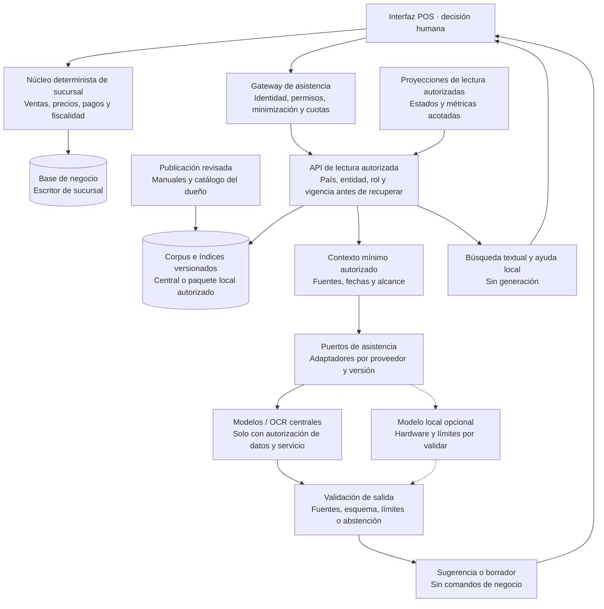

# Servicios de IA para el POS: asistencia con fuentes y decisiones controladas

Fecha: **1 de octubre de 2026**. Estado: **diseño propuesto para Chile, Perú y España; servicios, proveedores y pilotos sin aprobar**. Este documento complementa la [arquitectura POS](propuesta-arquitectura.md), sus [opciones tecnológicas](opciones-tecnologicas.md) y la [extensibilidad de proveedores](extensibilidad-proveedores-dispositivos.md).

Se proponen **dos candidatos a piloto: ayuda sobre procedimientos y búsqueda asistida de catálogo**, condicionados a un problema operativo medido y a que mejoren la alternativa convencional con un coste y riesgo aceptables. Los demás casos forman una cartera priorizada, no un alcance obligatorio. La IA debe ahorrar búsquedas y preparación de información; no convertirse en autoridad financiera, fiscal o comercial.

## 1. Qué sabemos y qué estamos proponiendo

| Estado | Información y consecuencia |
| --- | --- |
| Informado por el usuario | El POS debe operar offline en tres países y la caja no maneja stock. Ningún asistente puede inventar disponibilidad o convertir la caja en autoridad de inventario. |
| Evidencia de código | `core` y `devops-platform` tienen precedentes GCP, contratos y observabilidad reutilizables con condiciones. Esto no demuestra una plataforma IA POS en producción. Véase el [análisis corporativo](analisis-repositorios/aportes-plataforma-corporativa.md). |
| Diseño propuesto | IA opcional mediante capacidades de aplicación y adaptadores; dos pilotos de lectura, sin agentes con permisos de ejecución de negocio. |
| Pendiente | Catálogo/PIM y dueño de compatibilidades, calidad documental, permisos, contratos cloud, regiones, hardware local, volumen y responsables operativos por país. |

**El núcleo sigue siendo determinista:** ventas, precios, ofertas, impuestos, redondeos, pagos, permisos, emisión y sincronización conservan sus reglas, estados e identidades. Una respuesta generada no cambia una regla ni acredita pago, DTE, registro ERP, disponibilidad o autorización offline.

La IA no recibe credenciales ni acceso directo a AX, Gira, ERP custom o bases productivas. Consume documentos aprobados y APIs de lectura/proyecciones acotadas. Incorporar una sugerencia a una venta requiere una acción humana explícita y las validaciones habituales del núcleo; no se habilitan herramientas para escribir, cobrar, emitir, reemitir, anular o reintentar operaciones.

## 2. Casos priorizados y alternativas

**P0:** candidatos iniciales a piloto, sujetos a esa validación. **P1:** evaluar tras los pilotos y preparar datos. **P2:** valor condicionado a calidad y necesidad demostradas. **P3:** exploración futura. Las métricas se comparan con el proceso sin IA; no se prometen ahorros antes de medirlos.

### IA-01 · Asistente de procedimientos y soporte funcional · P0, piloto 1

- **Valor:** el cajero pregunta cómo realizar una tarea o interpretar un estado y obtiene pasos breves con el procedimiento que los respalda.
- **Datos:** manuales revisados por país, entidad, versión POS y proveedor; preguntas frecuentes y procedimientos de escalamiento. Dueño: operaciones de tienda con validación funcional, fiscal o de seguridad cuando corresponda.
- **Ubicación y offline:** híbrida; respuesta generada central cuando esté autorizada, documentos vigentes y buscador local para pérdida WAN. Un modelo local es una opción posterior, no requisito del piloto.
- **Controles:** citar sección, revisión y vigencia; no mezclar instrucciones de Chile con Perú/España; abstenerse si no hay evidencia aplicable. La respuesta explica el procedimiento, no ejecuta sus pasos.
- **Métrica:** proporción de tareas correctamente resueltas con evidencia válida, tiempo hasta encontrar el procedimiento, abstenciones correctas y escalaciones innecesarias, evaluadas por responsables.
- **Sin IA:** índice por tarea, búsqueda textual y guías contextuales dentro del POS. Debe seguir disponible cuando el servicio IA falle.

### IA-02 · Búsqueda de catálogo por lenguaje y códigos · P0, piloto 2 condicionado

- **Valor:** localizar candidatos usando una descripción del repuesto, denominaciones locales o un código parcial, manteniendo la búsqueda exacta de SKU/código como vía prioritaria.
- **Datos:** catálogo autorizado, identificadores, atributos, unidades, sinónimos revisados y relaciones de compatibilidad/equivalencia mantenidas por el PIM o su dueño confirmado. No se ha acreditado todavía cuál es esa fuente.
- **Ubicación y offline:** híbrida; búsqueda semántica central opcional y catálogo local versionado con búsqueda exacta/textual. Embeddings y búsqueda local se evalúan solo si mejoran el resultado dentro del presupuesto del equipo.
- **Controles:** separar «candidato encontrado» de «compatibilidad verificada». Esta última exige evidencia estructurada vigente para el caso —por ejemplo modelo, año, motor y unidad cuando apliquen—; si falta, pedir revisión. La similitud no prueba equivalencia ni stock. Precios/ofertas los calcula el núcleo.
- **Métrica:** acierto del producto entre los primeros resultados, falsos positivos de compatibilidad, tiempo de búsqueda y cobertura del catálogo; casos difíciles revisados por especialistas.
- **Sin IA:** filtros de atributos, códigos y sinónimos curados. Si no existe una fuente fiable de compatibilidad, el piloto se limita a encontrar candidatos y nunca presenta una validación.

### IA-03 · Prellenado de pedidos o cotizaciones mediante OCR · P1

- **Valor:** preparar un borrador a partir de un documento aportado por el usuario, reduciendo transcripción de líneas.
- **Datos:** documentos autorizados y catálogo; minimizar o enmascarar datos personales ajenos a la tarea. Dueño: operaciones comerciales; muestras de prueba sintéticas o aprobadas.
- **Ubicación y offline:** central inicialmente; captura manual offline. No cargar documentos después de reconectar sin autorización, necesidad y vigencia; almacenamiento temporal y eliminación explícitos.
- **Controles:** presentar original y campos extraídos, marcar ambigüedades y exigir revisión de código, unidad, cantidad, moneda y valores. El OCR produce un borrador; no crea la venta ni autoriza sustituir artículos, aplicar precios o emitir. Los documentos son datos, no instrucciones ejecutables.
- **Métrica:** exactitud por campo y línea, correcciones humanas, tiempo total incluyendo revisión y errores que llegaron al borrador aceptado.
- **Sin IA:** ingreso manual o importación de plantillas estructuradas validadas. Microsoft Document Intelligence y Google Document AI ofrecen extracción de texto/campos; ello no garantiza corrección comercial. [Microsoft](https://learn.microsoft.com/en-us/azure/ai-services/document-intelligence/overview?view=doc-intel-4.0.0), [Google](https://docs.cloud.google.com/document-ai/docs/overview).

### IA-04 · Priorización de pendientes y alertas de conciliación · P1

- **Valor:** ayudar a operaciones a entender qué pendientes requieren atención y reunir evidencia de una incidencia.
- **Datos:** proyección autorizada de operaciones, IDs exactos, intentos, estados, acuses, antigüedad y códigos de error, con datos personales minimizados. Dueño: conciliación/finanzas e integración.
- **Ubicación y offline:** reglas locales de antigüedad/estado; análisis consolidado central cuando esté disponible. La vista local indica alcance y última actualización; no deduce lo que hizo el ERP durante una desconexión.
- **Controles:** reglas deterministas antes que modelos de anomalías; la IA resume evidencias y posibles causas. No empareja por similitud como confirmación, no cierra estados ni reintenta cobros/emisiones. Un timeout sigue siendo incierto hasta obtener evidencia válida.
- **Métrica:** precisión de alertas, casos relevantes omitidos, tiempo de investigación y carga de falsos positivos; comparar con reglas existentes.
- **Sin IA:** bandeja por estado, edad y responsable, alertas configuradas y consulta de evidencias. El resultado conciliado sigue el [protocolo de resiliencia](revision-resiliencia-datos-pos.md).

### IA-05 · Recomendaciones de complementos compatibles · P2

- **Valor:** recordar accesorios o consumibles pertinentes para un artículo seleccionado, sin distraer del cobro.
- **Datos:** relaciones de complemento aprobadas, restricciones técnicas, catálogo y, si está autorizado, señales agregadas de compra. Dueño: catálogo/negocio, con revisión por país.
- **Ubicación y offline:** reglas y relaciones publicadas localmente; ranking aprendido central opcional. Ante indisponibilidad, mostrar solo la selección curada que siga vigente.
- **Controles:** filtrar por compatibilidad validada antes del ranking; explicar el vínculo; sin equivalencias inventadas, descuentos creados por IA ni promesas de stock. El cajero decide añadir y el núcleo recalcula.
- **Métrica:** utilidad evaluada, aceptación, devoluciones por incompatibilidad y tiempo añadido a la atención; no optimizar conversión ignorando errores.
- **Sin IA:** listas de complementos mantenidas por negocio. Aprender un ranking solo se justifica si supera esa base con datos suficientes y autorizados.

El código corporativo ya contiene `SuggestionService`, consumo de recomendaciones y una ruta de productos relacionados. Evaluar esa fuente y su resultado como base antes de construir otro recomendador; no se ha probado cómo se calculan sus puntuaciones, su despliegue productivo ni que sus relaciones certifiquen compatibilidad técnica o utilicen IA generativa. [Ampliación del análisis de core](analisis-repositorios/core.md#ampliación-para-evaluar-ia-y-recomendaciones).

### IA-06 · Analítica asistida mediante consultas acotadas · P2

- **Valor:** responder preguntas operativas aprobadas, como evolución de ventas registradas o antigüedad de pendientes, con definición y fecha de los datos.
- **Datos:** proyecciones analíticas, métricas documentadas, filtros por país/entidad/sucursal y permisos. Dueño: datos/BI con validación de finanzas para magnitudes financieras.
- **Ubicación y offline:** central; offline conserva reportes locales permitidos indicando corte y alcance. No presenta una copia parcial como total corporativo actualizado.
- **Controles:** el modelo elige parámetros de consultas/plantillas autorizadas; no genera SQL ejecutable libre sobre producción. Límites de filas, tiempo y coste; cálculo en capa determinista y respuesta con consulta, filtros y unidad monetaria. Sin evaluación individual de trabajadores en este alcance.
- **Métrica:** exactitud frente al reporte de referencia, uso correcto de filtros/unidades, latencia y coste por consulta útil; probar acceso cruzado y ambigüedades.
- **Sin IA:** paneles, filtros y reportes guardados con las mismas definiciones. La IA no corrige una definición de negocio ambigua.

Una oportunidad corporativa posterior sería evaluar previsión de demanda/reposición con el equipo y sistema dueño del inventario. No se propone como módulo de caja, no cambia la aclaración de que el POS no maneja stock y no acredita capacidad predictiva sin datos y evaluación propios.

### IA-07 · Asistencia para incidencias operativas · P1

- **Valor:** resumir una incidencia y sugerir comprobaciones documentadas según versión de app, dispositivo y proveedor, preparando un ticket legible.
- **Datos:** códigos de error, estado de salud sin efectos, versiones, correlaciones y fragmentos sanitizados de logs; sin secretos, documentos completos ni datos de tarjeta. Dueño: soporte y plataforma.
- **Ubicación y offline:** guías y diagnóstico determinista local; resumen central opcional. Borrador local de incidencia, envío posterior solo por el flujo autorizado y con revisión humana.
- **Controles:** registros y mensajes de proveedor son datos no confiables; no ejecutar instrucciones contenidas en ellos. No reiniciar agentes, cambiar configuración, instalar software, imprimir pruebas ni tocar colas automáticamente.
- **Métrica:** calidad del ticket, porcentaje de derivaciones correctas y tiempo hasta diagnóstico validado; medir también recomendaciones equivocadas.
- **Sin IA:** formularios guiados, mapa de códigos y paquete de diagnóstico sanitizado. Los mecanismos de soporte siguen la [extensibilidad de dispositivos](extensibilidad-proveedores-dispositivos.md).

### IA-08 · Entrada por voz para búsqueda o borradores · P3, futura

- **Valor:** facilitar una consulta de catálogo o dictar un borrador cuando teclado/entorno lo justifiquen; no sustituye accesibilidad ni navegación normal.
- **Datos:** audio iniciado explícitamente y transcripción necesaria; comprobar vocabulario, códigos y acentos de cada país. Dueño: producto/operaciones, con seguridad y privacidad.
- **Ubicación y offline:** proveedor y ejecución local por evaluar; si no hay capacidad autorizada, usar teclado. No prometer reconocimiento offline en equipos sin pruebas.
- **Controles:** pulsar para hablar, indicar captura, revisar transcripción, evitar escucha ambiental y definir eliminación del audio. Una frase no confirma pago, precio, identidad, autorización o emisión.
- **Métrica:** error en códigos/cantidades, correcciones y tiempo frente a teclado en el entorno real; probar ruido y accesibilidad con usuarios.
- **Sin IA:** teclado, lector de códigos y accesos rápidos. No forma parte de los pilotos iniciales.

## 3. Arquitectura propuesta: una ayuda opcional

Se mantiene el perfil WAN de la propuesta: **el servidor de sucursal es el escritor de negocio** y necesita LAN disponible. Agregar IA o Tauri no añade autonomía ante pérdida de ese escritor. La caída del proveedor IA debe deshabilitar únicamente la ayuda generativa, sin bloquear operaciones que el POS ya permita.



El gateway es una **capacidad de aplicación**, no necesariamente un microservicio nuevo. Puede comenzar como módulo/worker aislado del núcleo, con puertos para buscar, extraer campos o redactar con fuentes. Credenciales y políticas permanecen en backend; no en el renderer ni dentro del modelo.

Las proyecciones se alimentan mediante contratos existentes, fuera de la transacción de venta. IA no necesita leer directamente tablas del escritor. Limitar CPU, memoria, conexiones, concurrencia y disco evita que indexar o ejecutar un modelo local degrade venta, sincronización o recuperación.

## 4. Fuentes, permisos y comportamiento offline

**RAG** significa recuperar información autorizada para acompañar la petición al modelo. No convierte los documentos en verdad ni elimina respuestas erróneas. El filtro de entidad y usuario debe aplicarse en cada recuperación y antes de enviar el contexto al modelo; no basta ocultar partes de la respuesta final. [Arquitectura RAG con autorización](https://learn.microsoft.com/en-us/azure/architecture/ai-ml/guide/secure-multitenant-rag).

1. Cada documento/fragmento conserva dueño, país, entidad autorizada, versión, aprobación, vigencia y origen. Las compatibilidades requieren su fuente estructurada; un manual narrativo o una respuesta anterior no reemplaza ese registro.
2. Los permisos se obtienen de identidad y política confiables, no del texto del usuario ni del modelo. Propagarlos a índices, embeddings, citas, cachés y conversación; evitar reutilizar respuestas entre ámbitos no autorizados.
3. Revisar cambios del corpus antes de publicar; invalidar versiones retiradas e índices/cachés derivados. Mostrar fuentes y límites aplicables; ante conflicto, ausencia o vencimiento, abstenerse o entregar solo material que siga autorizado.
4. PDFs, OCR, catálogo, enlaces y logs son datos no confiables, nunca instrucciones para ampliar permisos o ejecutar acciones. Restringir herramientas por diseño y probar inyección de instrucciones; delimitadores y RAG no son una garantía. [Higiene de contexto y recuperación](https://learn.microsoft.com/en-us/security/zero-trust/catalog-ai-defense-capabilities/input-context-retrieval-hygiene).
5. Paquetes locales aprobados e íntegros contienen solo material habilitado para esa sucursal/rol. Definir vigencia y política de revocación diferida: una tienda desconectada no puede descubrir instantáneamente una revocación central. Al vencer la autorización, bloquear el contenido restringido afectado.
6. Sin WAN, usar búsqueda exacta/textual y guías locales vigentes. Si tampoco hay evidencia local válida, informar la limitación y escalar. No presentar una respuesta cacheada fuera de contexto como evidencia actual.
7. Timeout/circuit breaker y colas acotadas: una consulta interactiva fallida no genera un backlog infinito ni se reenvía silenciosamente al reconectar. Una subida documental pendiente requiere el flujo autorizado y una necesidad aún vigente.

## 5. Familias de servicios candidatas

Evaluar **una familia cloud para los pilotos**, usando la misma prueba y contratos. No desplegar dos proveedores ni un motor vectorial nuevo por anticipación. El precedente GCP favorece comparar su encaje operativo primero; no sustituye aprobación de seguridad, compras o arquitectura.

| Opción candidata | Uso posible | Condición y límite |
| --- | --- | --- |
| **Microsoft Foundry + Azure AI Search + Document Intelligence** | Modelos y evaluación, recuperación documental, OCR y extracción de campos. | Encaje con identidad, región, contratos y costes por validar. Los permisos de los datos deben implementarse y probarse; determinadas capacidades nativas de autorización documental de Search figuran en preview. No asumir control universal automático. |
| **Google Cloud: Gemini y Document AI** | Modelo gestionado para asistencia, extracción documental y servicios de lectura corporativos. | Precedente GCP en el código; acceso, regiones y operación productiva IA no acreditados. Las referencias históricas de Vertex AI consultadas redirigen hoy a documentación de Gemini Enterprise Agent Platform. No se exige incorporar agentes autónomos. |
| **ONNX Runtime + embeddings locales; pgvector opcional** | Inferencia local evaluada, búsqueda semántica sin WAN y vectores en PostgreSQL si se justifican. | No se ha medido el hardware de tienda. El modelo, licencia, cuantización y presupuesto importan; la API generativa de ONNX figura en preview. Embeddings no generan respuestas ni prueban compatibilidad. |

Fuentes de capacidades: [Microsoft Foundry](https://learn.microsoft.com/en-us/azure/foundry/what-is-foundry), [autorización documental en Azure AI Search](https://learn.microsoft.com/en-us/azure/search/search-document-level-access-overview), [modelos Google Cloud](https://docs.cloud.google.com/gemini-enterprise-agent-platform/models), [Document AI](https://docs.cloud.google.com/document-ai/docs/overview), [ONNX Runtime](https://onnxruntime.ai/docs/), [API generativa en preview](https://onnxruntime.ai/docs/genai/) y [pgvector](https://github.com/pgvector/pgvector).

`pgvector` es una extensión de PostgreSQL para búsqueda vectorial, no una obligación de cambiar el motor. Evaluar versión/operación soportadas y mantener aislamiento respecto de la base financiera: reutilizar tecnología no significa alojar indexación intensiva junto al escritor de ventas. Puede bastar el buscador textual para el tamaño real del corpus.

## 6. Datos, observabilidad y gobierno

- **Responsabilidad por país:** operaciones aprueba procedimientos; catálogo valida atributos/compatibilidades; finanzas define métricas; soporte mantiene diagnósticos. Producto y seguridad acuerdan qué datos/capacidades salen de Chile, Perú o España, por entidad y contrato. Este documento no establece una conclusión legal de residencia o transferencia.
- **Minimización:** bloquear PAN, CVV, secretos, tokens y datos personales innecesarios antes de llamar al proveedor o registrar trazas. No usar conversaciones reales como dataset por defecto; preferir casos sintéticos y muestras aprobadas con tratamiento definido.
- **Retención y entrenamiento:** verificar servicio, modelo, región, funciones opcionales, subencargados, eliminación y contrato. «No entrenar con mis datos» no equivale a «no retenerlos»: Google documenta condiciones separadas para entrenamiento, monitorización y cachés. No extender una garantía de un producto a todo el proveedor. [Condiciones de retención Google Cloud](https://docs.cloud.google.com/gemini-enterprise-agent-platform/resources/zero-data-retention).
- **Observabilidad:** registrar IDs de correlación, caso de uso, versión de modelo/prompt/corpus, latencia, uso, resultado y motivo de abstención con atributos mínimos autorizados. No enviar prompts, documentos, respuestas o audio crudos a Pino/Sentry; revisar también logs SDK, errores, tracing y capturas de sesión.
- **Auditoría:** si una tarea necesita conservar entrada/salida para revisión, usar repositorio separado, acceso restringido, retención y propósito aprobados. Los logs de diagnóstico no son el expediente financiero ni sustituyen la evidencia original.
- **Gobierno de cambios:** versión de prompts, evaluaciones, modelos, corpus y políticas; historial y rollback compatible. Revisión humana para publicar procedimientos y compatibilidades; salida generada nunca se convierte automáticamente en nueva fuente autorizada.

## 7. Pilotos, evaluación y despliegue

| Paso | Entregable y condición de avance |
| --- | --- |
| Preparar | Dueños y permisos definidos, catálogo/documentos representativos, alternativa sin IA instrumentada, autorización de datos/servicio y presupuesto. No conectar el modelo a producción para «ver qué encuentra». |
| Piloto 1 | Asistente de procedimientos sobre un corpus pequeño y revisado, inicialmente en entorno de evaluación; cita comprobable o abstención. Probar país equivocado, versiones contradictorias y ausencia de conectividad. |
| Piloto 2 | Búsqueda de catálogo sobre categorías acotadas; comparar exacta/textual contra semántica. Si no hay compatibilidad autoritativa, evaluar solo recuperación de candidatos. |
| Evaluación | Dataset separado del usado para ajustar prompts, casos por país/rol y versiones; incluir errores tipográficos, unidades, fuentes caducas, ataques en documentos y solicitudes de otra entidad. Revisión por especialistas, no confianza autodeclarada del modelo. |
| Piloto con usuarios | Activación limitada por país/sucursal/rol, capacitación, feedback y supervisión. Ampliar solo con métricas y umbrales acordados; conservar la alternativa convencional. |
| Operación | Cuotas, alertas de coste/calidad, revisión periódica y botón de deshabilitación de IA. Al cambiar proveedor/modelo/corpus, repetir las evaluaciones afectadas antes de ampliar. |

Definir umbrales antes del piloto: exactitud con fuente, recuperación de candidatos, falsas compatibilidades, abstenciones, latencia p95, coste por tarea resuelta y carga de revisión. Una fuga de datos o una compatibilidad presentada como verificada sin respaldo bloquea el avance; «cero errores observados» en la muestra no demuestra riesgo cero.

Incluir dos cruces propios de este proyecto: **migración ERP**, con códigos históricos/nuevos y alias por entidad que solo se vinculen mediante mapeos autoritativos, nunca por similitud para confirmar productos u operaciones; y **variantes de periféricos**, con instrucciones de otra versión, modelo, firmware o adaptador que deban excluirse según el perfil instalado confiable. Una pregunta del usuario no sustituye ese contexto.

**Pruebas de independencia:** proveedor IA lento/caído, cuota agotada, permiso vencido, corpus corrupto y recurso local saturado. La asistencia debe degradarse de forma visible; el núcleo mantiene las operaciones permitidas por sus propias dependencias y políticas. No usar disponibilidad de IA como prueba de disponibilidad fiscal o de pagos.

## 8. Dimensionamiento y coste sin cifras inventadas

Medir por caso de uso, país y familia de proveedor: consultas diarias/pico, páginas OCR, tamaño y cambios del corpus, tokens de entrada/salida, concurrencia, tasa de repetición y revisión humana. Las **46 entradas de tiendas publicadas no son terminales activos ni una carga IA**; véase [cobertura pública](cobertura-publica-sucursales.md).

Una fórmula inicial para comparar opciones, usando tarifas verificadas cuando se seleccione servicio y fecha:

```text
C_mes = sum_i N_i * (Tentrada_i * Pentrada_i + Tsalida_i * Psalida_i) / U
      + Npaginas * Ppagina + Cembeddings + Cbusqueda + Cinfra + Ctransferencia
      + Coperacion + Cevaluacion + Choras_revision + Camortizacion_local
```

`N_i` = llamadas mensuales del caso/modelo; `T` = tokens medios facturados; `P` = precio por unidad tarifaria; `U` = cantidad de tokens de esa unidad. Añadir cachés, almacenamiento y reservas/compromisos si el servicio los cobra; usar sus unidades reales y evitar contarlos dos veces. Los costes fijos pueden existir aunque no haya consultas.

Comparar coste por tarea **correctamente resuelta**, tiempo total de atención y errores frente a la alternativa convencional. Un modelo local tiene coste de equipos, memoria, actualización y soporte; un servicio remoto añade conectividad y condiciones de datos. Ninguna opción demuestra ROI por su nombre.

## 9. Información mínima que pedir al equipo

1. ¿Qué cinco tareas consumen más tiempo por país y cuánto tardan hoy? Pedir ejemplos sanitizados y procedimiento actual, no dumps productivos.
2. ¿Quién aprueba manuales y qué metadatos/versiones tienen? ¿Qué instrucciones cambian según sociedad, país, proveedor o release POS?
3. ¿Dónde vive el catálogo autoritativo, sus equivalencias y compatibilidades? ¿Quién corrige errores y qué atributos son obligatorios para afirmar compatibilidad?
4. ¿Qué datos puede ver cada rol/sucursal/entidad y durante cuánto tiempo offline? ¿Qué contenido no debe quedar en un terminal perdido?
5. ¿Qué cloud, servicios y regiones están autorizados y qué contratos existen? Confirmar tratamiento, entrenamiento, retención, transferencias, coste y acceso a modelos concretos.
6. ¿Qué CPU/RAM/disco/OS hay en servidor y cajas, y cuál es la carga pico del POS? ¿Existen presupuestos de recursos, renovación y distribución de paquetes/modelos firmados?
7. ¿Cuántas consultas, documentos/páginas y usuarios concurrentes se esperan por tarea? ¿Quién opera el servicio y atiende degradación, errores de contenido y consumo excesivo?
8. ¿Quién valida los resultados del piloto y puede detenerlo? Acordar métricas, umbrales, muestras, presupuesto y responsables de Chile, Perú y España antes de habilitar datos reales.
