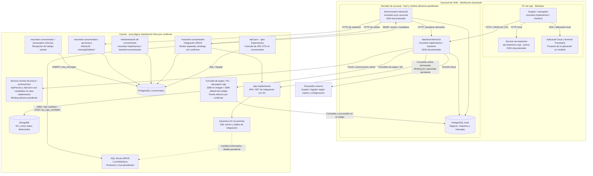
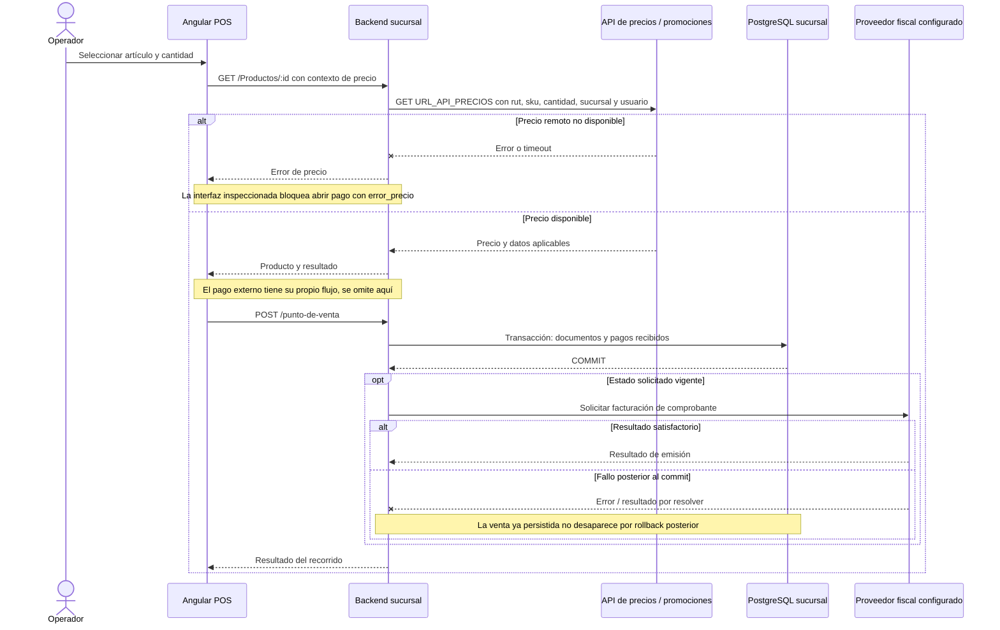
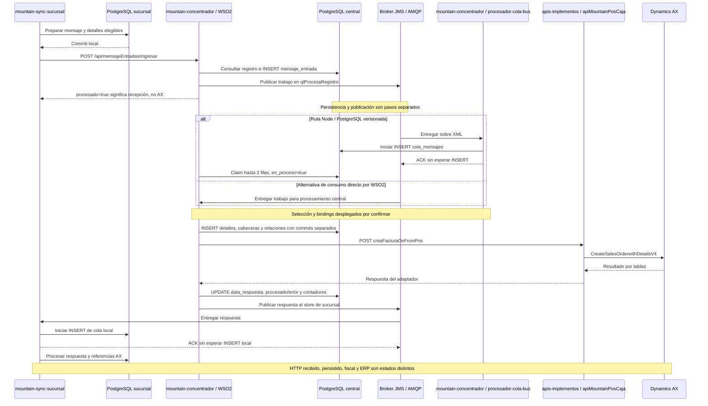
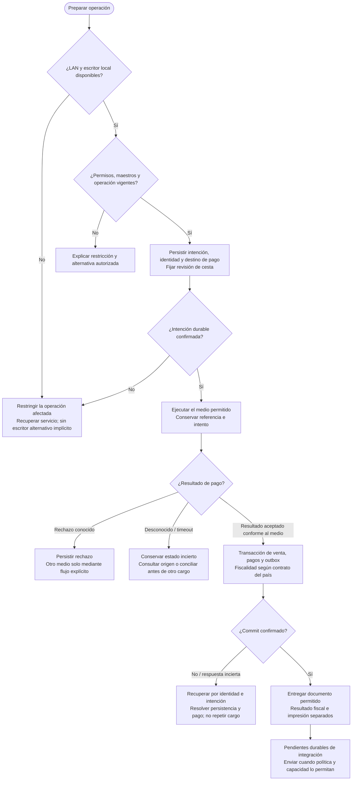
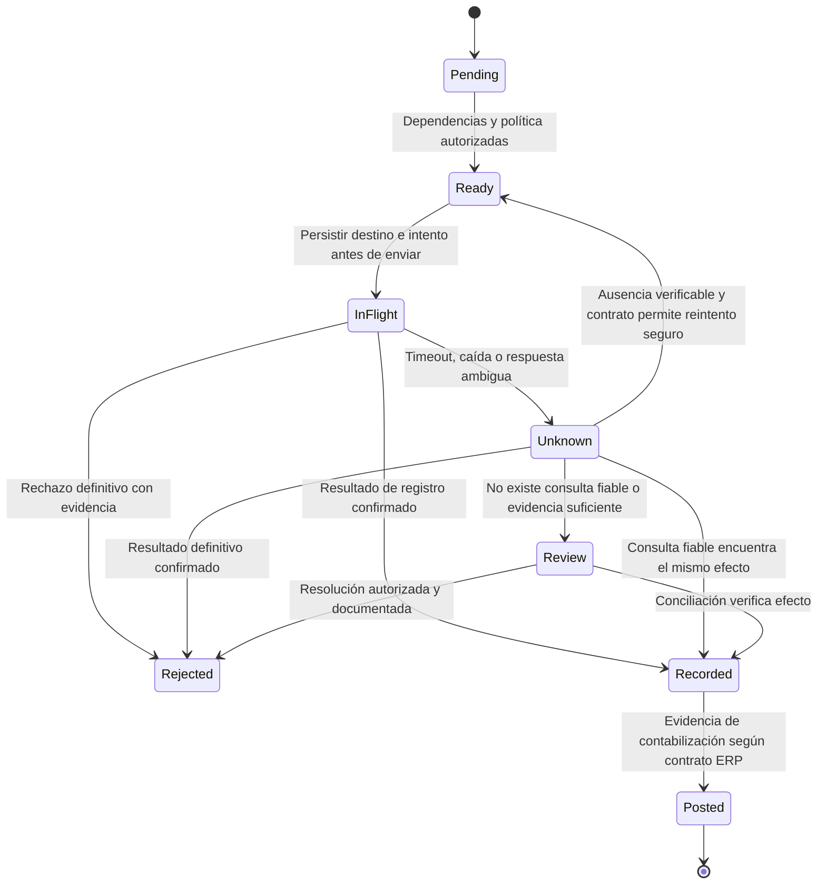
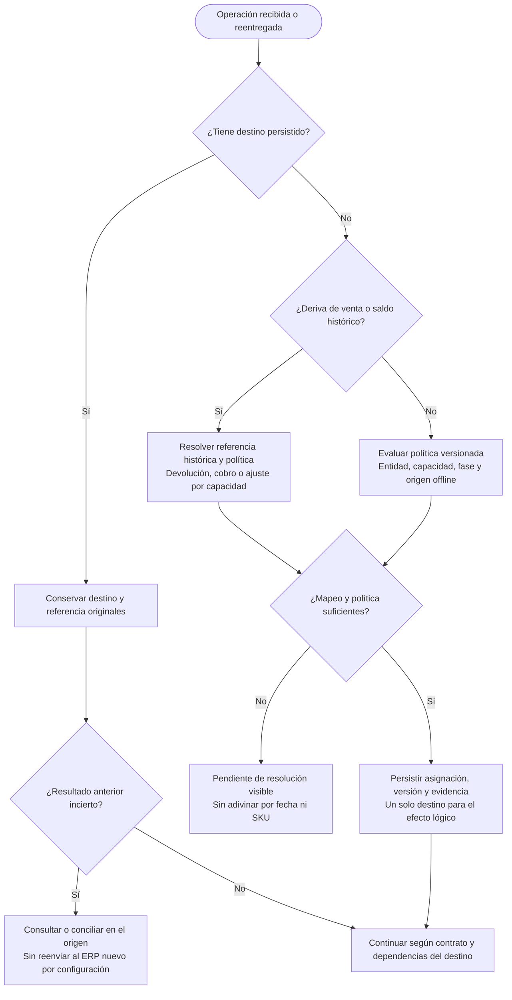

# Vistas técnicas de arquitectura y recorridos críticos

Revisión: **1 de octubre de 2026**. Este documento amplía la [propuesta](propuesta-arquitectura.md) y el [catálogo de integraciones actuales](catalogo-integraciones-actuales.md). Separa reconstrucción del sistema chileno y diseño objetivo. Los diagramas describen comportamiento y responsabilidades; no son capturas de tráfico ni evidencias de un despliegue en producción.

Para seguir **qué tabla se lee o escribe en cada paso**, consultar los [recorridos D01–D05](recorridos-datos-tablas.md), disponibles también en el capítulo Datos de la presentación. Añaden persistencia y límites de commit a las vistas de componentes y secuencias de este documento.

## 1. Cómo leer y revisar estas vistas

Una revisión de arquitectura necesita contestar preguntas diferentes: quién usa el sistema, qué componentes colaboran, dónde se ejecutan, en qué orden actúan y cómo se recuperan. El modelo C4 distingue niveles de detalle y vistas de despliegue; arc42 propone escenarios de ejecución y excepciones. Aquí usamos Mermaid para esas preguntas, sin exigir todas las notaciones ni atribuir este diseño a una empresa concreta. [C4: vistas](https://c4model.com/diagrams), [C4: despliegue](https://c4model.com/diagrams/deployment), [arc42: ejecución](https://docs.arc42.org/section-6/), [arc42: despliegue](https://docs.arc42.org/section-7/).

| Vista | Pregunta que responde | Estado y alcance |
| --- | --- | --- |
| V01 · Despliegue lógico actual | ¿Qué corre en caja, sucursal y central? ¿Dónde está el código? | Chile; ubicación declarada en PPTX y responsabilidades observadas en código. Hosts físicos pendientes. |
| V02 · Venta actual | ¿Cuándo se consultan precios, persiste la venta y se solicita el DTE? | Recorrido representativo de Mountain; el cobro por dispositivo tiene su propio flujo. |
| V03 · Integración actual | ¿Qué significan preparado, recibido y confirmado? ¿Dónde aparece una ventana de pérdida? | Sincronizador `master` revisado; tramo central auditado en mountain-concentrador; versiones desplegadas pendientes. |
| V04 · Actividad propuesta | ¿Se permite continuar si falla una dependencia? ¿Qué hacer con un pago incierto? | Diseño del perfil WAN: servidor de sucursal como escritor. |
| V05 · Estados de integración propuestos | ¿Cómo distinguir transporte, resultado ERP e incertidumbre? | Contrato por destino pendiente de validar con el ERP. |
| V06 · Migración ERP propuesta | ¿Dónde se decide el destino de una operación y de sus reintentos? | Migración gradual; ERP destino y calendario pendientes. |

El [mapa principal](../README.md#3-arquitectura-actual-de-chile) conserva el contexto. Los detalles de [maestros/RUT](contraste-apuntes-operacion-chile.md), [mantenimiento y recuperación](revision-resiliencia-datos-pos.md), [proveedores](extensibilidad-proveedores-dispositivos.md), [IA](servicios-ia-pos.md) y [RFID](evolucion-rfid-autoservicio.md) tienen sus propias vistas para mantener cada diagrama legible.

**Leyenda de evidencia:** «código» acredita una ruta en un SHA; «PPTX» una afirmación de la presentación; «informado» un apunte del usuario; «propuesto» una decisión candidata; «pendiente» un dato que falta. Una flecha continua representa una interacción descrita en su fuente, no prueba de tráfico productivo. Una flecha punteada señala una relación cuyo detalle permanece pendiente.

## 2. V01 · Despliegue lógico actual y repositorios

Las diapositivas 5 y 6 ubican los componentes por ámbito. **Central es una agrupación lógica de varios servicios, no un servidor único.** El diagrama no identifica IP, DNS, VM, clúster, cantidad de réplicas ni sistema operativo de los servidores. Un puerto documentado o un valor de configuración no demuestra una escucha efectiva ni accesibilidad desde otra red.

Fuentes: [distribución de la presentación](antecedentes-presentacion-chile.md#3-distribución-y-responsabilidades), [Mountain](analisis-repositorios/mountain-implementos.md), [sincronizador](analisis-repositorios/mountain-sync-sucursal.md), [pagos](analisis-repositorios/api-pagos-caja.md), [impresión](analisis-repositorios/api-impresion-caja.md), [APIs](analisis-repositorios/apis-implementos.md). El [catálogo](catalogo-integraciones-actuales.md) conserva commits, rutas y procedencia por componente.

**Lectura práctica:** un repositorio puede contener varias aplicaciones; una aplicación puede tener varias instancias desplegadas. Por eso los seis nombres de apps del relato inicial, diez componentes de la matriz original y nueve repositorios recibidos no se suman como si fueran el mismo inventario. `apis-implementos` contiene nueve proyectos API y tres bibliotecas .NET; se han observado sus wrappers y proxies AX, pero faltan el código X++ del servidor, cuerpos de procedimientos almacenados y configuración desplegada. Una biblioteca no es un servidor adicional.

La flecha de pagos a PostgreSQL local muestra una dependencia observada que importa para continuidad y consolidación: una caída de sucursales puede afectar consultas agregadas. No representa una conexión comprobada a todas las tiendas ni garantiza que una respuesta parcial sea un saldo disponible. La ubicación física de las APIs de precio/promociones tampoco se acredita por el repositorio: se sitúan en el ámbito remoto del mapa y requieren inventario de despliegue.

La consulta de `ApiCarro` a PostgreSQL del concentrador recupera datos/URL del DTE; no se dibuja como registro de una venta. El refresco de cliente en Mountain usa `URL_API_CLIENTES` más el sufijo `cliente`: no se ha identificado un receptor inequívoco con ese contrato en `ApiCliente`, por lo que la flecha general de consultas .NET no acredita ese binding particular. El catálogo distingue llamada cliente observada y ruta receptora declarada.

## 3. V02 · Secuencia actual: precio, persistencia y DTE

Esta vista une fases de un recorrido representativo para explicar sus dependencias. No afirma que exista una única llamada que haga todo, ni muestra el orden del cobro con tarjeta: registrar pagos recibidos en el backend y efectuar el cargo en un terminal son acciones distintas. Los métodos y paths verificables se consultan en el [catálogo de integraciones](catalogo-integraciones-actuales.md).

Evidencia: [Mountain, recorridos y MI-01/MI-05](analisis-repositorios/mountain-implementos.md#2-recorridos-relevantes) y rutas por SHA del [catálogo](catalogo-integraciones-actuales.md). La API .NET declara `GET /api/precios/precio`, con un contrato compatible; la configuración desplegada que enlaza `URL_API_PRECIOS` con ese receptor no está verificada. La facturación normal es una llamada interna después del commit; no se confunde con la ruta adicional `GET /Documentos/facturar?id=…`, que puede producir un efecto pese a usar GET.

La nota de diapositiva 10 y la diapositiva 13 coinciden en guardado previo a emisión; el código da el límite de transacción. Si el documento queda fiscalmente pendiente, no asumir que entra al mismo camino de subida: la selección de boletas/facturas del sincronizador `master` exige estados documentales/fiscales y dependencias cuando no está en desarrollo.

**Qué falta para certificar esta secuencia en producción:** versión desplegada, configuración del facturador, trazas sanitizadas de una venta normal y de un fallo, referencia de pago y resultado fiscal. Las pruebas propuestas cubren commit exitoso seguido de fallo fiscal, respuesta externa perdida y llamadas concurrentes; no se han ejecutado sobre los sistemas de la empresa.

## 4. V03 · Secuencia actual: preparación, envío y respuesta de AX

El cron, la API manual, el polling de maestros y el consumidor AMQP son entradas diferentes. Esta vista muestra la subida representativa de ventas y una respuesta por AMQP; existe recuperación por consulta HTTP. Horarios y configuración productiva siguen pendientes.

Fuentes: [sincronizador](analisis-repositorios/mountain-sync-sucursal.md) y [ingreso/procesamiento central](analisis-repositorios/mountain-concentrador-ingreso.md). No se da por comprobado que haya ocurrido pérdida de mensajes: la revisión estática muestra una ventana que requiere ensayo. La propuesta cambia el límite de confirmación a **persistir inbox antes del ACK**, junto con deduplicación, procesamiento recuperable y conservación de evidencia.

### Tres recorridos que no deben confundirse

| Recorrido actual | Orden observado o informado | Consecuencia para el diseño |
| --- | --- | --- |
| Subida de ventas | Preparar mensaje → marca local → HTTP → resultado AX posterior | Mostrar estados diferentes; el indicador local no basta para afirmar deuda registrada. |
| Bajada de maestros | Obtener lote → avisar recibido → persistir localmente → aplicar detalles → notificar procesados | El acuse de recepción precede a persistencia en el código revisado; revisar custodia y recuperación. Hay transacciones por detalle, no activación atómica de todo el snapshot. |
| Refresco individual de cliente | Selección/carga → consulta remota → actualización local | Complementa los lotes. No afirma escritura en AX ni una llamada por cada tecla del RUT; preservar la cesta ante fallo es un requisito objetivo. |

Referencias: [sincronizador §3.2](analisis-repositorios/mountain-sync-sucursal.md#32-bajada-aviso-recepción-de-lote-y-procesamiento-son-tres-etapas), [contraste RUT/MPOS](contraste-apuntes-operacion-chile.md), [MI-09](analisis-repositorios/mountain-implementos.md#mi-09--alta-para-offline--la-carga-de-cliente-puede-limpiar-la-venta-ante-fallo-del-refresco-remoto). Los saltos exactos tienen su evidencia también en el catálogo; no se atribuyen al consumidor local los procesos centrales aún no entregados.

## 5. V04 · Actividad propuesta: continuidad y fallo de pago

**Propuesto.** Representa el perfil WAN: la sucursal tiene un escritor local disponible. El país y el proveedor determinan qué pagos/documentos están permitidos. La ausencia de internet no autoriza tarjetas, crédito, folios, precios vencidos ni recursos compartidos sin una política explícita.

Una respuesta local perdida también requiere consulta por identidad; no implica que el commit no ocurriera. Si el pago se aceptó y el almacenamiento falla, se recupera desde la intención durable y la evidencia del proveedor. Compensaciones y reversas son operaciones trazables con sus propios resultados; no se representan como un rollback de un cargo externo.

Pruebas asociadas: [validación de corte de energía, disco lleno, pago incierto y fallo fiscal](validacion-y-decisiones.md#escenarios-de-aceptación), [extensibilidad de proveedores](extensibilidad-proveedores-dispositivos.md). Una venta permitida offline puede continuar sin ERP o IA; las restricciones por LAN, escritor, permiso, precio o medio de pago son independientes de ese desacople.

## 6. V05 · Estados propuestos: entrega y resultado ERP

**Propuesto, pendiente de contrato.** Una operación tiene varios ejes: venta local, pago, fiscalidad, impresión e integración ERP. No convertirlos en un booleano `sincronizado` ni en una única secuencia que presuponga que todos avanzan juntos.

| Eje | Ejemplos de estado y evidencia | No se deduce de ese eje |
| --- | --- | --- |
| Persistencia local | Intención durable; venta confirmada; excepción recuperable. | Cobro liquidado, aceptación fiscal o registro ERP. |
| Transporte | Pendiente; recibido centralmente tras commit; reentrega deduplicada. | ERP registrado o contabilizado. |
| Pago | Rechazado, autorizado, desconocido, reversa pendiente; semántica por medio/proveedor. | Liquidación final o emisión de DTE. |
| Fiscalidad | Pendiente, emitido, aceptado, rechazado; estados reales según país/proveedor. | Impresión física o contabilización ERP. |
| Impresión | Trabajo aceptado, enviado a spooler, error, resultado físico desconocido. | Existencia de una copia física legible. |
| ERP | Listo, en curso, desconocido, rechazado, registrado, contabilizado cuando exista evidencia. | Éxito de otros efectos ni conciliación global por un mero HTTP 200. |

El nombre `Recorded` no promete un estado intermedio disponible en todos los ERPs. El adaptador debe mapear las pruebas que realmente ofrece el destino; si una sola respuesta acredita registro y contabilización, conservar esa evidencia. Un rechazo requiere corregir la causa mediante una nueva operación relacionada, sin modificar silenciosamente el payload original. Los estados `Unknown` y `Review` deben tener responsable, antigüedad y próximo paso, no quedar ocultos como un éxito de transporte.

**Contrato que acompaña al dibujo:** identidad estable y entidad legal; versión de payload; destino/época persistidos; evidencia de resultado; mismo ID con payload diferente rechazado; reenvío con la misma identidad; exclusión local de workers; consulta o conciliación de efectos externos. Un lock local no puede retirar una solicitud que ya llegó al ERP. Ver [resiliencia y contratos](revision-resiliencia-datos-pos.md#6-contratos-y-corte-de-erp-para-proteger-la-inversión).

## 7. V06 · Actividad propuesta: elegir destino durante la migración ERP

**Propuesto.** El cambio de ERP modifica la política de asignación de operaciones nuevas. La coexistencia necesita referencias históricas, maestros versionados y contratos de devolución/cobranza. La fecha del reloj de una caja aislada no basta para elegir el destino.

Antes del corte: probar equivalencia de contratos, cargas de maestros, operaciones tardías offline, pagos dependientes, devoluciones de históricos, respuestas AX tardías y rollback del despliegue. La comparación paralela usa lectura/simulación; no contabiliza dos veces para contrastar resultados. Retirar la integración anterior exige resolver pendientes y obligaciones históricas, no únicamente cambiar la configuración de nuevas ventas.

Fuente de diseño: [migración y contratos](revision-resiliencia-datos-pos.md#6-contratos-y-corte-de-erp-para-proteger-la-inversión), [propuesta de coexistencia](propuesta-arquitectura.md#coexistencia-y-corte-de-erp). La preferencia corporativa por un ERP común y el posible inicio por Chile siguen como intención, no selección de producto.

## 8. De diagrama a evidencia operativa

Cada recorrido necesita observabilidad ligada a lo que experimenta el usuario y al resultado del negocio. Google SRE propone acordar objetivos de servicio y usarlos para decisiones; los números iniciales de este proyecto siguen siendo hipótesis hasta medir carga y acordarlos con operación. [Google SRE: SLOs](https://sre.google/workbook/implementing-slos/).

| Recorrido | Medición candidata | Evidencia de recuperación requerida |
| --- | --- | --- |
| Venta local permitida | Tiempo hasta commit confirmado; errores por causa; capacidad restante del escritor. | Caída de proceso/disco y respuesta local perdida, sin doble venta ni cobro. |
| Entrega central | Antigüedad del pendiente más antiguo, volumen, huecos, recibidos durables y no enviados. | Acuse perdido, reconexión simultánea y restore central anterior a un acuse. |
| Resultado ERP | Tiempo desde origen hasta efecto confirmado, rechazados y desconocidos por destino. | Consulta por referencia, dependencias venta/pago y conciliación con el destino. |
| Maestros | Versión activa, integridad del lote, vigencia y cobertura por sucursal. | Descarga parcial, lote atrasado tras refresco RUT y activación compatible. |
| Pago / fiscalidad | Intentos inciertos, antigüedad y referencias; resultados separados por proveedor. | Recuperación y compensación autorizadas conservando el proveedor original. |
| Mantenimiento | Trabajo admitido, drenado y pendiente; locks; duración y recuperación del escritor. | Consumidor detenido sin ACK prematuro, checkpoints y reapertura gradual. |

No incluir RUT, nombres, tokens, cuerpos completos de pagos ni secretos como etiquetas de métricas. Usar correlación con acceso acotado a la evidencia necesaria. Un log del POST o un panel verde del broker no sustituyen la comprobación del efecto financiero.

## 9. Información que completa el mapa físico y los contratos

Para convertir V01 en un inventario operativo, el equipo debe entregar una fila por **instancia y entorno**, incluyendo alias de host, sitio, país/sociedad, app, repo/SHA, artefacto, runtime/OS, puerto/protocolo, proxy/TLS/autenticación, servicio de arranque, datos persistentes, propietario, respaldo, RPO/RTO, monitoreo y dependencias de red. Guardar IPs/credenciales en el inventario controlado de infraestructura, no en el material de exposición.

Para cada integración crítica: método/path efectivo, versión, llamador, autorización, esquema y ejemplo anonimizado, timeouts, reintentos, idempotencia, orden, significado de respuestas, posibilidad de consultar resultado y responsable. Contrastar configuración con trazas sanitizadas, sin invocar producción desde este proyecto. Una definición OpenAPI describe el contrato, pero no demuestra su consumo ni todos sus efectos.

Actualizar documentación cuando cambien rutas, ownership, despliegue, política offline o contratos. La revisión de cambio debe identificar vistas y escenarios afectados, regenerar diagramas, verificar enlaces y ejecutar las pruebas relevantes. La [matriz de cobertura](cobertura-documentacion-presentacion.md) muestra qué está resumido en la presentación y dónde consultar el detalle; mantenerla como índice de evidencia, no como un porcentaje de calidad.
