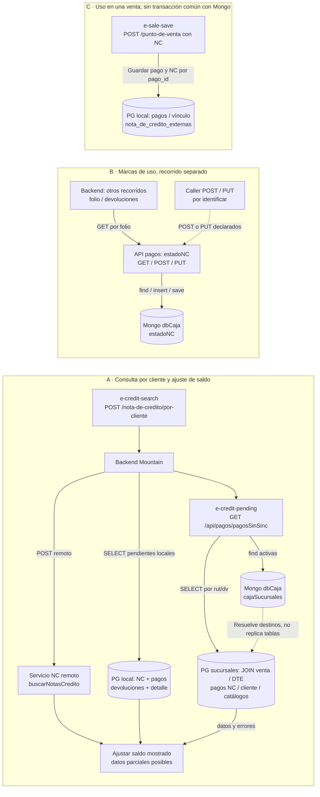

# Evidencia para D01 venta→DTE y D05 NC multibase

Nota de auditoría para integración editorial; lectura estática el 1 de octubre de 2026. Solo se crea este archivo; no se ejecutó código corporativo ni se contactaron DB/API. Ramas y SHA no acreditan producción.

- Mountain: `master`, `711f97fd7948c696bf45c992c5b121683bdbacd7`.
- API pagos: `main`, `33cd625f029aa78798f0baf307c41e17ebee92e1`.
- Sync: `master`, `540ab9a70e7befbca27a2f7eb88b87b25109e4d1` (leído mediante Git, sin cambiar checkout).

## Convención de nombres y certeza

Los nombres de tabla PostgreSQL que siguen están presentes en consultas, relaciones o migraciones de estos commits. **No anteponer `public.` por conveniencia:** la mayoría de estas consultas deja la relación sin esquema y su resolución efectiva depende de conexión/search_path/DDL desplegados, no inspeccionados. El esquema `public` sí aparece literalmente en `public.dtes` y `public.documentos` dentro de la ruta distinta `POST /api/pagos/`; no se extiende automáticamente a sus otros JOIN.

Evidencia: [services/pagosService.js:25–61](https://github.com/developer-implementos/api-pagos-caja/blob/33cd625f029aa78798f0baf307c41e17ebee92e1/services/pagosService.js#L25-L61); [services/pagosService.js:78–109](https://github.com/developer-implementos/api-pagos-caja/blob/33cd625f029aa78798f0baf307c41e17ebee92e1/services/pagosService.js#L78-L109); [backend/app/Services/DocumentoService.js:161–180](https://github.com/developer-implementos/mountain-implementos/blob/711f97fd7948c696bf45c992c5b121683bdbacd7/backend/app/Services/DocumentoService.js#L161-L180).

MongoDB: los modelos declaran **colecciones físicas explícitas**, porque usan tercer argumento en `dbCaja.model`: `estadoNC` y `cajaSucursales`. No hay que inferir pluralización Mongoose. `dbCaja` es el alias lógico de conexión, no el nombre de base publicado aquí. No se publican nombres de DB, servidores ni credenciales de conexión.

Evidencia: [models/estadoNC.model.js:24–28](https://github.com/developer-implementos/api-pagos-caja/blob/33cd625f029aa78798f0baf307c41e17ebee92e1/models/estadoNC.model.js#L24-L28); [models/cajaSucursales.model.js:22–26](https://github.com/developer-implementos/api-pagos-caja/blob/33cd625f029aa78798f0baf307c41e17ebee92e1/models/cajaSucursales.model.js#L22-L26).

## D01 · Venta → DTE actual

Entrada del catálogo: **`e-sale-save` = POST `/punto-de-venta`**. La facturación normal se llama internamente después del commit, cuando el estado solicitado es `vigente`; **`e-document-retry` = GET `/Documentos/facturar?id=…`** es otra entrada de reintento, no un paso HTTP obligatorio de cada venta. Proveedores: `e-fiscal-acepta`, `e-fiscal-ingydev`.

### Secuencia y tablas con evidencia

| Orden / bloque | DB y objetos | Operación observada / límite | Fuente por commit |
| --- | --- | --- | --- |
| 1. Abrir transacción | PostgreSQL sucursal; alias lógico de aplicación | `Database.beginTransaction()` en el controlador. Esto es el contexto del guardado; no una transacción que abarque DTE/ERP. | [backend/app/Controllers/Http/PuntoDeVentaController.js:48–69](https://github.com/developer-implementos/mountain-implementos/blob/711f97fd7948c696bf45c992c5b121683bdbacd7/backend/app/Controllers/Http/PuntoDeVentaController.js#L48-L69) |
| 2. Cabecera y líneas | `documentos`, `detalle_documentos` | Agrupa líneas por OV; crea/actualiza documento con `trx`; borra detalle anterior con `transacting(trx)` y guarda líneas con `saveMany(...,trx)`. | [backend/app/Controllers/Http/PuntoDeVentaController.js:309–352](https://github.com/developer-implementos/mountain-implementos/blob/711f97fd7948c696bf45c992c5b121683bdbacd7/backend/app/Controllers/Http/PuntoDeVentaController.js#L309-L352); [backend/app/Controllers/Http/PuntoDeVentaController.js:586–638](https://github.com/developer-implementos/mountain-implementos/blob/711f97fd7948c696bf45c992c5b121683bdbacd7/backend/app/Controllers/Http/PuntoDeVentaController.js#L586-L638); [backend/app/Controllers/Http/PuntoDeVentaController.js:647–669](https://github.com/developer-implementos/mountain-implementos/blob/711f97fd7948c696bf45c992c5b121683bdbacd7/backend/app/Controllers/Http/PuntoDeVentaController.js#L647-L669); [backend/database/migrations/1640199067094_detalle_documentos_schema.js:6–16](https://github.com/developer-implementos/mountain-implementos/blob/711f97fd7948c696bf45c992c5b121683bdbacd7/backend/database/migrations/1640199067094_detalle_documentos_schema.js#L6-L16) |
| 3. Impuestos | Lee `productos`, `producto_impuestos`, `impuestos`; escribe `documentos` y `documentos_has_impuestos` | Lee detalle y relaciones; actualiza neto/IVA; elimina y recrea impuestos del documento pasando `trx`. No confundir esto con aplicar ofertas ni manejar stock. | [backend/app/Services/ImpuestosService.js:17–62](https://github.com/developer-implementos/mountain-implementos/blob/711f97fd7948c696bf45c992c5b121683bdbacd7/backend/app/Services/ImpuestosService.js#L17-L62); nombre exacto [backend/app/Services/DocumentoService.js:161–174](https://github.com/developer-implementos/mountain-implementos/blob/711f97fd7948c696bf45c992c5b121683bdbacd7/backend/app/Services/DocumentoService.js#L161-L174) |
| 4. Comprobante y vínculo | `comprobante_ventas`, `comprobante_venta_has_documentos` | `findOrCreate/merge/save(trx)`; `venta_finalizada=true` si documento solicitado vigente. Borra vínculos y crea relaciones con `trx`. | [backend/app/Controllers/Http/PuntoDeVentaController.js:368–418](https://github.com/developer-implementos/mountain-implementos/blob/711f97fd7948c696bf45c992c5b121683bdbacd7/backend/app/Controllers/Http/PuntoDeVentaController.js#L368-L418); nombres en SQL [services/pagosService.js:88–100](https://github.com/developer-implementos/api-pagos-caja/blob/33cd625f029aa78798f0baf307c41e17ebee92e1/services/pagosService.js#L88-L100) |
| 5. Pagos recibidos | `pagos`, `pago_comprobante_ventas`; condicional `nota_de_credito_externas` / `cheques` | Guarda pagos mediante `findOrCreate/merge/save(trx)` y vincula a comprobante. No significa efectuar cargo bancario. Limpieza selectiva puede borrar pagos manuales y vínculos de comprobante no finalizado. | [backend/app/Services/PagoService.js:59–100](https://github.com/developer-implementos/mountain-implementos/blob/711f97fd7948c696bf45c992c5b121683bdbacd7/backend/app/Services/PagoService.js#L59-L100); [backend/app/Services/ComprobanteVentaService.js:30–77](https://github.com/developer-implementos/mountain-implementos/blob/711f97fd7948c696bf45c992c5b121683bdbacd7/backend/app/Services/ComprobanteVentaService.js#L30-L77); [backend/app/Services/ComprobanteVentaService.js:105–133](https://github.com/developer-implementos/mountain-implementos/blob/711f97fd7948c696bf45c992c5b121683bdbacd7/backend/app/Services/ComprobanteVentaService.js#L105-L133) |
| 6. Commit | PostgreSQL sucursal | El controlador llama `trx.commit()` y después, para vigente, verifica cobranza y llama a facturación. El catch posterior intenta rollback, pero eso no revierte el commit ya consumado. | [backend/app/Controllers/Http/PuntoDeVentaController.js:151–202](https://github.com/developer-implementos/mountain-implementos/blob/711f97fd7948c696bf45c992c5b121683bdbacd7/backend/app/Controllers/Http/PuntoDeVentaController.js#L151-L202) |
| 7. Leer lo ya guardado | `comprobante_ventas`, `comprobante_venta_has_documentos`, `documentos`, `dtes`, catálogos de tipo/estado | Busca documentos del comprobante, evita refacturar si encuentra DTE aprobado y prepara datos del documento. Son lecturas posteriores al commit. | [backend/app/Services/ComprobanteVentaService.js:209–248](https://github.com/developer-implementos/mountain-implementos/blob/711f97fd7948c696bf45c992c5b121683bdbacd7/backend/app/Services/ComprobanteVentaService.js#L209-L248); [backend/app/Services/ComprobanteVentaService.js:274–284](https://github.com/developer-implementos/mountain-implementos/blob/711f97fd7948c696bf45c992c5b121683bdbacd7/backend/app/Services/ComprobanteVentaService.js#L274-L284); [backend/app/Services/DocumentoService.js:329–351](https://github.com/developer-implementos/mountain-implementos/blob/711f97fd7948c696bf45c992c5b121683bdbacd7/backend/app/Services/DocumentoService.js#L329-L351) |
| 8. Preparar DTE | `dtes` por `documento_id`; lee `estado_dtes` mediante configuración | Antes de invocar proveedor, intenta guardar `en-preparacion`: `Dte.findOrCreate`, `merge`, `save()`, sin `trx`. Nombre de tabla comprobado también en SQL/migración. | [backend/app/Services/Facturacion/FacturacionService.js:295–300](https://github.com/developer-implementos/mountain-implementos/blob/711f97fd7948c696bf45c992c5b121683bdbacd7/backend/app/Services/Facturacion/FacturacionService.js#L295-L300); [backend/app/Services/Facturacion/FacturacionService.js:463–485](https://github.com/developer-implementos/mountain-implementos/blob/711f97fd7948c696bf45c992c5b121683bdbacd7/backend/app/Services/Facturacion/FacturacionService.js#L463-L485); [backend/app/Services/ComprobanteVentaService.js:274–284](https://github.com/developer-implementos/mountain-implementos/blob/711f97fd7948c696bf45c992c5b121683bdbacd7/backend/app/Services/ComprobanteVentaService.js#L274-L284); [backend/database/migrations/1635954728771_dtes_schema.js:6–16](https://github.com/developer-implementos/mountain-implementos/blob/711f97fd7948c696bf45c992c5b121683bdbacd7/backend/database/migrations/1635954728771_dtes_schema.js#L6-L16) |
| 9. Proveedor | Servicio externo Acepta o Ingydev según configuración | `generar(...)` después del intento de marca local. El efecto fiscal es ajeno a la transacción de venta. | [backend/app/Services/Facturacion/FacturacionService.js:333–349](https://github.com/developer-implementos/mountain-implementos/blob/711f97fd7948c696bf45c992c5b121683bdbacd7/backend/app/Services/Facturacion/FacturacionService.js#L333-L349); [backend/app/Services/Facturacion/FacturacionService.js:403–414](https://github.com/developer-implementos/mountain-implementos/blob/711f97fd7948c696bf45c992c5b121683bdbacd7/backend/app/Services/Facturacion/FacturacionService.js#L403-L414) |
| 10. Resultado DTE | La misma `dtes`, no una segunda DB | Intenta guardar error, o estado del servicio (por defecto aprobado), folio/fecha/PDF. Ocurre después de respuesta; helper absorbe errores de persistencia. | [backend/app/Services/Facturacion/FacturacionService.js:351–399](https://github.com/developer-implementos/mountain-implementos/blob/711f97fd7948c696bf45c992c5b121683bdbacd7/backend/app/Services/Facturacion/FacturacionService.js#L351-L399); [backend/app/Services/Facturacion/FacturacionService.js:463–485](https://github.com/developer-implementos/mountain-implementos/blob/711f97fd7948c696bf45c992c5b121683bdbacd7/backend/app/Services/Facturacion/FacturacionService.js#L463-L485) |
| 11. Ajustar estado de negocio | `documentos.estado_documento_id`, `comprobante_ventas.venta_finalizada` | `Documento.save()` sin la trx original. En fallo de facturación el comprobante puede pasar a `venta_finalizada=false`; el caller de venta pide estado `pago-en-curso`. No borrar la venta para representar el fallo fiscal. | [backend/app/Services/DocumentoService.js:303–309](https://github.com/developer-implementos/mountain-implementos/blob/711f97fd7948c696bf45c992c5b121683bdbacd7/backend/app/Services/DocumentoService.js#L303-L309); [backend/app/Services/DocumentoService.js:397–434](https://github.com/developer-implementos/mountain-implementos/blob/711f97fd7948c696bf45c992c5b121683bdbacd7/backend/app/Services/DocumentoService.js#L397-L434); [backend/app/Services/ComprobanteVentaService.js:233–243](https://github.com/developer-implementos/mountain-implementos/blob/711f97fd7948c696bf45c992c5b121683bdbacd7/backend/app/Services/ComprobanteVentaService.js#L233-L243); [backend/app/Controllers/Http/PuntoDeVentaController.js:168–175](https://github.com/developer-implementos/mountain-implementos/blob/711f97fd7948c696bf45c992c5b121683bdbacd7/backend/app/Controllers/Http/PuntoDeVentaController.js#L168-L175) |

**Precisión transaccional:** el flujo pasa `trx` a los guardados principales, pero no se certifica que toda lectura/escritura participe uniformemente. `PagoComprobanteVenta.findOrCreate(...,trx)` va seguido de `save()` sin argumento explícito; `NotaDeCreditoExterna.save(NotaDeCreditoEntidad,trx)` tiene una firma diferente del resto. Sin probar la versión efectiva de Lucid, no afirmar ni propagación completa ni fuga cierta de la transacción. El diagrama puede decir «guardados con trx; detalles a validar», no «atomicidad certificada de todas las tablas».

Fuentes: [backend/app/Services/ComprobanteVentaService.js:117–131](https://github.com/developer-implementos/mountain-implementos/blob/711f97fd7948c696bf45c992c5b121683bdbacd7/backend/app/Services/ComprobanteVentaService.js#L117-L131); [backend/app/Services/PagoService.js:134–145](https://github.com/developer-implementos/mountain-implementos/blob/711f97fd7948c696bf45c992c5b121683bdbacd7/backend/app/Services/PagoService.js#L134-L145).

**Riesgo concreto de DTE:** `_guardarEstadoDte` atrapa cualquier excepción y solo la imprime; su caller puede continuar hacia el proveedor o devolver resultado aunque esa actualización no haya quedado guardada. Por eso las flechas al cilindro deben decir **«intenta INSERT/UPDATE»** o incluir esta condición. Una respuesta fiscal perdida exige consulta/reconciliación por identidad, no asumir ausencia de emisión.

### Mermaid propuesto (12 nodos; nombres de tabla dentro del flujo)

```mermaid
flowchart LR
  UI["POST /punto-de-venta"] --> API["Backend: BEGIN trx"]
  subgraph TX["PostgreSQL sucursal · guardados con trx; participación completa por probar"]
    DOC[("documentos<br/>detalle_documentos")]
    TAX[("documentos_has_impuestos")]
    CV[("comprobante_ventas<br/>comprobante_venta_has_documentos")]
    PAY[("pagos<br/>pago_comprobante_ventas")]
    DOC -->|"Lee líneas; actualiza neto/IVA"| TAX
    TAX -->|"Guarda cabecera y vínculos"| CV
    CV -->|"Guarda y vincula pagos"| PAY
  end
  API -->|"INSERT/UPDATE; reemplaza líneas"| DOC
  PAY --> COMMIT["COMMIT de venta"]
  COMMIT -->|"Si vigente; relee documentos"| PRE[("dtes<br/>en-preparacion")]
  PRE -->|"Después del intento de guardado"| FISC["Proveedor fiscal configurado"]
  FISC -->|"Intenta INSERT/UPDATE resultado"| RES[("dtes<br/>resultado / error")]
  RES --> STATE[("documentos<br/>comprobante_ventas")]
  STATE --> OUT["Respuesta a caja<br/>ERP se integra después"]
```

Los dos nodos `dtes` representan momentos de la **misma tabla**. Los guardados fiscales y la actualización final de estados están fuera de la trx inicial. Los cilindros agrupados resumen pasos de código; no son conexiones iniciadas por una tabla ni prueban integridad referencial física. Añadir al pie: esquema PostgreSQL no calificado, hardware/pago bancario omitidos, error fiscal no deshace commit. Para UI se puede omitir el nodo OUT y conservar el detalle en ficha.

## D05 · Consulta / uso NC entre PostgreSQL y MongoDB

Separar tres recorridos relacionados, sin dibujar un pipeline único obligatorio: (A) **consulta/saldo** `e-credit-search` → `e-credit-pending`; (B) **marcas** `e-credit-state`, `e-credit-reserve`, `e-credit-release`; (C) **consumo local** cuando la venta recibe un pago con NC, `e-sale-save`. Son APIs/DB distintas; no hay evidencia de una transacción distribuida entre ellas.

### Evidencia de lectura y escritura

| Bloque | DB / objetos | Operaciones, filtros y límite | Fuente por commit |
| --- | --- | --- | --- |
| A1. Consulta por cliente | Backend; servicio NC remoto configurado | POST `URL_API_CAJA + buscarNotasCredito`; receptor efectivo no reconstruido aquí. Después combina resultados con consultas locales y API pagos. No atribuir tablas SQL AX desconocidas. | [backend/app/Controllers/Http/NotaDeCreditoAxController.js:30–95](https://github.com/developer-implementos/mountain-implementos/blob/711f97fd7948c696bf45c992c5b121683bdbacd7/backend/app/Controllers/Http/NotaDeCreditoAxController.js#L30-L95) |
| A2. Consumo/devoluciones locales | PG sucursal: `nota_de_credito_externas` + `pagos`; `devoluciones` + `detalle_devoluciones` | Lee NC con `nota_de_credito_externas.sincronizado=0`; relación pago aporta monto. Lee devoluciones con `sincronizacion_confirmada=0`. Ajusta saldo por `id_externo/RecId`. | [backend/app/Controllers/Http/NotaDeCreditoAxController.js:795–833](https://github.com/developer-implementos/mountain-implementos/blob/711f97fd7948c696bf45c992c5b121683bdbacd7/backend/app/Controllers/Http/NotaDeCreditoAxController.js#L795-L833); relación [backend/app/Models/NotaDeCreditoExterna.js:6–18](https://github.com/developer-implementos/mountain-implementos/blob/711f97fd7948c696bf45c992c5b121683bdbacd7/backend/app/Models/NotaDeCreditoExterna.js#L6-L18) |
| A3. Resolver sucursales | Mongo alias conexión `dbCaja`, colección explícita `cajaSucursales` | API pagos lee sucursales activas y su directorio de conexión; abre clientes pg para consultar sucursales. No publicar campos con valores sensibles. | [models/cajaSucursales.model.js:22–26](https://github.com/developer-implementos/api-pagos-caja/blob/33cd625f029aa78798f0baf307c41e17ebee92e1/models/cajaSucursales.model.js#L22-L26); [services/pagosService.js:326–353](https://github.com/developer-implementos/api-pagos-caja/blob/33cd625f029aa78798f0baf307c41e17ebee92e1/services/pagosService.js#L326-L353) |
| A4. JOIN de NC pendientes | PG de cada sucursal: `comprobante_ventas`, `comprobante_venta_has_documentos`, `documentos`, `dtes`; `pago_comprobante_ventas`, `pagos`, `nota_de_credito_externas`; `empresas`, `personas`, `tipo_documentos`, `estado_pagos`, `caja_has_forma_pagos`, `forma_pagos` | SELECT parametrizado por rut/dv. WHERE `cv.sincronizado=false`, `cv.venta_finalizada=true`, estado pago aprobado, forma `nota-de-credito` (también excluye crédito). Ninguna de estas tablas va calificada por schema en este SQL. No es consulta de todos los pagos ni ledger de saldo. | [services/pagosService.js:78–140](https://github.com/developer-implementos/api-pagos-caja/blob/33cd625f029aa78798f0baf307c41e17ebee92e1/services/pagosService.js#L78-L140) |
| A5. Agregar / ajustar saldo | Respuesta `{datos,errores}`; backend Mountain | Fan-out devuelve datos disponibles y errores separados. Mountain descuenta pagos de otras sucursales por folio de NC, excluye su sucursal y usa cero si respuesta ausente/error. El helper no analiza el array `errores` para garantizar completitud. | [services/pagosService.js:326–353](https://github.com/developer-implementos/api-pagos-caja/blob/33cd625f029aa78798f0baf307c41e17ebee92e1/services/pagosService.js#L326-L353); [backend/app/Controllers/Http/NotaDeCreditoAxController.js:847–864](https://github.com/developer-implementos/mountain-implementos/blob/711f97fd7948c696bf45c992c5b121683bdbacd7/backend/app/Controllers/Http/NotaDeCreditoAxController.js#L847-L864); [backend/app/Controllers/Http/NotaDeCreditoAxController.js:67–95](https://github.com/developer-implementos/mountain-implementos/blob/711f97fd7948c696bf45c992c5b121683bdbacd7/backend/app/Controllers/Http/NotaDeCreditoAxController.js#L67-L95) |
| B1. Leer marca | Mongo `estadoNC` | GET `/api/pagos/estadoNC?folio=…` ejecuta find por folio, sin origen en filtro DB. Backend usa `EstadoNC` desde `ValidaPanelDevoluciones`, filtrando origen omni. **No es llamado por el método buscar de /por-cliente.** | [controllers/pagosController.js:23–32](https://github.com/developer-implementos/api-pagos-caja/blob/33cd625f029aa78798f0baf307c41e17ebee92e1/controllers/pagosController.js#L23-L32); [backend/app/Controllers/Http/NotaDeCreditoAxController.js:428–500](https://github.com/developer-implementos/mountain-implementos/blob/711f97fd7948c696bf45c992c5b121683bdbacd7/backend/app/Controllers/Http/NotaDeCreditoAxController.js#L428-L500); llamada por folio [backend/app/Controllers/Http/NotaDeCreditoAxController.js:112–132](https://github.com/developer-implementos/mountain-implementos/blob/711f97fd7948c696bf45c992c5b121683bdbacd7/backend/app/Controllers/Http/NotaDeCreditoAxController.js#L112-L132) |
| B2. Poner en uso | Misma `estadoNC` | POST busca `folio,origen`; si existe cambia estado y save; si no crea doc (estado default en uso). Falta return después de responder existencia, por lo que intenta además crear otro documento. No reservar saldo con exclusión atómica inferida. | [controllers/pagosController.js:34–58](https://github.com/developer-implementos/api-pagos-caja/blob/33cd625f029aa78798f0baf307c41e17ebee92e1/controllers/pagosController.js#L34-L58); [models/estadoNC.model.js:4–28](https://github.com/developer-implementos/api-pagos-caja/blob/33cd625f029aa78798f0baf307c41e17ebee92e1/models/estadoNC.model.js#L4-L28) |
| B3. Liberar marca | Misma `estadoNC` | PUT `/estadoNC/:folio/:origen`: findOne y estado disponible/save, sin comparar propietario/intento/versión. Falta retorno si no existe. El caller de POST/PUT no está identificado inequívocamente. | [controllers/pagosController.js:61–77](https://github.com/developer-implementos/api-pagos-caja/blob/33cd625f029aa78798f0baf307c41e17ebee92e1/controllers/pagosController.js#L61-L77); montaje [app.js:58](https://github.com/developer-implementos/api-pagos-caja/blob/33cd625f029aa78798f0baf307c41e17ebee92e1/app.js#L58); rutas [routes/pagos.js:10–12](https://github.com/developer-implementos/api-pagos-caja/blob/33cd625f029aa78798f0baf307c41e17ebee92e1/routes/pagos.js#L10-L12) |
| C. Guardar pago NC local | PG sucursal: `pagos`, `pago_comprobante_ventas`, `nota_de_credito_externas` | Cuando payload trae `notaDeCreditoExterna`, PagoService guarda pago y relaciona NC por `pago_id`. Esto es escritura local en guardado de venta; no prueba que haya invocado POST/PUT estadoNC ni confirmado AX. Firma save particular a validar. | [backend/app/Services/PagoService.js:59–100](https://github.com/developer-implementos/mountain-implementos/blob/711f97fd7948c696bf45c992c5b121683bdbacd7/backend/app/Services/PagoService.js#L59-L100); [backend/app/Services/PagoService.js:134–145](https://github.com/developer-implementos/mountain-implementos/blob/711f97fd7948c696bf45c992c5b121683bdbacd7/backend/app/Services/PagoService.js#L134-L145); [backend/app/Services/ComprobanteVentaService.js:117–131](https://github.com/developer-implementos/mountain-implementos/blob/711f97fd7948c696bf45c992c5b121683bdbacd7/backend/app/Services/ComprobanteVentaService.js#L117-L131) |
| Desfase de sincronización | PG `comprobante_ventas.sincronizado` | Sync guarda mensajes AX/GENERAL y pone sincronizado=true antes del envío HTTP. Durante ese intervalo la consulta A4 deja de ver ese pago aunque AX aún no confirmó. Una reserva local NC usa otra marca y otro momento. No se ha probado doble uso efectivo. | [app/Services/SyncUpload/PagoFacturaSyncUploadService.js:20–72](https://github.com/developer-implementos/mountain-sync-sucursal/blob/540ab9a70e7befbca27a2f7eb88b87b25109e4d1/app/Services/SyncUpload/PagoFacturaSyncUploadService.js#L20-L72); consulta [services/pagosService.js:101–109](https://github.com/developer-implementos/api-pagos-caja/blob/33cd625f029aa78798f0baf307c41e17ebee92e1/services/pagosService.js#L101-L109); filtro local [backend/app/Controllers/Http/NotaDeCreditoAxController.js:808–832](https://github.com/developer-implementos/mountain-implementos/blob/711f97fd7948c696bf45c992c5b121683bdbacd7/backend/app/Controllers/Http/NotaDeCreditoAxController.js#L808-L832) |

**Diferenciar lectura completa de dato disponible:** `/pagosSinSinc` puede devolver datos de sucursales consultadas y errores de otras; no equivale a saldo corporativo disponible. Mountain agrega un fallback que cachea por endpoint, sin rut/dv/folio en la clave. En fallo/circuito abierto puede devolver otra consulta. Esto no se resuelve cambiando el motor de almacenamiento.

Fuente: [backend/app/Services/api-fallback-manager.js:7–94](https://github.com/developer-implementos/mountain-implementos/blob/711f97fd7948c696bf45c992c5b121683bdbacd7/backend/app/Services/api-fallback-manager.js#L7-L94).

### Mermaid propuesto (14 nodos, tres ramas explícitas)

Para el nodo JOIN de sucursales, mostrar en ficha tres grupos físicos, todos dentro de la misma consulta: (1) venta/DTE: `comprobante_ventas`, `comprobante_venta_has_documentos`, `documentos`, `dtes`; (2) pago NC: `pago_comprobante_ventas`, `pagos`, `nota_de_credito_externas`; (3) cliente/catálogos: `empresas`, `personas`, `tipo_documentos`, `estado_pagos`, `caja_has_forma_pagos`, `forma_pagos`. Así la tabla participa del recorrido sin convertir el diagrama en un listado de 13 cilindros.

El nodo LOCAL de la rama A agrupa dos consultas distintas, no un único JOIN. Los nodos STATE y DIR sí son colecciones explícitas de Mongo. No unir B→C como una secuencia comprobada ni llamar a la marca una reserva de importe autoritativa. La flecha discontinua DIR→STORES indica selección de destino por el servicio; Mongo no inicia conexiones.

## Ajuste de fuente ya avisado a root

En el catálogo previo, la fuente secundaria de `e-credit-pending` `services/pagosService.js:156–269` correspondía a devoluciones. La fuente correcta para directorio/fan-out de NC es **326–353**. El SQL citado **78–140** era correcto. Root confirmó que corregirá las dos correspondencias en catálogo y technical-data; esta nota no edita esos archivos.

## Pruebas que validarían los límites dibujados

1. Guardado de venta y commit correctos seguidos de fallo del proveedor; comprobar venta conservada y estados posteriores diferenciados.
2. Fallo de INSERT/UPDATE `dtes` antes/después de llamar proveedor; demostrar si se continúa y cómo se recupera sin duplicar emisión.
3. Verificar participación real en trx de guardados Lucid de pagos, vínculos y NC con rollback forzado en entorno de prueba, sin suponerla por nombre de método.
4. Consultar NC con sucursal inaccesible y con pago preparado pero AX aún pendiente; tratar completitud y confirmación como estados distintos.
5. Consultas alternadas de dos clientes/folios con API caída; demostrar aislamiento de caché.
6. POST/PUT concurrentes de `estadoNC` y pago incierto: validar contrato de propiedad/versión, sin liberar automáticamente porque expire un timeout.
